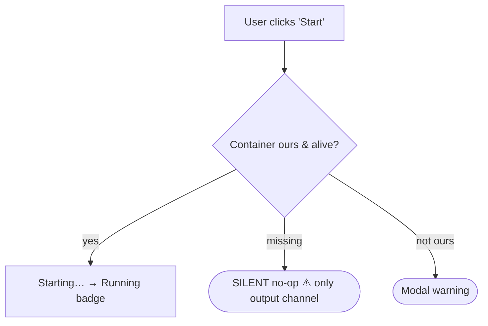

# UX PR Review (agent-assisted)

A UX review is different from a code review: the value comes from **actually using the
extension and walking real user journeys**, not from reading a diff. The pattern is a
**person paired with an agent** — the person drives the UX and reports what they see; the
agent reads the code, verifies each claim against it, keeps the running log, and maintains
the todo list.

This skill has **two modes**:

1. **Prepare (pre-assessment)** — triggered up front. The agent inventories the feature's
   user interactions, draws where each flow **starts and terminates**, pre-discovers
   **flow inconsistencies** (modal vs. non-modal vs. silent), seeds the review document,
   and hands off to the operator with an executive summary.
2. **Live review** — the operator exercises the feature and dictates observations; the
   agent verifies against code, records each finding, and keeps the priority index + todo
   list current.

> The full document skeleton lives in [references/review-document-template.md](./references/review-document-template.md).
> The pre-discovery checklist lives in [references/inconsistency-checklist.md](./references/inconsistency-checklist.md).
> Worked examples: [`docs/ai-and-plans/PRs/documentdb-quickstart/ux-review.md`](../../../docs/ai-and-plans/PRs/documentdb-quickstart/ux-review.md) and [`docs/ai-and-plans/PRs/621-kubernetes-discovery/bugbash-090-kubernetes-ux-review.md`](../../../docs/ai-and-plans/PRs/621-kubernetes-discovery/bugbash-090-kubernetes-ux-review.md).

## When to Use

- The operator asks to **prepare** a UX review, or says they are about to start one.
- Reviewing the UX/workflow of a PR, branch, or feature by hand.
- Pairing live: the operator reports what they saw and asks you to investigate and update
  the todo list / review doc.

---

## Mode 1 — Prepare (do this when asked to "prepare")

Work through these steps, then stop and hand off. **Do not start critiquing individual
pixels yet** — the goal is to give the operator a seeded document and a map of the flows.

### Step 1 — Identify the review target

Determine the PR number, branch, and the **feature surface** (the source folders that
implement it). If not given, ask which PR/branch. Read `package.json` menus/commands, the
tree items, the webview components, and the command handlers for that surface.

### Step 2 — Inventory the user interactions

List every place the user can **act** on this feature: tree nodes and their context menus,
empty-state rows, wizard steps / quick picks, webview buttons, commands, drag-and-drop.
For each, note the **entry point** (how the user gets there) and the **terminal state**
(success, error, silent no-op, dialog, tree refresh, new panel).

### Step 3 — Draw where flows start and terminate

Produce a **Mermaid `flowchart`** in the document's "User interaction map" section: nodes
for each user action/state, edges for transitions, and **explicit terminal nodes** for
every outcome (success toast, modal error, silent no-op, tree badge). Mark inconsistent
terminations so they stand out.

The point of the diagram is to make **asymmetric terminations obvious**: if one branch
ends in a modal, another in a passive tree row, and a third in nothing at all, the diagram
should show it at a glance.

### Step 4 — Pre-discover flow inconsistencies

Before the operator touches the feature, sweep the code for the inconsistencies UX reviews
most often catch (full list in [references/inconsistency-checklist.md](./references/inconsistency-checklist.md)).
The headline one:

> **Error/feedback surface inconsistency** — the same _class_ of event is surfaced three
> different ways across the feature: sometimes a **modal** (`showErrorMessage(…, { modal: true })`),
> sometimes a **non-modal** toast/warning, sometimes a **passive tree row**, and sometimes
> **nothing at all** (a silent early-return with only output-channel text). List every
> occurrence with its file reference and flag the divergences. The house style across
> shipped discovery providers is: **errors → modal + output channel; tree rows → actions
> only; a single canonical "Click here to retry" node.**

Seed these as **Flag** items in the document so the operator can confirm them live.

### Step 5 — Seed the review document

Create the file at **`docs/ai-and-plans/PRs/{pr-number}-{slug}/ux-review.md`** (or
`ux-review-iteration-N-{topic}.md` for follow-up iterations). Use the full skeleton in
[references/review-document-template.md](./references/review-document-template.md):
header block, "How this review was run", the **Legend** (Priority + Status + Markers), the
**User interaction map** (the diagram from Step 3), "The story in one paragraph", the
**Priority index** table, the P0→P3 + Implemented section stubs (pre-filled with the Step-4
Flags as `🟠 Open`), an **Open ideas** section, and an **Appendix** for the flow reference.

> This document is committed. `docs/ai-and-plans/PRs/` is tracked — do **not** place it in
> `docs/plan/` or `docs/analysis/` (those are git-ignored). Never `git add -f`.

### Step 6 — Executive summary + hand-off

End your turn with a short **executive summary of the pre-assessment**:

- the feature surface and the flows you mapped;
- how many pre-discovered Flags you seeded, grouped by suspected severity;
- the top inconsistencies to confirm (especially error-surface asymmetry);
- **where the seeded file is**, and an explicit invitation: _"The pre-seeded review doc is
  at `<path>`. Start the hands-on investigation — exercise the feature and tell me what you
  see; I'll verify each observation against the code and keep the doc and todo list
  updated."_

Do not proceed to deep per-item analysis until the operator starts driving.

---

## Mode 2 — Live review loop

For each observation the operator reports:

1. **Verify against code.** Trace the exact code path that produces the behavior. Never
   record a finding you have not confirmed in the source.
2. **Record the item** in the correct priority section using the four-part shape:
   - **Observation** — what the reviewer saw (their words).
   - **Finding** — what the code does and why, with file references and `⚠️`/`🔍` markers.
   - **Suggestion** (💡) — the recommended direction. If the operator has a lean, capture it
     as a blockquote _"TN leans towards … because …"_ and keep the status **Open** (it is a
     suggestion, not a decision).
   - **Status** — 🟠 Open / 🟡 Open (soft) / ✅ Implemented.
3. **Update the Priority index** table and the **todo list** (`manage_todo_list`) so the
   operator always sees remaining items at a glance.
4. **Heavy trade-offs → Open ideas.** When a finding has real design options, add an
   `O#` entry with a **pros/cons table** and a suggested option rather than deciding inline.
5. **Out-of-scope → issues.** If a finding is beyond the PR's scope or would risk delaying
   the merge, offer to file a repo issue and link it from the log instead of expanding scope.
6. **Phase the work.** Review one user journey at a time (first-run/empty state → adding →
   presentation → connectivity → destructive actions), closing each out before the next, so
   context stays lean.

If the operator asks for tests to lock in an agreed behavior, add them as the finding lands.

---

## Mode 3 — Fixing in iterations

Once the operator starts choosing fixes, the review runs in **iterations**. Each iteration
is a numbered pass over the open items; anything **not resolved in an iteration is carried
forward to the next one** so nothing is ever silently dropped. The document is the ledger:
an item leaves it only by becoming **Implemented**, **Closed** (won't-fix, with a reason),
or **filed as a repo issue** (with a link).

### The iteration loop

1. **Group the current iteration.** Under an `## Iteration N` heading (or per-item
   `➡️ Iteration N` sub-entries, as the K8s review does), list the items being worked this
   pass. Everything still `🟠 Open` after the pass rolls into `## Iteration N+1`.
2. **Capture the decision — and its _reason_ — before coding.** When the operator picks a
   fix, **ask them why**. Record their choice _and_ the reasoning inline on the item as a
   **Decision** block:

   > **Decision (Iteration N):** {{what was chosen}}. **Reason:** {{operator's rationale}}.

   > **Remind the operator:** _"This reasoning is the real value of the review — it's what
   > lets future maintainers and contributors understand **why** the code looks the way it
   > does. A one-line 'because …' now saves a re-litigation later."_ Never invent a
   > rationale; if the operator hasn't given one, ask for it and wait.

3. **Implement one item at a time.** Follow the code-review discipline in
   [CONTRIBUTING.md](../../../CONTRIBUTING.md) §6.3: report progress inline; if you deviate
   from the plan, document why; only proceed when confidence is high, otherwise stop and ask.
   **Commit each item individually — no mass commits.**
4. **Document the fix with a commit reference.** After the item is committed, flip its status
   to `✅ Implemented` and append an **Implemented** block that says what changed, the files
   touched, and a **link to the commit**:

   > ✅ **Implemented (Iteration N):** {{what was done}}. Files: {{links}}.
   > Commit: [`{{short-sha}}`]({{commit url}}). Verified via {{lint / tests / build}}.

   If the fix answers a Copilot-reviewer comment or a repo issue, post the same summary there
   and link it back from the item.

5. **Carry forward the remainder.** At the end of the iteration, update the **Priority
   index** (status column) and the **todo list** so every unresolved item is explicitly
   parked in the next iteration. An item is never removed from the ledger without a terminal
   status.

### Terminal states for an item

| Outcome                 | How it's recorded                                                            |
| ----------------------- | ---------------------------------------------------------------------------- |
| Fixed on this branch    | `✅ Implemented` + Decision block + Implemented block with commit link       |
| Won't fix               | `🚫 Closed` + a one-line **reason** (this reason is mandatory)               |
| Deferred / out-of-scope | Filed as a repo issue, `🔗 Tracked` + issue link; removed from active P-list |
| Still open              | Stays `🟠 Open` and **moves to the next iteration**                          |

### After merge

Stamp the log with a short reconciliation note pointing to the current source of truth (user
manual / pre-merge code review), so a stale iteration is never mistaken for current behavior.

---

## Severity & status legend (use exactly these)

**Priority**

| Priority | Meaning                                            |
| -------- | -------------------------------------------------- |
| **P0**   | Blocking — the user gets stuck                     |
| **P1**   | Broken / misleading, or a consistency & safety gap |
| **P2**   | Polish, expectation, or a smaller feature gap      |
| **P3**   | Nice-to-have / cosmetic / acknowledged             |

**Status**

| Status             | Meaning                                                                  |
| ------------------ | ------------------------------------------------------------------------ |
| 🟠 **Open**        | Recorded + analyzed; carries a recommendation but stays a _suggestion_   |
| 🟡 **Open (soft)** | Open, but the recommendation depends on an investigation or is "as-is"   |
| ✅ **Implemented** | A change was made on this branch and verified (Decision + commit link)   |
| 🚫 **Closed**      | Won't fix — with a mandatory one-line reason                             |
| 🔗 **Tracked**     | Deferred to a repo issue (linked); dropped from the active priority list |

**Inline markers**

| Marker            | Meaning                                                 |
| ----------------- | ------------------------------------------------------- |
| ⚠️ **Flag**       | Confirmed gap or bug                                    |
| 💡 **Suggestion** | A design/wording recommendation to react to             |
| 🔍 **Answered**   | A "how does this work?" question answered from the code |

---

## Conventions

- **Terminology:** "DocumentDB" for the service; "MongoDB API" / "DocumentDB API" for the
  wire protocol. Never "MongoDB" alone.
- **File references:** link the exact file (and line where useful) that produces each
  behavior so a later implementation pass does not have to re-derive it.
- **Recommendations are suggestions, not decisions.** The operator (author) owns the call;
  record their reasoning inline. This is what lets future maintainers understand _why_.
- **Reconcile after merge.** A running log goes stale the moment behavior changes. When the
  work merges, stamp the log with a note pointing to the current source of truth (user
  manual / pre-merge code review).
