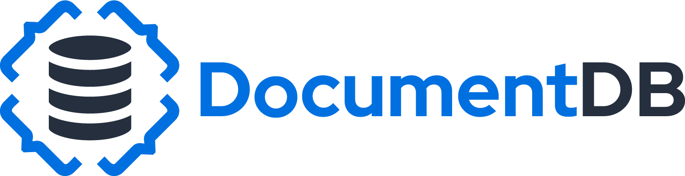
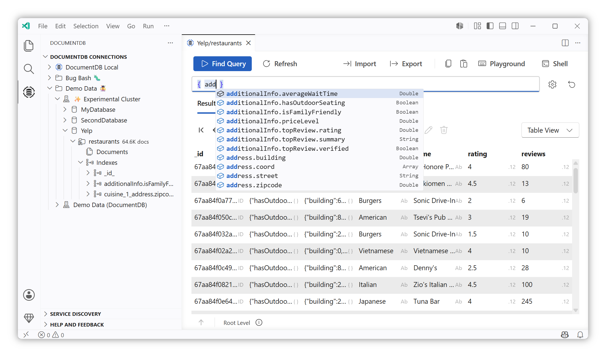
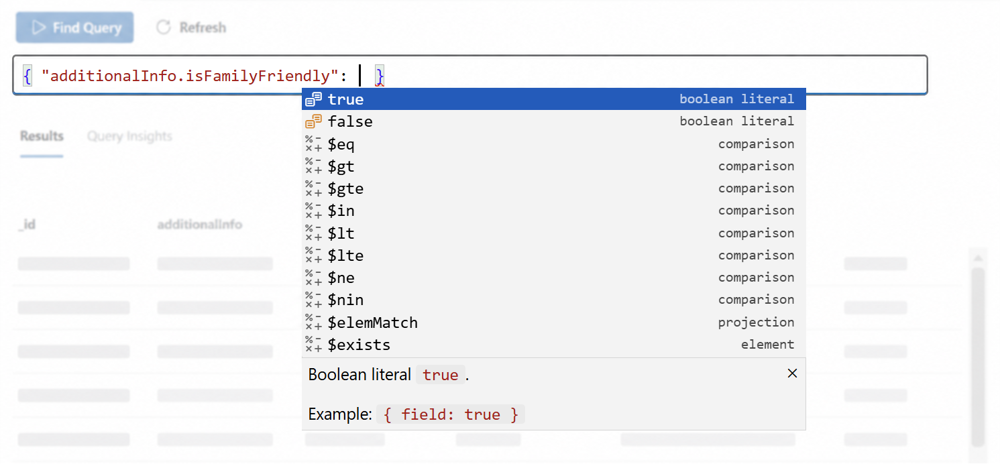
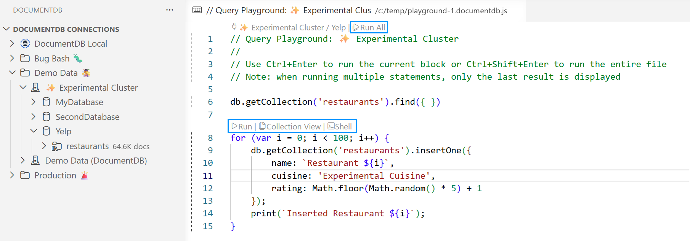
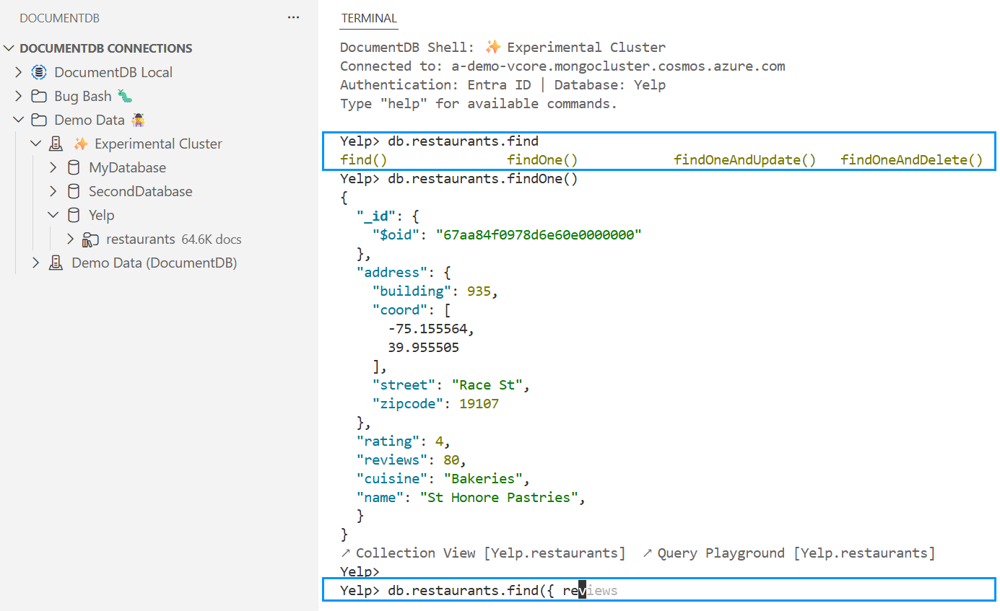
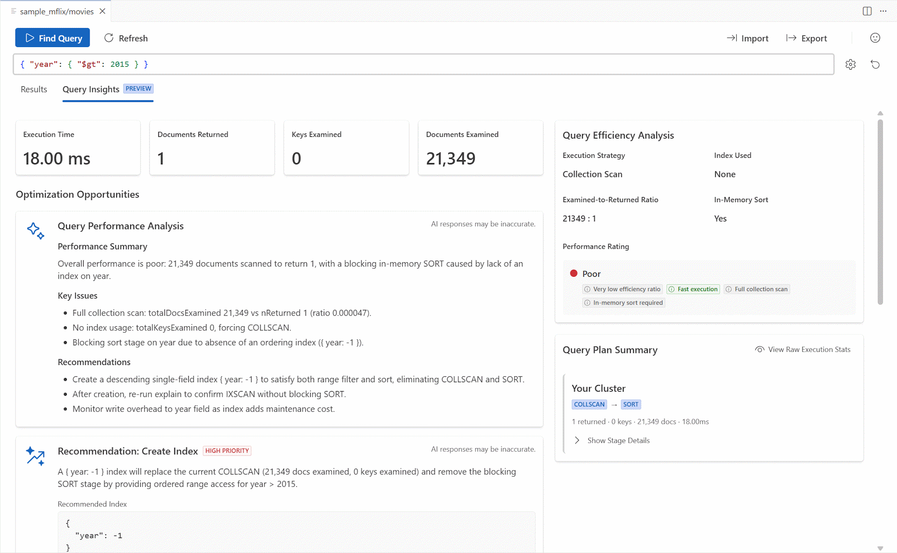

# DocumentDB for VS Code

<!-- region exclude-from-marketplace -->

<!-- endregion exclude-from-marketplace -->

**A powerful, open-source GUI for DocumentDB and MongoDB API databases.**

**DocumentDB for VS Code** is a VS Code extension for browsing, querying, and managing databases that use the **MongoDB API wire protocol**. DocumentDB is fully compatible with the MongoDB API, so this extension works with **any MongoDB API database**: [DocumentDB](https://documentdb.io), Azure DocumentDB, AWS DocumentDB, Azure Cosmos DB for MongoDB (RU), MongoDB Atlas, self-hosted instances, and local emulators.

Connect with a connection string, browse through cloud service discovery, or use a local emulator. Everything runs inside VS Code with no external tools required.

# Features

## Query Your Data, Your Way

Three integrated query surfaces let you work with your data however you prefer: visually, in scripts, or at a command line. All three share the same schema awareness and are linked with navigation actions, so you can move your work between them seamlessly.

### Collection View

The visual query interface with filter, project, and sort editors. As you type, the editor suggests **field names** from your collection's actual data, **operators** sorted by relevance to each field's type, and **values** appropriate for the context. Hover over any operator to see its documentation.

- Schema-aware field suggestions with BSON type indicators
- Type-aware operator ordering (comparison operators first for numbers, regex for strings)
- Relaxed query syntax: unquoted keys, single quotes, BSON constructors (`ObjectId()`, `ISODate()`), JavaScript expressions
- Real-time validation with typo detection ("Did you mean `ObjectId`?")
- Dedicated completions for project (`1`/`0`) and sort (`1`/`-1`) values

### Query Playground

Write and run JavaScript scripts in `.documentdb.js` files with CodeLens-driven execution. Each script block has its own **Run** button, and there's a **Run All** at the top. Results appear in a dedicated side panel.

- Full JavaScript syntax with autocompletion for `db.*` chains, collection methods, and schema fields
- `console.log()`, `print()`, and `printjson()` support
- Per-file connections: multiple playgrounds open simultaneously, each connected to a different server
- CodeLens links to open the same query in the Collection View or Interactive Shell

### Interactive Shell

A REPL terminal inside VS Code with shell commands (`show dbs`, `use <db>`, `help`, `it`), persistent variables, syntax highlighting, and tab completion with ghost text suggestions.

- Context-aware tab completion for databases, collections, methods, operators, and field names
- Ghost text suggests closing brackets, collection methods, and field names from your schema
- `Ctrl+C` cancellation for long-running operations
- Clickable links in results to open the collection in Collection View or Query Playground

### Zero-Install Runtime

The Query Playground and Interactive Shell require **no external tools**. The query runtime is bundled directly into the extension and reuses the connection you already established. This means:

- No shell executable to install, no PATH configuration, no version mismatches
- Works with **Entra ID authentication** out of the box
- Works identically on Windows, macOS, and Linux

Schema information for autocompletion is gathered locally from documents you browse and query. No data is sent to external services.

## Connect Anywhere

Connect to any database that speaks the MongoDB API wire protocol.

- **Connection strings**: Paste a connection string and connect instantly
- **Azure Service Discovery**: Browse and connect to Azure DocumentDB, Azure Cosmos DB for MongoDB (RU), and DocumentDB on Azure VMs directly from the sidebar
- **MongoDB Atlas**: Connect using your Atlas connection string
- **Entra ID authentication**: Multi-account, multi-tenant support for Azure-hosted databases
- **Local instances and emulators**: Connect to DocumentDB Local, Azure Cosmos DB Emulator, or any local MongoDB API instance
- **Folder organization**: Group your connections into folders and subfolders

## Browse and Manage Data

- **Multiple data views**: Inspect collections using **Table**, **Tree**, or **JSON** layouts with built-in pagination
- **Document management**: Create, edit, and delete documents directly from VS Code
- **Import and export**: Import JSON files or export documents, query results, or entire collections
- **Collection copy-and-paste**: Copy a collection and paste it into another database or server, with conflict resolution strategies
- **Index management**: View, create, hide, unhide, and drop indexes from the tree view

## Query Insights

Analyze query performance with explain plans and get optimization recommendations.

- Static performance analysis with selectivity, fetch overhead, and index coverage metrics
- Three-color badge system highlighting what's working well and what needs attention
- AI-powered index recommendations (experimental, opt-in via settings)

> AI-powered recommendations require the [GitHub Copilot](https://marketplace.visualstudio.com/items?itemName=GitHub.copilot) extension and an active Copilot subscription.

## Open Source and Extensible

We believe in building in the open. All development, roadmap planning, and feature discussions happen publicly on GitHub. Your feedback, contributions, and ideas shape the future of the extension.

- **Service Discovery plugins**: Connect to databases hosted on any cloud provider through the extensible plugin architecture
- **Data migration providers**: Third-party extensions can register as migration providers for specialized data movement workflows
- **Community contributions**: We welcome PRs, bug reports, and feature requests

# Prerequisites

No external tools or runtimes are required. Install the extension and start working.

<!-- region exclude-from-marketplace -->

#### References

- [DocumentDB](https://github.com/microsoft/documentdb)

# How to Contribute

To contribute, see these documents:

- [Code of Conduct](./CODE_OF_CONDUCT.md)
- [Security](./SECURITY.md)
- [Contributing](./CONTRIBUTING.md)

## Legal

Before we can accept your pull request, you will need to sign a **Contribution License Agreement**. All you need to do is to submit a pull request, then the PR will get appropriately labeled (e.g. `cla-required`, `cla-norequired`, `cla-signed`, `cla-already-signed`). If you already signed the agreement, we will continue with reviewing the PR, otherwise the system will tell you how you can sign the CLA. Once you sign the CLA, all future PRs will be labeled as `cla-signed`.

## Code of Conduct

This project has adopted the [Microsoft Open Source Code of Conduct](https://opensource.microsoft.com/codeofconduct/). For more information, see the [Code of Conduct FAQ](https://opensource.microsoft.com/codeofconduct/faq/) or contact [opencode@microsoft.com](mailto:opencode@microsoft.com) with any additional questions or comments.

## Trademarks

This project may contain trademarks or logos for projects, products, or services. Authorized use of Microsoft trademarks or logos is subject to and must follow Microsoft's Trademark & Brand Guidelines. Use of Microsoft trademarks or logos in modified versions of this project must not cause confusion or imply Microsoft sponsorship. Any use of third-party trademarks or logos are subject to those third-party's policies.

<!-- endregion exclude-from-marketplace -->

# Telemetry

VS Code collects usage data and sends it to Microsoft to help improve our products and services. Read our [privacy statement](https://go.microsoft.com/fwlink/?LinkId=521839) to learn more. If you don't wish to send usage data to Microsoft, you can set the `telemetry.telemetryLevel` setting to `off`. Learn more in our [FAQ](https://code.visualstudio.com/docs/supporting/faq#_how-to-disable-telemetry-reporting).

# Feedback Collection

DocumentDB for VS Code proactively asks for user feedback and provides feedback entry points in the UI. Feedback collection is controlled by VS Code's global telemetry setting.

To disable feedback, set `telemetry.telemetryLevel` to a value other than `all` (e.g., `error` or `off`). Feedback is only active when the level is set to `all`.

# License

[MIT](LICENSE.md)
