# DocumentDB for VS Code

<!-- region exclude-from-marketplace -->

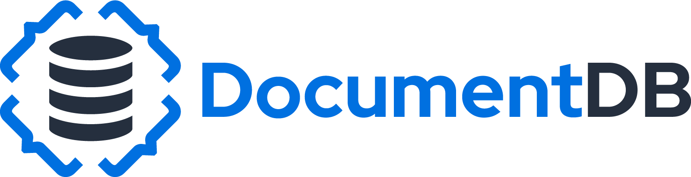

> **Built in the open, with you.** DocumentDB for VS Code is open source under the MIT license. The roadmap, the design discussions and every change happen right here on GitHub.
>
> - ⬇️ **Install it** from the [Visual Studio Marketplace](https://marketplace.visualstudio.com/items?itemName=ms-azuretools.vscode-documentdb), or search for "DocumentDB" in the VS Code Extensions view
> - 🐞 **Found a bug or missing a feature?** [Open an issue](https://github.com/microsoft/vscode-documentdb/issues/new)
> - 💡 **Want to help?** Pick an [open issue](https://github.com/microsoft/vscode-documentdb/issues), read the [contributing guide](./CONTRIBUTING.md) and send a pull request
> - ⭐ **Like it?** Star the repository, it helps others find the project
> - 📰 **What's new:** [release notes](https://microsoft.github.io/vscode-documentdb/release-notes/1.0)

<!-- endregion exclude-from-marketplace -->

**The free, open-source DocumentDB GUI and MongoDB GUI for VS Code.**

Browse, query and manage your data without leaving your editor. One extension for all three:

| **Azure DocumentDB**                                                                   | **DocumentDB**                                                                                       | **MongoDB**                                                                            |
| -------------------------------------------------------------------------------------- | ---------------------------------------------------------------------------------------------------- | -------------------------------------------------------------------------------------- |
| Azure DocumentDB and Azure Cosmos DB for MongoDB (RU), with Microsoft Entra ID sign-in | The open-source [DocumentDB](https://documentdb.io) engine: on your laptop, on a VM or in Kubernetes | MongoDB Atlas, self-hosted MongoDB, and any other database that speaks the MongoDB API |

🎉 **Version 1.0 is here**, released alongside DocumentDB 1.0. See [what's in 1.0](https://microsoft.github.io/vscode-documentdb/release-notes/1.0).

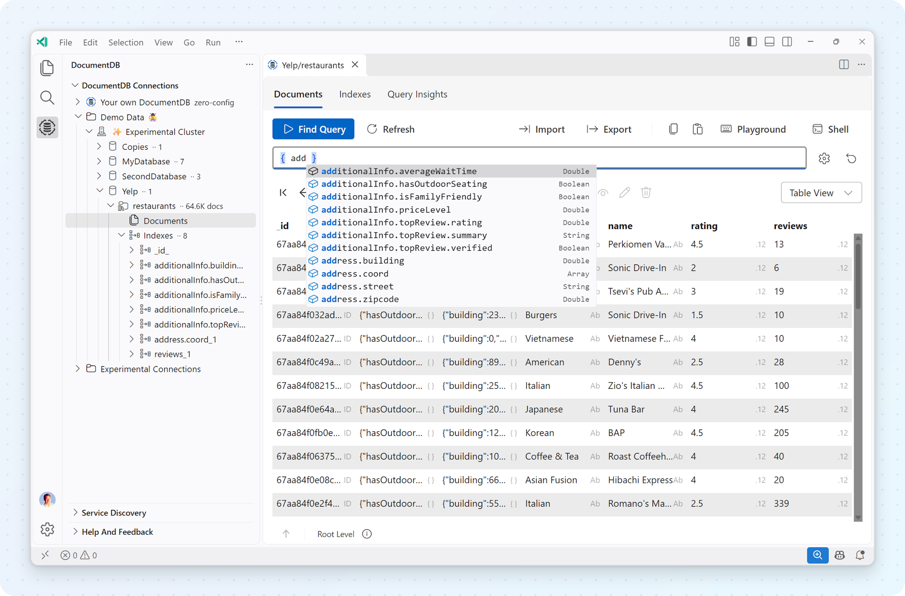

# Get Started in a Minute

Pick whichever way matches where your data lives:

- **Paste a connection string** in the **Connections** view and connect
- **Discover your databases** in Azure, MongoDB Atlas or Kubernetes from the **Service Discovery** view, without copying endpoints
- **No database yet?** Start **DocumentDB Local** with one click and get a running database with sample data

Nothing else to install: the shell and the query runtime are built in. DocumentDB Local is the only feature that needs Docker.

# Features

## Query Your Data, Your Way

Three connected ways to work with the same query: visually, in a script, or at a command line. All three understand your data's schema, and one click moves your query from one to the other.

### Collection View

The visual query editor with filter, project and sort fields. As you type, it suggests **field names** from your actual data, **operators** that fit each field's type, and suitable **values**. Hover over an operator to see its documentation. Look at results as a **Table**, a **Tree** or **JSON**, and create, edit or delete documents in place (the screenshot at the top of this page shows the Collection View).

- Relaxed query syntax: unquoted keys, single quotes, `ObjectId()`, `ISODate()` and JavaScript expressions
- Real-time validation that catches typos ("Did you mean `ObjectId`?")
- Pagination and quick actions for the documents you select

### Query Playground

Write JavaScript in `.documentdb.js` files and run each block with its own **Run** button, or all of them with **Run All**. Results appear in a side panel.

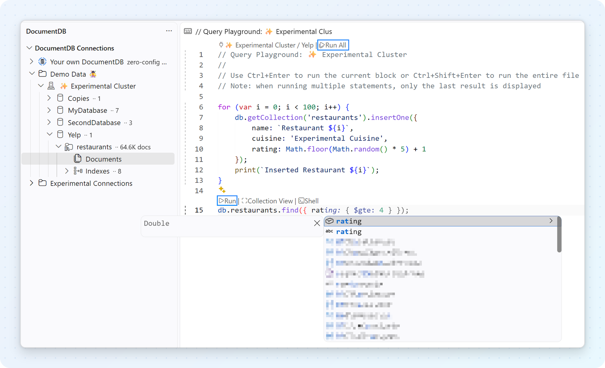

- Autocompletion for `db.*` chains, collection methods and your schema's field names
- Several playgrounds open at once, each connected to a different server
- Save your queries as files and keep them in your project

### Interactive Shell

A shell inside VS Code with `show dbs`, `use <db>`, `help` and `it`, persistent variables, syntax highlighting, and tab completion with ghost text suggestions.

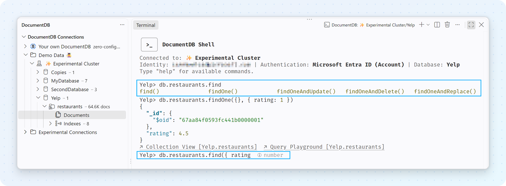

- Completion for databases, collections, methods, operators and field names
- `Ctrl+C` cancels long-running operations
- Links in the output open a collection in the Collection View or a Query Playground

The Query Playground and Interactive Shell need **no external tools**. The runtime is bundled with the extension and reuses your connection, including **Microsoft Entra ID** sign-in, on Windows, macOS and Linux. Schema information for autocompletion is collected locally from the documents you browse and is never sent to external services.

## Connect Anywhere

Your connections live in the **Connections** view, organized in folders you create. Sign in with a username and password, with **Microsoft Entra ID** (multiple accounts and tenants, or a managed identity on an Azure VM), or with no authentication for local development.

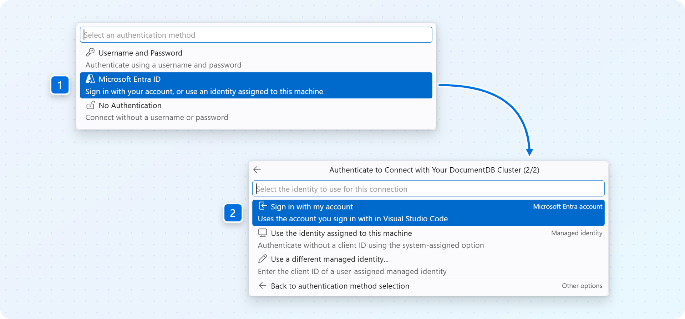

Already using the [Azure Resources](https://marketplace.visualstudio.com/items?itemName=ms-azuretools.vscode-azureresourcegroups) extension? Your Azure DocumentDB clusters and Azure Cosmos DB for MongoDB (RU) accounts also appear in the **Azure** view, next to the rest of your resources.

### DocumentDB Local

Run [DocumentDB](https://documentdb.io) on your own machine without writing a `docker run` command. Select **Set up DocumentDB Local** in the Connections view: the extension pulls the official image, creates a persistent volume, generates credentials, picks a free port, loads optional sample data and saves the connection for you.

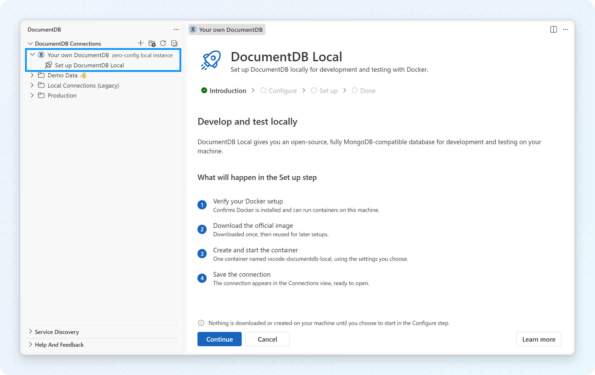

- Start, stop, restart and delete the instance from the Connections view
- If Docker isn't ready, the setup explains what to fix, for local machines, WSL, SSH, dev containers and Codespaces
- Works with Docker Engine or Docker Desktop. The extension never installs software or asks for elevated privileges

See [Set up DocumentDB Local](https://microsoft.github.io/vscode-documentdb/user-manual/local-quick-start) for details.

### MongoDB Atlas Service Discovery

Browse your Atlas organizations, projects and clusters from the sidebar, and connect to any cluster without copying endpoints by hand.

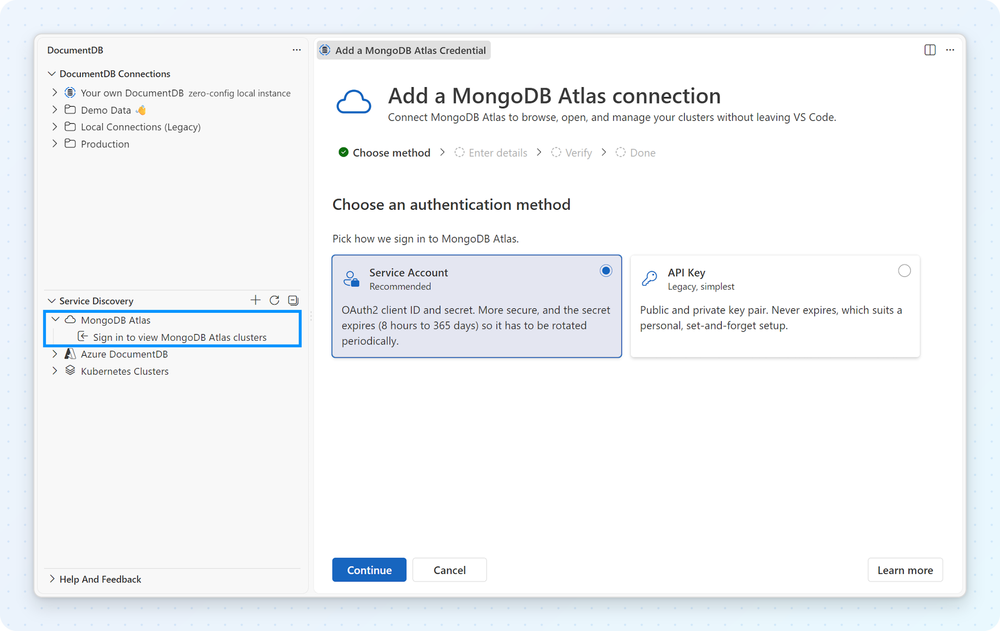

- Sign in with an Atlas **Service Account** or **API Key**, verified before it is stored
- Add one credential per organization and see all their clusters together, as a tree or a flat list
- Paused, creating and updating clusters are labeled, so you don't wait on a connection that can't succeed
- **Open in MongoDB Atlas** takes you straight to the cluster's page in the Atlas console

The Atlas credential is only used to find clusters. You still connect with your Atlas database user. See [MongoDB Atlas Service Discovery](https://microsoft.github.io/vscode-documentdb/user-manual/service-discovery-mongodb-atlas) for the full guide.

### Kubernetes Service Discovery

Find DocumentDB clusters running in Kubernetes, from AKS, EKS and GKE to kind, minikube and Docker Desktop, without writing connection strings or running `kubectl port-forward` yourself.

- Clusters managed by the DocumentDB Kubernetes Operator are recognized automatically
- Clusters that are only reachable inside Kubernetes get a port forward that is opened and restored for you
- Use several kubeconfig sources side by side: the default file, a file from disk, or pasted YAML

See [Kubernetes Service Discovery](https://microsoft.github.io/vscode-documentdb/user-manual/service-discovery-kubernetes) for the full guide.

### Azure Service Discovery

Find Azure DocumentDB clusters, Azure Cosmos DB for MongoDB (RU) accounts and MongoDB-compatible databases on Azure VMs across your accounts, tenants and subscriptions. See [Service Discovery](https://microsoft.github.io/vscode-documentdb/user-manual/service-discovery) for details.

## Cluster Dashboard

See what's in a cluster at a glance. The dashboard shows whether it is connected, the round-trip time and, on Azure, its high-availability setup. Below that, an inventory lists every database and collection with its storage size, data size, index size and document count.

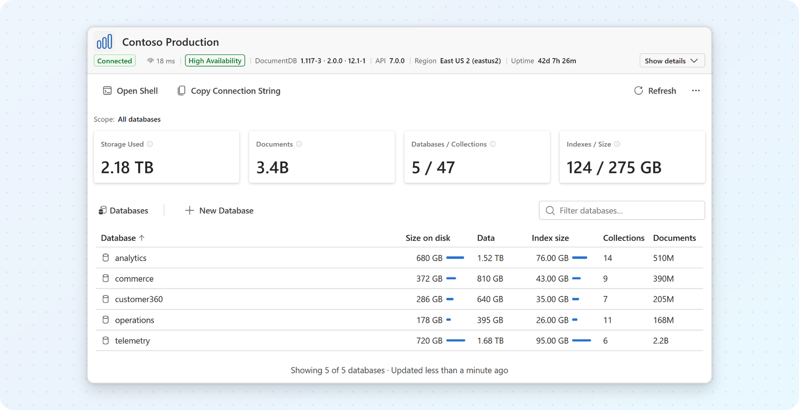

Sort and filter the list, drill into a database, create or delete databases and collections, open a shell, or copy the connection string.

## Query Insights

Find out why a query is slow. Run it in the Collection View and open the **Query Insights** tab:

1. **Query plan**: how the database intends to run the query, for example with an index or with a full collection scan
2. **Execution statistics**: documents and index keys examined, run time, and a Good, Fair or Poor rating
3. **AI recommendations**: GitHub Copilot explains what is happening and suggests changes, such as creating or hiding an index, which you can apply directly

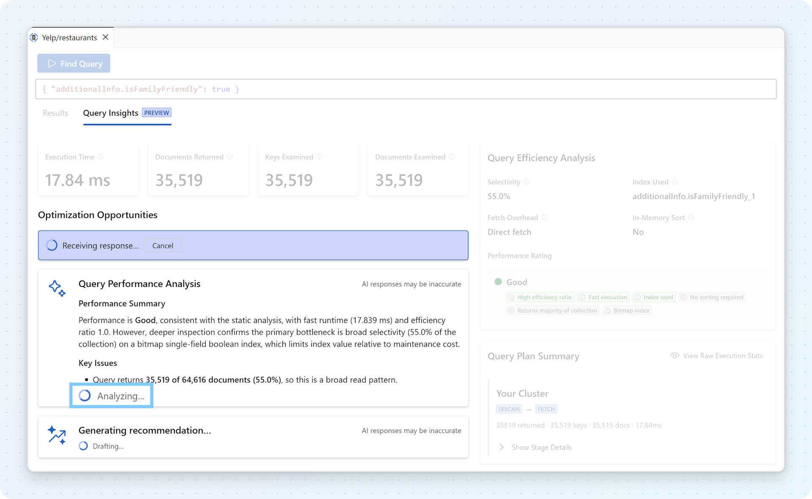

> AI recommendations require the [GitHub Copilot](https://marketplace.visualstudio.com/items?itemName=GitHub.copilot) extension. The extension sends the query shape and execution statistics, not your documents.

## Manage Indexes

The **Indexes** tab in the Collection View puts index work next to the queries it affects. Review what exists, create what is missing, and remove what is not earning its keep.

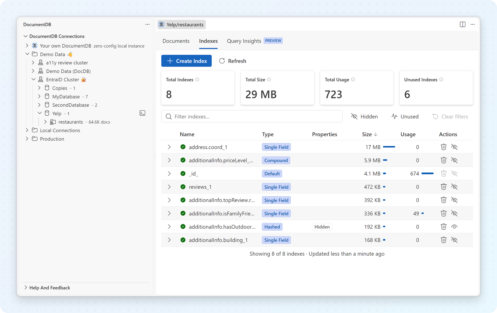

- Size and usage for every index, with quick filters for **Hidden** and **Unused** indexes
- Create **Standard**, **Wildcard** and **Vector** indexes with a guided form, and preview the definition as JSON
- **Hide** an index to test whether your queries still need it, before you delete it
- Send the generated command to a Query Playground or the Interactive Shell instead of running it directly

See [Manage Indexes in Collection View](https://microsoft.github.io/vscode-documentdb/user-manual/collection-view-index-management) for the full guide.

## Copy and Paste Collections

Copy a collection the way you copy files: right-click it and select **Copy Collection…**, then right-click a database on the same server or any other one and select **Paste Collection…**. Moving sample data from DocumentDB Local to a cloud cluster, or the other way around, takes just a few clicks.

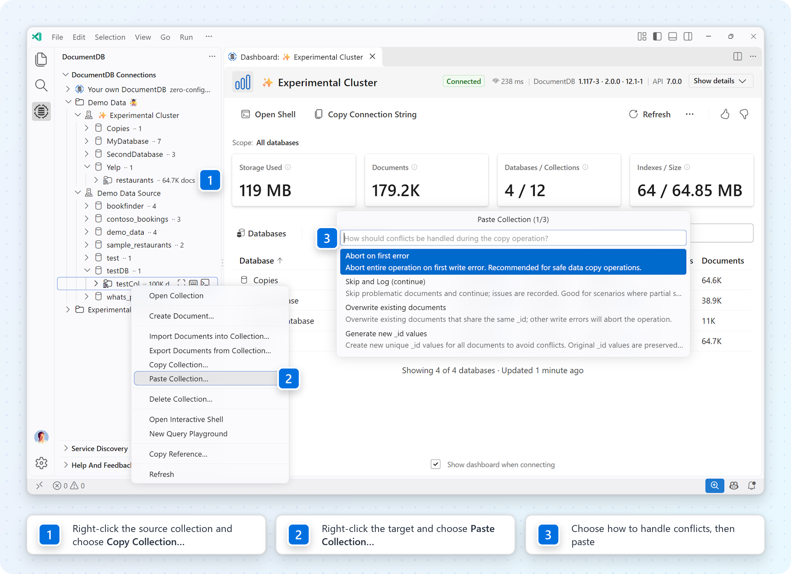

- Choose what happens when documents share an `_id`: abort, skip and log, overwrite, or generate new `_id` values
- Recreate the collection's indexes on the target, or copy and paste indexes on their own
- Designed for development and small to medium datasets. For large production migrations, use a dedicated migration service

See [Copy and Paste](https://microsoft.github.io/vscode-documentdb/user-manual/copy-and-paste) for details. You can also **import** JSON files into a collection and **export** documents, query results or entire collections.

## Open Source and Extensible

All development, roadmap planning and feature discussions happen publicly on [GitHub](https://github.com/microsoft/vscode-documentdb). Your feedback, bug reports, ideas and pull requests shape the extension.

- **Service Discovery plugins**: connect to databases hosted on any cloud provider through the plugin architecture
- **Data migration providers**: other extensions can register as migration providers for specialized data movement

# Prerequisites

No external tools or runtimes are required. Install the extension and start working. Only DocumentDB Local needs Docker (Docker Engine or Docker Desktop).

<!-- region exclude-from-marketplace -->

#### References

- [DocumentDB](https://github.com/microsoft/documentdb)
- [Documentation](https://microsoft.github.io/vscode-documentdb/)

# How to Contribute

To contribute, see these documents:

- [Code of Conduct](./CODE_OF_CONDUCT.md)
- [Security](./SECURITY.md)
- [Contributing](./CONTRIBUTING.md)

## Legal

Before we can accept your pull request, you will need to sign a **Contribution License Agreement**. All you need to do is to submit a pull request, then the PR will get appropriately labeled (e.g. `cla-required`, `cla-norequired`, `cla-signed`, `cla-already-signed`). If you already signed the agreement, we will continue with reviewing the PR, otherwise the system will tell you how you can sign the CLA. Once you sign the CLA, all future PRs will be labeled as `cla-signed`.

## Code of Conduct

This project has adopted the [Microsoft Open Source Code of Conduct](https://opensource.microsoft.com/codeofconduct/). For more information, see the [Code of Conduct FAQ](https://opensource.microsoft.com/codeofconduct/faq/) or contact [opencode@microsoft.com](mailto:opencode@microsoft.com) with any additional questions or comments.

## Trademarks

This project may contain trademarks or logos for projects, products, or services. Authorized use of Microsoft trademarks or logos is subject to and must follow Microsoft's Trademark & Brand Guidelines. Use of Microsoft trademarks or logos in modified versions of this project must not cause confusion or imply Microsoft sponsorship. Any use of third-party trademarks or logos are subject to those third-party's policies.

<!-- endregion exclude-from-marketplace -->

# Telemetry

VS Code collects usage data and sends it to Microsoft to help improve our products and services. Read our [privacy statement](https://go.microsoft.com/fwlink/?LinkId=521839) to learn more. If you don't wish to send usage data to Microsoft, you can set the `telemetry.telemetryLevel` setting to `off`. Learn more in our [FAQ](https://code.visualstudio.com/docs/supporting/faq#_how-to-disable-telemetry-reporting).

# Feedback Collection

DocumentDB for VS Code proactively asks for user feedback and provides feedback entry points in the UI. Feedback collection is controlled by VS Code's global telemetry setting.

To disable feedback, set `telemetry.telemetryLevel` to a value other than `all` (e.g., `error` or `off`). Feedback is only active when the level is set to `all`.

# License

[MIT](LICENSE.md)
