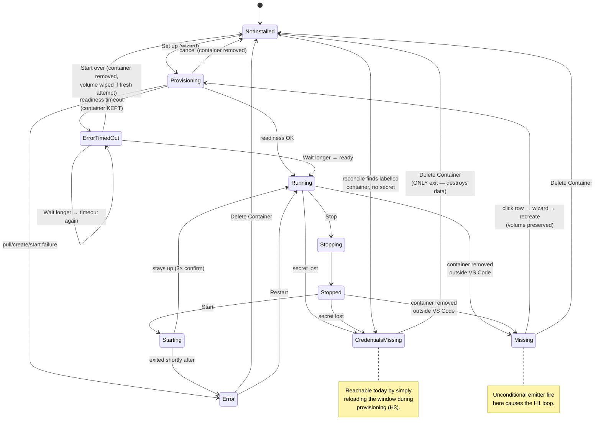

# PR #798 — DocumentDB Local with Quick Start helpers — Code Review

**Date:** 2026-08-04
**PR:** [#798](https://github.com/microsoft/vscode-documentdb/pull/798) — `feature/local-quickstart` → `release/0.10.0`
**Scope reviewed:** 107 files, +20 897 / −230 (diff against `origin/release/0.10.0`, not `main`)

**Review focus (as requested):** edge cases, and paths where invalid / unexpected input or state can break the
experience — on top of the standard code review.

**External feedback merged:** the GitHub Copilot reviewer's feedback on the PR page has been fetched, assessed
and folded in — see **M7** and the thread tracker in [§6](#6-external-review-threads-to-respond-to).

---

## 0. Status board — what to implement now vs. what is on hold

> **If you are an implementation agent, this section is your entry point.**
> Implement **only** the ✅ TODO items. Everything marked 🛑 ON HOLD is blocked on a maintainer decision or on
> another package — do not start it, do not "helpfully" fix it in passing, and do not refactor code it will touch.
>
> **UPDATE (2026-08-06): every cleared package has landed.** WP-1 … WP-5 are implemented and committed, each
> with its own commit and an `IMPLEMENTED` note beside its finding in §3. Nothing in the ✅ column is outstanding.
> The next step is the §9.2 discussion (and the §9.3 confirmation), which unblocks WP-6/7/8 and M7's thread reply.

### ✅ Cleared for implementation (all landed 2026-08-05/06)

| WP       | Title                                | Findings                   | Status                                                         |
| -------- | ------------------------------------ | -------------------------- | -------------------------------------------------------------- |
| **WP-1** | Tree refresh correctness             | H1                         | ✅ `fix(quickstart): fire the Missing status change only on…`  |
| **WP-2** | TLS exception policy correction      | H2, L4                     | ✅ `fix(tls): keep a deliberate TLS bypass for public hosts`   |
| **WP-3** | Provisioning durability & port model | H3, H4, L3, M5, L1, N5, N6 | ✅ `feat(quickstart): explicit port model and durable…`        |
| **WP-4** | Localization                         | M1, M2, N2                 | ✅ `fix(quickstart): localize the webview lookups and…`        |
| **WP-5** | Command surface & small fixes        | M3, L5, L6, L7, L8, L9     | ✅ `fix(quickstart): palette gating, log-follow disposal and…` |
| **WP-9** | Repository issues                    | —                          | ✅ Already done ([#864], [#865])                               |

[#864]: https://github.com/microsoft/vscode-documentdb/issues/864
[#865]: https://github.com/microsoft/vscode-documentdb/issues/865

### 🛑 On hold — re-assessed and re-cut 2026-08-06

> **RE-ASSESSED 2026-08-06 — see [§10](#10-re-assessment-of-the-on-hold-items-after-wp-1--wp-5-2026-08-06).**
> **M4 → option E** and **M6 → option B** are now decided (§10.6). Three packages came off hold: **WP-6a**,
> **WP-7a** and **WP-8** (with **M6-b**). **L2** was resolved by WP-3.

> **UPDATE 2026-08-06 (third pass): §9.2 is fully resolved — nothing is on hold any more.** The scope is fixed
> at **one managed instance** (multi-instance explicitly out of scope), which also settled the record shape and
> unblocked the credential-store consolidation. **WP-7b dissolved**: its tree-state half became the error-node
> work, its multi-instance half is out of scope.
>
> **➡ All three iterations are closed**, and every finding routed through §11 is resolved. Iteration 2 shipped
> nine items and closed L2 by verification; Iteration 3 shipped the credential-store consolidation;
> [§11.6][it-post] records three fixes found afterwards by actually running the extension, including one
> shipped bug and one finding (**N1**) that had been recorded as resolved when it was not. What is left is the
> deferred pool in [§11.5][it3] — none of it blocking, none of it release work. Start there, not from this
> table.

| WP        | Title                                   | Findings | Status                                                |
| --------- | --------------------------------------- | -------- | ----------------------------------------------------- |
| **WP-6a** | H5 fix only (prime the cache)           | H5       | ✅ **CLEARED** — Iteration 1, **I1-1**                |
| **WP-7a** | Recreate-vs-fresh choice (option **E**) | M4, N1   | ✅ **CLEARED** — Iteration 1, **I1-2**                |
| **WP-8**  | Tree render cost (option **B**) + M6-b  | M6, M6-b | ✅ **CLEARED** — Iteration 1, **I1-5** / **I1-6**     |
| **WP-6b** | Credential store consolidation          | H5, M7   | ✅ **UNBLOCKED 2026-08-06** — Iteration 1, **I1-8**   |
| **WP-7b** | _(dissolved)_                           | N3       | Tree states → **I1-4**; multi-instance → out of scope |

### ⛔ Explicitly not being fixed

| ID     | Reason                                                                                          |
| ------ | ----------------------------------------------------------------------------------------------- |
| **B1** | Footer user-test still running — keep the switch and the `USER-TEST PROTOTYPE` markers          |
| **N2** | Copy is approved verbatim from documentdb.io — only add a code comment saying so (part of WP-4) |
| **N7** | Docs consolidation handled by a separate work item                                              |

**Workflow:** WP-1…WP-5 are done. The discussion now resumes on §9.2 (and the §9.3 confirmation), after which
WP-6/7/8 are unblocked and M7's GitHub thread reply is finalized.

---

## 1. Verification performed

| Step                    | Command                  | Result                                        |
| ----------------------- | ------------------------ | --------------------------------------------- |
| Tests                   | `npx jest --no-coverage` | ✅ 202 suites / 3308 tests pass               |
| Lint                    | `npm run lint`           | ✅ clean (one pre-existing `eslint-env` warn) |
| Build                   | `npm run build`          | ✅ clean (workspaces + `tsc`)                 |
| Localization extraction | (bundle inspected)       | ✅ strings present in `l10n/bundle.l10n.json` |

Note: green CI does **not** cover the findings below — most of them are integration/lifecycle behaviours that the
unit tests mock out (`IContainerRuntime`, `ext.secretStorage`, the tree provider), or are host/webview wiring
issues that no test exercises.

---

## 2. Overall assessment

The architecture is genuinely good. The service/runtime split (`IContainerRuntime` injected into
`QuickStartServiceImpl`) makes a Docker-heavy feature unit-testable; secret handling is careful (env-file instead
of argv, line-buffered output masking, metadata stripped at the tRPC boundary); the destructive paths are
defensively gated (label + alias ownership checks, `propagateErrors` on Delete so "can't verify" is never
mistaken for "already gone"); and the readiness-diagnosis subsystem is unusually thorough.

The findings below are concentrated in three areas:

1. **State-machine edges that only appear when the world changes underneath the extension** (container removed
   externally, window reloaded mid-provision, stopped instance restarted after a reload, two windows racing).
2. **Localization wiring** — a large share of the new user-facing strings never reach the translation pipeline at
   runtime.
3. **Release hygiene** — a user-test prototype toggle is currently shipped in the UI.

---

## 3. Findings

Severity scale: **Blocker** (must fix before merge) · **High** · **Medium** · **Low** · **Nit**.

---

### B1 — Prototype "Footer experiment" switch + PREVIEW badge is shipped in the UI

**Severity: Blocker (release hygiene)**

`src/webviews/documentdb/localQuickStart/LocalQuickStart.tsx` renders an always-visible, absolutely-positioned
switch labelled "Footer experiment" with a `PREVIEW` badge, plus the `ResizeObserver`-driven measurement logic
behind it. The code is explicitly marked as temporary:

```tsx
{/* USER-TEST PROTOTYPE: Remove this switch and badge with the footer experiment logic above. */}
<div className={styles.prototypeToggle}>
    <Switch checked={adaptiveFooterEnabled} label={l10n.t('Footer experiment')} ... />
    <Badge ...>PREVIEW</Badge>
</div>
```

It is the tip commit of the branch (`feat: add experimental adaptive footer feature with toggle and measurement
logic`). It also overlays the content area (`position: absolute; top: 16px; right: 24px`), so on a narrow panel
it can sit on top of the hero text, and it adds a `ResizeObserver` observing four elements on every phase change.

**Why it matters:** a shipped extension must not expose an unexplained A/B toggle. It also localizes two strings
("Footer experiment", "Footer experiment is in preview") that will end up in the translation bundle.

**Fix options**

| Option                                                                                                                                                | Pros                                                                                                                                             | Cons                                                                                          |
| ----------------------------------------------------------------------------------------------------------------------------------------------------- | ------------------------------------------------------------------------------------------------------------------------------------------------ | --------------------------------------------------------------------------------------------- |
| **A. Remove the switch, the `adaptiveFooterEnabled`/`footerDocked` state, `scrollAreaInlineFooter`, and keep only the elevation logic** (recommended) | Smallest surface, removes 2 strings from the bundle, drops one `ResizeObserver` target set. Decision can be made later from the user-test notes. | Loses the ability to A/B in the field.                                                        |
| **B. Gate it behind `process.env.NODE_ENV !== 'production'`**                                                                                         | Keeps the experiment usable in dev builds; consistent with the existing `installResizeObserverLoopDetector` pattern in `src/webviews/index.tsx`. | Dead code stays in the file; still needs removing later; the two l10n strings still extract.  |
| **C. Move it behind a hidden VS Code setting**                                                                                                        | Can be enabled for specific testers on a real build.                                                                                             | Contributes a setting that must then be deprecated; most ceremony for a temporary experiment. |

> **DECISION (2026-08-05): WON'T FIX for now — leave the experiment in.** The footer user-test is still in
> progress, so the switch, the `PREVIEW` badge and the measurement logic stay. **Downgraded from Blocker to
> Informational.** The `USER-TEST PROTOTYPE` markers must remain in place so the code is removable once the test
> concludes; removal is tracked with the user-test, not with this review.

---

### H1 — Infinite tree-refresh / `docker inspect` loop when the container is Missing

**Severity: High** · Files: `src/services/localQuickStart/QuickStartService.ts`,
`src/tree/connections-view/LocalQuickStart/LocalQuickStartItem.ts`, `src/documentdb/ClustersExtension.ts`

`refreshLiveState()` fires the status emitter **unconditionally** when the container is gone:

```ts
if (!inspected) {
  entry.missing = true;
  this.statusEmitter.fire(); // fires even when `missing` was ALREADY true
  continue;
}
```

The loop closes like this:

```
statusEmitter.fire()
  → ClustersExtension: connectionsBranchDataProvider.refresh()   (full-tree fire)
  → VS Code re-queries the Expanded Quick Start node
  → LocalQuickStartItem.getChildren() → await QuickStartService.refreshLiveState()
  → container still gone → fire() again → …
```

`LocalQuickStartItem.getTreeItem()` returns `collapsibleState: Expanded`, so the node's children are always
re-queried, and `BaseExtendedTreeDataProvider.refresh()` with no argument does a full-tree fire. Every iteration
spawns a `docker inspect` child process.

**Repro:** provision an instance, then `docker rm -f vscode-documentdb-local` outside VS Code, then look at the
Connections view. Expected: a "Missing · click to recreate" row. Actual: that row plus a continuous refresh /
`docker inspect` spawn loop for as long as the view is visible.

Every other branch in `refreshLiveState` is correctly change-guarded (`if (entry.missing || entry.state !== nextState)`),
which is what makes this one stand out as an oversight rather than a design choice. The same unguarded pattern
exists in `ensureActionable()`'s missing branch, but that one is one-shot.

**Fix options**

| Option                                                                                                                | Pros                                                                                                               | Cons                                                                                                                  |
| --------------------------------------------------------------------------------------------------------------------- | ------------------------------------------------------------------------------------------------------------------ | --------------------------------------------------------------------------------------------------------------------- |
| **A. Guard the transition: `if (!entry.missing) { entry.missing = true; this.statusEmitter.fire(); }`** (recommended) | One-line fix, matches the change-guard used by every sibling branch, no behaviour change for the first transition. | Doesn't address the underlying "tree render triggers Docker I/O" coupling (see M6).                                   |
| **B. Debounce/coalesce `statusEmitter` → `refresh()` in `ClustersExtension` (e.g. 250 ms trailing)**                  | Also protects against any _future_ unguarded `fire()`; reduces refresh churn generally.                            | Adds a timer to activation; hides rather than fixes the root cause; adds visible latency to legitimate state changes. |
| **C. Make `refreshLiveState()` re-entrancy-safe (skip if a refresh ran within N ms)**                                 | Bounds the cost even if the loop reappears.                                                                        | Introduces a staleness window; a real external change can take up to N ms to show.                                    |

Recommend **A**, plus **C** as cheap insurance given how often `refreshLiveState()` is called (see M6).

> **DECISION (2026-08-05): accept A.** Also evaluate the provider's existing **cached-error-node** mechanism as
> a complementary/better guard: `BaseExtendedTreeDataProvider.wrapGetChildrenWithErrorAndStateHandling()` keeps a
> `failedChildrenCache` keyed by element id and, once a node's children are classified as an error state, it
> **returns the cached children and never calls `childrenFetchFunc()` again** until `resetNodeErrorState(nodeId)`
> is called. `ConnectionsBranchDataProvider` already opts into this wrapper. If the `Missing` (and possibly
> `CredentialsMissing`) rows are classified as an error state via the wrapper's `detectErrorState` hook, the
> re-entrant fetch is cut at the provider level rather than by a flag inside the service — which also gives the
> rows the standard error-recovery affordances for free. Explicit invalidation (`resetNodeErrorState`) would then
> have to be wired to `QuickStartService.onDidChangeStatus`, otherwise a recreate would not clear the row.
> Implement A first (it is the correctness fix), then assess the cached-error-node route on top.

---

### H2 — An explicit `tlsAllowInvalidCertificates=true` is silently stripped for public hosts

**Severity: High (behaviour regression for existing users)** · Files: `src/documentdb/utils/tlsException.ts`,
`src/commands/newConnection/ExecuteStep.ts`, `src/commands/updateConnectionString/ExecuteStep.ts`,
`src/commands/newConnection/PromptConnectionStringStep.ts`

`canonicalizeTlsException()` strips **every** TLS-bypass URL param unconditionally, and only converts it into
`disableEmulatorSecurity: true` when _all_ hosts are local/private:

```ts
const { stripped, bypassRequested } = stripTlsBypassParams(parsed); // strips regardless of host
const allHostsLocal = parsed.hosts.length > 0 && parsed.hosts.every(isLocalOrPrivateHost);
return {
  connectionString: stripped ? parsed.toString() : connectionString,
  disableEmulatorSecurity: bypassRequested && allHostsLocal,
};
```

Both `newConnection/ExecuteStep` and `updateConnectionString/ExecuteStep` persist `canonicalTls.connectionString`.
So for a **public** host the user's deliberate `tlsAllowInvalidCertificates=true` is removed from storage and is
_not_ replaced by the stored flag → the connection now fails certificate validation.

This directly contradicts the documented contract in the same file:

> `resolveAllowInvalidCertificates` … "staying silent (rather than forcing `tlsAllowInvalidCertificates: false`)
> lets the MongoDB driver **still honor an explicit `tlsAllowInvalidCertificates=true` that a user deliberately
> put in their connection string**, so self-hosted databases on public hostnames keep working."

That reasoning is only sound if the param survives in the stored string — and it doesn't.

**Who is affected:** anyone with a self-hosted DocumentDB/Mongo-API server behind a public DNS name and a
self-signed / internal-CA certificate. Existing _stored_ connections are not rewritten, so the break appears on
(a) creating a new connection, and (b) editing an existing connection's string.

**Fix options**

| Option                                                                                                                                                                     | Pros                                                                                                                                                       | Cons                                                                                                                                     |
| -------------------------------------------------------------------------------------------------------------------------------------------------------------------------- | ---------------------------------------------------------------------------------------------------------------------------------------------------------- | ---------------------------------------------------------------------------------------------------------------------------------------- |
| **A. Only strip bypass params when the exception is actually adopted (all hosts local); leave them intact for public hosts** (recommended)                                 | Restores the documented behaviour exactly; single source of truth still holds for the local case, which is what §7 is about; zero user-visible regression. | Two sources of truth remain for public hosts — but that is the pre-existing, working status quo.                                         |
| **B. Keep stripping, but persist `emulatorConfiguration.disableEmulatorSecurity: true` for public hosts too, and drop the host gate in `resolveAllowInvalidCertificates`** | Genuinely one knob everywhere.                                                                                                                             | Removes the security gate that is the whole point of §7 — a pasted/deep-linked public URL could disable validation. **Not recommended.** |
| **C. Keep stripping, but warn the user (modal/notification) that the bypass was dropped and why**                                                                          | Preserves the security posture, makes the change discoverable instead of silent.                                                                           | Still breaks working setups; adds an interruption to a common flow; users have no in-product way to re-enable.                           |
| **D. A + an explicit "Allow invalid certificates" opt-in for public hosts, guarded by a strongly-worded confirmation**                                                     | Best long-term: one knob, no regression, informed consent.                                                                                                 | Largest change; needs a new wizard step variant and copy review. Probably a follow-up, not this PR.                                      |

Recommend **A** for this PR, **D** as the follow-up.

> **DECISION (2026-08-05): A only.** Do **not** implement D (no public-host opt-in step). Restore the
> pre-existing behaviour: only strip the TLS-bypass params when the exception is actually adopted (i.e. every
> host is local/private); for a public or mixed host, leave the user's params untouched in the stored connection
> string so the driver keeps honouring them.

---

### H3 — A window reload during provisioning strands the container in an unrecoverable state

**Severity: High** · Files: `src/services/localQuickStart/QuickStartService.ts`,
`src/services/localQuickStart/quickStartRegistry.ts`

The credentials are persisted **only after** readiness succeeds:

```ts
await this.waitForReadiness(connectionString, signal); // up to READINESS_TIMEOUT_MS = 180_000
await this.finalizeReadyInstance(pending, cts.token, signal); // ← first ext.secretStorage.store(...)
```

If VS Code is closed/reloaded (or crashes) inside that window — up to **3 minutes**, and realistically longer on
the first pull-and-init — the container exists and is labelled, but no secret was written. On next activation
`reconcile()` → `reconcileAlias()` takes **Case 4**:

```ts
// labelled container + no recoverable secret + no fresh lease ⇒ credential-unavailable
this.setStatus(alias, InstanceState.CredentialsMissing, undefined, credentialUnavailableMessage());
```

The user's only exit is **Delete Container** (destroys the volume). The credentials were generated in memory and
are gone, so this is genuinely unrecoverable — but it was avoidable.

The registry was explicitly designed to prevent this. `QuickStartInstanceRecord` carries `phase: 'provisioning'`,
`operationId` and `leaseAt`, `isProvisioningLeaseFresh()` exists, `PROVISIONING_LEASE_TTL_MS` is 20 minutes, and
`reconcileAlias()` has a dedicated fresh-lease branch. **Nothing in production code ever writes a
`'provisioning'` record** — `upsertInstanceRecord` is only ever called with `phase: 'ready'` (from
`finalizeReadyInstance` and `adoptContainer`). A grep confirms `phase: 'provisioning'` / `leaseAt` / `operationId`
appear only in the two test files. The lease machinery, the scavenge pass in `reconcile()`, and the
`freshLease` branches are all currently dead code (the comments acknowledge this: "WI-2e allocates a fresh
alias here", "WI-2e renews `leaseAt` per stage").

**Fix options**

| Option                                                                                                                                      | Pros                                                                                                                                                                                                   | Cons                                                                                                                                                                                                                                  |
| ------------------------------------------------------------------------------------------------------------------------------------------- | ------------------------------------------------------------------------------------------------------------------------------------------------------------------------------------------------------ | ------------------------------------------------------------------------------------------------------------------------------------------------------------------------------------------------------------------------------------- |
| **A. Store the connection string in `SecretStorage` right after `createAndRunContainer` succeeds, before the readiness wait** (recommended) | Directly removes the unrecoverable window; a reload mid-wait now finds a reusable instance and adopts it. Also makes the retained `pendingReadiness` recoverable across a reload. Small, local change. | A failed provision now leaves a secret behind — but that is already the case for a timed-out instance, and `deleteContainer`/`discardTimedOutInstance` already clear it. Needs a matching cleanup in `provision`'s failure `finally`. |
| **B. Write the `phase: 'provisioning'` lease record (as designed) before create and renew it per stage**                                    | Activates the machinery that already exists and is already tested; `reconcile()` then shows "Provisioning…" instead of a dead end, and scavenges a truly crashed run.                                  | Doesn't by itself make the instance usable after a reload (credentials are still gone) — it only improves the _message_. Best combined with A.                                                                                        |
| **C. Leave as-is but change the `CredentialsMissing` copy to explain "setup was interrupted"**                                              | Zero risk.                                                                                                                                                                                             | Still forces a destructive Delete for what was a normal window reload. Poor experience.                                                                                                                                               |
| **D. Delete the dead lease machinery**                                                                                                      | Removes ~80 lines of unused code + two test files' worth of coverage for behaviour that can't happen.                                                                                                  | Throws away work that WI-2e will need; makes the multi-instance follow-up more expensive.                                                                                                                                             |

Recommend **A + B**. If the lease machinery is deliberately parked for WI-2e, add an explicit `FOLLOW-UP` comment
at `reconcileAlias`'s `freshLease` branches saying it is currently unreachable, so the next reader doesn't assume
it is live.

> **DECISION (2026-08-05): A + B as recommended.** Store the connection string immediately after
> `createAndRunContainer` succeeds (before the readiness wait) **and** activate the designed lease machinery
> (write `phase: 'provisioning'` + `leaseAt` before create, renew per stage, promote to `'ready'` on finalize).
> Do not delete the lease code.

---

### H4 — A cross-window provision race can delete the other window's container

**Severity: High impact / low probability** · File: `src/services/localQuickStart/QuickStartService.ts`

The `provisioning` guard is per-process in-memory state, so two VS Code windows can both enter `provision()`.
The orphan sweep in `provision`'s `finally` is **not scoped to the current run**:

```ts
} else if (createAttempted && !containerId) {
    // The CLI may have been killed after the daemon created the
    // container but before its id was captured — sweep by label.
    const orphan = await this.findManagedContainer();     // ← ANY container with our label + alias
    if (orphan) {
        await this.runtime.removeContainer(orphan.id).catch(() => undefined);
    }
}
```

Sequence:

1. Window A and Window B both pass the `findManagedContainer()` pre-check (no container exists yet).
2. A's `docker run --name vscode-documentdb-local` succeeds.
3. B's `docker run` fails — `The container name "/vscode-documentdb-local" is already in use`.
4. B's `catch` runs: `createAttempted === true`, `containerId === undefined`, `containerCreated === false`.
5. B's sweep finds **A's** container and removes it.

A then fails readiness (its container is gone) or, worse, succeeds the readiness probe against a container that is
being removed. The `operationId` field on `QuickStartInstanceRecord` was designed exactly for this ("a destructive
pre-clean only acts on its own container") and is never written (see H3).

Note the ordering is partly protected already: if A's container exists _before_ B's pre-check, B correctly stops
at the `CredentialsMissing` gate. The race window is only between B's pre-check and A's create.

**Fix options**

| Option                                                                                                                        | Pros                                                                                                                          | Cons                                                                                                                           |
| ----------------------------------------------------------------------------------------------------------------------------- | ----------------------------------------------------------------------------------------------------------------------------- | ------------------------------------------------------------------------------------------------------------------------------ |
| **A. Stamp a per-run `operationId` label on the container and scope the sweep to it** (recommended)                           | Exactly the designed fix; the label is already a `Record<string, string>` so no schema change; makes the sweep provably safe. | Requires the label to be set _before_ `docker run`, which it can be (`labels` is already built there).                         |
| **B. Skip the sweep entirely when the create failed with a name-conflict error**                                              | Two-line change.                                                                                                              | Error-string matching is fragile across Docker versions and locales; doesn't cover other concurrent-failure shapes.            |
| **C. Take a cross-window lock (a `globalState` lease written before create, honoured by the other window)**                   | Prevents the double-create at the source, not just the cleanup.                                                               | `globalState` is not atomic across windows (the registry module's own header says so); a lock built on it is advisory at best. |
| **D. Skip the sweep when a container with our label was created _after_ this run started (`createdAt > provisionStartedAt`)** | No new labels; uses data `listByLabel` already returns.                                                                       | Clock/precision sensitive; `createdAt` granularity is seconds in some Docker versions.                                         |

Recommend **A**.

---

### H5 — After a reload, starting a stopped instance leaves it unbrowsable (credential cache never repopulated)

**Severity: High** · Files: `src/services/localQuickStart/QuickStartService.ts`,
`src/tree/connections-view/LocalQuickStart/LocalQuickStartItem.ts`,
`src/tree/connections-view/DocumentDBClusterItem.ts`

(Found while validating the GitHub Copilot reviewer's comment — see **M7**.)

`CredentialCache` is in-memory, and there are exactly two places that repopulate it for a Quick Start instance:

| Call site                                    | Condition                                                |
| -------------------------------------------- | -------------------------------------------------------- |
| `finalizeReadyInstance()`                    | after a successful provision / resume                    |
| `adoptContainer()` (reconcile at activation) | **only `if (running)`** — a stopped container is skipped |

No other transition to `Running` populates it. So this everyday sequence breaks:

1. Stop the instance from the tree.
2. Reload the window / restart VS Code. `reconcile()` → `adoptContainer()` → container is **exited** → state
   `Stopped`, `metadata` is set, **cache not populated**.
3. Click **Start**. `QuickStartService.start()` → `setStatus(alias, InstanceState.Running)` — no cache write.
4. The tree now renders the browsable `QuickStartClusterItem`. Expanding it runs
   `ClusterItemBase.getChildren()` → `CredentialCache.hasCredentials(this.cluster.clusterId)` is **false** →
   falls through to `DocumentDBClusterItem.authenticateAndConnect()` →
   `ConnectionStorageService.get('quickstart-vscode-documentdb-local', Clusters)` → **not found** (the managed
   instance is deliberately not a stored connection) → `return null`.

The user gets the generic "connection failed / click to retry" child node, and retrying can never succeed —
the auth wizard is never even reached, because the `!connectionCredentials` guard returns before it.

The same gap is reachable from three more paths, all of which set `Running` without touching the cache:
`restart()` from a stopped container, `ensureActionable()`'s multi-window drift correction
(`setStatus(alias, live === 'running' ? Running : Stopped)`), and `refreshLiveState()` detecting a
Stopped → Running transition (started in another window or via the Docker CLI).

Everything needed is already in hand — `metadata.connectionString` carries the credentials and
`metadata.username` the user — so this is a wiring omission, not a missing-data problem.

**Fix options**

| Option                                                                                                                                         | Pros                                                                                                                                                                                 | Cons                                                                                                                                                                                                                         |
| ---------------------------------------------------------------------------------------------------------------------------------------------- | ------------------------------------------------------------------------------------------------------------------------------------------------------------------------------------ | ---------------------------------------------------------------------------------------------------------------------------------------------------------------------------------------------------------------------------- |
| **A. Populate the cache centrally inside `setStatus()` whenever the new state is `Running` and `metadata` is available** (recommended)         | One choke point covers `start`, `restart`, `ensureActionable`, `refreshLiveState` and any future transition; impossible to forget again.                                             | `setStatus` gains a side effect beyond "set state + fire"; needs the password parsed out of `metadata.connectionString` on each call.                                                                                        |
| **B. Call `populateCredentialCache()` explicitly in `start()` and `restart()`**                                                                | Smallest, most obvious diff; keeps `setStatus` pure.                                                                                                                                 | Leaves the `ensureActionable` and `refreshLiveState` drift paths broken; the next transition added will miss it too.                                                                                                         |
| **C. Always populate in `adoptContainer()`, regardless of running state**                                                                      | Fixes the dominant reload→Start case at the single point where the secret is already read; one condition removed.                                                                    | Caches credentials for an instance that may never be started (harmless — the cache is in-memory and keyed by an ephemeral id, but it is a wider cache footprint). Does not cover a Missing→recreate or a cross-window start. |
| **D. Make `QuickStartClusterItem` override `getCredentials()`/`authenticateAndConnect()` to read from `QuickStartService` instead of storage** | Removes the dependency on cache priming entirely; the node becomes self-sufficient and the base class's storage lookup (currently a dead path for this node) stops being misleading. | Largest change; duplicates a slice of the connect flow; needs care to keep the emulator TLS options identical.                                                                                                               |

Recommend **A** (or **C + B** if `setStatus` should stay side-effect-free). **D** is the cleanest long-term shape
and would also make **M7** trivial, since the tree model would no longer need to carry a connection string at all.

Worth adding a regression test: `stop()` → clear the cache → `start()` → assert
`CredentialCache.hasCredentials(clusterId(DEFAULT_ALIAS))`.

> **DECISION (2026-08-05): option D — the node delegates to `QuickStartService`, which owns its data in its own
> `StorageService` storage.** Confirmed after surveying how other subsystems use the storage layer (see
> [§9.1](#91-h5--where-should-the-managed-instances-credentials-live) for the full research). Summary of the
> decision:
>
> - **Do not add a `Managed` zone to `ConnectionStorageService`.** Zones are workspaces of the single
>   `StorageNames.Connections` storage and are exactly what the Connections view enumerates as root items.
> - **Do** create a dedicated storage via `StorageService.get('local-quickstart')`, mirroring what
>   `service-kubernetes` and `service-atlas-mongodb` already do. One `StorageItem` per instance:
>   non-secret metadata in `properties`, the connection string in `secrets` (SecretStorage-backed).
> - `QuickStartClusterItem` overrides `getCredentials()` and `authenticateAndConnect()` to read from
>   `QuickStartService`, so the inherited storage lookups are no longer on the path and the `CredentialCache`
>   priming stops being load-bearing.
> - **Bonus consolidation:** this replaces _both_ the ad-hoc `documentdb.quickstart.<alias>.connectionString`
>   SecretStorage keys _and_ the `documentdb.quickstart.registry` `globalState` blob with one coherent store.
>
> **STATUS: ON HOLD** — cleared in principle, but it overlaps the **M4** state-model discussion (§9.2) and the
> **H3** registry/lease work (WP-3). Implement only after M4 is settled, so the record shape is designed once.
> See **WP-6** for the implementation sketch.
>
> **➤ RE-ASSESSED 2026-08-06 after WP-1…WP-5 landed — see [§10.1](#101-h5--wp-6--credential-source-of-truth).**
> Still reproduces; now the **only remaining High**. WP-6 is **split**: **WP-6a** (prime the cache on every
> transition into `Running` — option **A**) is **cleared, ship now**; **WP-6b** (the storage consolidation) stays
> on hold behind §9.2.
>
> **➤ IMPLEMENTED 2026-08-06 — but NOT as option A. WP-6a is cancelled.** Reviewing the mechanism with the
> maintainer established that `CredentialCache` is a plain in-memory map with no read-through; the fill happens
> one level up, in `DocumentDBClusterItem.authenticateAndConnect()`, which is hardwired to
> `ConnectionStorageService` and therefore returns `null` at its `!connectionCredentials` guard **before** ever
> reaching the cache-population call. Priming the cache would have entrenched that dead path rather than fixing
> it. **Option D was implemented directly instead**, and — crucially — _without_ the `StorageService`
> consolidation, which turned out to be separable: the credentials are already durably persisted in
> `ext.secretStorage` under `secretKey(alias)`, so no migration was required.
>
> What shipped:
>
> - `QuickStartService.readStoredConnectionString()` made **public** — the managed instance's credential source
>   of truth.
> - `QuickStartClusterItem` now extends **`ClusterItemBase` directly** (not `DocumentDBClusterItem`) and
>   implements `getCredentials()` / `authenticateAndConnect()` against `QuickStartService`. No
>   `ConnectionStorageService` call remains on any path for this node, and the inherited
>   `beforeCachedClientConnect()` storage lookup is gone with it (the base's default is a no-op).
> - Row presentation (`getTreeItem`, tooltip, TLS badge, host parsing) extracted from `DocumentDBClusterItem`
>   into **`src/tree/connections-view/clusterItemPresentation.ts`**, consumed by both classes, so the split
>   costs no duplicated display logic.
> - `CredentialCache` is now a cache again, not the source of truth — the H5 failure mode is gone by
>   construction, with no `setStatus()` side effect and no throwaway code to delete later.

---

### M1 — ~120 webview strings are extracted for translation but never localized at runtime

**Severity: Medium (localization correctness)** · Files: `src/webviews/documentdb/localQuickStart/LocalQuickStart.tsx`,
`src/webviews/index.tsx`, `src/webviews/_integration/WebviewRegistry.ts`

`LocalQuickStart.tsx` builds ~20 constant lookup maps at **module scope**:

```ts
const STAGE_LABELS: Record<ProvisionStage, string> = { checking: l10n.t('Checking Docker'), ... };
const DOCKER_GUIDANCE: Readonly<Record<DockerGuidanceKey, string>> = { installDocker: l10n.t('Install Docker Engine…'), ... };
// …DOCKER_FAILURE_LABELS, DOCKER_GUIDES, DOCKER_DETAIL_*, DOCKER_HOST_ENVIRONMENT_VALUES, PLAN_ITEMS, …
```

But `l10n.config()` runs **inside** `render()` in `src/webviews/index.tsx`, and `WebviewRegistry` statically
imports `LocalQuickStart`:

```ts
// WebviewRegistry.ts (eager import → module bodies execute at bundle load)
import { LocalQuickStart } from '../documentdb/localQuickStart/LocalQuickStart';

// index.tsx — runs LATER, when render() is called
export function render(...) { l10n.config({ contents: globalThis.l10n_bundle ?? {} }); … }
```

Every module-scope `l10n.t(...)` therefore evaluates before the bundle is configured and returns the English
source string permanently. The strings _are_ extracted into `l10n/bundle.l10n.json`, so this fails silently: the
translations exist and are simply never applied. This covers the stage labels, all Docker diagnosis copy, the
guidance/guides, the plan list — i.e. most of the new UI's text.

(One pre-existing instance of the same trap: `DataViewPanelJSON.tsx`'s `monacoOptions.ariaLabel`.)

**Fix options**

| Option                                                                                                                      | Pros                                                                                                                      | Cons                                                                                                                          |
| --------------------------------------------------------------------------------------------------------------------------- | ------------------------------------------------------------------------------------------------------------------------- | ----------------------------------------------------------------------------------------------------------------------------- |
| **A. Convert each map to a function called during render (`getStageLabels()`), memoized with `useMemo`** (recommended)      | Correct and explicit; keeps the "one map, one lookup" shape; `useMemo` keeps the per-render cost at zero after the first. | ~20 mechanical edits in one file; slightly noisier call sites (`STAGE_LABELS[s]` → `stageLabels[s]`).                         |
| **B. Call `l10n.config()` before the registry import (e.g. in a module imported first, or at the top of the bundle entry)** | One-line-ish fix; also fixes the pre-existing `DataViewPanelJSON` case and any future one.                                | Depends on module evaluation order, which bundlers may reorder; fragile and invisible — the exact class of bug we are fixing. |
| **C. Lazy-import the view components in `WebviewRegistry` (`React.lazy`)**                                                  | Module bodies then run after `l10n.config()`; also code-splits the bundle.                                                | Changes the webview bootstrap for all views; needs a `Suspense` boundary; broad blast radius for a localization fix.          |
| **D. Add a lint rule / unit test asserting no `l10n.t` at module scope under `src/webviews/`**                              | Prevents recurrence permanently.                                                                                          | Doesn't fix the existing code; needs a custom rule.                                                                           |

Recommend **A** now and **D** as a follow-up. **B** is tempting but re-introduces an order dependency.

> **DECISION (2026-08-05): A now.** Convert the module-scope maps to render-time functions (memoized with
> `useMemo`). **D is accepted but out of scope for this PR** — file a repository issue for the lint rule / guard
> test ("no `l10n.t` at module scope under `src/webviews/`"), since enforcing it will surface and require fixing
> other call sites across the webview code.

---

### M2 — Service-produced user-facing strings are hardcoded English

**Severity: Medium (localization)** · Files: `src/services/localQuickStart/QuickStartService.ts`,
`src/webviews/documentdb/localQuickStart/LocalQuickStart.tsx`,
`src/tree/connections-view/LocalQuickStart/LocalQuickStartItem.ts`

`StageEvent.message` / `.error` and `QuickStartStatus.errorMessage` are rendered verbatim
(`setSuccessMessage(event.message)`, `setErrorMessage(event.error ?? event.message)`, and the tree row's
`description = status.errorMessage`). Many of them are plain template strings:

```ts
`DocumentDB Local is running on localhost:${boundPort}.`; // success page subtitle
('Docker CLI was not found on your PATH. Install Docker and retry.');
'Docker is installed but the daemon is not reachable. Start Docker and retry.'`Port ${explicitPort} is already in use. Choose a different port or free it, then retry.``Ports ${QUICK_START_PORT}-${QUICK_START_PORT_BAND_END - 1} are all in use. Free one and retry.`;
('The container started but exited shortly after. Check the Quick Start logs.'); // tree row description
('The container restarted but exited shortly after. Check the Quick Start logs.');
'Setup is already in progress.' / 'Setup was cancelled.' / 'There is nothing to resume.';
('Still initializing. Keep waiting, view the logs, or start over.');
```

The file _does_ use `l10n.t` correctly elsewhere (`credentialUnavailableMessage`, `getReadinessTimeoutMessage`,
the port-fallback note, every `showInformationMessage`), so this is inconsistency rather than a missing pattern.
Also note the interpolated ones need `l10n.t('… {0} …', String(x))` form, not template literals, to be extractable.

**Fix options**

| Option                                                                                              | Pros                                                                                                                                                                             | Cons                                                                                                     |
| --------------------------------------------------------------------------------------------------- | -------------------------------------------------------------------------------------------------------------------------------------------------------------------------------- | -------------------------------------------------------------------------------------------------------- |
| **A. Wrap every message that can reach the UI in `l10n.t`, using `{0}` placeholders** (recommended) | Consistent with the rest of the file and the repo rule; `npm run l10n` then picks them up.                                                                                       | Touches ~15 call sites; must be careful to keep the _log-only_ strings (channel `appendLine`) unwrapped. |
| **B. Move to a typed message-key enum on `StageEvent` and localize in the webview**                 | Cleanly separates transport from presentation; the webview already does exactly this for the Docker diagnosis (`DockerGuidanceKey` etc.), so it matches the established pattern. | Larger refactor; needs a key for every message; interacts with M1 (the maps must then be render-time).   |
| **C. Leave as-is**                                                                                  | No work.                                                                                                                                                                         | Ships a partially-translated feature; the _success_ screen — the most-seen string — is English-only.     |

Recommend **A** for this PR; **B** is the right end state and matches how the Docker copy is already handled.

> **DECISION (2026-08-05): A for this PR.** Wrap every UI-reachable service message in `l10n.t` with `{0}`
> placeholders. **B is accepted as the end state but deferred** — file a repository issue for the typed
> message-key refactor and assign it to the **0.10.1** milestone (i.e. after 0.10.0 ships).

---

### M3 — Seven lifecycle commands leak into the Command Palette

**Severity: Medium** · File: `package.json`

The repo convention is to gate tree-only commands out of the palette with an explicit `"when": "never"` entry in
`menus.commandPalette` — there are 12 such entries today (`renameConnection`, `updateCredentials`,
`removeConnection`, `deleteFolder`, `atlas.openCluster`, …). None of the eight new
`vscode-documentdb.command.localQuickStart.*` commands has one.

Consequences:

- The palette now shows **"DocumentDB: Start"**, **"DocumentDB: Stop"**, **"DocumentDB: Restart"**,
  **"DocumentDB: View Logs"**, **"DocumentDB: Copy Password"** — titles that are meaningless without the tree
  row's context.
- Invoked with no instance, `start`/`stop`/`restart`/`copyPassword`/`viewLogs`/`copyConnectionString` **silently
  no-op** (`const id = this.stateFor(alias).metadata?.containerId; if (!id) return;`) — a dead palette entry.
- **"DocumentDB: Delete Container…"** is the sharp one: it is reachable from the palette in any state, shows a
  permanent-data-loss confirmation, and `deleteContainer()` will then remove _every_ label-matched container and
  the `vscode-documentdb-local-data` volume regardless of the in-memory state.

Only `localQuickStart.open` ("Local Quick Start") is a legitimate palette entry.

**Fix options**

| Option                                                                                                                                                            | Pros                                                       | Cons                                                                                               |
| ----------------------------------------------------------------------------------------------------------------------------------------------------------------- | ---------------------------------------------------------- | -------------------------------------------------------------------------------------------------- |
| **A. Add `"when": "never"` for the seven lifecycle commands, keep `open`** (recommended)                                                                          | Matches the existing convention exactly; zero code change. | Power users lose keyboard-only access to Start/Stop (they can still use the tree).                 |
| **B. Keep them in the palette but disambiguate the titles ("DocumentDB Local: Start Container") and add a `when` context key set from `QuickStartService` state** | Keeps palette access; titles become self-explanatory.      | Requires a new `setContext` key kept in sync with the service — more moving parts for little gain. |
| **C. Keep them, but make the no-op paths tell the user why nothing happened**                                                                                     | Cheap; removes the silent-failure part.                    | Doesn't fix the ambiguous titles or the palette-reachable destructive Delete.                      |

Recommend **A**. If Start/Stop palette access is wanted later, do **B** properly with a context key.

> **DECISION (2026-08-05): A only.** Add `"when": "never"` `commandPalette` entries for the seven lifecycle
> commands; keep `localQuickStart.open` visible. Do not implement B.

---

### M4 — "Start DocumentDB Local" destroys and recreates a _running_ container, and the footer note says the opposite

**Severity: Medium (UX / data expectation)** · Files:
`src/webviews/documentdb/localQuickStart/LocalQuickStart.tsx`, `src/services/localQuickStart/QuickStartService.ts`

When stored credentials exist (`willReuse === true`), the Configure step relabels the _settings_ ("Kept from the
existing instance", "Reused from the existing instance") and adds a small note. But:

- The primary button still reads **"Start DocumentDB Local"** — not "Recreate".
- The footer note still reads: _"Starting downloads the official image if needed, then creates and starts one
  container named `vscode-documentdb-local`. **Nothing else on your machine is changed.**"_
- There is **no confirmation**, and the service unconditionally removes the existing container first:

```ts
if (existing) {
  channel.appendLine(`Removing existing Quick Start container ${existing.id} for a clean run…`);
  await this.runtime.removeContainer(existing.id).catch(() => undefined); // force: true
}
```

So a user who opens Quick Start out of curiosity while their instance is happily running, clicks through
Introduction → Configure → Start, force-stops and destroys the running container. The _volume_ survives, so
document data is safe — but connections are dropped, container-local state outside `/data` is lost, and the
footer note actively told them nothing would change.

Compare with the tree's `Delete Container…`, which does have a proper `getConfirmationAsInSettings` dialog.

**Fix options**

| Option                                                                                                                                                                                                                 | Pros                                                                            | Cons                                                                                                                |
| ---------------------------------------------------------------------------------------------------------------------------------------------------------------------------------------------------------------------- | ------------------------------------------------------------------------------- | ------------------------------------------------------------------------------------------------------------------- |
| **A. Make the recreate path self-describing: primary label → "Recreate DocumentDB Local", footer note → "Recreating stops and replaces the existing container. Your data volume is kept."** (recommended, minimum bar) | Honest copy, no new dialogs, uses state the webview already has (`isRecreate`). | Still one click away from destroying a running container.                                                           |
| **B. A + a confirmation when the existing instance is currently `Running`**                                                                                                                                            | Matches the Delete flow's bar; the destructive case is the only one gated.      | Needs `status.state` in the webview (currently `toWebviewStatus` keeps `state`, so it is available) — small wiring. |
| **C. Detect "already running and healthy" and offer "Open Connection" instead of a recreate**                                                                                                                          | Best outcome: the common accidental case becomes a no-op with a useful action.  | New branch in the wizard; needs design input on what Configure even means then.                                     |
| **D. Leave as-is**                                                                                                                                                                                                     | No work.                                                                        | The footer note is factually wrong in this state, which is worse than saying nothing.                               |

Recommend **A + B** for this PR, **C** as a design follow-up.

> **DECISION (2026-08-06): option E — an explicit choice in the Configure step.** _(Supersedes the 2026-08-05
> "OPEN" note below, kept for the reasoning trail. Full specifics in
> [§10.6](#106-decisions-taken-2026-08-06-second-pass).)_ The wizard **asks**; nothing is inferred from
> `willReuse`. Two mutually exclusive choices, presented where the port is already chosen and validated:
>
> - **Use existing data** — recreate the container onto the existing volume, reusing its stored credentials and
>   image (today's implicit `reusing === true` path).
> - **Start fresh (erases data)** — remove the container **and** its data volume, then provision new credentials.
>
> `provision()` takes the choice as an explicit flag instead of deriving `reusing` from
> `getReusableCredentials()`. The RR4 / §5.2 volume-wipe gate is unchanged — "Start fresh" is the **only** path
> allowed to drop a volume. Footer copy follows the choice (option **A**'s wording is the baseline). Resolves
> **N1** by construction.
>
> **Cleared for implementation as WP-7a.** Still open (does **not** block WP-7a): §9.2 **Q2** (behaviour when the
> instance is currently Running), **Q3** (per-instance state model), **Q4 / N3** (the `Error` tree row).

> **(superseded) DECISION (2026-08-05): OPEN — under discussion, do not implement yet.**
> Direction given: the user must be able to **choose** between recreating onto the existing volume and starting
> fresh — it must not be inferred from `willReuse`. A full state/collision model is required first (existing but
> removed, existing but stopped, existing and running, credential-unavailable, …), including when the Quick Start
> tree item is visible at all, and it must not assume a single managed container. See
> [§9.2](#92-m4--recreate-vs-fresh-and-the-instance-state-model) for the state diagram and the open questions.
> **L2 and M7 are blocked on the outcome of this discussion.**
>
> **➤ RE-ASSESSED 2026-08-06 — see [§10.2](#102-m4--wp-7--recreate-vs-fresh).** WP-3 made this **cheaper** to
> implement (Configure is now a validated decision point), which is what made option **E** practical.
> **L2 is no longer blocked here — it was resolved by WP-3.** **M7** now waits on WP-6a only.

---

### M5 — Port selection is TOCTOU, and the auto path has no retry

**Severity: Medium** · Files: `src/services/localQuickStart/ContainerRuntime.ts`,
`src/services/localQuickStart/QuickStartService.ts`

`isPortFree()` binds a throwaway `net.Server` on `127.0.0.1` and immediately closes it; the container is created
seconds later (after the image pull, which can take minutes on a cold cache). Anything can take the port in
between — including a second VS Code window running the same wizard.

The failure surfaces as a raw Docker error string ("Bind for 127.0.0.1:10260 failed: port is already allocated")
in the `creating` stage, with no automatic recovery even in the _auto-port_ case where relocation is explicitly
allowed by design.

Related: `findAvailablePort` burns an attempt on a duplicate candidate (`if (tried.has(candidate)) continue;`
does not decrement `i`), so with 10 attempts over a 100-port band the effective attempt count is lower than
intended. Minor, but it makes the "all ports busy" error reachable earlier than the constants suggest.

**Fix options**

| Option                                                                                                      | Pros                                                                                                             | Cons                                                                                                                  |
| ----------------------------------------------------------------------------------------------------------- | ---------------------------------------------------------------------------------------------------------------- | --------------------------------------------------------------------------------------------------------------------- |
| **A. Move the port selection to immediately before `createAndRunContainer` (after the pull)** (recommended) | Shrinks the window from minutes to milliseconds; no new retry logic; the pull no longer holds a claim on a port. | The `checking` stage can no longer report the port-fallback note — it moves to `creating`. Small UX shuffle.          |
| **B. On a port-allocation failure in the auto path, re-pick and retry the create once or twice**            | Actually recovers instead of failing; matches the "auto port with fallback" promise.                             | Needs Docker error classification (string matching, version/locale sensitive); adds a retry loop to the hottest path. |
| **C. Hold the probe socket open until `docker run` (reserve the port)**                                     | Eliminates the race for other _host_ processes.                                                                  | Docker cannot bind a port the extension is holding — this breaks the create outright. **Not viable.**                 |
| **D. Leave as-is, but classify the error and show "Port X was taken while the image downloaded — retry."**  | Cheap; turns a raw Docker string into actionable copy.                                                           | Still a dead end requiring a manual retry.                                                                            |

Recommend **A** (+ the one-line `findAvailablePort` attempt-counting fix), with **B** or **D** as the follow-up.

> **DECISION (2026-08-05): D only — and superseded in part by L3.** Treat the TOCTOU itself as an acceptable
> edge case: classify the port-allocation failure and surface actionable copy instead of a raw Docker string.
> Do **not** implement A, B or C. Note that **L3 removes the automatic port-relocation logic entirely**, so the
> "auto path has no retry" half of this finding disappears with it — after L3 there is only ever an explicit
> port, and a conflict is always a hard, explained error.

---

### M6 — `refreshLiveState()` runs a `docker inspect` on every Connections-view render

**Severity: Medium (performance)** · Files:
`src/tree/connections-view/LocalQuickStart/LocalQuickStartItem.ts`,
`src/webviews/documentdb/localQuickStart/localQuickStartRouter.ts`

`LocalQuickStartItem.getChildren()` starts with `await QuickStartService.refreshLiveState()`, and
`getDockerStatus` (the webview query, also used by `pollDockerReadiness` on a 1–5 s backoff) calls it too. Each
call spawns a `docker inspect` child process per known alias and blocks the tree node's children on it.

The Connections view refreshes on many unrelated events (connection add/remove/rename, folder ops, discovery
refresh, `ext.state` transitions). Every one of those now pays a process spawn plus Docker daemon round-trip
before the Quick Start node can render — for _all_ users who have ever provisioned an instance, including those
who never open the feature again. This is also what makes H1's loop expensive rather than merely noisy.

**Fix options**

| Option                                                                                                                    | Pros                                                                                                                | Cons                                                                                        |
| ------------------------------------------------------------------------------------------------------------------------- | ------------------------------------------------------------------------------------------------------------------- | ------------------------------------------------------------------------------------------- |
| **A. Memoize `refreshLiveState()` for a short TTL (e.g. 2–5 s), mirroring `READINESS_MEMO_TTL_MS`** (recommended)         | One small change, consistent with the readiness service's own memoization, kills the burst cost and caps H1's loop. | A genuine external change can take up to the TTL to appear.                                 |
| **B. Render from cached state and refresh in the background (fire-and-forget), letting the emitter update the row later** | Tree render becomes instant; no user-perceived Docker latency at all.                                               | The first render after a change shows stale state briefly; needs care not to re-trigger H1. |
| **C. Poll on a timer only while the Connections view is visible, and drop the per-render call**                           | Predictable, bounded cost; decouples Docker I/O from rendering entirely.                                            | Needs view-visibility plumbing; a timer runs even when nothing changes.                     |
| **D. Leave as-is**                                                                                                        | No work.                                                                                                            | Silent, always-on cost paid by every user of the extension.                                 |

Recommend **A** now, **B** as the cleaner end state.

> **DECISION (2026-08-06): option B — render from cached state, refresh in the background.** _(Supersedes the
> 2026-08-05 "OPEN" note below. Full specifics in [§10.6](#106-decisions-taken-2026-08-06-second-pass).)_
> **Option A is dropped** — its only justification was capping H1's loop, which WP-1 already removed.
> `LocalQuickStartItem.getChildren()` must stop awaiting `refreshLiveState()`: render the row immediately from the
> last known state with a `"Refreshing…"` description, kick the probe off in the background, and let
> `onDidChangeStatus` update the row when it returns.
>
> Two implementation constraints:
>
> 1. **Reuse WP-1's transition guard.** The background update must fire the emitter only on an actual state
>    change, or it rebuilds **H1**'s refresh loop in a new shape.
> 2. **Ship M6-b with it** — skip `suggestPort()` in `getDockerStatus` when `input.polled === true`.
>
> **Cleared for implementation as WP-8** (its other dependency, WP-1, has landed).

> **(superseded) DECISION (2026-08-05): OPEN — leaning B, under discussion.**
> Maintainer's read: this cost is only paid when the Quick Start node's children are fetched, and once **H1** is
> fixed there is no tight loop, so **A**'s value drops sharply. Preferred direction is **B** — render immediately
> from cached state with a `"Refreshing…"` description, then update the row when the probe returns. See
> [§9.3](#93-m6--when-does-refreshlivestate-actually-run) for the verification of when `getChildren()` runs and
> what A would and would not buy.
>
> **➤ RE-ASSESSED 2026-08-06 — see [§10.3](#103-m6--wp-8--tree-render-cost).** A **new** sub-item **M6-b** was
> found: `getDockerStatus` now also calls `suggestPort()` on every _polled_ call — skip it when
> `input.polled === true`.

---

### M7 — Credential-bearing connection string is stored on the tree model _(GitHub Copilot reviewer)_

**Severity: Medium (latent risk; not an active leak today)** ·
File: `src/tree/connections-view/LocalQuickStart/LocalQuickStartItem.ts` (lines 106–110)
**Thread:** <https://github.com/microsoft/vscode-documentdb/pull/798#discussion_r3714252974> — reviewer: `Copilot`

> `model.connectionString` is set to `metadata.connectionString`, which (per
> `quickStartCredentials.composeConnectionString`) is a credential-bearing URI (userinfo includes the generated
> username/password). Even if nothing renders it today, keeping a password-embedded connection string on the tree
> model increases the risk of accidental logging/telemetry/tooltip leakage later and diverges from the repo's
> broader "password-free base connectionString + password stored separately" pattern.
>
> Consider stripping username/password before assigning to `model.connectionString` (keeping hosts + params), and
> rely on `connectionUser` + the pre-populated `CredentialCache` for authentication.

**Verification (done for this review — the comment is accurate but the risk is latent, not live).** I traced every
consumer of `cluster.connectionString`:

| Consumer                                                 | Reads                                                                                         | Leaks password? |
| -------------------------------------------------------- | --------------------------------------------------------------------------------------------- | --------------- |
| `DocumentDBClusterItem.getHosts()` → tooltip             | `.hosts` only                                                                                 | No              |
| `DocumentDBClusterItem.isTlsDisabled()`                  | `tls` / `ssl` search params                                                                   | No              |
| `resolveAllowInvalidCertificates(...)` (badge + tooltip) | `areAllHostsLocal()` → hosts only                                                             | No              |
| `ClusterItemBase`                                        | only declares the field, never reads it                                                       | No              |
| Generic copy / rename / move / remove commands           | gated off by `contextValue` (`treeItem_quickStartInstance`, not `treeitem_documentdbcluster`) | Not reachable   |

So there is **no** current code path that renders, logs or transmits the password from the tree model. The value
of fixing it is defense-in-depth plus consistency with the repo pattern (`EphemeralClusterCredentials` treats
`connectionString` as a password-free base and carries the password only in `nativeAuthConfig` — the same PR even
hardens `buildParsedConnectionString` with `parsedConnectionString.password = ''` for exactly this reason, so the
codebase is already asserting this invariant elsewhere).

Two caveats that should go in the thread reply:

1. The equivalent value on the **service** side (`InstanceMetadata.connectionString`) genuinely must keep the
   password — `populateCredentialCache()` and `copyQuickStartPassword()` parse it back out. Only the **tree
   model** copy is safe to strip. A fix that strips both would break those paths.
2. This is entangled with **H5**: the `QuickStartClusterItem` browse path only works because the cache is
   pre-populated, and today that priming is missing after a reload-then-Start. Stripping the model's password
   makes the cache the _sole_ source of truth, so **H5 must be fixed first or together with this** — otherwise
   the broken case becomes harder to diagnose rather than easier.

**Fix options**

| Option                                                                                                                                                    | Pros                                                                                                                                                                                                      | Cons                                                                                                                                                                     |
| --------------------------------------------------------------------------------------------------------------------------------------------------------- | --------------------------------------------------------------------------------------------------------------------------------------------------------------------------------------------------------- | ------------------------------------------------------------------------------------------------------------------------------------------------------------------------ |
| **A. Strip userinfo when building the tree model** (`parsed.username = ''; parsed.password = ''`), keep `connectionUser: metadata.username` (recommended) | Exactly what the reviewer asks; ~4 lines; every current consumer (hosts, TLS params, host gating) is unaffected; aligns with `buildQuickStartCopyCredentials`, which already does this for the copy flow. | Depends on the `CredentialCache` being primed — i.e. requires **H5**. Also removes the (currently unused) ability to recover the password from the tree model.           |
| **B. Strip the password but keep the username** (`parsed.password = ''`)                                                                                  | Tooltip/telemetry can never carry the secret; the user is still visible in the URI for debugging.                                                                                                         | Half-measure: the URI is still not the repo's "password-free base" shape, so the divergence the reviewer raised only partly goes away.                                   |
| **C. Reuse `buildQuickStartCopyCredentials()`** (already exported from `localQuickStartCommands.ts`) to derive the model's string                         | One shared stripping implementation instead of two; it already fails closed (returns `undefined`) on an unparseable string.                                                                               | Tree code would import from a command module — a slightly odd dependency direction; the helper returns a full `EphemeralClusterCredentials`, so only part of it is used. |
| **D. Do nothing, document the invariant with a comment**                                                                                                  | Zero risk of breaking the browse path.                                                                                                                                                                    | Relies on every future maintainer honouring an unenforced invariant — precisely the failure mode the reviewer is guarding against.                                       |

Recommend **A**, sequenced after (or in the same change as) **H5**. Extract the stripping into a tiny shared
helper so **A** and `buildQuickStartCopyCredentials` cannot drift.

> **DECISION (2026-08-05): DEFERRED — re-assess last.** Do not act on this now. If **H5** is resolved by moving
> the instance's credentials into the storage layer (see §9.1), the tree model stops needing a credential-bearing
> string at all and this finding disappears rather than being "fixed". Re-evaluate once H5, M4 and L3 have landed,
> then reply on the thread with the outcome.
>
> **➤ RE-ASSESSED 2026-08-06 — see [§10.4](#104-m7--password-on-the-tree-model).** Unchanged in code
> (`LocalQuickStartItem` line 112). Re-evaluate **as soon as WP-6a lands**, not after WP-6b — with the cache
> primed on every `Running` transition, option **A** becomes a safe four-line change and the GitHub thread can be
> answered.

---

### L1 — The Provisioning tree row hardcodes port 10260

**Severity: Low** · File: `src/tree/connections-view/LocalQuickStart/LocalQuickStartItem.ts`

```ts
label: l10n.t('Provisioning… · localhost:10260'),
```

A user who set a custom port (or hit the auto-fallback band) sees the wrong address for the whole provisioning
window. Note it is also a hardcoded literal inside a localized string, so translators can't even see it is a port.

**Fix options**

- **A (recommended):** use `status.metadata?.boundPort ?? entry.port ?? QUICK_START_PORT` and the
  `l10n.t('Provisioning… · localhost:{0}', String(port))` form, matching the other rows. Requires exposing the
  chosen port on `QuickStartStatus` during provisioning (it is already tracked as `chosenPort`).
  _Pro:_ correct and consistent. _Con:_ small plumbing to surface the port before `metadata` exists.
- **B:** drop the address entirely while provisioning (`l10n.t('Provisioning…')`).
  _Pro:_ one line, cannot be wrong. _Con:_ loses a useful hint in the common (default-port) case.

> **DECISION (2026-08-05): A.** Surface the real chosen port. Simplified by **L3**: once the port is always
> explicit and decided in the wizard, it is known before provisioning starts.

---

### L2 — The Configure "Address" row shows 10260 for a recreate on a fallback port

**Severity: Low** · File: `src/webviews/documentdb/localQuickStart/LocalQuickStart.tsx`

`effectivePort` derives only from `advPort`, whose initial state is `String(QUICK_START_PORT)`. For a
recreate/`Missing` instance that actually lives on, say, 10312, the Configure step confidently says
`localhost:10260`. The recreate then re-runs auto-port selection and may genuinely land on a different port than
the user was shown.

**Fix options**

- **A (recommended):** seed `advPort` from the instance's known port when `willReuse` resolves (the status
  already carries `port`; `toWebviewStatus` would need to pass it through — it is not sensitive).
  _Pro:_ the summary matches reality. _Con:_ one more field over the wire; needs care not to clobber a value the
  user already typed.
- **B:** for `isRecreate`, render the Address value as "Kept from the existing instance" like the Image row does.
  _Pro:_ consistent with the sibling rows, no new data. _Con:_ the port _is_ still editable on a recreate, so
  hiding the value is slightly misleading in the other direction.

> **DECISION (2026-08-05): A — but BLOCKED on M4.** The recreate / `willReuse` concept is itself under
> discussion (§9.2), so the shape of "the instance's known port" depends on that outcome. Implement A only after
> the M4 decision is made, and confirm the exact behaviour with the maintainer at that point.
>
> **➤ RESOLVED 2026-08-06 by WP-3 — see [§10.2](#102-m4--wp-7--recreate-vs-fresh).** The Address row now renders
> `suggestedPort` from `QuickStartService.suggestPort()`, which returns the instance's **own recorded port** when
> it is still free, and `portTouchedRef` stops a host suggestion from clobbering a typed value. No longer blocked
> on M4. **Action: confirm and close.**

---

### L3 — Typing the default port explicitly silently disables the "exact port" contract

**Severity: Low** · File: `src/webviews/documentdb/localQuickStart/LocalQuickStart.tsx`

```ts
if (advPort.trim() && advPort.trim() !== String(QUICK_START_PORT)) opts.port = Number(advPort.trim());
```

The documented service contract is: an explicit port is honoured exactly and a conflict **errors**; an omitted
port auto-relocates. A user who deliberately types `10260` because they need that exact port gets the _auto_
behaviour and is silently moved to a random port in the band. (`010260` is also `!== '10260'`, so it _is_ sent —
inconsistent.)

**Fix options**

- **A (recommended):** track "the user edited the port" as explicit state (`portTouched`) rather than inferring it
  by comparing to the default; send `opts.port` whenever the field was touched and is valid.
  _Pro:_ the intent is captured directly instead of guessed. _Con:_ one extra state flag.
- **B:** always send the port when the field is non-empty, and let 10260 mean "exact".
  _Pro:_ one-line change, contract becomes trivially predictable. _Con:_ removes auto-fallback for everyone who
  never opens the editor — the default _is_ 10260 in the box, so this silently makes conflicts hard errors. **Not
  recommended.**
- **C:** leave the behaviour, but make the copy explicit ("Leave at 10260 to let setup pick a free port
  automatically").
  _Pro:_ zero risk. _Con:_ documents a surprising rule instead of removing it.

> **DECISION (2026-08-05): none of the above — remove the auto-port mechanism entirely.**
> Direction: **no magic after the user presses execute.** The port becomes a plain, always-explicit setting:
>
> 1. The **Configure wizard** detects a free port up front and pre-fills the field with it (starting at
>    `QUICK_START_PORT`, falling forward if busy). The user sees the actual port that will be used, and may edit it.
> 2. Validate the field's availability **in the wizard**, while the user can still react.
> 3. `provision()` then treats the port as **always explicit**: no `findAvailablePort`, no fallback band, no
>    "port X was busy, using Y" note. A conflict at create time is a hard, clearly-explained error (see **M5/D**).
>
> Code to delete/simplify: `IContainerRuntime.findAvailablePort`, `QUICK_START_PORT_BAND_END`,
> `QUICK_START_PORT_FALLBACK_ATTEMPTS`, the `portFallback` telemetry property and the fallback branch in
> `provision()`. `isPortFree` is kept and moves to the wizard.
>
> **Knock-on effects (deliberate):** removes the ambiguity behind **L3**, removes the auto half of **M5**,
> simplifies **L1** and **L2**, and removes the "Ports X–Y are all in use" message from **M2**. This also has to
> be reflected in the Configure-step copy and in `docs/user-manual/local-quick-start.md`.

---

### L4 — `hostClassification` misses expanded and IPv4-mapped IPv6 loopback

**Severity: Low** · File: `src/documentdb/utils/hostClassification.ts`

`isLocalOrPrivateHost` special-cases the literal `'::1'` only. These are all loopback and all classified as
**public**:

| Input              | Path taken                                         | Result  |
| ------------------ | -------------------------------------------------- | ------- |
| `0:0:0:0:0:0:0:1`  | first hextet `0` → no `fc00::/7` / `fe80::/10` hit | `false` |
| `::ffff:127.0.0.1` | contains `:` → first hextet `''` → `NaN`           | `false` |
| `::`               | first hextet `''` → `NaN`                          | `false` |

Consequences: the TLS-exception step is not offered for those hosts, and (after H2) an existing
`disableEmulatorSecurity` flag is not honoured for them at runtime, so a working local connection written with an
expanded IPv6 address would start failing certificate validation.

**Fix options**

- **A (recommended):** normalize the IPv6 literal before classifying — e.g. `net.isIPv6()` + expand `::`, or
  simply add the explicit cases (`0:0:0:0:0:0:0:1`, `::ffff:<ipv4>` → recurse on the IPv4 part).
  _Pro:_ correct for all spellings; `net` is already imported elsewhere in the codebase. _Con:_ a few more lines
  and test cases.
- **B:** add the two literal forms to the existing string checks.
  _Pro:_ trivial. _Con:_ still misses `::ffff:10.0.0.5` and other mapped forms.

The test file `hostClassification.test.ts` covers `::1`, `fc00::/7`, `fe80::/10` and the IDNA homograph cases —
worth extending with the rows above.

> **DECISION (2026-08-05): accepted — implement A.** Normalize IPv6 literals properly (expanded form and
> IPv4-mapped `::ffff:<ipv4>`), and extend `hostClassification.test.ts` with those rows.

---

### L5 — `MaskingLineBuffer` grows without bound on newline-less output

**Severity: Low** · File: `src/services/localQuickStart/outputMasking.ts`

`push()` only emits on `\n`. `followLogs` streams `docker logs -f` indefinitely; a container that emits a long
newline-free stream (progress bars with `\r`, a binary blob, a runaway single-line log) accumulates in
`this.buffer` until the follow ends. `\r` is only stripped as a _line terminator suffix_, not treated as a break.

**Fix options**

- **A (recommended):** cap the buffer (e.g. flush at 8–16 KB without a newline).
  _Pro:_ bounded memory, no behaviour change for normal logs. _Con:_ a secret straddling a forced flush boundary
  could theoretically escape masking — mitigate by keeping a small tail (≥ max secret length) in the buffer.
- **B:** also break on `\r`.
  _Pro:_ handles the common progress-bar case; matches terminal semantics. _Con:_ doesn't bound the truly
  pathological case.

> **DECISION (2026-08-05): A.** Cap the buffer, keeping a tail of at least the longest secret's length so a
> forced flush can never split a secret past the masker.

---

### L6 — A custom Advanced password may appear percent-encoded and unmasked

**Severity: Low (defense-in-depth)** · Files: `src/services/localQuickStart/outputMasking.ts`,
`src/services/localQuickStart/quickStartCredentials.ts`

`maskSecrets` does literal substring replacement of the raw password. Auto-generated passwords use the URL-safe
alphabet, so their raw and percent-encoded forms are identical — fine. A **custom** Advanced password may contain
`@`, `:`, `/`, `%`, `#`, which `composeConnectionString` percent-encodes; if a connection string ever reaches the
channel (a driver error echo, a future diagnostic), the encoded form would not be masked.

**Fix options**

- **A (recommended):** pass both the raw and `encodeURIComponent`-ed forms into the `secrets` array at the call
  sites (`provision`'s `secrets`, `seedSampleData`, `followLogs`).
  _Pro:_ one-line per call site, no API change. _Con:_ slightly longer secrets array.
- **B:** have `maskSecrets` derive the encoded variant itself.
  _Pro:_ callers can't forget. _Con:_ couples a deliberately dependency-free module to URI semantics.

> **DECISION (2026-08-05): A.** Pass both the raw and `encodeURIComponent`-ed forms into the `secrets` array at
> the call sites; keep `outputMasking.ts` dependency-free.

---

### L7 — A non-transient Docker failure during "Start Docker" ends the wait with no message

**Severity: Low** · File: `src/webviews/documentdb/localQuickStart/LocalQuickStart.tsx`

`pollDockerReadiness` returns `'ready' | 'stopped' | 'deadline' | 'cancelled'`, but `handleStartDocker` only
handles `'ready'` and `'deadline'`. On `'stopped'` (Docker came up but reported e.g. `permissionDenied`) the
spinner disappears and `dockerActionMessage` stays `undefined`. The readiness card _does_ update via `onResult`,
so the user isn't left blind — but the transition is unannounced, and the assertive `Announcer` bound to
`dockerActionMessage` says nothing.

**Fix options**

- **A (recommended):** add a `'stopped'` branch setting a message such as "Docker started, but it is not usable
  yet — see the details below."
  _Pro:_ two lines; completes the announcement contract. _Con:_ one more string.
- **B:** treat `'stopped'` as `'deadline'`.
  _Pro:_ zero new strings. _Con:_ the message ("did not become ready before the wait timed out") is factually
  wrong — it _did_ answer.

> **DECISION (2026-08-05): A.** Add the explicit `'stopped'` branch with its own message.

---

### L8 — `activeLogFollow` is never disposed on deactivation

**Severity: Low** · File: `src/commands/localQuickStart/localQuickStartCommands.ts`

The module-level `activeLogFollow` `CancellationTokenSource` is cancelled/disposed only when _View Logs_ is
invoked again. It is never registered with `ext.context.subscriptions`, so a `docker logs -f` child process
started by the last invocation outlives extension deactivation until the container stops.

**Fix options**

- **A (recommended):** register a disposable at command-registration time in `ClustersExtension`
  (`{ dispose: () => { activeLogFollow?.cancel(); activeLogFollow?.dispose(); } }`), next to the existing
  `disposeQuickStartOutputChannel` registration.
  _Pro:_ matches the pattern already used two lines away. _Con:_ needs a small exported helper.
- **B:** move the follow state into `QuickStartServiceImpl` (which is already pushed to `subscriptions`) and
  clean it up in `dispose()`.
  _Pro:_ one owner for all Docker streams. _Con:_ mixes a command-scoped concern into the lifecycle service.

> **DECISION (2026-08-05): fix it.** Either option is acceptable; **A** is preferred for the smaller blast
> radius (register the disposable next to the existing `disposeQuickStartOutputChannel` registration).

---

### L9 — A crash leaves a plaintext-password env file in the temp directory

**Severity: Low** · File: `src/services/localQuickStart/QuickStartService.ts`

`writeEnvFile` correctly uses `mode: 0o600` and a random name, and `provision`'s `finally` deletes it. If the
extension host is killed between the write and the `finally`, the file survives in `os.tmpdir()`. On Windows the
`mode` argument is ignored, so the file inherits directory ACLs (still user-scoped in practice).

**Fix options**

- **A (recommended):** sweep `documentdb-quickstart-*.env` from `os.tmpdir()` at activation (best-effort,
  fire-and-forget).
  _Pro:_ self-heals after any crash; a few lines. _Con:_ a stray `readdir` at activation.
- **B:** write into `ext.context.globalStorageUri` instead of `os.tmpdir()`.
  _Pro:_ extension-scoped directory, easier to sweep, better ACLs on Windows. _Con:_ Docker must be able to read
  the path — fine locally, but breaks if the daemon is remote/WSL with a different filesystem view.
- **C:** accept the risk and document it.
  _Pro:_ no work. _Con:_ the whole point of the env-file design was keeping the password off disk-adjacent
  surfaces.

> **DECISION (2026-08-05): A.** Sweep `documentdb-quickstart-*.env` from `os.tmpdir()` at activation
> (best-effort, fire-and-forget). Do not move the file out of `tmpdir` (option B) — the daemon must be able to
> read it.

---

### Nits

| #      | Item                                                                                                                                                                                                                                                                               | Suggestion                                                                                                                     |
| ------ | ---------------------------------------------------------------------------------------------------------------------------------------------------------------------------------------------------------------------------------------------------------------------------------- | ------------------------------------------------------------------------------------------------------------------------------ |
| **N1** | `willReuse` is fetched once per panel open and never refreshed. Deleting the instance from the tree while the panel is open leaves the wizard showing the recreate copy. **⚠ This was recorded as "resolved by construction" by M4/I2-2, which was wrong — see [§11.6][it-post].** | Re-query `getDockerStatus` when the panel regains focus, or subscribe to status changes. ✅ Done in `4a618d0b` (subscription). |
| **N2** | Terminology: _"an open-source, fully MongoDB-compatible database"_ in the introduction copy. The repo rule is to avoid "MongoDB" as a bare product name; here it reads as a compatibility descriptor, which is borderline acceptable.                                              | Consider "fully compatible with the MongoDB API" to match the documented convention exactly.                                   |
| **N3** | `LocalQuickStartItem` has a self-acknowledged `FOLLOW-UP` comment about reporting wizard failures in the tree when the user never opened the wizard from there.                                                                                                                    | Either resolve it or file it — a `FOLLOW-UP` with no tracking item tends to become permanent.                                  |
| **N4** | `runStream`'s `FOLLOW-UP (retry stability)` comment documents an un-awaited unsubscribe race that the service now papers over by buffering terminal events.                                                                                                                        | Worth an explicit handshake (`await` the previous stream's completion) rather than relying on the buffer.                      |
| **N5** | `resumeReadiness`, `discardTimedOutInstance`, `willReuseExistingInstance` and `isBusy` all hardcode `DEFAULT_ALIAS` while `provision` threads an `alias` variable that is also `DEFAULT_ALIAS`. The mixture makes it hard to see what is and isn't multi-instance ready.           | Either take `alias` consistently or drop the parameter until WI-2e — the half-state is the confusing part.                     |
| **N6** | `findAvailablePort` consumes an attempt on a duplicate random candidate.                                                                                                                                                                                                           | `i--` on the `continue`, or draw from a shuffled range.                                                                        |
| **N7** | The `docs/ai-and-plans/features/local-quickstart/iterations/02-poc/` and `653-local-quickstart-design/` folders both carry plan docs for this feature, now joined by `docs/ai-and-plans/features/local-quickstart/`.                                                               | Consolidate under one PR folder before merge so the next reader has one entry point.                                           |

**Decisions on the nits (2026-08-05):**

| #      | Decision                                                                                                                                                                                                                                                                                     |
| ------ | -------------------------------------------------------------------------------------------------------------------------------------------------------------------------------------------------------------------------------------------------------------------------------------------- |
| **N1** | Fold into the **M4** discussion (§9.2) — `willReuse` staleness is a symptom of the recreate model, not a standalone fix.                                                                                                                                                                     |
| **N2** | **Won't fix — copy is intentional.** The wording is taken verbatim from documentdb.io and has been approved. **Action:** add a short code comment next to that string in `LocalQuickStart.tsx` recording that it is approved upstream copy, so future terminology sweeps don't "correct" it. |
| **N3** | Fold into the **M4** discussion (§9.2) — whether a wizard failure belongs in the tree depends on the state model.                                                                                                                                                                            |
| **N4** | Keep as recorded; revisit with the stream-handshake work if retry instability resurfaces.                                                                                                                                                                                                    |
| **N5** | **Accepted — clean up.** Make the alias threading consistent (`resumeReadiness`, `discardTimedOutInstance`, `willReuseExistingInstance`, `isBusy`) rather than leaving the half-state. Note this aligns with the **H4** decision and the stated intent to support multiple containers.       |
| **N6** | Moot after **L3** — `findAvailablePort` is being removed.                                                                                                                                                                                                                                    |
| **N7** | **Accepted, but out of scope here** — documentation consolidation will be handled by a dedicated work item.                                                                                                                                                                                  |

---

## 4. What's notably well done

- **Destructive-path discipline.** `deleteContainer` opting into `propagateErrors` so a Docker lookup _failure_
  is never mistaken for "already gone", removing _every_ label-matched container rather than the first, and
  refusing to touch a container that fails the ownership check — this is the kind of care that prevents data-loss
  bug reports.
- **The volume-wipe gate.** Deciding `reusing` from live `SecretStorage` rather than in-memory `missing`, and
  refusing to wipe when credentials are unrecoverable, is exactly right.
- **Secret handling.** Env-file instead of argv, `$USERNAME`/`$PASSWORD` expanded by the _container's_ shell via
  strong quoting, line-buffered masking that survives chunk splits, and `toWebviewStatus` stripping metadata so
  the password never enters the renderer heap.
- **`resolveStorageZone`.** Decoupling zone routing from `isEmulator` is a clean fix for a real latent bug, and
  it was applied consistently across all eight call sites.
- **Rejection sampling in `generateToken`** with the CodeQL rule cited in the comment.
- **Accessibility.** `Announcer` coverage for every phase transition, focus management on step change and on the
  provisioning start/end button swap, `aria-hidden` on the collapsed editor rows, tooltip-as-accessible-name for
  the icon-only row actions.
- **Test depth** where it exists — `QuickStartService.test.ts` (1189 lines) and `DockerReadinessService.test.ts`
  (917 lines) cover the state machine and diagnosis matrix thoroughly.

---

## 5. Decision log (authoritative — 2026-08-05)

Decisions made by the maintainer after reviewing §3. **This table supersedes the "Recommend …" line inside each
finding.** Where a finding says `OPEN`, do not implement it — read §9 first.

| ID     | Severity after decision     | Decision                                                                                                                                                                                      | Notes                                                                                                |
| ------ | --------------------------- | --------------------------------------------------------------------------------------------------------------------------------------------------------------------------------------------- | ---------------------------------------------------------------------------------------------------- |
| **B1** | Informational (was Blocker) | **Won't fix now** — footer user-test still running; keep the switch + `USER-TEST PROTOTYPE` markers                                                                                           | Removal tracked with the user-test                                                                   |
| **H1** | High                        | **A** (guard the `missing` transition) + evaluate the provider's cached-error-node mechanism                                                                                                  | See the decision note under H1                                                                       |
| **H2** | High                        | **A only** — do not strip TLS-bypass params for public/mixed hosts. No public-host opt-in step.                                                                                               | Widest blast radius; ship its own commit                                                             |
| **H3** | High                        | **A + B** — persist the secret before the readiness wait **and** activate the lease machinery                                                                                                 | Do not delete the lease code                                                                         |
| **H4** | High                        | **A** — per-run `operationId` label, scope the orphan sweep to it                                                                                                                             | Explicitly future-proofed for multiple managed containers                                            |
| **H5** | High                        | 🛑 **ON HOLD** — approach decided (**D** + own `StorageService` storage, §9.1); timing blocked on §9.2 → ✅ **DONE 2026-08-06 — option D via override only**, `StorageService` part split off | Record shape depends on the M4 state model — moot: no migration needed, see §3 H5's IMPLEMENTED note |
| **M1** | Medium                      | **A** now; **file a repo issue for D** (lint/guard rule)                                                                                                                                      | D will touch other webviews                                                                          |
| **M2** | Medium                      | **A** now; **file a repo issue for B**, milestone **0.10.1**                                                                                                                                  | Typed message keys after 0.10.0 ships                                                                |
| **M3** | Medium                      | **A only** — `"when": "never"` for the seven lifecycle commands                                                                                                                               | Keep `localQuickStart.open` in the palette                                                           |
| **M4** | Medium                      | ✅ **DECIDED 2026-08-06 — option E** (explicit "Use existing data" / "Start fresh" choice in Configure). §9.2 Q2–Q4 remain open.                                                              | Resolves N1 by construction; L2 resolved by WP-3                                                     |
| **M5** | Medium                      | **D only** — classify + explain the failure. Auto half removed by L3.                                                                                                                         | TOCTOU itself accepted as an edge case                                                               |
| **M6** | Medium                      | ✅ **DECIDED 2026-08-06 — option B** (render cached + `"Refreshing…"`, update on result). **A dropped.**                                                                                      | WP-8 cleared; ship **M6-b** with it                                                                  |
| **M7** | Medium                      | 🛑 **ON HOLD** — re-assess after WP-6; likely resolved implicitly by the H5 design                                                                                                            | GitHub thread reply is on hold until then                                                            |
| **L1** | Low                         | **A** — show the real port                                                                                                                                                                    | Simplified by L3                                                                                     |
| **L2** | Low                         | 🛑 **ON HOLD** — **A**, but blocked on M4; re-confirm with the maintainer afterwards                                                                                                          |                                                                                                      |
| **L3** | Low → **Design change**     | **Remove the auto-port mechanism entirely.** Wizard picks a free port up front; always explicit.                                                                                              | "No magic after execute." Knock-on effects across L1, L2, M2, M5, N6                                 |
| **L4** | Low                         | **A** — normalize expanded + IPv4-mapped IPv6; extend tests                                                                                                                                   |                                                                                                      |
| **L5** | Low                         | **A** — cap the buffer, keep a secret-length tail                                                                                                                                             |                                                                                                      |
| **L6** | Low                         | **A** — pass raw + percent-encoded secrets at the call sites                                                                                                                                  |                                                                                                      |
| **L7** | Low                         | **A** — explicit `'stopped'` branch + message                                                                                                                                                 |                                                                                                      |
| **L8** | Low                         | **Fix** — prefer A (register the disposable)                                                                                                                                                  |                                                                                                      |
| **L9** | Low                         | **A** — sweep stale `documentdb-quickstart-*.env` at activation                                                                                                                               | Do not move the file out of `tmpdir`                                                                 |
| **N1** | Nit                         | Folded into **M4**                                                                                                                                                                            |                                                                                                      |
| **N2** | Nit                         | **Won't fix** — approved copy from documentdb.io; add a code comment saying so                                                                                                                |                                                                                                      |
| **N3** | Nit                         | Folded into **M4**                                                                                                                                                                            |                                                                                                      |
| **N4** | Nit                         | Keep recorded; revisit if retry instability resurfaces                                                                                                                                        |                                                                                                      |
| **N5** | Nit                         | **Clean up** — consistent alias threading                                                                                                                                                     | Aligns with H4                                                                                       |
| **N6** | Nit                         | Moot after L3                                                                                                                                                                                 |                                                                                                      |
| **N7** | Nit                         | Accepted, handled by a dedicated work item                                                                                                                                                    |                                                                                                      |

**Repository issues to file (not code work):**

1. ✅ **Filed:** [#864 — Guard against module-scope `l10n.t` in webviews](https://github.com/microsoft/vscode-documentdb/issues/864)
   — from **M1/D**. No milestone.
2. ✅ **Filed:** [#865 — Replace free-text service messages with typed message keys](https://github.com/microsoft/vscode-documentdb/issues/865)
   — from **M2/B**. Milestone **0.10.1**.

---

## 6. External review threads to respond to

Fetched from the PR page on 2026-08-04. Keep these URLs so the replies land in the right thread.

| Thread                                                                                                                  | Reviewer                             | Subject                                                            | Our finding | Status                                                                                                                                                                               |
| ----------------------------------------------------------------------------------------------------------------------- | ------------------------------------ | ------------------------------------------------------------------ | ----------- | ------------------------------------------------------------------------------------------------------------------------------------------------------------------------------------ |
| [`#discussion_r3714252974`](https://github.com/microsoft/vscode-documentdb/pull/798#discussion_r3714252974)             | `Copilot`                            | Password-embedded `connectionString` on the Quick Start tree model | **M7**      | Valid, **not** a duplicate of anything we found independently. **Reply is on hold** until H5/M4/L3 land — M7 may be resolved implicitly by the H5 outcome. See the M7 decision note. |
| [`#pullrequestreview-4856616060`](https://github.com/microsoft/vscode-documentdb/pull/798#pullrequestreview-4856616060) | `copilot-pull-request-reviewer[bot]` | Review summary (overview + per-file table, 103/107 files reviewed) | —           | Informational only — no actionable feedback beyond the thread above. No reply needed.                                                                                                |

Notes on completeness of the fetch:

- The Copilot reviewer produced **one** inline comment in total; there is no "comments suppressed due to low
  confidence" section in the review body.
- The remaining PR conversation is non-Copilot: two `tnaum-ms` comments mapping the #790 UX review onto #794/#798,
  and the two automated bot reports (code-quality ✅ l10n / ESLint / Prettier, and the build-size report:
  VSIX +133 KB / +1.6 %, `views.js` +226 KB / +3.7 %).
- **Overlap check:** none of our B1/H1–H5/M1–M6/L1–L9/N1–N7 findings were also raised by the Copilot reviewer, and
  M7 was not independently found by us — so nothing needed de-duplicating; M7 was appended rather than merged.

### Suggested reply for `#discussion_r3714252974` (ON HOLD — see the M7 decision)

Do **not** post this yet. The reply below assumes the "strip the tree model, keep the cache" fix; if **H5** is
resolved by moving the instance's credentials into the storage layer (§9.1), the correct reply is instead
"resolved implicitly — the tree model no longer carries a connection string at all". Finalize after H5 lands.

> Agreed, and thanks — we verified it is a latent risk rather than an active leak: the only readers of
> `cluster.connectionString` today are `getHosts()` (tooltip), `isTlsDisabled()` and
> `resolveAllowInvalidCertificates()`, all of which consume hosts/params only, and the generic
> copy/rename/move/remove commands are gated off this node by its `contextValue`. We'll strip the userinfo on the
> tree model and keep `connectionUser` + `CredentialCache`, matching what `buildQuickStartCopyCredentials` already
> does for the copy flow.
>
> Two things we want to land alongside it:
>
> 1. `InstanceMetadata.connectionString` on the **service** side must keep the password —
>    `populateCredentialCache()` and `copyQuickStartPassword()` parse it back out — so only the tree-model copy is
>    stripped.
> 2. We found that the `CredentialCache` is not repopulated when a **stopped** instance is started after a window
>    reload (`adoptContainer` primes it only `if (running)`, and `start()`/`restart()`/`refreshLiveState()` don't).
>    Today the browse path silently depends on the model's credentials never being needed; once the model is
>    password-free the cache becomes the sole source of truth, so we're fixing that priming gap in the same
>    change.

---

## 7. Implementation plan — work packages

> **Read this first if you are an agent picking up this work with fresh context.**
> [§0](#0-status-board--what-to-implement-now-vs-what-is-on-hold) tells you which packages are cleared.
> §5 is the authoritative decision log. §3 holds the evidence and reasoning behind each finding. §9 holds the
> design discussions — §9.1 is **resolved**, §9.2 and §9.3 are **on hold** and must not be implemented.

### 7.0 Ground rules

- **§0 is the entry point.** Implement only the ✅ TODO packages. Everything 🛑 ON HOLD is blocked — do not start
  it, and do not refactor code it will touch.
- **§5 wins over §3.** Every finding in §3 ends with a "Recommend …" line written before the decisions were made.
  Where §5 disagrees, follow §5.
- **Verification cadence (operator decision, 2026-08-06 — this OVERRIDES `.github/copilot-instructions.md`
  for this workstream).** The repo instructions require all five checklist steps before an agent finishes; that
  is too slow to run per item. Instead:
  - **While working an item:** run **`npm run lint` only.** Nothing else.
  - **At wrap-up:** run the full checklist in order — `npm run l10n` (if user-facing strings changed) →
    `npm run prettier-fix` → `npm run lint` → `npx jest --no-coverage` → `npm run build`. All five must pass.
  - **The agent must ASK after every iteration** whether the operator is wrapping up for the day. Only run the
    full checklist when the operator says so. Do not decide this unilaterally, and do not "helpfully" run the
    suite because the repo instructions say to — this override is deliberate and recorded here.
- **Baseline at the time of review:** 202 suites / 3308 tests green, lint clean, build clean. Any new failure is
  yours.
- **Never use `git add -f`.** `docs/plan/` and `docs/analysis/` are intentionally ignored.

### 7.1 Package overview

| WP       | Title                                | Findings                   | Status         | Blocked by   | Parallel-safe with |
| -------- | ------------------------------------ | -------------------------- | -------------- | ------------ | ------------------ |
| **WP-1** | Tree refresh correctness             | H1                         | ✅ **DONE**    | —            | all TODO packages  |
| **WP-2** | TLS exception policy correction      | H2, L4                     | ✅ **DONE**    | —            | all TODO packages  |
| **WP-3** | Provisioning durability & port model | H3, H4, L3, M5, L1, N5, N6 | ✅ **DONE**    | —            | WP-1, WP-2, WP-5   |
| **WP-4** | Localization                         | M1, M2, N2                 | ✅ **DONE**    | WP-3a (soft) | WP-1, WP-2, WP-5   |
| **WP-5** | Command surface & small fixes        | M3, L5, L6, L7, L8, L9     | ✅ **DONE**    | —            | all TODO packages  |
| **WP-6** | Credential source of truth           | H5, M7                     | 🛑 **ON HOLD** | §9.2         | —                  |
| **WP-7** | Recreate vs. fresh + state model     | M4, L2, N1, N3             | 🛑 **ON HOLD** | §9.2         | —                  |
| **WP-8** | Tree render cost                     | M6                         | 🛑 **ON HOLD** | §9.3, WP-1   | —                  |
| **WP-9** | Repository issues (no code)          | M1/D, M2/B                 | ✅ **DONE**    | —            | —                  |

### 7.2 Package detail

#### WP-1 — Tree refresh correctness (H1)

**Goal:** a container removed outside VS Code must not cause a self-sustaining refresh / `docker inspect` loop.

1. In `QuickStartService.refreshLiveState()`, guard the `!inspected` branch so the emitter fires only on the
   **transition** into `missing`, matching the change-guard every sibling branch already uses.
2. Audit `ensureActionable()`'s `missing` branch for the same pattern.
3. Then evaluate the provider-level alternative: classify the `Missing` (and `CredentialsMissing`) rows as an
   error state through `BaseExtendedTreeDataProvider.wrapGetChildrenWithErrorAndStateHandling`'s
   `detectErrorState` hook, so `failedChildrenCache` short-circuits the fetch entirely. If adopted, wire
   `resetNodeErrorState(nodeId)` to `QuickStartService.onDidChangeStatus`, otherwise a recreate will not clear the
   row.

**Regression test:** simulate `inspectContainer → undefined` twice in a row and assert `onDidChangeStatus` fires
exactly once.

**Watch out for:** `ConnectionsBranchDataProvider` already opts into the wrapper — check the existing
`errorRecoveryActions` gating before adding a new `detectErrorState`.

> **IMPLEMENTED (2026-08-05) — commit `fix(quickstart): fire the Missing status change only on transition (H1)`.**
>
> **What was done**
>
> - `QuickStartService.refreshLiveState()`: the `!inspected` branch now fires `statusEmitter` only when
>   `entry.missing` was previously `false`, matching the change-guard that every sibling branch already used.
> - Added the regression test `refreshLiveState() fires the status change only on the TRANSITION into Missing (H1)`
>   in `QuickStartService.test.ts` — adopt a running container, delete it externally, call `refreshLiveState()`
>   three times, assert exactly **one** `onDidChangeStatus` event and `missing === true`.
>
> **Why** the unconditional fire closed a loop through `ClustersExtension → refresh() → getChildren() →
refreshLiveState() → fire()`, spawning a `docker inspect` per iteration for as long as the Connections view was
> visible. The node renders `collapsibleState: Expanded`, so its children are always re-queried.
>
> **Step 2 — `ensureActionable()` audit: no change needed.** Its `missing` branch is reached only from a
> user-initiated lifecycle command (`start`/`stop`/`restart`), each of which is one-shot and additionally shows an
> information message; it cannot re-enter itself. The existing comment already explains why it sets the flag
> directly instead of delegating to `refreshLiveState()`.
>
> **Step 3 — provider-level cached-error-node route: evaluated and NOT adopted.** Options considered:
>
> | Option                                                                     | Verdict                                                                                                                                                                                                                                                                                           |
> | -------------------------------------------------------------------------- | ------------------------------------------------------------------------------------------------------------------------------------------------------------------------------------------------------------------------------------------------------------------------------------------------- |
> | Classify `Missing`/`CredentialsMissing` as an error via `detectErrorState` | **Rejected.** `failedChildrenCache` freezes the node's children until an explicit `resetNodeErrorState`, which would have to be wired to `onDidChangeStatus` — i.e. exactly the transition guard we just added, but with an extra cache to keep in sync.                                          |
> | Keep the transition guard only (chosen)                                    | The row is not an error: it is a valid, user-actionable state with its own affordances (click-to-recreate, Delete). The generic error-recovery "Retry" the wrapper adds would be the wrong action, and the frozen cache would also suppress a legitimate external recovery (container reappears). |
>
> Net: the transition guard alone is sufficient and strictly simpler.

#### WP-2 — TLS exception policy correction (H2, L4)

**Goal:** stop silently stripping a user's deliberate TLS-bypass params on public hosts, and classify IPv6
loopback correctly.

1. `canonicalizeTlsException()` / `stripTlsBypassParams()`: only strip when the exception is actually adopted
   (every host local/private). For a public or mixed host, return the connection string **unchanged**.
2. Verify the two persisting call sites (`newConnection/ExecuteStep`, `updateConnectionString/ExecuteStep`) now
   store the original string for public hosts.
3. `hostClassification.ts`: normalize IPv6 literals — expanded loopback (`0:0:0:0:0:0:0:1`), `::`, and
   IPv4-mapped (`::ffff:127.0.0.1`, `::ffff:10.0.0.5` → classify on the embedded IPv4).
4. Extend `tlsException.test.ts` and `hostClassification.test.ts` with the new rows.

**Ship this as its own commit/PR.** It is the only package that changes behaviour for users who never touch Quick
Start, so it must be revertible in isolation.

**Watch out for:** the docblock on `resolveAllowInvalidCertificates` already describes the post-fix behaviour —
it becomes true again after this change; do not "fix" the comment to match the old code.

> **IMPLEMENTED (2026-08-05) — commit `fix(tls): keep a deliberate TLS bypass for public hosts (H2, L4)`.**
>
> **H2 — what was done**
>
> - `canonicalizeTlsException()` now decides `allHostsLocal` **first** and returns the input string **verbatim**
>   for a public or mixed host. `stripTlsBypassParams()` runs only when the exception is actually adopted.
> - `stripTlsBypassParams()` itself is unchanged — it is still exported and still used unconditionally by
>   `vscodeUriHandler.ts`.
> - Updated the docblocks in `tlsException.ts`, `updateConnectionString/ExecuteStep.ts` and
>   `newConnection/PromptConnectionStringStep.ts`, which all claimed unconditional stripping.
> - Rewrote the six public/mixed-host cases in `tlsException.test.ts` to assert `connectionString` is returned
>   **byte-identical** (previously they asserted the param was stripped).
>
> **Deliberate scope decision: the deep-link path keeps stripping.** `vscodeUriHandler.ts` calls
> `stripTlsBypassParams(parsedCS)` as a separate, explicit step, so it is unaffected by this change and a pasted /
> deep-linked `vscode://` URL still cannot carry a TLS bypass for a public host. That is exactly the gate H2's
> rejected option B would have removed — the asymmetry (trusted wizard input keeps the param, untrusted deep link
> does not) is intentional and now the only place stripping is unconditional.
>
> **L4 — what was done**
>
> - Added `expandIpv6()`: full expansion of an IPv6 literal (compressed `::`, zone index `%eth0`, dotted-quad
>   tail), returning 8 hextets or `undefined` for a malformed literal.
> - `isLocalOrPrivateHost()` now classifies IPv6 on the **expanded** form, so every spelling of the same address
>   agrees: `::1`, `0:0:0:0:0:0:0:1` and `0000:…:0001` are all loopback; `::ffff:127.0.0.1` and `::ffff:10.0.0.5`
>   are classified by their embedded IPv4 (and `::ffff:8.8.8.8` correctly stays public).
> - Extracted the IPv4 range checks into `isLocalOrPrivateIpv4(octets)` so the IPv4 and IPv4-mapped-IPv6 paths
>   share one rule set instead of duplicating it.
> - Extended `hostClassification.test.ts` with 15 new true-rows and 4 new false-rows, including the two malformed
>   literals (`fe80:::1`, `::1::2`) that must not be mis-classified by the expansion.
>
> **One deliberate deviation (confidence ≫ 80 %):** the review's table lists `::` (unspecified) as a missed
> loopback case. Expanding it yields all-zero hextets, which is the IPv4 `0.0.0.0` — so the classifier now treats
> the unspecified address as local for **both** families (`::` and `0.0.0.0`). Options weighed: (a) special-case
> `::` only — rejected, it would leave `0.0.0.0` public while its IPv6 synonym is local, i.e. exactly the
> spelling-sensitivity L4 is about; (b) leave both public — rejected, the review explicitly lists `::` as a bug;
> (c) treat the unspecified address as local in both families — chosen. Semantically `0.0.0.0`/`::` as a _connect_
> target is the local machine, so offering the TLS-exception step there is correct.

#### WP-3 — Provisioning durability & the port model (H3, H4, L3, M5, L1, N5, N6)

This is the largest package. Do it in the order below — the port change simplifies the rest.

**3a. Remove the auto-port mechanism (L3, N6, part of M5).** _"No magic after execute."_

- The Configure wizard picks a free port up front (start at `QUICK_START_PORT`, walk forward), pre-fills the
  field with the **actual** port, and validates availability while the user can still react.
- The port is then **always explicit** on the wire; `provision()` no longer relocates.
- Delete `IContainerRuntime.findAvailablePort`, `QUICK_START_PORT_BAND_END`,
  `QUICK_START_PORT_FALLBACK_ATTEMPTS`, the `portFallback` telemetry property, the fallback branch and its
  "Port X was busy, using Y" note. Keep `isPortFree` and move its use into the wizard.
- Update the Configure-step copy and `docs/user-manual/local-quick-start.md`.

**3b. Port conflict messaging (M5/D).** Classify a Docker port-allocation failure at create time and surface
actionable copy instead of the raw Docker string. Do not retry.

**3c. Persist credentials before the readiness wait (H3/A).** Store the connection string right after
`createAndRunContainer` succeeds. Add the matching cleanup to `provision()`'s failure `finally` so a discarded
attempt does not leave a stale secret.

**3d. Activate the lease machinery (H3/B).** Write `phase: 'provisioning'` + `leaseAt` before create, renew per
stage, promote to `'ready'` in `finalizeReadyInstance`. The scavenge pass in `reconcile()` and the `freshLease`
branches in `reconcileAlias()` become live — verify against the existing tests in `QuickStartService.test.ts`
(lines ~490–540) which already cover them.

**3e. Scope the orphan sweep (H4/A).** Stamp a per-run `operationId` into the container labels **before**
`docker run`, and filter the `finally` sweep by it. Do not assume a single managed container anywhere in the
cleanup path — multiple containers are planned.

**3f. Alias threading cleanup (N5).** Make `resumeReadiness`, `discardTimedOutInstance`,
`willReuseExistingInstance` and `isBusy` take an `alias` consistently instead of hardcoding `DEFAULT_ALIAS`.

**3g. Provisioning row port (L1).** With 3a done the port is known before provisioning starts — surface it and
replace the hardcoded `localhost:10260` label.

**Watch out for:** `reconcileAlias`'s `freshLease` branch is currently unreachable; after 3d it is live, so a
slow first image pull must not be mistaken for a crashed host (`PROVISIONING_LEASE_TTL_MS` is 20 min for exactly
this reason — do not shorten it).

> **IMPLEMENTED (2026-08-06) — commit `feat(quickstart): explicit port model and durable provisioning`.**
>
> | Step     | What was done                                                                                                                                                                                                                                                                                                                                                                                                                                                                                                                                                                 |
> | -------- | ----------------------------------------------------------------------------------------------------------------------------------------------------------------------------------------------------------------------------------------------------------------------------------------------------------------------------------------------------------------------------------------------------------------------------------------------------------------------------------------------------------------------------------------------------------------------------- |
> | **3a**   | `IContainerRuntime.findAvailablePort`, `QUICK_START_PORT_BAND_END`, `QUICK_START_PORT_FALLBACK_ATTEMPTS`, the `portFallback` telemetry property and the whole fallback branch (including its "Port X was busy, using Y" note) are gone. `provision()` now binds `options.port ?? QUICK_START_PORT` and a conflict is a hard error. New `QuickStartService.suggestPort()` / `checkPort()` back the wizard: `getDockerStatus` returns `suggestedPort`, a new `checkPort` query validates the field (debounced, 400 ms), and the webview now sends the port **unconditionally**. |
> | **3b**   | New `isPortAllocationFailure()` classifies Docker's bind failure at the `creating` stage and rewrites it to the same `portInUseMessage()` copy as the pre-check, so the raw `Bind for 127.0.0.1:10260 failed: port is already allocated` never reaches the UI. No retry, as decided. Telemetry gains `portTaken`.                                                                                                                                                                                                                                                             |
> | **3c**   | The connection string is stored right after the container is created and its bound port is known — **before** `waitForReadiness`. A discarded attempt restores the previous secret exactly (or deletes it when there was none), so a failed run can't leave credentials that a later `reusing` decision would trust.                                                                                                                                                                                                                                                          |
> | **3d**   | New `renewProvisioningLease()` / `releaseProvisioningLease()`. The lease is taken before the pull and renewed at `creating` and at the readiness wait, then promoted to `'ready'` by `finalizeReadyInstance`. The scavenge pass and both `freshLease` branches in `reconcileAlias` are now live code.                                                                                                                                                                                                                                                                         |
> | **3e**   | New `QUICK_START_OPERATION_LABEL_KEY`: a per-run 16-hex `operationId` is stamped on the container **before** `docker run` and the id-less cleanup sweep filters `listByLabel` by it, so a run can only ever remove its own container.                                                                                                                                                                                                                                                                                                                                         |
> | **3f**   | `provision`, `resumeReadiness` and `discardTimedOutInstance` now take `alias` (defaulting to `DEFAULT_ALIAS`) and thread it through every `stateFor`/`setStatus` call — the `DEFAULT_ALIAS`/`alias` mixture inside those bodies is gone. `willReuseExistingInstance(alias)` likewise, and `isBusy` is now a thin shorthand for `isBusyFor(DEFAULT_ALIAS)`.                                                                                                                                                                                                                    |
> | **3g**   | The tree's Provisioning row uses `status.port`; `QuickStartStatus` gained `port`, and `provision` records the chosen port on the entry before the first stage so the row is correct from the start.                                                                                                                                                                                                                                                                                                                                                                           |
> | **N6**   | Moot — `findAvailablePort` is deleted.                                                                                                                                                                                                                                                                                                                                                                                                                                                                                                                                        |
> | **Docs** | `docs/user-manual/local-quick-start.md` gained a **Port** section describing the pre-filled-and-validated, never-relocated model; the Configure step's Port field hint says the same in one line.                                                                                                                                                                                                                                                                                                                                                                             |
>
> **Tests:** new `QuickStartProvisionDurability.test.ts` (15 cases). It mocks `mongodb` so a provision can be
> driven end to end — the existing suites deliberately stop at pull/create, which is exactly why none of H3/H4
> was caught. It covers: the secret exists at the first readiness probe; a failed attempt restores the previous
> secret; the lease is an owned `provisioning` record mid-run and `ready` afterwards; a failed attempt releases
> it; an existing `ready` record is never downgraded; the sweep and the container labels carry the `operationId`;
> an explicit `10260` errors instead of relocating; a custom port is the one bound; and a Docker bind failure is
> reported in the pre-check's words. Plus `suggestPort`/`checkPort` (forward walk, own-port preference, sibling
> reservation, `inUse`).
>
> **Three deliberate deviations (confidence ≫ 80 %):**
>
> 1. **`QUICK_START_PORT_SCAN_LIMIT` replaces the deleted band constant.** A forward walk needs a bound. It is
>    semantically different from the old fallback band — it only limits how far the _suggestion_ scans, and the
>    port the user ends up with is still always explicit. Alternatives weighed: scan unbounded (rejected — a
>    pathological host would spin on `net.listen`); hardcode the limit at the call site (rejected — the tree and
>    the wizard would drift).
> 2. **The lease is only taken for a genuinely fresh alias.** Writing a `provisioning` record over an existing
>    `ready` one would mean a _failed recreate_ gets its record scavenged at the next activation, so an instance
>    whose data volume is still on disk would vanish from the tree — strictly worse than the bug being fixed. A
>    recreate keeps its `ready` record, and reconcile's Case 1 / Case 3 already handle it correctly. Covered by
>    the "never downgrades an existing ready record" test.
> 3. **`suggestPort` prefers the instance's own recorded port.** This is L2/A's intent, but it does **not**
>    depend on the M4 recreate-vs-fresh decision (the same port is correct either way), and without it a recreate
>    would be _moved off_ its own port by the sibling-reservation rule. Alternatives weighed: exclude every
>    registry port including the alias's own (rejected — actively wrong); ignore registry ports entirely
>    (rejected — a stopped sibling's port is baked into its container and `isPortFree` cannot see it). L2's UI
>    half (seeding the field from the instance's port) still falls out of this for free, since the field is
>    seeded from `suggestedPort`.

#### WP-4 — Localization (M1, M2, N2)

1. **M1/A:** convert every module-scope `l10n.t` map in `LocalQuickStart.tsx` (~20 maps, ~120 strings) into
   render-time functions memoized with `useMemo`. **Root cause:** `WebviewRegistry` statically imports the
   component, so module bodies run before `l10n.config()` in `render()` — module-scope `l10n.t` can never be
   translated.
2. **M2/A:** wrap every UI-reachable service message in `QuickStartService.ts` with `l10n.t` and `{0}`
   placeholders (template literals are not extractable). Leave channel-only `appendLine` strings unwrapped.
3. **N2:** add a short code comment next to the "fully MongoDB-compatible database" string recording that it is
   approved copy from documentdb.io, so future terminology sweeps leave it alone.
4. Run `npm run l10n` and confirm the bundle diff is what you expect.

**Watch out for:** strings removed by WP-3 (the port-fallback note, "Ports X–Y are all in use") — sequence WP-4
after WP-3a, or accept a second `npm run l10n` pass.

> **IMPLEMENTED (2026-08-06) — commit `fix(quickstart): localize the webview lookups and service messages`.**
>
> **M1/A — the 20 module-scope maps are now render-time lookups.** Each `const MAP = {…}` became a
> `function mapName(): T { return {…}; }` (`stageLabels`, `planItems`, `dockerDaemonValues`,
> `dockerFailureLabels`, `dockerProviderLabels`, `dockerOutcomeValues`, `dockerEndpointKindValues`,
> `dockerEndpointSourceNotes`, `dockerProviderEvidenceNotes`, `dockerHostEnvironmentValues`,
> `dockerPermissionDetailValues`, `dockerGuidance`, `dockerGuides`, `dockerStartLabels`,
> `executionTargetValues`, `dockerRecoveryNotes`, `dockerDetailProviderLabels`, `dockerDetailOsLabels`,
> `dockerDetailTargetLabels`, `dockerDetailFailureLabels`). The seven used inside the component are memoized with
> `useMemo`; the rest are called from module-scope helpers (`formatDockerDetailSegment`,
> `buildDockerReviewRows`), which run per render anyway.
>
> **One deliberate deviation from "memoize everything with `useMemo`" (confidence ≫ 80 %):** eight of the maps
> are consumed by module-scope helper functions, not by the component, so `useMemo` cannot reach them without
> threading ~8 extra parameters through the helper chain. Options weighed: (a) thread the maps as parameters —
> rejected, large churn and a worse signature for zero behavioural gain; (b) cache the maps in module-level
> `let`s on first call — rejected, that re-introduces exactly the evaluation-order dependency M1 is about (a
> single pre-`l10n.config()` call would poison the cache permanently); (c) rebuild on call and memoize only where
> the component can — chosen. The maps are a handful of small string literals built during render; the
> allocation is immaterial next to the React tree around it.
>
> **M2/A — every UI-reachable service message is now localized.** Traced which `StageEvent` fields actually
> render first (`onData` uses `message` only for the `done` stage and `error ?? message` for `status === 'error'`),
> so the wrapping is scoped to exactly those: `Setup is already in progress.`, `There is nothing to resume.`,
> `A setup operation is already in progress.`, both `DocumentDB Local is running on localhost:{0}.` success
> subtitles (now `{0}` placeholders, not template literals, so they extract), the two `DockerNotReadyError`
> messages, `Setup was cancelled.`, `Still initializing…`, and the two `exited shortly after` tree-row
> descriptions. The in-flight stage messages (`Checking Docker…`, `Pulling official image…`, …) are deliberately
> **not** wrapped: the webview renders its own `stageLabels()` for those rows and never displays the transport
> string. Channel-only `appendLine` strings stay unwrapped, as decided. `npm run l10n` adds exactly these 10
> keys.
>
> **N2** — a code comment now marks the "fully MongoDB-compatible database" string as approved verbatim copy
> from documentdb.io, so a future terminology sweep leaves it alone.

#### WP-5 — Command surface & small fixes (M3, L5, L6, L7, L8, L9)

- **M3/A:** add `"when": "never"` `commandPalette` entries for the seven lifecycle commands
  (`start`, `stop`, `restart`, `delete`, `copyConnectionString`, `copyPassword`, `viewLogs`). Keep
  `localQuickStart.open`.
- **L5/A:** cap `MaskingLineBuffer`'s buffer; retain a tail ≥ the longest secret so a forced flush cannot split a
  secret past the masker.
- **L6/A:** pass raw **and** `encodeURIComponent`-ed secret forms into the `secrets` arrays at the call sites.
- **L7/A:** handle `pollDockerReadiness`'s `'stopped'` outcome with its own message.
- **L8:** register a disposable that cancels/disposes `activeLogFollow`, next to the existing
  `disposeQuickStartOutputChannel` registration in `ClustersExtension`.
- **L9/A:** sweep stale `documentdb-quickstart-*.env` from `os.tmpdir()` at activation (best-effort). Keep
  writing to `tmpdir` — the daemon must be able to read the file.

These are independent; they can land as one PR or be folded into whichever package already touches each file.

> **IMPLEMENTED (2026-08-05) — commit `fix(quickstart): palette gating, log-follow disposal and masking hardening`.**
>
> | Item     | What was done                                                                                                                                                                                                                                                                                                                                                                                            |
> | -------- | -------------------------------------------------------------------------------------------------------------------------------------------------------------------------------------------------------------------------------------------------------------------------------------------------------------------------------------------------------------------------------------------------------- |
> | **M3/A** | Added seven `"when": "never"` `commandPalette` entries (`start`, `stop`, `restart`, `delete`, `copyConnectionString`, `copyPassword`, `viewLogs`), placed with the other tree-only commands. `localQuickStart.open` stays visible. The palette-reachable **Delete Container…** — the sharp one — is now gone.                                                                                            |
> | **L5/A** | `MaskingLineBuffer` now force-flushes at `MAX_BUFFERED_CHARS = 16 KiB` when no newline arrives, retaining a tail of at least the longest secret's length so a forced cut can never split a secret past the masker. Two tests added: the buffer stays bounded on a 64 KiB newline-less push and emits everything exactly once, and a password landing exactly on the boundary is still masked.            |
> | **L6/A** | New `secretVariants(...secrets)` in `quickStartCredentials.ts` returns the raw **and** `encodeURIComponent`-ed forms, de-duplicated. Applied at all four call sites (`provision`'s `secrets`, `seedSampleData`, both `followLogs` — including the one in `viewQuickStartLogs`). `outputMasking.ts` stays dependency-free, as decided. A URL-safe generated password still yields a single-element array. |
> | **L7/A** | `handleStartDocker` gained the missing `'stopped'` branch: "Docker started, but it is not usable yet — see the details below." Previously the spinner just vanished and the assertive `Announcer` said nothing.                                                                                                                                                                                          |
> | **L8/A** | New exported `disposeQuickStartLogFollow()` in `localQuickStartCommands.ts`, registered in `ClustersExtension` right next to `disposeQuickStartOutputChannel` — so the last `docker logs -f` child process no longer outlives deactivation.                                                                                                                                                              |
> | **L9/A** | New exported `sweepStaleQuickStartEnvFiles()` in `QuickStartService.ts`, called fire-and-forget after `reconcile()`. The file stays in `os.tmpdir()` (the daemon must read it), as decided.                                                                                                                                                                                                              |
>
> **One deliberate addition to L9 (confidence ≫ 80 %): an age threshold.** A bare "delete every
> `documentdb-quickstart-*.env` at activation" would delete the env file of a provision running **in another
> window** — the file lives for the whole `provision()` call, and a cold image pull can take minutes. The sweep
> therefore only removes files whose `mtime` is older than 1 hour (comfortably above `PROVISIONING_LEASE_TTL_MS`
> = 20 min), and matches the exact `documentdb-quickstart-<16 hex>.env` name so it never touches an unrelated
> file. Alternatives weighed: no threshold (rejected — breaks concurrent windows); a lock file (rejected — more
> state for a best-effort cleanup); sweeping on `deactivate` instead (rejected — a killed host is exactly the
> case that has no `deactivate`).

#### WP-6 — Credential source of truth (H5, M7) — 🛑 **ON HOLD**

**The approach is decided (§9.1); only the timing is blocked.** Do not implement until §9.2 (M4) is settled,
because the stored record's shape depends on the state model.

Agreed shape, for reference:

- Create `StorageService.get('local-quickstart')` with an `instances` workspace — one `StorageItem` per alias,
  non-secret metadata in `properties`, the connection string in `secrets`. Mirrors
  `service-atlas-mongodb/credentials/atlasCredentialStore.ts` and `service-kubernetes/sources/sourceStore.ts`.
- **Do not** add a `Managed` zone to `ConnectionStorageService` — zones are what the Connections view enumerates.
- `QuickStartClusterItem` overrides `getCredentials()` and `authenticateAndConnect()` to source from
  `QuickStartService` (option **D**), so the `CredentialCache` stops being load-bearing.
- Replaces the `documentdb.quickstart.<alias>.connectionString` secrets **and** the
  `documentdb.quickstart.registry` globalState blob.
- Add the regression test: stop → clear cache → start → assert the node can list databases.
- **M7** is expected to resolve implicitly here; re-assess and then reply on the GitHub thread.

#### WP-7 — Recreate vs. fresh + state model (M4, L2, N1, N3) — 🛑 **ON HOLD**

Requires the state/collision model in §9.2 to be agreed first. Deliverable includes: an explicit user choice
(recreate onto the existing volume vs. start fresh), honest footer copy, a per-instance state model that does not
assume a single container, and a defined answer for when the Quick Start tree item is visible in each state.

#### WP-8 — Tree render cost (M6) — 🛑 **ON HOLD**

Leaning toward rendering from cached state with a `"Refreshing…"` description and updating on result (option B,
with A dropped). Needs the §9.3 confirmation, and must land after WP-1 so it can reuse the same transition guard —
otherwise it recreates H1 in a new shape.

#### WP-9 — Repository issues (no code)

Both issues are already filed — no action required:

- [#864](https://github.com/microsoft/vscode-documentdb/issues/864) — module-scope `l10n.t` guard (from M1/D)
- [#865](https://github.com/microsoft/vscode-documentdb/issues/865) — typed message keys, milestone 0.10.1 (from M2/B)

### 7.3 Suggested sequencing

```text
DONE (landed 2026-08-05/06, one commit each):
    WP-1 ─┐
    WP-2 ─┤  independent, no design input
    WP-5 ─┘
    WP-3 ──► WP-4          (WP-4 ran after WP-3a so the strings settled once)

NEXT (resume the discussion):
    §9.2 M4 decision ──► WP-6 (H5 record shape) ──► WP-7 ──► re-assess M7 ──► reply on the GitHub thread
    §9.3 M6 confirmation ──► WP-8   (WP-1 is already in place)
```

---

## 8. Notes for a fresh-context agent

- **Diff base is `origin/release/0.10.0`, not `main`.** `git diff main...HEAD` includes unrelated merged work
  (Atlas discovery, index dashboard) and will mislead you.
- **The tests mock the world.** `IContainerRuntime`, `ext.secretStorage` and the tree provider are all injected or
  mocked, which is why a fully green suite coexists with the findings above. When you fix something here, add the
  test that would have caught it — several findings list one explicitly.
- **Two ID concepts.** `treeId` is the TreeView path and changes when a connection moves between folders;
  `clusterId` is the stable cache key. `CredentialCache` / `ClustersClient` must always use `clusterId`.
- **The Quick Start instance is not a stored connection.** Its `storageId` (`quickstart-<alias>`) does not exist
  in any `ConnectionStorageService` zone; the credentials live in raw `SecretStorage` under
  `documentdb.quickstart.<alias>.connectionString` and the instance list in a `globalState` blob. This is the root
  of §9.1 — do not assume the inherited storage lookup works. **Decided fix:** a dedicated
  `StorageService.get('local-quickstart')` (WP-6, on hold).
- **Two storage layers.** `StorageService.get(name)` is the generic one — each subsystem owns a named storage with
  its own workspaces, `properties` (globalState) and `secrets` (SecretStorage). `ConnectionStorageService` is a
  facade over the single `StorageNames.Connections` storage whose **zones are workspaces** and are what the
  Connections view enumerates. Precedents for owning your own storage: `service-kubernetes/sources/sourceStore.ts`
  and `service-atlas-mongodb/credentials/atlasCredentialStore.ts`. **Do not add a zone** for non-Connections-view
  data.
- **The registry's lease fields are currently dead code.** `phase: 'provisioning'`, `operationId` and `leaseAt`
  are written only by tests. WP-3 makes them live.
- **Terminology:** "DocumentDB" for the service, "MongoDB API" / "DocumentDB API" for the wire protocol. Never
  "MongoDB" alone as a product name — except the one approved documentdb.io string covered by N2.
- **`TDD:`-prefixed test suites are behaviour contracts.** If one fails after your change, stop and ask; do not
  edit the test.

---

## 9. Open design discussions

These three were explicitly deferred to a conversation with the maintainer. **All three are now resolved**
(§9.1 on 2026-08-05, §9.2 and §9.3 on 2026-08-06); the resulting work items live in
[§11.1 Iteration 1](#111-iteration-1--opened-2026-08-06).

> **⚠️ READ [§10](#10-re-assessment-of-the-on-hold-items-after-wp-1--wp-5-2026-08-06) ALONGSIDE THIS SECTION.**
> §9 was written on 2026-08-05, before WP-1…WP-5 landed. §10 re-verifies every item against the current code and
> records the 2026-08-06 decisions (**M4 → option E**, **M6 → option B**). §10 supersedes §9 wherever they differ.

### 9.1 H5 — where should the managed instance's credentials live?

**STATUS: RESOLVED (2026-08-05) — option D, backed by a dedicated `StorageService` storage.**
Implementation remains **ON HOLD** pending §9.2, because the record shape depends on the state model.

**The question raised:** is the Quick Start node still reusing `ClusterItemBase`? That base class has an abstract
method for supplying the connection string — aren't we storing these somewhere already? Pre-populating an
in-memory cache feels wrong; we should store the credentials properly, ideally via the storage services. Is that
what option **D** meant — and should we use the storage service with a **new zone**?

**Facts established while reviewing (all verified in code):**

- `QuickStartClusterItem extends DocumentDBClusterItem extends ClusterItemBase`. It inherits **both** abstract
  implementations — `getCredentials()` and `authenticateAndConnect()` — unchanged.
- Both inherited implementations are **storage-backed**: they call
  `ConnectionStorageService.get(this.storageId, resolveStorageZone(this.cluster))`.
- The Quick Start instance is **not** in any storage zone. Its `storageId` is `quickstart-<alias>`; the
  credentials live in raw `ext.secretStorage` under `documentdb.quickstart.<alias>.connectionString`, and the
  instance list lives in a separate `globalState` blob (`documentdb.quickstart.registry`).
- Therefore both inherited methods **always fail** for this node. `authenticateAndConnect()` returns `null` at the
  `!connectionCredentials` guard — before the auth wizard is ever reached.
- The node only works because `ClusterItemBase.getChildren()` checks
  `CredentialCache.hasCredentials(clusterId)` **first** and short-circuits. The cache priming is load-bearing.

#### Research: how do other subsystems use the storage service?

There are **two layers**, and that distinction is the whole answer:

| Layer                      | What it is                                                                                                                                                                             | Who uses it                                             |
| -------------------------- | -------------------------------------------------------------------------------------------------------------------------------------------------------------------------------------- | ------------------------------------------------------- |
| `StorageService.get(name)` | Generic. Returns a `Storage` keyed by an arbitrary name, partitioned into **workspaces**. Each item carries `properties` (globalState) and `secrets: string[]` (SecretStorage-backed). | Any subsystem that owns its own data                    |
| `ConnectionStorageService` | A **facade over exactly one** storage name (`StorageNames.Connections`). Its **zones are workspaces** of that storage.                                                                 | Only the Connections view's saved connections + folders |

Every subsystem that owns data outside the Connections view creates **its own named storage** — none of them adds
a zone:

| Subsystem                            | Storage name                | Workspaces                                                           |
| ------------------------------------ | --------------------------- | -------------------------------------------------------------------- |
| `service-kubernetes` (`sourceStore`) | `KUBECONFIG_STORAGE_NAME`   | `…_STORAGE_WORKSPACE`, `…_ALIASES_WORKSPACE`, `…_SETTINGS_WORKSPACE` |
| `service-atlas-mongodb`              | `'atlas-mongodb-discovery'` | `credentials`                                                        |
| `ConnectionStorageService`           | `StorageNames.Connections`  | `clusters`, `emulators` (= the zones)                                |

The Atlas store is the freshest precedent — added in **this same release** — and its module header states the
intent explicitly: one `StorageItem` per credential, non-secret metadata in `properties`, secret material in
`secrets`, "mirroring the Kubernetes `sourceStore` shape".

#### Why not a new `Managed` zone

1. **Zones are what the Connections view enumerates.** `ConnectionsBranchDataProvider` lists `Clusters`-zone
   connections as root items; a zone is a tree partition, not a generic bucket. A managed instance placed in a
   zone would have to be filtered back out.
2. **Shared code hardcodes the zone list.** `connectionStorageService.ts` iterates
   `[StorageZone.Clusters, StorageZone.Emulators]` in its cleanup pass — a third zone means touching shared,
   well-tested cleanup logic on behalf of a consumer that needs none of it.
3. **Wrong semantics inherited.** Zones bring folders, `parentId` hierarchy, orphan cleanup, duplicate-parameter
   repair and the `FOLDER_PLACEHOLDER_CONNECTION_STRING` convention.
4. **User mutability.** A zone entry is reachable by rename/move/delete paths that would silently diverge from the
   Docker + registry state.

#### Agreed design

```text
StorageService.get('local-quickstart')
  └── workspace 'instances'
        └── one StorageItem per alias
              id:         <alias>
              name:       <displayName>
              version:    '1'
              properties: { alias, displayName, port, phase, imageRef, … }   → globalState
              secrets:    [ connectionString ]                                → SecretStorage
```

- `QuickStartService` becomes the single owner: it reads/writes this store and exposes the credentials.
- `QuickStartClusterItem` overrides `getCredentials()` and `authenticateAndConnect()` to source from
  `QuickStartService` instead of `ConnectionStorageService` — this is option **D**.
- `CredentialCache` may still be used as a _cache_, but it stops being the source of truth, so the H5 failure mode
  disappears by construction rather than by remembering to prime it.
- **Consolidation bonus:** this replaces the ad-hoc `documentdb.quickstart.<alias>.connectionString` secrets **and**
  the `documentdb.quickstart.registry` globalState blob (including its hand-rolled `mutationChain` write lock)
  with one coherent store.

#### Open points to settle before implementing

1. **Migration.** Existing users have `documentdb.quickstart.*` secrets plus the registry blob, and this PR already
   adds `migrateLegacyQuickStartKeys`. Decide whether to extend that migration or add a second one — ordering is a
   data-safety property (see the H3 notes: migration must complete before `reconcile()`).
2. **Record shape depends on M4.** If the model becomes per-instance with an explicit recreate/fresh choice
   (§9.2), `properties` changes. Design the record once, after M4.
3. **Sequencing with WP-3.** WP-3d activates the lease fields (`phase`, `leaseAt`, `operationId`) in the _current_
   registry. If the store is replaced afterwards, part of that work is redone — decide whether WP-3d should write
   into the new store directly instead.

### 9.2 M4 — recreate vs. fresh, and the instance state model

**STATUS (updated 2026-08-06, third pass): RESOLVED — all five questions answered. Nothing in §9.2 is blocked.**

**Scope decision, which frames the rest:** the model is **one managed Quick Start instance**. Multi-instance is
explicitly **out of scope for this iteration**. The service-level seams that already exist (consistent `alias`
threading, `reservedPorts()`, `operationId` labels) are **kept**, but no UI is built on them, and the code should
carry a short note recording the intent: a second instance needs a focused iteration, and at creation time the
existing instance would most likely be offered as a "look at the one you already have" option first.

| Q           | Answer                                                                                                              |
| ----------- | ------------------------------------------------------------------------------------------------------------------- |
| **Q1**      | ✅ The recreate/fresh choice lives in the **Configure step** (option **E**).                                        |
| **Q2**      | ✅ Guard it on the **Introduction step** with a MessageBar + a gated primary action — two variants, detailed below. |
| **Q3**      | ✅ **Out of scope.** Single instance by design today; keep the seams, add intent notes, build no UI.                |
| **Q4 / N3** | ✅ The tree never shows a passive error **message**; it shows actionable **error nodes**. Detailed below.           |
| **Q5**      | ✅ The wizard **asks**, so no inferred `willReuse` value can go stale — **N1** is resolved by construction.         |

#### Q2 — the wizard is opened while an instance already exists

Reaching the wizard in this state should not normally be possible (the tree's entry point does not offer it while
an instance is present), but it stays reachable via the command palette, a stale panel, or a race. So the
**Introduction step** guards it rather than letting the user walk into a destructive recreate.

The wizard must **verify that the instance is genuinely usable from the Connections view** — "a container is
running" is not the same as "the user has a working connection". Two variants:

| Variant                                                                                                                          | MessageBar                                                                                          | Primary action                                                                         |
| -------------------------------------------------------------------------------------------------------------------------------- | --------------------------------------------------------------------------------------------------- | -------------------------------------------------------------------------------------- |
| **Healthy** — `state === Running` **and** metadata present, i.e. the browsable cluster row actually renders in the tree          | `intent="info"` — DocumentDB Local is already running and is available in the Connections view.     | **Disabled.** Offer "Open Connection" / "Close" instead.                               |
| **Erroneous** — a labelled container exists but the extension cannot open it (no recoverable credentials ⇒ `CredentialsMissing`) | `intent="warning"` — this instance is in an unusable state; continuing **removes it and its data**. | **Enabled**, but forced onto **Start fresh** — "Use existing data" is impossible here. |

**Policy consequence (deliberate).** Today `provision()` hard-refuses this second case: the
`!reusing && (existing || hasReadyRecord)` gate sets `CredentialsMissing` and returns, forcing the user to hunt
for a separate **Delete Container**. Under this decision that refusal becomes an **explicit, warned Start-fresh
path inside the wizard**. The RR4 / §5.2 invariant is preserved — a volume is still only ever dropped by an
explicit user choice — but the choice is now offered where the user already is.

#### Q4 / N3 — error states in the tree

**The rule:** the tree does not render error _messages_; it renders **actionable error nodes**. A failure surfaces
once as a **modal**, and from then on the tree offers recovery affordances — the same pattern the rest of the
codebase already uses (`createRetryNode` → `contextValue: 'error'` + a `/retry` id suffix; companions such as
"open shell" or "update credentials" via the provider's `errorRecoveryActions`). Because
`containsRetryNode()` drives `failedChildrenCache`, classifying the state this way also stops the tree from
re-running the failing operation on every expand.

Applied to Quick Start, two things are wrong today and must change:

1. `LocalQuickStartItem` renders the `state_error` row with `status.errorMessage` as its description and **no
   command** — a passive dead end.
2. The `NotInstalled` branch pushes a second, message-only `${this.id}/error` child (the one already carrying a
   `FOLLOW-UP` comment). **Delete it** — this is **N3**.

Replace both with the canonical pattern: a retry node whose command **restarts the wizard**, plus companion
`contextValue: 'error'` nodes for **View Logs** and **Delete Container**. This also completes step 3 of WP-1,
which flagged the same `failedChildrenCache` opportunity for the `Missing` / `CredentialsMissing` rows.

**Everything in §9.2 is now cleared.** The resulting work items are tracked in
[§11.1 Iteration 1](#111-iteration-1--opened-2026-08-06) as **I1-2**, **I1-3**, **I1-4** and **I1-7**.

**Direction given (2026-08-05):** the user must explicitly choose recreate vs. start fresh; it must not be
inferred from `willReuse`. A state/collision model is required first, and it must not assume a single managed
container — multiple instances are likely.

**Current (implicit) model, for reference:**



**Tree-item visibility today (verified):**

| Service state                                 | Row rendered                                            | Click action               |
| --------------------------------------------- | ------------------------------------------------------- | -------------------------- |
| `NotInstalled`                                | rocket "Click here to set up DocumentDB Local"          | open wizard                |
| `Provisioning`                                | "Provisioning… · localhost:10260" (hardcoded port — L1) | none                       |
| `Running`                                     | browsable cluster item, "Running · localhost:{port}"    | expand                     |
| `Stopped` / `Starting` / `Stopping` / `Error` | non-browsable state row                                 | none (context menu only)   |
| `Missing`                                     | "Missing · click to recreate"                           | open wizard                |
| `CredentialsMissing`                          | "Credentials missing · click to delete and start over"  | delete (with confirmation) |

The root "DocumentDB Local - Quick Start" node itself is **always visible** (`Expanded`), including when there are
zero saved connections.

**Questions to settle:**

1. **Where does the recreate/fresh choice live** — a wizard step, or a decision on the tree row before the wizard
   opens?
2. **What happens when the instance is `Running`** and the user opens the wizard? Today it silently destroys and
   recreates. Options: block with "already running, open it?", offer recreate behind a confirmation, or offer
   "create another instance" once multiple containers are supported.
3. **Multiple containers.** If the model becomes N instances, "the Quick Start node" is a container list, and
   `NotInstalled` stops being a global state. Decide now whether the state model is per-instance (it should be) so
   WP-3 and WP-7 do not have to be redone.
4. **Does the `Error` row belong in the tree at all** when the user never opened the wizard from there (N3)?
5. **`willReuse` staleness (N1)** — with an explicit choice, does `willReuse` still exist, or does the wizard just
   ask?

### 9.3 M6 — when does `refreshLiveState()` actually run?

**STATUS (updated 2026-08-06): RESOLVED — option B confirmed, option A dropped.** WP-8 is cleared for
implementation; its WP-1 dependency has landed. Ship **M6-b** (skip `suggestPort()` on polled `getDockerStatus`
calls) in the same change.

**Question raised:** does this only happen when DocumentDB Local is expanded? Could we do **B** with a
`"Refreshing…"` description and update once the result arrives? How would **A** help — do we ever update the tree
in a tight loop?

**Verified answers:**

- `refreshLiveState()` runs from two places: `LocalQuickStartItem.getChildren()` and the webview's
  `getDockerStatus` query (which the Docker-start poller calls on a 1–5 s backoff).
- `getChildren()` is only called when VS Code needs the node's children — i.e. when the node is expanded. **But**
  `LocalQuickStartItem.getTreeItem()` returns `collapsibleState: Expanded`, so it is expanded by default, and any
  full-tree `refresh()` (connection add/remove/rename, folder ops, discovery refresh, `ext.state` transitions)
  re-queries it.
- **The only tight loop is H1's.** Outside that, there is no repeated-in-a-tight-loop update — so once **WP-1**
  lands, **A**'s (memoization) value drops to de-duplicating _bursts_ of unrelated refreshes, which is real but
  minor.
- **B is therefore the better answer**, and the `"Refreshing…"` description is a genuine improvement: it removes
  Docker latency from the render path entirely and makes the async nature visible. The one thing to get right is
  that the follow-up update must not re-trigger a fetch — reuse the same transition guard added in WP-1.

**Recommended decision:** B, with A dropped. Confirm before implementing.

---

## 10. Re-assessment of the on-hold items after WP-1 … WP-5 (2026-08-06)

> **Why this chapter exists.** WP-1 … WP-5 landed between 2026-08-05 and 2026-08-06. This chapter re-verifies the
> four items that were left **ON HOLD** (H5, M4, M6, M7 — plus the blocked L2) against the code as it stands now,
> and states what — if anything — the implemented work changed about the options.
> Each on-hold finding in §3 links here inline. §10.6 records the decisions taken after this re-assessment.

**Baseline now:** 203 suites / 3346 tests green (was 202 / 3308), lint clean, `tsc` clean.

### 10.0 What landed, and why

| WP       | Commit                                                                       | What it did                                                                                                                                                                                                                                |
| -------- | ---------------------------------------------------------------------------- | ------------------------------------------------------------------------------------------------------------------------------------------------------------------------------------------------------------------------------------------ |
| **WP-1** | `fix(quickstart): fire the Missing status change only on transition (H1)`    | Guarded the `!inspected` branch in `refreshLiveState()` with `if (!entry.missing)`. Kills the self-sustaining refresh / `docker inspect` loop.                                                                                             |
| **WP-2** | `fix(tls): keep a deliberate TLS bypass for public hosts (H2, L4)`           | `stripTlsBypassParams` no longer strips for public/mixed hosts; `hostClassification` normalizes expanded and IPv4-mapped IPv6.                                                                                                             |
| **WP-3** | `feat(quickstart): explicit port model and durable provisioning`             | Removed auto-port relocation; added `suggestPort()` / `checkPort()` / `reservedPorts()`; persists the secret **before** the readiness wait; activates the `phase`/`operationId`/`leaseAt` lease; scopes the orphan sweep by `operationId`. |
| **WP-4** | `fix(quickstart): localize the webview lookups and service messages`         | Module-scope `l10n.t` maps → render-time; service messages wrapped in `l10n.t`.                                                                                                                                                            |
| **WP-5** | `fix(quickstart): palette gating, log-follow disposal and masking hardening` | `"when": "never"` palette entries; `activeLogFollow` disposal; masking buffer cap + percent-encoded secrets; `'stopped'` poll branch; tmp env-file sweep.                                                                                  |

Three structural consequences matter for the items below:

1. **The registry became load-bearing in two new ways.** `provision()` now writes and renews a lease
   (`renewProvisioningLease`) at four points and releases it in `finally`; and `suggestPort()` / `reservedPorts()`
   now _read_ the registry to allocate ports. It is no longer a passive list.
2. **`provision()` now coordinates two stores by hand.** It writes `ext.secretStorage` early, remembers
   `previousStoredConnectionString`, and restores it in `finally` if the attempt fails — a manual two-phase commit
   across `SecretStorage` + `globalState`.
3. **The service layer is already multi-instance-shaped.** `reservedPorts()` skips sibling instances, `operationId`
   labels scope destructive sweeps, and N5 threaded `alias` consistently. The remaining single-instance
   assumptions now live in the **tree and webview**, not the service.

### 10.1 H5 / WP-6 — credential source of truth

**Still reproduces — verified.** `populateCredentialCache()` has exactly two call sites
(`finalizeReadyInstance`, and `adoptContainer` still gated on `if (running)`), and
`DocumentDBClusterItem.authenticateAndConnect()` still resolves through `ConnectionStorageService`, which has no
record for `quickstart-<alias>`. Stop → reload → Start → expand is still a permanent
"connection failed / retry" dead end. **H5 is now the only remaining High-severity finding.**

**What the implemented work changed:**

- **The case for option D got stronger.** Consequence (2) above means a single provision now hand-rolls a
  two-phase commit across `SecretStorage` and `globalState`. Folding both into one `StorageItem` (one `push()`
  per state change) removes that coordination burden rather than just relocating it.
- **The migration surface got larger.** The new store must also carry the now-live lease fields
  (`phase`, `operationId`, `leaseAt`) and the `port` that `suggestPort()` depends on — not just the connection
  string. Migrating while a lease is held must be handled (or done only at activation, before any provision).
- **The blocking rationale weakened.** H5 was parked behind M4 because "the record shape depends on the state
  model". That is still true for the _display_ fields, but the fields WP-3 made load-bearing (`port`, `phase`,
  `operationId`, `leaseAt`, `connectionString`) are now settled and M4-independent.

**Revised recommendation — split WP-6:**

| Sub-package | Content                                                                                                | Blocked? | Pros                                                                                                                              | Cons                                                                                    |
| ----------- | ------------------------------------------------------------------------------------------------------ | -------- | --------------------------------------------------------------------------------------------------------------------------------- | --------------------------------------------------------------------------------------- |
| **WP-6a**   | Fix H5 only: prime `CredentialCache` on every transition into `Running` (option **A** from §3), + test | **No**   | ~10 lines; closes the last High finding now; independent of M4; no storage migration; unblocks nothing else so it can ship alone. | A temporary shape — WP-6b removes the need for it. Adds a side effect to `setStatus()`. |
| **WP-6b**   | The `StorageService.get('local-quickstart')` consolidation + option **D** overrides (§9.1)             | Yes      | The agreed end state; removes the two-store coordination; resolves M7 implicitly.                                                 | Needs a migration for secrets **and** the registry, including live lease fields.        |

Recommend shipping **WP-6a now**. Leaving a High-severity dead end open while WP-6b waits on an unrelated design

> **⚠ SUPERSEDED 2026-08-06.** This split was overtaken by the implementation. WP-6a was **cancelled** (priming
> entrenches the broken read-through rather than fixing it) and WP-6b's _fix_ half was implemented immediately,
> because the two halves proved separable: the credentials already live durably in `ext.secretStorage`, so the
> override needs no migration. Only the storage **consolidation** remains, as hygiene → **I2-8**. See the
> IMPLEMENTED note under §3 H5.
> discussion is the wrong trade — and 6a is throwaway work of about ten lines.

### 10.2 M4 / WP-7 — recreate vs. fresh

**Unchanged in code — verified.** `isRecreate = willReuse` (line 947), the primary button still reads
`"Start DocumentDB Local"`, the footer note still says _"Nothing else on your machine is changed."_, and
`provision()` still unconditionally `removeContainer(existing.id)` on a recreate. **M4 is now the largest
remaining user-visible risk.**

**What the implemented work changed:**

- **L2 is effectively resolved.** The Configure "Address" row now renders `suggestedPort` (from
  `QuickStartService.suggestPort()`), and `suggestPort()` returns _the instance's own recorded port_ when it is
  still free. The "shows 10260 for a recreate that actually lives on 10312" case no longer occurs.
  `portTouchedRef` also stops a host-suggested value from clobbering something the user typed.
  **Action: close L2 as fixed-by-WP-3** (confirm with the maintainer, as agreed in the L2 decision note).
- **M4 became cheaper to implement.** Configure is now a validated, host-round-tripped decision point
  (`checkPort` runs while the user can still react). Adding an explicit _"use existing data" / "start fresh"_
  choice fits that shape directly — it did not exist when the original options were written.
- **The multi-instance question is half-answered.** `reservedPorts()` already allocates ports across siblings and
  `operationId` already scopes destructive operations. The state model now only has to settle the **tree and
  webview** layers.
- **N1 (`willReuse` staleness) is unchanged**, and stays folded into this discussion.

**Options, revisited:**

| Option                                                                                                   | Status after WP-1…5                                               | Pros                                                                                              | Cons                                                                                         |
| -------------------------------------------------------------------------------------------------------- | ----------------------------------------------------------------- | ------------------------------------------------------------------------------------------------- | -------------------------------------------------------------------------------------------- |
| **A.** Honest copy ("Recreate DocumentDB Local" + accurate footer note)                                  | Unchanged; still the minimum bar                                  | Two strings; no new flow                                                                          | Still one click from destroying a running container                                          |
| **B.** A + confirmation when the instance is `Running`                                                   | Unchanged                                                         | Matches the Delete flow's bar                                                                     | Needs `status.state` in the webview (already available)                                      |
| **C.** Offer "Open Connection" instead of recreating when already running and healthy                    | Unchanged                                                         | Best outcome for the accidental case                                                              | Needs design input on what Configure means then                                              |
| **E.** _(new)_ Explicit Configure-step choice: **"Use existing data"** / **"Start fresh (erases data)"** | **Newly practical** — Configure is now a validated decision point | Matches the stated direction exactly; kills `willReuse`-as-inference; resolves N1 by construction | Largest change; needs copy review and a `provision()` flag to replace the inferred `reusing` |

**Recommendation:** **E**, with **A** as the copy baseline inside it. ✅ **Chosen 2026-08-06 — see §10.6.**

### 10.3 M6 / WP-8 — tree render cost

**What the implemented work changed — this one flipped.**

- **Option A's stated benefit is gone.** A was justified partly as "caps H1's loop". WP-1 removed the loop
  outright (verified: `if (!entry.missing)` guard now present), so A would only de-duplicate _bursts_ of
  unrelated refreshes. **Drop A.**
- **The tree path is unchanged** — `LocalQuickStartItem.getChildren()` still awaits `refreshLiveState()`, which
  still spawns a `docker inspect` per known alias before the node can render.
- **The webview path got slightly heavier (new).** `getDockerStatus` now also calls
  `QuickStartService.suggestPort()` on **every** call, including polled ones. `suggestPort()` binds a probe socket
  per candidate port, walking up to `QUICK_START_PORT_SCAN_LIMIT` (100). In the common case it returns after one
  probe, but `pollDockerReadiness` re-runs it on a 1–5 s backoff for up to 90 s, and on a machine with a busy
  10260 band each poll re-walks the range.

**New sub-item (M6-b):** skip `suggestPort()` when `input.polled === true` in `getDockerStatus`. The polled
readiness loop only consumes `readiness`; the port suggestion is only read when the Configure step renders.
One-line guard, no behaviour change.

**Recommendation:** option **B** (render from cached state with a `"Refreshing…"` description, update when the
probe returns), **A dropped**. ✅ **Chosen 2026-08-06 — see §10.6.**

### 10.4 M7 — password on the tree model

**Unchanged in code — verified.** `LocalQuickStartItem` line 112 still assigns
`connectionString: metadata.connectionString`.

**What the implemented work changed:** nothing directly, but the _reason to defer_ is now clearer. Since WP-6b
would remove the tree model's need for a connection string entirely, acting on M7 first would be work that
WP-6b deletes. The dependency ordering in the M7 decision note still holds:

- If **WP-6a** ships (cache primed on every `Running` transition), M7 option **A** becomes safe to apply
  immediately — stripping the userinfo no longer risks breaking the browse path.
- If **WP-6b** ships, M7 resolves implicitly and the GitHub thread reply changes to "resolved by design".

**Recommendation:** keep M7 deferred, but re-evaluate it **as soon as WP-6a lands** rather than waiting for
WP-6b — at that point it is a safe four-line change, and the reviewer's thread can be answered.

### 10.5 Updated status

| ID       | Status now                                                                                                                      |
| -------- | ------------------------------------------------------------------------------------------------------------------------------- |
| **H5**   | ✅ **DONE 2026-08-06** — fixed by option **D** (override). WP-6a (cache priming) **cancelled**; WP-6b demoted to hygiene → I2-8 |
| **M4**   | ✅ **DECIDED 2026-08-06 — option E.** WP-7a cleared; WP-7b still blocked on §9.2 Q2–Q4                                          |
| **M6**   | ✅ **DECIDED 2026-08-06 — option B**, A dropped. WP-8 cleared                                                                   |
| **M7**   | 🛑 Deferred — re-evaluate immediately after **WP-6a**, not after WP-6b                                                          |
| **L2**   | ✅ **Resolved by WP-3** (`suggestedPort` + `portTouchedRef`) — confirm and close                                                |
| **M6-b** | ✅ Cleared, trivial — skip `suggestPort()` on polled `getDockerStatus` calls; ship with WP-8                                    |

### 10.6 Decisions taken 2026-08-06 (second pass)

**M4 → option E.** The Configure step asks the user to choose **"Use existing data"** or
**"Start fresh (erases data)"**. Specifics to implement:

- `willReuse` stops selecting the outcome. `getDockerStatus` may still report whether a reusable instance
  **exists** (to decide whether the choice is offered at all), but it must not silently pick one. This resolves
  **N1** by construction — there is no inferred value left to go stale.
- `provision()` takes the choice as an **explicit flag** instead of deriving `reusing` from
  `getReusableCredentials()`.
- The RR4 / §5.2 volume-wipe gate is unchanged: **"Start fresh" is the only path allowed to drop a volume**, and a
  credential-unavailable instance still requires an explicit Delete.
- Footer copy follows the choice (option **A**'s wording is the baseline). _"Nothing else on your machine is
  changed"_ is only true for a genuinely fresh install and must not be shown for either recreate path.

**M6 → option B.** `LocalQuickStartItem.getChildren()` stops awaiting `refreshLiveState()`: it renders from the
last known state with a `"Refreshing…"` description and lets `onDidChangeStatus` update the row. **Option A is
dropped** — its only justification was capping H1's loop, which WP-1 already removed. Two constraints:

1. The background update must **reuse WP-1's transition guard**, or it rebuilds H1's refresh loop in a new shape.
2. **M6-b ships with it** — skip `suggestPort()` in `getDockerStatus` when `input.polled === true`.

**What this unblocks:** **WP-7a** (Configure-step choice + copy) and **WP-8** (tree render cost + M6-b). Together
with **WP-6a**, three packages are now cleared with no further design input.

**What is still open:** §9.2 **Q2** (wizard behaviour when the instance is currently Running), **Q3**
(per-instance state model now that multiple containers are planned), **Q4 / N3** (whether the `Error` row belongs
in the tree). These gate **WP-7b** and **WP-6b**.

---

## 11. Iterations

> **Working model (from 2026-08-06).** Everything that is open, pending or not-yet-implemented is collected into
> the **current iteration**. The maintainer picks and fixes a subset; whatever is left, plus anything newly
> discovered, rolls forward into the next iteration chapter. Each iteration keeps its own closing note so the
> history stays readable.
>
> **This is the live worklist.** §3 holds the evidence, §5 the decision log, §9/§10 the design reasoning — but
> **§11 is what is actually outstanding right now.**

### 11.1 Iteration 1 — opened 2026-08-06

Everything below is either **cleared for implementation** (decided, no further input needed) or explicitly
**deferred**. Nothing here is blocked on a maintainer decision any more.

#### ✅ Cleared — code

| #        | Item                                                                                                                                                                                                                                                                                                  | Source (→ details)          | Notes                                                                                                              |
| -------- | ----------------------------------------------------------------------------------------------------------------------------------------------------------------------------------------------------------------------------------------------------------------------------------------------------- | --------------------------- | ------------------------------------------------------------------------------------------------------------------ |
| **I1-1** | **H5 fix — implemented as option D (override), not option A (cache priming).** `QuickStartClusterItem` extends `ClusterItemBase` directly and resolves credentials via `QuickStartService.readStoredConnectionString()`; presentation extracted to `clusterItemPresentation.ts`. **WP-6a cancelled.** | [H5][f-h5] · [§10.1][s-101] | ✅ **DONE** — no storage migration needed; closes the last **High**. Regression test still outstanding → **I2-1**. |
| **I1-2** | **Recreate-vs-fresh choice.** Configure step asks **"Use existing data"** / **"Start fresh (erases data)"**; `provision()` takes an explicit flag instead of deriving `reusing`.                                                                                                                      | [M4][f-m4] · [§10.2][s-102] | Option **E**. Resolves **N1**. Footer copy follows the choice.                                                     |
| **I1-3** | **Wizard guard when an instance already exists.** Introduction step shows a MessageBar and gates the primary action — info + disabled when healthy, warning + enabled (forced _Start fresh_) when the instance is in an unusable state.                                                               | [§9.2 Q2][s-92q2]           | Replaces `provision()`'s silent hard-refusal. See §9.2 Q2 for the two variants.                                    |
| **I1-4** | **Error-node pattern for the Quick Start rows.** Replace the passive `state_error` row and delete the message-only `${this.id}/error` child; render actionable recovery nodes instead.                                                                                                                | [§9.2 Q4 / N3][s-92q4]      | Use `createRetryNode` (`/retry` + `contextValue: 'error'`) + companions (View Logs, Delete).                       |
| **I1-5** | **Tree render cost.** `getChildren()` stops awaiting `refreshLiveState()`: render from cache with a `"Refreshing…"` description, update via `onDidChangeStatus`. Must reuse WP-1's transition guard.                                                                                                  | [M6][f-m6] · [§10.3][s-103] | Option **B**. **A dropped.**                                                                                       |
| **I1-6** | **M6-b.** Skip `suggestPort()` in `getDockerStatus` when `input.polled === true`.                                                                                                                                                                                                                     | [§10.3][s-103]              | One-line guard. Ship with I1-5.                                                                                    |
| **I1-7** | **Single-instance intent notes.** Short code comments at the multi-instance seams (`alias` threading, `reservedPorts()`, `operationId` labels) recording that one instance is the deliberate scope today.                                                                                             | [§9.2][s-92] (Q3)           | Documentation-in-code only; no behaviour change.                                                                   |
| **I1-8** | **Credential store consolidation.** `StorageService.get('local-quickstart')`, workspace `instances`; `QuickStartClusterItem` overrides `getCredentials()`/`authenticateAndConnect()`.                                                                                                                 | [H5][f-h5] · [§9.1][s-91]   | **Newly unblocked** — the record shape is settled now that Q3 is out of scope (see §11.2).                         |

#### ✅ Cleared — verification / no code

| #         | Item                                                                                                                       | Source (→ details)          |
| --------- | -------------------------------------------------------------------------------------------------------------------------- | --------------------------- |
| **I1-9**  | **Close L2.** Confirm the Configure "Address" row now shows the instance's real port (`suggestedPort` + `portTouchedRef`). | [L2][f-l2] · [§10.2][s-102] |
| **I1-10** | **Re-evaluate M7** once **I1-1** lands, then post the reply on [`#discussion_r3714252974`][m7thread].                      | [M7][f-m7] · [§10.4][s-104] |

[m7thread]: https://github.com/microsoft/vscode-documentdb/pull/798#discussion_r3714252974

#### 🟡 Open questions — raised 2026-08-06, not yet answered

These shape items above. **Do not guess an answer — ask the maintainer.** Several are small enough that the
surrounding item can start while the question is pending; the "Blocks?" column says which.

| #         | Question                                                                                                                                                                                                                                                                                                                                                 | Affects    | Blocks?                                |
| --------- | -------------------------------------------------------------------------------------------------------------------------------------------------------------------------------------------------------------------------------------------------------------------------------------------------------------------------------------------------------- | ---------- | -------------------------------------- |
| **I1-Q1** | **A `Stopped` instance is not covered by §9.2 Q2.** Its two variants are Healthy and Erroneous. `Stopped` is adoptable, so option **E** would offer "Use existing data" — which _recreates_ a container the user probably just wants to **Start**. Should the Introduction guard also catch `Stopped` (info bar + a **Start** action, primary disabled)? | I1-2, I1-3 | **Yes** — changes the guard's shape    |
| **I1-Q2** | **Does "Start fresh" need its own confirmation dialog?** `Delete Container` uses `getConfirmationAsInSettings`. Is the radio choice + footer note enough for the equally destructive Start-fresh path? (The erroneous-state variant is arguably fine without one — that data is unrecoverable anyway.)                                                   | I1-2, I1-3 | No — copy/flow detail                  |
| **I1-Q3** | **What does the retry node retry?** Reopen the wizard (user re-confirms port and the recreate/fresh choice), or silently re-run the last provision? "Restart the wizard" was the stated intent — confirm so it is unambiguous.                                                                                                                           | I1-4       | **Yes** — determines the command wired |
| **I1-Q4** | **Where does the modal fire?** Provisioning failures are already reported _inside_ the wizard, so a modal would double up. Proposal: modals only for **lifecycle** failures (start/stop/restart/delete, which have no wizard); wizard failures stay in-wizard and the tree row carries only the actionable retry.                                        | I1-4       | **Yes** — determines what is modal     |
| **I1-Q5** | **Should `Missing` and `CredentialsMissing` become cached error states** via the provider's `detectErrorState` hook (WP-1 step 3)? If yes, `resetNodeErrorState(nodeId)` must be wired to `QuickStartService.onDidChangeStatus`, or a recreate will not clear the row.                                                                                   | I1-4, I1-5 | No — additive on top                   |
| **I1-Q6** | **Does I1-8 belong in Iteration 1?** It is the only item needing a storage migration and it would land on top of I1-1…I1-7. Keep it here, or promote it to Iteration 2 to keep this round small and reviewable?                                                                                                                                          | I1-8       | **Yes** — scoping decision             |

#### ⏸️ Deferred out of Iteration 1 (tracked, not scheduled)

| #         | Item                                                                                                 | Reason                                                             |
| --------- | ---------------------------------------------------------------------------------------------------- | ------------------------------------------------------------------ |
| **I1-11** | **B1** — footer experiment switch + `PREVIEW` badge                                                  | User-test still running; removal tracked with the test             |
| **I1-12** | **N4** — un-awaited unsubscribe handshake in `runStream`                                             | Papered over by terminal-event buffering; revisit if it resurfaces |
| **I1-13** | **N7** — consolidate the three Quick Start doc folders                                               | Separate work item                                                 |
| **I1-14** | **Multi-instance support** (state model, tree, creation flow)                                        | Explicitly out of scope; needs a focused iteration (§9.2 Q3)       |
| **I1-15** | Repo issues [#864][i864] (module-scope `l10n.t` guard) and [#865][i865] (typed message keys, 0.10.1) | Filed; not part of this PR                                         |

[i864]: https://github.com/microsoft/vscode-documentdb/issues/864
[i865]: https://github.com/microsoft/vscode-documentdb/issues/865

#### Suggested order within Iteration 1

```text
I1-1  ──►  I1-10        (M7 becomes a safe 4-line change once the cache is reliable)
I1-5 + I1-6             (independent; one commit)
I1-2 + I1-3 + I1-4      (one coherent "wizard + tree states" change — they share copy and the recreate flag)
I1-7                    (fold into whichever commit touches those files)
I1-8                    (largest; needs a migration — do it last so it migrates a settled shape)
I1-9                    (verification only)
```

**Iteration 1 closing note (closed 2026-08-06).**

**Shipped — one item, but it closed the last High.**

- **I1-1 / H5** — `fix(quickstart): resolve managed-instance credentials from QuickStartService (H5)`.
  Implemented as option **D**, _not_ the planned option **A**. Working through the mechanism with the maintainer
  showed that `CredentialCache` has no read-through: the fill lives in
  `DocumentDBClusterItem.authenticateAndConnect()`, which queries `ConnectionStorageService` and bails at
  `!connectionCredentials` before the cache is ever written. Priming would have cemented that dead path.
  `QuickStartClusterItem` now extends **`ClusterItemBase` directly** and reads its connection string from
  `QuickStartService.readStoredConnectionString()` (made public). No `ConnectionStorageService` call remains on
  any path for this node.

**Two structural consequences worth reviewing:**

1. **New shared module `src/tree/connections-view/clusterItemPresentation.ts`** — `getTreeItem`, tooltip, TLS
   badge and host parsing were extracted out of `DocumentDBClusterItem` (they were `private`, so a sibling
   subclass could not reuse them). Both classes now consume it, so leaving the `DocumentDBClusterItem` hierarchy
   cost no duplicated display logic. Behaviour is unchanged for existing connections.
2. **`QuickStartClusterItem` no longer exposes `storageId`** — it dropped `TreeElementWithStorageId` along with
   the base class. This is intentional (the managed instance is deliberately not a stored connection, so the
   guard should not classify it as one) and low-risk: `isTreeElementWithStorageId` has no call sites, and
   storage-targeting commands are already gated off this node by its `contextValue`. Flagged here so it is a
   conscious review point rather than a silent side effect.

**Not shipped — rolled into Iteration 2:** I1-2 … I1-10 (renumbered **I2-2 … I2-10**). Three of them
(I1-2/3/4) are still gated on unanswered blocking questions.

**Questions:** **I1-Q6 answered** — I1-8 moves to Iteration 2. Its rationale changed on the way: now that H5 is
fixed without it, the storage consolidation is pure hygiene and no longer holds a High-severity fix hostage.
**I1-Q1, I1-Q3, I1-Q4, I1-Q5 remain unanswered** and are promoted verbatim.

**Verification:** `npm run lint` clean (pre-existing `eslint-env` warning only); targeted
`npx jest --no-coverage src/tree/connections-view src/tree/documentdb` → 6 suites / 41 tests green. Full
checklist not run — Iteration 1 was not closed as a wrap-up.

### 11.2 What the 2026-08-06 §9.2 answers unblocked

The scope decision ("one instance, multi-instance out of scope") did more than answer **Q3**:

- **WP-6b / I1-8 is no longer blocked.** §9.1 parked it because "the record shape depends on the state model".
  With option **E** decided and the model fixed at one instance, the shape is settled:
  `properties: { alias, displayName, port, phase, imageRef, operationId, leaseAt }` and
  `secrets: [connectionString]`. Nothing further is pending.
- **WP-7b disappears as a separate package.** Its content was the per-instance state model and the multi-instance
  tree states — now out of scope. What remains of it (the tree's error states) became **I1-4** under the
  error-node decision.
- **The §9.2 state diagram stays valid** as the single-instance model. It only needed re-cutting if the tree had
  become a container list.

### 11.3 How to run and close an iteration

The procedure below is what keeps this file the single source of truth as work progresses. **An implementation
agent must follow it** — the file is handed to fresh contexts repeatedly, so anything not written down is lost.

**While working an iteration**

1. Pick items **only** from the current iteration's ✅ _Cleared_ tables. Never start a ⏸️ _Deferred_ item or one
   whose 🟡 _Open question_ is marked `Blocks? = Yes`.
2. If an open question blocks you, **ask the maintainer** and record the answer under the question before coding.
3. As each item lands, mark it in place: change its row to `✅ DONE — <commit subject>` and, where the finding in
   §3 has a decision block, append a one-line `IMPLEMENTED` note there so the evidence and the outcome stay
   together.
4. New problems discovered mid-iteration are appended to the **current** iteration as `I<n>-<next>` with the same
   columns — do not silently fix them, and do not open a new iteration for them.
5. **Run `npm run lint` only** after each item. The full checklist is a wrap-up activity, not a per-item one — see
   the verification-cadence rule in §7.0.

**Closing an iteration**

1. Fill in the iteration's **closing note**: what shipped (with commit subjects), what did not, and why.
2. Open the next chapter — `### 11.<n+1> Iteration <n+1> — opened <date>` — and **promote every item that is
   still open**: unfinished ✅ items, unanswered 🟡 questions, and any ⏸️ deferred item that has become relevant.
   Renumber them `I<n+1>-…` and keep a `(was I<n>-…)` reference so the history is traceable.
3. Leave the closed iteration chapter intact. It is the record of what was decided and why — never rewrite it.
4. **Ask the operator whether this is a wrap-up.** If yes, run the **full** checklist (§7.0: `l10n` →
   `prettier-fix` → `lint` → `jest` → `build`) and update the **baseline** line in §10 if the test/suite counts
   moved. If no, `npm run lint` remains the only gate and the baseline is left untouched.

**Invariants**

- §11 is the **live worklist**. §3 is evidence, §5 is the decision log, §9/§10 are the design reasoning. If §11
  and an older section disagree, **§11 wins** and the older section should get a pointer to it.
- Nothing is ever deleted from this file. Items move forward; sections get superseded with a note.

### 11.4 Iteration 2 — opened 2026-08-06, **closed 2026-08-06**

**✅ Closed.** The live worklist has moved on to [§11.5 Iteration 3][it3] — see the
[closing note](#iteration-2-closing-note-2026-08-06) at the end of this chapter. Kept in full because the item
write-ups below are where the implemented behaviour is explained. Promoted from Iteration 1; numbering carries
a `(was …)` reference so the
history stays traceable. **The Source column links to the detailed write-up** for each item — read it before
implementing.

#### ✅ Cleared — code

| #                 | Item                                                                                                                                                                                                                                                                                                                                                                 | Source (→ details)                           | Notes                                                                                                                                                         |
| ----------------- | -------------------------------------------------------------------------------------------------------------------------------------------------------------------------------------------------------------------------------------------------------------------------------------------------------------------------------------------------------------------- | -------------------------------------------- | ------------------------------------------------------------------------------------------------------------------------------------------------------------- |
| [**I2-1**][d-1]   | **H5 regression test.** Stop → clear `CredentialCache` → start → assert the node still lists databases. The contract changed: assert it resolves through `QuickStartService`, _not_ that the cache was primed.                                                                                                                                                       | [H5][f-h5] · [§10.1][s-101] (was I1-1, tail) | The only part of I1-1 left. Also worth covering the "no stored secret" → `undefined` path.                                                                    |
| [**I2-2**][d-2]   | **Recreate-vs-fresh choice** in the Configure step; `provision()` takes an explicit flag. _(was I1-2)_                                                                                                                                                                                                                                                               | [M4][f-m4] · [§10.2][s-102] · [§10.6][s-106] | **Unblocked 2026-08-06** by [I2-Q1][a-q1]. No extra confirmation dialog — [I2-Q4][a-q4].                                                                      |
| [**I2-3**][d-3]   | **Wizard guard when an instance already exists** — MessageBar + gated primary action on the Introduction step. _(was I1-3)_                                                                                                                                                                                                                                          | [§9.2 Q2][s-92q2]                            | **Unblocked 2026-08-06.** **Three** variants now: Healthy, Stopped, Erroneous — see [I2-Q1][a-q1].                                                            |
| [**I2-4**][d-4]   | **Error-node pattern for the Quick Start rows** — `createRetryNode` + companions; delete the message-only `${this.id}/error` child. _(was I1-4)_                                                                                                                                                                                                                     | [§9.2 Q4 / N3][s-92q4] · [Nits][f-nits]      | **Unblocked 2026-08-06** by [I2-Q2][a-q2] + [I2-Q3][a-q3]. Genuine failures only — not `Missing` / `CredentialsMissing` ([I2-Q5][a-q5]). Ship with **I2-17**. |
| [**I2-5**][d-5]   | **Tree render cost.** `getChildren()` stops awaiting `refreshLiveState()`: render from cache with a `"Refreshing…"` description, update via `onDidChangeStatus`. Must reuse WP-1's transition guard.                                                                                                                                                                 | [M6][f-m6] · [§9.3][s-93] · [§10.3][s-103]   | Option **B**. **A dropped.** Sole cache for this row — no `failedChildrenCache` on top ([I2-Q5][a-q5]).                                                       |
| [**I2-6**][d-6]   | **M6-b.** Skip `suggestPort()` in `getDockerStatus` when `input.polled === true`.                                                                                                                                                                                                                                                                                    | [§10.3][s-103]                               | One-line guard. Ship with I2-5.                                                                                                                               |
| [**I2-7**][d-7]   | **Single-instance intent notes.** Short code comments at the multi-instance seams (`alias` threading, `reservedPorts()`, `operationId` labels).                                                                                                                                                                                                                      | [§9.2][s-92] (Q3)                            | Documentation-in-code only; no behaviour change.                                                                                                              |
| [**I2-8**][d-8]   | **Credential store consolidation.** `StorageService.get('local-quickstart')`, workspace `instances`; retires the ad-hoc `documentdb.quickstart.*` secrets **and** the `documentdb.quickstart.registry` blob.                                                                                                                                                         | [H5][f-h5] · [§9.1][s-91] · [§10.1][s-101]   | **Demoted to hygiene** — H5 no longer depends on it. Still needs a migration; still the largest item.                                                         |
| [**I2-10**][d-10] | **M7.** Strip the password from `connectionString` on the tree model, then post the reply on [`#discussion_r3714252974`][m7thread].                                                                                                                                                                                                                                  | [M7][f-m7] · [§10.4][s-104]                  | **Now unblocked and cheaper** — the item reads credentials itself, so the model's string is display-only (`getHosts`, TLS badge).                             |
| [**I2-17**][d-17] | **Clear the cached tree error state when the failure is resolved elsewhere.** After the user fixes the underlying problem outside the tree (typically in the Quick Start webview), `failedChildrenCache` still holds the error children and the row keeps rendering the error node until a manual collapse/expand. Wire `resetNodeErrorState(nodeId)` + `refresh()`. | _New 2026-08-06_ — raised in [I2-Q3][a-q3]   | Precedent: `AtlasDiscoveryProvider.onDidChangeSession` does exactly this before `refresh()`. Ship with **I2-4**.                                              |

#### ✅ Outcome — what landed, and where

Updated 2026-08-06 when the iteration was closed. Each row links to the item's write-up, which carries the
full "what was done and why" note; the commit is on `feature/local-quickstart`.

| #                 | Commit     | Subject                                                                                | Outcome                                                       |
| ----------------- | ---------- | -------------------------------------------------------------------------------------- | ------------------------------------------------------------- |
| [**I2-1**][d-1]   | `ec0a77cb` | test(quickstart): pin the H5 credential-source contract                                | ✅ Done                                                       |
| [**I2-2**][d-2]   | `f473b02c` | feat(quickstart): ask before recreating, and take the choice as an explicit flag       | ✅ Done — `willReuse` renamed to `canReuseExistingData`       |
| [**I2-3**][d-3]   | `5e2c9314` | feat(quickstart): guard the wizard when an instance already exists                     | ✅ Done — **on the Configure step**, not Introduction         |
| [**I2-4**][d-4]   | `a684ce95` | feat(quickstart): render actionable error nodes for failed Quick Start rows            | ✅ Done — closes **N3**                                       |
| [**I2-5**][d-5]   | `1a0f3ab9` | perf(quickstart): render the tree row from cache instead of blocking on Docker         | ✅ Done — needed a 5 s cooldown as the loop breaker           |
| [**I2-6**][d-6]   | `bef2128f` | perf(quickstart): skip suggestPort() on polled readiness calls                         | ✅ Done                                                       |
| [**I2-7**][d-7]   | `7ae61fd8` | docs(quickstart): record the single-instance scope at the multi-instance seams         | ✅ Done                                                       |
| [**I2-8**][d-8]   | —          | —                                                                                      | ⏸ **Deferred to [§11.5][it3]** — `TDD:` gate + migration risk |
| [**I2-9**][d-9]   | —          | _(verification only)_                                                                  | ✅ Verified — **L2 closed**                                   |
| [**I2-10**][d-10] | `81f062f8` | fix(quickstart): strip credentials from the Quick Start tree model                     | ✅ Done — GitHub thread answered                              |
| [**I2-17**][d-17] | `bca46b67` | fix(quickstart): clear the cached tree error state when the failure is fixed elsewhere | ✅ Done                                                       |

#### ⛔ Blocked on an unanswered question

> **Empty as of 2026-08-06.** I2-2, I2-3 and I2-4 were unblocked by the answers below and moved into the
> **Cleared — code** table above. Left in place so the iteration's history reads correctly.

#### ✅ Cleared — verification / no code

| #               | Item                                                                                                                       | Source                                 |
| --------------- | -------------------------------------------------------------------------------------------------------------------------- | -------------------------------------- |
| [**I2-9**][d-9] | **Close L2.** Confirm the Configure "Address" row now shows the instance's real port (`suggestedPort` + `portTouchedRef`). | [L2][f-l2] · [§10.2][s-102] (was I1-9) |

#### � Item detail

Self-contained write-ups so this chapter can be worked from without paging back through §3/§9/§10. Content is
deliberately repeated from those sections; where they disagree, **this chapter wins**.

##### I2-1 — H5 regression test

**➤ IMPLEMENTED 2026-08-06** — `ec0a77cb` _test(quickstart): pin the H5 credential-source contract (I2-1)_.

New `LocalQuickStartItem.credentials.test.ts` pins option **(c)**, the contract that actually closed H5.
Three cases: (1) with an EMPTY `CredentialCache` — the post-reload state that made H5 reproducible — the
node still lists databases, `readStoredConnectionString(alias)` is what supplies them, and the cache ends up
populated as a _side effect_ rather than a precondition; (2) `getCredentials()` returns the parsed
`nativeAuthConfig`; (3) no stored secret → `getCredentials()` resolves `undefined`, no client is requested, and
`getChildren()` degrades to error-recovery children instead of throwing out of the tree.

**Problem.** H5 is fixed, but nothing in the suite pins the new contract. The whole reason a fully green suite
coexisted with H5 is that `IContainerRuntime`, `ext.secretStorage` and the tree provider are mocked — so a future
refactor could quietly reintroduce the `ConnectionStorageService` dependency and the suite would stay green.

**Options.** (a) no test; (b) assert the `CredentialCache` was primed; (c) assert the node resolves credentials
through `QuickStartService`.

**Decision — (c).** (b) is wrong now: it was option **A**'s contract, and option A was cancelled. Cover both
directions:

- stop → clear `CredentialCache` → start → expand → the node lists databases;
- no stored secret → `getCredentials()` returns `undefined` and `authenticateAndConnect()` returns `null`
  (error-recovery children), rather than throwing out of `getChildren()`.

##### I2-2 — Recreate-vs-fresh choice

_Source: [M4][f-m4] · [§10.2][s-102] · [§10.6][s-106]._

**➤ IMPLEMENTED 2026-08-06** — `f473b02c` _feat(quickstart): ask before recreating, and take the choice as an
explicit flag (M4, I2-2)_.

Option **E** shipped as decided. `AdvancedQuickStartOptions.startFresh` is the explicit flag; `provision()` no
longer derives `reusing` from `getReusableCredentials()` when the user asked for a fresh start
(`const reusable = startFresh ? undefined : await this.getReusableCredentials(alias)`). The RR4 / §5.2 gate
became `if (!reusing && !startFresh)`, which is what turns the old hard refusal into an explicit, warned path
and keeps "an explicit user choice" the only way a volume is ever dropped. Four service tests cover the gate in
both directions.

The Configure step renders the radio pair **above** the settings table (operator's placement call) because it
decides what those settings _mean_; the primary label and the footer note both follow the selection, so
_"Nothing else on your machine is changed"_ can no longer render over a recreate. No modal — [I2-Q4][a-q4].

**Rename:** `DockerStatusResult.willReuse` → `canReuseExistingData`, `QuickStartService.willReuseExistingInstance()`
→ `canReuseExistingData()` (operator's request). The old name described an _outcome_ the service no longer
decides; the new one describes the _capability_ that makes the choice available.

**Problem.** When stored credentials exist (`willReuse === true`) the Configure step relabels the _settings_, but
the primary button still reads **"Start DocumentDB Local"** and the footer still says _"Nothing else on your
machine is changed."_ There is no confirmation, and `provision()` unconditionally removes the existing container
first (`removeContainer(existing.id)`, `force: true`). A user who opens Quick Start out of curiosity while the
instance is happily running force-stops and destroys it. The volume survives, so documents are safe — but
connections drop, container-local state outside `/data` is lost, and the footer note actively told them nothing
would change.

**Options considered.** **A** honest copy ("Recreate DocumentDB Local" + accurate footer) · **B** A + a
confirmation when `Running` · **C** offer "Open Connection" instead of recreating · **D** leave as-is ·
**E** an explicit choice in Configure.

**Decision — E, with A's copy as the baseline.** Configure asks; nothing is inferred from `willReuse`:

- **Use existing data** — recreate the container onto the existing volume, reusing its stored credentials and
  image (today's implicit `reusing === true` path).
- **Start fresh (erases data)** — remove the container **and** its data volume, then provision new credentials.

`provision()` takes the choice as an **explicit flag** instead of deriving `reusing` from
`getReusableCredentials()`. The RR4 / §5.2 gate is unchanged — "Start fresh" is the **only** path allowed to drop
a volume. **No modal** ([I2-Q4][a-q4]): the radio option itself states that data will be erased, it is not
pre-selected, and the footer copy follows the selection. Resolves **N1** by construction — there is no inferred
value left to go stale.

##### I2-3 — Wizard guard when an instance already exists

_Source: [§9.2 Q2][s-92q2]._

**➤ IMPLEMENTED 2026-08-06** — `5e2c9314` _feat(quickstart): guard the wizard when an instance already exists
(I2-3)_.

**Placement changed from the decision above:** the guard lives on the **Configure step**, not the Introduction
step (operator's call). Rationale that follows from it — Configure is the screen where the destructive decision
is actually made and where the guard sits next to the "Start fresh" radio it forces; a guard on Introduction
would be a speed bump the user clicks past before reaching the choice it is guarding.

All three variants shipped as tabled: Healthy → `intent="info"`, primary disabled, offers **Open Connection** /
**Close**; Stopped → `intent="info"`, primary disabled, offers **Start** / **Close**; CredentialsMissing →
`intent="warning"`, primary enabled and forced onto Start fresh (`forcedFresh` suppresses the radio pair, since
there is no reusable data left to choose). `Missing` is deliberately NOT guarded — recreating is exactly what
that state asks for. A new `startInstance` router mutation backs the Stopped variant.

**Problem.** Reaching the wizard while an instance exists should not normally be possible — the tree's entry point
does not offer it — but the command palette, a stale panel and cross-window races all still get there. Today
`provision()` deals with the credential-unavailable case by **hard-refusing**: it sets `CredentialsMissing` and
returns, leaving the user to hunt for a separate **Delete Container**. And a healthy running instance can be
walked straight into a destructive recreate.

**Decision.** Guard on the **Introduction step** with a MessageBar plus a gated primary action. The guard must
verify the instance is genuinely usable _from the Connections view_ — "a container is running" is not the same as
"the user has a working connection". **Three** variants ([I2-Q1][a-q1] added the middle one):

| Variant                              | MessageBar         | Primary action                                   |
| ------------------------------------ | ------------------ | ------------------------------------------------ |
| **Healthy** (`Running` + metadata)   | `intent="info"`    | **Disabled** — offer "Open Connection" / "Close" |
| **Stopped**                          | `intent="info"`    | **Disabled** — offer **Start**                   |
| **Erroneous** (`CredentialsMissing`) | `intent="warning"` | **Enabled**, forced onto **Start fresh**         |

The hard-refusal becomes an explicit, warned Start-fresh path _inside_ the wizard. The RR4 / §5.2 invariant is
preserved — a volume is still only dropped by an explicit choice — but the choice is offered where the user
already is.

##### I2-4 — Error-node pattern for the Quick Start rows

_Source: [§9.2 Q4 / N3][s-92q4] · [Nits][f-nits]._

**➤ IMPLEMENTED 2026-08-06** — `a684ce95` _feat(quickstart): render actionable error nodes for failed Quick
Start rows (I2-4, N3)_.

Both dead ends are gone. The `Error` branch now returns the state row **plus** `createRetryNode` (pointed at
`…localQuickStart.open`, so the retry re-runs the operation that failed — the wizard — per [I2-Q2][a-q2]), a
**View setup log** companion, and, once a container exists, **Delete Container**. The message-only
`${this.id}/error` child is deleted outright, closing **N3**.

`LocalQuickStartItem` now implements `TreeElementWithRetryChildren` (`hasRetryNode` → `containsRetryNode`). That
is what makes the provider cache the failed children, which is the mechanism behind [I2-Q2][a-q2]'s
passive-vs-real retry distinction — without it `failedChildrenCache` was never populated for this node and every
passive refresh re-ran the fetch. Per [I2-Q5][a-q5] no `detectErrorState` hook was added, so `Missing` and
`CredentialsMissing` keep their own rows. Two tests pin the exact child id lists in both shapes.

**Problem.** Two things are wrong today:

1. `LocalQuickStartItem` renders the `state_error` row with `status.errorMessage` as its description and **no
   command** — a passive dead end.
2. The `NotInstalled` branch pushes a second, message-only `${this.id}/error` child, the one carrying the
   `FOLLOW-UP` comment (**N3**).

**Decision.** The tree does not render error _messages_; it renders **actionable error nodes**, the same pattern
the rest of the codebase uses: `createRetryNode` (`/retry` id suffix + `contextValue: 'error'`) plus companions
for **View Logs** and **Delete Container**. Delete the message-only child outright — that closes **N3**.

Three answers shape it:

- **[I2-Q2][a-q2]** — the retry node performs a **real** retry (`resetNodeErrorState` → `refresh`), which for a
  provisioning failure means reopening the wizard. A _passive_ refresh must not re-run anything; it reuses the
  cached error children.
- **[I2-Q3][a-q3]** — modals fire wherever the failure surfaces, including from `getChildren()`. The
  webview-triggered double-report is accepted for now.
- **[I2-Q5][a-q5]** — this applies to **genuine failures only**. `Missing` and `CredentialsMissing` keep their
  own rows and are _not_ classified as cached error states.

Ship with **I2-17**.

##### I2-5 — Tree render cost

_Source: [M6][f-m6] · [§9.3][s-93] · [§10.3][s-103]._

**➤ IMPLEMENTED 2026-08-06** — `1a0f3ab9` _perf(quickstart): render the tree row from cache instead of blocking
on Docker (M6, I2-5)_.

Option **B** shipped. `getChildren()` calls the new `QuickStartService.refreshLiveStateInBackground()` and does
not await it; the row renders from the last known state and `onDidChangeStatus` redraws it. Rows a probe can
actually change (Running / Stopped / Missing) carry a `"… · Refreshing…"` hint while one is in flight.

**One constraint had to be added beyond the plan.** The plan said to reuse WP-1's transition guard, and
`refreshLiveState()` does still fire only on a real transition — but the `"Refreshing…"` hint has to be cleared
even when _nothing_ changed, so the background probe fires the status event unconditionally when it settles.
That event re-enters `getChildren()`. A **5 s cooldown** (`BACKGROUND_REFRESH_COOLDOWN_MS`) is therefore
load-bearing, not an optimisation: it is what stops the completion event from arming the next probe and
rebuilding **H1** in a new shape. Concurrent callers share the in-flight promise. A regression test asserts one
`docker inspect` for a burst of four calls.

Note this is a _bounded_ borrowing of option **A**'s memoisation, which the decision dropped as a standalone
fix; it is used here only as the loop breaker that **B** requires.

**Problem.** `LocalQuickStartItem.getChildren()` starts with `await QuickStartService.refreshLiveState()`, which
spawns a `docker inspect` per known alias and blocks the node's children on it. The Connections view refreshes on
many unrelated events (connection add/remove/rename, folder ops, discovery refresh, `ext.state` transitions), and
the node is `Expanded` by default — so every one of those pays a process spawn plus a Docker round-trip, for
_every_ user who has ever provisioned an instance, including those who never open the feature again.

**Options considered.** **A** memoize `refreshLiveState()` for a short TTL · **B** render from cached state and
refresh in the background · **C** poll on a timer only while the view is visible · **D** leave as-is.

**Decision — B; A is dropped.** A's main justification was capping H1's loop, and WP-1 removed that loop outright.
`getChildren()` stops awaiting: render immediately from the last known state with a `"Refreshing…"` description,
kick the probe off in the background, and let `onDidChangeStatus` update the row. Two constraints:

1. **Reuse WP-1's transition guard** — the background update must fire the emitter only on an actual state
   change, or it rebuilds **H1** in a new shape.
2. This stays the **sole cache for the row** — no `failedChildrenCache` layered on top ([I2-Q5][a-q5]).

Ship **I2-6** with it.

##### I2-6 — M6-b: skip `suggestPort()` on polled status calls

_Source: [§10.3][s-103]._

**➤ IMPLEMENTED 2026-08-06** — `bef2128f` _perf(quickstart): skip suggestPort() on polled readiness calls
(M6-b, I2-6)_.

`DockerStatusResult.suggestedPort` became optional and is omitted when `input.polled` is set; the webview keeps
its previous suggestion in that case (`if (result.suggestedPort !== undefined)`), so the Configure field is
never blanked by a poll. Slightly more than the one-line guard the plan predicted, because the field was
required and unconditionally applied on the client.

**Problem.** `getDockerStatus` calls `QuickStartService.suggestPort()` on **every** call, including polled ones.
`suggestPort()` binds a probe socket per candidate port, walking up to `QUICK_START_PORT_SCAN_LIMIT` (100).
Usually it returns after one probe — but `pollDockerReadiness` re-runs it on a 1–5 s backoff for up to 90 s, and
on a machine with a busy 10260 band each poll re-walks the range.

**Decision.** Guard it with `input.polled === true`. The polled readiness loop only consumes `readiness`; the port
suggestion is read only when the Configure step renders. One-line change, no behaviour difference.

##### I2-7 — Single-instance intent notes

_Source: [§9.2][s-92] Q3._

**➤ IMPLEMENTED 2026-08-06** — `7ae61fd8` _docs(quickstart): record the single-instance scope at the
multi-instance seams (I2-7)_.

Notes added at four seams: the `instances` map (the anchor note — single instance is the deliberate scope, a
second one is a focused iteration, and creation should most likely start by offering the instance that already
exists), `reservedPorts()` (empty set with one instance), `listStatuses()` (the tree reads `getStatus()`
instead), and the `operationId` nonce — flagged as **load-bearing today** for concurrent windows (H3/H4), not
merely aspirational, which was precisely the distinction a reader could not make.

**Problem.** The service layer is already multi-instance-shaped — `reservedPorts()` allocates around siblings,
`operationId` labels scope destructive sweeps, and N5 threaded `alias` consistently — while the tree and webview
assume exactly one instance. A reader cannot tell whether those seams are load-bearing or aspirational.

**Decision.** Multi-instance is **explicitly out of scope**. Keep the seams, build no UI on them, and add short
code comments at each recording the intent: one instance is the deliberate scope today, a second needs a focused
iteration, and at creation time the existing instance would most likely be offered as a "look at the one you
already have" option first. Documentation-in-code only — no behaviour change.

##### I2-8 — Credential store consolidation

_Source: [H5][f-h5] · [§9.1][s-91] · [§10.1][s-101]._

**⏸ NOT IMPLEMENTED in Iteration 2 — carried to Iteration 3 as [I3-1][it3], where it shipped.**

Deferred at the close of Iteration 2 on two gates. **The first turned out to be false** and is corrected in
[§11.5][it3]: the scoping report claimed `QuickStartProvisionDurability.test.ts` contained a `TDD:`-prefixed
suite, and it does not — there are no `TDD:` suites anywhere under `src/services/localQuickStart/`. The second
gate was real: the migration had to carry the live lease fields ahead of `reconcile()`, where a mistake is a
silent volume wipe. It was resolved by removing the need for a migration at all — see [I3-1][it3].

**Problem.** The managed instance's data lives in **two ad-hoc places**: the connection string in raw
`ext.secretStorage` under `documentdb.quickstart.<alias>.connectionString`, and the instance list in a
`globalState` blob (`documentdb.quickstart.registry`) with a hand-rolled `mutationChain` write lock. Since WP-3
the registry is load-bearing (leases, port allocation), and `provision()` hand-rolls a two-phase commit across
both stores — writing the secret early, remembering `previousStoredConnectionString`, and restoring it in
`finally` if the attempt fails.

**Options considered.** Keep both stores · add a `Managed` **zone** to `ConnectionStorageService` (**rejected**:
zones are workspaces of the single `Connections` storage and are exactly what the Connections view enumerates;
they also drag in folders, `parentId`, orphan cleanup and user mutability) · a **dedicated named storage**.

**Decision.** `StorageService.get('local-quickstart')`, workspace `instances`, one `StorageItem` per alias:

```text
properties: { alias, displayName, port, phase, imageRef, operationId, leaseAt }   → globalState
secrets:    [ connectionString ]                                                   → SecretStorage
```

Mirrors the `service-kubernetes` `sourceStore` and `service-atlas-mongodb` credential-store precedents. One
`push()` per state change replaces the manual two-phase commit.

**Now hygiene, not a fix.** H5 was closed without it (I1-1), so this no longer blocks anything. It is still the
largest item: it needs a migration for the secrets **and** the registry including the live lease fields, and that
migration must complete **before** `reconcile()` runs. Do it last.

##### I2-9 — Close L2

_Source: [L2][f-l2] · [§10.2][s-102]._

**➤ VERIFIED 2026-08-06 — L2 is closed.** No commit; verification only.

Two halves, both confirmed:

- **Service.** `suggestPort()` returns the instance's own recorded port when it is still free, before walking
  forward from `QUICK_START_PORT`. Already covered by _"prefers the instance own recorded port so a recreate
  keeps its address"_ in `QuickStartProvisionDurability.test.ts` (asserts `10333`, not `10260`).
- **Webview.** The Address row renders
  `advPort.trim() && advValidation?.field !== 'port' ? advPort.trim() : String(suggestedPort)`, and `advPort` is
  seeded from `suggestedPort` only while `portTouchedRef.current` is false — so a typed value is never clobbered
  and an untouched field always shows the port that will be bound.

**One interaction to keep in mind:** I2-6 made `suggestedPort` optional on polled responses. The webview keeps
its last value in that case, and the seeding call is not polled, so the Address row is unaffected.

**Problem.** `effectivePort` derived only from `advPort`, initialised to `String(QUICK_START_PORT)`, so a
recreate of an instance actually living on e.g. 10312 confidently displayed `localhost:10260`.

**Decision.** Believed **resolved by WP-3**: the Address row now renders `suggestedPort` from
`QuickStartService.suggestPort()`, which returns the instance's own recorded port when it is still free, and
`portTouchedRef` stops a host suggestion from clobbering a typed value. **Verification only** — confirm on a
recreate that has moved ports, then close.

##### I2-10 — M7: strip the password from the tree model

_Source: [M7][f-m7] · [§10.4][s-104]._

**➤ IMPLEMENTED 2026-08-06** — `81f062f8` _fix(quickstart): strip credentials from the Quick Start tree model
(M7, I2-10)_.

Option **A** shipped: the tree model's `connectionString` is built by parsing `metadata.connectionString` and
clearing `username`/`password`, the same pattern used in `copyConnectionString`, `updateCredentials`,
`ruClusterHelpers` and a dozen other call sites. `connectionUser: metadata.username` is kept for display.
`InstanceMetadata.connectionString` is deliberately left password-bearing — it is the credential source of truth
that `copyQuickStartPassword()` parses.

**GitHub thread [`#discussion_r3714252974`][m7thread] answered** with the revised wording the decision called
for: resolved by design, the tree model no longer carries credentials at all, rather than the drafted "we'll
strip it and keep the cache".

**Problem.** `LocalQuickStartItem` assigns `connectionString: metadata.connectionString`, a credential-bearing
URI (userinfo carries the generated username/password). Every consumer was traced for this review — `getHosts()`,
`isTlsDisabled()` and `resolveAllowInvalidCertificates()` read hosts/params only, and the generic
copy/rename/move/remove commands are gated off this node by its `contextValue` — so there is **no live leak**.
The cost is defense-in-depth and consistency: the repo's pattern is a password-free base `connectionString` with
the secret carried separately.

**Options considered.** **A** strip userinfo, keep `connectionUser` · **B** strip only the password ·
**C** reuse `buildQuickStartCopyCredentials()` · **D** document the invariant and do nothing.

**Decision — A.** It was previously blocked on H5 (stripping made the cache the sole source of truth). That
dependency is gone: the item now resolves credentials from `QuickStartService` itself, so the model's string is
display-only. **Do not strip the service-side value** — `InstanceMetadata.connectionString` must keep the
password, since `copyQuickStartPassword()` parses it back out. Then post the reply on
[`#discussion_r3714252974`][m7thread]; the wording changes from the drafted "we'll strip it and keep the cache"
to **"resolved by design — the tree model no longer carries credentials at all"**.

##### I2-17 — Clear the cached tree error state when the failure is resolved elsewhere

**➤ IMPLEMENTED 2026-08-06** — `bca46b67` _fix(quickstart): clear the cached tree error state when the failure
is fixed elsewhere (I2-17)_.

`ConnectionsBranchDataProvider.resetLocalQuickStartErrorState()` drops every `failedChildrenCache` entry under
the Quick Start subtree, and `QuickStartService.onDidChangeStatus` calls it **before** `refresh()` — the ordering
the `AtlasDiscoveryProvider.onDidChangeSession` precedent depends on. The id filter is a substring match on
`/localQuickStart`, so it covers both the root node and the managed-instance cluster row beneath it (the latter
is the one that actually raises connect modals).

**Problem.** `failedChildrenCache` freezes a node's children once it is classified as failed, and returns them
without re-fetching. If the user then fixes the underlying problem **outside the tree** — typically in the Quick
Start webview — the tree keeps rendering the stale error node until a manual collapse/expand. Raised inside the
[I2-Q3][a-q3] answer as the direct consequence of accepting modals from `getChildren()`.

**Decision.** Wire `resetNodeErrorState(nodeId)` followed by `refresh()` on the transitions that mean "the
problem is gone". Precedent to copy: `AtlasDiscoveryProvider.onDidChangeSession` does exactly this — reset first,
then refresh, otherwise a successfully authenticated user still sees the "Sign in" node. Ship with **I2-4**.

#### �🟡 Open questions

Asked on 2026-08-06. **All five were answered the same day** — the answers are written out below the table.
Nothing in Iteration 2 is blocked on a maintainer decision any more.

| #         | Question                                                                                                                                                                                                                     | Affects    | Blocks? | Status                                      |
| --------- | ---------------------------------------------------------------------------------------------------------------------------------------------------------------------------------------------------------------------------- | ---------- | ------- | ------------------------------------------- |
| **I2-Q1** | **Should the Introduction guard also catch a `Stopped` instance?** It is adoptable, so option **E** would offer "Use existing data" — which _recreates_ a container the user probably just wants to **Start**. _(was I1-Q1)_ | I2-2, I2-3 | **Yes** | ✅ [**ANSWERED — yes**][a-q1]               |
| **I2-Q2** | **What does the retry node retry?** Reopen the wizard, or silently re-run the last provision? _(was I1-Q3)_                                                                                                                  | I2-4       | **Yes** | ✅ [**ANSWERED**][a-q2]                     |
| **I2-Q3** | **Where does the modal fire?** Proposal: modals only for **lifecycle** failures; wizard failures stay in-wizard. _(was I1-Q4)_                                                                                               | I2-4       | **Yes** | ✅ [**ANSWERED — proposal rejected**][a-q3] |
| **I2-Q4** | **Does "Start fresh" need its own confirmation dialog?** _(was I1-Q2)_                                                                                                                                                       | I2-2, I2-3 | No      | ✅ [**ANSWERED — no**][a-q4]                |
| **I2-Q5** | **Should `Missing` and `CredentialsMissing` become cached error states** via `detectErrorState`? If yes, `resetNodeErrorState(nodeId)` must be wired to `onDidChangeStatus`. _(was I1-Q5)_                                   | I2-4, I2-5 | No      | ✅ [**ANSWERED — option A**][a-q5]          |

##### Answer — I2-Q1

> _"Yes, it's unlikely the wizard starts as it won't be linked, but let's guard."_

The Introduction step gets a **third** variant. Reaching the wizard while an instance exists should not normally
be possible (the tree does not link to it in that state), but the command palette, a stale panel and cross-window
races all remain — and a `Stopped` instance must never be silently recreated when the user meant **Start**.

| Variant                              | MessageBar         | Primary action                                   |
| ------------------------------------ | ------------------ | ------------------------------------------------ |
| **Healthy** (`Running` + metadata)   | `intent="info"`    | **Disabled** — offer "Open Connection" / "Close" |
| **Stopped** _(new)_                  | `intent="info"`    | **Disabled** — offer **Start**                   |
| **Erroneous** (`CredentialsMissing`) | `intent="warning"` | **Enabled**, forced onto **Start fresh**         |

Supersedes the two-variant table in [§9.2 Q2][s-92q2].

##### Answer — I2-Q2

> _"Retry on the node? It just refreshes fully, and this will cause another modal dialog to show. Now, refresh on
> the parent / on the view will just reuse the error node from cache — as this is already implemented — but a real
> retry will retry."_

The answer is the **distinction between two paths**, not a choice between them:

| Path                                                                             | Behaviour                                                                                                                                                             | Status                                                               |
| -------------------------------------------------------------------------------- | --------------------------------------------------------------------------------------------------------------------------------------------------------------------- | -------------------------------------------------------------------- |
| **Passive refresh** — parent refresh, whole-view refresh, `ext.state` transition | Must **not** re-run the failing operation. `failedChildrenCache` returns the cached error children and `childrenFetchFunc()` is never called, so **no** second modal. | **Already implemented** in `BaseExtendedTreeDataProvider` — no work  |
| **Clicking the retry node**                                                      | `resetNodeErrorState(nodeId)` → `refresh(node)` → the operation genuinely re-runs. A second failure legitimately raises another modal.                                | Precedent: `src/commands/retryAuthentication/retryAuthentication.ts` |

For a **provisioning** failure the operation being retried is the wizard, so the retry node reopens it —
unchanged from [§9.2 Q4][s-92q4]'s stated intent.

##### Answer — I2-Q3

> _"The idea is that modals fire on user action: a user expands the tree view, `getChildren` is called, then we
> have a modal error. Now the scenario when the user creates something in the webview, and the tree view calls
> `getChildren`, and an error happens there — well, harder to guard, so let's have a modal for now; we can still
> address it in the future."_

- The proposal to restrict modals to **lifecycle** failures is **rejected**. Expanding a tree node _is_ a user
  action, so a modal raised from `getChildren()` is correct.
- The webview-triggered `getChildren()` case (no direct user action on the tree) will double-report, but guarding
  it is disproportionate right now. **Accept the modal**; revisit if it proves noisy in practice.
- `failedChildrenCache` is what stops this becoming modal spam — see [I2-Q2][a-q2].
- **Consequence raised in the same answer:** it must be possible to clear that cache when the problem is fixed
  elsewhere (e.g. in the webview), or the tree keeps showing a stale error node. Tracked as the newly added
  **I2-17**.

##### Answer — I2-Q4

> _"Yes, no modal — just a Start fresh option as a radio, and it will tell that data will be erased. No modal
> here."_

**No separate confirmation dialog for "Start fresh".** The explicit radio choice in Configure, plus the footer
copy that follows it, _is_ the confirmation — a modal on top would prompt twice for a decision the user has just
made deliberately, and the second prompt would train them to click through it.

The RR4 / §5.2 invariant is unaffected: a volume is still only ever dropped by an **explicit user choice**. What
changes is where that choice lives — a radio button in the wizard rather than a dialog. `Delete Container` keeps
its `getConfirmationAsInSettings()` prompt, because there the destructive intent is _not_ otherwise stated on
screen; "Start fresh (erases data)" states it in the label itself.

Two things this decision does require of the implementation:

1. The destructive option must be **unambiguously labelled at the point of choice** — the data loss is stated on
   the radio option itself, not only in the footer — and it must **not** be the pre-selected option, except in
   the Erroneous variant of [I2-Q1][a-q1], where it is the only possible outcome and is preceded by a warning
   MessageBar.
2. The footer note must follow the selection. _"Nothing else on your machine is changed"_ is true only for a
   genuinely fresh install and must not render for either recreate path ([§10.6][s-106]).

##### Answer — I2-Q5

**Option A — do not classify `Missing` / `CredentialsMissing` as cached error states.** No `detectErrorState`
hook is added for them.

They are **service states with dedicated rows and actions**, not fetch failures. `Missing` already renders an
actionable row ("Missing · click to recreate") and self-heals the moment the container reappears; freezing it
behind `failedChildrenCache` would make a self-healing state require an explicit invalidation to recover.

The decisive argument is the collision with **I2-5**: that item makes the row render from the _service's_ cached
status and update on `onDidChangeStatus`. Adding `failedChildrenCache` would put a **second, independent cache
over the same row**, each with its own invalidation rule — so the row could show a frozen error node while the
service already reports `Running`. One cache per row.

Consequences:

- **I2-4** applies the error-node pattern to _genuine failures only_ (provision error, connect error), not to
  these two states.
- **I2-5** is unaffected and needs no design change; the expand-time `docker inspect` cost is addressed there,
  not by a second cache.
- **I2-17** is still required — it clears the cache for the failures that _are_ classified.
- This confirms the earlier rejection recorded under §3 M6 / WP-1 step 3 ("an extra cache to keep in sync").

#### ⏸️ Deferred (tracked, not scheduled)

| #         | Item                                                                              | Reason                                                             |
| --------- | --------------------------------------------------------------------------------- | ------------------------------------------------------------------ |
| **I2-11** | [**B1**][f-b1] — footer experiment switch + `PREVIEW` badge _(was I1-11)_         | User-test still running                                            |
| **I2-12** | [**N4**][f-nits] — un-awaited unsubscribe handshake in `runStream` _(was I1-12)_  | Papered over by terminal-event buffering; revisit if it resurfaces |
| **I2-13** | [**N7**][f-nits] — consolidate the three Quick Start doc folders _(was I1-13)_    | Separate work item                                                 |
| **I2-14** | **Multi-instance support** _(was I1-14)_                                          | Explicitly out of scope — [§9.2][s-92] Q3                          |
| **I2-15** | Repo issues [#864][i864] and [#865][i865] _(was I1-15)_                           | Filed; not part of this PR                                         |
| **I2-16** | Extract the remaining `DocumentDBClusterItem` connect flow behind a shared helper | _New._ Only if a third cluster item needs it; not release work     |

#### Suggested order within Iteration 2

```text
I2-10                   (M7 — now a small change; unblocks the GitHub thread reply)
I2-5 + I2-6             (independent; one commit)
I2-1                    (regression test for the H5 contract)
I2-2 + I2-3 + I2-4 + I2-17
                        (one coherent "wizard + tree states" change — all four share
                         the copy, the recreate flag and the error-node cache lifecycle)
I2-7                    (fold into whichever commit touches those files)
I2-8                    (largest; needs a migration — do it last)
I2-9                    (verification only)
```

#### Iteration 2 closing note (2026-08-06)

**Shipped — 9 items, 9 dedicated commits.** I2-1, I2-2, I2-3, I2-4, I2-5, I2-6, I2-7, I2-10, I2-17 (see the
[Outcome table](#-outcome--what-landed-and-where)); I2-9 closed by verification with no code. Every remaining
review finding routed through this iteration is now resolved except **I2-8**.

**Where the implementation departed from the plan.** Three places, all recorded in the item write-ups:

1. **I2-3 moved to the Configure step.** The decision tabled the guard on the Introduction step; the operator
   placed it on Configure, next to the "Start fresh" radio it forces. Supersedes the placement in
   [§9.2 Q2][s-92q2] and in the [I2-Q1][a-q1] answer — the three variants themselves are unchanged.
2. **I2-5 needed a cooldown.** Option B alone cannot clear its own `"Refreshing…"` hint without firing the
   status event unconditionally, and that event re-enters `getChildren()`. A 5 s
   `BACKGROUND_REFRESH_COOLDOWN_MS` is the loop breaker — a deliberately bounded borrowing of option **A**,
   which the decision had dropped as a standalone fix.
3. **`willReuse` renamed to `canReuseExistingData`** (I2-2, operator's request). The flag now names a
   _capability_, not an outcome the service decides — which is the whole point of making the choice explicit.

**Not shipped.** **I2-8** only. It was approved, then deferred on two gates confirmed while scoping it: it
rewrites the `TDD:` persistence assertions in `QuickStartProvisionDurability.test.ts` (which
`.github/copilot-instructions.md` forbids without a maintainer decision — the operator was asked and was
unavailable), and its migration must carry live lease fields ahead of `reconcile()`, where a mistake is a silent
volume wipe. Nothing depends on it. Promoted to [§11.5][it3] as Iteration 3's first item.

**Questions.** None outstanding — all five were answered before implementation started, and none needed
revisiting during it.

**Verification.** Full checklist run at close: `npm run l10n` → `npm run prettier-fix` → `npm run lint` (clean;
only the pre-existing `eslint-env` warning from `webpack.config.views.js`) → `npx jest --no-coverage`
(**204 suites / 3355 tests / 4 snapshots**, all passing — up from the 203 / 3346 baseline in §10, i.e. **+1
suite and +9 tests**, all added by this iteration) → `npm run build` (clean). Per item, only `npm run lint` was
run, per the §7.0 cadence.

**Review points for the operator.**

- **I2-5's unconditional status fire.** `onDidChangeStatus` triggers a whole-view
  `connectionsBranchDataProvider.refresh()`, so a background probe costs one extra full refresh per 5 s window
  in which the node is rendered. Bounded, but worth a look if the view feels busy.
- **I2-17 resets on every status event**, including the ones I2-5's probe fires. For this subtree that is
  cheap — `getChildren()` no longer does I/O — but it does mean the error cache is short-lived here by design.

### 11.5 Iteration 3 — opened 2026-08-06, **closed 2026-08-06**

**✅ Closed** — see the [closing note](#iteration-3-closing-note-2026-08-06) at the end. Its one scheduled item
(I3-1) shipped; I3-2 … I3-7 stay deferred and are the pool a future iteration would draw from. Numbering carries
a `(was …)` reference so the history stays traceable.

#### ✅ Cleared — code

| #        | Item                                                                                                                                                                                                         | Source                                           | Commit     |
| -------- | ------------------------------------------------------------------------------------------------------------------------------------------------------------------------------------------------------------ | ------------------------------------------------ | ---------- |
| **I3-1** | **Credential store consolidation.** `StorageService.get('local-quickstart')`, workspace `instances`; retires the ad-hoc `documentdb.quickstart.*` secrets **and** the `documentdb.quickstart.registry` blob. | [I2-8 write-up][d-8] · [§9.1][s-91] _(was I2-8)_ | `b8e25fc3` |

##### I3-1 — Credential store consolidation

**➤ IMPLEMENTED 2026-08-06** — `b8e25fc3` _refactor(quickstart): move the durable instance state into
StorageService (I3-1)_.

Shipped as designed in the [I2-8 write-up][d-8]: `StorageService.get('local-quickstart')`, workspace
`instances`, one item per alias — the record in `properties`, the connection string in `secrets`. A state change
is a single `push()`, which retires the hand-rolled two-phase commit in `provision()`. New `quickStartStore.ts`
is the whole storage surface; `quickStartRegistry.ts` is deleted.

**Both gates that deferred it turned out not to apply.**

1. **The `TDD:` gate was a false alarm.** The scoping report named a `TDD: Persistence — …` suite in
   `QuickStartProvisionDurability.test.ts`. There is no such suite — `grep -rl "TDD:" src/` returns only the
   query-language and playground files, none of them under `src/services/localQuickStart/`. The affected tests
   are plain `it(...)` cases inside `describe('QuickStartService — WP-3 provisioning durability and port
model')`. **Lesson: verify a blocker against the tree before recording it**, not against a summary of the
   tree. [I3-Q1][b-q1] was answered anyway, so this cost nothing but a deferral.
2. **The migration gate was removed rather than met.** The operator's call: _"we don't need to migrate existing
   keys, this feature has not shipped, just keep it simple, assume this has never been out."_ So there is **no
   migration and no legacy read fallbacks**. `migrateLegacyQuickStartKeys`, `secretKey()`, `imageRefKey()`, the
   `LEGACY_*` constants and the whole pre-`reconcile()` migration step in `ClustersExtension` are gone. This is
   what turned the largest, riskiest item into a **net deletion of ~500 lines**, and it removed the R1 ordering
   hazard by construction — there is no migration to order.

**A real bug surfaced while doing it.** `StorageService.push()` writes a secret when the item has one but
**never clears one** when it does not: the secret key simply isn't touched. The H3 restore path depends on
clearing — a discarded provision must not leave its credentials behind, or the next run decides `reusing` from
credentials no volume was initialized with. `updateInstance` therefore deletes the item before re-pushing it
when the credentials are being cleared (safe inside the lock; a crash between the two leaves no record, which
is the harmless direction).

The existing coverage could not have caught this: _"restores the previous credential state when the attempt
fails"_ fails at `docker run`, i.e. **before** the early credential write, so the restore never ran. Two new
cases cancel during the readiness wait — the path a user actually takes — and assert both that a fresh
attempt's credentials are cleared and that a failed **recreate** puts the previous ones back.

**Also dropped:** the registry's `nextSuffix` counter, which had no production reader (multi-instance is out of
scope, [§9.2][s-92] Q3) and has no home in a per-item store.

#### ⏸️ Deferred (tracked, not scheduled)

Carried over unchanged from Iteration 2 — none of these were re-examined, and none block anything.

| #        | Item                                                                                            | Reason                                                                         |
| -------- | ----------------------------------------------------------------------------------------------- | ------------------------------------------------------------------------------ |
| **I3-2** | [**B1**][f-b1] — footer experiment switch + `PREVIEW` badge _(was I2-11)_                       | User-test still running                                                        |
| **I3-3** | [**N4**][f-nits] — un-awaited unsubscribe handshake in `runStream` _(was I2-12)_                | Papered over by terminal-event buffering; revisit if it resurfaces             |
| **I3-4** | [**N7**][f-nits] — consolidate the three Quick Start doc folders _(was I2-13)_                  | Separate work item                                                             |
| **I3-5** | **Multi-instance support** _(was I2-14)_                                                        | Explicitly out of scope — [§9.2][s-92] Q3; intent now recorded in code by I2-7 |
| **I3-6** | Repo issues [#864][i864] and [#865][i865] _(was I2-15)_                                         | Filed; not part of this PR                                                     |
| **I3-7** | Extract the remaining `DocumentDBClusterItem` connect flow behind a shared helper _(was I2-16)_ | Only if a third cluster item needs it; not release work                        |

#### 🟡 Open questions

**Empty as of 2026-08-06.** [I3-Q1][b-q1] was answered and is recorded below; nothing in Iteration 3 is blocked
on a maintainer decision.

| #         | Question                                                                                                                                                                                               | Affects | Blocks? | Status                                |
| --------- | ------------------------------------------------------------------------------------------------------------------------------------------------------------------------------------------------------ | ------- | ------- | ------------------------------------- |
| **I3-Q1** | **May I3-1 rewrite the `TDD:` persistence assertions** in `QuickStartProvisionDurability.test.ts` to target the new store, keeping every behavioural assertion and changing only where the data lives? | I3-1    | **Yes** | ✅ [**ANSWERED — yes, scoped**][b-q1] |

##### Answer — I3-Q1

> _"yes, you can update the TDD tests for this, you've got the permission to update these TDD tests, but only
> these, if other TDDs are violated, come back here with a question for a permission."_

**Granted, narrowly.** The permission covers `QuickStartProvisionDurability.test.ts` only; any other `TDD:`
suite that a later change breaks needs its own question.

**In the event it was not needed.** The premise was wrong: there is no `TDD:`-prefixed suite in that file, or
anywhere under `src/services/localQuickStart/`. The tests were rewritten under ordinary rules. The standing
instruction — ask before touching any other `TDD:` suite — carries forward.

The original question is kept below for the record.

---

Asked during Iteration 2 and left unanswered (the operator was unavailable).

`QuickStartProvisionDurability.test.ts` pins the persistence contract against the **raw storage keys**:

- `secretStorage.get(secretKey(DEFAULT_ALIAS))` is written **before** the readiness probe;
- the same key is cleared when the attempt fails;
- `readRegistry(globalState)` shows `provisioning` → `ready` → `missing`.

I3-1 relocates all three into `StorageService`, so those assertions cannot survive it verbatim. The
**behaviour** they encode would be preserved exactly — write early, restore/clear on failure, same lifecycle
phases — only the read path in the test changes.

`.github/copilot-instructions.md` says a `TDD:` suite must not be auto-fixed: _"Stop and ask the user whether
the behavior change is intentional."_ Hence this question rather than an assumption.

| Option                                                                  | Consequence                                                                          |
| ----------------------------------------------------------------------- | ------------------------------------------------------------------------------------ |
| **A. Yes — rewrite the assertions against the new store** ✅ **chosen** | I3-1 proceeds. The contract is re-expressed, not weakened.                           |
| **B. Keep the raw keys as a compatibility read path and assert both**   | Defeats the point of the item — the ad-hoc keys survive as a second source of truth. |
| **C. Drop I3-1**                                                        | Acceptable: it is hygiene, not a fix. H5 was closed without it in I1-1.              |

**Second thing settled with it — the migration.** Asked whether a one-shot migration was acceptable or whether
the store should keep a read-through fallback for one release. The operator chose **neither**: _"we don't need
to migrate existing keys, this feature has not shipped."_ No migration, no fallbacks, no ordering constraint —
which is what took the risk out of this item entirely.

#### Suggested order within Iteration 3

```text
I3-1                    ✅ done — b8e25fc3
I3-2 … I3-7             (unscheduled; promote individually when they become relevant)
```

#### Iteration 3 closing note (2026-08-06)

**Shipped — the whole of the scheduled work.** I3-1 was the only scheduled item and it landed in one commit
(`b8e25fc3`). I3-2 … I3-7 remain deferred and untouched; none of them blocks anything, so the iteration closes
with an empty schedule rather than a rollover.

**Two corrections to the Iteration 2 record**, both written up under [I3-1](#i3-1--credential-store-consolidation):

1. The `TDD:` blocker that deferred this item **did not exist** — it came from a scoping summary rather than the
   tree. Verify a blocker against the code before recording it.
2. Dropping the migration (the feature has not shipped) turned the largest and riskiest item into a net
   deletion. The risk was in the migration, not in the destination.

**One product bug fixed on the way:** `StorageService.push()` never clears a secret, which broke the H3 restore
path. Worth knowing for any other feature built on this storage — see the I3-1 write-up.

**Verification.** `npm run prettier-fix` → `npm run lint` (clean) → `npx jest --no-coverage` (**204 suites /
3344 tests**, all passing) → `npm run build` (clean). The test count is 11 lower than at the close of Iteration
2 (3355) because the deleted migration machinery took its suite with it, while the new store suite added cases
of its own.

### 11.6 Post-iteration fixes from manual testing (2026-08-06)

Found by running the extension after Iteration 3 closed, not by re-reading the review. Recorded here
because the iterations above all report "closed", and a reader would otherwise conclude the feature
had been exercised as well as reviewed.

| #       | Item                                                                                    | Commit     |
| ------- | --------------------------------------------------------------------------------------- | ---------- |
| **P-1** | The Configure guard offered **Start** for a container removed outside VS Code           | `4a618d0b` |
| **P-2** | **N1 was never actually fixed.** The panel still read the instance status once per open | `4a618d0b` |
| **P-3** | The guard notice and the data choice read as two competing questions                    | `2334758b` |

#### P-1 — "Start" was offered for a container that no longer exists

`Missing` is not an {@link InstanceState}: the service reports a container removed outside VS Code as
`state: Stopped` **with `missing: true`**. The Configure guard read only the state, classified it as
"stopped", and offered a **Start** button that could not do anything. Reported from a real session:
_"I deleted the container outside of VS Code … I pressed 'start' in that message bar but of course it
does not produce a thing."_

Fixed by checking `missing` **before** the state, and by not guarding a missing instance at all —
recreating it is exactly what the user opened the wizard for. The decision was extracted to
`existingInstanceGuard.ts` with tests, because "Missing is Stopped plus a flag" is a distinction that
is easy to get wrong twice.

#### P-2 — N1 was recorded as resolved when it was not

[§9.2 Q5][s-92q2], [§10.6][s-106] and the I2-2 write-up all state that the explicit recreate-vs-fresh
choice "resolves **N1** by construction". **It does not.** N1 is about the panel reading the
instance's status **once per open and never refreshing it**; making the choice explicit removed the
_inference_, but the underlying `canReuseExistingData` / status snapshot was still fetched on mount
and never updated. Deleting the instance from the tree with the panel open still left the wizard
describing an instance that was gone — which is precisely how **P-1** was reachable in practice.

Fixed with the review's own suggested remedy: a new `onInstanceChanged` tRPC subscription pushes
status changes to the panel. It deliberately makes no Docker calls and skips events that change
nothing user-visible, so the tree's background probe cannot turn into a Docker call per open panel.

**Process note.** This mis-recording survived a full audit because the audit read the document's
claim and repeated it instead of checking the claim against the code. That is the same failure that
produced the phantom `TDD:` blocker in [§11.5][it3] — a summary was trusted over the tree. When a
document says "resolved by construction", the construction is the thing to verify.

#### P-3 — one decision, one block

The step showed an info MessageBar and a separate radio group, so the same question was effectively
asked twice and the pair read as competing controls next to a disabled primary button. They are now a
single `MessageBar` (`role="group"`, which is the correct container for a set of related controls):
explanation on top, choice beneath. The radio group is hidden whenever the guard blocks setup, the
alarming _"container is gone"_ title is gone, and the primary button is a fixed **Start DocumentDB
Local** again, with the footer note carrying the consequence of the selection.

[it3]: #115-iteration-3--opened-2026-08-06-closed-2026-08-06
[it-post]: #116-post-iteration-fixes-from-manual-testing-2026-08-06
[b-q1]: #answer--i3-q1

<!-- Detail anchors used by the iteration tables. Findings live in §3, design discussions in §9,
     the post-implementation re-assessment in §10, and the answers to this iteration's questions above. -->

[f-b1]: #b1--prototype-footer-experiment-switch--preview-badge-is-shipped-in-the-ui
[f-h5]: #h5--after-a-reload-starting-a-stopped-instance-leaves-it-unbrowsable-credential-cache-never-repopulated
[f-m4]: #m4--start-documentdb-local-destroys-and-recreates-a-running-container-and-the-footer-note-says-the-opposite
[f-m6]: #m6--refreshlivestate-runs-a-docker-inspect-on-every-connections-view-render
[f-m7]: #m7--credential-bearing-connection-string-is-stored-on-the-tree-model-github-copilot-reviewer
[f-l2]: #l2--the-configure-address-row-shows-10260-for-a-recreate-on-a-fallback-port
[f-nits]: #nits
[s-91]: #91-h5--where-should-the-managed-instances-credentials-live
[s-92]: #92-m4--recreate-vs-fresh-and-the-instance-state-model
[s-92q2]: #q2--the-wizard-is-opened-while-an-instance-already-exists
[s-92q4]: #q4--n3--error-states-in-the-tree
[s-93]: #93-m6--when-does-refreshlivestate-actually-run
[s-101]: #101-h5--wp-6--credential-source-of-truth
[s-102]: #102-m4--wp-7--recreate-vs-fresh
[s-103]: #103-m6--wp-8--tree-render-cost
[s-104]: #104-m7--password-on-the-tree-model
[s-106]: #106-decisions-taken-2026-08-06-second-pass
[a-q1]: #answer--i2-q1
[a-q2]: #answer--i2-q2
[a-q3]: #answer--i2-q3
[a-q4]: #answer--i2-q4
[a-q5]: #answer--i2-q5
[d-1]: #i2-1--h5-regression-test
[d-2]: #i2-2--recreate-vs-fresh-choice
[d-3]: #i2-3--wizard-guard-when-an-instance-already-exists
[d-4]: #i2-4--error-node-pattern-for-the-quick-start-rows
[d-5]: #i2-5--tree-render-cost
[d-6]: #i2-6--m6-b-skip-suggestport-on-polled-status-calls
[d-7]: #i2-7--single-instance-intent-notes
[d-8]: #i2-8--credential-store-consolidation
[d-9]: #i2-9--close-l2
[d-10]: #i2-10--m7-strip-the-password-from-the-tree-model
[d-17]: #i2-17--clear-the-cached-tree-error-state-when-the-failure-is-resolved-elsewhere
