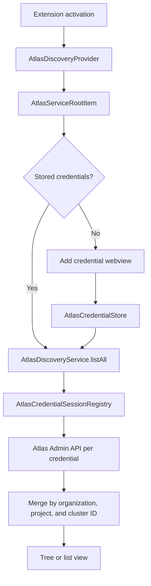

# MongoDB Atlas Discovery Flow

This document describes the current MongoDB Atlas Service Discovery flow, from provider
registration through credential management, merged resource discovery, and cluster connection.

## Architecture overview

The provider supports multiple API Keys and Service Accounts. Each credential owns an independent
storage item and session. Discovery fans out across all credentials, keeps healthy results when a
peer fails, and merges duplicate Atlas resources by their Atlas IDs.

## Provider registration and root expansion

1. `ClustersExtension.registerDiscoveryServices()` registers `AtlasDiscoveryProvider`.
2. `AtlasDiscoveryProvider` owns one `AtlasDiscoveryService` and returns an
   `AtlasServiceRootItem` for the Service Discovery tree.
3. `AtlasServiceRootItem.getChildren()` reads all stored credentials.
4. With no credentials, the root shows **Sign in to view MongoDB Atlas clusters**. The command
   opens the guided credential webview.
5. With credentials, the root calls `AtlasDiscoveryService.listAll()`. Tree mode renders
   organizations; list mode renders a flat, deduplicated cluster list.

## Adding a credential

`openAtlasCredentialsWebview()` opens one guided surface for both supported authentication
methods:

- **Service Account**: Client ID and Client Secret. The host first mints an OAuth2 access token,
  then verifies that the credential can list projects.
- **API Key**: Public Key and Private Key. The host verifies the pair with an authenticated Atlas
  Admin API project-list request.

The webview submits through `atlasCredentialsRouter`. Validation happens in the extension host
before persistence. A failed authentication, access-list check, permissions check, or network call
returns an inline error and leaves storage unchanged. A successful submit calls
`upsertAtlasCredential()` and refreshes discovery.

## Credential storage and identity

`atlasCredentialStore` stores one `StorageItem` per credential under
`atlas-mongodb-discovery/credentials`:

- `properties` contains non-secret metadata: authentication method, label, cached organization,
  stable order, and an 8-character identity hint used only as a display fallback.
- `secrets` contains the complete credential identity and secret: Public Key plus Private Key, or
  Client ID plus Client Secret and the cached Service Account token.
- `id` is a stable `randomUUID()` generated when the record is created. Tree paths, session state,
  and saved connections use this record ID rather than secret material.

The complete Public Key or Client ID is the credential identity. `upsertAtlasCredential()` reads
the stored secret slots and compares the complete identity; the short metadata hint is never used
for matching. This matters for Service Accounts because their Client IDs share the `mdb_sa_id_`
prefix.

Re-entering the exact same identity updates its existing record and keeps the stable record ID.
Entering a different Public Key or Client ID creates a separate credential, even when both values
share the same display prefix.

## Updating and removing a credential

**Manage MongoDB Atlas Credentials** opens the AzureWizard-based credential manager. Selecting a
credential offers Retry, Open in MongoDB Atlas, Update credentials, Sign out, Back, and Exit.

During **Update credentials**:

1. The existing Public Key or Client ID is loaded from SecretStorage and passed to the webview as
   non-secret configuration.
2. The identity input is populated and disabled. Only the Private Key or Client Secret can be
   changed.
3. The router verifies that the submitted authentication method and complete identity still match
   the stored record before contacting Atlas.
4. The replacement secret is validated against Atlas.
5. `replaceAtlasCredentialSecrets()` enforces the identity invariant again and replaces only the
   paired secret while preserving the record ID, order, and metadata.

Changing a Public Key or Client ID is intentionally not an update operation. The user signs out of
the old entry and adds a new credential. A failed update leaves the previous working secret intact.

Retry refreshes only the selected credential. Sign out deletes only that credential and invalidates
its session. Sign out of all removes every stored credential.

## Discovery aggregation

`AtlasDiscoveryService.listAll()` is the shared discovery surface for the tree, list mode, and the
new-connection wizard:

1. Credentials are queried through a bounded concurrency limiter.
2. `AtlasCredentialSessionRegistry` resolves an independent session for each credential. Service
   Account token refresh touches only the owning credential.
3. Each credential lists organizations and projects. List mode also preloads clusters; tree mode
   loads clusters when a project expands.
4. Individual failures are classified and returned beside healthy results rather than escaping the
   aggregation.
5. Organizations, projects, and clusters are merged by Atlas ID. Each merged entry remembers all
   credentials that can reach it and one healthy `ownerCredentialId` for follow-up requests.

The snapshot has a short TTL to keep one expansion burst coherent without freezing the tree.
Explicit refresh discards the snapshot and re-derives Service Account sessions so role changes made
in Atlas become visible immediately.

## Tree and recovery behavior

Tree mode renders `organization -> project -> cluster`. List mode renders clusters directly with
`organization · project` context. Healthy nodes do not expose credential attribution.

Credential failures do not remove healthy peer data. The root adds one recovery row whose action is
chosen from the failure taxonomy:

- Authentication or permissions failures open credential management.
- Network, rate-limit, and other transient failures retry discovery.
- Mixed failures open the manager, which also provides fleet retry.

A healthy empty result uses the standard `empty` placeholder because retrying an authoritative
empty response cannot change it.

## Cluster connection

Selecting a discovered cluster preserves the merged entry's healthy `ownerCredentialId` through
the connection wizard. The discovery credential can list available database users, but it does not
authenticate the database connection itself. Database access still uses a separate SCRAM username
and password, cached against the cluster's stable `clusterId`.

## Primary files

| File                                                                       | Responsibility                                            |
| -------------------------------------------------------------------------- | --------------------------------------------------------- |
| `src/plugins/service-atlas-mongodb/AtlasDiscoveryProvider.ts`              | Provider registration, root creation, and wizard entry    |
| `src/plugins/service-atlas-mongodb/credentials/atlasCredentialStore.ts`    | Independent credential persistence and identity rules     |
| `src/plugins/service-atlas-mongodb/auth/AtlasCredentialSessionRegistry.ts` | Per-credential sessions and Service Account token refresh |
| `src/plugins/service-atlas-mongodb/discovery/AtlasDiscoveryService.ts`     | Fan-out, error isolation, caching, and resource merge     |
| `src/plugins/service-atlas-mongodb/discovery-tree/AtlasServiceRootItem.ts` | Tree/list rendering and root recovery behavior            |
| `src/plugins/service-atlas-mongodb/credentialsManagement/`                 | Credential list and per-credential actions                |
| `src/webviews/documentdb/atlasCredentials/`                                | Guided add/update webview and host-side validation        |
| `src/plugins/service-atlas-mongodb/discovery-wizard/`                      | Project and cluster selection with credential ownership   |
| `src/plugins/service-atlas-mongodb/discovery-tree/AtlasClusterItem.ts`     | Cluster connection and database-user lookup               |

## Design decisions

1. API Keys and Service Accounts are the supported Atlas Admin API authentication mechanisms.
2. Multiple credentials are first-class; one broken credential never blanks healthy peer data.
3. Resource identity comes from Atlas IDs, while credential identity comes from the complete Public
   Key or Client ID.
4. Public credential identity is immutable during an update; only the paired secret rotates.
5. Discovery authentication and database SCRAM authentication remain separate layers.
