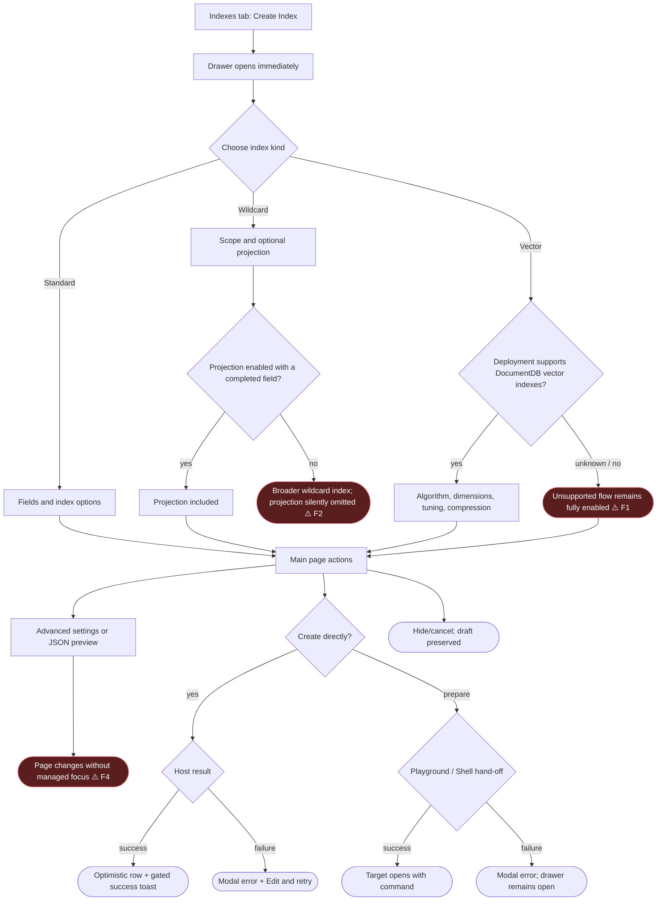

# Index Management Create Drawer Redesign — UX Review Iteration 3

> **Who this is for:** anyone about to do a hands-on UX review of the redesigned
> **Create Index** experience in Index Management, or anyone triaging the findings.
> **What this is:** a pre-seeded follow-up to [the original UX review](ux-review.md).
> It maps the current Standard / Wildcard / Vector journeys, records code-backed risks
> introduced by the new iteration, and carries forward every unresolved verification item
> from the earlier review.

- **Feature area:** `src/webviews/documentdb/indexView/`, especially
  `components/CreateIndexDrawer.tsx`, `indexCreation.ts`, `indexViewRouter.ts`, and the
  create lifecycle in `IndexesTab.tsx`
- **PR / branch:** [microsoft/vscode-documentdb#732](https://github.com/microsoft/vscode-documentdb/pull/732) ·
  `dev/khelanmodi/index-management-ui`
- **Related design docs:** [Index Management UI notes](index-management-ui-notes.md) ·
  [Vector index support](vector-index-support.md) · [Original UX review](ux-review.md)
- **Scope:** the redesigned create drawer, mode switching, validation, progressive
  disclosure, preview and command hand-off, feedback, accessibility, narrow layouts, and
  regressions in the already-reviewed list/action journeys
- **Review date:** 2026-07-27
- **Iteration:** 3 (new hands-on pass; Iterations 1–2 are recorded in the original review)

## How this review was run

This document is the **pre-assessment**, not the hands-on verdict. The current branch was
traced from every create entry and control to its success, failure, cancellation, and
degraded terminal state. Findings below are code-backed **Flags** or explicitly marked
**Open (soft)** checks that need visual/runtime confirmation. The operator should now walk
the journeys in the running extension; observations and decisions will be added here.

The second half of the preparation cross-checks the original `ux-review.md` item by item.
Implemented items remain regression checks, the deliberately closed toolbar re-entry item
stays closed, and the unresolved Retry question is carried into this iteration rather than
being silently dropped.

## Legend

### Priority

| Priority | Meaning                                            |
| -------- | -------------------------------------------------- |
| **P0**   | Blocking — the user gets stuck                     |
| **P1**   | Broken / misleading, or a consistency & safety gap |
| **P2**   | Polish, expectation, or a smaller feature gap      |
| **P3**   | Nice-to-have / cosmetic / acknowledged             |

### Status

| Status             | Meaning                                                                  |
| ------------------ | ------------------------------------------------------------------------ |
| 🟠 **Open**        | Recorded + analyzed; carries a recommendation but stays a _suggestion_   |
| 🟡 **Open (soft)** | Open, but depends on an investigation or is a soft "leave as-is"         |
| ✅ **Implemented** | Changed on this branch and verified (Decision + commit link recorded)    |
| 🚫 **Closed**      | Won't fix — with a mandatory one-line reason                             |
| 🔗 **Tracked**     | Deferred to a repo issue (linked); dropped from the active priority list |

> Anything still Open at the end of this pass moves to the next iteration. An item leaves
> the ledger only as Implemented, Closed with a reason, or Tracked with an issue link.

### Markers (inline)

| Marker            | Meaning                                                 |
| ----------------- | ------------------------------------------------------- |
| ⚠️ **Flag**       | Confirmed gap or bug                                    |
| 💡 **Suggestion** | A design/wording recommendation to react to             |
| 🔍 **Answered**   | A "how does this work?" question answered from the code |
| 🔁 **Regression** | A prior fix that must be rechecked in the new UI        |

---

## User interaction map

### ASCII flow

```text
Indexes tab → Create Index
  └─ drawer opens immediately; suggestions/count settle independently
      ├─ Standard
      │   ├─ fields + type(s)
      │   ├─ options: unique / sparse / TTL / custom name
      │   └─ More options → Advanced / JSON preview
      ├─ Wildcard
      │   ├─ all fields OR parent path → generated-key preview
      │   ├─ optional projection
      │   │   └─ enabled + no completed fields → projection omitted silently ⚠️ F2
      │   └─ independent name / partial filter / collation draft
      └─ Vector (always visible today)
          ├─ field + HNSW / IVF / DiskANN + dimensions / similarity
          ├─ Advanced → tuning + compatible compression
          └─ unsupported deployment/tier → discovered only after create/run ⚠️ F1

Main page
  ├─ Create Index
  │   ├─ success → drawer closes → optimistic row → gated success toast
  │   └─ failure → modal → Edit and retry → preserved draft reopens
  ├─ Create in Playground / Shell
  │   ├─ success → target opens with generated command
  │   └─ hand-off failure → modal; drawer remains open
  ├─ Advanced / Preview
  │   └─ DOM page replaced; no explicit focus move/restore ⚠️ F4
  ├─ Hide / Escape / outside close → drawer closes; all drafts preserved
  └─ Reset form → all three drafts reset
```

### Mermaid



### Interaction inventory

| #   | User action (entry)                 | Where it lives                                                                                                    | Terminal state(s)                                          | Surface                | ⚠️  |
| --- | ----------------------------------- | ----------------------------------------------------------------------------------------------------------------- | ---------------------------------------------------------- | ---------------------- | --- |
| 1   | Click **Create Index**              | [IndexManagementToolbar.tsx](../../../../src/webviews/documentdb/indexView/components/IndexManagementToolbar.tsx) | Drawer opens; optional context settles asynchronously      | Webview drawer         |     |
| 2   | Switch Standard / Wildcard / Vector | [CreateIndexDrawer.tsx](../../../../src/webviews/documentdb/indexView/components/CreateIndexDrawer.tsx#L977)      | Active focused form; all drafts retained                   | Drawer tabs            | ⚠️  |
| 3   | Add/remove/clear Standard fields    | [CreateIndexDrawer.tsx](../../../../src/webviews/documentdb/indexView/components/CreateIndexDrawer.tsx#L1016)     | Valid compound key or disabled Create with requirement     | Drawer form            |     |
| 4   | Configure Wildcard scope/path       | [CreateIndexDrawer.tsx](../../../../src/webviews/documentdb/indexView/components/CreateIndexDrawer.tsx#L1183)     | `$**` / `path.$**` preview or inline path error            | Drawer form            |     |
| 5   | Enable Wildcard projection          | [CreateIndexDrawer.tsx](../../../../src/webviews/documentdb/indexView/components/CreateIndexDrawer.tsx#L1274)     | Projection included, or selected option silently omitted   | Drawer form / none     | ⚠️  |
| 6   | Configure Vector algorithm          | [CreateIndexDrawer.tsx](../../../../src/webviews/documentdb/indexView/components/CreateIndexDrawer.tsx#L1430)     | Roving radio-card selection; tuning draft retained         | Drawer form            |     |
| 7   | Enter Vector dimensions/similarity  | [CreateIndexDrawer.tsx](../../../../src/webviews/documentdb/indexView/components/CreateIndexDrawer.tsx#L1479)     | Valid input or inline error / disabled Create              | Drawer form            |     |
| 8   | Reveal a custom name input          | [CreateIndexDrawer.tsx](../../../../src/webviews/documentdb/indexView/components/CreateIndexDrawer.tsx#L837)      | Input appears without its own programmatic label           | Drawer form            | ⚠️  |
| 9   | Open Advanced settings              | [CreateIndexDrawer.tsx](../../../../src/webviews/documentdb/indexView/components/CreateIndexDrawer.tsx#L880)      | Pushed page replaces main page                             | Drawer page            | ⚠️  |
| 10  | Open Preview as JSON                | [CreateIndexDrawer.tsx](../../../../src/webviews/documentdb/indexView/components/CreateIndexDrawer.tsx#L905)      | Read-only generated specification                          | Drawer / Monaco        |     |
| 11  | Create directly                     | [IndexesTab.tsx](../../../../src/webviews/documentdb/indexView/IndexesTab.tsx#L377)                               | Optimistic row + toast, or modal + Edit and retry          | Table / VS Code modal  |     |
| 12  | Create in Playground / Shell        | [IndexesTab.tsx](../../../../src/webviews/documentdb/indexView/IndexesTab.tsx#L532)                               | Target opens, or modal with drawer retained                | Editor / shell / modal |     |
| 13  | Hide, Escape, or dismiss drawer     | [CreateIndexDrawer.tsx](../../../../src/webviews/documentdb/indexView/components/CreateIndexDrawer.tsx#L957)      | Drawer closes; active page and all drafts remain preserved | Drawer                 |     |
| 14  | Reset form                          | [CreateIndexDrawer.tsx](../../../../src/webviews/documentdb/indexView/components/CreateIndexDrawer.tsx#L1847)     | All Standard/Wildcard/Vector drafts reset                  | Drawer                 |     |
| 15  | First-load failure                  | [IndexList.tsx](../../../../src/webviews/documentdb/indexView/components/indexList/IndexList.tsx#L191)            | Passive "Could not load indexes." state; no Retry          | Webview status         | ⚠️  |

### Feedback-surface matrix

| Event                                              | Current terminal surface                                                        | Assessment                         |
| -------------------------------------------------- | ------------------------------------------------------------------------------- | ---------------------------------- |
| Missing required main-form input                   | Disabled actions + live requirement status                                      | Consistent                         |
| Invalid visible numeric tuning                     | Inline `Field` error + disabled actions                                         | Consistent                         |
| Invalid relaxed JSON / reserved name at submission | Host rejection → modal; direct create offers Edit and retry                     | Existing deliberate behavior       |
| Direct create success                              | Optimistic row + configured operation-summary toast                             | Prior-review rule preserved        |
| Direct create failure                              | Modal + Edit and retry                                                          | Prior-review rule preserved        |
| Playground/Shell hand-off failure                  | Modal; drawer retained                                                          | Prior-review rule preserved        |
| Optional suggestion/count lookup failure           | Silent degraded enhancement                                                     | Accepted in prior review           |
| Enabled projection with no completed fields        | **No feedback; projection omitted from the submitted index**                    | ⚠️ New silent semantic degradation |
| Unsupported Vector environment                     | No up-front signal; direct create fails later / prepared command fails when run | ⚠️ New capability gap              |

> **Iteration 3 decision note:** the diagrams above preserve the pre-fix review baseline.
> Item 1 is now tracked for a patch release, item 2 is accepted, and items 3–6 are fixed in
> the working tree. The item sections and Iteration log are the current source of truth.

## The story in one paragraph

The create experience is now a substantial three-mode workflow rather than the single
Standard form covered by the original review. Iteration 3 accepts the current ungated Vector
flow for the initial release while tracking proper platform/capability gating for the next
patch, and accepts an enabled empty Wildcard projection as a valid no-projection definition.
The accessibility, focus, draft-isolation, and narrow-layout findings are fixed in the
working tree. The prior could-not-load Retry question is closed without action; every other
implemented old item remains below as a regression journey.

## Priority index

| #   | Priority | Item                                                               | Origin                  | Status                      |
| --- | -------- | ------------------------------------------------------------------ | ----------------------- | --------------------------- |
| 1   | **P1**   | Vector creation is exposed without capability gating               | New Vector iteration    | 🔗 Tracked                  |
| 2   | **P1**   | Enabled empty Wildcard projection is silently omitted              | New Wildcard iteration  | 🚫 Closed                   |
| 3   | **P1**   | Revealed custom-name inputs have no accessible name                | New drawer iteration    | ✅ Implemented (`414c0d2c`) |
| 4   | **P1**   | Advanced/Preview page changes do not manage or restore focus       | New drawer iteration    | ✅ Implemented (`414c0d2c`) |
| 5   | **P2**   | Standard and Wildcard option drafts must be independent            | New drawer iteration    | ✅ Implemented (`414c0d2c`) |
| 6   | **P2**   | Fixed-width rows and non-wrapping footer need narrow-panel support | New drawer iteration    | ✅ Implemented (`414c0d2c`) |
| 7   | **P3**   | First-load failure still has no Retry affordance                   | Original review audit C | 🚫 Closed                   |

## P0 — Blocking (the user gets stuck)

No code-level P0 candidate was found. The hands-on run should try to disprove this by
exercising keyboard-only Advanced/Preview navigation, every cancel path, an invalid create
followed by Edit and retry, and all three mode drafts after close/reopen.

## P1 — Broken / misleading, or consistency & safety

### 1. Vector creation is exposed without capability gating ⚠️

**Priority:** P1 · **Status:** 🔗 Tracked in [#816](https://github.com/microsoft/vscode-documentdb/issues/816)

> **Decision (Iteration 3):** accept the current limitation for the initial release and
> implement proper platform/capability gating in the upcoming patch release. **Reason
> (operator):** the feature can ship with server-side failure as the temporary boundary, but
> platform gating needs a dedicated follow-up and should align with planned Atlas Search
> Index support rather than inventing a competing provider switch.

**Observation to confirm:** Open Index Management against a connection or service tier that
does not support Azure DocumentDB `cosmosSearch` indexes. The Vector tab still presents a
complete, enabled workflow; support is discovered only after the user submits or runs a
prepared command.

**Finding:**

- ⚠️ The drawer always renders the Vector tab; its props carry no capability or environment
  signal. See [CreateIndexDrawer.tsx](../../../../src/webviews/documentdb/indexView/components/CreateIndexDrawer.tsx#L977).
- ⚠️ `createIndex` validates the shape, builds the vector specification, and sends it directly
  to the selected client without an environment/tier capability check. See
  [indexViewRouter.ts](../../../../src/webviews/documentdb/indexView/indexViewRouter.ts#L239).
- 🔍 The design contract says to implement this form for Azure DocumentDB, not substitute an
  Atlas search-index command, and records the authoritative capability source as an open
  decision. See [vector-index-support.md](vector-index-support.md#open-decisions).

💡 **Suggestion:** Until a reliable capability response exists, label Vector as a preview
with explicit Azure DocumentDB scope and explain that server support is verified on create.
Once capability data is available, gate the tab/options in the host router and return a
specific unsupported reason before the user fills the form. See [O1](#o1-how-should-vector-capability-be-communicated-item-1).

> 🔗 **Tracked:** [#816 — Gate vector index creation by platform capabilities](https://github.com/microsoft/vscode-documentdb/issues/816)
> is targeted at the upcoming patch release and cross-references [#815 — Future work: add
> MongoDB Atlas Search Index tab](https://github.com/microsoft/vscode-documentdb/issues/815).
> A repository-wide search found no issues created in the previous seven days, so #816 does
> not duplicate recent work.

### 2. Enabled empty Wildcard projection is silently omitted ⚠️

**Priority:** P1 · **Status:** 🚫 Closed

> **Decision (Iteration 3) — Closed / won't fix:** leave the current behavior. **Reason
> (operator):** an empty projection still produces a valid Wildcard index definition; it is
> acceptable for the projection to be omitted and the index to cover all fields.

**Observation to confirm:** Choose Wildcard → All fields, enable **Include or exclude
specific fields**, leave the only field row blank, and create. The UI visibly says the
projection option is on, but the created index has no projection and therefore covers all
fields.

**Finding:**

- ⚠️ Blank projection rows are skipped and an all-blank projection becomes `undefined` in
  [wildcardIndexForm.ts](../../../../src/webviews/documentdb/indexView/wildcardIndexForm.ts#L151).
- ⚠️ `canSubmit` validates only the Wildcard path; it does not require a completed projection
  field when `wildcardProjectionEnabled` is true. The payload includes the option only when
  the collapsed object exists. See
  [CreateIndexDrawer.tsx](../../../../src/webviews/documentdb/indexView/components/CreateIndexDrawer.tsx#L599)
  and [CreateIndexDrawer.tsx](../../../../src/webviews/documentdb/indexView/components/CreateIndexDrawer.tsx#L647).
- ⚠️ This is silent semantic degradation: the request succeeds but creates a broader index
  than the selected control communicates.

💡 **Suggestion:** While the projection switch is on, require at least one non-empty field,
mark the field list required, and use the existing footer requirement line to explain what
blocks Create. See [O2](#o2-what-should-an-empty-enabled-projection-mean-item-2).

### 3. Revealed custom-name inputs have no accessible name ⚠️

**Priority:** P1 · **Status:** ✅ Implemented in commit `414c0d2c`

> **Decision (Iteration 3):** fix the accessible name. **Reason (operator):** the revealed
> custom-name field is an interactive input and must announce its purpose independently of
> the switch that reveals it.

**Observation to confirm:** With a screen reader, enable **Name - use a custom index name**
in Standard/Wildcard and Vector. Move into the revealed edit field and listen for whether
its purpose is announced.

**Finding:**

- ⚠️ Both revealed inputs sit inside a `<Field>` with no `label`, while the `<Input>` has no
  `aria-label`/`aria-labelledby`. The preceding switch label does not programmatically name
  the newly revealed input. See
  [CreateIndexDrawer.tsx](../../../../src/webviews/documentdb/indexView/components/CreateIndexDrawer.tsx#L837).
- 🔍 Dimensions and TTL use labeled Fluent `Field`s, so the custom-name controls diverge from
  the drawer's own accessible form pattern.

💡 **Suggestion:** Give each revealed input a visible `Field` label such as **Index name**.
That is clearer for sighted users scanning the indented control and provides the accessible
name without a separate ARIA-only string.

> ✅ **Implemented (Iteration 3):** added a visible localized **Index name** `Field` label to
> the Standard/Wildcard and Vector custom-name inputs. File:
> [CreateIndexDrawer.tsx](../../../../src/webviews/documentdb/indexView/components/CreateIndexDrawer.tsx).
> Committed in `414c0d2c`. Verified by TypeScript and focused
> formatting checks; full validation is recorded in the iteration outcome.

### 4. Advanced/Preview page changes do not manage or restore focus ⚠️

**Priority:** P1 · **Status:** ✅ Implemented in commit `414c0d2c`

> **Decision (Iteration 3):** manage focus on every pushed-page transition. **Reason
> (operator):** keyboard and screen-reader users need an explicit signal that the drawer body
> changed, and Back must return them to the control that opened the page.

**Observation to confirm:** Use only the keyboard to activate **Advanced settings** or
**Preview as JSON**, then use either Back affordance. Check where focus lands and whether a
screen reader announces the new page title and context.

**Finding:**

- ⚠️ Activating either entry changes `page`, replacing the focused main-page button with a
  different DOM subtree. Neither transition moves focus to the new page. See
  [CreateIndexDrawer.tsx](../../../../src/webviews/documentdb/indexView/components/CreateIndexDrawer.tsx#L880).
- ⚠️ Back changes `page` to `main` but does not restore focus to the entry that opened the
  sub-page. The component has refs for algorithm cards, but no page heading/entry refs or
  focus effect. See
  [CreateIndexDrawer.tsx](../../../../src/webviews/documentdb/indexView/components/CreateIndexDrawer.tsx#L943).
- 🔍 Fluent owns the drawer's initial focus behavior, but these custom in-drawer route changes
  still need explicit focus placement/restoration.

💡 **Suggestion:** Record the opening entry, focus the pushed page heading (or first field)
after navigation, and restore focus to that entry on Back. Confirm the final behavior with
keyboard traversal and Narrator/Screen Reader.

> ✅ **Implemented (Iteration 3):** Advanced and Preview now record their opening entry,
> focus the pushed-page title, and restore focus to the matching entry on Back. The focused
> title has a visible focus ring. Files:
> [CreateIndexDrawer.tsx](../../../../src/webviews/documentdb/indexView/components/CreateIndexDrawer.tsx) ·
> [indexView.scss](../../../../src/webviews/documentdb/indexView/indexView.scss). Committed in
> `414c0d2c`. Verified by TypeScript and focused formatting
> checks; complete keyboard/screen-reader confirmation remains part of the live pass.

## P2 — Polish, expectation, or feature gap

### 5. Standard and Wildcard option drafts must be independent ⚠️

**Priority:** P2 · **Status:** ✅ Implemented in commit `414c0d2c`

> **Decision (Iteration 3):** make Standard, Wildcard, and Vector behave as three completely
> independent dialogs. **Reason (operator):** switching index kind must not carry names,
> partial filters, or collations into another kind; each tab represents a separate creation
> intent.

**Observation:** Configure a custom name, partial filter, and collation in Standard, then
switch to Wildcard. The values carry over even though the tabs represent independent index
definitions.

**Finding:**

- ⚠️ Name, partial filter, and collation were one shared draft for Standard and Wildcard,
  unlike Vector's independent values. This contradicted the three-dialog mental model.
- 🔍 The payload and preview builders already branch by active kind, so separating draft
  storage does not change the host contract.

💡 **Suggestion:** Keep per-kind values in separate state and select the active draft when
rendering, previewing, and submitting.

> ✅ **Implemented (Iteration 3):** added independent Wildcard name, partial-filter, and
> collation fields while retaining the existing Standard and Vector drafts. Rendering,
> preview, and payload assembly now read and update only the active kind. Files:
> [wildcardIndexForm.ts](../../../../src/webviews/documentdb/indexView/wildcardIndexForm.ts) ·
> [CreateIndexDrawer.tsx](../../../../src/webviews/documentdb/indexView/components/CreateIndexDrawer.tsx) ·
> [wildcardIndexForm.test.ts](../../../../src/webviews/documentdb/indexView/wildcardIndexForm.test.ts).
> Committed in `414c0d2c`. Focused Jest result: 19 tests pass.

### 6. Fixed-width rows and non-wrapping footer need narrow-panel proof ⚠️

**Priority:** P2 · **Status:** ✅ Implemented in commit `414c0d2c`

> **Decision (Iteration 3):** add wrapping support where the layout permits it; accept the
> existing layout only if wrapping is not practical. **Reason (operator):** controls must
> remain reachable in narrow panels without introducing a larger responsive redesign.

**Observation to confirm:** Narrow the Collection View until the drawer occupies the full
available width. Check every mode at 200% zoom and with long localized labels: field/type
rows, algorithm cards, Advanced entries, requirement text, and all footer actions must stay
visible and reachable without overlapping.

**Finding:**

- ⚠️ Standard field rows remain a single flex row while the type dropdown reserves `210px`.
  See [indexView.scss](../../../../src/webviews/documentdb/indexView/indexView.scss#L528).
- ⚠️ The main footer is a single non-wrapping row containing the primary action, two icon
  actions, and Reset. See [indexView.scss](../../../../src/webviews/documentdb/indexView/indexView.scss#L426).
- 🔍 Vector's dual fields and algorithm cards already wrap, so the responsive fallback is
  inconsistent across sibling controls rather than wholly absent.

💡 **Suggestion:** Confirm visually first. If controls clip, let the field row and footer
wrap at constrained widths, keeping the primary action first and Reset last; ensure the
requirement line wraps independently above them.

> ✅ **Implemented (Iteration 3):** field and projection rows now wrap, the type selector can
> shrink from its preferred width, footer actions wrap, and the requirement line aligns
> correctly when it spans multiple lines. File:
> [indexView.scss](../../../../src/webviews/documentdb/indexView/indexView.scss). Committed in
> `414c0d2c`. Focused formatting and TypeScript checks pass;
> narrow-panel and 200% zoom inspection remain in the live pass.

## P3 — Nice-to-have / cosmetic / acknowledged

### 7. First-load failure still has no Retry affordance 🔁

**Priority:** P3 · **Status:** 🚫 Closed

> **Decision (Iteration 3) — Closed / won't fix:** ignore the Retry variant. **Reason
> (operator):** the persistent toolbar already exposes Refresh, and this low-priority
> duplicate affordance is not worth additional UI.

**Observation to confirm:** Force the initial list request to fail. Decide whether the
centered **Could not load indexes.** message provides enough recovery when the normal
Refresh toolbar remains visible, or whether an in-context Retry action is still warranted.

**Finding:**

- 🔁 Original finding 5 was implemented as a message with no button by operator decision,
  then the original review's final audit explicitly left a Retry variant under
  reconsideration. See [ux-review.md](ux-review.md#still-open-audit-2026-07-22).
- 🔍 The current state still renders only the message in
  [IndexList.tsx](../../../../src/webviews/documentdb/indexView/components/indexList/IndexList.tsx#L191).

💡 **Suggestion:** Judge this live rather than reopening it automatically. If the persistent
toolbar Refresh action is obvious in the failed state, close the question with that reason;
if not, add one compact Retry action to the state.

## Implemented context

These are current design decisions or completed work, not open findings:

- ✅ Standard, Wildcard, and Vector retain fully independent drafts across tab switches,
  including name and Advanced settings.
- ✅ Vector algorithm cards implement an ARIA radiogroup with roving `tabIndex` and arrow-key
  selection.
- ✅ Vector algorithm tuning, numeric ranges, HNSW cross-field constraints, and compression
  compatibility are validated before submission.
- ✅ JSON preview, direct create, Playground, and Shell all build from the same payload.
- ✅ Direct create still closes optimistically and preserves the complete active draft on
  failure; Edit and retry reopens it.
- ✅ The drawer opens before optional field suggestions/document count complete, preserving
  the prior review's no-blocking decision.
- ✅ The requirement line explains why create actions are disabled and uses `role="status"`.
- ✅ Large-collection guidance, list lifecycle announcements, modal user-action failures,
  gated success summaries, and sort/expanded-row persistence remain in the current code.

## Previous-review reconciliation

The old review is not superseded silently. This table records the full carry-forward story.

| Prior item                           | Previous terminal status           | Iteration 3 treatment                                                                                                      |
| ------------------------------------ | ---------------------------------- | -------------------------------------------------------------------------------------------------------------------------- |
| J1 · raw-definition failure surface  | ✅ Implemented                     | 🔁 Recheck modal behavior from an expanded row                                                                             |
| 1 · row progress timing              | ✅ Implemented                     | 🔁 Run a slow delete/hide/unhide and confirm the spinner covers the real wait plus intentional tail                        |
| 2 · create-failure recovery          | ✅ Implemented                     | 🔁 Reject Standard, Wildcard, and Vector creates; confirm Edit and retry restores the correct complete draft               |
| 3 · feedback matrix                  | ✅ Implemented                     | 🔁 Recheck direct create, prepared hand-off, delete, hide/unhide, and raw-definition failures against the modal/toast rule |
| 4 · prerequisite degradation         | ✅ Implemented                     | 🔁 Delay/fail suggestions and document count; drawer must open immediately and remain usable                               |
| 5 · could-not-load state             | ✅ Implemented; Retry reconsidered | Item 7 closed without a Retry button; toolbar Refresh remains the recovery                                                 |
| 6 · accessibility announcements      | ✅ Implemented                     | 🔁 Screen-reader pass for load/refresh plus new drawer status/focus changes                                                |
| 7 · refresh preserves sort/expansion | ✅ Implemented                     | 🔁 Sort, expand, refresh, and confirm both remain stable                                                                   |
| 8 · toolbar re-entry                 | 🚫 Closed                          | Keep closed: generation guards preserve correctness; do not reopen without new evidence                                    |
| Audit A · no hands-on run            | Open verification                  | This iteration is the requested hands-on run                                                                               |
| Audit B · stale diagrams             | Documentation hygiene              | Superseded for current behavior by the diagrams in this file                                                               |
| Audit C · Retry question             | Open product decision              | Closed in item 7; no additional Retry affordance                                                                           |
| Audit D · accepted residuals         | Acknowledged                       | Recheck only if they are strongly felt live; do not relitigate by default                                                  |

## Iteration log

### Iteration 3 (2026-07-27) — pre-assessment seeded

| #   | Item                              | Decision (why)                                                                    | Outcome                     |
| --- | --------------------------------- | --------------------------------------------------------------------------------- | --------------------------- |
| 1   | Vector capability gating          | Defer proper gating to the patch release; coordinate provider switching with #815 | 🔗 Tracked in #816          |
| 2   | Empty enabled Wildcard projection | Accept omission because the resulting index definition is valid                   | 🚫 Closed                   |
| 3   | Custom-name accessible labels     | Add visible labels so each revealed input has an independent accessible name      | ✅ Implemented (`414c0d2c`) |
| 4   | Pushed-page focus management      | Focus pushed-page title and restore the opening entry on Back                     | ✅ Implemented (`414c0d2c`) |
| 5   | Independent per-kind drafts       | Treat the three kinds as fully independent dialogs                                | ✅ Implemented (`414c0d2c`) |
| 6   | Narrow-panel layout               | Add wrapping where practical                                                      | ✅ Implemented (`414c0d2c`) |
| 7   | Could-not-load Retry              | Ignore; toolbar Refresh is sufficient                                             | 🚫 Closed                   |

**Iteration 3 validation:** `npm run l10n`, `npm run prettier-fix`, `npm run lint`,
`npx jest --no-coverage` (165 suites, 2,747 tests), and `npm run build` all pass. Lint
reports only the existing ESLint v10 migration warning in `webpack.config.views.js`.
Runtime keyboard/screen-reader and narrow-panel visual checks remain part of the hands-on
review; they are verification of the implemented fixes, not open design decisions.

## Open ideas — options, pros & cons

### O1. How should Vector capability be communicated? (item 1)

| Option                                         | Pros                                         | Cons                                                                       |
| ---------------------------------------------- | -------------------------------------------- | -------------------------------------------------------------------------- |
| **A. Capability-gate the tab**                 | Prevents unsupported work; clearest contract | Needs an authoritative capability source that does not exist yet           |
| **B. Show Vector as Azure DocumentDB Preview** | Honest now; keeps live testing available     | Still lets unsupported tiers reach a late server failure                   |
| **C. Leave fully enabled**                     | No extra UI or probing                       | A complete-looking form promises support the extension has not established |

> 💡 **Suggested:** B now, then A when a reliable capability response exists. The host router
> should remain the enforcement point so Playground/Shell and direct create share the rule.

> **Decision (Iteration 3):** keep the current experience for the initial release and track
> Option A for the upcoming patch in [#816](https://github.com/microsoft/vscode-documentdb/issues/816).
> **Reason:** proper platform gating needs an authoritative capability source and should be
> designed with Atlas provider switching in [#815](https://github.com/microsoft/vscode-documentdb/issues/815),
> while the temporary server-error boundary is acceptable for this release.

### O2. What should an empty enabled projection mean? (item 2)

| Option                                                | Pros                                                                  | Cons                                                               |
| ----------------------------------------------------- | --------------------------------------------------------------------- | ------------------------------------------------------------------ |
| **A. Require at least one field while enabled**       | Selected option always affects the result; straightforward validation | Adds one more disabled-submit state                                |
| **B. Automatically switch projection off when empty** | Request matches visible effective state                               | Automatic toggle can feel surprising while editing                 |
| **C. Treat empty as no projection**                   | Matches current serializer; no code change                            | Silently creates a broader index than the enabled control suggests |

> 💡 **Suggested:** A. Reuse the existing footer requirement and field-row pattern so the
> correction is local and predictable.

> **Decision (Iteration 3):** Option C; leave the current behavior. **Reason:** omitting an
> empty projection produces a valid all-fields Wildcard index, which is acceptable even when
> the projection switch was enabled before submission.

## Appendix A — current flow reference

### Phase 1: Enter and choose a kind

Create Index opens the drawer before optional schema suggestions and collection count have
settled. The main page starts on Standard and exposes Wildcard and Vector as peer tabs. Each
kind owns a fully independent draft across tab switches and drawer hide/reopen, including
name and Advanced settings. Reset clears every kind.

### Phase 2: Configure the main form

Standard builds one or more typed keys and reveals only compatible TTL/sparse behavior.
Wildcard selects `$**` or a generated `path.$**` key and may add an include/exclude
projection. Vector selects one field, an algorithm, dimensions, and similarity. A live
requirement line explains incomplete required state; valid forms enable all three create
targets.

### Phase 3: Inspect progressive options

Advanced and Preview replace the drawer body with pushed pages. Standard/Wildcard Advanced
contains separate relaxed-JSON partial filter and collation editors for the active kind.
Vector Advanced contains the selected algorithm's tuning and compatible compression. Preview
renders the exact generated specification in read-only Monaco. On entry, focus moves to the
pushed-page title; Header and Footer Back restore focus to the opening entry.

### Phase 4: Submit or hand off

Direct create inserts an optimistic row and closes the drawer immediately. Success produces
a configured operation-summary toast and polling reconciles the row. Failure removes the
row, refreshes, and opens a modal whose Edit and retry action restores the preserved draft.
Playground/Shell preparation keeps the drawer open on failure and closes it when the target
opens successfully.

### Phase 5: Regress the original journeys

After the create-drawer pass, exercise list load/failure, filter-to-zero, sort/expansion
retention, raw-definition open failure, slow delete/hide/unhide, cancellation, success
summaries, modal failures, and screen-reader lifecycle announcements. These are not new
findings unless current runtime evidence shows that the redesign regressed them.
