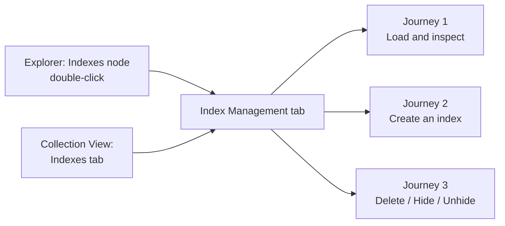
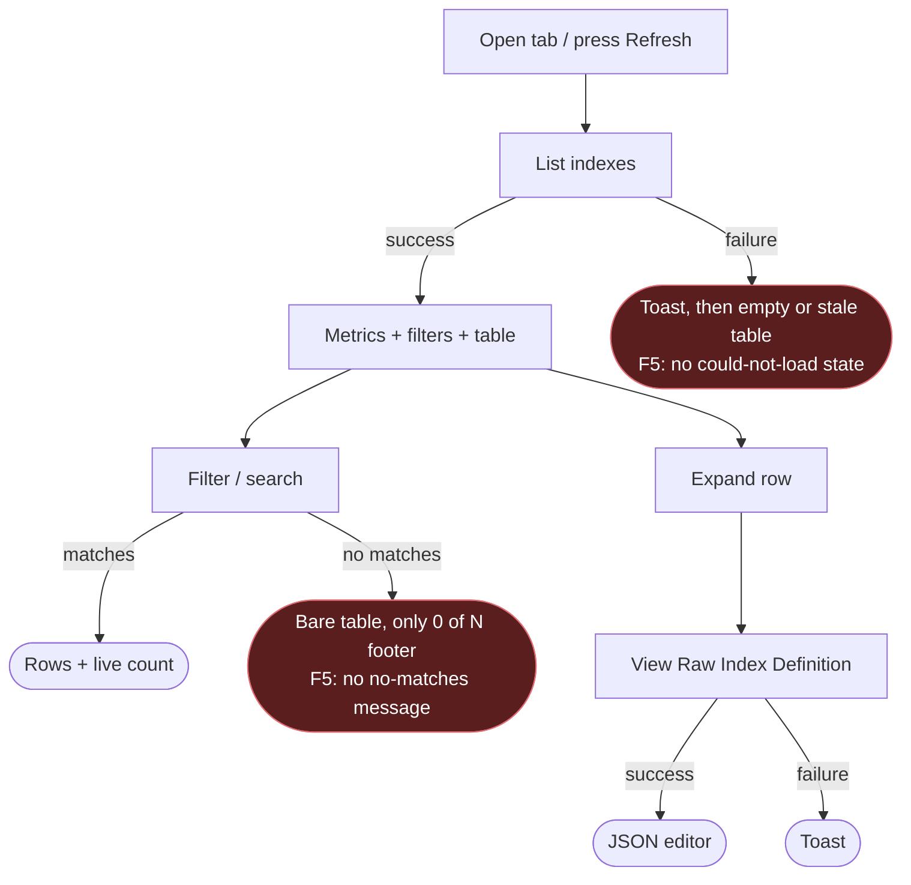
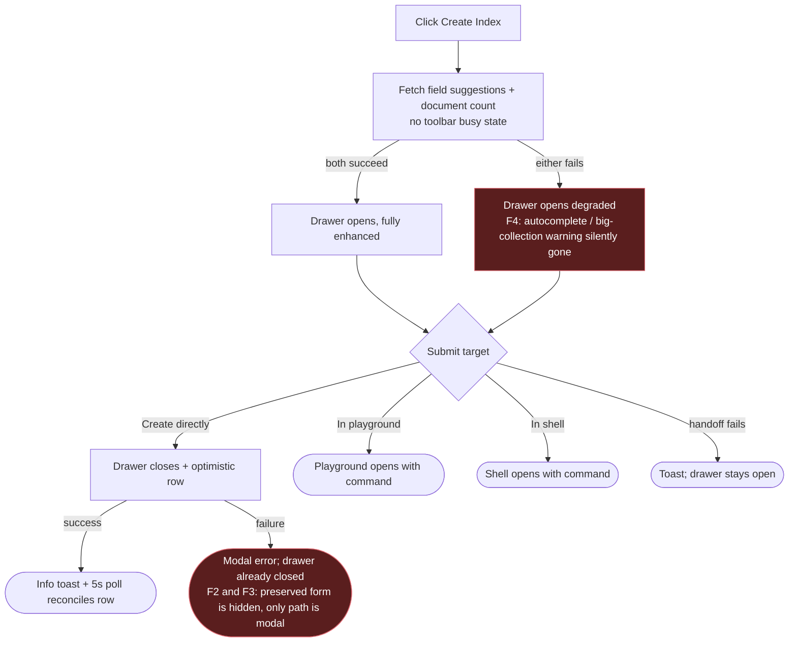
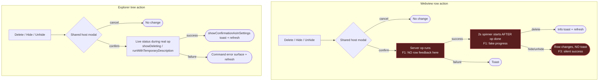

# Index Management — UX Review Pack

> **Who this is for:** anyone about to do a hands-on UX review of the **Index Management**
> feature, or anyone triaging the findings.
> **What this is:** a single catch-up document that captures a round of runtime UX
> feedback, states what the code _actually does today_ (verified against the current
> branch), and — for each item — offers a **suggestion** and a **status**. Items are
> **sorted by priority** (P0 → P3).

- **Feature area:** `src/webviews/documentdb/indexView/`, the Indexes tab in
  `src/webviews/documentdb/collectionView/`, `src/tree/documentdb/IndexesItem.ts`, and
  `src/commands/index.*Index/`
- **PR / branch:** [microsoft/vscode-documentdb#732](https://github.com/microsoft/vscode-documentdb/pull/732) ·
  `dev/khelanmodi/index-management-ui`
- **Related design docs:** [Index Management UI notes](index-management-ui-notes.md) ·
  [Collection view toolbar/tab redesign](collectionview-toolbar-tab-redesign.md) ·
  [Technical review](review-2026-07-20.md)
- **Scope:** the UX-facing surface (tree entry, tab structure, wording, index table,
  create flow, lifecycle actions, feedback, accessibility, and error recovery). Backend
  internals appear only where they explain a user-visible symptom.
- **Review date:** 2026-07-22

## How this review was run

This document began as an AI-assisted **pre-assessment** and has since had a **second
code-verification pass** (2026-07-22): every finding below was traced to the exact code path
that produces it and is marked **✅ Verified in code**. That confirms the behavior _exists_;
it does not replace the hands-on run, which is still valuable to judge how strongly each one
is _felt_ (a late spinner on a fast local cluster reads very differently than on a slow
remote one). Each finding keeps an **Observation**, **Finding**, **Suggestion / solution**,
and **Status** so a later implementation pass does not have to re-derive the behavior.

The verification pass also **added two findings** (7 and 8) the first sweep missed, and
**adjusted two severities**: finding 5 drops from P2 to P3 (a **Clear filters** button
already exists in the filter bar — see [IndexListFilterBar.tsx](../../../../src/webviews/documentdb/indexView/components/indexList/IndexListFilterBar.tsx#L79)), and finding 4's silent
degradation is confirmed to also swallow the large-collection warning, so it stays P2 with a
sharper solution.

The existing design decisions in [Index Management UI notes](index-management-ui-notes.md)
are treated as constraints rather than reopened findings. In particular: fixed column
widths, optimistic sorted insertion, the driver-shaped create form, and one shared detailed
confirmation modal for delete/hide/unhide are already deliberate choices.

## Legend

### Priority

| Priority | Meaning                                            |
| -------- | -------------------------------------------------- |
| **P0**   | Blocking — the user gets stuck                     |
| **P1**   | Broken / misleading, or a consistency & safety gap |
| **P2**   | Polish, expectation, or a smaller feature gap      |
| **P3**   | Nice-to-have / cosmetic / acknowledged             |

### Status

| Status             | Meaning                                                                  |
| ------------------ | ------------------------------------------------------------------------ |
| 🟠 **Open**        | Recorded + analyzed; carries a recommendation but stays a _suggestion_   |
| 🟡 **Open (soft)** | Open, but depends on an investigation or is a soft "leave as-is"         |
| ✅ **Implemented** | Changed on this branch and verified (Decision + commit link recorded)    |
| 🚫 **Closed**      | Won't fix — with a mandatory one-line reason                             |
| 🔗 **Tracked**     | Deferred to a repo issue (linked); dropped from the active priority list |

> **Items are worked in iterations.** Anything still 🟠 Open at the end of an iteration
> **moves to the next one** — an item leaves this ledger only as ✅ Implemented, 🚫 Closed,
> or 🔗 Tracked. Each fix records **why it was chosen** (Decision) and **how it was done**
> (Implemented + commit link).

### Markers (inline)

| Marker            | Meaning                                                 |
| ----------------- | ------------------------------------------------------- |
| ⚠️ **Flag**       | Confirmed gap or bug                                    |
| 💡 **Suggestion** | A design/wording recommendation to react to             |
| 🔍 **Answered**   | A "how does this work?" question answered from the code |
| 🔁 **Revisited**  | Priority/status re-examined and changed, with a reason  |

> **For the operator:** items below are **Open** by default — each records a recommendation
> that is a **suggestion, not a final decision**. Disagree freely; where there are real
> trade-offs, see [Open ideas](#open-ideas--options-pros--cons).

---

## User interaction map

Where every user action **starts** and where it **terminates**. Instead of one dense
graph, the map is split into the **three journeys** a user actually walks, plus a top-level
overview. **Red nodes are the flagged terminations** — a place where this feature ends a
flow differently (or more quietly) than its siblings. Each red node maps to a numbered
finding below.

> **How to read it:** rounded nodes `([ … ])` are _terminal states_ (the flow stops there);
> rectangles are intermediate steps; diamonds are user/branch decisions. A red terminal is
> an inconsistency to fix, not necessarily a bug that crashes.

### Overview — one tab, three journeys



### Journey 1 — Load & inspect



### Journey 2 — Create an index



### Journey 3 — Delete / Hide / Unhide (webview vs. Explorer)

Placing the two entry points side by side makes the asymmetry obvious: the webview shows a
_late_ spinner and stays silent on hide/unhide, while Explorer shows _live_ status and a
success toast for all three.



**Interaction inventory**

| #   | User action (entry)                      | Where it lives                                                                                                                                                                                                                          | Terminal state(s)                                                 | Surface                     | ⚠️  |
| --- | ---------------------------------------- | --------------------------------------------------------------------------------------------------------------------------------------------------------------------------------------------------------------------------------------- | ----------------------------------------------------------------- | --------------------------- | --- |
| 1   | Double-click the Explorer `Indexes` node | [IndexesItem.ts](../../../../src/tree/documentdb/IndexesItem.ts#L140)                                                                                                                                                                   | Collection view opens on Indexes tab                              | Tree → webview              |     |
| 2   | Select the `Indexes` tab                 | [CollectionView.tsx](../../../../src/webviews/documentdb/collectionView/CollectionView.tsx#L613)                                                                                                                                        | Index list starts loading                                         | Webview tab                 |     |
| 3   | Load or manually refresh indexes         | [IndexesTab.tsx](../../../../src/webviews/documentdb/indexView/IndexesTab.tsx#L156)                                                                                                                                                     | Table/metrics or non-modal error                                  | Skeleton / toast            | ⚠️  |
| 4   | Filter by text, Hidden, or Unused        | [IndexList.tsx](../../../../src/webviews/documentdb/indexView/components/indexList/IndexList.tsx#L103)                                                                                                                                  | Filtered rows and count; possibly a bare table                    | Webview                     | ⚠️  |
| 5   | Expand a row                             | [IndexTable.tsx](../../../../src/webviews/documentdb/indexView/components/indexList/IndexTable.tsx#L194)                                                                                                                                | Inline field/details panel                                        | Webview                     |     |
| 6   | View the raw index definition            | [IndexRowDetails.tsx](../../../../src/webviews/documentdb/indexView/components/indexList/IndexRowDetails.tsx#L53)                                                                                                                       | JSON editor or non-modal error                                    | Editor / toast              |     |
| 7   | Open Create Index                        | [IndexesTab.tsx](../../../../src/webviews/documentdb/indexView/IndexesTab.tsx#L206)                                                                                                                                                     | Drawer with enhanced or silently degraded context                 | Webview drawer              | ⚠️  |
| 8   | Configure fields/options/advanced JSON   | [CreateIndexDrawer.tsx](../../../../src/webviews/documentdb/indexView/components/CreateIndexDrawer.tsx#L322)                                                                                                                            | Valid form or inline TTL validation                               | Webview drawer              |     |
| 9   | Create directly                          | [IndexesTab.tsx](../../../../src/webviews/documentdb/indexView/IndexesTab.tsx#L307)                                                                                                                                                     | Optimistic row + toast, or modal + hidden preserved form          | Webview / VS Code message   | ⚠️  |
| 10  | Create in playground or shell            | [IndexesTab.tsx](../../../../src/webviews/documentdb/indexView/IndexesTab.tsx#L414)                                                                                                                                                     | Target opens, or non-modal error with drawer retained             | Editor / shell / toast      |     |
| 11  | Delete, hide, or unhide in the table     | [IndexesTab.tsx](../../../../src/webviews/documentdb/indexView/IndexesTab.tsx#L353)                                                                                                                                                     | Modal → cancel, refreshed row, success toast, or error toast      | Webview / modal / toast     | ⚠️  |
| 12  | Delete, hide, or unhide in Explorer      | [dropIndex.ts](../../../../src/commands/index.dropIndex/dropIndex.ts#L12) · [hideIndex.ts](../../../../src/commands/index.hideIndex/hideIndex.ts#L12) · [unhideIndex.ts](../../../../src/commands/index.unhideIndex/unhideIndex.ts#L12) | Modal → temporary tree status → configured success feedback/error | Tree / modal / notification |     |

---

## The story in one paragraph

Index Management is reachable either as a Collection View tab or directly from the
Explorer's `Indexes` node. It presents collection-level metrics, a sortable/filterable
details table, direct and review-before-run create paths, and shared confirmations for
delete/hide/unhide across the webview and tree. There is **no P0 blocker**. The three **P1**
risks are all consistency/recovery gaps, and all three actually point at the _same root
cause_ — the webview treats the host mutation (confirm + operate + report) as one opaque
await, so it can neither show progress at the right moment (finding 1), surface a failure
next to the form (finding 2), nor match its siblings' feedback surface (finding 3). Fixing
the ownership of that mutation lifecycle resolves most of the P1 set. **P2** covers silent
create-prerequisite degradation (finding 4) and inconsistent loading/row announcements
(finding 6); **P3** covers the missing no-matches/could-not-load table message (finding 5,
downgraded because a Clear-filters control already exists). Findings **7 and 8 are P3
_soft_** — a one-click-to-redo refresh reset and an unguarded toolbar with no correctness
impact — genuine nice-to-haves that should not hold up the merge.

---

## Priority index

| #   | Priority | Item                                                                       | Verified | Status  |
| --- | -------- | -------------------------------------------------------------------------- | -------- | ------- |
| 1   | **P1**   | Webview row progress starts after the host operation finishes              | ✅       | ✅ Implemented |
| 2   | **P1**   | Failed direct creation hides its recovery path behind reopening the drawer | ✅       | ✅ Implemented |
| 3   | **P1**   | Sibling index actions terminate on inconsistent feedback surfaces          | ✅       | ✅ Implemented |
| 4   | **P2**   | Create prerequisites fail silently and discard partial success             | ✅       | ✅ Implemented |
| 6   | **P2**   | Loading and row-state transitions are not consistently announced           | ✅       | 🟠 Open |
| 5   | **P3**   | No-matches / could-not-load states render as a bare table (↓ from P2)      | ✅       | 🟠 Open |
| 7   | **P3**   | Manual (toolbar) refresh silently resets sort + expanded rows _(new)_      | ✅       | ✅ Implemented |
| 8   | **P3**   | Create / Refresh toolbar buttons are not guarded against re-entry _(new)_  | ✅       | 🟡 Open (soft) · revisited |

> The index column above is the finding number (stable identifier used throughout); rows are
> ordered by priority, so 5 sits with the other P3 items.

> **Priorities revisited (2026-07-22).** I re-examined every finding against the priority
> definitions specifically to catch inflation. Conclusions:
>
> - **P1 (1, 2, 3) and P2 (4, 6) stand.** Each is genuinely misleading, a consistency/recovery
>   gap, a suppressed safety warning (4), or an assistive-tech gap (6) — not polish.
> - **Finding 5 stays a firm P3** because its "could not load" half can leave a misleading
>   empty table, so it is more than cosmetic.
> - **Findings 7 and 8 softened to 🟡 Open (soft).** These are the real "nice to have, not
>   important" items: **7** is a one-click-to-redo annoyance on a _user-initiated_ refresh, and
>   **8** has **no correctness impact at all** (the generation guard already protects the data),
>   so it is a candidate to simply **acknowledge/close** if the fix is not cheap. Both remain
>   worth doing only if inexpensive; neither should hold up the PR.

---

## P0 — Blocking (the user gets stuck)

No P0 candidate was found during pre-assessment. Confirm this by testing first load,
create failure/retry, and every cancel path.

### J1. Raw index definition open-failure should be modal ⚠️ · ✅ Implemented

**Priority:** P1 · **Status:** ✅ Implemented · **✅ Verified in code**

**Observation (operator):** _"expand row, view raw index — the error should be a modal, not
a toast."_

> **Decision (Iteration 1):** surface the open-failure modally. **Reason:** it is the direct
> result of a user action that failed, and the house rule is "failed user action → modal;
> completion → non-modal toast." A passive toast is too easy to miss for something the user
> just asked for.

> ✅ **Implemented (Iteration 1):** flipped the raw-definition failure from `modal: false` to
> `modal: true` (with the underlying cause shown in the modal's detail). Files:
> [IndexRowDetails.tsx](../../../../src/webviews/documentdb/indexView/components/indexList/IndexRowDetails.tsx#L56).
> Commit: see `fix(indexView): surface raw-definition open failure as a modal`.

## P1 — Broken / misleading, or consistency & safety

### 1. Webview row progress starts after the host operation finishes ⚠️

**Priority:** P1 · **Status:** ✅ Implemented · **✅ Verified in code**

> **Decision (Iteration 1):** keep it **one request** — set the row's processing visual first,
> then call the backend, and on success hold ~2s more before finalizing. **Reason (operator):**
> _"I need that extra time of 2-few seconds for scenarios when the operation returns quickly;
> otherwise it's just too fast and the user is surprised by quick changes."_ So the busy state
> now spans the real operation **plus** a short tail, rather than being a purely cosmetic
> post-operation hold, and we avoid splitting the confirm/operate round trip.

**Observation:** _Best felt on a slow cluster._ After you confirm Delete/Hide/Unhide, the
modal disappears and the row sits **unchanged and unlabelled** while the server works; the
spinner only appears once the work is already done, then lingers ~2s.

**Finding:**

- ⚠️ The webview `await`s the entire tRPC mutation before calling `addBusy`. That mutation
  does _both_ the modal confirmation **and** the server operation on the host
  ([indexViewRouter.ts](../../../../src/webviews/documentdb/indexView/indexViewRouter.ts#L487-L505)),
  so by the time `addBusy(indexName)` runs the operation has already returned. The `delay(2000)`
  that follows is then a **cosmetic hold**, not real progress. See
  [IndexesTab.tsx#L367](../../../../src/webviews/documentdb/indexView/IndexesTab.tsx#L367) and
  [IndexesTab.tsx#L401](../../../../src/webviews/documentdb/indexView/IndexesTab.tsx#L401).
- 🔍 The Explorer path shows the _real_ operation interval via `showDeleting` /
  `runWithTemporaryDescription`. See
  [dropIndex.ts#L45](../../../../src/commands/index.dropIndex/dropIndex.ts#L45) and
  [hideIndex.ts#L52](../../../../src/commands/index.hideIndex/hideIndex.ts#L52).

💡 **Suggestion / solution:** Split the confirmation from the operation so the row can go
busy _before_ the server call, and drop the artificial hold. Sketch:

```ts
// Router: confirm-only procedure returns fast; a second procedure does the work.
confirmDropIndex: procedure.input(...).mutation(async ({ input, ctx }) =>
    ({ confirmed: await confirmIndexAction('delete', ...) }));
dropIndexConfirmed: procedure.input(...).mutation(async ({ input, ctx }) => { /* server op only */ });

// Webview: busy state now wraps the *real* work, no cosmetic delay.
const { confirmed } = await trpc.indexView.confirmDropIndex.mutate({ indexName });
if (!confirmed) return;
addBusy(indexName);              // spinner covers the actual operation
try { await trpc.indexView.dropIndexConfirmed.mutate({ indexName }); }
finally { removeBusy(indexName); await refresh(); }
```

| Approach                                              | Pros                                                                | Cons                                                        |
| ----------------------------------------------------- | ------------------------------------------------------------------- | ----------------------------------------------------------- |
| **Split confirm / operate (above)**                   | Spinner reflects real work; no fake 2s hold; cancel stays host-side | One extra round trip; two procedures per action to maintain |
| **Keep single mutation, add global VS Code progress** | Tiny change                                                         | Can't pin progress to the specific row; overlaps the modal  |
| **Do nothing**                                        | Zero risk                                                           | Misleading feedback persists on slow clusters               |

Full trade-off in [O1](#o1-where-should-confirmation-and-operation-progress-be-owned-item-1).

> ✅ **Implemented (Iteration 1):** `handleDelete` and `handleToggleHidden` now call
> `addBusy(name)` **before** the mutation (so the spinner covers the actual server operation),
> keep it for `MIN_ACTION_VISIBLE_MS` after success, and clear it in a `finally` (covers the
> cancel path too). No second procedure — still one request. Files:
> [IndexesTab.tsx](../../../../src/webviews/documentdb/indexView/IndexesTab.tsx#L359).
> Commit: see `fix(indexView): show row progress during the actual index operation`.

### 2. Failed direct creation hides its recovery path behind reopening the drawer ⚠️

**Priority:** P1 · **Status:** ✅ Implemented · **✅ Verified in code**

> **Decision (Iteration 1):** keep hiding the drawer on submit (the 80% happy path is that it
> just works), but add an **Edit and retry** button to the failure modal that re-opens the
> preserved form. **Reason (operator):** _"the happy 80% path is when things just work — this
> is the design decision, keep hiding the drawer, but add an edit & retry button in the modal
> error and then reopen the drawer."_

**Observation:** Submit an index the server rejects (e.g. a duplicate-key unique index). The
drawer is already gone, the optimistic row vanishes, and a modal says it failed — with no
hint that your typed-in field list, options, and JSON are still saved.

**Finding:**

- ⚠️ Direct submit calls `setModal({ kind: 'none' })` **immediately**, then handles the
  result in the background. On failure it sets `preserveFormRef.current = true`, drops the
  optimistic row, refreshes, and shows a **modal** error — but the preserved form lives only
  in component state, so the user must dismiss the modal and _guess_ that re-clicking
  **Create Index** restores it. See
  [IndexesTab.tsx#L307-L346](../../../../src/webviews/documentdb/indexView/IndexesTab.tsx#L307)
  and [IndexesTab.tsx#L339](../../../../src/webviews/documentdb/indexView/IndexesTab.tsx#L339).
- 🔍 The playground/shell handoffs behave the opposite way: on failure they show a
  **non-modal** error and **keep the drawer open**. See
  [IndexesTab.tsx#L455-L470](../../../../src/webviews/documentdb/indexView/IndexesTab.tsx#L455).

💡 **Suggestion / solution:** Don't close the drawer until the create succeeds — keep it
open with an inline error banner beside the retained form, matching the shell/playground
path. The optimistic row can still appear behind it. Sketch:

```tsx
const handleCreateSubmit = async (input) => {
  setSubmitting(true);
  try {
    const result = await trpc.indexView.createIndex.mutate(input);
    setModal({ kind: 'none' }); // close only on success
    toast(l10n.t('Index "{0}" created.', result.indexName));
  } catch (error) {
    setInlineError(errorMessage(error)); // shown inside the still-open drawer
  } finally {
    setSubmitting(false);
  }
};
```

| Approach                                                  | Pros                                                                  | Cons                                                                 |
| --------------------------------------------------------- | --------------------------------------------------------------------- | -------------------------------------------------------------------- |
| **Keep drawer open + inline error (above)**               | Recovery is right where the data is; matches shell/playground handoff | Loses the "instant close feels fast" behavior; drawer blocks the row |
| **Close, but reopen the drawer automatically on failure** | Preserves the fast-close optimism; still lands the user on the form   | A modal + auto-reopen can feel like a flicker                        |
| **Keep modal, add an explicit "Edit &amp; retry" button** | Smallest change to current flow                                       | Still a detour; user acts, _then_ sees the form                      |
> ✅ **Implemented (Iteration 1):** extended `common.displayErrorMessage` to accept `actions`
> and return the picked one; the create-failure modal now offers **Edit and retry**, which
> calls `openCreateDialog()` with the preserved form (the fast drawer-close is kept). Files:
> [appRouter.ts](../../../../src/webviews/_integration/appRouter.ts#L140),
> [IndexesTab.tsx](../../../../src/webviews/documentdb/indexView/IndexesTab.tsx#L343).
> Commit: see `feat(indexView): add Edit and retry to the create-index failure modal`.
### 3. Sibling index actions terminate on inconsistent feedback surfaces ⚠️

**Priority:** P1 · **Status:** ✅ Implemented · **✅ Verified in code**

> **Decision (Iteration 1):** adopt one matrix — **a failed user action is modal; a completion
> is a non-modal toast** (gated by the operation-summaries setting) — and make the tree match
> the (more-tweaked) webview. **Reason (operator):** _"errors that happen as an effect of a
> user interaction where the action fails should be modal; a notification that something
> completed can be non-modal. Create/hide/unhide fails → modal; index created fine → a toast is
> enough."_
>
> Applied matrix:
>
> | Action | Success | Failure |
> | --- | --- | --- |
> | Create | toast (gated) | **modal** (already) |
> | Delete | toast (gated) | **modal** (was toast) |
> | Hide / Unhide | **toast (gated, new)** | **modal** (was toast) |
> | Prepare in playground/shell | target opens | **modal** (was toast) |
> | Raw definition open | editor opens | **modal** (finding J1) |
> | List load / background refresh | — | non-modal toast (passive, unchanged — avoids modal spam on the 5s poll) |
> | Tree delete/hide/unhide | toast (gated, unchanged) | **modal** (was azext non-modal) |

> ✅ **Implemented (Iteration 1):**
> - Extended `common.displayInformationMessage` with an `asOperationSummary` flag that routes
>   through `showConfirmationAsInSettings`, so webview completion toasts honour the same
>   `ShowOperationSummaries` setting as the tree. Files:
>   [appRouter.ts](../../../../src/webviews/_integration/appRouter.ts#L159).
> - Webview: create/delete success toasts gated; **added** hide/unhide success toasts; delete,
>   hide, unhide, and prepare-in-target failures now modal. Files:
>   [IndexesTab.tsx](../../../../src/webviews/documentdb/indexView/IndexesTab.tsx#L326).
> - Tree: delete/hide/unhide failures now show a modal error (azext default display suppressed,
>   error rethrown for telemetry); success already used `showConfirmationAsInSettings`. Files:
>   [dropIndex.ts](../../../../src/commands/index.dropIndex/dropIndex.ts#L64),
>   [hideIndex.ts](../../../../src/commands/index.hideIndex/hideIndex.ts#L72),
>   [unhideIndex.ts](../../../../src/commands/index.unhideIndex/unhideIndex.ts#L66).
> Commit: see `fix(indexView): unify index-action feedback (modal failures, gated success toasts)`.

**Observation:** Do create, delete, hide, and unhide in the webview, then repeat
delete/hide/unhide from Explorer. Success and failure land on **four different surfaces**
depending on which action and which entry point.

**Finding (the matrix as it stands today):**

| Action                 | Success surface                      | Failure surface |
| ---------------------- | ------------------------------------ | --------------- |
| Webview create         | Info toast                           | **Modal**       |
| Webview delete         | Info toast                           | Toast           |
| Webview hide / unhide  | **None** (row just changes)          | Toast           |
| Explorer delete        | `showConfirmationAsInSettings` toast | Command error   |
| Explorer hide / unhide | `showConfirmationAsInSettings` toast | Command error   |

- ⚠️ Only **webview create failure** is modal; every other failure is a non-modal toast
  ([IndexesTab.tsx#L342](../../../../src/webviews/documentdb/indexView/IndexesTab.tsx#L342)
  vs [IndexRowDetails.tsx#L59](../../../../src/webviews/documentdb/indexView/components/indexList/IndexRowDetails.tsx#L59)).
  The modal was meant to protect retry context — but finding 2 shows that context isn't even
  visible when it appears.
- ⚠️ Webview **hide/unhide give no success feedback at all**
  ([IndexesTab.tsx#L395-L403](../../../../src/webviews/documentdb/indexView/IndexesTab.tsx#L395)),
  while Explorer hide/unhide _do_ via `showConfirmationAsInSettings`
  ([hideIndex.ts#L70](../../../../src/commands/index.hideIndex/hideIndex.ts#L70),
  [unhideIndex.ts#L56](../../../../src/commands/index.unhideIndex/unhideIndex.ts#L56)).

💡 **Suggestion / solution:** Adopt one explicit **outcome matrix** and apply it at both entry
points. A workable house style, consistent with the shipped discovery providers:

| Outcome                                             | Surface                                                                            |
| --------------------------------------------------- | ---------------------------------------------------------------------------------- |
| Success with obvious row change (hide/unhide)       | Row change **+ polite live announcement** (no toast)                               |
| Success with row removal / creation (delete/create) | Info toast                                                                         |
| Any failure                                         | **Non-modal** toast + output channel (reserve modal for destructive confirms only) |

| Approach                                 | Pros                                                | Cons                                                        |
| ---------------------------------------- | --------------------------------------------------- | ----------------------------------------------------------- |
| **Single shared outcome matrix (above)** | Predictable; webview and tree finally read the same | Touches several call sites; needs a small shared helper     |
| **Only fix the modal → toast mismatch**  | Minimal change; removes the loudest inconsistency   | Leaves the silent hide/unhide success gap                   |
| **Leave as-is**                          | No work                                             | Four surfaces for one class of action; hard to reason about |

See [O2](#o2-what-should-successful-visibility-changes-announce-item-3) for the
success-announcement half of this decision.

## P2 — Polish, expectation, or feature gap

### 4. Create prerequisites fail silently and discard partial success ⚠️

**Priority:** P2 · **Status:** ✅ Implemented · **✅ Verified in code**

> **Decision (Iteration 1):** open the drawer immediately and settle each enhancement
> independently. **Reason (operator):** _"one should be able to proceed even when no schema
> info comes back. This is not likely as we always run a basic query and have schema info
> ready. I think an empty schema comes back when we ask for it and it's not there yet."_
>
> **Verified that concern:** confirmed in code — `getFieldSuggestions` reads the in-process
> `SchemaStore` synchronously and returns an **empty array** (never throws) when sampling
> hasn't populated it yet; `getCollectionDocumentCount` already returns `0` on failure. So an
> "empty schema" is an expected, non-error state — the drawer just opens without autocomplete.

> ✅ **Implemented (Iteration 1):** `openCreateDialog` now opens the drawer first, then fires
> `getFieldSuggestions` and `getCollectionDocumentCount` as **two independent** requests
> (`.then/.catch` each) instead of a single blocking `Promise.all`. A slow or failed request
> for one no longer blocks the drawer or discards the other's result, and the empty-schema
> case is documented inline as expected. Files:
> [IndexesTab.tsx](../../../../src/webviews/documentdb/indexView/IndexesTab.tsx#L226).
> Commit: see `fix(indexView): open create drawer without blocking on schema prerequisites`.

**Observation:** Open Create Index when schema analysis or the document-count query is slow
or unavailable. There is a blank pause with no toolbar feedback, then the drawer opens — but
autocomplete and the large-collection warning may be quietly missing, with no explanation.

**Finding:**

- ⚠️ Clicking `Create Index` `await`s **both** prerequisite queries before opening the
  drawer, and the toolbar button shows no busy/disabled state during that wait. See
  [IndexManagementToolbar.tsx#L25](../../../../src/webviews/documentdb/indexView/components/IndexManagementToolbar.tsx#L25)
  and [IndexesTab.tsx#L226](../../../../src/webviews/documentdb/indexView/IndexesTab.tsx#L226).
- ⚠️ The two requests share one `Promise.all`; the `catch` resets **both**
  `fieldSuggestions` and `documentCount` to empty/`0`
  ([IndexesTab.tsx#L226-L234](../../../../src/webviews/documentdb/indexView/IndexesTab.tsx#L226)).
  So a failure in _either_ query discards the other's result, and because `documentCount`
  falls back to `0`, the large-collection warning is also silently suppressed — partial
  success is thrown away and the user is never told autocomplete/guidance is degraded.

💡 **Suggestion / solution:** Open the drawer immediately and let each enhancement settle
_independently_ with its own loading + unavailable state, instead of an all-or-nothing gate:

```ts
setModal({ kind: 'create' }); // open now; the form is usable without extras
void trpc.indexView.getFieldSuggestions
  .query()
  .then(setFieldSuggestions)
  .catch(() => setSuggestionsUnavailable(true)); // drawer shows "autocomplete unavailable"
void trpc.indexView.getCollectionDocumentCount
  .query()
  .then(setDocumentCount)
  .catch(() => setDocCountUnavailable(true)); // suppress warning, don't fake count = 0
```

| Approach                                      | Pros                                                                | Cons                                                    |
| --------------------------------------------- | ------------------------------------------------------------------- | ------------------------------------------------------- |
| **Open now, settle each enhancement (above)** | No blank wait; one failure can't erase the other; honest about gaps | Drawer briefly shows loading placeholders               |
| **Keep the gate, just add a toolbar spinner** | Smallest change; removes the dead pause                             | Still all-or-nothing; still silently drops partial data |
| **Leave as-is**                               | No work                                                             | Silent degradation; suppressed big-collection warning   |

### 6. Loading and row-state transitions are not consistently announced ⚠️

**Priority:** P2 · **Status:** 🟠 Open · **✅ Verified in code**

**Observation:** _Best felt with a screen reader._ Refresh the list, create an index, and
hide/unhide one while focus stays on the triggering control. Start, failure, and same-count
completion pass silently.

**Finding:**

- ⚠️ The top progress bar is deliberately `aria-hidden`
  ([IndexesTab.tsx#L443](../../../../src/webviews/documentdb/indexView/IndexesTab.tsx#L443))
  and the skeleton has no adjacent live region. The only polite region announces the
  shown/total count ([IndexList.tsx#L173](../../../../src/webviews/documentdb/indexView/components/indexList/IndexList.tsx#L173)),
  so "refresh started", "refresh failed", and a refresh that returns the _same_ count are
  never spoken.
- ⚠️ Row spinners carry accessible labels once rendered
  ([IndexStatusIndicator.tsx#L36](../../../../src/webviews/documentdb/indexView/components/indexList/IndexStatusIndicator.tsx#L36)),
  but swapping an icon in place does not itself trigger an announcement — and per finding 1
  the mutation spinner is absent during the real operation anyway.

💡 **Suggestion / solution:** Route user-initiated lifecycle transitions through the shared
`Announcer` (polite for progress/success, assertive for failure), keeping the decorative
progress bar hidden:

```ts
announce(l10n.t('Refreshing indexes…')); // on manual refresh start
announce(l10n.t('{0} indexes loaded.', rows.length)); // on success (even if count unchanged)
announce(l10n.t('Could not load indexes.'), 'assertive'); // on failure
```

| Approach                                    | Pros                                              | Cons                                          |
| ------------------------------------------- | ------------------------------------------------- | --------------------------------------------- |
| **Shared Announcer for lifecycle (above)**  | Covers start/success/failure; keeps visuals quiet | Must pick polite vs. assertive carefully      |
| **Make the progress bar not `aria-hidden`** | One-line change                                   | Screen readers may over-announce a busy bar   |
| **Leave as-is**                             | No work                                           | Silent state changes for assistive-tech users |

## P3 — Nice-to-have / cosmetic / acknowledged

### 5. No-matches / could-not-load states render as a bare table ⚠️

**Priority:** P3 _(↓ from P2)_ · **Status:** 🟠 Open · **✅ Verified in code**

> **Why downgraded:** the primary recovery — a **Clear filters** button — already exists in
> the filter bar and is enabled whenever a filter is active
> ([IndexListFilterBar.tsx#L79-L90](../../../../src/webviews/documentdb/indexView/components/indexList/IndexListFilterBar.tsx#L79)).
> What's missing is only the in-table _message_, so this is polish, not a stuck user.

**Observation:** Apply filters that match no indexes, and separately trigger a first-load
failure. Both leave a header-only table whose only clue is the footer's `Showing 0 of N`.

**Finding:**

- ⚠️ `IndexTable` maps over `rows` and renders nothing in the body when the filtered list is
  empty — no "no matches" row, no "could not load" row. See
  [IndexTable.tsx#L224](../../../../src/webviews/documentdb/indexView/components/indexList/IndexTable.tsx#L224)
  and the footer at
  [IndexList.tsx#L173](../../../../src/webviews/documentdb/indexView/components/indexList/IndexList.tsx#L173).
- 🔍 A healthy collection always has the default `_id_` index, so a true "zero indexes"
  onboarding state is not a real concern — the two states worth distinguishing are
  **filtered-to-empty** and **load-failed**.

💡 **Suggestion / solution:** Render a compact empty-state row inside the table body that
names the cause and points at the existing recovery:

```tsx
{
  rows.length === 0 && (
    <TableRow>
      <TableCell colSpan={7} className="indexTableEmpty">
        {loadFailed ? (
          <>
            {l10n.t('Could not load indexes.')}{' '}
            <Button appearance="subtle" onClick={onRetry}>
              {l10n.t('Retry')}
            </Button>
          </>
        ) : (
          <>
            {l10n.t('No indexes match the current filters.')}{' '}
            <Button appearance="subtle" onClick={onClearFilters}>
              {l10n.t('Clear filters')}
            </Button>
          </>
        )}
      </TableCell>
    </TableRow>
  );
}
```

| Approach                                       | Pros                                                    | Cons                                       |
| ---------------------------------------------- | ------------------------------------------------------- | ------------------------------------------ |
| **In-table empty row (above)**                 | Names the cause where the user is looking; reuses Clear | Needs a `loadFailed` flag threaded through |
| **Footer text only, reword to \"No matches\"** | One-line change                                         | Easy to miss below an empty grid           |
| **Leave as-is**                                | No work                                                 | Header-only table looks broken             |

### 7. Manual (toolbar) refresh silently resets sort and expanded rows ⚠️ _(new)_

**Priority:** P3 · **Status:** ✅ Implemented · **✅ Verified in code** · **🔁 revisited**

> **Revisited (2026-07-22):** softened from 🟠 to 🟡 (soft). This is a genuine nice-to-have —
> the refresh is _user-initiated_ and re-sorting/re-expanding is a single click, so the impact
> is a minor annoyance, not a broken flow. Worth doing only if the fix is cheap (e.g. the
> "keep rows, no skeleton" option below); otherwise acceptable as-is.

> **Decision (Iteration 1):** fix it by **lifting and retaining** the sort + expanded state,
> with code comments explaining why. **Reason (operator):** _"I don't think it's the case. oh,
> indeed it is the case, this is unexpected."_ The reset is surprising and contradicts the
> documented intent, so state should persist across a manual refresh.

> ✅ **Implemented (Iteration 1):** moved the sort state and the expanded-row set out of
> `IndexTable` and into `IndexList` (which stays mounted across the skeleton swap), passing
> them down as controlled props (`sortState`/`onSortChange`, `expanded`/`onToggleExpanded`).
> Fluent's `useTableSort` is now driven in controlled mode. Comments on the new props and the
> `IndexList` state explain the survive-a-refresh rationale. Files:
> [IndexTable.tsx](../../../../src/webviews/documentdb/indexView/components/indexList/IndexTable.tsx#L47),
> [IndexList.tsx](../../../../src/webviews/documentdb/indexView/components/indexList/IndexList.tsx#L74).
> Commit: see `fix(indexView): retain sort and expanded rows across manual refresh`.

**Observation:** Sort by Size, expand a couple of rows, then press the toolbar **Refresh**.
The list snaps back to the default name-ascending sort and every row collapses — whereas the
automatic background poll leaves both untouched.

**Finding:**

- ⚠️ Sort state and the `expanded` set are `useState` **inside** `IndexTable`
  ([IndexTable.tsx#L124](../../../../src/webviews/documentdb/indexView/components/indexList/IndexTable.tsx#L124)).
  Manual refresh sets `isManualRefreshing`, which makes `IndexList` swap `IndexTable` for
  `IndexTableSkeleton` — **unmounting** `IndexTable` and discarding that state. See
  [IndexesTab.tsx#L462](../../../../src/webviews/documentdb/indexView/IndexesTab.tsx#L462) and
  [IndexList.tsx#L158](../../../../src/webviews/documentdb/indexView/components/indexList/IndexList.tsx#L158).
- 🔍 This directly contradicts the [Implemented](#implemented) note that "sorting and
  expansion survive ordinary data refreshes" — it holds for _background_ refresh only, not
  the user-initiated one, which is the one a user will notice.

💡 **Suggestion / solution:** Either lift sort/expanded state up so it survives the skeleton
swap, or keep the existing rows visible (with the thin progress bar) on manual refresh
instead of showing the full skeleton — matching how background reconciliation already
behaves.

| Approach                                              | Pros                                                    | Cons                                                  |
| ----------------------------------------------------- | ------------------------------------------------------- | ----------------------------------------------------- |
| **Manual refresh keeps rows (thin bar, no skeleton)** | Sort/expansion preserved for free; consistent with poll | User loses the "something happened" skeleton cue      |
| **Lift sort/expanded state into `IndexList`/tab**     | Skeleton can stay; state persists across unmount        | More plumbing; state now lives away from the table    |
| **Leave as-is**                                       | No work                                                 | Surprising reset that contradicts the documented goal |

### 8. Create and Refresh toolbar buttons are not guarded against re-entry ⚠️ _(new)_

**Priority:** P3 · **Status:** � Open (soft) · **✅ Verified in code** · **🔁 revisited**

> **Revisited (2026-07-22):** softened from 🟠 to 🟡 (soft). This has **no correctness impact**
> — the refresh generation guard already prevents stale data, and the create/refresh opens are
> idempotent. The only cost is a missing busy affordance and a few duplicate prerequisite
> fetches. It is the weakest item in the review and a fair candidate to **acknowledge/close**
> rather than fix if it is not a quick win.

**Observation:** Rapidly click **Refresh** (or **Create Index**) several times. Nothing
stops overlapping requests — the buttons never disable while work is in flight.

**Finding:**

- ⚠️ `IndexManagementToolbar` renders plain `ToolbarButton`s with no `disabled`/busy prop
  tied to the in-flight state ([IndexManagementToolbar.tsx#L25-L35](../../../../src/webviews/documentdb/indexView/components/IndexManagementToolbar.tsx#L25)).
  A refresh generation guard prevents _stale data_ from landing
  ([IndexesTab.tsx#L168](../../../../src/webviews/documentdb/indexView/IndexesTab.tsx#L168)),
  so this is not a correctness bug — but repeated `Create Index` clicks re-issue the
  prerequisite `Promise.all` each time, and the UI gives no "already working" signal.
- 🔍 Low severity because the generation guard and idempotent opens keep the result correct;
  the gap is purely perceived responsiveness / wasted requests.

💡 **Suggestion / solution:** Pass the existing `isRefreshing` / prerequisite-loading flags
into the toolbar and disable (or show a spinner on) the relevant button while its action is
pending:

```tsx
<ToolbarButton icon={isCreatePending ? <Spinner size="tiny" /> : <AddRegular />}
    disabled={isCreatePending} onClick={onCreateIndex}>{l10n.t('Create Index')}</ToolbarButton>
<ToolbarButton icon={<ArrowClockwiseRegular />} disabled={isRefreshing} onClick={onRefreshIndexes}>…</ToolbarButton>
```

| Approach                          | Pros                                         | Cons                                               |
| --------------------------------- | -------------------------------------------- | -------------------------------------------------- |
| **Disable buttons while pending** | Clear feedback; no wasted duplicate requests | Must thread two flags into the toolbar             |
| **Leave as-is (rely on guards)**  | No work; results already correct             | No busy affordance; duplicate prerequisite fetches |

## Implemented

The following relevant decisions are already implemented and documented; they are review
context, not open findings:

- ✅ Delete, Hide, and Unhide share one detailed host-side modal across webview and Explorer.
  The documented tradeoff is that tree delete no longer honors the configurable typed/word
  confirmation style. See [Index Management UI notes](index-management-ui-notes.md#4-safe-host-side-confirmations-unified-across-webview--tree-view).
- ✅ The `_id_` action buttons use `disabledFocusable` and explanatory tooltips, so keyboard
  users can reach the protected-state explanation. See
  [IndexTable.tsx](../../../../src/webviews/documentdb/indexView/components/indexList/IndexTable.tsx#L300).
- ✅ TTL input has inline error state and a specific positive-whole-number message. See
  [CreateIndexDrawer.tsx](../../../../src/webviews/documentdb/indexView/components/CreateIndexDrawer.tsx#L493).
- ✅ Table sorting and expansion state survive **all** data refreshes — including a manual
  toolbar refresh — because `IndexList` (which stays mounted across the skeleton swap) owns
  that state and passes it to `IndexTable` as controlled props. See
  [IndexList.tsx](../../../../src/webviews/documentdb/indexView/components/indexList/IndexList.tsx#L74)
  (fixed in Iteration 1, finding 7).

---

## Iteration log

A running record of each fix pass. Items still 🟠 Open at the end of an iteration roll into
the next one; nothing is dropped without a terminal status.

### Iteration 1 (2026-07-22) — operator-directed fixes

The operator (TN) reviewed the document and gave a decision on every item; this iteration
implements them. **Each work item below is a dedicated commit** (with a matching inline
`Decision` + `Implemented` block on the finding itself). Operator's headline calls:

- **Feedback surface rule (drives finding 3):** _"errors that happen as an effect of a user
  interaction where the action fails should be modal; a notification that something completed
  can be non-modal. e.g. create/hide/unhide **fails** → modal; index **created** fine → a
  toast is enough."_ Unify the tree to match the (more-tweaked) webview.
- **Row spinner timing (findings 1 + O1):** keep it **one request** — set the row's
  processing visual, call the backend, and on success hold ~2s more before finalizing, so a
  fast operation is still perceptible.
- **Create-failure recovery (finding 2):** keep the fast drawer-close (the 80% happy path),
  but add an **Edit & retry** action to the modal error that reopens the preserved form.
- **Raw-definition error (journey 1):** should be **modal**, not a toast.
- **Zero matches (finding 5):** fine with `Showing 0 of N`; see the open question below.
- **Schema prerequisites (finding 4):** must be able to proceed with no schema info (an empty
  schema is expected when it isn't ready yet).
- **Accessibility (finding 6):** implement it — "accessibility is important for us."
- **Sort/expansion reset (finding 7):** unexpected — **lift and retain** the state, explain
  in code comments.
- **Toolbar re-entry (finding 8):** **leave as-is.**

Per-item Decision/Implemented blocks are recorded on each finding above. Anything not
resolved here rolls into Iteration 2.

---

## Open ideas — options, pros & cons

Genuinely open design questions with real trade-offs. Recommendations are suggestions to
react to, not decisions.

### O1. Where should confirmation and operation progress be owned? (item 1)

| Option                                                          | Pros                                                                                                                | Cons                                                                                          |
| --------------------------------------------------------------- | ------------------------------------------------------------------------------------------------------------------- | --------------------------------------------------------------------------------------------- |
| **A. Split confirm from the mutation**                          | Webview can set row busy immediately after confirmation and cover the real operation; cancellation remains explicit | Adds a second round trip or requires a separate confirmation procedure                        |
| **B. Return/stream operation phases from the host**             | Host retains full ownership and can expose precise phase changes                                                    | More protocol and state complexity for short operations                                       |
| **C. Use global VS Code progress around the existing mutation** | Small change; covers confirmation plus operation                                                                    | Cannot identify the affected row precisely and may overstate progress while the modal is open |

> 💡 **Suggested:** Option A. Confirmation remains host-native, while the visible row state
> can accurately begin only after the user has confirmed and before the server call starts.

> **Decision (Iteration 1):** _None of A/B/C._ The operator chose to **keep one request** and
> accept the trade-off: set the row's processing visual before the (confirm + operate)
> mutation and hold it a short tail after success. The only cost is that the spinner is also
> visible behind the confirmation modal (cleared on cancel), which was deemed acceptable
> versus a second round trip. Implemented on finding 1.

### O2. What should successful visibility changes announce? (item 3)

| Option                                    | Pros                                                                          | Cons                                                      |
| ----------------------------------------- | ----------------------------------------------------------------------------- | --------------------------------------------------------- |
| **A. Always show success notifications**  | Consistent with create/delete and Explorer; explicit for assistive technology | Can feel noisy when the row change is already obvious     |
| **B. Use row change + live announcement** | Keeps visual UI quiet while making completion perceivable                     | Webview and Explorer still use different visible surfaces |
| **C. Keep current behavior**              | Lowest notification volume                                                    | Leaves sibling actions and entry points inconsistent      |

> 💡 **Suggested:** Option B for the webview, paired with an explicit rationale for why
> Explorer retains configured notification behavior.

> **Decision (Iteration 1):** **B mixed with a gated toast.** **Reason (operator):** _"we can
> have toast notifications, assistive technology will be happy, and we still have table
> changes. We can also leverage `documentDB.userInterface.ShowOperationSummaries` — mix it in
> with option B."_ So hide/unhide success now shows a completion toast **gated by that
> setting** (screen readers hear the toast; the row still changes visually); the deeper
> in-webview live-region announcements land in finding 6. Implemented on finding 3.

---

## Appendix A — current flow (reference)

### Phase 1: Enter and load

The user opens Collection View normally and selects **Indexes**, or double-clicks the
Explorer's **Indexes** node to open directly on that tab. `IndexesTab` mounts, starts the
list query, and shows a table skeleton plus metrics loading state. A successful response
populates metrics, filters, sortable rows, and the update timestamp. A failed initial load
shows a non-modal error and leaves the same zero-row table used for a valid empty result.

### Phase 2: Inspect and narrow

Text search matches index names and field names. Hidden and Unused are independent toggles;
the latter means a non-default index with known zero usage. Rows can be sorted, expanded to
show fields and properties, or opened as a raw live definition in an untitled JSON editor.
The footer announces shown/total counts through a polite live region.

### Phase 3: Create

Opening the drawer first waits for schema field suggestions and collection document count.
The form supports compound fields, unique/sparse/TTL/custom-name options, relaxed JSON for
partial filters and collation, direct creation, or handoff to a playground/shell for review
before execution. Direct creation closes the drawer immediately and inserts an optimistic
row; success is reconciled by five-second polling, while failure removes the row, shows a
modal, and preserves the hidden form for the next drawer open.

### Phase 4: Change visibility or delete

Webview and Explorer actions share `confirmIndexAction`, including name, collection, size,
usage, and an effect warning. Explorer shows temporary status during the actual client call.
The webview waits for the complete host mutation and then shows a two-second row spinner
before refreshing. Delete additionally shows a success notification; webview hide/unhide
do not.

### Phase 5: Reconcile

Manual refresh replaces the table with a skeleton. Background reconciliation keeps rows
visible, and a five-second poll re-arms while any index is creating or building. A request
generation guard prevents older list responses from overwriting newer results. Any fetch
failure appears as a non-modal error and leaves the previous rows when available.
