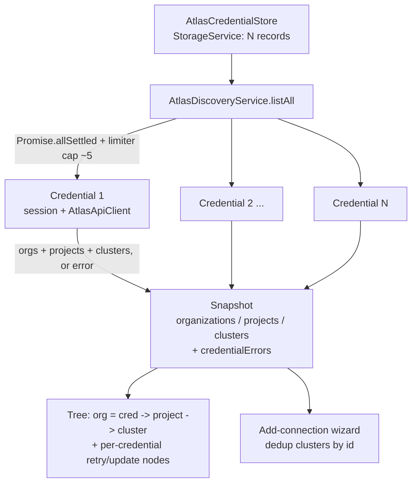

# Multi-credential Atlas discovery — feasibility POC plan & API research report

> **Status:** Research + design proposal (no production code yet).
> **Scope:** Step 0 (POC) of the [Iteration 3 open-work ledger](./ux-review-iteration-3.md#step-0--multi-credential-feasibility-poc-do-first),
> covering review items **#7** (multi-credential management), **#8** (org level + tree/list),
> and **#12** (credential identity/label lifecycle).
> **Audience:** engineers deciding whether to build multi-credential Atlas discovery, and
> whether the effort is proportionate to the value (this feature may be scrapped if the
> effort proves disproportionate — hence this up-front research).
> **Author aid:** file references use paths relative to this document so they resolve on GitHub.

---

## 0. TL;DR / recommendation

**Feasible, and lower-risk than expected.** The Atlas Admin API and the extension's existing
storage/tree infrastructure support everything the POC needs. The single most important
finding reframes the whole feature:

> **Each Atlas API Key and each Service Account is scoped to exactly one organization.**
> To see _N_ organizations you _must_ hold _N_ credentials. Therefore "multi-credential
> support" and "multi-org support" (item #8's tree level) are the **same feature** — a
> credential is, for practical purposes, an org handle. This collapses items #7 and #8 into
> one data model and removes most of the ambiguity in the ledger.

Recommended shape:

1. A **`AtlasCredentialStore`** built on the shared `StorageService` (the Kubernetes
   `sourceStore` pattern), holding _N_ credential records (non-secret metadata in `properties`,
   secrets in `SecretStorage`).
2. A **per-credential session/token layer** (`AtlasSessionManager` becomes one-per-credential,
   owned by the store) so token refresh, expiry, and auth-method are isolated.
3. A **single aggregation API** — `AtlasDiscoveryService.listAll()` — that fans out across
   credentials with `Promise.allSettled`, **never throws**, and returns
   `{ organizations, projects, clusters, credentialErrors }`. Partial failure of one
   credential never hides another's results.
4. **Parallel fan-out** across credentials (bounded by a concurrency limiter, cap ~4–5) is
   safe and ~8× faster than sequential — proven by [Experiment 3](#experiment-3--parallel-vs-sequential-fan-out).

**Effort:** medium. See [§10 effort & decision gates](#10-effort-estimate-decision-gates--scrap-criteria).
**Confidence in feasibility:** high (>90%). The two remaining unknowns both require a live
Atlas account to close and are called out as [live experiments](#92-experiments-requiring-a-live-atlas-account-deferred).

---

## 1. Why this research exists

The reviewer explicitly flagged this as an "API redesign" and the ledger deliberately puts a
**disposable POC first** so we validate the data/identity model before building UX on top of
it. If Atlas behaviour makes the model impractical (e.g. no stable identity, hostile rate
limits, or unavoidable all-or-nothing failure), we revise #7/#8 or scrap the feature rather
than sink UI effort into an unsupported assumption. This document does that validation on
paper and with isolated experiments, and lists the few checks that genuinely need a live
account.

---

## 2. Current architecture (single-session baseline)

| Concern | Today | File |
| --- | --- | --- |
| Session | Exactly **one** `AtlasSession` (API key _or_ SA) | [AtlasSessionManager](../../../../src/plugins/service-atlas-mongodb/auth/AtlasSessionManager.ts) |
| Secret storage | **Fixed single-slot keys** (`atlas-mongodb.apikey.publicKey`, …) | [AtlasSessionManager.ts#L15-L20](../../../../src/plugins/service-atlas-mongodb/auth/AtlasSessionManager.ts#L15-L20) |
| API client | One `AtlasApiClient` bound to one session; silent SA token refresh on 401/403 | [AtlasApiClient](../../../../src/plugins/service-atlas-mongodb/api/AtlasApiClient.ts) |
| Tree root | Fetches `listProjects()` + `listOrganizations()` for the single session | [AtlasServiceRootItem](../../../../src/plugins/service-atlas-mongodb/discovery-tree/AtlasServiceRootItem.ts) |
| Recovery UX | Per-session `sign-in` / `retry` / `update-credentials` error nodes | [AtlasServiceRootItem.ts#L136-L170](../../../../src/plugins/service-atlas-mongodb/discovery-tree/AtlasServiceRootItem.ts#L136-L170) |

The single-slot secret keys are the structural blocker: they physically allow only one API key
and one Service Account. Everything else (client, tree, error nodes) is already
credential-agnostic enough to generalise.

---

## 3. Atlas Admin API — research findings

Sources: [Get Started with the Atlas Administration API](https://www.mongodb.com/docs/atlas/configure-api-access/),
[API Reference](https://www.mongodb.com/docs/atlas/api/atlas-admin-api-ref/),
[API Rate Limits](https://www.mongodb.com/docs/atlas/api/api-rate-limit/).

### 3.1 Credential scoping — the load-bearing fact

- API Keys and Service Accounts are **created inside a single organization** ("To create a
  service account or API keys for an organization, you must have `Organization Owner` access to
  **that** organization"). A credential authenticates as an **org-scoped programmatic identity**,
  not as a human user who may span many orgs.
- Consequently `GET /api/atlas/v2/orgs` for a given credential returns effectively **its one
  org**; `GET /api/atlas/v2/groups` returns the projects that credential can see within that org.
- **Design implication:** the credential list _is_ the org list. Item #8's "org → project →
  cluster" tree is naturally `credential(=org) → project → cluster`. No separate org-discovery
  mechanism is needed.

### 3.2 Authentication mechanics (already implemented, must go per-credential)

| Method | Mechanism | Expiry | Refresh |
| --- | --- | --- | --- |
| API Key | HTTP **Digest** (public key = user, private key = password) | Never expires | N/A — keys are long-lived |
| Service Account | OAuth2 **client_credentials** → Bearer token | **Access token: 3600 s (1 h)** | **Not refreshable.** Mint a _new_ token from `client_id`/`client_secret` at `POST https://cloud.mongodb.com/api/oauth/token` |

Confirmed from docs: _"The access token is valid for 1 hour (3600 seconds). You can't refresh
an access token. When this access token expires, repeat this step to generate a new one."_ The
current code already does exactly this in
  [`tryRefreshServiceAccount`](../../../../src/plugins/service-atlas-mongodb/auth/AtlasSessionManager.ts#L291-L317)
and [`AtlasServiceAccountClient`](../../../../src/plugins/service-atlas-mongodb/auth/AtlasServiceAccountClient.ts).
The client secret itself has a separate, user-chosen expiry (months) — when it lapses, token
minting fails with a 401 and the credential needs re-entry.

### 3.3 Pagination

`results` + `totalCount` + `links` (`prev`/`next`/`self`). Query params: `pageNum` (1-based,
default 1), `itemsPerPage` (default 100, **max 500**), `includeCount`. The current client reads
only page 1 ([`AtlasApiClient.listProjects`](../../../../src/plugins/service-atlas-mongodb/api/AtlasApiClient.ts#L50-L53)),
which silently truncates accounts with >100 projects/clusters. **The aggregation layer should
follow `links.next` (or loop `pageNum`) — a latent bug worth fixing while we are here.**

### 3.4 Rate limits (Token Bucket) — parallelism is safe

Atlas rate-limits per **endpoint set** and **scope** (`USER`, `GROUP`, `ORGANIZATION`, `IP`),
each with its own bucket. The endpoints discovery uses:

| Endpoint | Scope | Capacity | Refill |
| --- | --- | --- | --- |
| `GET /orgs` (list orgs) | **USER** | 300 | 100 / 60 s |
| `GET /groups` (list projects) | **USER** | 1200 | 500 / 60 s |
| `GET /groups/{id}/clusters` | **GROUP** | 10000 | 5000 / 60 s |

Because `/orgs` and `/groups` are **USER-scoped**, and a credential is its own programmatic
"user", **each credential has an independent bucket**. Fanning discovery out across _N_
credentials in parallel does **not** contend on a shared bucket. On 429 Atlas returns a
`Retry-After` header (and `RateLimit-Limit`/`RateLimit-Remaining`, which _may be absent_) and
an errorCode `RATE_LIMITED_TOKEN_BUCKET`. [Experiment 4](#experiment-4--token-bucket-headroom)
shows discovery spends ~1–2 tokens per credential per refresh — three orders of magnitude below
capacity. **Conclusion: parallel is fine; a bounded limiter and 429/Retry-After handling are
defensive, not load-bearing.**

### 3.5 Error model — distinguishing "empty" from "broken"

Error body fields: `detail`, `error` (int status), `errorCode` (stable constant), `parameters`,
`reason`. Two facts are critical for the "should I suggest a refresh?" UX:

- **An empty list is `200` with `results: []`, _not_ `404`.** So "no projects" is an
  authoritative, healthy answer — not an error. 404 is only returned when the _context_ does
  not exist (e.g. projects of a non-existent org).
- **IP Access List rejections are `403`.** A credential can be perfectly valid yet return 403
  because the caller's IP isn't allow-listed. This is per-credential and recoverable by editing
  the Atlas access list — it must be reported as a credential error, not a global sign-out.

This lets the aggregation layer tag each credential result as one of:
`ok-with-data` · `ok-empty` · `auth-error(401)` · `forbidden(403)` · `rate-limited(429)` ·
`network/other`. The "suggest a refresh" affordance is only shown for the recoverable error
states, never for `ok-empty`.

---

## 4. Azure prior art in this repo — what to copy and what to avoid

(From a full read of `src/plugins/api-shared/azure/`; captured in repo memory.)

| Aspect | Azure implementation | Verdict for Atlas |
| --- | --- | --- |
| Aggregation entry point | Single `getSubscriptions(true)` flattens all tenants → one list | ✅ Copy the "one aggregation surface" idea |
| Fan-out | `Promise.all` over tenants for `isSignedIn` checks | ❌ **All-or-nothing** — one failing tenant discards _every_ account ([SelectAccountStep.ts#L135-L182](../../../../src/plugins/api-shared/azure/credentialsManagement/SelectAccountStep.ts#L135-L182)) |
| Concurrency | Shared limiter, cap 5, across wizard steps | ✅ Reuse [`createConcurrencyLimiter`](../../../../src/utils/concurrencyLimiter.ts) |
| Ordering gotcha | `getTenants` + `getSubscriptions` **must be sequential** — running them in parallel returned incorrect data (documented in-code) | ⚠️ Heed within a credential; across credentials it doesn't apply |
| Token refresh | Delegated to `@microsoft/vscode-azext-azureauth` (opaque) | ➖ Atlas has no such library; we own SA token minting (already do) |
| Per-account error node | **None** — a global "configure credentials" retry node only | ❌ Weaker than Atlas's existing per-session nodes; **do better** |

**Net:** Azure gives us the "single aggregation surface + concurrency limiter" pattern to copy,
and a concrete anti-pattern to avoid (`Promise.all` all-or-nothing, no per-account error
surface). Atlas's _existing_ per-session error nodes are already better than Azure's; we
generalise them to per-credential.

---

## 5. Proposed API-level design

### 5.1 Storage — `AtlasCredentialStore` (StorageService, K8s `sourceStore` pattern)

Model each credential as a `StorageItem` under `StorageService.get('atlas-mongodb-discovery')`
in a `credentials` workspace, mirroring [sourceStore.ts](../../../../src/plugins/service-kubernetes/sources/sourceStore.ts):

```ts
interface AtlasCredentialRecordProps extends Record<string, unknown> {
    readonly authMethod: 'apikey' | 'serviceaccount';
    readonly label?: string;        // user-supplied friendly name (optional)
    readonly orgId?: string;        // cached from first successful listOrgs()
    readonly orgName?: string;      // cached; primary display label (see §5.5)
    readonly order: number;         // stable display order
    readonly version: '1';          // schema version for future migrations
}
// secrets[] (SecretStorage-backed):
//   apikey        → { publicKey, privateKey }
//   serviceaccount→ { clientId, clientSecret, accessToken?, expiresAt? }
```

- **Stable ID:** a generated `randomUUID()` per credential (like K8s sources). Never derived
  from the secret, so rotating a key keeps the same record ID and the same tree paths / saved
  connections. (Answers POC Q1 + Q6.)
- **No migration:** Atlas discovery has never shipped, so the single-slot keys carry no user
  data; the new store starts clean (matches the ledger's note).
- In-memory cache with explicit invalidation, exactly like `sourceStore`.

### 5.2 Identity & per-credential session

Refactor `AtlasSessionManager` from a **singleton holding one session** into a
**per-credential instance** owned by the store, _or_ keep one manager but key all its state by
`credentialId` (a `Map<credentialId, AtlasSessionState>` + per-credential secret keys). Either
way:

- Each credential restores independently after reload (separate secret slots ⇒ no cross-write).
  (Answers POC Q2.)
- Each credential's SA token refresh is isolated: an expired token on credential A never
  touches credential B. (Answers POC Q3.)
- `AtlasApiClient` is already constructed _per session_
  ([AtlasServiceRootItem.ts#L49](../../../../src/plugins/service-atlas-mongodb/discovery-tree/AtlasServiceRootItem.ts#L49));
  we simply build one per credential.

### 5.3 The single "list everything" aggregation API

```ts
interface CredentialError {
    readonly credentialId: string;
    readonly label: string;
    readonly kind: 'auth' | 'forbidden' | 'rateLimited' | 'network' | 'other';
    readonly status?: number;
    readonly message: string;
    readonly retryable: boolean;   // false only for unrecoverable/removed
}

interface AtlasDiscoverySnapshot {
    readonly organizations: Array<AtlasOrganization & { credentialId: string }>;
    readonly projects:      Array<AtlasProject      & { credentialId: string }>;
    readonly clusters:      Array<AtlasCluster      & { credentialId: string }>;
    readonly credentialErrors: CredentialError[];   // partial-failure descriptors
    readonly credentialsQueried: number;
}

class AtlasDiscoveryService {
    // Never throws. One call powers both tree modes and the wizard.
    async listAll(signal?: AbortSignal): Promise<AtlasDiscoverySnapshot>;
}
```

Implementation (validated by [Experiment 2](#experiment-2--single-list-all-api-with-per-credential-isolation)):

- Fan out across credentials with a **concurrency limiter (cap ~4–5)** wrapping
  `Promise.allSettled`.
- Within a credential: `listOrgs()` + `listProjects()` (parallel is fine here — they are
  different endpoints and different scopes), then clusters per project (bounded).
- A whole-credential auth failure is captured as a `CredentialError` and does **not** abort the
  fleet. A single project's cluster-list failure is captured at project scope.
- Reuse the existing silent SA-token-refresh-and-retry in `AtlasApiClient.request`
  [AtlasApiClient.ts#L100-L120](../../../../src/plugins/service-atlas-mongodb/api/AtlasApiClient.ts#L100-L120)
  — it already does the "refresh once, retry once, else surface" dance per credential.

### 5.4 Parallel vs sequential — decision

**Parallel across credentials, bounded.** Justification:

- Different credentials = different USER-scoped buckets ⇒ no shared rate limit (§3.4).
- ~8× wall-clock improvement for an 8-credential fleet ([Experiment 3](#experiment-3--parallel-vs-sequential-fan-out)).
- The Azure "sequential to avoid wrong data" gotcha is about `getTenants` vs
  `getSubscriptions` _within one provider_; it does not apply across independent Atlas
  credentials. **Keep org/projects sequencing sane _within_ a credential; parallelise
  _across_ credentials.**
- Cap the fan-out (limiter) purely as defence against a user with dozens of credentials, not
  because Atlas requires it.

### 5.5 Display label (POC Q4)

Atlas exposes **no user profile for Service Accounts** and only a programmatic identity for API
keys. Label resolution order:

1. **User-supplied label** captured in the add/edit webview (item #6) — always wins if present.
2. **Org name** from the first successful `listOrgs()` (cached in `orgName`). Reliable because
   a credential ≈ one org, and it is meaningful to the user.
3. **Fallbacks:** API key → `publicKey` prefix (e.g. `abcd1234…`); SA → `clientId` prefix.
   Never render the secret.

This also removes the current global `STATE_USER_DISPLAY_NAME`
([config.ts#L38](../../../../src/plugins/service-atlas-mongodb/config.ts#L38)), which is a
single-slot concept that cannot survive multi-credential.

### 5.6 Token-refresh maintenance across the fleet

- **On demand (lazy):** `getSession(credentialId)` checks SA expiry (existing
    [`isExpired`](../../../../src/plugins/service-atlas-mongodb/auth/AtlasSessionManager.ts#L319-L323),
  60 s skew) and mints a fresh token if needed. API keys need nothing.
- **On 401/403 during a request:** existing refresh-once-retry-once in `AtlasApiClient`.
- **No background timer needed:** tokens are only needed at discovery/expand time; minting is
  cheap (one POST) and the `oauth/token` endpoint is separate from the discovery buckets.
  Refreshing all credentials at once is safe (Experiment 4).

---

## 6. Error reporting model — partial results with per-credential attribution

This is the crux of the reviewer's concern ("how do we report an error while still returning
all other data?") and the hardest UX question.

### 6.1 The principle

`listAll()` returns **data _and_ errors together**. The tree renders both:

- Healthy credentials → their org/project/cluster branches.
- Each failed credential → a scoped, actionable error node **under that credential's own org
  node** (or, in list mode, a top-level row), reusing the existing
  [`retry`/`update-credentials`/`sign-in` nodes](../../../../src/plugins/service-atlas-mongodb/discovery-tree/AtlasServiceRootItem.ts#L136-L170).

### 6.2 The "no projects → suggest refresh" problem, generalised

Today the logic is simple because there is one session: no projects ⇒ show an info node / suggest
retry ([AtlasServiceRootItem.ts#L96-L114](../../../../src/plugins/service-atlas-mongodb/discovery-tree/AtlasServiceRootItem.ts#L96-L114)).
With many credentials this must become **per-credential**, and it must distinguish _authoritative
emptiness_ from _failure_ (enabled by §3.4's `200 []` vs `403`/`401`):

| Per-credential outcome | Tree presentation | Suggest refresh? |
| --- | --- | --- |
| `ok-with-data` | org → projects → clusters | no |
| `ok-empty` (`200`, `[]`) | org node + muted "No projects visible to this credential" | **no** (it's a true answer) |
| `forbidden (403)` | org node (if known) or credential row + "Access denied — check IP access list / roles" + **retry** | yes |
| `auth (401)` | credential row + "Credentials rejected — update credentials" + **update** | yes (via update) |
| `rateLimited (429)` | credential row + "Rate limited — retry shortly" (honour `Retry-After`) | auto-retry after delay |
| `network/other` | credential row + generic + **retry** | yes |

A **fleet-level summary** is only shown when it adds signal, e.g. a status-bar / root
description like _"2 of 4 credentials failed to load"_, so the user notices partial degradation
without a modal per credential. Modals (the item #3 pattern) are reserved for the _single-
credential_ empty case to avoid modal storms.

### 6.3 How Azure answers the same question (and why we go further)

Azure's `getSubscriptions(true)` returns a flat list and, on a per-tenant auth problem, relies
on the auth library to prompt re-sign-in; the extension's own wizard uses `Promise.all` and
**collapses to an empty list on any failure** (§4). Azure's discovery tree shows a _single_
global "configure credentials" node, not per-tenant errors. Our proposal is deliberately
**stronger**: `allSettled` + per-credential error descriptors + per-credential retry nodes, so
one dead credential degrades gracefully instead of blanking the view. [Experiment 1](#experiment-1--aggregation-semantics)
demonstrates the concrete difference.

---

## 7. Answers to the seven POC questions (ledger §Step 0)

1. **Stable non-secret ID + secrets in SecretStorage via StorageService?** ✅ Yes — `randomUUID`
   record ID, secrets in `secrets[]`, exactly the K8s `sourceStore` shape (§5.1).
2. **Independent restore after reload without cross-overwrite?** ✅ Yes — per-credential secret
   slots keyed by ID replace the fixed single-slot keys (§5.1–5.2).
3. **Independent per-credential discovery incl. SA token refresh, no global session?** ✅ Yes —
   per-credential session + per-credential `AtlasApiClient`; refresh isolated (§5.2, §5.6).
4. **Stable user-facing label without a user profile (esp. SA)?** ✅ Org name (cached) with
   user-label override and key/clientId-prefix fallback (§5.5).
5. **Duplicate org/project/cluster across credentials — merge, once+attribution, or per
   credential?** → Because a credential ≈ one org, duplicates are rare. **Recommended:** key by
   Atlas resource ID; in **tree mode** show per-credential org nodes (no dedup needed — natural);
   in **list mode / wizard** dedup clusters by cluster ID (or SRV connection string) and remember
   the set of credentials that can reach each, picking the first healthy credential as the action
   owner. Alternative (simpler for POC): no dedup, always per-credential — accept rare visual
   dupes. (See [alternatives](#11-alternatives).)
6. **Which credential owns a node / subsequent request, retained through refresh/retry/connect?**
   ✅ Every snapshot row carries `credentialId`; tree items store it; the wizard threads it into
   connection creation. Stable because the ID is secret-independent (§5.1).
7. **One valid + one expired/denied/removed — failure must not hide others.** ✅ `allSettled`
   aggregation with per-credential `CredentialError`; proven by [Experiment 1](#experiment-1--aggregation-semantics)
   and [Experiment 2](#experiment-2--single-list-all-api-with-per-credential-isolation).

---

## 8. Reference architecture (diagram)



---

## 9. Experiments

### 9.1 Experiments performed in isolation (no live account, no secrets)

Run with `node experiment.mjs` (throwaway script kept out of the repo). Full script text is in
[Appendix A](#appendix-a--experiment-script). Verbatim results:

#### Experiment 1 — aggregation semantics

Models a fleet of 4 credentials (2 API keys + 2 SAs) with one 403 and one 401.

```
Promise.all         → {"ok":false,"reason":"401 Token expired / client secret rotated"}
Promise.allSettled  → {"orgs":2,"healthy":["Acme","Gamma"],
                       "failures":[{credentialId:k2,403},{credentialId:s2,401}]}
```

**Finding:** `Promise.all` loses _all_ data on the first rejection; `allSettled` yields the two
healthy orgs **and** two per-credential error descriptors. Validates §6.

#### Experiment 2 — single "list all" API with per-credential isolation

```
Aggregated in 140ms → {"orgs":["Acme","Gamma"],"projects":4,"clusters":4,
                        "errors":["credential:s2 (401)","credential:k2 (403)"]}
```

**Finding:** healthy credentials expand fully (2 orgs → 4 projects → 4 clusters); broken ones
surface as credential-scoped errors; **no throw escapes** `listAll()`. Validates §5.3.

#### Experiment 3 — parallel vs sequential fan-out

8 healthy credentials, 100 ms simulated latency each.

```
Sequential: 1604ms   Parallel(cap8): 201ms   speedup: 8.0x
```

**Finding:** parallel fan-out is ~8× faster; safe because USER-scoped buckets are
per-credential. Validates §5.4.

#### Experiment 4 — token-bucket headroom

```
4 credentials, one full "refresh all" = 1 /orgs + 1 /groups token PER credential (separate buckets).
50 back-to-back refreshes = 50/300 /orgs and 50/1200 /groups per credential — far below capacity.
```

**Finding:** rate limiting is a non-issue for discovery; the limiter and 429 handling are
defensive only. Validates §3.4.

### 9.2 Experiments requiring a live Atlas account (deferred)

These cannot be run autonomously (no credentials, and the security policy forbids routing
secrets). They are the only feasibility gaps left; each is cheap once an account exists.

| # | Hypothesis to confirm | Method | Closes |
| --- | --- | --- | --- |
| L1 | An org-scoped credential's `/orgs` returns exactly its one org (credential ≈ org) | Create 2 API keys in 2 orgs; call `/orgs` with each; confirm 1 org each | §3.1 core assumption |
| L2 | A valid credential with a non-allow-listed IP returns **403**, not 401 | Create key, omit caller IP from access list, call `/groups` | §3.4 error taxonomy |
| L3 | `>100` projects paginate as documented via `links.next` | Point at an org with >100 projects (or mock via `itemsPerPage=1`) | §3.3 pagination fix |
| L4 | SA token mint under concurrent refresh has no surprising throttle on `oauth/token` | Fire N parallel client_credentials mints | §5.6 |
| L5 | Two credentials in the **same** org produce duplicate org/project IDs (dedup path) | Add 2 keys to 1 org; run `listAll()`; inspect dupes | §7 Q5 |

> **Recommendation:** run L1 and L2 first — they gate the whole "credential = org" model. If L1
> is false (a credential can span orgs), the tree in §8 still works but the dedup policy (Q5)
> becomes more important. Everything else survives.

---

## 10. Effort estimate, decision gates & scrap criteria

### 10.1 Effort (relative)

| Slice | What | Size |
| --- | --- | --- |
| A | `AtlasCredentialStore` on StorageService (copy `sourceStore`) | S–M |
| B | Per-credential session/token refactor of `AtlasSessionManager` | M |
| C | `AtlasDiscoveryService.listAll` aggregation + pagination fix | M |
| D | Tree: per-credential org nodes + per-credential error/retry nodes (list mode later, item #8) | M |
| E | Manage-credentials QuickPick (Azure-style) + wire to add/edit webview (item #6) | M |
| F | Wizard: dedup + credential attribution through connect | S–M |
| G | Tests (unit for store/aggregation/error taxonomy) + l10n | M |

No slice is "L". The refactor (B) touches the most files but is mechanical (single-slot →
keyed-by-ID). The aggregation (C) is the intellectually load-bearing piece and is already
prototyped here.

### 10.2 Decision gates (build only if all hold)

1. **L1 passes** (credential ≈ org, or at least a stable enumerable org set). — _blocking_
2. **L2 confirms 403-vs-401 distinguishability** so "empty vs broken vs forbidden" UX is real. — _blocking_
3. Product still wants multiple orgs visible simultaneously (the whole point). — _product_

### 10.3 Scrap / de-scope criteria

- If L1 shows credentials cannot be stably attributed to an org **and** dedup proves messy,
  **de-scope item #8's org tree** and ship item #7 as a flat, per-credential cluster list only.
- If the manage-credentials UX (E) balloons, ship the **store + aggregation (A–C)** behind the
  existing single-session UX first (invisible internal refactor), then add multi-credential UI
  as a fast follow. A–C alone fixes the pagination bug and the all-or-nothing risk with zero
  UX surface, so it is low-regret even if the feature is later cut.
- If none of the above and effort still feels disproportionate to demand, **scrap** — the
  single-credential path already works and this document is the sunk cost, not the UI.

---

## 11. Alternatives considered

1. **Keep one global session, add a "switch credential" command.** Cheapest, but defeats the
   reviewer's goal (see many orgs _at once_) and keeps the single-slot storage. Rejected as the
   primary path; acceptable **fallback** if item #8 is de-scoped.
2. **No dedup, always per-credential grouping.** Simplest aggregation (skip Q5 entirely). Since
   a credential ≈ one org, dupes only appear when two credentials share an org — rare. Good
   **POC-stage** choice; revisit dedup only if L5 shows it matters.
3. **Bespoke secret store instead of `StorageService`.** Rejected — reinvents the K8s solution,
   more migration risk, no upside.
4. **Background token-refresh timer.** Rejected — lazy refresh at expand time is sufficient and
   avoids a lifecycle to manage (§5.6).
5. **Sequential fan-out** (Azure-style, for "safety"). Rejected — 8× slower for no benefit;
   the Azure ordering gotcha doesn't apply across independent credentials (§5.4).

---

## 12. Next actions

1. Provision a scratch Atlas org (or two) and run **L1 + L2** — the only blocking unknowns.
2. If they pass, land **slices A–C** as an internal refactor (no UX change): credential store,
   per-credential sessions, `listAll()` with pagination + `allSettled`. This is low-regret and
   independently valuable.
3. Then build the manage-credentials QuickPick (E) + wire the item-#6 webview, followed by the
   tree work (D) and item #8 modes.
4. Update the [Iteration 3 ledger](./ux-review-iteration-3.md#open-work-summary-and-proposed-order-2026-07-24)
   Step 0 row with the L1/L2 outcomes and this document's decisions.

---

## Appendix A — experiment script

The isolated experiment (no secrets, no network) used for §9.1. Kept out of the repo; reproduced
here for auditability. Run with `node experiment.mjs` on Node ≥ 18.

```js
const sleep = (ms) => new Promise((r) => setTimeout(r, ms));

// A tiny copy of src/utils/concurrencyLimiter.ts
function createConcurrencyLimiter({ concurrency }) {
    const cap = Number.isFinite(concurrency) ? Math.max(1, Math.floor(concurrency)) : 1;
    let active = 0;
    const waiters = [];
    const release = () => { active--; const resume = waiters.shift(); if (resume) resume(); };
    return async (fn) => {
        if (active >= cap) await new Promise((res) => waiters.push(res));
        active++;
        try { return await fn(); } finally { release(); }
    };
}

class ApiError extends Error {
    constructor(message, statusCode) { super(message); this.statusCode = statusCode; }
}

function makeCredential({ id, kind, orgName, latencyMs = 60, fail }) {
    return {
        id, kind, label: orgName ? `${orgName} (${kind})` : id,
        async listOrgs() { await sleep(latencyMs); if (fail) throw fail(); return [{ id: `${id}-org`, name: orgName ?? `${id}-org` }]; },
        async listProjects() {
            await sleep(latencyMs); if (fail) throw fail();
            return [
                { id: `${id}-p1`, name: `${orgName}-proj-A`, orgId: `${id}-org` },
                { id: `${id}-p2`, name: `${orgName}-proj-B`, orgId: `${id}-org` },
            ];
        },
        async listClusters(projectId) { await sleep(latencyMs); if (fail) throw fail(); return [{ id: `${projectId}-c1`, name: `${projectId}-cluster` }]; },
    };
}

// Fleet: 2 API keys + 2 Service Accounts, one of each broken (403 / 401).
function makeFleet() {
    return [
        makeCredential({ id: 'k1', kind: 'apikey', orgName: 'Acme', latencyMs: 50 }),
        makeCredential({ id: 'k2', kind: 'apikey', orgName: 'Beta', latencyMs: 40, fail: () => new ApiError('Access denied (IP access list)', 403) }),
        makeCredential({ id: 's1', kind: 'serviceaccount', orgName: 'Gamma', latencyMs: 70 }),
        makeCredential({ id: 's2', kind: 'serviceaccount', orgName: 'Delta', latencyMs: 30, fail: () => new ApiError('Token expired / client secret rotated', 401) }),
    ];
}

// EXPERIMENT 1 — Promise.all (all-or-nothing) vs Promise.allSettled (partial success)
async function experiment1() {
    const fleet = makeFleet();
    let a;
    try { const orgs = await Promise.all(fleet.map((c) => c.listOrgs())); a = { ok: true, orgs: orgs.flat().length }; }
    catch (err) { a = { ok: false, reason: `${err.statusCode ?? ''} ${err.message}`.trim() }; }
    console.log('Promise.all        →', JSON.stringify(a));

    const settled = await Promise.allSettled(fleet.map((c) => c.listOrgs()));
    const orgs = [], failures = [];
    settled.forEach((res, i) => {
        const cred = fleet[i];
        if (res.status === 'fulfilled') orgs.push(...res.value.map((o) => ({ ...o, credentialId: cred.id })));
        else failures.push({ credentialId: cred.id, label: cred.label, error: res.reason.message, status: res.reason.statusCode });
    });
    console.log('Promise.allSettled →', JSON.stringify({ orgs: orgs.length, healthy: orgs.map((o) => o.name), failures }));
}

// EXPERIMENT 2 — single "list all" API: never throws, returns data + per-credential errors
async function aggregateAll(fleet, { credentialConcurrency = 4, perCredConcurrency = 4 } = {}) {
    const credLimit = createConcurrencyLimiter({ concurrency: credentialConcurrency });
    const result = { orgs: [], projects: [], clusters: [], errors: [] };
    await Promise.all(fleet.map((cred) => credLimit(async () => {
        try {
            const [orgs, projects] = await Promise.all([cred.listOrgs(), cred.listProjects()]);
            orgs.forEach((o) => result.orgs.push({ ...o, credentialId: cred.id }));
            const clusterLimit = createConcurrencyLimiter({ concurrency: perCredConcurrency });
            await Promise.all(projects.map((p) => clusterLimit(async () => {
                result.projects.push({ ...p, credentialId: cred.id });
                try {
                    const clusters = await cred.listClusters(p.id);
                    clusters.forEach((c) => result.clusters.push({ ...c, projectId: p.id, credentialId: cred.id }));
                } catch (err) {
                    result.errors.push({ scope: 'project', credentialId: cred.id, projectId: p.id, error: err.message, status: err.statusCode });
                }
            })));
        } catch (err) {
            result.errors.push({ scope: 'credential', credentialId: cred.id, label: cred.label, error: err.message, status: err.statusCode });
        }
    })));
    return result;
}
async function experiment2() {
    const fleet = makeFleet();
    const t0 = Date.now();
    const agg = await aggregateAll(fleet);
    console.log(`Aggregated in ${Date.now() - t0}ms →`, JSON.stringify({
        orgs: agg.orgs.map((o) => o.name), projects: agg.projects.length, clusters: agg.clusters.length,
        errors: agg.errors.map((e) => `${e.scope}:${e.credentialId} (${e.status})`),
    }));
}

// EXPERIMENT 3 — parallel vs sequential wall-clock (healthy fleet of 8)
async function experiment3() {
    const healthy = Array.from({ length: 8 }, (_, i) => makeCredential({ id: `c${i}`, kind: i % 2 ? 'apikey' : 'serviceaccount', orgName: `Org${i}`, latencyMs: 100 }));
    const tSeq = Date.now();
    for (const c of healthy) { await c.listOrgs(); await c.listProjects(); }
    const seqMs = Date.now() - tSeq;
    const tPar = Date.now();
    await aggregateAll(healthy, { credentialConcurrency: 8 });
    const parMs = Date.now() - tPar;
    console.log(`Sequential: ${seqMs}ms   Parallel(cap8): ${parMs}ms   speedup: ${(seqMs / parMs).toFixed(1)}x`);
}

// EXPERIMENT 4 — token-bucket headroom (USER scope is per-credential)
function experiment4() {
    const ORGS_CAPACITY = 300, GROUPS_CAPACITY = 1200, credentials = 4;
    console.log(`With ${credentials} credentials, one refresh spends 1 /orgs + 1 /groups token per credential (separate USER buckets).`);
    console.log(`50 back-to-back refreshes = 50/${ORGS_CAPACITY} /orgs and 50/${GROUPS_CAPACITY} /groups per credential — far below capacity.`);
}

await experiment1();
await experiment2();
await experiment3();
experiment4();
```

_Prepared as the Step-0 feasibility POC for MongoDB Atlas multi-credential discovery
(review items #7/#8/#12). Isolated experiments executed 2026-07-24; live-account experiments
(L1–L5) deferred pending a scratch Atlas org._
