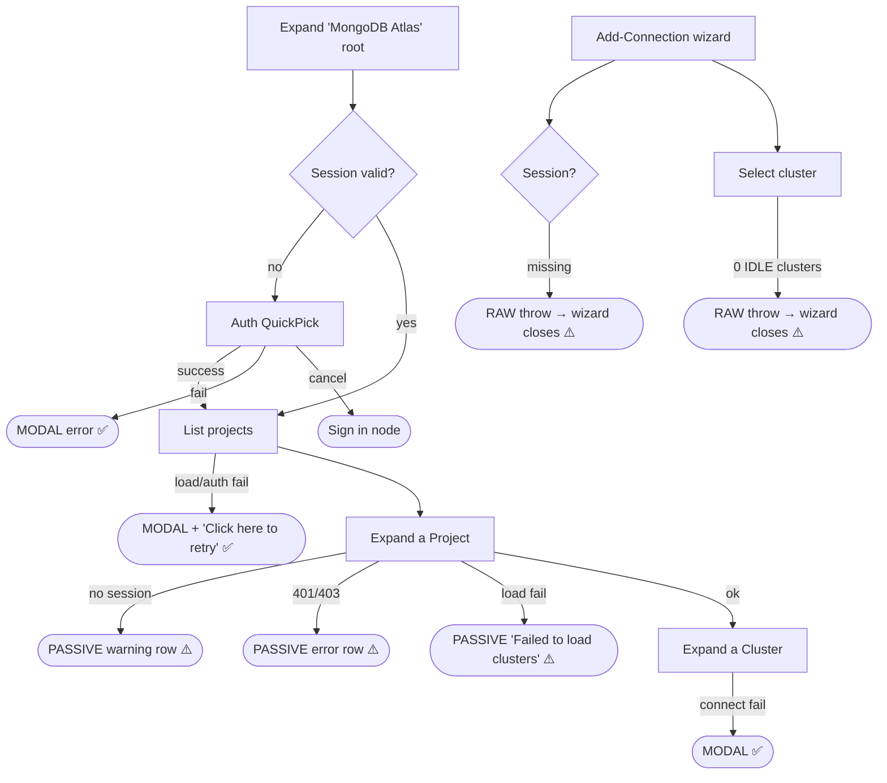

# MongoDB Atlas Discovery — UX Review Pack (Iteration 3)

> **Who this is for:** anyone about to do a hands-on UX review of the **MongoDB Atlas
> discovery provider**, or anyone triaging the findings.
> **What this is:** a single catch-up document that captures a round of runtime UX
> feedback, states what the code _actually does today_ (verified against the current
> branch), and — for each item — offers a **suggestion** and a **status**. Items are
> **sorted by priority** (P0 → P3).

- **Feature area:** [src/plugins/service-atlas-mongodb/](../../../../src/plugins/service-atlas-mongodb)
- **PR / branch:** [microsoft/vscode-documentdb#733](https://github.com/microsoft/vscode-documentdb/pull/733) · `dev/tnaum/atlas-discovery-review-iteration-2`
- **Related design docs:** [decisions.md](./decisions.md) · [ux-review-iteration-1-k8s-alignment.md](./ux-review-iteration-1-k8s-alignment.md) · [ux-review-iteration-2-cluster-item.md](./ux-review-iteration-2-cluster-item.md) · [atlas-mongodb-discovery-flow.md](../../../atlas-mongodb-discovery-flow.md)
- **Scope:** the UX-facing surface (tree structure, wording, icons, webviews, lifecycle
  actions, error recovery). Backend internals appear only where they explain a
  user-visible symptom.
- **Review date:** 2026-07-13

## How this review was run

A person exercised the real feature and dictated observations; an AI assistant did the
code-checking, root-cause tracing, and write-up. Each finding is backed by the exact code
path that produces the behavior, so a later implementation pass doesn't have to re-derive
it. Items are grouped and ordered **by priority**; each carries an **Observation** (what
the reviewer saw), a **Finding** (what the code does and why), a **Suggestion**, and a
**Status**. Heavier design questions with real trade-offs are pulled into
[Open ideas](#open-ideas--options-pros--cons).

> **This is iteration 3.** Iterations 1 (K8s/Azure alignment) and 2 (cluster-item
> presentation) have largely **landed** — the root node, cluster icon/description, and the
> root-level modal+retry error flow are all implemented (see [Implemented](#implemented)).
> This pass re-verifies the surface against the current branch and concentrates on the
> gaps that remain: **error-surface asymmetry at the _project_ tree level**, the
> **wizard raw-throw dead-ends**, and a handful of polish items.

## Legend

### Priority

| Priority | Meaning                                            |
| -------- | -------------------------------------------------- |
| **P0**   | Blocking — the user gets stuck                     |
| **P1**   | Broken / misleading, or a consistency & safety gap |
| **P2**   | Polish, expectation, or a smaller feature gap      |
| **P3**   | Nice-to-have / cosmetic / acknowledged             |

### Status

| Status             | Meaning                                                                  |
| ------------------ | ------------------------------------------------------------------------ |
| 🟠 **Open**        | Recorded + analyzed; carries a recommendation but stays a _suggestion_   |
| 🟡 **Open (soft)** | Open, but depends on an investigation or is a soft "leave as-is"         |
| ✅ **Implemented** | Changed on this branch and verified (Decision + commit link recorded)    |
| 🚫 **Closed**      | Won't fix — with a mandatory one-line reason                             |
| 🔗 **Tracked**     | Deferred to a repo issue (linked); dropped from the active priority list |

> **Items are worked in iterations.** Anything still 🟠 Open at the end of an iteration
> **moves to the next one** — an item leaves this ledger only as ✅ Implemented, 🚫 Closed,
> or 🔗 Tracked. Each fix records **why it was chosen** (Decision) and **how it was done**
> (Implemented + commit link).

### Markers (inline)

| Marker            | Meaning                                                 |
| ----------------- | ------------------------------------------------------- |
| ⚠️ **Flag**       | Confirmed gap or bug                                    |
| 💡 **Suggestion** | A design/wording recommendation to react to             |
| 🔍 **Answered**   | A "how does this work?" question answered from the code |

> **For the operator:** items below are **Open** by default — each records a recommendation
> that is a **suggestion, not a final decision**. Disagree freely; where there are real
> trade-offs, see [Open ideas](#open-ideas--options-pros--cons).

---

## User interaction map _(seed now)_

Where every user action **starts** and where it **terminates**. Divergent terminations
(modal vs. non-modal vs. silent vs. raw throw) are flagged here and re-checked live.

**ASCII flow**

```text
DISCOVERY PANEL
  Expand "MongoDB Atlas" root
    ├─ no session ──────────────► auth QuickPick ──► API Key / Service Account flow
    │                               │                  ├─ success ► toast + tree refresh
    │                               │                  └─ fail ───► MODAL error ✅
    │                               └─ cancel ────────► [Sign in] node (sign-in icon)
    ├─ session ok ─────────────────► list projects
    │        ├─ 0 projects ────────► [info] "No projects found"            (passive ✅)
    │        ├─ all filtered ──────► [filter] "All projects are hidden…"   (passive ✅)
    │        └─ load/auth failure ─► MODAL + [Click here to retry] node    ✅ (root)
    └─ Expand a PROJECT
             ├─ 0 clusters ────────► [info] "No clusters found…"           (passive ✅)
             ├─ no session ────────► [warning] "Please sign in… again."    ⚠️ PASSIVE
             ├─ 401/403 (None) ────► [error] "Please sign in… again."      ⚠️ PASSIVE
             ├─ 401/403 (intact) ──► [error] raw error.message            ⚠️ PASSIVE
             └─ load failure ──────► [error] "Failed to load clusters: …"  ⚠️ PASSIVE
                     └─ Expand a CLUSTER (Layer-2 SCRAM auth)
                              ├─ success ► databases
                              └─ fail ───► MODAL "Failed to connect…" ✅

ADD-CONNECTION WIZARD (Atlas provider)
  getDiscoveryWizard
    ├─ no session ──► auth QuickPick ─► success ► continue │ cancel ► UserCancelledError ✅
    ├─ Select project step
    │      └─ session missing ─────► THROW "Atlas session not available"  ⚠️ RAW → closes wizard
    └─ Select cluster step
           ├─ filters to IDLE-only clusters (hides CREATING/UPDATING)     ⚠️ tree/wizard mismatch
           └─ 0 IDLE clusters ─────► THROW "No active clusters found…"    ⚠️ RAW → closes wizard
```

**Mermaid**



The diagram makes the asymmetry obvious: **root-level** failures terminate in a **modal +
canonical retry node** (the house style), while **project-level** failures terminate in
**passive in-tree rows**, and the **wizard** terminates in **raw thrown errors** that
close the flow.

**Interaction inventory**

| #   | User action (entry)                    | Where it lives                                                                                                                       | Terminal state(s)                                 | Surface           | ⚠️  |
| --- | -------------------------------------- | ----------------------------------------------------------------------------------------------------------------------------------- | ------------------------------------------------- | ----------------- | --- |
| 1   | Expand root (signed out)               | [AtlasServiceRootItem.getChildren](../../../../src/plugins/service-atlas-mongodb/discovery-tree/AtlasServiceRootItem.ts#L39)         | Auth QuickPick → success/`Sign in` node           | quickpick / tree  |     |
| 2   | Root load / auth failure               | [AtlasServiceRootItem.showLoadFailure](../../../../src/plugins/service-atlas-mongodb/discovery-tree/AtlasServiceRootItem.ts#L205)    | **Modal** + `Click here to retry` node            | modal + tree      | ✅  |
| 3   | Expand project, load clusters          | [AtlasProjectItem.getChildren](../../../../src/plugins/service-atlas-mongodb/discovery-tree/AtlasProjectItem.ts#L36)                 | **Passive** error/warning rows                    | tree only         | ⚠️  |
| 4   | Expand cluster (SCRAM connect)         | [AtlasClusterItem.authenticateAndConnect](../../../../src/plugins/service-atlas-mongodb/discovery-tree/AtlasClusterItem.ts#L100)     | Databases / **modal** on failure                  | modal             | ✅  |
| 5   | Auth (API Key / Service Account)       | [AtlasApiKeyFlow.executeApiKeyFlow](../../../../src/plugins/service-atlas-mongodb/auth/AtlasApiKeyFlow.ts#L15)                        | Toast on success / **modal** on failure           | toast + modal     | ✅  |
| 6   | Manage Credentials (signed in)         | [AtlasDiscoveryProvider.configureCredentials](../../../../src/plugins/service-atlas-mongodb/AtlasDiscoveryProvider.ts#L169)          | QuickPick (account / sign out / exit)             | quickpick         |     |
| 7   | Organizations filter                   | [AtlasDiscoveryProvider.showOrganizations](../../../../src/plugins/service-atlas-mongodb/AtlasDiscoveryProvider.ts#L221)             | Tree refresh / **modal** on fetch failure         | quickpick + modal | ✅  |
| 8   | Project filter (funnel icon)           | [AtlasDiscoveryProvider.configureTreeItemFilter](../../../../src/plugins/service-atlas-mongodb/AtlasDiscoveryProvider.ts#L104)       | Tree refresh / info toast on empty                | quickpick + toast |     |
| 9   | Add-Connection wizard: select project  | [SelectAtlasProjectStep.prompt](../../../../src/plugins/service-atlas-mongodb/discovery-wizard/SelectAtlasSteps.ts#L22)              | QuickPick / **raw throw** closes wizard           | quickpick / throw | ⚠️  |
| 10  | Add-Connection wizard: select cluster  | [SelectAtlasClusterStep.prompt](../../../../src/plugins/service-atlas-mongodb/discovery-wizard/SelectAtlasSteps.ts#L57)              | QuickPick (IDLE-only) / **raw throw** closes wizard | quickpick / throw | ⚠️  |

---

## The story in one paragraph

The Atlas provider has come a long way: root label, stable icons, trimmed cluster
descriptions, and the modal+retry error pattern all landed from iterations 1–2. What's
left is a **consistency gap, not a new feature gap**. The whole feature now surfaces
failures as **modals** — _except_ the **project tree level**, which still renders
**passive in-tree error rows** (the exact pattern every sibling discovery provider moved
away from), and the **Add-Connection wizard**, which still **throws raw errors** that
silently close the flow. Headline findings: **P1** — bring project-level errors to the
modal + "Click here to retry" pattern the root already uses; **P1** — replace the wizard's
raw throws with in-flow affordances (and reconcile the IDLE-only cluster filter that hides
clusters the tree shows); **P2/P3** — project tooltip, auth-QuickPick `detail`, reveal
root after sign-in, and a "signed in as…" affordance.

---

## Priority index

| #   | Priority | Item                                                                 | Status  |
| --- | -------- | -------------------------------------------------------------------- | ------- |
| 1   | **P1**   | Project-level errors are passive rows (root uses modal + retry)      | 🟠 Open |
| 2   | **P1**   | Wizard steps throw raw errors → close the flow (no in-flow recovery) | 🟠 Open |
| 3   | **P2**   | Wizard hides non-IDLE clusters the tree shows (tree/wizard mismatch) | 🟠 Open |
| 4   | **P2**   | Project node has no tooltip                                          | 🟠 Open |
| 5   | **P2**   | No reveal/expand of the Atlas root after a successful sign-in        | 🟠 Open |
| 6   | **P3**   | Auth QuickPick secondary text in `description`, not `detail`         | 🟠 Open |
| 7   | **P3**   | Root shows no "signed in as…" identity when Active                   | 🟠 Open |
| 8   | **P3**   | Active-filter state not visible on the root                         | 🟠 Open |
| 9   | **P3**   | Manage Credentials (signed-in) lacks staged Back/status wording     | 🟡 Open (soft) |

---

## P0 — Blocking (the user gets stuck)

_None pre-discovered. Confirm during the hands-on pass (e.g. a wizard throw that leaves the
user with no path forward could be argued up to P0)._

---

## P1 — Broken / misleading, or consistency & safety

### 1. Project-level load/auth errors render as passive in-tree rows ⚠️

**Priority:** P1 · **Status:** 🟠 Open

**Observation:** _(to confirm live)_ Break discovery after projects are already listed
(revoke the key / drop the network), then expand a **project**. Instead of the modal +
"Click here to retry" you get at the root, the project shows a **plain error row** in the
tree.

**Finding:**

- ⚠️ [AtlasProjectItem.getChildren](../../../../src/plugins/service-atlas-mongodb/discovery-tree/AtlasProjectItem.ts#L36) surfaces **four** failure classes as passive
  `createGenericElementWithContext` rows with **no modal and no canonical retry node**:
  - no session → `warning` icon, "Please sign in to MongoDB Atlas again."
  - 401/403 with session cleared → `error` icon, "Please sign in to MongoDB Atlas again."
  - 401/403 transient → `error` icon, **raw** `error.message`
  - generic → `error` icon, "Failed to load clusters: {0}"
- 🔍 The **root** item was already migrated to the house style — [AtlasServiceRootItem](../../../../src/plugins/service-atlas-mongodb/discovery-tree/AtlasServiceRootItem.ts#L80) calls `showLoadFailure()` (modal) and returns a single `Click here to retry` node (`refresh` icon, `internal.retry`). The project item is now the **lone outlier** across the whole feature.
- 🔍 This is the same inconsistency iteration 1 §F flagged for _both_ levels; the root half shipped, the project half did not.

💡 **Suggestion:** Mirror the root pattern in `AtlasProjectItem`: on a real load attempt,
raise a modal (reuse a `showLoadFailure`-style helper) and return **one** `Click here to
retry` node instead of a passive classified row. The inherited error-node cache
(`resetNodeErrorState`) already prevents modal spam on passive refreshes. Route the raw
`error.message` to the output channel + a friendly summary.

> _Recommendation is a suggestion — the author owns the call. Capture the reasoning in a
> Decision block when a fix is chosen._

---

### 2. Add-Connection wizard steps throw raw errors that close the flow ⚠️

**Priority:** P1 · **Status:** 🟠 Open

**Observation:** _(to confirm live)_ Start the Add-Connection wizard for the Atlas provider
in a state where the session drops mid-flow, or pick a project whose clusters are all
mid-provision. The wizard **closes with a raw error** rather than keeping you in flow.

**Finding:**

- ⚠️ [SelectAtlasProjectStep.prompt](../../../../src/plugins/service-atlas-mongodb/discovery-wizard/SelectAtlasSteps.ts#L23) throws `new Error('Atlas session not available')` when the session is missing.
- ⚠️ [SelectAtlasClusterStep.prompt](../../../../src/plugins/service-atlas-mongodb/discovery-wizard/SelectAtlasSteps.ts#L59) throws the same, plus `'No active clusters found in project "{0}"'` when the IDLE filter yields nothing.
- 🔍 `getDiscoveryWizard` now pre-authenticates via [promptSignInForWizard](../../../../src/plugins/service-atlas-mongodb/AtlasDiscoveryProvider.ts#L84), so the _session_ throw is unlikely on the happy path — but the **no-IDLE-clusters** throw is reachable whenever a project's clusters are all `CREATING`/`UPDATING`. A raw `throw` surfaces as a generic error and ends the wizard, unlike the Azure siblings' clean `UserCancelledError` + always-show header.

💡 **Suggestion:** Replace the raw throws with an in-flow affordance (Azure style: an
always-show header row + clean `UserCancelledError`; or K8s style: inline "Sign in…" and
re-prompt). For the empty-cluster case, prefer keeping the user in the wizard with a clear
"no connectable clusters in this project" step rather than throwing. See
[O1](#o1-wizard-no-session--empty-cluster-recovery-item-2).

---

## P2 — Polish, expectation, or feature gap

### 3. Wizard shows only IDLE clusters — the tree shows all ⚠️

**Priority:** P2 · **Status:** 🟠 Open

**Observation:** _(to confirm live)_ A cluster visible in the discovery tree (e.g. tagged
`Updating…`) is **absent** from the Add-Connection wizard's cluster list.

**Finding:**

- ⚠️ [SelectAtlasClusterStep](../../../../src/plugins/service-atlas-mongodb/discovery-wizard/SelectAtlasSteps.ts#L72) filters `clusters.filter((c) => c.stateName === 'IDLE')`, while [AtlasProjectItem](../../../../src/plugins/service-atlas-mongodb/discovery-tree/AtlasProjectItem.ts#L64) lists **all** clusters (annotating state in the description). The two surfaces disagree about which clusters exist.

💡 **Suggestion:** Either show non-IDLE clusters in the wizard as **disabled/annotated**
items (so the list matches the tree and the reason is legible), or document the filter as
intentional and give the empty case a friendly in-flow message (ties into item 2).

---

### 4. Project node has no tooltip ⚠️

**Priority:** P2 · **Status:** 🟠 Open

**Finding:**

- ⚠️ [AtlasProjectItem.getTreeItem](../../../../src/plugins/service-atlas-mongodb/discovery-tree/AtlasProjectItem.ts#L112) sets `label`, `description`, `iconPath` but **no `tooltip`**. The cluster tooltip is rich markdown; the project has none (iteration 1 §D flagged this; still open).

💡 **Suggestion:** Add a grouped markdown tooltip (org name, project ID, cluster count) in
the same `---`-separated style as the cluster tooltip for cross-provider consistency.

---

### 5. No reveal/expand of the Atlas root after a successful sign-in ⚠️

**Priority:** P2 · **Status:** 🟠 Open

**Finding:**

- ⚠️ [AtlasDiscoveryProvider](../../../../src/plugins/service-atlas-mongodb/AtlasDiscoveryProvider.ts#L44) `onDidChangeSession` calls `resetNodeErrorState(rootId)` + `refresh()` but never `reveal()`/expands the root, so after sign-in the user must manually expand to see projects (Kubernetes reveals the newly-added source — iteration 1 §B/#22).

💡 **Suggestion:** After `transitionTo(Active)`, reveal + expand the Atlas root so projects
appear without a manual expand.

---

## P3 — Nice-to-have / cosmetic / acknowledged

### 6. Auth QuickPick secondary text is in `description`, not `detail` ⚠️

**Priority:** P3 · **Status:** 🟠 Open

**Finding:** [AtlasAuthQuickPick](../../../../src/plugins/service-atlas-mongodb/auth/AtlasAuthQuickPick.ts#L19) puts the explanatory text in `description` (inline, truncates) rather than `detail` (second line, wraps). Icons per option are already present ✅ (iteration 1 §B/#9).

💡 **Suggestion:** Move the secondary text to `detail`.

---

### 7. Root shows no "signed in as…" identity when Active ⚠️

**Priority:** P3 · **Status:** 🟠 Open

**Finding:** [getStateDescription](../../../../src/plugins/service-atlas-mongodb/discovery-tree/AtlasServiceRootItem.ts#L221) only annotates `Expired` / `Authenticating`; when `Active` the description is blank even though `getUserDisplayName()` is available (iteration 1 §9.1).

💡 **Suggestion:** Surface the signed-in display name / org in the root description or
tooltip when Active.

---

### 8. Active filter state is not visible on the root ⚠️

**Priority:** P3 · **Status:** 🟠 Open

**Finding:** Two independent filters exist (org via Manage Credentials, project via the
funnel). When a filter is hiding projects, the only signal is the empty-state row; the root
gives no "filtered" badge (iteration 1 §9.2). Risk: users think projects are _missing_.

💡 **Suggestion:** Add a small "filtered" affordance to the root description when a filter
is active.

---

### 9. Manage Credentials (signed-in) lacks staged Back/status wording

**Priority:** P3 · **Status:** 🟡 Open (soft)

**Finding:** [configureCredentials](../../../../src/plugins/service-atlas-mongodb/AtlasDiscoveryProvider.ts#L169) shows account / sign-out / exit but not the staged Account→Tenant Back/Exit + per-item status wording the Azure manual documents (iteration 1 §4.4). Atlas correctly owns its own sign-out (not part of VS Code's Accounts system).

💡 **Suggestion:** Align status wording and Back/Exit affordances with the documented Azure
pattern; keep Atlas's own sign-out. Soft — confirm the team wants full parity here.

---

## Implemented

Items resolved in iterations 1–2, re-verified against the current branch (do not re-open
without cause):

- ✅ **Root renamed to "MongoDB Atlas"** — [config.ts LABEL](../../../../src/plugins/service-atlas-mongodb/config.ts#L15) + [root label](../../../../src/plugins/service-atlas-mongodb/discovery-tree/AtlasServiceRootItem.ts#L163).
- ✅ **Stable root identity icon** (`cloud`); transient state moved to `description` — [getStateDescription](../../../../src/plugins/service-atlas-mongodb/discovery-tree/AtlasServiceRootItem.ts#L221).
- ✅ **Cluster uses a static brand-mark icon**; state moved to description + tooltip (iteration 2 Finding 2-A) — [AtlasClusterItem.getTreeItem](../../../../src/plugins/service-atlas-mongodb/discovery-tree/AtlasClusterItem.ts#L213).
- ✅ **Cluster `description` trimmed to tier + state** with `·` separators (iteration 2 Finding 2-B) — [buildDescription](../../../../src/plugins/service-atlas-mongodb/discovery-tree/AtlasClusterItem.ts#L266).
- ✅ **Root load failures use modal + canonical "Click here to retry" node** (iteration 1 §F) — [AtlasServiceRootItem](../../../../src/plugins/service-atlas-mongodb/discovery-tree/AtlasServiceRootItem.ts#L92).
- ✅ **Auth-flow failures use modals** (not toasts) — [AtlasApiKeyFlow](../../../../src/plugins/service-atlas-mongodb/auth/AtlasApiKeyFlow.ts#L59).
- ✅ **Cluster connection failure uses a modal** — [authenticateAndConnect](../../../../src/plugins/service-atlas-mongodb/discovery-tree/AtlasClusterItem.ts#L196).
- ✅ **Wizard pre-authenticates** (no session → auth QuickPick, clean `UserCancelledError` on cancel) — [promptSignInForWizard](../../../../src/plugins/service-atlas-mongodb/AtlasDiscoveryProvider.ts#L84).
- ✅ **No destructive inline actions**; single shared `manageCredentials` entry point.

---

## Iteration log

A running record of each fix pass. Items still 🟠 Open at the end of an iteration roll into
the next one; nothing is dropped without a terminal status.

### Iteration 3 (this pass)

| #   | Item                                        | Decision (why) | Outcome                        |
| --- | ------------------------------------------- | -------------- | ------------------------------ |
| 1   | Project-level passive error rows            | _pending_      | 🟠 Open — awaiting hands-on    |
| 2   | Wizard raw-throw dead-ends                  | _pending_      | 🟠 Open — awaiting hands-on    |
| 3   | Wizard IDLE-only cluster filter mismatch    | _pending_      | 🟠 Open — awaiting hands-on    |
| 4–9 | Polish items                                | _pending_      | 🟠 Open — awaiting hands-on    |

---

## Open ideas — options, pros & cons

### O1. Wizard no-session / empty-cluster recovery (item 2)

| Option                                      | Pros                                                                 | Cons                                                              |
| ------------------------------------------- | ------------------------------------------------------------------- | ---------------------------------------------------------------- |
| **A. Azure style** — always-show header + clean `UserCancelledError` | Matches 3 of 4 shipped siblings; smallest change; no dead-end error | User leaves the wizard to fix state, then re-opens               |
| **B. K8s style** — inline "Sign in…" + re-prompt in the same wizard  | Smoothest UX; user never leaves the flow                            | More wiring; must re-enter the step after auth                   |
| **C. Keep throw, improve message**          | Trivial                                                             | Still a dead-end; still closes the wizard — least aligned        |

> 💡 **Suggested:** Option A for fastest parity with the Azure siblings; Option B if the
> team wants the best UX. Either beats today's raw throw (Option C).

### O2. Project-level error presentation (item 1)

| Option                                              | Pros                                          | Cons                                             |
| --------------------------------------------------- | --------------------------------------------- | ------------------------------------------------ |
| **A. Full root parity** — modal + retry node        | Feature-wide consistency; house style         | Slightly more code; must reuse the error cache   |
| **B. Retry node only** (no modal)                   | Quieter; still gives a way out                | Diverges from the root's modal-on-load behaviour |
| **C. Leave passive rows**                           | No work                                        | Perpetuates the last remaining asymmetry         |

> 💡 **Suggested:** Option A — the root already proves the pattern; the project is the only
> outlier left.

---

## Appendix A — current flow (reference)

See the full data-flow write-up in
[atlas-mongodb-discovery-flow.md](../../../atlas-mongodb-discovery-flow.md) and the
decision rationale in [decisions.md](./decisions.md). The two-layer auth model (Atlas Admin
API session for discovery vs. SCRAM database credentials for connection) is the key mental
model: "signed in to Atlas" (Layer 1) does **not** mean "authenticated to the database"
(Layer 2) — the user is still prompted for SCRAM credentials on cluster expand.

---

_Prepared for the MongoDB Atlas discovery (PR #733) UX review, iteration 3. Code references
verified against the `dev/tnaum/atlas-discovery-review-iteration-2` branch. No code was
modified in this pre-assessment; all items are recommendations to react to during the
hands-on pass._
