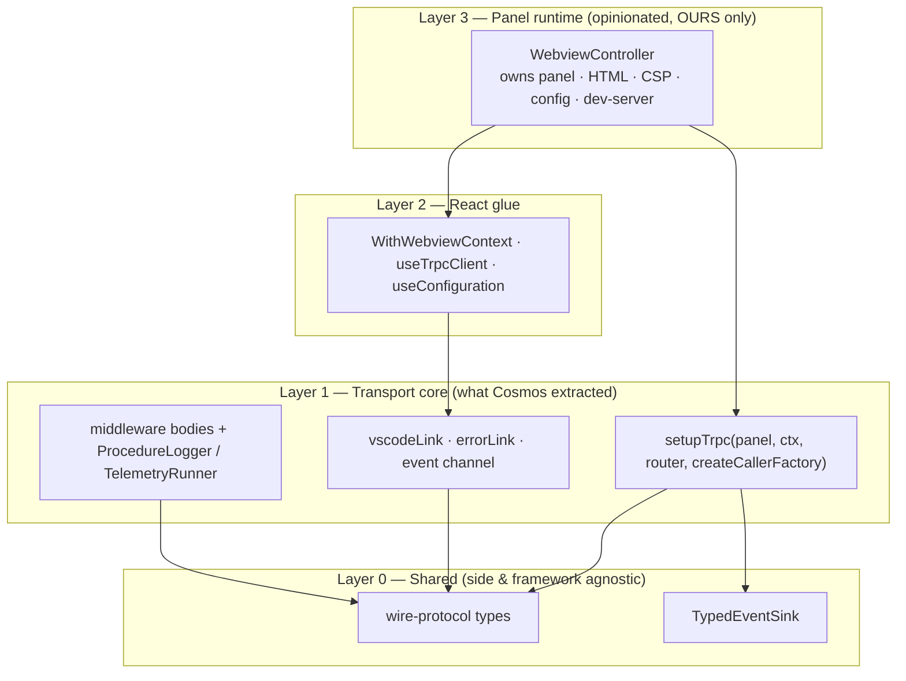
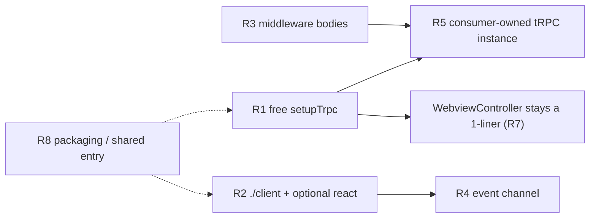
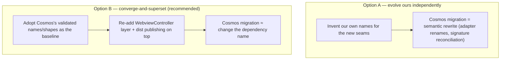
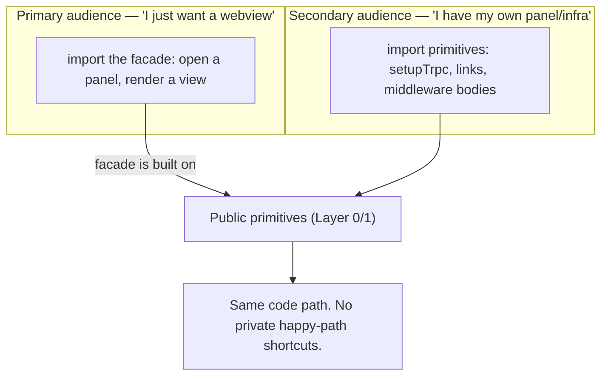
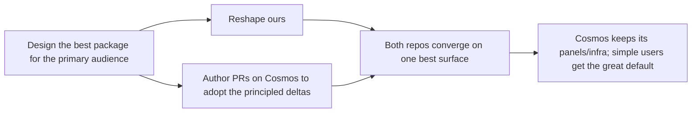

# Making `@microsoft/vscode-ext-react-webview` flexible enough for vscode-cosmosdb to adopt

**Status:** design proposal (no code) · **Date:** 2026-06-24
**Author context:** comparison of our preview package against the partner
[vscode-cosmosdb](https://github.com/microsoft/vscode-cosmosdb) extension's
`@cosmosdb/webview-rpc` package, extracted in
[PR #3121](https://github.com/microsoft/vscode-cosmosdb/pull/3121) and now on
their `main`.

> **Addendum (2026-06-24):** §11 revises this whole proposal for the case where
> we have **full freedom to make breaking changes** (preview, no external
> dependents, we are the only consumer, and we are willing to author the
> Cosmos migration PR ourselves). It also answers the build-tooling question
> (do we need Vite first?) and gives an order-of-magnitude **LOC complexity**
> estimate for every change. Where §11 conflicts with §7–§10, §11 wins.
>
> **§12 (2026-06-24)** reframes the whole proposal around the _primary
> audience_ — anyone who just wants a webview — now that we may also open PRs
> on Cosmos's repo. It evaluates Cosmos's choices **on merit** (not to ease
> their migration), proposes subpath **renames**, and defines the
> "best-experience" happy path. Where §12 conflicts with earlier sections,
> **§12 wins** — it supersedes §11's "converge to their names" stance.
>
> **§13 is the consolidated decisions summary (final, locked state).** If you
> read one section, read that one — it supersedes naming and recommendations
> elsewhere in this document.

---

## 1. Executive summary

We ship one **batteries-included, panel-owning framework** packaged as
`@microsoft/vscode-ext-react-webview`. Cosmos DB forked our transport before our
extraction, then evolved it into a **small, un-opinionated transport toolkit**
(`@cosmosdb/webview-rpc`) that owns _nothing_ about the panel, the tRPC
instance, or the telemetry backend.

The divergence is not accidental and is not a quality gap on either side. It is
driven by one structural fact: **Cosmos already had a large webview
infrastructure (panel/tab classes, command dispatch, a telemetry backend) built
on a legacy `postMessage` channel protocol.** They could not adopt a base class
that _owns_ the panel lifecycle, so they extracted only the part they needed —
the tRPC message pump — and made every other concern a seam.

The good news: their design and ours are not in conflict. Theirs is essentially
**our lower layer, exposed directly.** If we factor our `WebviewController` into
a thin _panel-runtime_ layer sitting on top of a free-standing _transport core_
(plus a couple of additive seams for telemetry, framework-agnostic client use,
and consumer-owned tRPC instances), then:

- the **normal case stays a one-liner** (extend `WebviewController`, define a
  router, call `useTrpcClient`); and
- a **migrating consumer like vscode-cosmosdb can adopt our npm package** in
  place of their in-tree copy, because the seams they need are now public.

Eight recommendations (R1–R8) follow in §7. The headline three are: **R1** extract
a free `setupTrpc(panel, …)` function, **R3** ship instance-agnostic telemetry
middleware _bodies_ + adapter interfaces, and **R5** let the consumer own the
tRPC instance.

---

## 2. The two packages at a glance

| Dimension                | **Ours** `@microsoft/vscode-ext-react-webview`                                                                                                                            | **Theirs** `@cosmosdb/webview-rpc`                                                                                                                                                                  |
| ------------------------ | ------------------------------------------------------------------------------------------------------------------------------------------------------------------------- | --------------------------------------------------------------------------------------------------------------------------------------------------------------------------------------------------- |
| Distribution             | Published to npm (`0.8.0-preview`), ships built `dist/` + `.d.ts`                                                                                                         | `private` workspace package, ships **TS source** (`main: src/index.ts`), consumed via npm-workspaces + Vite/tsconfig path aliases, no build step                                                    |
| Entry points             | **2**: `.` (client **and** React), `./server` (host)                                                                                                                      | **4**: `.` (shared = `TypedEventSink`), `./server`, `./client` (React-free), `./react`                                                                                                              |
| Panel ownership          | `WebviewController` **owns** the panel: `createWebviewPanel`, HTML, CSP, config serialization, dev-server, source layout                                                  | `setupTrpc(panel, …)` is a free function that **attaches** to a panel the consumer already created; returns a `Disposable`                                                                          |
| tRPC instance            | **Package owns** `initTRPC.create()` — single, context-less; procedures cast `ctx as RouterContext`                                                                       | **Consumer owns** `initTRPC.context<T>().create()` — one per panel type; passes `createCallerFactory` into `setupTrpc` (no cast)                                                                    |
| React coupling           | `react` is a **hard** peer; the default entry exports the React hooks                                                                                                     | `./client` is **React-free**; `./react` is the only entry that imports React; `react` is an **optional** peer                                                                                       |
| Telemetry                | `createMiddleware` (bound to the package tRPC instance) + pre-baked `publicProcedureWithTelemetry` + `console` default; `TelemetryContext = { properties, measurements }` | Instance-agnostic `loggingMiddlewareBody` / `telemetryMiddlewareBody` _body factories_ + `ProcedureLogger` / `TelemetryRunner` adapter interfaces; `console` default; **no** tRPC-instance coupling |
| Client error observation | `errorLink(onError)` (errors only) + `useTrpcClient({ onError })`                                                                                                         | `createEventChannel()` → `RpcEventChannel` with `onSuccess` / `onError` / `onAborted`, returned as `{ trpcClient, events }`                                                                         |
| `useTrpcClient` default  | **per-component** instance (sharing via context is an "advanced" opt-in)                                                                                                  | **per-webview singleton** `{ trpcClient, events }` cached by `vscodeApi`                                                                                                                            |
| Push events              | `TypedEventSink` under `/server`                                                                                                                                          | `TypedEventSink` under `.` (shared) + client-side `createEventChannel`                                                                                                                              |
| Framework error strings  | hard-coded English (`'Procedure not found: …'`)                                                                                                                           | `@vscode/l10n` (optional peer) — `l10n.t(...)` inside the package                                                                                                                                   |
| `@trpc/*`                | peer deps (`^11`)                                                                                                                                                         | direct deps, pinned (`~11.18.0`)                                                                                                                                                                    |

---

## 3. What Cosmos actually built (deep dive)

### 3.1 `setupTrpc` — a free function, not a class

The center of gravity. Where we have a `protected setupTrpc()` method inside a
panel-owning class, they have a standalone function:

```ts
// @cosmosdb/webview-rpc/server
export function setupTrpc<TContext extends BaseRouterContext, TRouter extends AnyRouter>(
  panel: vscode.WebviewPanel,
  context: TContext,
  appRouter: TRouter,
  createCallerFactory: (router: TRouter) => (ctx: TContext) => Record<string, unknown>,
): {
  disposable: vscode.Disposable;
  activeSubscriptions: Map<string, ActiveSubscription>;
  activeOperations: Map<string, AbortController>;
};
```

Two consequences:

1. **The panel is an input, not an output.** Cosmos creates the panel with their
   own infrastructure, then calls `setupTrpc(panel, …)` to bolt on the message
   pump. They keep their HTML, CSP, config, and dev-server logic.
2. **`createCallerFactory` is injected.** The package does _not_ call
   `initTRPC.create()`. The consumer's tRPC instance is the source of truth, so
   each panel type can have a precisely typed context with **no `ctx as T`
   cast** at procedure sites.

The body of `setupTrpc` is otherwise _line-for-line our `WebviewController`
dispatch logic_ — same four message branches (`subscription`,
`subscription.stop`, `abort`, default), same `safePostMessage`, same
`toAsyncIterator`, same dual abort-controller + `iterator.return()` subscription
cleanup, same `undefined → null` coalescing. They lifted our hardened transport
verbatim and wrapped it in a function signature that doesn't assume panel
ownership. (They also added a defensive `console.warn` guard for non-tRPC
messages arriving on the same channel — a direct artifact of their legacy
`postMessage` traffic still flowing during migration.)

### 3.2 Telemetry as instance-agnostic "middleware bodies" + adapters

This is the cleanest part of their design and the one the user singled out. They
provide middleware **bodies** (plain functions) rather than middleware **bound
to a tRPC instance**:

```ts
// @cosmosdb/webview-rpc/server
export interface ProcedureInvocation { path: string; type: 'query'|'mutation'|'subscription'; signal?: AbortSignal; }
export interface MiddlewareResultLike { ok: boolean; error?: Error & { cause?: unknown }; }

export interface ProcedureLogger {
    onStart?(info: ProcedureInvocation): void;
    onEnd?(info: ProcedureInvocation & { durationMs: number; ok: boolean; aborted: boolean; error?: Error }): void;
}
export interface TelemetryRunner<TEnrichment extends object> {
    run<TResult extends MiddlewareResultLike>(
        eventId: string,
        invocation: ProcedureInvocation,
        invoke: (enrichment: TEnrichment) => Promise<TResult>,
    ): Promise<TResult>;
}

export function loggingMiddlewareBody(logger: ProcedureLogger | (() => ProcedureLogger)): /* plain mw fn */;
export function telemetryMiddlewareBody<TEnrichment extends object>(
    runner: TelemetryRunner<TEnrichment>,
    options?: { buildEventId?: (i: ProcedureInvocation) => string },
): /* plain mw fn */;
```

The consumer wires them into _their own_ tRPC instance:

```ts
const t = initTRPC.context<MyRouterContext>().create();
const procedure = t.procedure
  .use(t.middleware(loggingMiddlewareBody(myLogger)))
  .use(
    t.middleware(telemetryMiddlewareBody(myRunner, { buildEventId: ({ type, path }) => `myApp.rpc.${type}.${path}` })),
  );
```

Why this matters: the package now knows nothing about Application Insights,
`callWithTelemetryAndErrorHandling`, output channels, or any specific backend.
The `TelemetryRunner` adapter is the seam — the consumer implements `run()` to
open their scope, enrich `ctx`, observe the `MiddlewareResultLike`, and report
success/failure. The framework only chooses the event id (overridable) and
provides the timing/abort plumbing.

Contrast with ours: `createMiddleware` is `t.middleware` **bound to the package's
single tRPC instance.** If a consumer owns their own instance, our
`createMiddleware` and our `publicProcedureWithTelemetry` are unusable to them —
they cannot be composed onto procedures created from a different `t`.

### 3.3 `./client` is framework-agnostic; `./react` is the only React importer

```
@cosmosdb/webview-rpc/client  →  vscodeLink, errorLink, createEventChannel,
                                  RpcEventChannel/RpcEventEmitter, wire-protocol types
@cosmosdb/webview-rpc/react   →  WithWebviewContext, useTrpcClient  (imports React)
@cosmosdb/webview-rpc         →  TypedEventSink (shared)
@cosmosdb/webview-rpc/server  →  setupTrpc, middleware bodies, BaseRouterContext
```

A vanilla (non-React) webview talks to `vscodeLink` directly; React consumers
get the hook. `react` is therefore an _optional_ peer. Our package, by contrast,
puts the React hooks and the framework-agnostic `vscodeLink`/`errorLink`/wire
types in the _same_ default entry, so even a non-React consumer inherits the
`react` peer requirement.

### 3.4 A richer client-side event channel

Their `errorLink` publishes into an `RpcEventChannel` rather than calling a bare
callback:

```ts
export interface RpcEventChannel {
  onSuccess(handler: (info: CallInfo, data: unknown) => void): Unsubscribe;
  onError(handler: (error: Error, info: CallInfo) => void): Unsubscribe;
  onAborted(handler: (info: CallInfo) => void): Unsubscribe;
}
```

`useTrpcClient` returns `{ trpcClient, events }` (a per-webview singleton pair
cached by `vscodeApi`), so cross-cutting observers (toasts, ARIA announcements,
telemetry, status bar) subscribe once and see every query/mutation outcome —
with **aborts separated from errors** so a user cancel doesn't surface as an
error toast. It is explicitly observer-only: handlers can't mutate the value or
convert an error to success (they direct you to write a `TRPCLink` for that).

This is a strict superset of our `errorLink(onError)`.

### 3.5 Packaging: source, not dist

Because `@cosmosdb/webview-rpc` is `private` and consumed inside the monorepo via
path aliases, it ships raw TypeScript (`main: src/index.ts`, `typecheck` only,
no build). `@trpc/*` are direct pinned deps; `react` and `@vscode/l10n` are
optional peers. This is the one area where we should _not_ follow them — we
publish to npm and need `dist/` + `.d.ts` + peer-version negotiation. (See R8.)

---

## 4. The "why" — reconstructed rationale

Mapping each divergence to the constraint that produced it:

| Their choice                                            | Constraint that forced it                                                                                                                                              |
| ------------------------------------------------------- | ---------------------------------------------------------------------------------------------------------------------------------------------------------------------- |
| `setupTrpc(panel, …)` free function                     | They **already own panel/tab/command infrastructure**. A panel-owning base class would mean rewriting all of it.                                                       |
| Consumer owns `initTRPC` + passes `createCallerFactory` | They have **multiple panel types** (QueryEditor, Document, Migration) each wanting a **precisely typed context**; one shared package instance forces `ctx as T` casts. |
| Telemetry as adapter interfaces (`TelemetryRunner`)     | They have a **concrete, opinionated telemetry backend** (action contexts / App Insights) that must not leak into a reusable package.                                   |
| `./client` React-free + `./react` separate              | Their **legacy `postMessage` webviews** and any non-React surface must consume transport without pulling React.                                                        |
| Richer `RpcEventChannel` (success/error/abort)          | Migrating from a channel protocol, they need **central observability** of every call, and a **first-class "canceled" outcome** for run/cancel flows.                   |
| `@vscode/l10n` inside the package                       | A shipping product extension **localizes everything**, including framework error strings.                                                                              |
| Ships source, no build                                  | It's a **monorepo-internal** package consumed via aliases; npm publishing isn't a goal (yet).                                                                          |

The throughline the user named: **their codebase grew up on `postMessage` and
they are migrating incrementally.** Every seam exists so they can adopt tRPC
_without_ discarding the panel/telemetry/command infrastructure they already
have. We started request/response-first and greenfield, so we could afford a
panel-owning convenience class. Both are correct for their respective starting
points.

---

## 5. The core difference, and the layered model that reconciles it

> **Ours is a _framework_ (an opinionated runtime you extend). Theirs is a
> _toolkit_ (composable functions you assemble).**

Our `WebviewController` conflates **two genuinely separable concerns**:

- **(A) the panel runtime** — `createWebviewPanel`, the HTML template, CSP,
  config serialization, bundled-vs-dev source selection, dev-server wiring; and
- **(B) the tRPC message pump** — dispatch queries/mutations/subscriptions,
  abort + subscription lifecycle, `safePostMessage`.

Cosmos proved that **(B) is independently valuable and reusable**, and that
**(A) is exactly the part a consumer with existing infrastructure does not
want.** The fix is not to abandon (A) — it is our differentiator and the reason
the starter-kit "normal case" is a one-liner — but to **stop welding (A) and (B)
together** so (B) can be used on its own.



- **Normal-case consumer (starter kit):** touches **Layer 3 only** (+ defines a
  router). Unchanged from today.
- **Migrating consumer (vscode-cosmosdb):** touches **Layers 0–2**, brings their
  own panel (instead of Layer 3), their own tRPC instance, and their own
  telemetry adapter.

This is "progressive disclosure": one easy entry point, with lower layers
available when you outgrow the defaults.

---

## 6. Does it make sense to separate ours? Yes — via subpaths, not multiple packages

Two ways to expose layers:

1. **Multiple npm packages** (`…-rpc-core`, `…-rpc-react`, `…-rpc-server`). Cost:
   N× versioning, N× release, cross-package peer ranges, and the "diamond
   dependency" headache during preview. Benefit: marginal.
2. **One package, multiple subpath exports** (`.`, `./client`, `./react`,
   `./server`, optionally `./shared`). Cost: a slightly larger `exports` map.
   Benefit: one version, one release, one changelog, and consumers still import
   only the layer they need (bundlers tree-shake the rest).

**Recommendation: stay single-package, add subpaths.** This is precisely what
Cosmos did (one `@cosmosdb/webview-rpc`, four subpaths) and it gives the "RPC
only / no React" sub-API the user asked about without the multi-package tax.

---

## 7. Recommendations

Each is **additive** and preserves the normal-case one-liner. Effort/risk are
relative (S/M/L).

### R1 — Extract a free `setupTrpc(panel, …)` core; make `WebviewController` a thin layer on top. **(Effort M · Risk M · highest value)**

Lift the dispatch logic out of `WebviewController` into a standalone function:

```ts
// proposed: @microsoft/vscode-ext-react-webview/server
export function setupTrpc<TRouter extends AnyRouter, TContext extends BaseRouterContext>(
  panel: vscode.WebviewPanel,
  context: TContext,
  appRouter: TRouter,
  options?: { createCallerFactory?: (router: TRouter) => (ctx: TContext) => Record<string, unknown> },
): {
  disposable: vscode.Disposable;
  activeOperations: Map<string, AbortController>;
  activeSubscriptions: Map<string, /*…*/ unknown>;
};
```

`WebviewController.setupTrpc()` becomes a one-line call into this, registering
the returned disposable. When `options.createCallerFactory` is omitted, default
to the package's own factory (today's behavior). **This single change is what
unblocks Cosmos adopting our package** — they call `setupTrpc(theirPanel, …)`
against panels they already own.

### R2 — Add a React-free `./client` subpath; demote React to an optional peer. **(Effort S · Risk S)**

Introduce `./client` exporting `vscodeLink`, `errorLink` (and the R4 event
channel) and the wire-protocol types — **no React import**. Keep the hooks
(`useTrpcClient`, `useConfiguration`, `WithWebviewContext`) on `.`/`./react`.
Keep `.` re-exporting both so existing imports don't break. Mark `react`
`optional: true` in `peerDependenciesMeta`. Lets a non-React or
different-framework webview use the raw transport.

### R3 — Ship instance-agnostic middleware _bodies_ + adapter interfaces. **(Effort M · Risk S)**

Add `loggingMiddlewareBody(logger)` and `telemetryMiddlewareBody(runner, opts)`
returning plain middleware functions (not bound to any tRPC instance), plus the
`ProcedureLogger` / `TelemetryRunner` / `ProcedureInvocation` /
`MiddlewareResultLike` types. **Keep** `publicProcedureWithTelemetry` + the
`console` default as the zero-config path. This is what lets a consumer who owns
their own tRPC instance (R5) still use our telemetry plumbing, and lets Cosmos
drop their App-Insights adapter into our package unchanged.

### R4 — Generalize `errorLink(onError)` into an optional event channel. **(Effort M · Risk S)**

Add `createEventChannel()` → `{ onSuccess, onError, onAborted }` and an
`eventLink(channel)` that publishes into it (keep `errorLink` as the
error-only convenience). Let `useTrpcClient` optionally return
`{ trpcClient, events }` when a channel is requested. The simple
`useTrpcClient({ onError })` and bare `{ trpcClient }` cases stay intact.
Separating **aborted** from **errored** is a real ergonomic win for run/cancel
flows.

### R5 — Allow the consumer to own the tRPC instance. **(Effort M · Risk M)**

Accept an optional `createCallerFactory` on `WebviewControllerOptions` and on
`setupTrpc` (R1). When provided, dispatch against the consumer's instance —
enabling **per-panel precisely-typed contexts and zero `ctx as T` casts**. When
omitted, fall back to the package instance. This removes the only substantive
reason we previously recorded for _not_ adopting Cosmos's per-panel pattern (the
cast), while keeping our single-instance default for the normal case.

### R6 — Make framework-internal error strings localizable. **(Effort S · Risk S · optional)**

Either add `@vscode/l10n` as an optional peer and use `l10n.t(...)` for the two
internal `'Procedure not found'` throws, or accept an optional
`translate?: (key: string, args?: …) => string` in options. Normal case needs no
change. Low priority, cheap, and it matches a shipping-product expectation.

### R7 — Keep panel-runtime conveniences in `WebviewController` _only_. **(Effort 0 · Risk 0 · a "don't")**

Do **not** push HTML/CSP/config/dev-server logic down into the transport core.
That layer is our differentiator and the entire value of the "normal case." It
belongs in Layer 3, wrapping the core. Document the two layers explicitly so
nobody re-welds them.

### R8 — Packaging hygiene for cross-extension consumption. **(Effort S · Risk S)**

To let an external extension consume _our npm package_ (not a source copy): keep
`@trpc/*` and `react` as peers (no duplicate bundles), keep clean subpath
`exports` with matching `types`/`typesVersions`, and **move `TypedEventSink` +
the wire-protocol types to a shared/root entry** so both host and client import
them from one place (today `TypedEventSink` is `/server`-only; the wire types are
client-only). Do **not** copy their ship-source/no-build model — we publish dist.

### Recommendation dependency / sequencing



Suggested order: **R8 → R1 → R3 → R5** (the adoption-critical spine), then
**R2 → R4** (client ergonomics), then **R6** (polish).

---

## 8. Proposed end-state API shape

### 8.1 Normal case — unchanged (starter kit)

```ts
// host: appRouter.ts
import {
  publicProcedureWithTelemetry as p,
  router,
  type BaseRouterContext,
} from '@microsoft/vscode-ext-react-webview/server';
export type RouterContext = BaseRouterContext & { workspaceRoot: string };
export const appRouter = router({ hello: p.input(/*…*/).query(/*…*/) });
export type AppRouter = typeof appRouter;

// host: MyViewController.ts
class MyViewController extends WebviewController<AppRouter, MyConfig, RouterContext> {
  /* …super(...)… */
}

// webview: MyView.tsx
const { trpcClient } = useTrpcClient<AppRouter>();
```

Nothing here changes. All new surface is opt-in.

### 8.2 Migrating case — what Cosmos would write against _our_ package

```ts
// host — they own the panel and the tRPC instance
import { initTRPC } from '@trpc/server';
import {
  setupTrpc,
  loggingMiddlewareBody,
  telemetryMiddlewareBody,
  type BaseRouterContext,
} from '@microsoft/vscode-ext-react-webview/server';

interface QueryEditorCtx extends BaseRouterContext {
  panel: vscode.WebviewPanel;
  db: Db;
}
const t = initTRPC.context<QueryEditorCtx>().create();
const procedure = t.procedure
  .use(t.middleware(loggingMiddlewareBody(theirOutputChannelLogger)))
  .use(
    t.middleware(
      telemetryMiddlewareBody(theirAppInsightsRunner, {
        buildEventId: ({ type, path }) => `cosmosDB.rpc.${type}.${path}`,
      }),
    ),
  );

export const queryEditorRouter = t.router({
  /* …procedures… */
});

// attach to a panel they already created with their own infra:
const { disposable } = setupTrpc(theirPanel, { panel: theirPanel, db }, queryEditorRouter, {
  createCallerFactory: t.createCallerFactory,
});
theirDisposables.push(disposable);
```

```ts
// webview (their vanilla, non-React surface) — uses ./client, no React peer
import { vscodeLink, errorLink, createEventChannel } from '@microsoft/vscode-ext-react-webview/client';
```

Every line above is satisfied by R1–R5. Today, none of it is possible against
our package without forking.

---

## 9. What to deliberately _not_ do

- **Don't** split into multiple npm packages (use subpaths — §6).
- **Don't** drop `WebviewController` or move its panel/HTML/CSP/config logic into
  the core (R7). The "normal case" one-liner is the product.
- **Don't** copy their ship-source/no-build packaging (R8) — we publish to npm.
- **Don't** make the consumer-owned tRPC instance or the event channel mandatory.
  Defaults (package instance, `{ trpcClient }`, `console` telemetry) must keep
  the greenfield path free of ceremony.
- **Don't** adopt their generic `command({ commandName, params })` dispatch
  shortcut — that's a legacy-migration crutch that discards tRPC type safety; we
  have no legacy channel to migrate from.

---

## 10. Open questions for the team

1. **Default entry shape.** Keep `.` = "client + react" (with a new React-free
   `./client`), or flip to `.` = shared, `./client`, `./react`, `./server`
   (Cosmos's shape) and take the one-time breaking change while still in preview?
2. **`TypedEventSink` home.** Promote to a shared/root entry (R8) — worth the
   export-map churn during preview?
3. **Event channel vs `errorLink`.** Ship both (channel as the superset, keep
   `errorLink` as the alias), or replace `errorLink` outright before 1.0?
4. **Telemetry context type.** Our `TelemetryContext = { properties,
measurements }` vs their `TelemetryRunner<TEnrichment>` enrichment model.
   Adopt the adapter interfaces (R3) _alongside_ our current convenience, or
   converge on one?
5. **Coordination with Cosmos.** Would they pilot consuming our package behind a
   feature branch once R1/R3/R5 land, to validate the seams before we cut 1.0?

---

## Appendix A — Source references

**Ours** (`packages/vscode-ext-react-webview/`):

- [src/extension-server/WebviewController.ts](../../packages/vscode-ext-react-webview/src/extension-server/WebviewController.ts) — panel-owning controller + dispatch
- [src/extension-server/trpc.ts](../../packages/vscode-ext-react-webview/src/extension-server/trpc.ts) — package-owned tRPC instance, `createMiddleware`, telemetry default
- [src/webview-client/vscodeLink.ts](../../packages/vscode-ext-react-webview/src/webview-client/vscodeLink.ts) · [errorLink.ts](../../packages/vscode-ext-react-webview/src/webview-client/errorLink.ts) · [useTrpcClient.ts](../../packages/vscode-ext-react-webview/src/webview-client/useTrpcClient.ts)
- [package.json](../../packages/vscode-ext-react-webview/package.json) — 2 entry points, peer deps

**Theirs** (`microsoft/vscode-cosmosdb`, branch `main`, via PR #3121):

- `packages/webview-rpc/package.json` — 4 subpaths, ship-source, `private`
- `packages/webview-rpc/src/server/setupTrpc.ts` — free-function dispatcher
- `packages/webview-rpc/src/server/middleware/{types,loggingMiddleware,telemetryMiddleware}.ts` — adapter pattern
- `packages/webview-rpc/src/client/events.ts` — `RpcEventChannel` / `createEventChannel`
- `packages/webview-rpc/README.md` — wiring guide and subpath-separation rationale

---

## 11. Addendum — revised scope under full freedom to break

**New inputs (2026-06-24):**

1. The package is **preview**, has **no external dependents**, and we are
   **currently its only consumer**. We may change it **completely** and fix our
   own extension code wherever the rework breaks it.
2. After the rework, Cosmos would **attempt to migrate** their extension onto our
   package — and we may **author that migration PR for them** to review.
3. Still discussion only; no work yet.

These remove every backward-compatibility constraint that hedged §7–§9. The
recommendations below replace the cautious "keep `.` re-exporting / keep
`errorLink` as well / additive only" framing with a **clean-slate redesign**, and
add a strategic goal that did not exist before: **minimise _their_ migration
diff**, because we are the ones who will write it.

### 11.1 The new strategic goal: design for their migration

Because we will author Cosmos's migration PR, the cost we are really optimising
is **our rework + our consumer update + their migration**, as one budget. The
cheapest total is reached when **their migration becomes a dependency-name swap**
rather than a semantic rewrite. That argues for **deliberate API convergence**:
name and shape our public surface to match what Cosmos already runs in
production, then add our extras on top.

Concretely, converge on their proven, validated names and signatures:

- the free function `setupTrpc(panel, ctx, router, { createCallerFactory })`;
- middleware **bodies** `loggingMiddlewareBody` / `telemetryMiddlewareBody` with
  the `ProcedureLogger` / `TelemetryRunner` / `ProcedureInvocation` /
  `MiddlewareResultLike` adapter types;
- the client event channel `createEventChannel()` → `RpcEventChannel`
  (`onSuccess` / `onError` / `onAborted`);
- subpaths `.` (shared), `./client` (React-free), `./react`, `./server`.

Our package then becomes a **strict superset** of `@cosmosdb/webview-rpc`:
their entire surface, **plus** our Layer-3 `WebviewController` (panel runtime),
**plus** npm publishing with built `dist/`. Their migration is then: change the
import specifier `@cosmosdb/webview-rpc` → `@microsoft/vscode-ext-react-webview`,
delete their in-tree package, done. They keep their own panels and tRPC
instances exactly as today.

### 11.2 Two ways to get there



**Recommendation: Option B (converge-and-superset).** Cosmos has already
production-validated the lower-layer shape (4 subpaths, free `setupTrpc`,
middleware bodies, event channel). Re-deriving our own near-identical surface
would duplicate that validation and tax their migration for no benefit. We add
value _above_ their line (the panel-runtime controller, the zero-config
starter-kit defaults, npm publishing), not by renaming their primitives.

Net effect on §7: **R1–R6 all promote from "additive, keep old surface" to
"replace outright."** Specifically — drop the `.`-re-export hedge (R2), replace
`errorLink`-only with the event channel as canonical (R4, keep `errorLink` only
as a 3-line convenience over the channel), and replace the
`createMiddleware` / `publicProcedureWithTelemetry` / `TelemetryContext` model
with the adapter-body model (R3), keeping a `consoleProcedureLogger` default
so the starter-kit path stays zero-config.

### 11.3 The normal case is _still_ a one-liner

Convergence does not cost the greenfield ergonomics. Layer 3 stays:

```ts
class MyViewController extends WebviewController<AppRouter, MyConfig, RouterContext> {
  /* super(...) */
}
```

The `WebviewController` internally owns one tRPC instance, wires the default
console logger, and calls the new `setupTrpc` for the consumer. A starter-kit
user never sees `createCallerFactory`, middleware bodies, or the event channel
unless they reach for them. The difference from today is purely _internal
plumbing_ plus _new optional seams exposed alongside_.

### 11.4 Build tooling: do we need to move to Vite first?

**No. The refactor is a source/API reshape, not a build-system change, and it is
fully decoupled from the bundler choice.**

Why our current toolchain already supports everything proposed:

| Concern                          | Today                                                            | Does the rework force a change?                                                                                                                                                                                                                                             |
| -------------------------------- | ---------------------------------------------------------------- | --------------------------------------------------------------------------------------------------------------------------------------------------------------------------------------------------------------------------------------------------------------------------- |
| Package build                    | `tsc -p .` → CommonJS `dist/` + `.d.ts` (composite)              | **No.** `tsc` compiles all of `src/**` regardless of how many subpath entries exist. Adding `./client` / `./react` / `./server` is just adding entry files + `exports` / `typesVersions` map keys — the **same mechanism** `./server` already uses and which already works. |
| Consumer (webview) bundle        | webpack + `swc-loader`, `target: web`, output ESM                | **No.** webpack resolves subpath `exports` natively and tree-shakes the React-free `./client` path. Optional `react` peer needs no loader change.                                                                                                                           |
| Consumer (extension host) bundle | webpack (ext config)                                             | **No.** Resolves `./server` from `dist/` as today.                                                                                                                                                                                                                          |
| Dev server / HMR                 | webpack-dev-server on `:18080`, CSP wired by `WebviewController` | **No.** Lives entirely in Layer 3, which we keep. A consumer who brings their own panel (Cosmos) brings their own dev-server story — out of our scope.                                                                                                                      |
| ESM vs CJS                       | package emits CJS; Cosmos package is `"type": "module"`          | **No.** Our consumers' webpack handles CJS fine. Matching their ESM is _optional_ and independent of the API rework.                                                                                                                                                        |

Cosmos uses Vite **only because** their package is a `private`, build-less
workspace package consumed through path aliases — that is a _consumer-side_
packaging decision, not a requirement of the API shape. We publish to npm and
ship built `dist/`; our `tsc` → `dist` → webpack-resolves-`dist` pipeline
satisfies every recommendation here.

**Conclusion:** stay on **webpack + `swc` (bundles)** and **`tsc` (package
build)**. Treat any Vite migration as an **independent, optional DX project**
(faster HMR) that must **not** block or sequence before this rework. The only
build-adjacent edits the rework needs are **package.json `exports` /
`typesVersions` keys and a `tsconfig` include or two** — order ~10 LOC.

### 11.5 Complexity assessment (order-of-magnitude LOC changed)

Buckets are powers of ten of _authored lines added/changed/moved_ (deletions
noted separately). Grounded in the real surface: `WebviewController.ts` ≈ 600
lines (~300 of which is the dispatch pump to extract); the consumer
`_integration/` folder is ~4 files totalling a few hundred lines; ~10 files in
our extension import the package (5 are a one-symbol `useConfiguration` import).

#### Package rework (`packages/vscode-ext-react-webview/`)

| Change                                                                                                        | LOC bucket | What it touches                                                                                                        |
| ------------------------------------------------------------------------------------------------------------- | ---------- | ---------------------------------------------------------------------------------------------------------------------- |
| R1 — extract free `setupTrpc` core; controller calls it                                                       | **~100**   | move ~300 dispatch lines into a new `setupTrpc.ts`; controller shrinks to a one-line call                              |
| R2 — split `./client` (React-free) + `./react`; `react` optional peer                                         | **~100**   | relocate hooks/context to a `react/` folder; new entry files; `exports` map                                            |
| R3 — middleware bodies + adapter interfaces (replace `createMiddleware`/`publicProcedureWithTelemetry` model) | **~100**   | 3–4 new files (`types`, `loggingMiddleware`, `telemetryMiddleware`) ≈ 250 lines; keep `consoleProcedureLogger` default |
| R4 — event channel (`createEventChannel`/`RpcEventChannel`) replaces `errorLink`-only                         | **~100**   | new `events.ts` ≈ 150 lines + link/hook wiring; `errorLink` becomes a thin shim                                        |
| R5 — consumer-owned tRPC instance (`createCallerFactory` option)                                              | **~10**    | thread one optional param + generics through options                                                                   |
| R6 — localizable framework strings (optional `@vscode/l10n`)                                                  | **~10**    | 2 throw strings + peer-dep entry                                                                                       |
| R7 — keep `WebviewController` panel runtime (no-op)                                                           | **~0**     | nothing moves down                                                                                                     |
| R8 — move `TypedEventSink` + wire types to a shared `.` entry                                                 | **~100**   | file moves + `exports` + import rewrites within the package                                                            |
| README + Quick-start rewrite                                                                                  | **~100**   | docs reflecting the new layered surface                                                                                |
| Tests (new `setupTrpc`/middleware/event-channel suites, update existing)                                      | **~100**   | a handful of Jest suites                                                                                               |
| **Package total**                                                                                             | **~1000**  | low thousands of churn, concentrated and mechanical                                                                    |

#### Our extension consumer update (`src/webviews/`)

| Change                                                                      | LOC bucket | What it touches                                                                                                |
| --------------------------------------------------------------------------- | ---------- | -------------------------------------------------------------------------------------------------------------- |
| Rewrite `_integration/` (own tRPC instance, middleware bodies, new imports) | **~100**   | `appRouter.ts` (~190 L), `trpc.ts` (~150 L), `WebviewControllerBase.ts`, `useTrpcClient.ts`                    |
| Import-path swaps for hooks (`.` → `./react`) in components + entry         | **~10**    | ~6 files (`CollectionView`, `documentView`, `QueryEditor`, `QueryInsightsTab`, `ToolbarMainView`, `index.tsx`) |
| **Consumer total**                                                          | **~100**   | hundreds, concentrated in `_integration/`                                                                      |

#### Cosmos migration PR (their repo, authored by us)

| Change                                               | LOC bucket        | What it touches                                                               |
| ---------------------------------------------------- | ----------------- | ----------------------------------------------------------------------------- |
| Delete their in-tree `@cosmosdb/webview-rpc` package | **~1000 deleted** | ~1.5k lines of source + tests removed                                         |
| Swap import specifier across their webview code      | **~100**          | mechanical, ~dozens of files (trivial under Option B convergence)             |
| Reconcile residual signature/packaging gaps          | **~100**          | only the deltas our superset does not already match                           |
| **Their migration total**                            | **~1000**         | dominated by deletion + mechanical swaps; small authored delta under Option B |

#### Programme total

| Stream              | Authored LOC              | Deleted LOC                   |
| ------------------- | ------------------------- | ----------------------------- |
| Our package rework  | **~1000**                 | —                             |
| Our consumer update | **~100**                  | —                             |
| Cosmos migration    | **~100–1000**             | **~1000** (their old package) |
| **Grand total**     | **~1000** (low thousands) | **~1000**                     |

The whole programme is a **~1000-LOC (low-thousands)** effort, not a
~10000-LOC one. It is large in _file count_ and _coordination_, but small in
_novel logic_: nearly every line is either **moving already-hardened code**
(the dispatch pump, the sink, the links) into new files, **adapting types**, or
**rewriting `exports`/imports**. There is little net-new algorithmic code — the
risk is mechanical (broken imports, export-map typos), not architectural.

### 11.6 Revised recommendations & sequencing

Under Option B the order optimises for an early, demonstrable "Cosmos could
adopt this" milestone:

1. **R8 + R2** — lock the subpath layout (`.`, `./client`, `./react`,
   `./server`) and the shared entry first; everything else slots into it. (~100)
2. **R1 + R5** — free `setupTrpc` with the consumer-owned-factory option. This
   is the adoption-critical spine. (~100)
3. **R3** — middleware bodies + adapters; rewire our `_integration/` telemetry
   onto them. (~100 pkg + ~100 consumer)
4. **R4** — event channel; rewire our webview observers. (~100)
5. **R6** — l10n polish. (~10)
6. **Our consumer update** lands continuously with each step (we are the
   regression test for the new surface).
7. **Cosmos migration PR** authored last, once the superset is stable.

### 11.7 Resolved open questions (supersedes §10)

- **§10 Q1 (default entry shape):** Resolved — adopt the 4-subpath layout
  outright (`.` = shared); take the breaking change now while in preview.
- **§10 Q2 (`TypedEventSink` home):** Resolved — promote to the shared `.`
  entry (R8).
- **§10 Q3 (event channel vs `errorLink`):** Resolved — event channel is
  canonical; `errorLink` survives only as a thin convenience.
- **§10 Q4 (telemetry context type):** Resolved — adopt the adapter-body model;
  retire `TelemetryContext`/`publicProcedureWithTelemetry` in favour of
  `ProcedureLogger`/`TelemetryRunner` + a console default.
- **§10 Q5 (coordinate with Cosmos):** Still open, now stronger — we intend to
  author their migration PR, so a shared checkpoint on naming before R1 lands
  is worth it.

Still genuinely open: whether to also flip the package to ESM (`"type":
"module"`) to match Cosmos byte-for-byte — independent of the API rework, and
not required (§11.4).

---

## 12. Capstone — design the best package, then align both repos to it

**New inputs (2026-06-24):**

1. Our freedom extends into **Cosmos's repo too** — we are contributors and may
   open PRs there. So we are **not bound to their names/framing**; we can pick
   the best shape and bring _both_ codebases to it.
2. The **one hard constraint**: do **not** force them onto our request/response
   (controller-owned-panel) model. Their bring-your-own-panel use case must stay
   **first-class and possible**.
3. The **north star**: _users who just want a webview should have the best
   experience ever, with a simple API._ That audience is primary; the
   advanced/embedding audience is first-class but secondary.
4. Renames are on the table when **principled** — "if a change isn't a random
   request, they'll take it." Equally: **do not change things for the sake of
   changing them.** "This is already the best" is a valid conclusion.

This supersedes §11's framing. §11 optimised for _minimising their migration_
(adopt their names). The correct objective is **maximising the quality of the
package for the primary audience**, while keeping the advanced path possible —
and then aligning both repos, including via PRs we author on theirs.

### 12.1 The real bug to fix: the package is "too bundled"

The diagnosis from the field is precise: the package _bundles too much_. A
consumer who wanted only the transport could not get it, so they reimplemented
rather than adopt. `WebviewController` welds together panel creation, HTML/CSP,
config serialization, dev-server, tRPC dispatch, tRPC-instance ownership, and
telemetry — **take it all or take nothing.** That is the single defect that made
the package unadoptable for the embedding case.

The fix is not "add seams beside the monolith." It is a structural rule that
prevents re-bundling from ever recurring:

> **The self-hosting-facade rule.** The convenience layer must be built
> _entirely on top of the package's own public primitives._ Nothing the
> happy-path facade uses may be reachable **only** through the facade. If
> `WebviewController` dispatches tRPC, it must do so by calling the _public_
> `setupTrpc`; if it wires telemetry, it uses the _public_ middleware bodies.

When the facade is just the _first consumer_ of the primitives, "too bundled"
becomes structurally impossible: every capability the simple user enjoys is, by
construction, independently importable by the embedding user. One
implementation, one test surface, two audiences.

### 12.2 Two audiences, one package (progressive disclosure)



- **Primary** touches only the facade and writes the least code that can
  possibly work. Best experience ever.
- **Secondary** composes the primitives the facade itself uses — a _supported,
  first-class_ path, not a downgrade.
- Because the facade has no private capabilities, the primary user can graduate
  to the secondary path incrementally **without a rewrite** when one view
  outgrows the defaults.

### 12.3 Evaluate Cosmos's choices on merit (keep vs change)

We adopt their primitives where they are genuinely the best design, and diverge
**only with a stated reason**. This is the anti-churn discipline the brief asks
for.

| Cosmos choice                                                                | Verdict                                 | Reason                                                                                                                                                                                                                |
| ---------------------------------------------------------------------------- | --------------------------------------- | --------------------------------------------------------------------------------------------------------------------------------------------------------------------------------------------------------------------- |
| Free `setupTrpc(panel, …)` taking a panel                                    | **Keep**                                | Correct primitive; it _is_ the embedding use case. The facade calls it (12.1).                                                                                                                                        |
| Consumer-supplied `createCallerFactory` (consumer owns the tRPC instance)    | **Keep**                                | Enables per-panel typed context, kills the `ctx as T` cast. The facade supplies it internally so the simple user never sees it.                                                                                       |
| Middleware **bodies** + `ProcedureLogger` / `TelemetryRunner` adapters       | **Keep**                                | Best-in-class telemetry decoupling; nothing about it harms the simple path (we ship a console default).                                                                                                               |
| `react` as an optional peer; React isolated to its own subpath               | **Keep**                                | A webview need not be React. Correct.                                                                                                                                                                                 |
| `createEventChannel` / `RpcEventChannel` (`onSuccess`/`onError`/`onAborted`) | **Keep**, but make it **opt-in**        | Superset of our `errorLink`; separating _aborted_ from _errored_ is genuinely better. See 12.5 for the ergonomic tweak.                                                                                               |
| Subpath names `./server` / `./client`                                        | **Change → `./host` / `./webview`**     | Principled: "extension host" and "webview" are _the_ VS Code terms; "server" invites confusion with HTTP/language/MCP servers. The primary audience thinks in VS Code vocabulary, not generic tRPC vocabulary. (12.4) |
| `useTrpcClient()` returns the tuple `{ trpcClient, events }`                 | **Change → client-first**               | The 90% case wants only the client; returning a pair taxes every call site. Make `useTrpcClient()` return the client and expose the channel separately/opt-in. (12.5)                                                 |
| Ship TS source, `private`, Vite aliases, no build                            | **Don't adopt**                         | We publish to npm with built `dist/` (§11.4, R8).                                                                                                                                                                     |
| One tRPC instance per panel type                                             | **Keep as a capability, not a mandate** | Great for many-panel apps; the facade defaults to a single instance for the simple case.                                                                                                                              |

Everything in the **Keep** rows we adopt essentially unchanged — _not_ to ease
their migration, but because it is already the right design. Saying "this is
already best" is the correct answer for those rows.

### 12.4 Proposed subpath layout (with rename)

| Subpath     | Side                                  | Contents                                                                                                                                           | vs Cosmos                                          |
| ----------- | ------------------------------------- | -------------------------------------------------------------------------------------------------------------------------------------------------- | -------------------------------------------------- |
| `.`         | shared (no `vscode`, no React)        | `BaseRouterContext`, wire-protocol types, `TypedEventSink`, an `initWebviewTrpc<TContext>()` helper, re-exported tRPC `router` / `publicProcedure` | richer than their `.` (adds the typed-init helper) |
| `./host`    | extension host (Node + `vscode`)      | `setupTrpc`, middleware bodies + adapter interfaces, **and the facade** (`WebviewController` / `openWebview`)                                      | **renamed** from `./server`                        |
| `./webview` | webview (browser, framework-agnostic) | `vscodeLink`, `errorLink`, `createEventChannel`, wire-protocol re-exports                                                                          | **renamed** from `./client`                        |
| `./react`   | webview (React)                       | `WithWebviewContext`, `useTrpcClient`, `useConfiguration`; built on `./host`? no — on `./webview`                                                  | same name                                          |

The primary user touches exactly three obvious entries: define a router (`.`),
open a panel (`./host`), call a hook (`./react`). `.` must **never** import
`vscode`, so a webview bundle that imports shared types stays host-free — a
correctness property, not just hygiene.

> `server`/`client` is defensible (it is tRPC's own vocabulary), so this rename
> is a _recommendation with a reason_, not a hard requirement. The switching
> cost is ~one line per import site in both repos; we would carry it into
> Cosmos via a PR because the VS Code-domain precision helps their readers too.

### 12.5 The "best experience ever" happy path (illustrative)

Three things make the simple path excellent; all are facade-level and hide the
primitives:

**(a) Typed context with no cast.** Offer a thin typed-init helper so the simple
user gets a context-bound tRPC instance without touching `initTRPC` or writing
`ctx as RouterContext`:

```ts
// '.' (shared)
export const { router, publicProcedure, publicProcedureWithTelemetry, createCallerFactory } =
  initWebviewTrpc<MyContext>(); // MyContext extends BaseRouterContext
```

This is the same primitive the embedding user can call — or they can bring their
own `initTRPC`. Self-hosting again.

**(b) A factory front door, not a 6-arg constructor.** Today's controller takes
six positional constructor args. A single options bag with defaults is a
strictly better first experience (the class stays available for views that want
lifecycle hooks or methods):

```ts
// './host'
openWebview(extensionContext, {
  title: 'My View',
  viewType: 'myView',
  router: appRouter,
  context: {
    /* MyContext */
  },
  config: {
    /* initial webview config */
  },
  // everything below is optional with sane defaults:
  // sourceLayout, devServerHost, telemetry (defaults to console), icon, viewColumn
});
```

Internally `openWebview` owns the panel/HTML/CSP/dev-server **and calls the
public `setupTrpc(panel, context, router, { createCallerFactory })`** — the
embedding user's exact primitive.

**(c) Client-first hook, events opt-in.** Optimise the common case:

```tsx
// './react'
const trpc = useTrpcClient<AppRouter>(); // 90% case: just the client
const events = useRpcEvents(); // opt-in cross-cutting channel
```

Net: the simple user writes a router, one `openWebview` call, and a hook — fully
typed, no casts, console telemetry for free, no knowledge of `setupTrpc`,
`createCallerFactory`, middleware bodies, or links required.

### 12.6 Strategy: Option C — design-best-then-align-both



This supersedes §11.2's Option B. We are no longer adopting their names to lower
their migration; we are choosing the best names and **bringing them along via
PRs** where our choice is a principled improvement (the subpath rename, the
typed-init helper, the client-first hook). Where their choice is already best
(the primitives in 12.3), nothing changes for them at all. Their migration stays
cheap as a _consequence_ of shared good design, not as the objective.

The hard constraint is honoured structurally: the **primitive layer imposes no
panel model, no tRPC-instance ownership, and no telemetry backend**, so Cosmos
migrates onto our _primitives_ without adopting our _policies_. They never touch
the facade.

### 12.7 Deliberately unchanged (anti-churn ledger)

To be explicit that we are not changing things for their own sake, these stay as
they are today / as Cosmos already has them:

- the tRPC-over-`postMessage` wire protocol and message shapes;
- the hardened subscription/abort lifecycle (`iterator.return()` + abort signal)
  and `safePostMessage`;
- `TypedEventSink`'s single-consumer semantics and API;
- `BaseRouterContext` (`signal?`, `telemetry?`) as the context contract;
- middleware-body + adapter-interface shapes (`ProcedureLogger`,
  `TelemetryRunner`, `ProcedureInvocation`, `MiddlewareResultLike`);
- publishing model (npm + built `dist/`, peers for `@trpc/*` and `react`).

### 12.8 Package name footnote

With React now optional and the package centred on transport + a panel facade,
the name `@microsoft/vscode-ext-react-webview` slightly over-indexes on React.
It is **not** worth churning unless we are renaming for other reasons — but if a
rename ever happens, `@microsoft/vscode-ext-webview` (React as one binding among
potential others) would describe the post-reshape scope better. Noted, not
recommended on its own.

### 12.9 Complexity delta vs §11.5

The capstone adds three small facade-level pieces on top of §11's estimate: the
`initWebviewTrpc` helper (**~10**), the `openWebview` factory wrapper over the
existing controller (**~10–100**), and the `./server`→`./host` /
`./client`→`./webview` rename (**~10** in our repo, **~10** in Cosmos's, both
mechanical import-specifier edits). None changes the order of magnitude: the
programme remains a **~1000-LOC (low-thousands)** effort dominated by moving
already-hardened code. The rename is the cheapest high-visibility win in the
whole plan.

### 12.10 Decisions for the team

1. **Subpath names:** `./host` + `./webview` (recommended, VS Code-precise) vs
   `./server` + `./client` (tRPC-familiar). Low cost either way; pick once.
2. **Front door:** factory `openWebview(...)` as the primary API, with the
   `WebviewController` class retained for stateful/lifecycle views — or keep the
   class as the only front door?
3. **Typed init:** ship `initWebviewTrpc<TContext>()` to eliminate the cast on
   the simple path? (Recommended.)
4. **Hook shape:** `useTrpcClient()` returns the client, `useRpcEvents()` for the
   channel (recommended) vs Cosmos's `{ trpcClient, events }` tuple.
5. **Cosmos PRs:** confirm appetite to author the principled deltas (rename,
   typed init, client-first hook) as PRs on their repo so both surfaces match.

### 12.11 Decisions taken (2026-06-29)

Strategy locked: **Option C** (§12.6) — design the best package for the primary
audience, align both repos, author PRs on Cosmos for the principled deltas.

| #   | Decision                                                                                                                                              | Status                    |
| --- | ----------------------------------------------------------------------------------------------------------------------------------------------------- | ------------------------- |
| 1   | Subpath names `./host` + `./webview` (+ `./react`, `.` shared)                                                                                        | ✅ Confirmed              |
| 2   | Front door: **factory (2a)** as the greenfield front door + class retained for stateful/method-rich views; `setupTrpc` primitive is the embedder path | ✅ Confirmed (see §12.12) |
| 3   | Ship `initWebviewTrpc<TContext>()` typed-init helper (kills the `ctx as T` cast)                                                                      | ✅ Confirmed              |
| 4   | Separate hooks: `useTrpcClient()` → client, `useRpcEvents()` → channel                                                                                | ✅ Confirmed              |
| 5   | Author the principled deltas as PRs on Cosmos's repo                                                                                                  | ✅ Confirmed              |

**Q2 front-door options under consideration:**

- **2a — Factory primary + class for stateful views.** `openWebview(ctx, options)`
  is the documented front door (zero ceremony); `class extends WebviewController`
  stays public for views that need instance state, methods, or lifecycle
  overrides. The factory is implemented as `new WebviewController(...)`, so the
  two are layered, not competing.
- **2b — Class only, modernised to a single options-bag constructor.** One front
  door. Captures most of the factory's friendliness by replacing today's six
  positional constructor args with one options object; no second API surface.
- **2c — Factory only (class hidden).** Smallest public surface, but pushes
  stateful/method-rich views (our `CollectionView`, `DocumentView`) into
  callback-via-options patterns; likely too restrictive.

> **What Cosmos actually does (evidence).** Their _package_ ships **no** panel
> front door at all — neither factory nor class; it owns zero panel logic. On
> the consumer side they use their own `BaseTab` **class**
> (`DocumentTab` / `QueryEditorTab` / `MigrationAssistantTab` all
> `extends BaseTab`), create the panel themselves with
> `vscode.window.createWebviewPanel(...)`, then call the free function
> `setupTrpc(this.panel, ctx, router, callerFactory)`. So the panel front door
> is **class-based in both extensions**; the factory-vs-class question exists
> for us _only because we choose to own the panel_ (Layer 3), which their
> package deliberately does not.

Refined lean (2026-06-29): **2b now** — stay class-only and modernise the
constructor to a single options bag — because we are class-only today, our views
are stateful, and Cosmos is also class-based (`BaseTab`). Keep **2a** as a cheap
_additive future_ option: the factory is literally `return new WebviewController(...)`,
so it can be added later if a stateless one-liner case (e.g. in the starter kit)
proves common. This supersedes the earlier 2a lean.

**Decision (2026-06-29): 2a.** After researching whether the factory would ever
serve Cosmos (§12.12) — it does not, and _by design_ — the factory is confirmed
as a **purely greenfield** convenience with no cross-consumer constraint. We
ship three coexisting tiers (progressive disclosure):

1. **Factory `openWebview(ctx, options)`** — the greenfield front door; least
   ceremony for "I just want a webview."
2. **Class `WebviewController`** — retained escape hatch for stateful /
   method-rich / lifecycle-overriding views. The factory is implemented as
   `return new WebviewController(...)`, so the two never diverge.
3. **Primitive `setupTrpc(panel, …)`** — bring-your-own-panel, for embedders
   like Cosmos who own their panel lifecycle.

The class constructor is still modernised to a single options bag so dropping
from factory → class is not an ergonomics cliff. 2c (factory-only) is rejected:
§12.12 shows method-rich panels genuinely need class semantics.

### 12.12 Does the panel-owning factory serve Cosmos? (researched 2026-06-29)

**Verdict: no — and that is by design.** A subagent read Cosmos's full
`BaseTab` + the three panel subclasses (`DocumentTab`, `QueryEditorTab`,
`MigrationAssistantTab`) on `main`. None could adopt our panel-owning factory;
all are a textbook fit for the `setupTrpc` **primitive** they already use.

The blockers are architectural, not configuration:

- **Externally-called typed instance methods.** `QueryEditorTab` exposes
  `isActive()`, `isVisible()`, `getCurrentQueryResults()`, `getCurrentQuery()`,
  `getSelectedQuery()`, `getConnection()`, `updateQuery()`, `sendSchemaToWebview()`
  — called across their `src/chat/*` subsystem. A generic factory **handle**
  (`panel` / `onDisposed` / `revealToForeground` / `dispose` / `isDisposed`)
  cannot express these; a **subclass** is required.
- **Static create-or-reveal registries.** `static render(...)` plus
  `static openTabs` / `instances` maps (dedupe by document id / endpoint /
  workspace folder) own panel creation _before any panel exists_ — outside
  anything a per-panel factory returns.
- **Custom HTML/CSP + a different initial-data convention.** Monaco
  `worker-src … blob:`, a loading spinner, and `globalThis.l10n_bundle`
  injection; initial state flows **post-load over tRPC**, not via our
  `window.config.__initialData` snapshot.
- Compatible only on narrow axes: webview options
  (`enableScripts`/`retainContextWhenHidden` — our fixed set is a superset) and
  no `WebviewPanelSerializer` is used anywhere (0 matches).

**Implications for the design:**

1. The factory is **purely greenfield**; shipping it neither helps nor hinders
   Cosmos. What enables Cosmos is the **primitive** `setupTrpc` (R1) being
   public, plus middleware bodies (R3), the event channel (R4), and the
   `./host` / `./webview` split (R2).
2. The research **positively confirms the class escape hatch must stay** —
   method-rich panels (theirs today, possibly ours tomorrow) genuinely need
   class semantics — which is why 2c (factory-only) is rejected.
3. It also validates the tier boundary: Cosmos lives at Layers 0–2 + the
   primitive; our factory/class is Layer 3 and serves only the
   "just want a webview" audience. The two never collide.

### 12.13 Naming decisions (2026-06-29)

Confirmed verb system: **open** (create+show a panel) · **attach** (host ↔ an
existing panel) · **connect** (webview ↔ host) · **init/create** (plumbing) ·
**use** (React hooks). Verbs do things; the one noun (`WebviewController`) is the
thing you hold or extend.

| Role                                               | Name → return                                                                            | Subpath     | Status |
| -------------------------------------------------- | ---------------------------------------------------------------------------------------- | ----------- | ------ |
| Factory (greenfield front door)                    | `openWebview(ctx, options)` → `WebviewController`                                        | `./host`    | ✅     |
| Class (escape hatch, factory returns its instance) | `WebviewController`                                                                      | `./host`    | ✅     |
| Host primitive (bring-your-own-panel)              | `attachTrpc(panel, ctx, router, callerFactory)` → `{ disposable, … }`                    | `./host`    | ✅     |
| **Webview primitive (parallel to `attachTrpc`)**   | `connectTrpc(vscodeApi, options?)` → `{ client, events }`                                | `./webview` | ✅     |
| Event channel (building block)                     | `createEventChannel()` → `RpcEventChannel`                                               | `./webview` | ✅     |
| Typed init                                         | `initWebviewTrpc<TContext>()`                                                            | `.`         | ✅     |
| Links                                              | `vscodeLink`, `errorLink`                                                                | `./webview` | ✅     |
| Middleware bodies + adapters                       | `loggingMiddlewareBody`, `telemetryMiddlewareBody`, `ProcedureLogger`, `TelemetryRunner` | `./host`    | ✅     |
| React hooks                                        | `useTrpcClient()` → client, `useRpcEvents()` → channel                                   | `./react`   | ✅     |

The symmetric primitive pair:

```ts
// extension host — attach a dispatcher to a panel you own
const { disposable } = attachTrpc(panel, ctx, appRouter, createCallerFactory);

// webview — connect a client to the host (bundles createEventChannel + vscodeLink + errorLink)
const { client, events } = connectTrpc<AppRouter>(vscodeApi);
```

`createEventChannel()` stays as the lower building block that `connectTrpc`
uses internally and that advanced consumers can still wire by hand. The React
hooks are thin wrappers over `connectTrpc` (one memoised instance per webview):
`useTrpcClient()` returns `.client`, `useRpcEvents()` returns `.events`.

> All naming is now locked; **§13** is the consolidated, authoritative decision
> set. Aligning the inline snippets in §7–§12 to the final names is an optional
> mechanical follow-up (§13.11).

---

## 13. Decisions summary (consolidated)

**Date:** 2026-06-29 · **Status:** locked. **Single source of truth** — supersedes
naming and recommendations in §7–§12 wherever they differ.

### 13.1 Strategy & principles

- **Option C** — design the best package for the primary audience, keep the
  embedding case possible, align both repos (author PRs on Cosmos).
- **North star** — "just want a webview" gets the simplest possible API; the
  embedding/advanced audience is first-class but secondary.
- **Self-hosting-facade rule** — every convenience is built on the package's own
  public primitives; nothing on the happy path is reachable _only_ through the
  facade. Structural guarantee against "too bundled."

### 13.2 Subpaths

| Entry       | Side                           | Holds                                                                                                               |
| ----------- | ------------------------------ | ------------------------------------------------------------------------------------------------------------------- |
| `.`         | shared (no `vscode`, no React) | wire types, `TypedEventSink`, `BaseRouterContext`, `initWebviewTrpc`, re-exported tRPC `router` / `publicProcedure` |
| `./host`    | extension host                 | `openWebview`, `WebviewController`, `attachTrpc`, middleware bodies + adapters                                      |
| `./webview` | webview (framework-agnostic)   | `connectTrpc`, `createEventChannel`, `vscodeLink`, `errorLink`, wire types                                          |
| `./react`   | webview (React)                | `useTrpcClient`, `useRpcEvents`, `WithWebviewContext`, `useConfiguration`                                           |

### 13.3 Three front-door tiers (progressive disclosure)

| Tier      | API                                                    | For                                      |
| --------- | ------------------------------------------------------ | ---------------------------------------- |
| Factory   | `openWebview(ctx, options)` → `WebviewController`      | greenfield; least ceremony               |
| Class     | `class … extends WebviewController` (options-bag ctor) | stateful / method-rich / lifecycle views |
| Primitive | `attachTrpc(panel, ctx, router, callerFactory)`        | bring-your-own-panel (Cosmos)            |

The factory returns a `WebviewController` instance (no separate handle type).
**2c (factory-only) rejected** — method-rich panels need class semantics (§12.12).

### 13.4 Final public names

| Role                         | Name → return                                                                            | Subpath     |
| ---------------------------- | ---------------------------------------------------------------------------------------- | ----------- |
| Factory                      | `openWebview(ctx, options)` → `WebviewController`                                        | `./host`    |
| Class                        | `WebviewController`                                                                      | `./host`    |
| Host primitive               | `attachTrpc(panel, ctx, router, callerFactory)` → `{ disposable, … }`                    | `./host`    |
| Webview primitive            | `connectTrpc(vscodeApi, options?)` → `{ client, events }`                                | `./webview` |
| Event channel                | `createEventChannel()` → `RpcEventChannel` (`onSuccess`/`onError`/`onAborted`)           | `./webview` |
| Typed init                   | `initWebviewTrpc<TContext>()`                                                            | `.`         |
| Links                        | `vscodeLink`, `errorLink`                                                                | `./webview` |
| Middleware bodies + adapters | `loggingMiddlewareBody`, `telemetryMiddlewareBody`, `ProcedureLogger`, `TelemetryRunner` | `./host`    |
| React hooks                  | `useTrpcClient()` → client, `useRpcEvents()` → channel                                   | `./react`   |

**Verb system:** `open` (panel) · `attach` (host ↔ panel) · `connect`
(webview ↔ host) · `init` / `create` (plumbing) · `use` (hooks). Verbs act; the
lone noun `WebviewController` is the thing you hold or extend.

### 13.5 Telemetry & observability

- **Retire** `createMiddleware` (bound to the package instance),
  `publicProcedureWithTelemetry`, and the `TelemetryContext` model.
- **Ship** instance-agnostic **middleware bodies** + **adapter interfaces**;
  keep a `consoleProcedureLogger` zero-config default.
- Client-side observation via `createEventChannel` / `RpcEventChannel`;
  `errorLink` becomes a thin shim over the channel.

### 13.6 Typed-init kills the cast

`initWebviewTrpc<TContext>()` returns `{ router, publicProcedure, createCallerFactory, … }`
bound to the consumer's context type, so procedures are fully typed with **no
`ctx as RouterContext` cast**. The facade supplies the `createCallerFactory` to
`attachTrpc` internally, so the simple user never sees it.

### 13.7 vs today's package

| Keep                                                                                           | Retire                                                                                                                           | Add                                                                                                                                                  |
| ---------------------------------------------------------------------------------------------- | -------------------------------------------------------------------------------------------------------------------------------- | ---------------------------------------------------------------------------------------------------------------------------------------------------- |
| wire protocol, subscription/abort lifecycle, `safePostMessage`, `TypedEventSink`, `vscodeLink` | panel-owning monolith coupling; `createMiddleware` / `publicProcedureWithTelemetry` / `TelemetryContext`; React bundled into `.` | `openWebview`, `attachTrpc`, `connectTrpc`, `initWebviewTrpc`, middleware bodies + adapters, event channel, `./host` / `./webview` / `./react` split |

### 13.8 Cosmos alignment

- Cosmos consumes the **`attachTrpc` primitive** (bring-your-own-panel) with
  their own `BaseTab`; they never touch `openWebview` (researched, §12.12).
- We author PRs on their repo for the principled deltas: `setupTrpc` → `attachTrpc`,
  `./server` → `./host` / `./client` → `./webview`, `initWebviewTrpc`,
  client-first hooks.

### 13.9 Build & packaging

- **No Vite.** Stay on `tsc -p .` → `dist/` (package) and webpack + `swc`
  (bundles). Subpath `exports` + `typesVersions` use the same mechanism
  `./server` already uses today.
- `@trpc/*` and `react` stay **peers** (`react` optional). Move `TypedEventSink`
  - wire types to the shared `.` entry.
- ESM (`"type": "module"`) flip is optional and independent — not required.

### 13.10 Effort

**~1000 LOC (low-thousands)** programme: package rework ~1000, our consumer
update ~100, Cosmos migration ~100–1000 authored + ~1000 deleted. Mostly
_moving_ already-hardened code, not net-new logic.

### 13.11 Follow-up (mechanical)

A rename pass aligning the inline snippets in §7–§12 (`setupTrpc` → `attachTrpc`,
etc.) to these final names remains an optional cleanup; §13 is authoritative
in the meantime.
