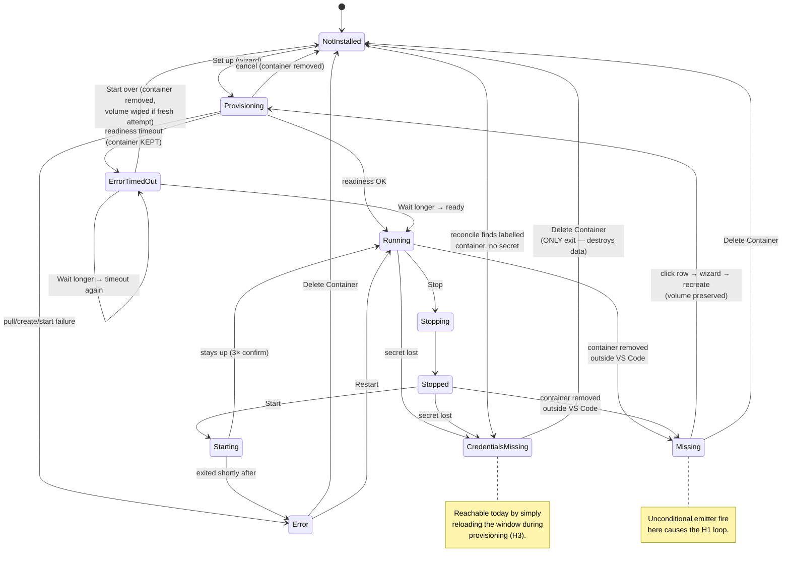

# PR #798 — DocumentDB Local with Quick Start helpers — Code Review

**Date:** 2026-08-04
**PR:** [#798](https://github.com/microsoft/vscode-documentdb/pull/798) — `feature/local-quickstart` → `release/0.10.0`
**Scope reviewed:** 107 files, +20 897 / −230 (diff against `origin/release/0.10.0`, not `main`)

**Review focus (as requested):** edge cases, and paths where invalid / unexpected input or state can break the
experience — on top of the standard code review.

**External feedback merged:** the GitHub Copilot reviewer's feedback on the PR page has been fetched, assessed
and folded in — see **M7** and the thread tracker in [§6](#6-external-review-threads-to-respond-to).

---

## 0. Status board — what to implement now vs. what is on hold

> **If you are an implementation agent, this section is your entry point.**
> Implement **only** the ✅ TODO items. Everything marked 🛑 ON HOLD is blocked on a maintainer decision or on
> another package — do not start it, do not "helpfully" fix it in passing, and do not refactor code it will touch.
>
> **UPDATE (2026-08-06): every cleared package has landed.** WP-1 … WP-5 are implemented and committed, each
> with its own commit and an `IMPLEMENTED` note beside its finding in §3. Nothing in the ✅ column is outstanding.
> The next step is the §9.2 discussion (and the §9.3 confirmation), which unblocks WP-6/7/8 and M7's thread reply.

### ✅ Cleared for implementation (all landed 2026-08-05/06)

| WP       | Title                                | Findings                   | Status                                                         |
| -------- | ------------------------------------ | -------------------------- | -------------------------------------------------------------- |
| **WP-1** | Tree refresh correctness             | H1                         | ✅ `fix(quickstart): fire the Missing status change only on…`  |
| **WP-2** | TLS exception policy correction      | H2, L4                     | ✅ `fix(tls): keep a deliberate TLS bypass for public hosts`   |
| **WP-3** | Provisioning durability & port model | H3, H4, L3, M5, L1, N5, N6 | ✅ `feat(quickstart): explicit port model and durable…`        |
| **WP-4** | Localization                         | M1, M2, N2                 | ✅ `fix(quickstart): localize the webview lookups and…`        |
| **WP-5** | Command surface & small fixes        | M3, L5, L6, L7, L8, L9     | ✅ `fix(quickstart): palette gating, log-follow disposal and…` |
| **WP-9** | Repository issues                    | —                          | ✅ Already done ([#864], [#865])                               |

[#864]: https://github.com/microsoft/vscode-documentdb/issues/864
[#865]: https://github.com/microsoft/vscode-documentdb/issues/865

### 🛑 On hold (do not implement)

| WP       | Title                            | Findings       | Blocked by                                               |
| -------- | -------------------------------- | -------------- | -------------------------------------------------------- |
| **WP-6** | Credential source of truth       | H5, M7         | §9.2 (record shape) — **approach decided**, timing isn't |
| **WP-7** | Recreate vs. fresh + state model | M4, L2, N1, N3 | §9.2 — maintainer input required                         |
| **WP-8** | Tree render cost                 | M6             | §9.3 confirmation **and** WP-1                           |

### ⛔ Explicitly not being fixed

| ID     | Reason                                                                                          |
| ------ | ----------------------------------------------------------------------------------------------- |
| **B1** | Footer user-test still running — keep the switch and the `USER-TEST PROTOTYPE` markers          |
| **N2** | Copy is approved verbatim from documentdb.io — only add a code comment saying so (part of WP-4) |
| **N7** | Docs consolidation handled by a separate work item                                              |

**Workflow:** WP-1…WP-5 are done. The discussion now resumes on §9.2 (and the §9.3 confirmation), after which
WP-6/7/8 are unblocked and M7's GitHub thread reply is finalized.

---

## 1. Verification performed

| Step                    | Command                  | Result                                        |
| ----------------------- | ------------------------ | --------------------------------------------- |
| Tests                   | `npx jest --no-coverage` | ✅ 202 suites / 3308 tests pass               |
| Lint                    | `npm run lint`           | ✅ clean (one pre-existing `eslint-env` warn) |
| Build                   | `npm run build`          | ✅ clean (workspaces + `tsc`)                 |
| Localization extraction | (bundle inspected)       | ✅ strings present in `l10n/bundle.l10n.json` |

Note: green CI does **not** cover the findings below — most of them are integration/lifecycle behaviours that the
unit tests mock out (`IContainerRuntime`, `ext.secretStorage`, the tree provider), or are host/webview wiring
issues that no test exercises.

---

## 2. Overall assessment

The architecture is genuinely good. The service/runtime split (`IContainerRuntime` injected into
`QuickStartServiceImpl`) makes a Docker-heavy feature unit-testable; secret handling is careful (env-file instead
of argv, line-buffered output masking, metadata stripped at the tRPC boundary); the destructive paths are
defensively gated (label + alias ownership checks, `propagateErrors` on Delete so "can't verify" is never
mistaken for "already gone"); and the readiness-diagnosis subsystem is unusually thorough.

The findings below are concentrated in three areas:

1. **State-machine edges that only appear when the world changes underneath the extension** (container removed
   externally, window reloaded mid-provision, stopped instance restarted after a reload, two windows racing).
2. **Localization wiring** — a large share of the new user-facing strings never reach the translation pipeline at
   runtime.
3. **Release hygiene** — a user-test prototype toggle is currently shipped in the UI.

---

## 3. Findings

Severity scale: **Blocker** (must fix before merge) · **High** · **Medium** · **Low** · **Nit**.

---

### B1 — Prototype "Footer experiment" switch + PREVIEW badge is shipped in the UI

**Severity: Blocker (release hygiene)**

`src/webviews/documentdb/localQuickStart/LocalQuickStart.tsx` renders an always-visible, absolutely-positioned
switch labelled "Footer experiment" with a `PREVIEW` badge, plus the `ResizeObserver`-driven measurement logic
behind it. The code is explicitly marked as temporary:

```tsx
{/* USER-TEST PROTOTYPE: Remove this switch and badge with the footer experiment logic above. */}
<div className={styles.prototypeToggle}>
    <Switch checked={adaptiveFooterEnabled} label={l10n.t('Footer experiment')} ... />
    <Badge ...>PREVIEW</Badge>
</div>
```

It is the tip commit of the branch (`feat: add experimental adaptive footer feature with toggle and measurement
logic`). It also overlays the content area (`position: absolute; top: 16px; right: 24px`), so on a narrow panel
it can sit on top of the hero text, and it adds a `ResizeObserver` observing four elements on every phase change.

**Why it matters:** a shipped extension must not expose an unexplained A/B toggle. It also localizes two strings
("Footer experiment", "Footer experiment is in preview") that will end up in the translation bundle.

**Fix options**

| Option                                                                                                                                                | Pros                                                                                                                                             | Cons                                                                                          |
| ----------------------------------------------------------------------------------------------------------------------------------------------------- | ------------------------------------------------------------------------------------------------------------------------------------------------ | --------------------------------------------------------------------------------------------- |
| **A. Remove the switch, the `adaptiveFooterEnabled`/`footerDocked` state, `scrollAreaInlineFooter`, and keep only the elevation logic** (recommended) | Smallest surface, removes 2 strings from the bundle, drops one `ResizeObserver` target set. Decision can be made later from the user-test notes. | Loses the ability to A/B in the field.                                                        |
| **B. Gate it behind `process.env.NODE_ENV !== 'production'`**                                                                                         | Keeps the experiment usable in dev builds; consistent with the existing `installResizeObserverLoopDetector` pattern in `src/webviews/index.tsx`. | Dead code stays in the file; still needs removing later; the two l10n strings still extract.  |
| **C. Move it behind a hidden VS Code setting**                                                                                                        | Can be enabled for specific testers on a real build.                                                                                             | Contributes a setting that must then be deprecated; most ceremony for a temporary experiment. |

> **DECISION (2026-08-05): WON'T FIX for now — leave the experiment in.** The footer user-test is still in
> progress, so the switch, the `PREVIEW` badge and the measurement logic stay. **Downgraded from Blocker to
> Informational.** The `USER-TEST PROTOTYPE` markers must remain in place so the code is removable once the test
> concludes; removal is tracked with the user-test, not with this review.

---

### H1 — Infinite tree-refresh / `docker inspect` loop when the container is Missing

**Severity: High** · Files: `src/services/localQuickStart/QuickStartService.ts`,
`src/tree/connections-view/LocalQuickStart/LocalQuickStartItem.ts`, `src/documentdb/ClustersExtension.ts`

`refreshLiveState()` fires the status emitter **unconditionally** when the container is gone:

```ts
if (!inspected) {
  entry.missing = true;
  this.statusEmitter.fire(); // fires even when `missing` was ALREADY true
  continue;
}
```

The loop closes like this:

```
statusEmitter.fire()
  → ClustersExtension: connectionsBranchDataProvider.refresh()   (full-tree fire)
  → VS Code re-queries the Expanded Quick Start node
  → LocalQuickStartItem.getChildren() → await QuickStartService.refreshLiveState()
  → container still gone → fire() again → …
```

`LocalQuickStartItem.getTreeItem()` returns `collapsibleState: Expanded`, so the node's children are always
re-queried, and `BaseExtendedTreeDataProvider.refresh()` with no argument does a full-tree fire. Every iteration
spawns a `docker inspect` child process.

**Repro:** provision an instance, then `docker rm -f vscode-documentdb-local` outside VS Code, then look at the
Connections view. Expected: a "Missing · click to recreate" row. Actual: that row plus a continuous refresh /
`docker inspect` spawn loop for as long as the view is visible.

Every other branch in `refreshLiveState` is correctly change-guarded (`if (entry.missing || entry.state !== nextState)`),
which is what makes this one stand out as an oversight rather than a design choice. The same unguarded pattern
exists in `ensureActionable()`'s missing branch, but that one is one-shot.

**Fix options**

| Option                                                                                                                | Pros                                                                                                               | Cons                                                                                                                  |
| --------------------------------------------------------------------------------------------------------------------- | ------------------------------------------------------------------------------------------------------------------ | --------------------------------------------------------------------------------------------------------------------- |
| **A. Guard the transition: `if (!entry.missing) { entry.missing = true; this.statusEmitter.fire(); }`** (recommended) | One-line fix, matches the change-guard used by every sibling branch, no behaviour change for the first transition. | Doesn't address the underlying "tree render triggers Docker I/O" coupling (see M6).                                   |
| **B. Debounce/coalesce `statusEmitter` → `refresh()` in `ClustersExtension` (e.g. 250 ms trailing)**                  | Also protects against any _future_ unguarded `fire()`; reduces refresh churn generally.                            | Adds a timer to activation; hides rather than fixes the root cause; adds visible latency to legitimate state changes. |
| **C. Make `refreshLiveState()` re-entrancy-safe (skip if a refresh ran within N ms)**                                 | Bounds the cost even if the loop reappears.                                                                        | Introduces a staleness window; a real external change can take up to N ms to show.                                    |

Recommend **A**, plus **C** as cheap insurance given how often `refreshLiveState()` is called (see M6).

> **DECISION (2026-08-05): accept A.** Also evaluate the provider's existing **cached-error-node** mechanism as
> a complementary/better guard: `BaseExtendedTreeDataProvider.wrapGetChildrenWithErrorAndStateHandling()` keeps a
> `failedChildrenCache` keyed by element id and, once a node's children are classified as an error state, it
> **returns the cached children and never calls `childrenFetchFunc()` again** until `resetNodeErrorState(nodeId)`
> is called. `ConnectionsBranchDataProvider` already opts into this wrapper. If the `Missing` (and possibly
> `CredentialsMissing`) rows are classified as an error state via the wrapper's `detectErrorState` hook, the
> re-entrant fetch is cut at the provider level rather than by a flag inside the service — which also gives the
> rows the standard error-recovery affordances for free. Explicit invalidation (`resetNodeErrorState`) would then
> have to be wired to `QuickStartService.onDidChangeStatus`, otherwise a recreate would not clear the row.
> Implement A first (it is the correctness fix), then assess the cached-error-node route on top.

---

### H2 — An explicit `tlsAllowInvalidCertificates=true` is silently stripped for public hosts

**Severity: High (behaviour regression for existing users)** · Files: `src/documentdb/utils/tlsException.ts`,
`src/commands/newConnection/ExecuteStep.ts`, `src/commands/updateConnectionString/ExecuteStep.ts`,
`src/commands/newConnection/PromptConnectionStringStep.ts`

`canonicalizeTlsException()` strips **every** TLS-bypass URL param unconditionally, and only converts it into
`disableEmulatorSecurity: true` when _all_ hosts are local/private:

```ts
const { stripped, bypassRequested } = stripTlsBypassParams(parsed); // strips regardless of host
const allHostsLocal = parsed.hosts.length > 0 && parsed.hosts.every(isLocalOrPrivateHost);
return {
  connectionString: stripped ? parsed.toString() : connectionString,
  disableEmulatorSecurity: bypassRequested && allHostsLocal,
};
```

Both `newConnection/ExecuteStep` and `updateConnectionString/ExecuteStep` persist `canonicalTls.connectionString`.
So for a **public** host the user's deliberate `tlsAllowInvalidCertificates=true` is removed from storage and is
_not_ replaced by the stored flag → the connection now fails certificate validation.

This directly contradicts the documented contract in the same file:

> `resolveAllowInvalidCertificates` … "staying silent (rather than forcing `tlsAllowInvalidCertificates: false`)
> lets the MongoDB driver **still honor an explicit `tlsAllowInvalidCertificates=true` that a user deliberately
> put in their connection string**, so self-hosted databases on public hostnames keep working."

That reasoning is only sound if the param survives in the stored string — and it doesn't.

**Who is affected:** anyone with a self-hosted DocumentDB/Mongo-API server behind a public DNS name and a
self-signed / internal-CA certificate. Existing _stored_ connections are not rewritten, so the break appears on
(a) creating a new connection, and (b) editing an existing connection's string.

**Fix options**

| Option                                                                                                                                                                     | Pros                                                                                                                                                       | Cons                                                                                                                                     |
| -------------------------------------------------------------------------------------------------------------------------------------------------------------------------- | ---------------------------------------------------------------------------------------------------------------------------------------------------------- | ---------------------------------------------------------------------------------------------------------------------------------------- |
| **A. Only strip bypass params when the exception is actually adopted (all hosts local); leave them intact for public hosts** (recommended)                                 | Restores the documented behaviour exactly; single source of truth still holds for the local case, which is what §7 is about; zero user-visible regression. | Two sources of truth remain for public hosts — but that is the pre-existing, working status quo.                                         |
| **B. Keep stripping, but persist `emulatorConfiguration.disableEmulatorSecurity: true` for public hosts too, and drop the host gate in `resolveAllowInvalidCertificates`** | Genuinely one knob everywhere.                                                                                                                             | Removes the security gate that is the whole point of §7 — a pasted/deep-linked public URL could disable validation. **Not recommended.** |
| **C. Keep stripping, but warn the user (modal/notification) that the bypass was dropped and why**                                                                          | Preserves the security posture, makes the change discoverable instead of silent.                                                                           | Still breaks working setups; adds an interruption to a common flow; users have no in-product way to re-enable.                           |
| **D. A + an explicit "Allow invalid certificates" opt-in for public hosts, guarded by a strongly-worded confirmation**                                                     | Best long-term: one knob, no regression, informed consent.                                                                                                 | Largest change; needs a new wizard step variant and copy review. Probably a follow-up, not this PR.                                      |

Recommend **A** for this PR, **D** as the follow-up.

> **DECISION (2026-08-05): A only.** Do **not** implement D (no public-host opt-in step). Restore the
> pre-existing behaviour: only strip the TLS-bypass params when the exception is actually adopted (i.e. every
> host is local/private); for a public or mixed host, leave the user's params untouched in the stored connection
> string so the driver keeps honouring them.

---

### H3 — A window reload during provisioning strands the container in an unrecoverable state

**Severity: High** · Files: `src/services/localQuickStart/QuickStartService.ts`,
`src/services/localQuickStart/quickStartRegistry.ts`

The credentials are persisted **only after** readiness succeeds:

```ts
await this.waitForReadiness(connectionString, signal); // up to READINESS_TIMEOUT_MS = 180_000
await this.finalizeReadyInstance(pending, cts.token, signal); // ← first ext.secretStorage.store(...)
```

If VS Code is closed/reloaded (or crashes) inside that window — up to **3 minutes**, and realistically longer on
the first pull-and-init — the container exists and is labelled, but no secret was written. On next activation
`reconcile()` → `reconcileAlias()` takes **Case 4**:

```ts
// labelled container + no recoverable secret + no fresh lease ⇒ credential-unavailable
this.setStatus(alias, InstanceState.CredentialsMissing, undefined, credentialUnavailableMessage());
```

The user's only exit is **Delete Container** (destroys the volume). The credentials were generated in memory and
are gone, so this is genuinely unrecoverable — but it was avoidable.

The registry was explicitly designed to prevent this. `QuickStartInstanceRecord` carries `phase: 'provisioning'`,
`operationId` and `leaseAt`, `isProvisioningLeaseFresh()` exists, `PROVISIONING_LEASE_TTL_MS` is 20 minutes, and
`reconcileAlias()` has a dedicated fresh-lease branch. **Nothing in production code ever writes a
`'provisioning'` record** — `upsertInstanceRecord` is only ever called with `phase: 'ready'` (from
`finalizeReadyInstance` and `adoptContainer`). A grep confirms `phase: 'provisioning'` / `leaseAt` / `operationId`
appear only in the two test files. The lease machinery, the scavenge pass in `reconcile()`, and the
`freshLease` branches are all currently dead code (the comments acknowledge this: "WI-2e allocates a fresh
alias here", "WI-2e renews `leaseAt` per stage").

**Fix options**

| Option                                                                                                                                      | Pros                                                                                                                                                                                                   | Cons                                                                                                                                                                                                                                  |
| ------------------------------------------------------------------------------------------------------------------------------------------- | ------------------------------------------------------------------------------------------------------------------------------------------------------------------------------------------------------ | ------------------------------------------------------------------------------------------------------------------------------------------------------------------------------------------------------------------------------------- |
| **A. Store the connection string in `SecretStorage` right after `createAndRunContainer` succeeds, before the readiness wait** (recommended) | Directly removes the unrecoverable window; a reload mid-wait now finds a reusable instance and adopts it. Also makes the retained `pendingReadiness` recoverable across a reload. Small, local change. | A failed provision now leaves a secret behind — but that is already the case for a timed-out instance, and `deleteContainer`/`discardTimedOutInstance` already clear it. Needs a matching cleanup in `provision`'s failure `finally`. |
| **B. Write the `phase: 'provisioning'` lease record (as designed) before create and renew it per stage**                                    | Activates the machinery that already exists and is already tested; `reconcile()` then shows "Provisioning…" instead of a dead end, and scavenges a truly crashed run.                                  | Doesn't by itself make the instance usable after a reload (credentials are still gone) — it only improves the _message_. Best combined with A.                                                                                        |
| **C. Leave as-is but change the `CredentialsMissing` copy to explain "setup was interrupted"**                                              | Zero risk.                                                                                                                                                                                             | Still forces a destructive Delete for what was a normal window reload. Poor experience.                                                                                                                                               |
| **D. Delete the dead lease machinery**                                                                                                      | Removes ~80 lines of unused code + two test files' worth of coverage for behaviour that can't happen.                                                                                                  | Throws away work that WI-2e will need; makes the multi-instance follow-up more expensive.                                                                                                                                             |

Recommend **A + B**. If the lease machinery is deliberately parked for WI-2e, add an explicit `FOLLOW-UP` comment
at `reconcileAlias`'s `freshLease` branches saying it is currently unreachable, so the next reader doesn't assume
it is live.

> **DECISION (2026-08-05): A + B as recommended.** Store the connection string immediately after
> `createAndRunContainer` succeeds (before the readiness wait) **and** activate the designed lease machinery
> (write `phase: 'provisioning'` + `leaseAt` before create, renew per stage, promote to `'ready'` on finalize).
> Do not delete the lease code.

---

### H4 — A cross-window provision race can delete the other window's container

**Severity: High impact / low probability** · File: `src/services/localQuickStart/QuickStartService.ts`

The `provisioning` guard is per-process in-memory state, so two VS Code windows can both enter `provision()`.
The orphan sweep in `provision`'s `finally` is **not scoped to the current run**:

```ts
} else if (createAttempted && !containerId) {
    // The CLI may have been killed after the daemon created the
    // container but before its id was captured — sweep by label.
    const orphan = await this.findManagedContainer();     // ← ANY container with our label + alias
    if (orphan) {
        await this.runtime.removeContainer(orphan.id).catch(() => undefined);
    }
}
```

Sequence:

1. Window A and Window B both pass the `findManagedContainer()` pre-check (no container exists yet).
2. A's `docker run --name vscode-documentdb-local` succeeds.
3. B's `docker run` fails — `The container name "/vscode-documentdb-local" is already in use`.
4. B's `catch` runs: `createAttempted === true`, `containerId === undefined`, `containerCreated === false`.
5. B's sweep finds **A's** container and removes it.

A then fails readiness (its container is gone) or, worse, succeeds the readiness probe against a container that is
being removed. The `operationId` field on `QuickStartInstanceRecord` was designed exactly for this ("a destructive
pre-clean only acts on its own container") and is never written (see H3).

Note the ordering is partly protected already: if A's container exists _before_ B's pre-check, B correctly stops
at the `CredentialsMissing` gate. The race window is only between B's pre-check and A's create.

**Fix options**

| Option                                                                                                                        | Pros                                                                                                                          | Cons                                                                                                                           |
| ----------------------------------------------------------------------------------------------------------------------------- | ----------------------------------------------------------------------------------------------------------------------------- | ------------------------------------------------------------------------------------------------------------------------------ |
| **A. Stamp a per-run `operationId` label on the container and scope the sweep to it** (recommended)                           | Exactly the designed fix; the label is already a `Record<string, string>` so no schema change; makes the sweep provably safe. | Requires the label to be set _before_ `docker run`, which it can be (`labels` is already built there).                         |
| **B. Skip the sweep entirely when the create failed with a name-conflict error**                                              | Two-line change.                                                                                                              | Error-string matching is fragile across Docker versions and locales; doesn't cover other concurrent-failure shapes.            |
| **C. Take a cross-window lock (a `globalState` lease written before create, honoured by the other window)**                   | Prevents the double-create at the source, not just the cleanup.                                                               | `globalState` is not atomic across windows (the registry module's own header says so); a lock built on it is advisory at best. |
| **D. Skip the sweep when a container with our label was created _after_ this run started (`createdAt > provisionStartedAt`)** | No new labels; uses data `listByLabel` already returns.                                                                       | Clock/precision sensitive; `createdAt` granularity is seconds in some Docker versions.                                         |

Recommend **A**.

---

### H5 — After a reload, starting a stopped instance leaves it unbrowsable (credential cache never repopulated)

**Severity: High** · Files: `src/services/localQuickStart/QuickStartService.ts`,
`src/tree/connections-view/LocalQuickStart/LocalQuickStartItem.ts`,
`src/tree/connections-view/DocumentDBClusterItem.ts`

(Found while validating the GitHub Copilot reviewer's comment — see **M7**.)

`CredentialCache` is in-memory, and there are exactly two places that repopulate it for a Quick Start instance:

| Call site                                    | Condition                                                |
| -------------------------------------------- | -------------------------------------------------------- |
| `finalizeReadyInstance()`                    | after a successful provision / resume                    |
| `adoptContainer()` (reconcile at activation) | **only `if (running)`** — a stopped container is skipped |

No other transition to `Running` populates it. So this everyday sequence breaks:

1. Stop the instance from the tree.
2. Reload the window / restart VS Code. `reconcile()` → `adoptContainer()` → container is **exited** → state
   `Stopped`, `metadata` is set, **cache not populated**.
3. Click **Start**. `QuickStartService.start()` → `setStatus(alias, InstanceState.Running)` — no cache write.
4. The tree now renders the browsable `QuickStartClusterItem`. Expanding it runs
   `ClusterItemBase.getChildren()` → `CredentialCache.hasCredentials(this.cluster.clusterId)` is **false** →
   falls through to `DocumentDBClusterItem.authenticateAndConnect()` →
   `ConnectionStorageService.get('quickstart-vscode-documentdb-local', Clusters)` → **not found** (the managed
   instance is deliberately not a stored connection) → `return null`.

The user gets the generic "connection failed / click to retry" child node, and retrying can never succeed —
the auth wizard is never even reached, because the `!connectionCredentials` guard returns before it.

The same gap is reachable from three more paths, all of which set `Running` without touching the cache:
`restart()` from a stopped container, `ensureActionable()`'s multi-window drift correction
(`setStatus(alias, live === 'running' ? Running : Stopped)`), and `refreshLiveState()` detecting a
Stopped → Running transition (started in another window or via the Docker CLI).

Everything needed is already in hand — `metadata.connectionString` carries the credentials and
`metadata.username` the user — so this is a wiring omission, not a missing-data problem.

**Fix options**

| Option                                                                                                                                         | Pros                                                                                                                                                                                 | Cons                                                                                                                                                                                                                         |
| ---------------------------------------------------------------------------------------------------------------------------------------------- | ------------------------------------------------------------------------------------------------------------------------------------------------------------------------------------ | ---------------------------------------------------------------------------------------------------------------------------------------------------------------------------------------------------------------------------- |
| **A. Populate the cache centrally inside `setStatus()` whenever the new state is `Running` and `metadata` is available** (recommended)         | One choke point covers `start`, `restart`, `ensureActionable`, `refreshLiveState` and any future transition; impossible to forget again.                                             | `setStatus` gains a side effect beyond "set state + fire"; needs the password parsed out of `metadata.connectionString` on each call.                                                                                        |
| **B. Call `populateCredentialCache()` explicitly in `start()` and `restart()`**                                                                | Smallest, most obvious diff; keeps `setStatus` pure.                                                                                                                                 | Leaves the `ensureActionable` and `refreshLiveState` drift paths broken; the next transition added will miss it too.                                                                                                         |
| **C. Always populate in `adoptContainer()`, regardless of running state**                                                                      | Fixes the dominant reload→Start case at the single point where the secret is already read; one condition removed.                                                                    | Caches credentials for an instance that may never be started (harmless — the cache is in-memory and keyed by an ephemeral id, but it is a wider cache footprint). Does not cover a Missing→recreate or a cross-window start. |
| **D. Make `QuickStartClusterItem` override `getCredentials()`/`authenticateAndConnect()` to read from `QuickStartService` instead of storage** | Removes the dependency on cache priming entirely; the node becomes self-sufficient and the base class's storage lookup (currently a dead path for this node) stops being misleading. | Largest change; duplicates a slice of the connect flow; needs care to keep the emulator TLS options identical.                                                                                                               |

Recommend **A** (or **C + B** if `setStatus` should stay side-effect-free). **D** is the cleanest long-term shape
and would also make **M7** trivial, since the tree model would no longer need to carry a connection string at all.

Worth adding a regression test: `stop()` → clear the cache → `start()` → assert
`CredentialCache.hasCredentials(clusterId(DEFAULT_ALIAS))`.

> **DECISION (2026-08-05): option D — the node delegates to `QuickStartService`, which owns its data in its own
> `StorageService` storage.** Confirmed after surveying how other subsystems use the storage layer (see
> [§9.1](#91-h5--where-should-the-managed-instances-credentials-live) for the full research). Summary of the
> decision:
>
> - **Do not add a `Managed` zone to `ConnectionStorageService`.** Zones are workspaces of the single
>   `StorageNames.Connections` storage and are exactly what the Connections view enumerates as root items.
> - **Do** create a dedicated storage via `StorageService.get('local-quickstart')`, mirroring what
>   `service-kubernetes` and `service-atlas-mongodb` already do. One `StorageItem` per instance:
>   non-secret metadata in `properties`, the connection string in `secrets` (SecretStorage-backed).
> - `QuickStartClusterItem` overrides `getCredentials()` and `authenticateAndConnect()` to read from
>   `QuickStartService`, so the inherited storage lookups are no longer on the path and the `CredentialCache`
>   priming stops being load-bearing.
> - **Bonus consolidation:** this replaces _both_ the ad-hoc `documentdb.quickstart.<alias>.connectionString`
>   SecretStorage keys _and_ the `documentdb.quickstart.registry` `globalState` blob with one coherent store.
>
> **STATUS: ON HOLD** — cleared in principle, but it overlaps the **M4** state-model discussion (§9.2) and the
> **H3** registry/lease work (WP-3). Implement only after M4 is settled, so the record shape is designed once.
> See **WP-6** for the implementation sketch.

---

### M1 — ~120 webview strings are extracted for translation but never localized at runtime

**Severity: Medium (localization correctness)** · Files: `src/webviews/documentdb/localQuickStart/LocalQuickStart.tsx`,
`src/webviews/index.tsx`, `src/webviews/_integration/WebviewRegistry.ts`

`LocalQuickStart.tsx` builds ~20 constant lookup maps at **module scope**:

```ts
const STAGE_LABELS: Record<ProvisionStage, string> = { checking: l10n.t('Checking Docker'), ... };
const DOCKER_GUIDANCE: Readonly<Record<DockerGuidanceKey, string>> = { installDocker: l10n.t('Install Docker Engine…'), ... };
// …DOCKER_FAILURE_LABELS, DOCKER_GUIDES, DOCKER_DETAIL_*, DOCKER_HOST_ENVIRONMENT_VALUES, PLAN_ITEMS, …
```

But `l10n.config()` runs **inside** `render()` in `src/webviews/index.tsx`, and `WebviewRegistry` statically
imports `LocalQuickStart`:

```ts
// WebviewRegistry.ts (eager import → module bodies execute at bundle load)
import { LocalQuickStart } from '../documentdb/localQuickStart/LocalQuickStart';

// index.tsx — runs LATER, when render() is called
export function render(...) { l10n.config({ contents: globalThis.l10n_bundle ?? {} }); … }
```

Every module-scope `l10n.t(...)` therefore evaluates before the bundle is configured and returns the English
source string permanently. The strings _are_ extracted into `l10n/bundle.l10n.json`, so this fails silently: the
translations exist and are simply never applied. This covers the stage labels, all Docker diagnosis copy, the
guidance/guides, the plan list — i.e. most of the new UI's text.

(One pre-existing instance of the same trap: `DataViewPanelJSON.tsx`'s `monacoOptions.ariaLabel`.)

**Fix options**

| Option                                                                                                                      | Pros                                                                                                                      | Cons                                                                                                                          |
| --------------------------------------------------------------------------------------------------------------------------- | ------------------------------------------------------------------------------------------------------------------------- | ----------------------------------------------------------------------------------------------------------------------------- |
| **A. Convert each map to a function called during render (`getStageLabels()`), memoized with `useMemo`** (recommended)      | Correct and explicit; keeps the "one map, one lookup" shape; `useMemo` keeps the per-render cost at zero after the first. | ~20 mechanical edits in one file; slightly noisier call sites (`STAGE_LABELS[s]` → `stageLabels[s]`).                         |
| **B. Call `l10n.config()` before the registry import (e.g. in a module imported first, or at the top of the bundle entry)** | One-line-ish fix; also fixes the pre-existing `DataViewPanelJSON` case and any future one.                                | Depends on module evaluation order, which bundlers may reorder; fragile and invisible — the exact class of bug we are fixing. |
| **C. Lazy-import the view components in `WebviewRegistry` (`React.lazy`)**                                                  | Module bodies then run after `l10n.config()`; also code-splits the bundle.                                                | Changes the webview bootstrap for all views; needs a `Suspense` boundary; broad blast radius for a localization fix.          |
| **D. Add a lint rule / unit test asserting no `l10n.t` at module scope under `src/webviews/`**                              | Prevents recurrence permanently.                                                                                          | Doesn't fix the existing code; needs a custom rule.                                                                           |

Recommend **A** now and **D** as a follow-up. **B** is tempting but re-introduces an order dependency.

> **DECISION (2026-08-05): A now.** Convert the module-scope maps to render-time functions (memoized with
> `useMemo`). **D is accepted but out of scope for this PR** — file a repository issue for the lint rule / guard
> test ("no `l10n.t` at module scope under `src/webviews/`"), since enforcing it will surface and require fixing
> other call sites across the webview code.

---

### M2 — Service-produced user-facing strings are hardcoded English

**Severity: Medium (localization)** · Files: `src/services/localQuickStart/QuickStartService.ts`,
`src/webviews/documentdb/localQuickStart/LocalQuickStart.tsx`,
`src/tree/connections-view/LocalQuickStart/LocalQuickStartItem.ts`

`StageEvent.message` / `.error` and `QuickStartStatus.errorMessage` are rendered verbatim
(`setSuccessMessage(event.message)`, `setErrorMessage(event.error ?? event.message)`, and the tree row's
`description = status.errorMessage`). Many of them are plain template strings:

```ts
`DocumentDB Local is running on localhost:${boundPort}.`; // success page subtitle
('Docker CLI was not found on your PATH. Install Docker and retry.');
'Docker is installed but the daemon is not reachable. Start Docker and retry.'`Port ${explicitPort} is already in use. Choose a different port or free it, then retry.``Ports ${QUICK_START_PORT}-${QUICK_START_PORT_BAND_END - 1} are all in use. Free one and retry.`;
('The container started but exited shortly after. Check the Quick Start logs.'); // tree row description
('The container restarted but exited shortly after. Check the Quick Start logs.');
'Setup is already in progress.' / 'Setup was cancelled.' / 'There is nothing to resume.';
('Still initializing. Keep waiting, view the logs, or start over.');
```

The file _does_ use `l10n.t` correctly elsewhere (`credentialUnavailableMessage`, `getReadinessTimeoutMessage`,
the port-fallback note, every `showInformationMessage`), so this is inconsistency rather than a missing pattern.
Also note the interpolated ones need `l10n.t('… {0} …', String(x))` form, not template literals, to be extractable.

**Fix options**

| Option                                                                                              | Pros                                                                                                                                                                             | Cons                                                                                                     |
| --------------------------------------------------------------------------------------------------- | -------------------------------------------------------------------------------------------------------------------------------------------------------------------------------- | -------------------------------------------------------------------------------------------------------- |
| **A. Wrap every message that can reach the UI in `l10n.t`, using `{0}` placeholders** (recommended) | Consistent with the rest of the file and the repo rule; `npm run l10n` then picks them up.                                                                                       | Touches ~15 call sites; must be careful to keep the _log-only_ strings (channel `appendLine`) unwrapped. |
| **B. Move to a typed message-key enum on `StageEvent` and localize in the webview**                 | Cleanly separates transport from presentation; the webview already does exactly this for the Docker diagnosis (`DockerGuidanceKey` etc.), so it matches the established pattern. | Larger refactor; needs a key for every message; interacts with M1 (the maps must then be render-time).   |
| **C. Leave as-is**                                                                                  | No work.                                                                                                                                                                         | Ships a partially-translated feature; the _success_ screen — the most-seen string — is English-only.     |

Recommend **A** for this PR; **B** is the right end state and matches how the Docker copy is already handled.

> **DECISION (2026-08-05): A for this PR.** Wrap every UI-reachable service message in `l10n.t` with `{0}`
> placeholders. **B is accepted as the end state but deferred** — file a repository issue for the typed
> message-key refactor and assign it to the **0.10.1** milestone (i.e. after 0.10.0 ships).

---

### M3 — Seven lifecycle commands leak into the Command Palette

**Severity: Medium** · File: `package.json`

The repo convention is to gate tree-only commands out of the palette with an explicit `"when": "never"` entry in
`menus.commandPalette` — there are 12 such entries today (`renameConnection`, `updateCredentials`,
`removeConnection`, `deleteFolder`, `atlas.openCluster`, …). None of the eight new
`vscode-documentdb.command.localQuickStart.*` commands has one.

Consequences:

- The palette now shows **"DocumentDB: Start"**, **"DocumentDB: Stop"**, **"DocumentDB: Restart"**,
  **"DocumentDB: View Logs"**, **"DocumentDB: Copy Password"** — titles that are meaningless without the tree
  row's context.
- Invoked with no instance, `start`/`stop`/`restart`/`copyPassword`/`viewLogs`/`copyConnectionString` **silently
  no-op** (`const id = this.stateFor(alias).metadata?.containerId; if (!id) return;`) — a dead palette entry.
- **"DocumentDB: Delete Container…"** is the sharp one: it is reachable from the palette in any state, shows a
  permanent-data-loss confirmation, and `deleteContainer()` will then remove _every_ label-matched container and
  the `vscode-documentdb-local-data` volume regardless of the in-memory state.

Only `localQuickStart.open` ("Local Quick Start") is a legitimate palette entry.

**Fix options**

| Option                                                                                                                                                            | Pros                                                       | Cons                                                                                               |
| ----------------------------------------------------------------------------------------------------------------------------------------------------------------- | ---------------------------------------------------------- | -------------------------------------------------------------------------------------------------- |
| **A. Add `"when": "never"` for the seven lifecycle commands, keep `open`** (recommended)                                                                          | Matches the existing convention exactly; zero code change. | Power users lose keyboard-only access to Start/Stop (they can still use the tree).                 |
| **B. Keep them in the palette but disambiguate the titles ("DocumentDB Local: Start Container") and add a `when` context key set from `QuickStartService` state** | Keeps palette access; titles become self-explanatory.      | Requires a new `setContext` key kept in sync with the service — more moving parts for little gain. |
| **C. Keep them, but make the no-op paths tell the user why nothing happened**                                                                                     | Cheap; removes the silent-failure part.                    | Doesn't fix the ambiguous titles or the palette-reachable destructive Delete.                      |

Recommend **A**. If Start/Stop palette access is wanted later, do **B** properly with a context key.

> **DECISION (2026-08-05): A only.** Add `"when": "never"` `commandPalette` entries for the seven lifecycle
> commands; keep `localQuickStart.open` visible. Do not implement B.

---

### M4 — "Start DocumentDB Local" destroys and recreates a _running_ container, and the footer note says the opposite

**Severity: Medium (UX / data expectation)** · Files:
`src/webviews/documentdb/localQuickStart/LocalQuickStart.tsx`, `src/services/localQuickStart/QuickStartService.ts`

When stored credentials exist (`willReuse === true`), the Configure step relabels the _settings_ ("Kept from the
existing instance", "Reused from the existing instance") and adds a small note. But:

- The primary button still reads **"Start DocumentDB Local"** — not "Recreate".
- The footer note still reads: _"Starting downloads the official image if needed, then creates and starts one
  container named `vscode-documentdb-local`. **Nothing else on your machine is changed.**"_
- There is **no confirmation**, and the service unconditionally removes the existing container first:

```ts
if (existing) {
  channel.appendLine(`Removing existing Quick Start container ${existing.id} for a clean run…`);
  await this.runtime.removeContainer(existing.id).catch(() => undefined); // force: true
}
```

So a user who opens Quick Start out of curiosity while their instance is happily running, clicks through
Introduction → Configure → Start, force-stops and destroys the running container. The _volume_ survives, so
document data is safe — but connections are dropped, container-local state outside `/data` is lost, and the
footer note actively told them nothing would change.

Compare with the tree's `Delete Container…`, which does have a proper `getConfirmationAsInSettings` dialog.

**Fix options**

| Option                                                                                                                                                                                                                 | Pros                                                                            | Cons                                                                                                                |
| ---------------------------------------------------------------------------------------------------------------------------------------------------------------------------------------------------------------------- | ------------------------------------------------------------------------------- | ------------------------------------------------------------------------------------------------------------------- |
| **A. Make the recreate path self-describing: primary label → "Recreate DocumentDB Local", footer note → "Recreating stops and replaces the existing container. Your data volume is kept."** (recommended, minimum bar) | Honest copy, no new dialogs, uses state the webview already has (`isRecreate`). | Still one click away from destroying a running container.                                                           |
| **B. A + a confirmation when the existing instance is currently `Running`**                                                                                                                                            | Matches the Delete flow's bar; the destructive case is the only one gated.      | Needs `status.state` in the webview (currently `toWebviewStatus` keeps `state`, so it is available) — small wiring. |
| **C. Detect "already running and healthy" and offer "Open Connection" instead of a recreate**                                                                                                                          | Best outcome: the common accidental case becomes a no-op with a useful action.  | New branch in the wizard; needs design input on what Configure even means then.                                     |
| **D. Leave as-is**                                                                                                                                                                                                     | No work.                                                                        | The footer note is factually wrong in this state, which is worse than saying nothing.                               |

Recommend **A + B** for this PR, **C** as a design follow-up.

> **DECISION (2026-08-05): OPEN — under discussion, do not implement yet.**
> Direction given: the user must be able to **choose** between recreating onto the existing volume and starting
> fresh — it must not be inferred from `willReuse`. A full state/collision model is required first (existing but
> removed, existing but stopped, existing and running, credential-unavailable, …), including when the Quick Start
> tree item is visible at all, and it must not assume a single managed container. See
> [§9.2](#92-m4--recreate-vs-fresh-and-the-instance-state-model) for the state diagram and the open questions.
> **L2 and M7 are blocked on the outcome of this discussion.**

---

### M5 — Port selection is TOCTOU, and the auto path has no retry

**Severity: Medium** · Files: `src/services/localQuickStart/ContainerRuntime.ts`,
`src/services/localQuickStart/QuickStartService.ts`

`isPortFree()` binds a throwaway `net.Server` on `127.0.0.1` and immediately closes it; the container is created
seconds later (after the image pull, which can take minutes on a cold cache). Anything can take the port in
between — including a second VS Code window running the same wizard.

The failure surfaces as a raw Docker error string ("Bind for 127.0.0.1:10260 failed: port is already allocated")
in the `creating` stage, with no automatic recovery even in the _auto-port_ case where relocation is explicitly
allowed by design.

Related: `findAvailablePort` burns an attempt on a duplicate candidate (`if (tried.has(candidate)) continue;`
does not decrement `i`), so with 10 attempts over a 100-port band the effective attempt count is lower than
intended. Minor, but it makes the "all ports busy" error reachable earlier than the constants suggest.

**Fix options**

| Option                                                                                                      | Pros                                                                                                             | Cons                                                                                                                  |
| ----------------------------------------------------------------------------------------------------------- | ---------------------------------------------------------------------------------------------------------------- | --------------------------------------------------------------------------------------------------------------------- |
| **A. Move the port selection to immediately before `createAndRunContainer` (after the pull)** (recommended) | Shrinks the window from minutes to milliseconds; no new retry logic; the pull no longer holds a claim on a port. | The `checking` stage can no longer report the port-fallback note — it moves to `creating`. Small UX shuffle.          |
| **B. On a port-allocation failure in the auto path, re-pick and retry the create once or twice**            | Actually recovers instead of failing; matches the "auto port with fallback" promise.                             | Needs Docker error classification (string matching, version/locale sensitive); adds a retry loop to the hottest path. |
| **C. Hold the probe socket open until `docker run` (reserve the port)**                                     | Eliminates the race for other _host_ processes.                                                                  | Docker cannot bind a port the extension is holding — this breaks the create outright. **Not viable.**                 |
| **D. Leave as-is, but classify the error and show "Port X was taken while the image downloaded — retry."**  | Cheap; turns a raw Docker string into actionable copy.                                                           | Still a dead end requiring a manual retry.                                                                            |

Recommend **A** (+ the one-line `findAvailablePort` attempt-counting fix), with **B** or **D** as the follow-up.

> **DECISION (2026-08-05): D only — and superseded in part by L3.** Treat the TOCTOU itself as an acceptable
> edge case: classify the port-allocation failure and surface actionable copy instead of a raw Docker string.
> Do **not** implement A, B or C. Note that **L3 removes the automatic port-relocation logic entirely**, so the
> "auto path has no retry" half of this finding disappears with it — after L3 there is only ever an explicit
> port, and a conflict is always a hard, explained error.

---

### M6 — `refreshLiveState()` runs a `docker inspect` on every Connections-view render

**Severity: Medium (performance)** · Files:
`src/tree/connections-view/LocalQuickStart/LocalQuickStartItem.ts`,
`src/webviews/documentdb/localQuickStart/localQuickStartRouter.ts`

`LocalQuickStartItem.getChildren()` starts with `await QuickStartService.refreshLiveState()`, and
`getDockerStatus` (the webview query, also used by `pollDockerReadiness` on a 1–5 s backoff) calls it too. Each
call spawns a `docker inspect` child process per known alias and blocks the tree node's children on it.

The Connections view refreshes on many unrelated events (connection add/remove/rename, folder ops, discovery
refresh, `ext.state` transitions). Every one of those now pays a process spawn plus Docker daemon round-trip
before the Quick Start node can render — for _all_ users who have ever provisioned an instance, including those
who never open the feature again. This is also what makes H1's loop expensive rather than merely noisy.

**Fix options**

| Option                                                                                                                    | Pros                                                                                                                | Cons                                                                                        |
| ------------------------------------------------------------------------------------------------------------------------- | ------------------------------------------------------------------------------------------------------------------- | ------------------------------------------------------------------------------------------- |
| **A. Memoize `refreshLiveState()` for a short TTL (e.g. 2–5 s), mirroring `READINESS_MEMO_TTL_MS`** (recommended)         | One small change, consistent with the readiness service's own memoization, kills the burst cost and caps H1's loop. | A genuine external change can take up to the TTL to appear.                                 |
| **B. Render from cached state and refresh in the background (fire-and-forget), letting the emitter update the row later** | Tree render becomes instant; no user-perceived Docker latency at all.                                               | The first render after a change shows stale state briefly; needs care not to re-trigger H1. |
| **C. Poll on a timer only while the Connections view is visible, and drop the per-render call**                           | Predictable, bounded cost; decouples Docker I/O from rendering entirely.                                            | Needs view-visibility plumbing; a timer runs even when nothing changes.                     |
| **D. Leave as-is**                                                                                                        | No work.                                                                                                            | Silent, always-on cost paid by every user of the extension.                                 |

Recommend **A** now, **B** as the cleaner end state.

> **DECISION (2026-08-05): OPEN — leaning B, under discussion.**
> Maintainer's read: this cost is only paid when the Quick Start node's children are fetched, and once **H1** is
> fixed there is no tight loop, so **A**'s value drops sharply. Preferred direction is **B** — render immediately
> from cached state with a `"Refreshing…"` description, then update the row when the probe returns. See
> [§9.3](#93-m6--when-does-refreshlivestate-actually-run) for the verification of when `getChildren()` runs and
> what A would and would not buy.

---

### M7 — Credential-bearing connection string is stored on the tree model _(GitHub Copilot reviewer)_

**Severity: Medium (latent risk; not an active leak today)** ·
File: `src/tree/connections-view/LocalQuickStart/LocalQuickStartItem.ts` (lines 106–110)
**Thread:** <https://github.com/microsoft/vscode-documentdb/pull/798#discussion_r3714252974> — reviewer: `Copilot`

> `model.connectionString` is set to `metadata.connectionString`, which (per
> `quickStartCredentials.composeConnectionString`) is a credential-bearing URI (userinfo includes the generated
> username/password). Even if nothing renders it today, keeping a password-embedded connection string on the tree
> model increases the risk of accidental logging/telemetry/tooltip leakage later and diverges from the repo's
> broader "password-free base connectionString + password stored separately" pattern.
>
> Consider stripping username/password before assigning to `model.connectionString` (keeping hosts + params), and
> rely on `connectionUser` + the pre-populated `CredentialCache` for authentication.

**Verification (done for this review — the comment is accurate but the risk is latent, not live).** I traced every
consumer of `cluster.connectionString`:

| Consumer                                                 | Reads                                                                                         | Leaks password? |
| -------------------------------------------------------- | --------------------------------------------------------------------------------------------- | --------------- |
| `DocumentDBClusterItem.getHosts()` → tooltip             | `.hosts` only                                                                                 | No              |
| `DocumentDBClusterItem.isTlsDisabled()`                  | `tls` / `ssl` search params                                                                   | No              |
| `resolveAllowInvalidCertificates(...)` (badge + tooltip) | `areAllHostsLocal()` → hosts only                                                             | No              |
| `ClusterItemBase`                                        | only declares the field, never reads it                                                       | No              |
| Generic copy / rename / move / remove commands           | gated off by `contextValue` (`treeItem_quickStartInstance`, not `treeitem_documentdbcluster`) | Not reachable   |

So there is **no** current code path that renders, logs or transmits the password from the tree model. The value
of fixing it is defense-in-depth plus consistency with the repo pattern (`EphemeralClusterCredentials` treats
`connectionString` as a password-free base and carries the password only in `nativeAuthConfig` — the same PR even
hardens `buildParsedConnectionString` with `parsedConnectionString.password = ''` for exactly this reason, so the
codebase is already asserting this invariant elsewhere).

Two caveats that should go in the thread reply:

1. The equivalent value on the **service** side (`InstanceMetadata.connectionString`) genuinely must keep the
   password — `populateCredentialCache()` and `copyQuickStartPassword()` parse it back out. Only the **tree
   model** copy is safe to strip. A fix that strips both would break those paths.
2. This is entangled with **H5**: the `QuickStartClusterItem` browse path only works because the cache is
   pre-populated, and today that priming is missing after a reload-then-Start. Stripping the model's password
   makes the cache the _sole_ source of truth, so **H5 must be fixed first or together with this** — otherwise
   the broken case becomes harder to diagnose rather than easier.

**Fix options**

| Option                                                                                                                                                    | Pros                                                                                                                                                                                                      | Cons                                                                                                                                                                     |
| --------------------------------------------------------------------------------------------------------------------------------------------------------- | --------------------------------------------------------------------------------------------------------------------------------------------------------------------------------------------------------- | ------------------------------------------------------------------------------------------------------------------------------------------------------------------------ |
| **A. Strip userinfo when building the tree model** (`parsed.username = ''; parsed.password = ''`), keep `connectionUser: metadata.username` (recommended) | Exactly what the reviewer asks; ~4 lines; every current consumer (hosts, TLS params, host gating) is unaffected; aligns with `buildQuickStartCopyCredentials`, which already does this for the copy flow. | Depends on the `CredentialCache` being primed — i.e. requires **H5**. Also removes the (currently unused) ability to recover the password from the tree model.           |
| **B. Strip the password but keep the username** (`parsed.password = ''`)                                                                                  | Tooltip/telemetry can never carry the secret; the user is still visible in the URI for debugging.                                                                                                         | Half-measure: the URI is still not the repo's "password-free base" shape, so the divergence the reviewer raised only partly goes away.                                   |
| **C. Reuse `buildQuickStartCopyCredentials()`** (already exported from `localQuickStartCommands.ts`) to derive the model's string                         | One shared stripping implementation instead of two; it already fails closed (returns `undefined`) on an unparseable string.                                                                               | Tree code would import from a command module — a slightly odd dependency direction; the helper returns a full `EphemeralClusterCredentials`, so only part of it is used. |
| **D. Do nothing, document the invariant with a comment**                                                                                                  | Zero risk of breaking the browse path.                                                                                                                                                                    | Relies on every future maintainer honouring an unenforced invariant — precisely the failure mode the reviewer is guarding against.                                       |

Recommend **A**, sequenced after (or in the same change as) **H5**. Extract the stripping into a tiny shared
helper so **A** and `buildQuickStartCopyCredentials` cannot drift.

> **DECISION (2026-08-05): DEFERRED — re-assess last.** Do not act on this now. If **H5** is resolved by moving
> the instance's credentials into the storage layer (see §9.1), the tree model stops needing a credential-bearing
> string at all and this finding disappears rather than being "fixed". Re-evaluate once H5, M4 and L3 have landed,
> then reply on the thread with the outcome.

---

### L1 — The Provisioning tree row hardcodes port 10260

**Severity: Low** · File: `src/tree/connections-view/LocalQuickStart/LocalQuickStartItem.ts`

```ts
label: l10n.t('Provisioning… · localhost:10260'),
```

A user who set a custom port (or hit the auto-fallback band) sees the wrong address for the whole provisioning
window. Note it is also a hardcoded literal inside a localized string, so translators can't even see it is a port.

**Fix options**

- **A (recommended):** use `status.metadata?.boundPort ?? entry.port ?? QUICK_START_PORT` and the
  `l10n.t('Provisioning… · localhost:{0}', String(port))` form, matching the other rows. Requires exposing the
  chosen port on `QuickStartStatus` during provisioning (it is already tracked as `chosenPort`).
  _Pro:_ correct and consistent. _Con:_ small plumbing to surface the port before `metadata` exists.
- **B:** drop the address entirely while provisioning (`l10n.t('Provisioning…')`).
  _Pro:_ one line, cannot be wrong. _Con:_ loses a useful hint in the common (default-port) case.

> **DECISION (2026-08-05): A.** Surface the real chosen port. Simplified by **L3**: once the port is always
> explicit and decided in the wizard, it is known before provisioning starts.

---

### L2 — The Configure "Address" row shows 10260 for a recreate on a fallback port

**Severity: Low** · File: `src/webviews/documentdb/localQuickStart/LocalQuickStart.tsx`

`effectivePort` derives only from `advPort`, whose initial state is `String(QUICK_START_PORT)`. For a
recreate/`Missing` instance that actually lives on, say, 10312, the Configure step confidently says
`localhost:10260`. The recreate then re-runs auto-port selection and may genuinely land on a different port than
the user was shown.

**Fix options**

- **A (recommended):** seed `advPort` from the instance's known port when `willReuse` resolves (the status
  already carries `port`; `toWebviewStatus` would need to pass it through — it is not sensitive).
  _Pro:_ the summary matches reality. _Con:_ one more field over the wire; needs care not to clobber a value the
  user already typed.
- **B:** for `isRecreate`, render the Address value as "Kept from the existing instance" like the Image row does.
  _Pro:_ consistent with the sibling rows, no new data. _Con:_ the port _is_ still editable on a recreate, so
  hiding the value is slightly misleading in the other direction.

> **DECISION (2026-08-05): A — but BLOCKED on M4.** The recreate / `willReuse` concept is itself under
> discussion (§9.2), so the shape of "the instance's known port" depends on that outcome. Implement A only after
> the M4 decision is made, and confirm the exact behaviour with the maintainer at that point.

---

### L3 — Typing the default port explicitly silently disables the "exact port" contract

**Severity: Low** · File: `src/webviews/documentdb/localQuickStart/LocalQuickStart.tsx`

```ts
if (advPort.trim() && advPort.trim() !== String(QUICK_START_PORT)) opts.port = Number(advPort.trim());
```

The documented service contract is: an explicit port is honoured exactly and a conflict **errors**; an omitted
port auto-relocates. A user who deliberately types `10260` because they need that exact port gets the _auto_
behaviour and is silently moved to a random port in the band. (`010260` is also `!== '10260'`, so it _is_ sent —
inconsistent.)

**Fix options**

- **A (recommended):** track "the user edited the port" as explicit state (`portTouched`) rather than inferring it
  by comparing to the default; send `opts.port` whenever the field was touched and is valid.
  _Pro:_ the intent is captured directly instead of guessed. _Con:_ one extra state flag.
- **B:** always send the port when the field is non-empty, and let 10260 mean "exact".
  _Pro:_ one-line change, contract becomes trivially predictable. _Con:_ removes auto-fallback for everyone who
  never opens the editor — the default _is_ 10260 in the box, so this silently makes conflicts hard errors. **Not
  recommended.**
- **C:** leave the behaviour, but make the copy explicit ("Leave at 10260 to let setup pick a free port
  automatically").
  _Pro:_ zero risk. _Con:_ documents a surprising rule instead of removing it.

> **DECISION (2026-08-05): none of the above — remove the auto-port mechanism entirely.**
> Direction: **no magic after the user presses execute.** The port becomes a plain, always-explicit setting:
>
> 1. The **Configure wizard** detects a free port up front and pre-fills the field with it (starting at
>    `QUICK_START_PORT`, falling forward if busy). The user sees the actual port that will be used, and may edit it.
> 2. Validate the field's availability **in the wizard**, while the user can still react.
> 3. `provision()` then treats the port as **always explicit**: no `findAvailablePort`, no fallback band, no
>    "port X was busy, using Y" note. A conflict at create time is a hard, clearly-explained error (see **M5/D**).
>
> Code to delete/simplify: `IContainerRuntime.findAvailablePort`, `QUICK_START_PORT_BAND_END`,
> `QUICK_START_PORT_FALLBACK_ATTEMPTS`, the `portFallback` telemetry property and the fallback branch in
> `provision()`. `isPortFree` is kept and moves to the wizard.
>
> **Knock-on effects (deliberate):** removes the ambiguity behind **L3**, removes the auto half of **M5**,
> simplifies **L1** and **L2**, and removes the "Ports X–Y are all in use" message from **M2**. This also has to
> be reflected in the Configure-step copy and in `docs/user-manual/local-quick-start.md`.

---

### L4 — `hostClassification` misses expanded and IPv4-mapped IPv6 loopback

**Severity: Low** · File: `src/documentdb/utils/hostClassification.ts`

`isLocalOrPrivateHost` special-cases the literal `'::1'` only. These are all loopback and all classified as
**public**:

| Input              | Path taken                                         | Result  |
| ------------------ | -------------------------------------------------- | ------- |
| `0:0:0:0:0:0:0:1`  | first hextet `0` → no `fc00::/7` / `fe80::/10` hit | `false` |
| `::ffff:127.0.0.1` | contains `:` → first hextet `''` → `NaN`           | `false` |
| `::`               | first hextet `''` → `NaN`                          | `false` |

Consequences: the TLS-exception step is not offered for those hosts, and (after H2) an existing
`disableEmulatorSecurity` flag is not honoured for them at runtime, so a working local connection written with an
expanded IPv6 address would start failing certificate validation.

**Fix options**

- **A (recommended):** normalize the IPv6 literal before classifying — e.g. `net.isIPv6()` + expand `::`, or
  simply add the explicit cases (`0:0:0:0:0:0:0:1`, `::ffff:<ipv4>` → recurse on the IPv4 part).
  _Pro:_ correct for all spellings; `net` is already imported elsewhere in the codebase. _Con:_ a few more lines
  and test cases.
- **B:** add the two literal forms to the existing string checks.
  _Pro:_ trivial. _Con:_ still misses `::ffff:10.0.0.5` and other mapped forms.

The test file `hostClassification.test.ts` covers `::1`, `fc00::/7`, `fe80::/10` and the IDNA homograph cases —
worth extending with the rows above.

> **DECISION (2026-08-05): accepted — implement A.** Normalize IPv6 literals properly (expanded form and
> IPv4-mapped `::ffff:<ipv4>`), and extend `hostClassification.test.ts` with those rows.

---

### L5 — `MaskingLineBuffer` grows without bound on newline-less output

**Severity: Low** · File: `src/services/localQuickStart/outputMasking.ts`

`push()` only emits on `\n`. `followLogs` streams `docker logs -f` indefinitely; a container that emits a long
newline-free stream (progress bars with `\r`, a binary blob, a runaway single-line log) accumulates in
`this.buffer` until the follow ends. `\r` is only stripped as a _line terminator suffix_, not treated as a break.

**Fix options**

- **A (recommended):** cap the buffer (e.g. flush at 8–16 KB without a newline).
  _Pro:_ bounded memory, no behaviour change for normal logs. _Con:_ a secret straddling a forced flush boundary
  could theoretically escape masking — mitigate by keeping a small tail (≥ max secret length) in the buffer.
- **B:** also break on `\r`.
  _Pro:_ handles the common progress-bar case; matches terminal semantics. _Con:_ doesn't bound the truly
  pathological case.

> **DECISION (2026-08-05): A.** Cap the buffer, keeping a tail of at least the longest secret's length so a
> forced flush can never split a secret past the masker.

---

### L6 — A custom Advanced password may appear percent-encoded and unmasked

**Severity: Low (defense-in-depth)** · Files: `src/services/localQuickStart/outputMasking.ts`,
`src/services/localQuickStart/quickStartCredentials.ts`

`maskSecrets` does literal substring replacement of the raw password. Auto-generated passwords use the URL-safe
alphabet, so their raw and percent-encoded forms are identical — fine. A **custom** Advanced password may contain
`@`, `:`, `/`, `%`, `#`, which `composeConnectionString` percent-encodes; if a connection string ever reaches the
channel (a driver error echo, a future diagnostic), the encoded form would not be masked.

**Fix options**

- **A (recommended):** pass both the raw and `encodeURIComponent`-ed forms into the `secrets` array at the call
  sites (`provision`'s `secrets`, `seedSampleData`, `followLogs`).
  _Pro:_ one-line per call site, no API change. _Con:_ slightly longer secrets array.
- **B:** have `maskSecrets` derive the encoded variant itself.
  _Pro:_ callers can't forget. _Con:_ couples a deliberately dependency-free module to URI semantics.

> **DECISION (2026-08-05): A.** Pass both the raw and `encodeURIComponent`-ed forms into the `secrets` array at
> the call sites; keep `outputMasking.ts` dependency-free.

---

### L7 — A non-transient Docker failure during "Start Docker" ends the wait with no message

**Severity: Low** · File: `src/webviews/documentdb/localQuickStart/LocalQuickStart.tsx`

`pollDockerReadiness` returns `'ready' | 'stopped' | 'deadline' | 'cancelled'`, but `handleStartDocker` only
handles `'ready'` and `'deadline'`. On `'stopped'` (Docker came up but reported e.g. `permissionDenied`) the
spinner disappears and `dockerActionMessage` stays `undefined`. The readiness card _does_ update via `onResult`,
so the user isn't left blind — but the transition is unannounced, and the assertive `Announcer` bound to
`dockerActionMessage` says nothing.

**Fix options**

- **A (recommended):** add a `'stopped'` branch setting a message such as "Docker started, but it is not usable
  yet — see the details below."
  _Pro:_ two lines; completes the announcement contract. _Con:_ one more string.
- **B:** treat `'stopped'` as `'deadline'`.
  _Pro:_ zero new strings. _Con:_ the message ("did not become ready before the wait timed out") is factually
  wrong — it _did_ answer.

> **DECISION (2026-08-05): A.** Add the explicit `'stopped'` branch with its own message.

---

### L8 — `activeLogFollow` is never disposed on deactivation

**Severity: Low** · File: `src/commands/localQuickStart/localQuickStartCommands.ts`

The module-level `activeLogFollow` `CancellationTokenSource` is cancelled/disposed only when _View Logs_ is
invoked again. It is never registered with `ext.context.subscriptions`, so a `docker logs -f` child process
started by the last invocation outlives extension deactivation until the container stops.

**Fix options**

- **A (recommended):** register a disposable at command-registration time in `ClustersExtension`
  (`{ dispose: () => { activeLogFollow?.cancel(); activeLogFollow?.dispose(); } }`), next to the existing
  `disposeQuickStartOutputChannel` registration.
  _Pro:_ matches the pattern already used two lines away. _Con:_ needs a small exported helper.
- **B:** move the follow state into `QuickStartServiceImpl` (which is already pushed to `subscriptions`) and
  clean it up in `dispose()`.
  _Pro:_ one owner for all Docker streams. _Con:_ mixes a command-scoped concern into the lifecycle service.

> **DECISION (2026-08-05): fix it.** Either option is acceptable; **A** is preferred for the smaller blast
> radius (register the disposable next to the existing `disposeQuickStartOutputChannel` registration).

---

### L9 — A crash leaves a plaintext-password env file in the temp directory

**Severity: Low** · File: `src/services/localQuickStart/QuickStartService.ts`

`writeEnvFile` correctly uses `mode: 0o600` and a random name, and `provision`'s `finally` deletes it. If the
extension host is killed between the write and the `finally`, the file survives in `os.tmpdir()`. On Windows the
`mode` argument is ignored, so the file inherits directory ACLs (still user-scoped in practice).

**Fix options**

- **A (recommended):** sweep `documentdb-quickstart-*.env` from `os.tmpdir()` at activation (best-effort,
  fire-and-forget).
  _Pro:_ self-heals after any crash; a few lines. _Con:_ a stray `readdir` at activation.
- **B:** write into `ext.context.globalStorageUri` instead of `os.tmpdir()`.
  _Pro:_ extension-scoped directory, easier to sweep, better ACLs on Windows. _Con:_ Docker must be able to read
  the path — fine locally, but breaks if the daemon is remote/WSL with a different filesystem view.
- **C:** accept the risk and document it.
  _Pro:_ no work. _Con:_ the whole point of the env-file design was keeping the password off disk-adjacent
  surfaces.

> **DECISION (2026-08-05): A.** Sweep `documentdb-quickstart-*.env` from `os.tmpdir()` at activation
> (best-effort, fire-and-forget). Do not move the file out of `tmpdir` (option B) — the daemon must be able to
> read it.

---

### Nits

| #      | Item                                                                                                                                                                                                                                                                     | Suggestion                                                                                                 |
| ------ | ------------------------------------------------------------------------------------------------------------------------------------------------------------------------------------------------------------------------------------------------------------------------ | ---------------------------------------------------------------------------------------------------------- |
| **N1** | `willReuse` is fetched once per panel open and never refreshed. Deleting the instance from the tree while the panel is open leaves the wizard showing the recreate copy.                                                                                                 | Re-query `getDockerStatus` when the panel regains focus, or subscribe to status changes.                   |
| **N2** | Terminology: _"an open-source, fully MongoDB-compatible database"_ in the introduction copy. The repo rule is to avoid "MongoDB" as a bare product name; here it reads as a compatibility descriptor, which is borderline acceptable.                                    | Consider "fully compatible with the MongoDB API" to match the documented convention exactly.               |
| **N3** | `LocalQuickStartItem` has a self-acknowledged `FOLLOW-UP` comment about reporting wizard failures in the tree when the user never opened the wizard from there.                                                                                                          | Either resolve it or file it — a `FOLLOW-UP` with no tracking item tends to become permanent.              |
| **N4** | `runStream`'s `FOLLOW-UP (retry stability)` comment documents an un-awaited unsubscribe race that the service now papers over by buffering terminal events.                                                                                                              | Worth an explicit handshake (`await` the previous stream's completion) rather than relying on the buffer.  |
| **N5** | `resumeReadiness`, `discardTimedOutInstance`, `willReuseExistingInstance` and `isBusy` all hardcode `DEFAULT_ALIAS` while `provision` threads an `alias` variable that is also `DEFAULT_ALIAS`. The mixture makes it hard to see what is and isn't multi-instance ready. | Either take `alias` consistently or drop the parameter until WI-2e — the half-state is the confusing part. |
| **N6** | `findAvailablePort` consumes an attempt on a duplicate random candidate.                                                                                                                                                                                                 | `i--` on the `continue`, or draw from a shuffled range.                                                    |
| **N7** | The `docs/ai-and-plans/PRs/local-quickstart-poc/` and `653-local-quickstart-design/` folders both carry plan docs for this feature, now joined by `docs/ai-and-plans/local-quickstart/`.                                                                                 | Consolidate under one PR folder before merge so the next reader has one entry point.                       |

**Decisions on the nits (2026-08-05):**

| #      | Decision                                                                                                                                                                                                                                                                                     |
| ------ | -------------------------------------------------------------------------------------------------------------------------------------------------------------------------------------------------------------------------------------------------------------------------------------------- |
| **N1** | Fold into the **M4** discussion (§9.2) — `willReuse` staleness is a symptom of the recreate model, not a standalone fix.                                                                                                                                                                     |
| **N2** | **Won't fix — copy is intentional.** The wording is taken verbatim from documentdb.io and has been approved. **Action:** add a short code comment next to that string in `LocalQuickStart.tsx` recording that it is approved upstream copy, so future terminology sweeps don't "correct" it. |
| **N3** | Fold into the **M4** discussion (§9.2) — whether a wizard failure belongs in the tree depends on the state model.                                                                                                                                                                            |
| **N4** | Keep as recorded; revisit with the stream-handshake work if retry instability resurfaces.                                                                                                                                                                                                    |
| **N5** | **Accepted — clean up.** Make the alias threading consistent (`resumeReadiness`, `discardTimedOutInstance`, `willReuseExistingInstance`, `isBusy`) rather than leaving the half-state. Note this aligns with the **H4** decision and the stated intent to support multiple containers.       |
| **N6** | Moot after **L3** — `findAvailablePort` is being removed.                                                                                                                                                                                                                                    |
| **N7** | **Accepted, but out of scope here** — documentation consolidation will be handled by a dedicated work item.                                                                                                                                                                                  |

---

## 4. What's notably well done

- **Destructive-path discipline.** `deleteContainer` opting into `propagateErrors` so a Docker lookup _failure_
  is never mistaken for "already gone", removing _every_ label-matched container rather than the first, and
  refusing to touch a container that fails the ownership check — this is the kind of care that prevents data-loss
  bug reports.
- **The volume-wipe gate.** Deciding `reusing` from live `SecretStorage` rather than in-memory `missing`, and
  refusing to wipe when credentials are unrecoverable, is exactly right.
- **Secret handling.** Env-file instead of argv, `$USERNAME`/`$PASSWORD` expanded by the _container's_ shell via
  strong quoting, line-buffered masking that survives chunk splits, and `toWebviewStatus` stripping metadata so
  the password never enters the renderer heap.
- **`resolveStorageZone`.** Decoupling zone routing from `isEmulator` is a clean fix for a real latent bug, and
  it was applied consistently across all eight call sites.
- **Rejection sampling in `generateToken`** with the CodeQL rule cited in the comment.
- **Accessibility.** `Announcer` coverage for every phase transition, focus management on step change and on the
  provisioning start/end button swap, `aria-hidden` on the collapsed editor rows, tooltip-as-accessible-name for
  the icon-only row actions.
- **Test depth** where it exists — `QuickStartService.test.ts` (1189 lines) and `DockerReadinessService.test.ts`
  (917 lines) cover the state machine and diagnosis matrix thoroughly.

---

## 5. Decision log (authoritative — 2026-08-05)

Decisions made by the maintainer after reviewing §3. **This table supersedes the "Recommend …" line inside each
finding.** Where a finding says `OPEN`, do not implement it — read §9 first.

| ID     | Severity after decision     | Decision                                                                                                  | Notes                                                                |
| ------ | --------------------------- | --------------------------------------------------------------------------------------------------------- | -------------------------------------------------------------------- |
| **B1** | Informational (was Blocker) | **Won't fix now** — footer user-test still running; keep the switch + `USER-TEST PROTOTYPE` markers       | Removal tracked with the user-test                                   |
| **H1** | High                        | **A** (guard the `missing` transition) + evaluate the provider's cached-error-node mechanism              | See the decision note under H1                                       |
| **H2** | High                        | **A only** — do not strip TLS-bypass params for public/mixed hosts. No public-host opt-in step.           | Widest blast radius; ship its own commit                             |
| **H3** | High                        | **A + B** — persist the secret before the readiness wait **and** activate the lease machinery             | Do not delete the lease code                                         |
| **H4** | High                        | **A** — per-run `operationId` label, scope the orphan sweep to it                                         | Explicitly future-proofed for multiple managed containers            |
| **H5** | High                        | 🛑 **ON HOLD** — approach decided (**D** + own `StorageService` storage, §9.1); timing blocked on §9.2    | Record shape depends on the M4 state model                           |
| **M1** | Medium                      | **A** now; **file a repo issue for D** (lint/guard rule)                                                  | D will touch other webviews                                          |
| **M2** | Medium                      | **A** now; **file a repo issue for B**, milestone **0.10.1**                                              | Typed message keys after 0.10.0 ships                                |
| **M3** | Medium                      | **A only** — `"when": "never"` for the seven lifecycle commands                                           | Keep `localQuickStart.open` in the palette                           |
| **M4** | Medium                      | 🛑 **ON HOLD** — maintainer input required (§9.2). Direction: user explicitly chooses recreate vs. fresh. | Blocks L2, M7, WP-6; absorbs N1 and N3                               |
| **M5** | Medium                      | **D only** — classify + explain the failure. Auto half removed by L3.                                     | TOCTOU itself accepted as an edge case                               |
| **M6** | Medium                      | 🛑 **ON HOLD** — leaning **B** (render cached + `"Refreshing…"`), awaiting confirmation. §9.3             | Analysis complete; also needs WP-1 first                             |
| **M7** | Medium                      | 🛑 **ON HOLD** — re-assess after WP-6; likely resolved implicitly by the H5 design                        | GitHub thread reply is on hold until then                            |
| **L1** | Low                         | **A** — show the real port                                                                                | Simplified by L3                                                     |
| **L2** | Low                         | 🛑 **ON HOLD** — **A**, but blocked on M4; re-confirm with the maintainer afterwards                      |                                                                      |
| **L3** | Low → **Design change**     | **Remove the auto-port mechanism entirely.** Wizard picks a free port up front; always explicit.          | "No magic after execute." Knock-on effects across L1, L2, M2, M5, N6 |
| **L4** | Low                         | **A** — normalize expanded + IPv4-mapped IPv6; extend tests                                               |                                                                      |
| **L5** | Low                         | **A** — cap the buffer, keep a secret-length tail                                                         |                                                                      |
| **L6** | Low                         | **A** — pass raw + percent-encoded secrets at the call sites                                              |                                                                      |
| **L7** | Low                         | **A** — explicit `'stopped'` branch + message                                                             |                                                                      |
| **L8** | Low                         | **Fix** — prefer A (register the disposable)                                                              |                                                                      |
| **L9** | Low                         | **A** — sweep stale `documentdb-quickstart-*.env` at activation                                           | Do not move the file out of `tmpdir`                                 |
| **N1** | Nit                         | Folded into **M4**                                                                                        |                                                                      |
| **N2** | Nit                         | **Won't fix** — approved copy from documentdb.io; add a code comment saying so                            |                                                                      |
| **N3** | Nit                         | Folded into **M4**                                                                                        |                                                                      |
| **N4** | Nit                         | Keep recorded; revisit if retry instability resurfaces                                                    |                                                                      |
| **N5** | Nit                         | **Clean up** — consistent alias threading                                                                 | Aligns with H4                                                       |
| **N6** | Nit                         | Moot after L3                                                                                             |                                                                      |
| **N7** | Nit                         | Accepted, handled by a dedicated work item                                                                |                                                                      |

**Repository issues to file (not code work):**

1. ✅ **Filed:** [#864 — Guard against module-scope `l10n.t` in webviews](https://github.com/microsoft/vscode-documentdb/issues/864)
   — from **M1/D**. No milestone.
2. ✅ **Filed:** [#865 — Replace free-text service messages with typed message keys](https://github.com/microsoft/vscode-documentdb/issues/865)
   — from **M2/B**. Milestone **0.10.1**.

---

## 6. External review threads to respond to

Fetched from the PR page on 2026-08-04. Keep these URLs so the replies land in the right thread.

| Thread                                                                                                                  | Reviewer                             | Subject                                                            | Our finding | Status                                                                                                                                                                               |
| ----------------------------------------------------------------------------------------------------------------------- | ------------------------------------ | ------------------------------------------------------------------ | ----------- | ------------------------------------------------------------------------------------------------------------------------------------------------------------------------------------ |
| [`#discussion_r3714252974`](https://github.com/microsoft/vscode-documentdb/pull/798#discussion_r3714252974)             | `Copilot`                            | Password-embedded `connectionString` on the Quick Start tree model | **M7**      | Valid, **not** a duplicate of anything we found independently. **Reply is on hold** until H5/M4/L3 land — M7 may be resolved implicitly by the H5 outcome. See the M7 decision note. |
| [`#pullrequestreview-4856616060`](https://github.com/microsoft/vscode-documentdb/pull/798#pullrequestreview-4856616060) | `copilot-pull-request-reviewer[bot]` | Review summary (overview + per-file table, 103/107 files reviewed) | —           | Informational only — no actionable feedback beyond the thread above. No reply needed.                                                                                                |

Notes on completeness of the fetch:

- The Copilot reviewer produced **one** inline comment in total; there is no "comments suppressed due to low
  confidence" section in the review body.
- The remaining PR conversation is non-Copilot: two `tnaum-ms` comments mapping the #790 UX review onto #794/#798,
  and the two automated bot reports (code-quality ✅ l10n / ESLint / Prettier, and the build-size report:
  VSIX +133 KB / +1.6 %, `views.js` +226 KB / +3.7 %).
- **Overlap check:** none of our B1/H1–H5/M1–M6/L1–L9/N1–N7 findings were also raised by the Copilot reviewer, and
  M7 was not independently found by us — so nothing needed de-duplicating; M7 was appended rather than merged.

### Suggested reply for `#discussion_r3714252974` (ON HOLD — see the M7 decision)

Do **not** post this yet. The reply below assumes the "strip the tree model, keep the cache" fix; if **H5** is
resolved by moving the instance's credentials into the storage layer (§9.1), the correct reply is instead
"resolved implicitly — the tree model no longer carries a connection string at all". Finalize after H5 lands.

> Agreed, and thanks — we verified it is a latent risk rather than an active leak: the only readers of
> `cluster.connectionString` today are `getHosts()` (tooltip), `isTlsDisabled()` and
> `resolveAllowInvalidCertificates()`, all of which consume hosts/params only, and the generic
> copy/rename/move/remove commands are gated off this node by its `contextValue`. We'll strip the userinfo on the
> tree model and keep `connectionUser` + `CredentialCache`, matching what `buildQuickStartCopyCredentials` already
> does for the copy flow.
>
> Two things we want to land alongside it:
>
> 1. `InstanceMetadata.connectionString` on the **service** side must keep the password —
>    `populateCredentialCache()` and `copyQuickStartPassword()` parse it back out — so only the tree-model copy is
>    stripped.
> 2. We found that the `CredentialCache` is not repopulated when a **stopped** instance is started after a window
>    reload (`adoptContainer` primes it only `if (running)`, and `start()`/`restart()`/`refreshLiveState()` don't).
>    Today the browse path silently depends on the model's credentials never being needed; once the model is
>    password-free the cache becomes the sole source of truth, so we're fixing that priming gap in the same
>    change.

---

## 7. Implementation plan — work packages

> **Read this first if you are an agent picking up this work with fresh context.**
> [§0](#0-status-board--what-to-implement-now-vs-what-is-on-hold) tells you which packages are cleared.
> §5 is the authoritative decision log. §3 holds the evidence and reasoning behind each finding. §9 holds the
> design discussions — §9.1 is **resolved**, §9.2 and §9.3 are **on hold** and must not be implemented.

### 7.0 Ground rules

- **§0 is the entry point.** Implement only the ✅ TODO packages. Everything 🛑 ON HOLD is blocked — do not start
  it, and do not refactor code it will touch.
- **§5 wins over §3.** Every finding in §3 ends with a "Recommend …" line written before the decisions were made.
  Where §5 disagrees, follow §5.
- **Repo checklist applies to every package** (from `.github/copilot-instructions.md`), in order:
  `npm run l10n` (if strings changed) → `npm run prettier-fix` → `npm run lint` → `npx jest --no-coverage` →
  `npm run build`. All five must pass before a package is considered done.
- **Baseline at the time of review:** 202 suites / 3308 tests green, lint clean, build clean. Any new failure is
  yours.
- **Never use `git add -f`.** `docs/plan/` and `docs/analysis/` are intentionally ignored.

### 7.1 Package overview

| WP       | Title                                | Findings                   | Status         | Blocked by   | Parallel-safe with |
| -------- | ------------------------------------ | -------------------------- | -------------- | ------------ | ------------------ |
| **WP-1** | Tree refresh correctness             | H1                         | ✅ **DONE**    | —            | all TODO packages  |
| **WP-2** | TLS exception policy correction      | H2, L4                     | ✅ **DONE**    | —            | all TODO packages  |
| **WP-3** | Provisioning durability & port model | H3, H4, L3, M5, L1, N5, N6 | ✅ **DONE**    | —            | WP-1, WP-2, WP-5   |
| **WP-4** | Localization                         | M1, M2, N2                 | ✅ **DONE**    | WP-3a (soft) | WP-1, WP-2, WP-5   |
| **WP-5** | Command surface & small fixes        | M3, L5, L6, L7, L8, L9     | ✅ **DONE**    | —            | all TODO packages  |
| **WP-6** | Credential source of truth           | H5, M7                     | 🛑 **ON HOLD** | §9.2         | —                  |
| **WP-7** | Recreate vs. fresh + state model     | M4, L2, N1, N3             | 🛑 **ON HOLD** | §9.2         | —                  |
| **WP-8** | Tree render cost                     | M6                         | 🛑 **ON HOLD** | §9.3, WP-1   | —                  |
| **WP-9** | Repository issues (no code)          | M1/D, M2/B                 | ✅ **DONE**    | —            | —                  |

### 7.2 Package detail

#### WP-1 — Tree refresh correctness (H1)

**Goal:** a container removed outside VS Code must not cause a self-sustaining refresh / `docker inspect` loop.

1. In `QuickStartService.refreshLiveState()`, guard the `!inspected` branch so the emitter fires only on the
   **transition** into `missing`, matching the change-guard every sibling branch already uses.
2. Audit `ensureActionable()`'s `missing` branch for the same pattern.
3. Then evaluate the provider-level alternative: classify the `Missing` (and `CredentialsMissing`) rows as an
   error state through `BaseExtendedTreeDataProvider.wrapGetChildrenWithErrorAndStateHandling`'s
   `detectErrorState` hook, so `failedChildrenCache` short-circuits the fetch entirely. If adopted, wire
   `resetNodeErrorState(nodeId)` to `QuickStartService.onDidChangeStatus`, otherwise a recreate will not clear the
   row.

**Regression test:** simulate `inspectContainer → undefined` twice in a row and assert `onDidChangeStatus` fires
exactly once.

**Watch out for:** `ConnectionsBranchDataProvider` already opts into the wrapper — check the existing
`errorRecoveryActions` gating before adding a new `detectErrorState`.

> **IMPLEMENTED (2026-08-05) — commit `fix(quickstart): fire the Missing status change only on transition (H1)`.**
>
> **What was done**
>
> - `QuickStartService.refreshLiveState()`: the `!inspected` branch now fires `statusEmitter` only when
>   `entry.missing` was previously `false`, matching the change-guard that every sibling branch already used.
> - Added the regression test `refreshLiveState() fires the status change only on the TRANSITION into Missing (H1)`
>   in `QuickStartService.test.ts` — adopt a running container, delete it externally, call `refreshLiveState()`
>   three times, assert exactly **one** `onDidChangeStatus` event and `missing === true`.
>
> **Why** the unconditional fire closed a loop through `ClustersExtension → refresh() → getChildren() →
refreshLiveState() → fire()`, spawning a `docker inspect` per iteration for as long as the Connections view was
> visible. The node renders `collapsibleState: Expanded`, so its children are always re-queried.
>
> **Step 2 — `ensureActionable()` audit: no change needed.** Its `missing` branch is reached only from a
> user-initiated lifecycle command (`start`/`stop`/`restart`), each of which is one-shot and additionally shows an
> information message; it cannot re-enter itself. The existing comment already explains why it sets the flag
> directly instead of delegating to `refreshLiveState()`.
>
> **Step 3 — provider-level cached-error-node route: evaluated and NOT adopted.** Options considered:
>
> | Option                                                                     | Verdict                                                                                                                                                                                                                                                                                           |
> | -------------------------------------------------------------------------- | ------------------------------------------------------------------------------------------------------------------------------------------------------------------------------------------------------------------------------------------------------------------------------------------------- |
> | Classify `Missing`/`CredentialsMissing` as an error via `detectErrorState` | **Rejected.** `failedChildrenCache` freezes the node's children until an explicit `resetNodeErrorState`, which would have to be wired to `onDidChangeStatus` — i.e. exactly the transition guard we just added, but with an extra cache to keep in sync.                                          |
> | Keep the transition guard only (chosen)                                    | The row is not an error: it is a valid, user-actionable state with its own affordances (click-to-recreate, Delete). The generic error-recovery "Retry" the wrapper adds would be the wrong action, and the frozen cache would also suppress a legitimate external recovery (container reappears). |
>
> Net: the transition guard alone is sufficient and strictly simpler.

#### WP-2 — TLS exception policy correction (H2, L4)

**Goal:** stop silently stripping a user's deliberate TLS-bypass params on public hosts, and classify IPv6
loopback correctly.

1. `canonicalizeTlsException()` / `stripTlsBypassParams()`: only strip when the exception is actually adopted
   (every host local/private). For a public or mixed host, return the connection string **unchanged**.
2. Verify the two persisting call sites (`newConnection/ExecuteStep`, `updateConnectionString/ExecuteStep`) now
   store the original string for public hosts.
3. `hostClassification.ts`: normalize IPv6 literals — expanded loopback (`0:0:0:0:0:0:0:1`), `::`, and
   IPv4-mapped (`::ffff:127.0.0.1`, `::ffff:10.0.0.5` → classify on the embedded IPv4).
4. Extend `tlsException.test.ts` and `hostClassification.test.ts` with the new rows.

**Ship this as its own commit/PR.** It is the only package that changes behaviour for users who never touch Quick
Start, so it must be revertible in isolation.

**Watch out for:** the docblock on `resolveAllowInvalidCertificates` already describes the post-fix behaviour —
it becomes true again after this change; do not "fix" the comment to match the old code.

> **IMPLEMENTED (2026-08-05) — commit `fix(tls): keep a deliberate TLS bypass for public hosts (H2, L4)`.**
>
> **H2 — what was done**
>
> - `canonicalizeTlsException()` now decides `allHostsLocal` **first** and returns the input string **verbatim**
>   for a public or mixed host. `stripTlsBypassParams()` runs only when the exception is actually adopted.
> - `stripTlsBypassParams()` itself is unchanged — it is still exported and still used unconditionally by
>   `vscodeUriHandler.ts`.
> - Updated the docblocks in `tlsException.ts`, `updateConnectionString/ExecuteStep.ts` and
>   `newConnection/PromptConnectionStringStep.ts`, which all claimed unconditional stripping.
> - Rewrote the six public/mixed-host cases in `tlsException.test.ts` to assert `connectionString` is returned
>   **byte-identical** (previously they asserted the param was stripped).
>
> **Deliberate scope decision: the deep-link path keeps stripping.** `vscodeUriHandler.ts` calls
> `stripTlsBypassParams(parsedCS)` as a separate, explicit step, so it is unaffected by this change and a pasted /
> deep-linked `vscode://` URL still cannot carry a TLS bypass for a public host. That is exactly the gate H2's
> rejected option B would have removed — the asymmetry (trusted wizard input keeps the param, untrusted deep link
> does not) is intentional and now the only place stripping is unconditional.
>
> **L4 — what was done**
>
> - Added `expandIpv6()`: full expansion of an IPv6 literal (compressed `::`, zone index `%eth0`, dotted-quad
>   tail), returning 8 hextets or `undefined` for a malformed literal.
> - `isLocalOrPrivateHost()` now classifies IPv6 on the **expanded** form, so every spelling of the same address
>   agrees: `::1`, `0:0:0:0:0:0:0:1` and `0000:…:0001` are all loopback; `::ffff:127.0.0.1` and `::ffff:10.0.0.5`
>   are classified by their embedded IPv4 (and `::ffff:8.8.8.8` correctly stays public).
> - Extracted the IPv4 range checks into `isLocalOrPrivateIpv4(octets)` so the IPv4 and IPv4-mapped-IPv6 paths
>   share one rule set instead of duplicating it.
> - Extended `hostClassification.test.ts` with 15 new true-rows and 4 new false-rows, including the two malformed
>   literals (`fe80:::1`, `::1::2`) that must not be mis-classified by the expansion.
>
> **One deliberate deviation (confidence ≫ 80 %):** the review's table lists `::` (unspecified) as a missed
> loopback case. Expanding it yields all-zero hextets, which is the IPv4 `0.0.0.0` — so the classifier now treats
> the unspecified address as local for **both** families (`::` and `0.0.0.0`). Options weighed: (a) special-case
> `::` only — rejected, it would leave `0.0.0.0` public while its IPv6 synonym is local, i.e. exactly the
> spelling-sensitivity L4 is about; (b) leave both public — rejected, the review explicitly lists `::` as a bug;
> (c) treat the unspecified address as local in both families — chosen. Semantically `0.0.0.0`/`::` as a _connect_
> target is the local machine, so offering the TLS-exception step there is correct.

#### WP-3 — Provisioning durability & the port model (H3, H4, L3, M5, L1, N5, N6)

This is the largest package. Do it in the order below — the port change simplifies the rest.

**3a. Remove the auto-port mechanism (L3, N6, part of M5).** _"No magic after execute."_

- The Configure wizard picks a free port up front (start at `QUICK_START_PORT`, walk forward), pre-fills the
  field with the **actual** port, and validates availability while the user can still react.
- The port is then **always explicit** on the wire; `provision()` no longer relocates.
- Delete `IContainerRuntime.findAvailablePort`, `QUICK_START_PORT_BAND_END`,
  `QUICK_START_PORT_FALLBACK_ATTEMPTS`, the `portFallback` telemetry property, the fallback branch and its
  "Port X was busy, using Y" note. Keep `isPortFree` and move its use into the wizard.
- Update the Configure-step copy and `docs/user-manual/local-quick-start.md`.

**3b. Port conflict messaging (M5/D).** Classify a Docker port-allocation failure at create time and surface
actionable copy instead of the raw Docker string. Do not retry.

**3c. Persist credentials before the readiness wait (H3/A).** Store the connection string right after
`createAndRunContainer` succeeds. Add the matching cleanup to `provision()`'s failure `finally` so a discarded
attempt does not leave a stale secret.

**3d. Activate the lease machinery (H3/B).** Write `phase: 'provisioning'` + `leaseAt` before create, renew per
stage, promote to `'ready'` in `finalizeReadyInstance`. The scavenge pass in `reconcile()` and the `freshLease`
branches in `reconcileAlias()` become live — verify against the existing tests in `QuickStartService.test.ts`
(lines ~490–540) which already cover them.

**3e. Scope the orphan sweep (H4/A).** Stamp a per-run `operationId` into the container labels **before**
`docker run`, and filter the `finally` sweep by it. Do not assume a single managed container anywhere in the
cleanup path — multiple containers are planned.

**3f. Alias threading cleanup (N5).** Make `resumeReadiness`, `discardTimedOutInstance`,
`willReuseExistingInstance` and `isBusy` take an `alias` consistently instead of hardcoding `DEFAULT_ALIAS`.

**3g. Provisioning row port (L1).** With 3a done the port is known before provisioning starts — surface it and
replace the hardcoded `localhost:10260` label.

**Watch out for:** `reconcileAlias`'s `freshLease` branch is currently unreachable; after 3d it is live, so a
slow first image pull must not be mistaken for a crashed host (`PROVISIONING_LEASE_TTL_MS` is 20 min for exactly
this reason — do not shorten it).

> **IMPLEMENTED (2026-08-06) — commit `feat(quickstart): explicit port model and durable provisioning`.**
>
> | Step     | What was done                                                                                                                                                                                                                                                                                                                                                                                                                                                                                                                                                                 |
> | -------- | ----------------------------------------------------------------------------------------------------------------------------------------------------------------------------------------------------------------------------------------------------------------------------------------------------------------------------------------------------------------------------------------------------------------------------------------------------------------------------------------------------------------------------------------------------------------------------- |
> | **3a**   | `IContainerRuntime.findAvailablePort`, `QUICK_START_PORT_BAND_END`, `QUICK_START_PORT_FALLBACK_ATTEMPTS`, the `portFallback` telemetry property and the whole fallback branch (including its "Port X was busy, using Y" note) are gone. `provision()` now binds `options.port ?? QUICK_START_PORT` and a conflict is a hard error. New `QuickStartService.suggestPort()` / `checkPort()` back the wizard: `getDockerStatus` returns `suggestedPort`, a new `checkPort` query validates the field (debounced, 400 ms), and the webview now sends the port **unconditionally**. |
> | **3b**   | New `isPortAllocationFailure()` classifies Docker's bind failure at the `creating` stage and rewrites it to the same `portInUseMessage()` copy as the pre-check, so the raw `Bind for 127.0.0.1:10260 failed: port is already allocated` never reaches the UI. No retry, as decided. Telemetry gains `portTaken`.                                                                                                                                                                                                                                                             |
> | **3c**   | The connection string is stored right after the container is created and its bound port is known — **before** `waitForReadiness`. A discarded attempt restores the previous secret exactly (or deletes it when there was none), so a failed run can't leave credentials that a later `reusing` decision would trust.                                                                                                                                                                                                                                                          |
> | **3d**   | New `renewProvisioningLease()` / `releaseProvisioningLease()`. The lease is taken before the pull and renewed at `creating` and at the readiness wait, then promoted to `'ready'` by `finalizeReadyInstance`. The scavenge pass and both `freshLease` branches in `reconcileAlias` are now live code.                                                                                                                                                                                                                                                                         |
> | **3e**   | New `QUICK_START_OPERATION_LABEL_KEY`: a per-run 16-hex `operationId` is stamped on the container **before** `docker run` and the id-less cleanup sweep filters `listByLabel` by it, so a run can only ever remove its own container.                                                                                                                                                                                                                                                                                                                                         |
> | **3f**   | `provision`, `resumeReadiness` and `discardTimedOutInstance` now take `alias` (defaulting to `DEFAULT_ALIAS`) and thread it through every `stateFor`/`setStatus` call — the `DEFAULT_ALIAS`/`alias` mixture inside those bodies is gone. `willReuseExistingInstance(alias)` likewise, and `isBusy` is now a thin shorthand for `isBusyFor(DEFAULT_ALIAS)`.                                                                                                                                                                                                                    |
> | **3g**   | The tree's Provisioning row uses `status.port`; `QuickStartStatus` gained `port`, and `provision` records the chosen port on the entry before the first stage so the row is correct from the start.                                                                                                                                                                                                                                                                                                                                                                           |
> | **N6**   | Moot — `findAvailablePort` is deleted.                                                                                                                                                                                                                                                                                                                                                                                                                                                                                                                                        |
> | **Docs** | `docs/user-manual/local-quick-start.md` gained a **Port** section describing the pre-filled-and-validated, never-relocated model; the Configure step's Port field hint says the same in one line.                                                                                                                                                                                                                                                                                                                                                                             |
>
> **Tests:** new `QuickStartProvisionDurability.test.ts` (15 cases). It mocks `mongodb` so a provision can be
> driven end to end — the existing suites deliberately stop at pull/create, which is exactly why none of H3/H4
> was caught. It covers: the secret exists at the first readiness probe; a failed attempt restores the previous
> secret; the lease is an owned `provisioning` record mid-run and `ready` afterwards; a failed attempt releases
> it; an existing `ready` record is never downgraded; the sweep and the container labels carry the `operationId`;
> an explicit `10260` errors instead of relocating; a custom port is the one bound; and a Docker bind failure is
> reported in the pre-check's words. Plus `suggestPort`/`checkPort` (forward walk, own-port preference, sibling
> reservation, `inUse`).
>
> **Three deliberate deviations (confidence ≫ 80 %):**
>
> 1. **`QUICK_START_PORT_SCAN_LIMIT` replaces the deleted band constant.** A forward walk needs a bound. It is
>    semantically different from the old fallback band — it only limits how far the _suggestion_ scans, and the
>    port the user ends up with is still always explicit. Alternatives weighed: scan unbounded (rejected — a
>    pathological host would spin on `net.listen`); hardcode the limit at the call site (rejected — the tree and
>    the wizard would drift).
> 2. **The lease is only taken for a genuinely fresh alias.** Writing a `provisioning` record over an existing
>    `ready` one would mean a _failed recreate_ gets its record scavenged at the next activation, so an instance
>    whose data volume is still on disk would vanish from the tree — strictly worse than the bug being fixed. A
>    recreate keeps its `ready` record, and reconcile's Case 1 / Case 3 already handle it correctly. Covered by
>    the "never downgrades an existing ready record" test.
> 3. **`suggestPort` prefers the instance's own recorded port.** This is L2/A's intent, but it does **not**
>    depend on the M4 recreate-vs-fresh decision (the same port is correct either way), and without it a recreate
>    would be _moved off_ its own port by the sibling-reservation rule. Alternatives weighed: exclude every
>    registry port including the alias's own (rejected — actively wrong); ignore registry ports entirely
>    (rejected — a stopped sibling's port is baked into its container and `isPortFree` cannot see it). L2's UI
>    half (seeding the field from the instance's port) still falls out of this for free, since the field is
>    seeded from `suggestedPort`.

#### WP-4 — Localization (M1, M2, N2)

1. **M1/A:** convert every module-scope `l10n.t` map in `LocalQuickStart.tsx` (~20 maps, ~120 strings) into
   render-time functions memoized with `useMemo`. **Root cause:** `WebviewRegistry` statically imports the
   component, so module bodies run before `l10n.config()` in `render()` — module-scope `l10n.t` can never be
   translated.
2. **M2/A:** wrap every UI-reachable service message in `QuickStartService.ts` with `l10n.t` and `{0}`
   placeholders (template literals are not extractable). Leave channel-only `appendLine` strings unwrapped.
3. **N2:** add a short code comment next to the "fully MongoDB-compatible database" string recording that it is
   approved copy from documentdb.io, so future terminology sweeps leave it alone.
4. Run `npm run l10n` and confirm the bundle diff is what you expect.

**Watch out for:** strings removed by WP-3 (the port-fallback note, "Ports X–Y are all in use") — sequence WP-4
after WP-3a, or accept a second `npm run l10n` pass.

> **IMPLEMENTED (2026-08-06) — commit `fix(quickstart): localize the webview lookups and service messages`.**
>
> **M1/A — the 20 module-scope maps are now render-time lookups.** Each `const MAP = {…}` became a
> `function mapName(): T { return {…}; }` (`stageLabels`, `planItems`, `dockerDaemonValues`,
> `dockerFailureLabels`, `dockerProviderLabels`, `dockerOutcomeValues`, `dockerEndpointKindValues`,
> `dockerEndpointSourceNotes`, `dockerProviderEvidenceNotes`, `dockerHostEnvironmentValues`,
> `dockerPermissionDetailValues`, `dockerGuidance`, `dockerGuides`, `dockerStartLabels`,
> `executionTargetValues`, `dockerRecoveryNotes`, `dockerDetailProviderLabels`, `dockerDetailOsLabels`,
> `dockerDetailTargetLabels`, `dockerDetailFailureLabels`). The seven used inside the component are memoized with
> `useMemo`; the rest are called from module-scope helpers (`formatDockerDetailSegment`,
> `buildDockerReviewRows`), which run per render anyway.
>
> **One deliberate deviation from "memoize everything with `useMemo`" (confidence ≫ 80 %):** eight of the maps
> are consumed by module-scope helper functions, not by the component, so `useMemo` cannot reach them without
> threading ~8 extra parameters through the helper chain. Options weighed: (a) thread the maps as parameters —
> rejected, large churn and a worse signature for zero behavioural gain; (b) cache the maps in module-level
> `let`s on first call — rejected, that re-introduces exactly the evaluation-order dependency M1 is about (a
> single pre-`l10n.config()` call would poison the cache permanently); (c) rebuild on call and memoize only where
> the component can — chosen. The maps are a handful of small string literals built during render; the
> allocation is immaterial next to the React tree around it.
>
> **M2/A — every UI-reachable service message is now localized.** Traced which `StageEvent` fields actually
> render first (`onData` uses `message` only for the `done` stage and `error ?? message` for `status === 'error'`),
> so the wrapping is scoped to exactly those: `Setup is already in progress.`, `There is nothing to resume.`,
> `A setup operation is already in progress.`, both `DocumentDB Local is running on localhost:{0}.` success
> subtitles (now `{0}` placeholders, not template literals, so they extract), the two `DockerNotReadyError`
> messages, `Setup was cancelled.`, `Still initializing…`, and the two `exited shortly after` tree-row
> descriptions. The in-flight stage messages (`Checking Docker…`, `Pulling official image…`, …) are deliberately
> **not** wrapped: the webview renders its own `stageLabels()` for those rows and never displays the transport
> string. Channel-only `appendLine` strings stay unwrapped, as decided. `npm run l10n` adds exactly these 10
> keys.
>
> **N2** — a code comment now marks the "fully MongoDB-compatible database" string as approved verbatim copy
> from documentdb.io, so a future terminology sweep leaves it alone.

#### WP-5 — Command surface & small fixes (M3, L5, L6, L7, L8, L9)

- **M3/A:** add `"when": "never"` `commandPalette` entries for the seven lifecycle commands
  (`start`, `stop`, `restart`, `delete`, `copyConnectionString`, `copyPassword`, `viewLogs`). Keep
  `localQuickStart.open`.
- **L5/A:** cap `MaskingLineBuffer`'s buffer; retain a tail ≥ the longest secret so a forced flush cannot split a
  secret past the masker.
- **L6/A:** pass raw **and** `encodeURIComponent`-ed secret forms into the `secrets` arrays at the call sites.
- **L7/A:** handle `pollDockerReadiness`'s `'stopped'` outcome with its own message.
- **L8:** register a disposable that cancels/disposes `activeLogFollow`, next to the existing
  `disposeQuickStartOutputChannel` registration in `ClustersExtension`.
- **L9/A:** sweep stale `documentdb-quickstart-*.env` from `os.tmpdir()` at activation (best-effort). Keep
  writing to `tmpdir` — the daemon must be able to read the file.

These are independent; they can land as one PR or be folded into whichever package already touches each file.

> **IMPLEMENTED (2026-08-05) — commit `fix(quickstart): palette gating, log-follow disposal and masking hardening`.**
>
> | Item     | What was done                                                                                                                                                                                                                                                                                                                                                                                            |
> | -------- | -------------------------------------------------------------------------------------------------------------------------------------------------------------------------------------------------------------------------------------------------------------------------------------------------------------------------------------------------------------------------------------------------------- |
> | **M3/A** | Added seven `"when": "never"` `commandPalette` entries (`start`, `stop`, `restart`, `delete`, `copyConnectionString`, `copyPassword`, `viewLogs`), placed with the other tree-only commands. `localQuickStart.open` stays visible. The palette-reachable **Delete Container…** — the sharp one — is now gone.                                                                                            |
> | **L5/A** | `MaskingLineBuffer` now force-flushes at `MAX_BUFFERED_CHARS = 16 KiB` when no newline arrives, retaining a tail of at least the longest secret's length so a forced cut can never split a secret past the masker. Two tests added: the buffer stays bounded on a 64 KiB newline-less push and emits everything exactly once, and a password landing exactly on the boundary is still masked.            |
> | **L6/A** | New `secretVariants(...secrets)` in `quickStartCredentials.ts` returns the raw **and** `encodeURIComponent`-ed forms, de-duplicated. Applied at all four call sites (`provision`'s `secrets`, `seedSampleData`, both `followLogs` — including the one in `viewQuickStartLogs`). `outputMasking.ts` stays dependency-free, as decided. A URL-safe generated password still yields a single-element array. |
> | **L7/A** | `handleStartDocker` gained the missing `'stopped'` branch: "Docker started, but it is not usable yet — see the details below." Previously the spinner just vanished and the assertive `Announcer` said nothing.                                                                                                                                                                                          |
> | **L8/A** | New exported `disposeQuickStartLogFollow()` in `localQuickStartCommands.ts`, registered in `ClustersExtension` right next to `disposeQuickStartOutputChannel` — so the last `docker logs -f` child process no longer outlives deactivation.                                                                                                                                                              |
> | **L9/A** | New exported `sweepStaleQuickStartEnvFiles()` in `QuickStartService.ts`, called fire-and-forget after `reconcile()`. The file stays in `os.tmpdir()` (the daemon must read it), as decided.                                                                                                                                                                                                              |
>
> **One deliberate addition to L9 (confidence ≫ 80 %): an age threshold.** A bare "delete every
> `documentdb-quickstart-*.env` at activation" would delete the env file of a provision running **in another
> window** — the file lives for the whole `provision()` call, and a cold image pull can take minutes. The sweep
> therefore only removes files whose `mtime` is older than 1 hour (comfortably above `PROVISIONING_LEASE_TTL_MS`
> = 20 min), and matches the exact `documentdb-quickstart-<16 hex>.env` name so it never touches an unrelated
> file. Alternatives weighed: no threshold (rejected — breaks concurrent windows); a lock file (rejected — more
> state for a best-effort cleanup); sweeping on `deactivate` instead (rejected — a killed host is exactly the
> case that has no `deactivate`).

#### WP-6 — Credential source of truth (H5, M7) — 🛑 **ON HOLD**

**The approach is decided (§9.1); only the timing is blocked.** Do not implement until §9.2 (M4) is settled,
because the stored record's shape depends on the state model.

Agreed shape, for reference:

- Create `StorageService.get('local-quickstart')` with an `instances` workspace — one `StorageItem` per alias,
  non-secret metadata in `properties`, the connection string in `secrets`. Mirrors
  `service-atlas-mongodb/credentials/atlasCredentialStore.ts` and `service-kubernetes/sources/sourceStore.ts`.
- **Do not** add a `Managed` zone to `ConnectionStorageService` — zones are what the Connections view enumerates.
- `QuickStartClusterItem` overrides `getCredentials()` and `authenticateAndConnect()` to source from
  `QuickStartService` (option **D**), so the `CredentialCache` stops being load-bearing.
- Replaces the `documentdb.quickstart.<alias>.connectionString` secrets **and** the
  `documentdb.quickstart.registry` globalState blob.
- Add the regression test: stop → clear cache → start → assert the node can list databases.
- **M7** is expected to resolve implicitly here; re-assess and then reply on the GitHub thread.

#### WP-7 — Recreate vs. fresh + state model (M4, L2, N1, N3) — 🛑 **ON HOLD**

Requires the state/collision model in §9.2 to be agreed first. Deliverable includes: an explicit user choice
(recreate onto the existing volume vs. start fresh), honest footer copy, a per-instance state model that does not
assume a single container, and a defined answer for when the Quick Start tree item is visible in each state.

#### WP-8 — Tree render cost (M6) — 🛑 **ON HOLD**

Leaning toward rendering from cached state with a `"Refreshing…"` description and updating on result (option B,
with A dropped). Needs the §9.3 confirmation, and must land after WP-1 so it can reuse the same transition guard —
otherwise it recreates H1 in a new shape.

#### WP-9 — Repository issues (no code)

Both issues are already filed — no action required:

- [#864](https://github.com/microsoft/vscode-documentdb/issues/864) — module-scope `l10n.t` guard (from M1/D)
- [#865](https://github.com/microsoft/vscode-documentdb/issues/865) — typed message keys, milestone 0.10.1 (from M2/B)

### 7.3 Suggested sequencing

```text
DONE (landed 2026-08-05/06, one commit each):
    WP-1 ─┐
    WP-2 ─┤  independent, no design input
    WP-5 ─┘
    WP-3 ──► WP-4          (WP-4 ran after WP-3a so the strings settled once)

NEXT (resume the discussion):
    §9.2 M4 decision ──► WP-6 (H5 record shape) ──► WP-7 ──► re-assess M7 ──► reply on the GitHub thread
    §9.3 M6 confirmation ──► WP-8   (WP-1 is already in place)
```

---

## 8. Notes for a fresh-context agent

- **Diff base is `origin/release/0.10.0`, not `main`.** `git diff main...HEAD` includes unrelated merged work
  (Atlas discovery, index dashboard) and will mislead you.
- **The tests mock the world.** `IContainerRuntime`, `ext.secretStorage` and the tree provider are all injected or
  mocked, which is why a fully green suite coexists with the findings above. When you fix something here, add the
  test that would have caught it — several findings list one explicitly.
- **Two ID concepts.** `treeId` is the TreeView path and changes when a connection moves between folders;
  `clusterId` is the stable cache key. `CredentialCache` / `ClustersClient` must always use `clusterId`.
- **The Quick Start instance is not a stored connection.** Its `storageId` (`quickstart-<alias>`) does not exist
  in any `ConnectionStorageService` zone; the credentials live in raw `SecretStorage` under
  `documentdb.quickstart.<alias>.connectionString` and the instance list in a `globalState` blob. This is the root
  of §9.1 — do not assume the inherited storage lookup works. **Decided fix:** a dedicated
  `StorageService.get('local-quickstart')` (WP-6, on hold).
- **Two storage layers.** `StorageService.get(name)` is the generic one — each subsystem owns a named storage with
  its own workspaces, `properties` (globalState) and `secrets` (SecretStorage). `ConnectionStorageService` is a
  facade over the single `StorageNames.Connections` storage whose **zones are workspaces** and are what the
  Connections view enumerates. Precedents for owning your own storage: `service-kubernetes/sources/sourceStore.ts`
  and `service-atlas-mongodb/credentials/atlasCredentialStore.ts`. **Do not add a zone** for non-Connections-view
  data.
- **The registry's lease fields are currently dead code.** `phase: 'provisioning'`, `operationId` and `leaseAt`
  are written only by tests. WP-3 makes them live.
- **Terminology:** "DocumentDB" for the service, "MongoDB API" / "DocumentDB API" for the wire protocol. Never
  "MongoDB" alone as a product name — except the one approved documentdb.io string covered by N2.
- **`TDD:`-prefixed test suites are behaviour contracts.** If one fails after your change, stop and ask; do not
  edit the test.

---

## 9. Open design discussions

These three were explicitly deferred to a conversation with the maintainer. **Do not implement anything in this
section without confirmation.**

### 9.1 H5 — where should the managed instance's credentials live?

**STATUS: RESOLVED (2026-08-05) — option D, backed by a dedicated `StorageService` storage.**
Implementation remains **ON HOLD** pending §9.2, because the record shape depends on the state model.

**The question raised:** is the Quick Start node still reusing `ClusterItemBase`? That base class has an abstract
method for supplying the connection string — aren't we storing these somewhere already? Pre-populating an
in-memory cache feels wrong; we should store the credentials properly, ideally via the storage services. Is that
what option **D** meant — and should we use the storage service with a **new zone**?

**Facts established while reviewing (all verified in code):**

- `QuickStartClusterItem extends DocumentDBClusterItem extends ClusterItemBase`. It inherits **both** abstract
  implementations — `getCredentials()` and `authenticateAndConnect()` — unchanged.
- Both inherited implementations are **storage-backed**: they call
  `ConnectionStorageService.get(this.storageId, resolveStorageZone(this.cluster))`.
- The Quick Start instance is **not** in any storage zone. Its `storageId` is `quickstart-<alias>`; the
  credentials live in raw `ext.secretStorage` under `documentdb.quickstart.<alias>.connectionString`, and the
  instance list lives in a separate `globalState` blob (`documentdb.quickstart.registry`).
- Therefore both inherited methods **always fail** for this node. `authenticateAndConnect()` returns `null` at the
  `!connectionCredentials` guard — before the auth wizard is ever reached.
- The node only works because `ClusterItemBase.getChildren()` checks
  `CredentialCache.hasCredentials(clusterId)` **first** and short-circuits. The cache priming is load-bearing.

#### Research: how do other subsystems use the storage service?

There are **two layers**, and that distinction is the whole answer:

| Layer                      | What it is                                                                                                                                                                             | Who uses it                                             |
| -------------------------- | -------------------------------------------------------------------------------------------------------------------------------------------------------------------------------------- | ------------------------------------------------------- |
| `StorageService.get(name)` | Generic. Returns a `Storage` keyed by an arbitrary name, partitioned into **workspaces**. Each item carries `properties` (globalState) and `secrets: string[]` (SecretStorage-backed). | Any subsystem that owns its own data                    |
| `ConnectionStorageService` | A **facade over exactly one** storage name (`StorageNames.Connections`). Its **zones are workspaces** of that storage.                                                                 | Only the Connections view's saved connections + folders |

Every subsystem that owns data outside the Connections view creates **its own named storage** — none of them adds
a zone:

| Subsystem                            | Storage name                | Workspaces                                                           |
| ------------------------------------ | --------------------------- | -------------------------------------------------------------------- |
| `service-kubernetes` (`sourceStore`) | `KUBECONFIG_STORAGE_NAME`   | `…_STORAGE_WORKSPACE`, `…_ALIASES_WORKSPACE`, `…_SETTINGS_WORKSPACE` |
| `service-atlas-mongodb`              | `'atlas-mongodb-discovery'` | `credentials`                                                        |
| `ConnectionStorageService`           | `StorageNames.Connections`  | `clusters`, `emulators` (= the zones)                                |

The Atlas store is the freshest precedent — added in **this same release** — and its module header states the
intent explicitly: one `StorageItem` per credential, non-secret metadata in `properties`, secret material in
`secrets`, "mirroring the Kubernetes `sourceStore` shape".

#### Why not a new `Managed` zone

1. **Zones are what the Connections view enumerates.** `ConnectionsBranchDataProvider` lists `Clusters`-zone
   connections as root items; a zone is a tree partition, not a generic bucket. A managed instance placed in a
   zone would have to be filtered back out.
2. **Shared code hardcodes the zone list.** `connectionStorageService.ts` iterates
   `[StorageZone.Clusters, StorageZone.Emulators]` in its cleanup pass — a third zone means touching shared,
   well-tested cleanup logic on behalf of a consumer that needs none of it.
3. **Wrong semantics inherited.** Zones bring folders, `parentId` hierarchy, orphan cleanup, duplicate-parameter
   repair and the `FOLDER_PLACEHOLDER_CONNECTION_STRING` convention.
4. **User mutability.** A zone entry is reachable by rename/move/delete paths that would silently diverge from the
   Docker + registry state.

#### Agreed design

```text
StorageService.get('local-quickstart')
  └── workspace 'instances'
        └── one StorageItem per alias
              id:         <alias>
              name:       <displayName>
              version:    '1'
              properties: { alias, displayName, port, phase, imageRef, … }   → globalState
              secrets:    [ connectionString ]                                → SecretStorage
```

- `QuickStartService` becomes the single owner: it reads/writes this store and exposes the credentials.
- `QuickStartClusterItem` overrides `getCredentials()` and `authenticateAndConnect()` to source from
  `QuickStartService` instead of `ConnectionStorageService` — this is option **D**.
- `CredentialCache` may still be used as a _cache_, but it stops being the source of truth, so the H5 failure mode
  disappears by construction rather than by remembering to prime it.
- **Consolidation bonus:** this replaces the ad-hoc `documentdb.quickstart.<alias>.connectionString` secrets **and**
  the `documentdb.quickstart.registry` globalState blob (including its hand-rolled `mutationChain` write lock)
  with one coherent store.

#### Open points to settle before implementing

1. **Migration.** Existing users have `documentdb.quickstart.*` secrets plus the registry blob, and this PR already
   adds `migrateLegacyQuickStartKeys`. Decide whether to extend that migration or add a second one — ordering is a
   data-safety property (see the H3 notes: migration must complete before `reconcile()`).
2. **Record shape depends on M4.** If the model becomes per-instance with an explicit recreate/fresh choice
   (§9.2), `properties` changes. Design the record once, after M4.
3. **Sequencing with WP-3.** WP-3d activates the lease fields (`phase`, `leaseAt`, `operationId`) in the _current_
   registry. If the store is replaced afterwards, part of that work is redone — decide whether WP-3d should write
   into the new store directly instead.

### 9.2 M4 — recreate vs. fresh, and the instance state model

**STATUS: ON HOLD — awaiting maintainer input.** Direction is given, the model is not yet agreed. Nothing here is
cleared for implementation. **Blocks:** WP-6 (H5 record shape), WP-7, L2, M7, N1, N3.

**Direction given (2026-08-05):** the user must explicitly choose recreate vs. start fresh; it must not be
inferred from `willReuse`. A state/collision model is required first, and it must not assume a single managed
container — multiple instances are likely.

**Current (implicit) model, for reference:**



**Tree-item visibility today (verified):**

| Service state                                 | Row rendered                                            | Click action               |
| --------------------------------------------- | ------------------------------------------------------- | -------------------------- |
| `NotInstalled`                                | rocket "Click here to set up DocumentDB Local"          | open wizard                |
| `Provisioning`                                | "Provisioning… · localhost:10260" (hardcoded port — L1) | none                       |
| `Running`                                     | browsable cluster item, "Running · localhost:{port}"    | expand                     |
| `Stopped` / `Starting` / `Stopping` / `Error` | non-browsable state row                                 | none (context menu only)   |
| `Missing`                                     | "Missing · click to recreate"                           | open wizard                |
| `CredentialsMissing`                          | "Credentials missing · click to delete and start over"  | delete (with confirmation) |

The root "DocumentDB Local - Quick Start" node itself is **always visible** (`Expanded`), including when there are
zero saved connections.

**Questions to settle:**

1. **Where does the recreate/fresh choice live** — a wizard step, or a decision on the tree row before the wizard
   opens?
2. **What happens when the instance is `Running`** and the user opens the wizard? Today it silently destroys and
   recreates. Options: block with "already running, open it?", offer recreate behind a confirmation, or offer
   "create another instance" once multiple containers are supported.
3. **Multiple containers.** If the model becomes N instances, "the Quick Start node" is a container list, and
   `NotInstalled` stops being a global state. Decide now whether the state model is per-instance (it should be) so
   WP-3 and WP-7 do not have to be redone.
4. **Does the `Error` row belong in the tree at all** when the user never opened the wizard from there (N3)?
5. **`willReuse` staleness (N1)** — with an explicit choice, does `willReuse` still exist, or does the wizard just
   ask?

### 9.3 M6 — when does `refreshLiveState()` actually run?

**STATUS: ON HOLD — leaning B, awaiting confirmation.** The analysis is complete and agrees with the
maintainer's read; only the final go-ahead is missing. **Blocked by:** WP-1 (the guard it must reuse).

**Question raised:** does this only happen when DocumentDB Local is expanded? Could we do **B** with a
`"Refreshing…"` description and update once the result arrives? How would **A** help — do we ever update the tree
in a tight loop?

**Verified answers:**

- `refreshLiveState()` runs from two places: `LocalQuickStartItem.getChildren()` and the webview's
  `getDockerStatus` query (which the Docker-start poller calls on a 1–5 s backoff).
- `getChildren()` is only called when VS Code needs the node's children — i.e. when the node is expanded. **But**
  `LocalQuickStartItem.getTreeItem()` returns `collapsibleState: Expanded`, so it is expanded by default, and any
  full-tree `refresh()` (connection add/remove/rename, folder ops, discovery refresh, `ext.state` transitions)
  re-queries it.
- **The only tight loop is H1's.** Outside that, there is no repeated-in-a-tight-loop update — so once **WP-1**
  lands, **A**'s (memoization) value drops to de-duplicating _bursts_ of unrelated refreshes, which is real but
  minor.
- **B is therefore the better answer**, and the `"Refreshing…"` description is a genuine improvement: it removes
  Docker latency from the render path entirely and makes the async nature visible. The one thing to get right is
  that the follow-up update must not re-trigger a fetch — reuse the same transition guard added in WP-1.

**Recommended decision:** B, with A dropped. Confirm before implementing.
