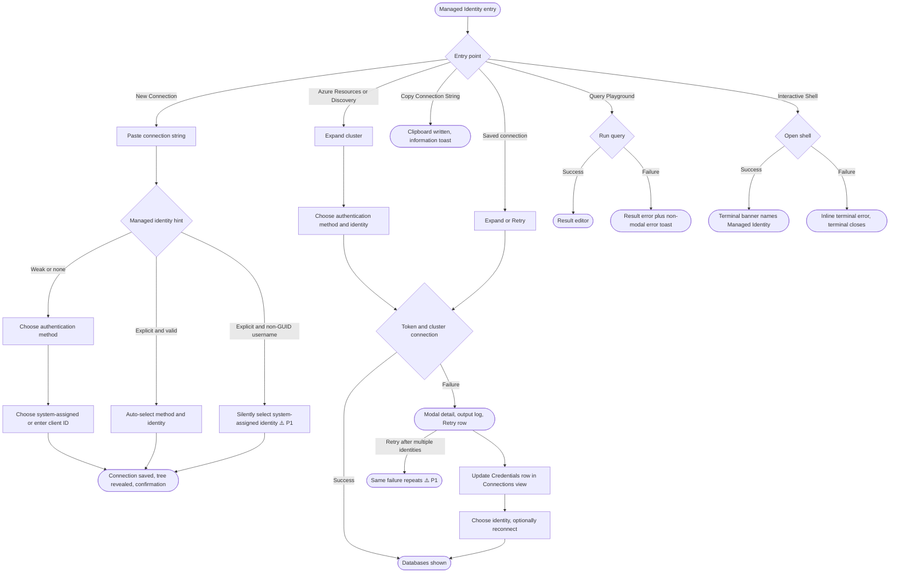
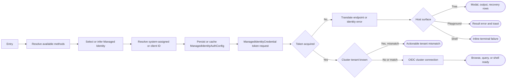

# Managed Identity Authentication: UX Review Pack

> **Who this is for:** anyone about to do a hands-on UX review of the **Managed Identity
> Authentication** feature, or anyone triaging the findings.
> **What this is:** a single catch-up document that captures runtime UX feedback, states what the
> code _actually does today_ (verified against the current branch), and, for each item, offers a
> **suggestion** and a **status**. Items are sorted by priority (P0 to P3).

- **Feature area:** `src/documentdb/auth/`, `src/documentdb/wizards/authenticate/`,
  `src/commands/newConnection/`, `src/commands/updateCredentials/`,
  `src/commands/copyConnectionString/`, Azure Resources and Discovery cluster items, Query
  Playground, and Interactive Shell
- **PR / branch:** [microsoft/vscode-documentdb#886](https://github.com/microsoft/vscode-documentdb/pull/886)
  on `dev/tnaum/managed-identities`
- **Related design docs:** [decisions](../../managed-identities/decisions.md),
  [implementation log](../../managed-identities/implementation-log.md),
  [manual validation checklist](../../managed-identities/manual-validation-checklist.md), and
  [code-review ledger](../../managed-identities/pr-886-review.md)
- **Scope:** the UX-facing surface: authentication and identity selection, pasted connection
  strings, saved-connection recovery, copy behavior, tree feedback, and runtime use from Collection
  View, Query Playground, and Interactive Shell. Backend internals appear only where they explain a
  user-visible symptom.
- **Review date:** 2026-08-14

## How this review was run

This preparation pass traced every managed-identity entry point and terminal state in the current
branch. No hands-on findings are claimed yet. The operator will exercise the feature and dictate
observations; an AI assistant will verify each observation against the code, keep this document and
the priority index current, and record the reason for every decision. Items below are pre-discovered
Flags to confirm or adjust during that runtime pass.

## Legend

### Priority

| Priority | Meaning                                            |
| -------- | -------------------------------------------------- |
| **P0**   | Blocking - the user gets stuck                     |
| **P1**   | Broken / misleading, or a consistency & safety gap |
| **P2**   | Polish, expectation, or a smaller feature gap      |
| **P3**   | Nice-to-have / cosmetic / acknowledged             |

### Status

| Status             | Meaning                                                                  |
| ------------------ | ------------------------------------------------------------------------ |
| 🟠 **Open**        | Recorded + analyzed; carries a recommendation but stays a _suggestion_   |
| 🟡 **Open (soft)** | Open, but depends on an investigation or is a soft "leave as-is"         |
| ✅ **Implemented** | Changed on this branch and verified (Decision + commit link recorded)    |
| 🚫 **Closed**      | Won't fix - with a mandatory one-line reason                             |
| 🔗 **Tracked**     | Deferred to a repo issue (linked); dropped from the active priority list |

> **Items are worked in iterations.** Anything still 🟠 Open at the end of an iteration moves to
> the next one. An item leaves this ledger only as ✅ Implemented, 🚫 Closed, or 🔗 Tracked. Each
> fix records why it was chosen and how it was verified.

### Markers (inline)

| Marker            | Meaning                                                 |
| ----------------- | ------------------------------------------------------- |
| ⚠️ **Flag**       | Confirmed gap or bug                                    |
| 💡 **Suggestion** | A design/wording recommendation to react to             |
| 🔍 **Answered**   | A "how does this work?" question answered from the code |

> **For the operator:** recommendations below are suggestions, not decisions. Disagree freely;
> where there are real trade-offs, see [Open ideas](#open-ideas-options-pros--cons).

---

## User interaction map

Where every user action starts and where it terminates. The highlighted branches are the highest
value scenarios to exercise first.

### Interaction inventory

| #   | User action (entry)                               | Where it lives                                                                                                                         | Terminal state(s)                                               | Surface                      | ⚠️         |
| --- | ------------------------------------------------- | -------------------------------------------------------------------------------------------------------------------------------------- | --------------------------------------------------------------- | ---------------------------- | ---------- |
| 1   | Add New Connection, then choose Connection String | [PromptConnectionModeStep.ts](../../../../src/commands/newConnection/PromptConnectionModeStep.ts#L20)                                  | Connection saved, revealed, and confirmed; cancel               | Wizard + tree + notification |            |
| 2   | Paste a documented `ENVIRONMENT:azure` string     | [PromptConnectionStringStep.ts](../../../../src/commands/newConnection/PromptConnectionStringStep.ts#L34)                              | Managed Identity and identity auto-selected                     | Wizard                       | Items 1, 6 |
| 3   | Choose Managed Identity manually                  | [AuthMethod.ts](../../../../src/documentdb/auth/AuthMethod.ts#L61)                                                                     | Identity quick pick opens                                       | Wizard                       | Item 4     |
| 4   | Choose system-assigned or enter a client ID       | [SelectManagedIdentityStep.ts](../../../../src/documentdb/wizards/authenticate/SelectManagedIdentityStep.ts#L43)                       | Config accepted; invalid GUID remains in input validation       | Wizard                       | Item 1     |
| 5   | Expand a vCore cluster in Azure Resources         | [VCoreResourceItem.ts](../../../../src/tree/azure-resources-view/documentdb/VCoreResourceItem.ts#L78)                                  | Databases; modal failure + Retry; cancel                        | Tree + modal + output        | Items 4, 5 |
| 6   | Expand a vCore cluster in Service Discovery       | [DocumentDBResourceItem.ts](../../../../src/plugins/service-azure-mongo-vcore/discovery-tree/documentdb/DocumentDBResourceItem.ts#L90) | Databases; modal failure + Retry; cancel                        | Tree + modal + output        | Items 4, 5 |
| 7   | Expand or Retry a saved connection                | [DocumentDBClusterItem.ts](../../../../src/tree/connections-view/DocumentDBClusterItem.ts#L105)                                        | Databases; modal failure + Retry and Update Credentials rows    | Tree + modal + output        | Item 2     |
| 8   | Update Credentials from menu or error row         | [updateCredentials.ts](../../../../src/commands/updateCredentials/updateCredentials.ts#L37)                                            | Saved confirmation; optional immediate reconnect; cancel        | Wizard + notification + tree | Item 2     |
| 9   | Save/Add a discovered cluster to Connections      | [addConnectionFromRegistry.ts](../../../../src/commands/addConnectionFromRegistry/addConnectionFromRegistry.ts#L160)                   | Saved connection preserves selected managed identity            | Wizard + tree + notification |            |
| 10  | Copy Connection String                            | [copyConnectionString.ts](../../../../src/commands/copyConnectionString/copyConnectionString.ts#L220)                                  | Driver-native string copied; information toast                  | Clipboard + notification     |            |
| 11  | Browse or query in Collection View                | [ClusterItemBase.ts](../../../../src/tree/documentdb/ClusterItemBase.ts#L204)                                                          | Collection View opens after the shared tree connection succeeds | Tree + webview               |            |
| 12  | Connect or run in Query Playground                | [executePlaygroundCode.ts](../../../../src/commands/playground/executePlaygroundCode.ts#L88)                                           | Result editor; or result error + non-modal error toast          | Progress + editor + toast    | Item 5     |
| 13  | Open Interactive Shell                            | [DocumentDBShellPty.ts](../../../../src/documentdb/shell/DocumentDBShellPty.ts#L448)                                                   | Connected banner; or inline failure and terminal close          | Terminal                     | Item 5     |

### Error and feedback surface matrix

| Flow                             | Success surface                                     | Failure surface                                                                             | Recovery                                      |
| -------------------------------- | --------------------------------------------------- | ------------------------------------------------------------------------------------------- | --------------------------------------------- |
| New / saved connection setup     | Confirmation + reveal                               | Wizard validation or command error                                                          | Back / retry wizard                           |
| Azure Resources / Discovery tree | Database children                                   | Modal `Failed to connect`, detail contains the managed identity message, output channel log | Retry reopens authentication wizard           |
| Saved Connections tree           | Database children                                   | Same modal and output log                                                                   | Retry plus `Click here to update credentials` |
| Query Playground                 | Result editor                                       | Error result plus non-modal `Query playground execution failed` notification                | Run again after updating credentials          |
| Interactive Shell                | Terminal banner: `Authentication: Managed Identity` | Inline `Failed to connect: ...`; terminal closes                                            | Update credentials or reopen shell            |
| Copy Connection String           | Information toast                                   | Error notification if credentials cannot be resolved                                        | Retry command                                 |

🔍 **Answered:** the surfaces differ by host, but none intentionally drops the translated managed
identity error. Tree expansion uses a modal because expansion is blocked; Playground keeps a durable
error result and also shows a toast; Shell reports inside the terminal it owns.

---

## The story in one paragraph

The feature adds Managed Identity as an explicit authentication method across manual connections,
Azure Resources, Service Discovery, saved connections, Collection View, Query Playground, and
Interactive Shell. The central journey is clear and the error translations are unusually actionable,
but four code-confirmed gaps deserve hands-on attention: malformed explicit selectors can silently
become system-assigned, the multiple-identity recovery message points at a Retry loop instead of
Update Credentials, duplicate detection collapses distinct identities on one host, and cluster-known
authentication availability is presented as merely "unknown" and remains selectable. Two softer
checks cover the intentionally different cross-tenant diagnostics and the no-confirmation fast path
for a valid documented connection string.

---

## Priority index

| #   | Priority | Item                                                                    | Status         |
| --- | -------- | ----------------------------------------------------------------------- | -------------- |
| 1   | **P1**   | Non-GUID explicit selector silently becomes system-assigned             | 🟠 Open        |
| 2   | **P1**   | Multiple-identity guidance points users into a Retry loop               | 🟠 Open        |
| 3   | **P1**   | Distinct user-assigned identities are rejected as duplicate connections | 🟠 Open        |
| 4   | **P1**   | Managed Identity stays selectable when cluster metadata excludes it     | 🟠 Open        |
| 5   | **P2**   | Cross-tenant diagnosis depends on the connection's origin               | 🟡 Open (soft) |
| 6   | **P2**   | Explicit pasted identity is applied without an identity review step     | 🟡 Open (soft) |

---

## P0: Blocking (the user gets stuck)

No P0 item was pre-discovered. Confirm this on a real Azure VM, especially with multiple identities.

## P1: Broken / misleading, or consistency & safety

### 1. Non-GUID explicit selector silently becomes system-assigned ⚠️

**Priority:** P1 · **Status:** 🟠 Open

**Observation to confirm:** paste an explicit `ENVIRONMENT:azure` connection string whose username
position is non-empty but not a GUID. The wizard should not silently reinterpret that value as a
request for the system-assigned identity.

**Finding:**

- ⚠️ [managedIdentityConnectionString.ts](../../../../src/documentdb/auth/managedIdentityConnectionString.ts#L30)
  returns an `explicit` hint with no `clientId` for both an absent username and a non-GUID username.
  Its own comment says a non-GUID value should leave the identity step to ask.
- ⚠️ [PromptConnectionStringStep.ts](../../../../src/commands/newConnection/PromptConnectionStringStep.ts#L57)
  converts that hint to `{}` and preselects Managed Identity.
- ⚠️ [SelectManagedIdentityStep.ts](../../../../src/documentdb/wizards/authenticate/SelectManagedIdentityStep.ts#L78)
  skips the identity step for every explicit hint. `{}` then means system-assigned, so the pasted
  selector is discarded without warning.

💡 **Suggestion:** distinguish "username absent" from "username present but invalid." Keep the
system-assigned fast path only for the first case; route the second through the client-ID input and
its existing validation.

### 2. Multiple-identity guidance points users into a Retry loop ⚠️

**Priority:** P1 · **Status:** 🟠 Open

**Observation to confirm:** save a system-assigned configuration on a VM with multiple identities,
expand the connection, read the failure message, and follow its stated recovery path.

**Finding:**

- ⚠️ [managedIdentityErrors.ts](../../../../src/documentdb/auth/managedIdentityErrors.ts#L96) says:
  "Reconnect and enter the client ID you want to use."
- ⚠️ A saved connection with `selectedAuthMethod = ManagedIdentity` does not reopen the credential
  wizard on reconnect; [DocumentDBClusterItem.ts](../../../../src/tree/connections-view/DocumentDBClusterItem.ts#L119)
  prompts only when the method is absent or Native credentials are incomplete. Clicking Retry repeats
  the same token request with `{}` and reaches the same error.
- 🔍 The user is not completely stuck: [ConnectionsBranchDataProvider.ts](../../../../src/tree/connections-view/ConnectionsBranchDataProvider.ts#L113)
  adds a separate `Click here to update credentials` row to the error state. The problem is that the
  message points to Retry/reconnect rather than to that action.

💡 **Suggestion:** name the actual recovery action in the message ("Choose Update Credentials and
enter the client ID...") or offer it directly from the modal. See [O1](#o1-how-should-multiple-identity-recovery-work-item-2).

### 3. Distinct user-assigned identities are rejected as duplicate connections ⚠️

**Priority:** P1 · **Status:** 🟠 Open

**Observation to confirm:** add the same cluster twice with two different user-assigned client IDs.
The second connection should either be allowed or the duplicate explanation should accurately state
why the product disallows it.

**Finding:**

- ⚠️ [ExecuteStep.ts](../../../../src/commands/newConnection/ExecuteStep.ts#L72) defines the duplicate
  identity as host plus _native_ username. Managed Identity has no native username, so every managed
  identity on the same host compares as `undefined` plus the same host.
- ⚠️ The second connection selects the first and raises "A connection with the same username and host
  already exists," even when the two client IDs differ. This hides a legitimate multi-identity
  workflow and gives a factually wrong explanation.

💡 **Suggestion:** include authentication method and managed-identity client ID in the connection
identity, or explicitly decide that only one saved profile per host is supported and rewrite the
message around that rule.

### 4. Managed Identity stays selectable when cluster metadata excludes it ⚠️

**Priority:** P1 · **Status:** 🟠 Open

**Observation to confirm:** use an Azure Resources or Discovery cluster whose allowed modes exclude
Entra ID, then inspect and select Managed Identity in the authentication picker.

**Finding:**

- ⚠️ [ChooseAuthMethodStep.ts](../../../../src/documentdb/wizards/authenticate/ChooseAuthMethodStep.ts#L18)
  receives the cluster's available methods but asks for an unfiltered list.
- ⚠️ [AuthMethod.ts](../../../../src/documentdb/auth/AuthMethod.ts#L126) renders every extension-known
  method and labels excluded methods `Cluster support unknown $(info)`. The row remains selectable;
  the separate filtered helper at line 164 is unused.
- 🔍 This flexibility is useful for manual connection strings and private endpoints, where support
  can genuinely be unknown. In Azure Resources and Discovery, however, the cluster's allowed modes
  are already known, so the wording and behavior are misleading.

💡 **Suggestion:** filter unavailable methods for ARM/Discovery entry points, or visually disable
them with an accurate "Not enabled on this cluster" explanation while retaining the permissive
manual-connection behavior.

## P2: Polish, expectation, or feature gap

### 5. Cross-tenant diagnosis depends on the connection's origin ⚠️

**Priority:** P2 · **Status:** 🟡 Open (soft)

**Observation to confirm:** compare the same cross-tenant failure from Azure Resources and from a
pasted connection string (manual validation cases 7a and 7b).

**Finding:**

- ⚠️ [managedIdentityTenant.ts](../../../../src/documentdb/auth/managedIdentityTenant.ts#L48) can name
  both tenants only when cluster tenant metadata is available. Azure-backed entry points persist it;
  manual connection strings do not.
- 🔍 The manual checklist documents the pasted-string path as an expected plain server authentication
  failure. This is a deliberate information-boundary difference, not currently a correctness bug.

💡 **Suggestion:** confirm that the generic pasted-string failure is still actionable enough. If it
is not, prefer a Learn More affordance or troubleshooting copy over guessing a tenant mismatch.

### 6. Explicit pasted identity is applied without an identity review step ⚠️

**Priority:** P2 · **Status:** 🟡 Open (soft)

**Observation to confirm:** paste a valid documented user-assigned connection string and note whether
skipping both the authentication-method and identity quick picks feels clear or surprising.

**Finding:**

- ⚠️ [PromptConnectionStringStep.ts](../../../../src/commands/newConnection/PromptConnectionStringStep.ts#L64)
  preselects Managed Identity for an explicit marker, and
  [SelectManagedIdentityStep.ts](../../../../src/documentdb/wizards/authenticate/SelectManagedIdentityStep.ts#L78)
  skips identity review. The terminal notification only says "New connection has been added."
- 🔍 This is intentional interoperability behavior: a connection string copied by the extension
  round-trips without extra prompts. The review question is whether speed or explicit review better
  matches user expectations for a consequential authentication choice.

💡 **Suggestion:** keep the seamless path if it reads clearly in practice. If not, add a lightweight
summary before save or make the completion message name the selected authentication method and
identity type. See [O2](#o2-should-explicit-paste-remain-a-zero-confirmation-path-item-6).

## P3: Nice-to-have / cosmetic / acknowledged

No P3 item was pre-discovered.

## Implemented

No UX-review item has been implemented yet. Existing PR fixes remain documented in the
[code-review ledger](../../managed-identities/pr-886-review.md).

---

## Iteration log

A running record of each fix pass. Items still 🟠 Open at the end of an iteration roll into the next
one; nothing is dropped without a terminal status.

### Preparation

| #   | Item                        | Decision (why) | Outcome                        |
| --- | --------------------------- | -------------- | ------------------------------ |
| 1-6 | Pre-assessment Flags seeded | -              | Open for hands-on confirmation |

---

## Open ideas: options, pros & cons

Genuinely open design questions with real trade-offs. Recommendations are suggestions to react to,
not decisions.

### O1. How should multiple-identity recovery work? (item 2)

| Option                                  | Pros                                              | Cons                                                               |
| --------------------------------------- | ------------------------------------------------- | ------------------------------------------------------------------ |
| **A. Correct the error text only**      | Small change; points at the existing recovery row | User must dismiss the modal and find the row                       |
| **B. Add an Update Credentials button** | Recovery is immediate and explicit                | Couples the shared error presentation to a saved item              |
| **C. Retry opens identity selection**   | Existing Retry label becomes truthful             | Changes Retry semantics and may add prompts for transient failures |

> 💡 **Suggested:** B when the failing item is a saved connection, with A as the minimum fix.

### O2. Should explicit paste remain a zero-confirmation path? (item 6)

| Option                                    | Pros                                             | Cons                                                 |
| ----------------------------------------- | ------------------------------------------------ | ---------------------------------------------------- |
| **A. Keep the current fast path**         | Exact copy/paste round-trip; least friction      | Authentication choice is not reviewed before storage |
| **B. Show a compact summary before save** | Makes identity and auth method explicit          | Adds a step to a deliberately interoperable workflow |
| **C. Enrich the success confirmation**    | Preserves speed while making the outcome visible | Feedback arrives only after the connection is stored |

> 💡 **Suggested:** start with A during hands-on review; choose C only if reviewers consistently
> cannot tell which identity was saved.

---

## Appendix A: current flow (reference)

### Phase reference

| Phase              | What the code does today                                                      | Hands-on focus                                                            |
| ------------------ | ----------------------------------------------------------------------------- | ------------------------------------------------------------------------- |
| Availability       | Manual strings infer likely methods; Azure-backed paths receive allowed modes | Is "Cluster support unknown" truthful and selectable in the right places? |
| Identity selection | System-assigned first, optional pasted client ID, then manual GUID entry      | Can users distinguish machine identity from user-assigned identity?       |
| Persistence        | `{}` means system-assigned; `{ clientId }` means user-assigned                | Do reload, folder move, and Update Credentials preserve the choice?       |
| Token acquisition  | One main-thread credential cache serves tree, Playground, and Shell           | Do long waits show enough progress and does token refresh stay invisible? |
| Failure            | Raw identity failures are translated before reaching each host surface        | Are the message and recovery action adjacent and consistent?              |
| Success            | Tree shows databases, Playground shows results, Shell names Managed Identity  | Is the selected auth method legible without adding noise?                 |

### Recommended hands-on order

1. **Malformed explicit selector:** item 1.
2. **Multiple identities on a saved connection:** item 2 and manual checklist cases 3-4.
3. **Two client IDs on one host:** item 3.
4. **Known-disabled authentication:** item 4.
5. **Cross-tenant pair:** item 5 and checklist cases 7a-7b.
6. **Happy paths:** checklist cases 8-25, including copy round-trip, Collection View, Playground,
   Shell banner, reload, folder move, and token refresh.
