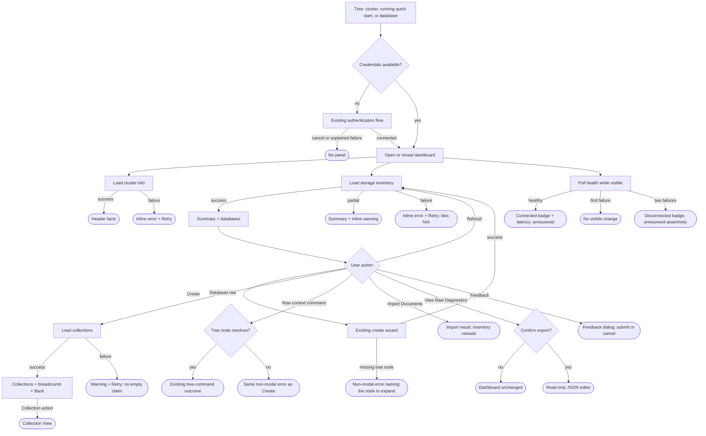

# Cluster Dashboard - UX Review Pack

> **Who this is for:** anyone about to do a hands-on UX review of the **Cluster Dashboard**
> feature, or anyone triaging the findings.
> **What this is:** a pre-assessment of the current branch, with its user journeys mapped and
> code-confirmed inconsistencies seeded for live verification. It is not yet a record of a completed
> hands-on review.

- **Feature area:** `src/commands/openClusterDashboard/`,
  `src/documentdb/utils/getClusterHealth.ts`, and
  `src/webviews/documentdb/clusterDashboard/`
- **PR / branch:** [microsoft/vscode-documentdb#823](https://github.com/microsoft/vscode-documentdb/pull/823)
  - `feature/cluster-dashboard-poc`
- **Related design docs:** [feature overview](../README.md), [decisions](../decisions.md), and
  [design](../design.md)
- **Scope:** the UX-facing surface: tree entry points, loading and degraded states, inventory
  navigation, row actions, diagnostics, feedback, error recovery, accessibility, and narrow layouts.
  Backend internals appear only where they explain a user-visible outcome.
- **Review date:** 2026-09-09

## How this review was run

**Prepare (Iteration 1).** An AI assistant traced the branch's user-facing code paths, compared
sibling flows, and pre-seeded source-confirmed Flags. The operator then decided the direction for
items 3 and 7.

**Fix (Iteration 2).** Items 1-6 were implemented one commit each, with the decision and any
deviation recorded inline under the item.

**Still outstanding: the live pass.** Nothing here has been exercised against a running cluster. A
person still needs to work the hands-on sequence in Appendix A — especially the four forced failure
paths and a screen-reader run — and revise any finding the runtime contradicts.

## Legend

### Priority

| Priority | Meaning                                            |
| -------- | -------------------------------------------------- |
| **P0**   | Blocking - the user gets stuck                     |
| **P1**   | Broken / misleading, or a consistency & safety gap |
| **P2**   | Polish, expectation, or a smaller feature gap      |
| **P3**   | Nice-to-have / cosmetic / acknowledged             |

### Status

| Status             | Meaning                                                                  |
| ------------------ | ------------------------------------------------------------------------ |
| 🟠 **Open**        | Recorded + analyzed; carries a recommendation but stays a _suggestion_   |
| 🟡 **Open (soft)** | Open, but depends on an investigation or is a soft "leave as-is"         |
| ✅ **Implemented** | Changed on this branch and verified (Decision + commit link recorded)    |
| 🚫 **Closed**      | Won't fix - with a mandatory one-line reason                             |
| 🔗 **Tracked**     | Deferred to a repo issue (linked); dropped from the active priority list |

> **Items are worked in iterations.** Anything still 🟠 Open at the end of an iteration moves to
> the next one. An item leaves this ledger only as ✅ Implemented, 🚫 Closed, or 🔗 Tracked. Each fix
> records why it was chosen and links the implementing commit.

### Markers (inline)

| Marker            | Meaning                                                 |
| ----------------- | ------------------------------------------------------- |
| ⚠️ **Flag**       | Confirmed gap or bug                                    |
| 💡 **Suggestion** | A design/wording recommendation to react to             |
| 🔍 **Answered**   | A "how does this work?" question answered from the code |

> **For the operator:** items below are Open by default. Each recommendation is a suggestion, not a
> final decision. Confirm or reject it during the hands-on pass.

---

## User interaction map _(seeded; terminations updated after Iteration 2)_

Where every user action starts and where it terminates. Divergent failure terminations are called
out explicitly and should be re-checked live.

**ASCII flow**

```text
Connections / Discovery / Azure tree
  |-- cluster or running Local Quick Start: inline button or context menu
  `-- database: inline button or context menu (opens already drilled in)
       |
       `-- authenticate if needed
            |-- cancel / connect already explained failure -> no panel
            `-- connected -> open or reveal dashboard panel
                 |
                 |-- cluster info
                 |    |-- success -> identity, version and address
                 |    `-- failure -> inline error MessageBar + Retry; progress ends
                 |-- storage inventory
                 |    |-- success -> summary tiles + database table
                 |    |-- partial -> warning/info MessageBar + lower bounds
                 |    `-- failure -> inline error MessageBar + Retry; tiles read N/A
                 `-- health sample every 5 s while visible
                      |-- success -> Connected + latency (announced politely)
                      |-- one failure -> no visible change
                      `-- two failures -> Disconnected badge (announced assertively)

Dashboard actions
  |-- Refresh -> reload visible inventory -> refreshed table | non-modal error
  |-- Open Shell -> terminal | non-modal error
  |-- View Raw Diagnostics -> modal warning
  |    |-- Cancel -> unchanged dashboard
  |    `-- Export -> read-only JSON editor | non-modal error
  |-- Feedback thumbs -> modal feedback dialog -> submit | cancel
  |-- Create Database / Collection -> existing wizard
  |    |-- success -> pending row -> refreshed inventory
  |    `-- missing tree node / failure -> non-modal error naming the node to expand
  |-- Filter -> matching rows + live "Showing N of M"
  |-- Sort header -> reordered rows
  |-- Database row / Show Collections -> collection request
  |    |-- success -> collection table + breadcrumb + Back button
  |    `-- failure -> warning + Retry; no empty claim
  |-- Collection primary action -> Collection View | non-modal error
  `-- More actions / native row context menu
       |-- direct: View Collections, Open Collection, Manage Indexes
       |-- delegated: Copy Reference, Open Shell, New Query Playground,
       |              Delete, Copy/Paste Collection, Export/Import Documents
       |-- target found -> existing tree command terminal state
       `-- target absent -> non-modal error naming the node to expand
```

**Mermaid**



**Interaction inventory**

| #   | User action (entry)                   | Where it lives                                   | Terminal state(s)                                                            | Surface                   | ⚠️  |
| --- | ------------------------------------- | ------------------------------------------------ | ---------------------------------------------------------------------------- | ------------------------- | --- |
| 1   | Open from a cluster/account node      | Tree inline action or context menu               | Existing panel revealed, new panel opened, or authentication outcome         | Tree -> editor            |     |
| 2   | Open from a running Local Quick Start | Tree inline action or context menu               | Dashboard opens for the managed cluster                                      | Tree -> editor            |     |
| 3   | Open from a database node             | Tree inline action or context menu               | Dashboard opens directly at that database's collections                      | Tree -> editor            |     |
| 4   | Wait for initial cluster information  | Panel open                                       | Header facts, or an inline error MessageBar with Retry                       | Webview                   |     |
| 5   | Wait for initial storage inventory    | Panel open                                       | Summary/table, partial-data notices, or an inline error with Retry           | Webview                   |     |
| 6   | Observe health polling                | Visible panel, every 5 seconds                   | Connected/Disconnected badge, announced; polling pauses while hidden         | Webview badge             |     |
| 7   | Refresh                               | Primary action bar                               | Current storage level reloaded; toast on thrown failure                      | Webview + toast           |     |
| 8   | Open Shell                            | Primary action bar                               | Interactive shell terminal; toast on thrown failure                          | Editor terminal + toast   |     |
| 9   | View Raw Diagnostics                  | Primary action bar                               | Confirmation; cancel returns; confirm opens read-only JSON; toast on failure | Modal + editor + toast    |     |
| 10  | Give feedback                         | Action bar, telemetry level `all` only           | Feedback dialog submitted or dismissed                                       | Webview dialog            |     |
| 11  | Create Database / Collection          | Inventory level toolbar                          | Existing wizard; pending row; inventory refresh; toast on failure            | Wizard + webview          |     |
| 12  | Filter names                          | Search box                                       | Filtered rows and live "Showing N of M" count                                | Webview                   |     |
| 13  | Sort a column                         | Sortable table header                            | Rows reordered; unknown values remain last                                   | Webview                   |     |
| 14  | Activate a database                   | Row click or Show Collections button             | Collections load, breadcrumb/back controls, or a warning with Retry          | Webview                   |     |
| 15  | Activate a collection                 | Open Collection button                           | Collection View opens; toast on failure                                      | Editor + toast            |     |
| 16  | Navigate back                         | Databases breadcrumb or Back to Databases button | Database list restored and filter cleared                                    | Webview                   |     |
| 17  | Open a row's More actions             | Icon button or native context menu               | Database or collection command menu                                          | Native menu               |     |
| 18  | View Collections                      | Database row menu                                | Same drill-in as row activation                                              | Webview                   |     |
| 19  | Open Collection / Manage Indexes      | Collection row menu                              | Collection View opens at Results or Indexes                                  | Editor                    |     |
| 20  | Copy Reference                        | Database/collection row menu                     | Existing tree command; clipboard updated                                     | Native command            |     |
| 21  | Open Shell / New Query Playground     | Database/collection row menu                     | Terminal or query editor opens                                               | Editor                    |     |
| 22  | Delete Database / Collection          | Row menu                                         | Existing confirmation; busy row; inventory refresh or cancel                 | Modal + webview           |     |
| 23  | Copy / Paste Collection               | Database/collection row menu                     | Copy acknowledgement or paste wizard; refresh after paste                    | Toast/wizard + webview    |     |
| 24  | Export / Import Documents             | Collection row menu                              | Existing file/progress flow; import refreshes the dashboard on completion    | Dialog/progress + webview |     |

---

## The story in one paragraph

The Cluster Dashboard opens from a cluster, database, or running local instance and presents a
point-in-time storage inventory with lightweight connection health. The main path is coherent:
authenticate, load the cluster and storage facts, drill from databases into collections, then hand
off to established commands for deeper work. The pre-assessment found no P0 blocker, but it did find
five P1 failure/state gaps: initial requests could leave permanent loading UI, a failed collection
read also claimed the database was empty, tree-dependent actions disagreed on how to report the same
missing node, dynamic status changes were not announced to assistive technology, and imports left
the inventory stale. All five are fixed in Iteration 2, along with the P2 command-parity gap; the
narrow action-bar concern was reviewed and explicitly closed. What remains is not a finding but a
limit: row commands still depend on a materialized tree node, which is repository-wide work tracked
in [#915](https://github.com/microsoft/vscode-documentdb/issues/915).

---

## Priority index

| #   | Priority | Item                                                              | Status         |
| --- | -------- | ----------------------------------------------------------------- | -------------- |
| 1   | **P1**   | Initial request failures leave loading UI in a non-terminal state | ✅ Implemented |
| 2   | **P1**   | Failed collection reads also claim the database is empty          | ✅ Implemented |
| 3   | **P1**   | Tree-dependent actions expose inconsistent failure and recovery   | ✅ Implemented |
| 4   | **P1**   | Dynamic status and busy changes are not announced                 | ✅ Implemented |
| 5   | **P1**   | Import Documents leaves dashboard inventory stale                 | ✅ Implemented |
| 6   | **P2**   | Paste Collection is absent from database rows                     | ✅ Implemented |
| 7   | **P2**   | Narrow action bar has no overflow behavior                        | 🚫 Closed      |

---

## P0 - Blocking (the user gets stuck)

No source-confirmed P0 item was found during preparation, and none emerged while fixing items 1-6.
The live pass should still test first-load failures before keeping this section empty.

## P1 - Broken / misleading, or consistency & safety

### 1. Initial request failures leave loading UI in a non-terminal state ⚠️

**Priority:** P1 · **Status:** ✅ Implemented

**Observation:** Code-derived Flag to confirm live: reject the initial cluster-information request,
then separately reject the initial storage request.

**Finding:**

- ⚠️ Both resources use `null` for "not loaded" and initialize that way
  ([ClusterDashboard.tsx](../../../../../src/webviews/documentdb/clusterDashboard/ClusterDashboard.tsx#L39-L44)).
  Their catch paths show non-modal errors but do not write a terminal error state
  ([ClusterDashboard.tsx](../../../../../src/webviews/documentdb/clusterDashboard/ClusterDashboard.tsx#L104-L140)).
- ⚠️ A cluster-information failure therefore keeps the top progress bar active because `isBusy`
  remains true while `clusterInfo === null`
  ([ClusterDashboard.tsx](../../../../../src/webviews/documentdb/clusterDashboard/ClusterDashboard.tsx#L389-L394)).
- ⚠️ A storage failure keeps passing `isLoading` while `storageStats === null`, so the inventory
  stays a skeleton after the error toast
  ([ClusterDashboard.tsx](../../../../../src/webviews/documentdb/clusterDashboard/ClusterDashboard.tsx#L476-L488),
  [InventoryPanel.tsx](../../../../../src/webviews/documentdb/clusterDashboard/components/InventoryPanel.tsx#L167-L168)).
- 🔍 Storage has a manual retry through Refresh; cluster information has no in-panel retry.

💡 **Suggestion:** Model loading, loaded, and failed as separate states. End progress on failure and
keep the cause in a persistent inline MessageBar with Retry; retain the toast only as immediate
feedback for a user-initiated refresh.

> **Decision (Iteration 2):** Implemented as suggested.
>
> **What changed**
>
> - `ClusterDashboard` now holds `clusterInfoError` and `storageError` beside the two `null`
>   payloads, so "not loaded" and "gave up" are distinguishable. The one-time cluster-information
>   fetch moved out of the effect into a `loadClusterInfo` callback so Retry can re-run it.
> - `isBusy` no longer keys off `clusterInfo === null` alone; a failed header read ends the top
>   ProgressBar instead of animating forever.
> - `InventoryPanel` takes `storageError` and treats "null stats **and** no error" as loading, so a
>   failed inventory read replaces the skeleton with a terminal state.
> - `StatusStrip` gained `isUnavailable`, which collapses its loading skeleton onto the existing
>   "N/A" placeholder. The three-state `undefined | null | value` tile contract is preserved.
> - Both failures render a persistent `MessageBar intent="error"` with a Retry `containerAction`,
>   placed at the top of `dashboardContent` above the metric tiles.
> - The storage toast is now raised only for `source === 'manual'`. A background or
>   post-mutation reload reports through the inline bar alone.
>
> **Deviations from the suggestion** (recorded per the operator's instruction):
>
> 1. **Both error bars sit at dashboard level, not inside `InventoryPanel`.** A storage failure
>    invalidates the metric tiles _and_ the table, and the tiles are rendered above the panel.
>    _Alternative considered:_ passing an error into `InventoryPanel` and rendering it beside the
>    existing partial-data bars — rejected because the message would then appear below the very
>    tiles it explains.
> 2. **Retry re-reads as `'manual'`,** so it shows the skeleton and, on a second failure, also
>    raises a toast. _Alternative considered:_ a silent `'background'` retry — rejected because the
>    inline bar text does not change between two identical failures, leaving the click with no
>    acknowledgement.
> 3. **The database-level empty state now also covers `storageError`,** reading "Database
>    statistics are unavailable for this cluster." rather than "No user databases were reported".
>    Necessary: with the skeleton gone, the zero-row branch would otherwise assert an empty cluster
>    on a failed read — the same class of bug as item 2.

### 2. Failed collection reads also claim the database is empty ⚠️

**Priority:** P1 · **Status:** ✅ Implemented

**Observation:** Code-derived Flag to confirm live: make `getDatabaseCollections` fail while entering
a database with collections.

**Finding:**

- ⚠️ On rejection, the hook stores an error and a `null` result, then considers that request current
  and no longer table-loading
  ([useDatabaseCollections.ts](../../../../../src/webviews/documentdb/clusterDashboard/components/useDatabaseCollections.ts#L60-L98)).
- ⚠️ The panel renders the accurate warning, "Could not list the collections," but the same state
  then reaches the zero-row branch and renders `"{database}" holds no collections.`
  ([InventoryPanel.tsx](../../../../../src/webviews/documentdb/clusterDashboard/components/InventoryPanel.tsx#L332-L340),
  [InventoryPanel.tsx](../../../../../src/webviews/documentdb/clusterDashboard/components/InventoryPanel.tsx#L373-L381)).

💡 **Suggestion:** Give collection loading an explicit error terminal state. Suppress the empty-data
claim when `collections.error` is present and put a Retry action in the warning.

> **Decision (Iteration 2):** Implemented as suggested.
>
> **What changed**
>
> - The zero-row branch in `InventoryPanel` now checks `collections.error` first and reads
>   `The collections of "{database}" could not be listed.` A failed read knows nothing about the
>   contents, so it must not be reported as knowledge that there are none.
> - The existing warning MessageBar gained a Retry `containerAction` wired to
>   `collections.reload('manual')`, disabled while a read is in flight.
>
> **Deviation:** none from the suggestion's intent, but `useDatabaseCollections` was left
> unchanged. _Alternative considered:_ adding a discriminated `status: 'loading' | 'loaded' |
'failed'` to the hook. Rejected for this PR — the hook already derives `error` from the current
> request key and clears it on reload, so the terminal state exists; only the renderer was reading
> it as "loaded and empty". Adding a parallel status field would have duplicated that derivation
> without changing any behavior.

### 3. Tree-dependent actions expose inconsistent failure and recovery ⚠️

**Priority:** P1 · **Status:** ✅ Implemented (locally; architecture tracked in #915)

**Observation:** Code-derived Flag to confirm live: open the dashboard from an unexpanded or stale
tree branch, then compare Create with a row context-menu action.

**Finding:**

- ⚠️ Inventory rows come directly from the server, but most row actions require a corresponding
  database or collection node to be materialized in the tree
  ([resolveNamespaceNode.ts](../../../../../src/webviews/documentdb/clusterDashboard/resolveNamespaceNode.ts#L44-L80)).
  The dashboard can therefore prove that a namespace exists, render it, and offer commands for it,
  while the command layer still cannot act on it.
- ⚠️ Menu availability does not reflect that hidden precondition. Every server-backed database or
  collection row gets the same `data-vscode-context`, and `package.json` contributes actions from
  the namespace level alone. The user sees an enabled action whose target lookup has not happened
  yet; only after choosing it do they learn that the tree was not ready
  ([NamespaceTable.tsx](../../../../../src/webviews/documentdb/clusterDashboard/components/NamespaceTable.tsx#L309-L328),
  [package.json](../../../../../package.json#L887-L962)).
- ⚠️ This is a provider-tree-cache lifetime dependency, not merely an expansion inconvenience. Discovery's
  collection lookup first requires a cached cluster node and explicitly returns `undefined` when
  the cache cannot supply its current tree path
  ([DiscoveryBranchDataProvider.ts](../../../../../src/tree/discovery-view/DiscoveryBranchDataProvider.ts#L301-L328)).
  A full tree refresh, provider layout switch, cache eviction, or a dashboard opened before that
  hierarchy was expanded can all leave the stable namespace valid while invalidating the command's
  presentation object.
- ⚠️ Database lookup is less complete still: providers expose `findClusterNodeByClusterId` and
  `findCollectionByClusterId`, but no `findDatabaseByClusterId`. The dashboard must recover a cluster
  tree node, synthesize `<cluster tree id>/<database name>`, and ask the provider to materialize that
  path
  ([ExtendedTreeDataProvider.ts](../../../../../src/tree/ExtendedTreeDataProvider.ts#L60-L96),
  [resolveNamespaceNode.ts](../../../../../src/webviews/documentdb/clusterDashboard/resolveNamespaceNode.ts#L76-L85)).
- ⚠️ Replacing the lookup alone would not remove the coupling. Existing commands use concrete
  `DatabaseItem` / `CollectionItem` classes and tree IDs for runtime validation, temporary tree-row
  descriptions, and task annotations. Import rejects a target that is not a `CollectionItem`, while
  Paste branches on `instanceof` and derives parent paths from item IDs
  ([importDocuments.ts](../../../../../src/commands/importDocuments/importDocuments.ts#L22-L86),
  [pasteCollection.ts](../../../../../src/commands/pasteCollection/pasteCollection.ts#L49-L87),
  [ExecuteStep.ts](../../../../../src/commands/pasteCollection/ExecuteStep.ts#L71-L122)).
- ⚠️ The same missing-node precondition terminates differently. Create Database/Create Collection
  throws through tRPC and is displayed as a non-modal toast
  ([clusterDashboardRouter.ts](../../../../../src/webviews/documentdb/clusterDashboard/clusterDashboardRouter.ts#L184-L223),
  [ClusterDashboard.tsx](../../../../../src/webviews/documentdb/clusterDashboard/ClusterDashboard.tsx#L348-L371));
  delegated row commands show a modal error
  ([clusterDashboardController.ts](../../../../../src/webviews/documentdb/clusterDashboard/clusterDashboardController.ts#L232-L245)).
- 🔍 Open Collection and Manage Indexes avoid this dependency by calling Collection View directly.
- 🔍 The failure is broader than this dashboard. Collection View import/export has the same
  dependency after Discovery cache invalidation ([#868](https://github.com/microsoft/vscode-documentdb/issues/868));
  the repository-wide command-contract work is tracked in
  [#915](https://github.com/microsoft/vscode-documentdb/issues/915).

💡 **Suggestion:** For this PR, keep the dependency but make every missing-node failure consistent
and actionable: explain that the command needs the namespace loaded in the tree, name the exact
cluster/database path to expand, and use one error surface. Keep stable-context command inputs out of
this PR and address them across commands in #915.

> **Decision (Iteration 1, Option C):** Retain the tree dependency in this PR and improve
> the error. **Reason:** removing the dependency correctly is shared command architecture, not a
> Cluster Dashboard-only change; [#915](https://github.com/microsoft/vscode-documentdb/issues/915)
> tracks that repository-wide work.

> **Decision (Iteration 2):** Option C carried out.
>
> **What changed**
>
> - New `describeMissingNamespace(clusterDisplayName, databaseName?, collectionName?)` in
>   [resolveNamespaceNode.ts](../../../../../src/webviews/documentdb/clusterDashboard/resolveNamespaceNode.ts)
>   is now the single source of this explanation. It names what is missing _and_ what to expand:
>   a collection failure says to expand the cluster and then the database, a database failure says
>   to expand the cluster, and an unresolvable cluster says to check that the connection is still
>   listed. The old text named only the leaf and said "Expand this cluster", which does not tell a
>   user drilled into a database which node to open.
> - Both call sites use it: the row context-menu path in `clusterDashboardController` and the
>   `createDatabase` / `createCollection` procedures in `clusterDashboardRouter`.
> - **One surface:** the row-command error is no longer `{ modal: true }`. Every missing-node
>   failure is now a non-modal error notification, which VS Code keeps on screen until dismissed.
>
> **Deviation — which surface won.** The suggestion said "use one error surface" without picking
> one. Non-modal was chosen. _Alternatives considered:_ (a) promote the create failures to modal
> too — rejected because it would make the panel's _only_ recoverable, self-explanatory failure the
> one that blocks the window, and the dashboard's other nine failure paths are all non-modal;
> (b) route the create failures through the host so they bypass the webview's
> `Failed to create the database.` prefix — rejected as disproportionate: the prefix names the
> action that failed and the shared sentence follows it in the same notification.
>
> **Still open by design:** the underlying coupling. Row actions continue to require a
> materialized tree node. That is tracked repository-wide in
> [#915](https://github.com/microsoft/vscode-documentdb/issues/915), with the Collection View
> instance of the same fault in
> [#868](https://github.com/microsoft/vscode-documentdb/issues/868).

### 4. Dynamic status and busy changes are not announced ⚠️

**Priority:** P1 · **Status:** ✅ Implemented

**Observation:** Code-derived accessibility Flag to confirm with a screen reader: leave the dashboard
focused while health changes and while a create or delete runs.

**Finding:**

- ⚠️ The connection state changes from Connecting to Connected or Disconnected after polling
  ([ClusterDashboard.tsx](../../../../../src/webviews/documentdb/clusterDashboard/ClusterDashboard.tsx#L379-L386)),
  but the changing Badge is only named with `aria-label`
  ([DashboardHeader.tsx](../../../../../src/webviews/documentdb/clusterDashboard/components/DashboardHeader.tsx#L197-L199)).
  It is not a live region.
- ⚠️ The top ProgressBar is explicitly hidden from assistive technology, and row-local busy state is
  represented by a labelled Spinner without a live announcement
  ([ClusterDashboard.tsx](../../../../../src/webviews/documentdb/clusterDashboard/ClusterDashboard.tsx#L389-L394),
  [NamespaceTable.tsx](../../../../../src/webviews/documentdb/clusterDashboard/components/NamespaceTable.tsx#L235-L243)).
- 🔍 The filter result count is the only live region in this feature
  ([InventoryPanel.tsx](../../../../../src/webviews/documentdb/clusterDashboard/components/InventoryPanel.tsx#L418-L430)).

💡 **Suggestion:** Use the shared `Announcer` for connection transitions, explicit refresh
completion/failure, and user-initiated create/delete progress. Keep the visual ProgressBar decorative
to avoid duplicate announcements.

### 5. Import Documents leaves dashboard inventory stale ⚠️

**Priority:** P1 · **Status:** ✅ Implemented

**Observation:** Code-derived Flag to confirm live: import documents from a collection row and watch
the Documents and Storage figures when the import completes.

**Finding:**

- ⚠️ Import Documents mutates the collection, but its row action does not set
  `invalidatesInventory`. Create, delete, and Paste Collection do, so they post
  `inventoryChanged` and reload the dashboard after completion
  ([clusterDashboardController.ts](../../../../../src/webviews/documentdb/clusterDashboard/clusterDashboardController.ts#L112-L142),
  [clusterDashboardController.ts](../../../../../src/webviews/documentdb/clusterDashboard/clusterDashboardController.ts#L248-L259)).
- ⚠️ The import flow reports its own completion, but the dashboard continues to show the old
  document count and storage until the user notices and clicks Refresh.

💡 **Suggestion:** Mark Import Documents as inventory-invalidating so completion re-reads cluster
storage and the visible database, matching Create, Delete, and Paste Collection.

> **Decision (Iteration 2):** Implemented as suggested — a one-flag change.
>
> **What changed**
>
> - `ROW_ACTIONS['…importDocuments']` gained `invalidatesInventory: true`.
>   `importDocuments` awaits the whole transfer before returning, so the `inventoryChanged`
>   message is posted once the new documents are actually there.
> - Two regression tests were added: import posts `inventoryChanged`, and export still posts
>   nothing. The negative test is the one that keeps the flag from being copy-pasted onto a
>   read-only command later.
>
> **Deviation:** `reportsBusy` was **not** added. _Alternative considered:_ marking the row busy
> for the duration of the import. Rejected — `reportsBusy` hard-codes `operation: 'delete'`, which
> drives the row's spinner label and the delete-specific settling path, so reusing it would have
> announced an import as a deletion. Import already reports itself through a cancellable progress
> notification and a temporary tree-row description.

## P2 - Polish, expectation, or feature gap

### 6. Paste Collection is absent from database rows ⚠️

**Priority:** P2 · **Status:** ✅ Implemented

**Observation:** Code-derived Flag to confirm live: copy a collection, then open More actions on a
database row in the dashboard.

**Finding:**

- ⚠️ The standard tree offers Paste Collection on both database and collection nodes
  ([package.json](../../../../../package.json#L1279-L1290),
  [package.json](../../../../../package.json#L1423-L1435)). The dashboard contributes it only when
  `clusterDashboardNamespace == collection`
  ([package.json](../../../../../package.json#L939-L950)).
- 🔍 The dashboard controller already supports a database-row payload, and its test exercises that
  path
  ([clusterDashboardController.test.ts](../../../../../src/webviews/documentdb/clusterDashboard/clusterDashboardController.test.ts#L196-L220)).

💡 **Suggestion:** Contribute the existing dashboard Paste Collection command to database rows too,
preserving the standard command's choice between a new target collection and an existing one.

> **Decision (Iteration 2):** Implemented as suggested — a manifest-only change.
>
> **What changed**
>
> - `package.json` contributes
>   `vscode-documentdb.command.clusterDashboard.context.pasteCollection` for
>   `clusterDashboardNamespace == database` as well, in a new `4_transfer` group that sits
>   between the database row's open actions and its delete action — the same relative position
>   the collection menu gives its `3_transfer` block.
> - No TypeScript was needed. Database rows already emit
>   `clusterDashboardNamespace: 'database'`, `ROW_ACTIONS` already maps the command with
>   `invalidatesInventory`, `runRowAction` already resolves a database node when
>   `clusterDashboardCollection` is absent, and the existing controller test covers exactly that
>   payload. The command reaches the standard `pasteCollection`, so the new-vs-existing target
>   choice is inherited unchanged.
>
> **Deviation:** none.

### 7. Narrow action bar has no overflow behavior

**Priority:** P2 · **Status:** 🚫 Closed

**Observation:** Code-derived layout risk to confirm live by narrowing the editor group: verify that
Refresh, Open Shell, View Raw Diagnostics, and both feedback buttons remain reachable.

**Finding:**

- ⚠️ The action bar is forced to one line, has no Fluent `Overflow` wrapper or responsive fallback,
  and the dashboard hides horizontal overflow
  ([clusterDashboard.scss](../../../../../src/webviews/documentdb/clusterDashboard/clusterDashboard.scss#L47-L54),
  [clusterDashboard.scss](../../../../../src/webviews/documentdb/clusterDashboard/clusterDashboard.scss#L223-L255),
  [ClusterDashboard.tsx](../../../../../src/webviews/documentdb/clusterDashboard/ClusterDashboard.tsx#L411-L466)).
- 🔍 Header-specific breakpoints exist, but none changes the action bar.

🚫 **Closed (Iteration 1):** Ignore this concern for this review. **Reason:** the operator explicitly
chose not to pursue the narrow action-bar risk in this PR.

## P3 - Nice-to-have / cosmetic / acknowledged

No source-confirmed P3 item was seeded. Search result counts, partial-value explanations, stable
column widths, accessible row buttons, and actionable empty states are already implemented.

## Implemented

Every item on the ledger now carries a terminal status. Items 1-6 were fixed in Iteration 2, one
commit each; item 7 was closed in Iteration 1.

| #   | Item                                               | Commit                                                                       |
| --- | -------------------------------------------------- | ---------------------------------------------------------------------------- |
| 1   | Terminal, retryable state for failed initial reads | [`ae3de741`](https://github.com/microsoft/vscode-documentdb/commit/ae3de741) |
| 2   | No empty claim after a failed collection read      | [`da2c8270`](https://github.com/microsoft/vscode-documentdb/commit/da2c8270) |
| 3   | One explanation and one surface for missing nodes  | [`36d22df6`](https://github.com/microsoft/vscode-documentdb/commit/36d22df6) |
| 4   | Connection, refresh and row-work announcements     | [`ff6c8eeb`](https://github.com/microsoft/vscode-documentdb/commit/ff6c8eeb) |
| 5   | Inventory refresh after Import Documents           | [`2b7e7866`](https://github.com/microsoft/vscode-documentdb/commit/2b7e7866) |
| 6   | Paste Collection on database rows                  | [`7c324a5a`](https://github.com/microsoft/vscode-documentdb/commit/7c324a5a) |

---

## Iteration log

A running record of each fix pass. Items still 🟠 Open at the end of an iteration roll into the next
one; nothing is dropped without a terminal status.

### Iteration 1 - hands-on review in progress

| #         | Item                           | Decision (why)                                                                | Outcome                                    |
| --------- | ------------------------------ | ----------------------------------------------------------------------------- | ------------------------------------------ |
| 3         | Tree-dependent actions         | Keep and improve the error locally; decoupling belongs across shared commands | 🟠 Open locally; architecture tracked #915 |
| 7         | Narrow action bar              | Ignore for this review                                                        | 🚫 Closed                                  |
| 1, 2, 4-6 | Remaining pre-assessment Flags | -                                                                             | Open for runtime confirmation              |

### Iteration 2 - fixing the open ledger

One commit per item, each recording its own decision and any deviation inline above.

| #   | Item                                  | Decision (why)                                                                      | Outcome        |
| --- | ------------------------------------- | ----------------------------------------------------------------------------------- | -------------- |
| 1   | Non-terminal loading UI               | Explicit loading/loaded/failed states with persistent, retryable inline MessageBars | ✅ Implemented |
| 2   | Empty claim on failed collection read | Error branch precedes the zero-row branch; Retry added to the warning bar           | ✅ Implemented |
| 3   | Inconsistent missing-node failures    | One shared explanation naming the node to expand; one non-modal surface             | ✅ Implemented |
| 4   | Unannounced status and busy changes   | Declarative Announcers for connection state; one imperative channel for the rest    | ✅ Implemented |
| 5   | Stale inventory after import          | `invalidatesInventory` on the import row action, with a negative test for export    | ✅ Implemented |
| 6   | Paste Collection missing on databases | Manifest-only: contribute the existing command at the database level too            | ✅ Implemented |

**Follow-up applied to items 1 and 2.** The three new Retry buttons were first written with
`MessageBarActions containerAction`, which is Fluent's dismiss slot. They now use the repository's
established shape — action `Button`s as children with `layout="multiline"`, matching
[AtlasCredentialsView](../../../../../src/webviews/documentdb/atlasCredentials/AtlasCredentialsView.tsx)
and the [fluentui skill](../../../../../.github/skills/fluentui/SKILL.md) — so the action reflows
below the body instead of being squeezed beside a long error cause.

**Left standing on purpose.** The tree-materialization coupling under item 3 is unchanged: row
commands still need a tree node. Only its reporting was fixed here. The decoupling is
[#915](https://github.com/microsoft/vscode-documentdb/issues/915), with the Collection View
instance of the same fault in [#868](https://github.com/microsoft/vscode-documentdb/issues/868).

**Still needs a person.** Every item above was fixed from the source; none has been exercised
against a live cluster. The hands-on sequence in Appendix A is the check that remains, in
particular: forcing each of the four failure paths and confirming the new MessageBars and their
Retry buttons, and a screen-reader pass over the new announcements to confirm neither the
connection Announcers nor the reconcile line is chattier than intended.

---

## Open ideas - options, pros & cons

No unresolved design question remains from preparation. The failure-surface gaps are concrete
findings in items 1-3, and the tree-materialization choice is decided inline under item 3. Its
repository-wide follow-up is [#915](https://github.com/microsoft/vscode-documentdb/issues/915).

---

## Appendix A - current flow (reference)

### Error and feedback surfaces

| Event                                          | Current terminal surface                       | Notes                                                                          |
| ---------------------------------------------- | ---------------------------------------------- | ------------------------------------------------------------------------------ |
| Authentication canceled                        | No dashboard opens                             | The existing connect flow owns any error; cancellation is intentionally silent |
| Cluster information request fails              | Persistent inline error MessageBar with Retry  | Progress ends; no toast for the automatic first read                           |
| Initial storage request fails                  | Persistent inline error MessageBar with Retry  | Skeleton ends; tiles fall back to "N/A"                                        |
| Storage returns partial results                | Warning/info MessageBar and lower-bound values | Persistent and contextual                                                      |
| First health sample fails                      | No visible change                              | Avoids transient polling noise                                                 |
| Two consecutive health samples fail            | Disconnected Badge                             | Also announced assertively                                                     |
| Collection request fails                       | Warning MessageBar with Retry; no empty claim  | The zero-row branch no longer contradicts it                                   |
| Open Collection fails                          | Non-modal toast                                | Existing dashboard remains usable                                              |
| Create cannot resolve tree node                | Non-modal toast                                | Shared explanation naming the node to expand                                   |
| Delegated row command cannot resolve tree node | Non-modal error notification                   | Same shared explanation and same surface as Create                             |
| Delegated tree command fails                   | Existing command's modal/toast/output behavior | Dashboard intentionally inherits it                                            |
| Diagnostics export canceled                    | Confirmation closes                            | Intentionally silent                                                           |
| Diagnostics export succeeds                    | Read-only JSON editor opens                    | The opened document is the success signal and preview-before-sharing surface   |
| Diagnostics export fails                       | Non-modal toast                                | Dashboard remains usable                                                       |
| Feedback dismissed                             | Dialog closes                                  | Intentionally silent                                                           |

### Hands-on sequence

1. Open from a cluster, a running Local Quick Start, and a database; compare panel reuse, titles,
   initial level, and authentication cancellation.
2. Observe the initial load, partial statistics, an empty cluster, and a database with no collections.
3. Force cluster-info, storage, collection, and health failures; verify every terminal state in the
   table above and test each recovery route.
4. Use mouse and keyboard to filter, sort, drill in, go back, activate a collection, and open More
   actions. Verify focus order, visible focus, Enter/Space, Shift+F10, Escape, and screen-reader
   announcements.
5. Run every database and collection context-menu command. In particular, verify stale/unexpanded
   tree targets, confirmation behavior, busy rows, and inventory refresh after mutations.
6. Confirm diagnostics consent text against the opened JSON, then cancel and complete separate runs.
7. Resize the editor group through narrow widths and high zoom; verify the breadcrumb, metric tiles,
   horizontal table scrolling, long names, and footer remain reachable without overlap.
8. With telemetry level `all`, submit and dismiss both feedback sentiments; with a narrower telemetry
   level, confirm the feedback controls are absent.

### Phase summary

```text
ENTRY
  tree command -> authentication -> panel open/reveal

INITIAL READ
  cluster info + storage + first health sample
  -> complete | partial | error terminal state

INVENTORY
  databases -> filter/sort/create/context actions
  -> one database -> collections -> filter/sort/create/context actions
  -> Back/breadcrumb -> databases

BACKGROUND STATE
  visible -> health sample every 5 s
  hidden -> polling paused
  revealed -> immediate sample

HAND-OFFS
  shell | playground | Collection View | Indexes | import/export/copy/paste/delete

DIAGNOSTICS
  consent -> cancel | fresh read -> read-only JSON | error toast

FEEDBACK
  thumbs -> consent dialog -> submit | dismiss
```
