# Cluster Dashboard × Cosmos DB Account Overview — what to borrow

> **Who this is for:** anyone deciding which features and design changes the Cluster Dashboard
> should take next.
> **What this is:** a comparison of our dashboard with the Azure Cosmos DB extension's Account
> Overview (its original layout and its new "Preview" layout), plus an experimental restyle of our
> dashboard in their direction. It is a **discussion source**, not a plan. Nothing here is decided.

> [!IMPORTANT]
> **The reference point is their opt-in Preview.** That is where the Cosmos DB dashboard is
> heading, so every forward-looking comparison here (gaps, ideas, fit, questions) is made against
> the Preview. Their current default, the Original layout, is kept for context only: it shows
> where much of the Preview's data comes from, and the Preview reuses its widgets as detail views.

The experimental restyle lives on
[`dev/tnaum/experimental-dashboard`](https://github.com/microsoft/vscode-documentdb/tree/dev/tnaum/experimental-dashboard)
(commit [`056b5c9`](https://github.com/microsoft/vscode-documentdb/commit/056b5c9ef24ffd15b17e5527bd78e637a842366f)).
It is **not going to ship as-is**: its visual language is too far from the rest of this extension.
Its purpose was to find out which of their ideas survive translation to our data. This document
records that.

## Contents

1. [Sources](#1-sources)
2. [The four layouts at a glance](#2-the-four-layouts-at-a-glance)
3. [Side-by-side comparison](#3-side-by-side-comparison)
4. [What is shown, what is behind a click, what is absent](#4-what-is-shown-what-is-behind-a-click-what-is-absent)
5. [Ideas worth revisiting — design patterns](#5-ideas-worth-revisiting--design-patterns)
6. [Ideas worth revisiting — data we do not have yet](#6-ideas-worth-revisiting--data-we-do-not-have-yet)
7. [Where the ideas collide with our recorded decisions](#7-where-the-ideas-collide-with-our-recorded-decisions)
8. [Questions for the discussion](#8-questions-for-the-discussion)
9. [How the screenshots were made](#9-how-the-screenshots-were-made)

---

## 1. Sources

### Theirs — Azure Cosmos DB extension

All links are pinned to commit
[`a845729`](https://github.com/microsoft/vscode-cosmosdb/commit/a8457294667f272ca2734cfb42fdd51ad21a3844)
on [`dev/dshilov/dashboard-overview-preview`](https://github.com/microsoft/vscode-cosmosdb/tree/dev/dshilov/dashboard-overview-preview).

| What                                   | Where                                                                                                                                                                                          |
| -------------------------------------- | ---------------------------------------------------------------------------------------------------------------------------------------------------------------------------------------------- |
| Preview spec (goal, data gaps, a11y)   | [`docs/account-overview-v2-spec.md`](https://github.com/microsoft/vscode-cosmosdb/blob/a8457294667f272ca2734cfb42fdd51ad21a3844/docs/account-overview-v2-spec.md)                              |
| Dashboard reference (metrics, rules)   | [`docs/account-overview-dashboard.md`](https://github.com/microsoft/vscode-cosmosdb/blob/a8457294667f272ca2734cfb42fdd51ad21a3844/docs/account-overview-dashboard.md)                          |
| Original layout (webview)              | [`src/webviews/cosmosdb/AccountOverview/`](https://github.com/microsoft/vscode-cosmosdb/tree/a8457294667f272ca2734cfb42fdd51ad21a3844/src/webviews/cosmosdb/AccountOverview)                   |
| Preview layout (webview)               | [`src/webviews/cosmosdb/AccountOverviewV2/`](https://github.com/microsoft/vscode-cosmosdb/tree/a8457294667f272ca2734cfb42fdd51ad21a3844/src/webviews/cosmosdb/AccountOverviewV2)               |
| Shared state hook (loading, polling)   | [`useAccountOverview.ts`](https://github.com/microsoft/vscode-cosmosdb/blob/a8457294667f272ca2734cfb42fdd51ad21a3844/src/webviews/cosmosdb/AccountOverview/useAccountOverview.ts)              |
| Host services (ARM, Monitor, Advisor…) | [`src/panels/accountOverview/services/`](https://github.com/microsoft/vscode-cosmosdb/tree/a8457294667f272ca2734cfb42fdd51ad21a3844/src/panels/accountOverview/services)                       |
| Derived-advisory engine (20 rules)     | [`src/panels/accountOverview/services/advisories/`](https://github.com/microsoft/vscode-cosmosdb/tree/a8457294667f272ca2734cfb42fdd51ad21a3844/src/panels/accountOverview/services/advisories) |
| Finding ranking model                  | [`overviewFindingsModel.ts`](https://github.com/microsoft/vscode-cosmosdb/blob/a8457294667f272ca2734cfb42fdd51ad21a3844/src/webviews/cosmosdb/AccountOverviewV2/overviewFindingsModel.ts)      |
| Metric summary semantics               | [`overviewMetricsModel.ts`](https://github.com/microsoft/vscode-cosmosdb/blob/a8457294667f272ca2734cfb42fdd51ad21a3844/src/webviews/cosmosdb/AccountOverviewV2/overviewMetricsModel.ts)        |

**Status of the Preview.** It is opt-in behind an Original / Preview selector at the top of the
panel, and it is under active development: increments 1–5 of its spec are implemented, and the
Data Modeler entry point is still missing. The spec keeps the Original as the default until a usability
evaluation. We nevertheless treat the Preview as the **direction of travel**: the new presentation work
lands there, while the spec keeps the Original's markup unchanged and reuses its widgets as the
Preview's full detail views. Its
own warning applies to us too: _"Do not assume that a more compact layout is better for detailed
investigation."_

### Ours — Cluster Dashboard

| What                 | Where                                                                                      |
| -------------------- | ------------------------------------------------------------------------------------------ |
| Feature overview     | [../../README.md](../../README.md)                                                         |
| Decisions            | [../../decisions.md](../../decisions.md)                                                   |
| Original webview     | `src/webviews/documentdb/clusterDashboard/**` on `feature/cluster-dashboard-poc` (PR #823) |
| Experimental restyle | the same folder on this branch; new files listed below                                     |
| Host-side collectors | [`getClusterHealth.ts`](../../../../../../src/documentdb/utils/getClusterHealth.ts)        |

New in the draft:

- [`ClusterHealth.tsx`](../../../../../../src/webviews/documentdb/clusterDashboard/components/ClusterHealth.tsx) — the findings section.
- [`clusterHealthModel.ts`](../../../../../../src/webviews/documentdb/clusterDashboard/components/clusterHealthModel.ts)
  — pure findings, coverage and check-count logic, with
  [tests](../../../../../../src/webviews/documentdb/clusterDashboard/components/clusterHealthModel.test.ts).
- Restyled [`DashboardHeader.tsx`](../../../../../../src/webviews/documentdb/clusterDashboard/components/DashboardHeader.tsx),
  [`DashboardDetails.tsx`](../../../../../../src/webviews/documentdb/clusterDashboard/components/DashboardDetails.tsx),
  [`StatusStrip.tsx`](../../../../../../src/webviews/documentdb/clusterDashboard/components/StatusStrip.tsx),
  [`InventoryPanel.tsx`](../../../../../../src/webviews/documentdb/clusterDashboard/components/InventoryPanel.tsx)
  and [`clusterDashboard.scss`](../../../../../../src/webviews/documentdb/clusterDashboard/clusterDashboard.scss).

The draft changes presentation only. No tRPC procedure, collector or host code changed.

---

## 2. The four layouts at a glance

Read 2.3 (their Preview) as the target. 2.2 (their Original) is context.

All screenshots are rendered from the real webview components with **mocked data** (see
[§9](#9-how-the-screenshots-were-made)). Names and figures are fictional.

### 2.1 Ours — original (PR #823)

An inventory: identity band with connection state and facts, a toolbar, four headline tiles, then
the database/collection table. Nothing above the fold moves.

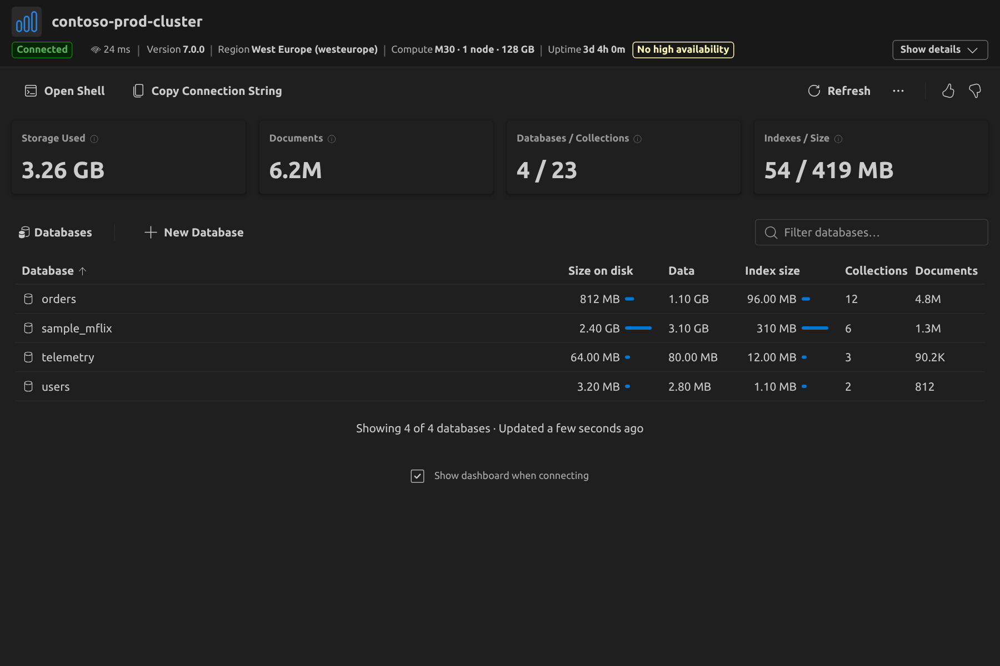

The details disclosure opens below the band:

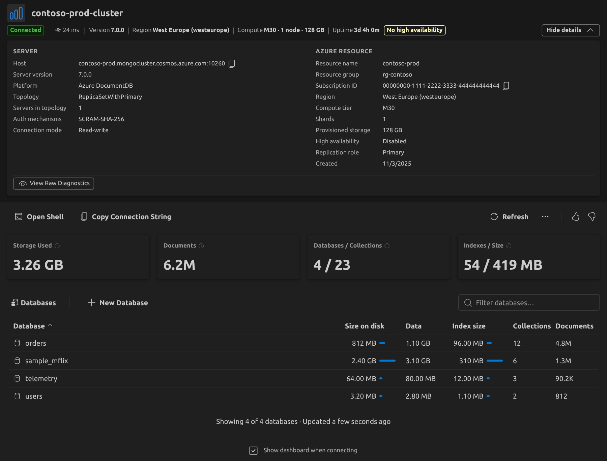

### 2.2 Theirs — Original (default today; context only)

A monitoring dashboard in two columns. The main column has a header with a health pill, nine
metric tiles that pick the chart below, an inventory table with sparklines, and a partition heatmap.
The right rail carries Active Alerts, Azure Advisor recommendations and "Derived Advisories", the
output of their own rule engine. Most of these widgets survive unchanged as the Preview's detail
views (see 2.3).

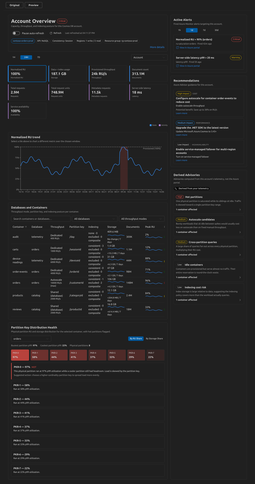

### 2.3 Theirs — Preview (opt-in; **the direction we compare against**)

Problem-first and single-column (max 1120 px). The order is: identity and time/scope controls, a
compact status row, account actions, **Account health**, **Throughput health**, **Top RU
consumers**, four diagnostic cards, **Prioritized recommendations**, then links into four full
detail views.

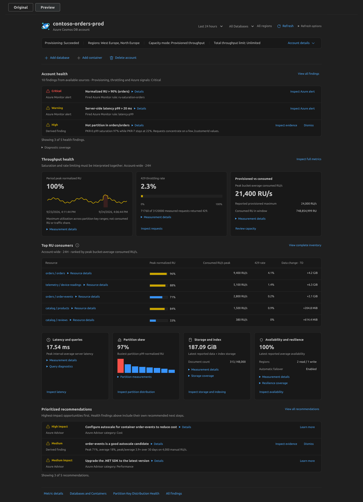

The status row discloses account details in place, with cost and ARM JSON actions in its footer:

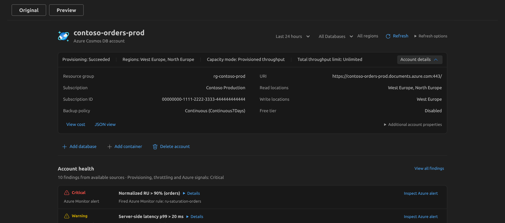

Every finding list has a **Diagnostic coverage** disclosure saying which sources answered:

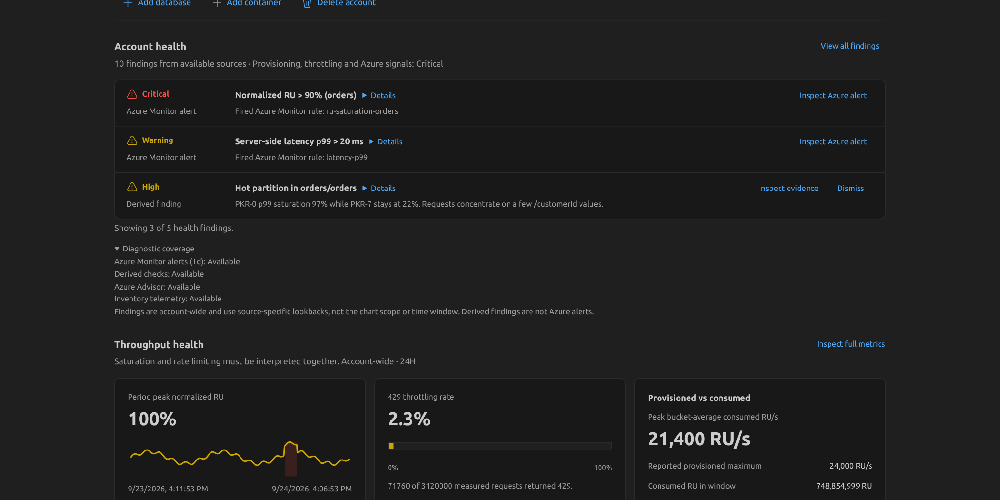

The summary links out to the complete original widgets as detail views, with **Back to summary**:

| All findings                                                                        | Partition distribution                                                             |
| ----------------------------------------------------------------------------------- | ---------------------------------------------------------------------------------- |
| 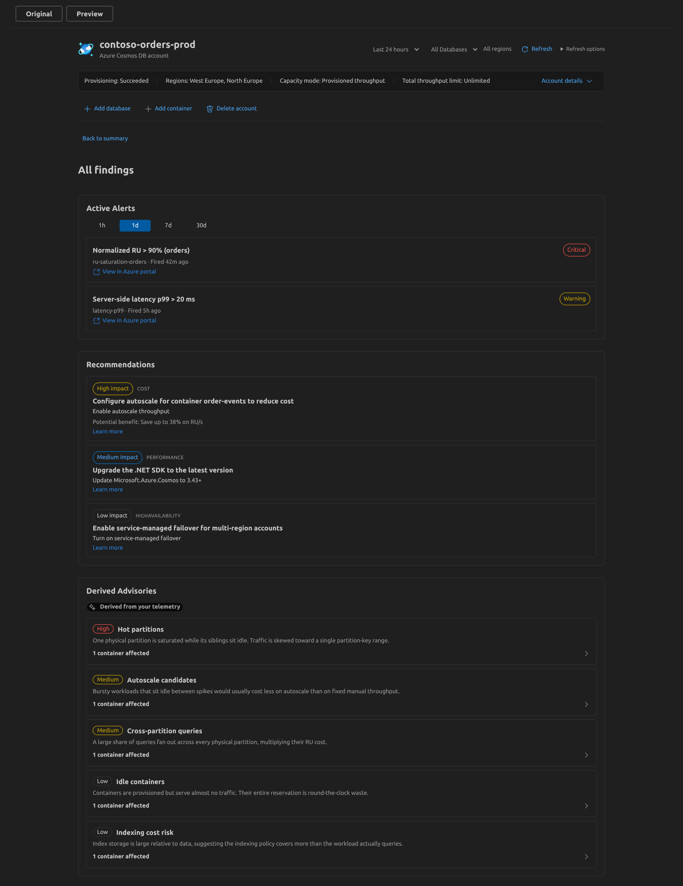 | 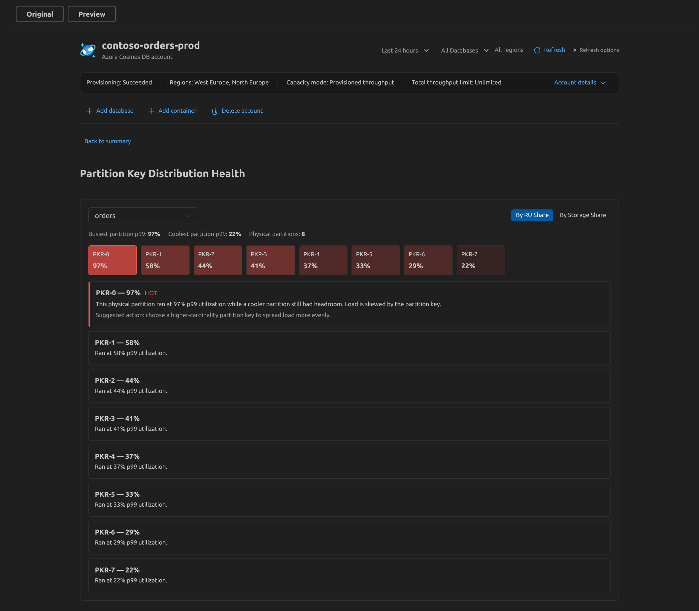 |

### 2.4 Ours — experimental restyle (this branch)

Their Preview's structure applied to our data: a status card with the details inside it, link-style
actions, a new **Cluster health** section, the storage figures as cards with their explanations
printed, and the inventory in a card frame.

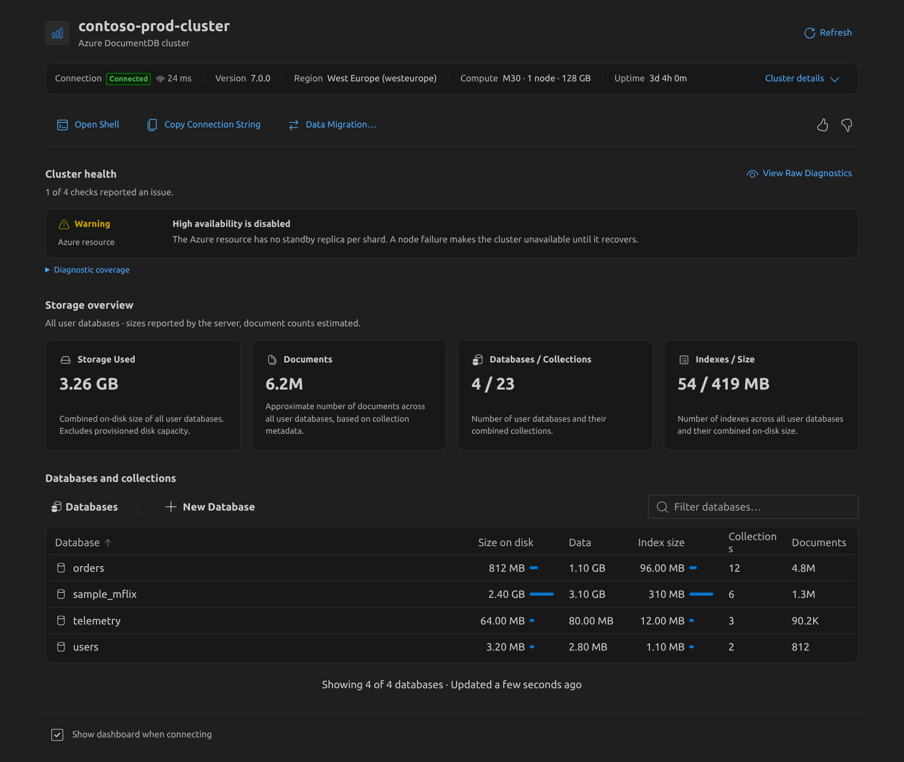

Details and diagnostic coverage disclosed:

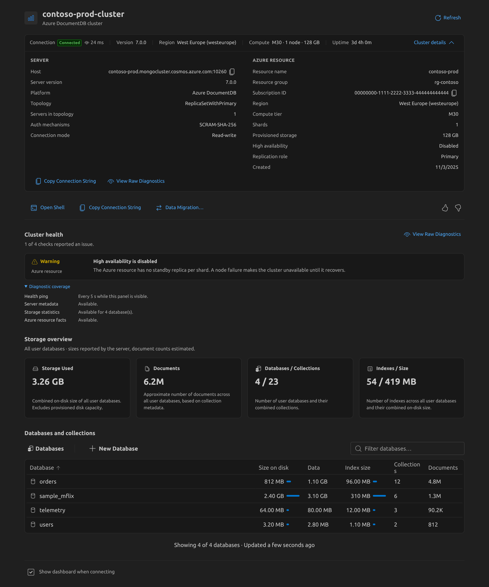

A problem case: the pings failed, the connection is read-only, the storage read is partial and
the cluster is not from an Azure view. The storage cards show lower bounds (`≥`) and say why:

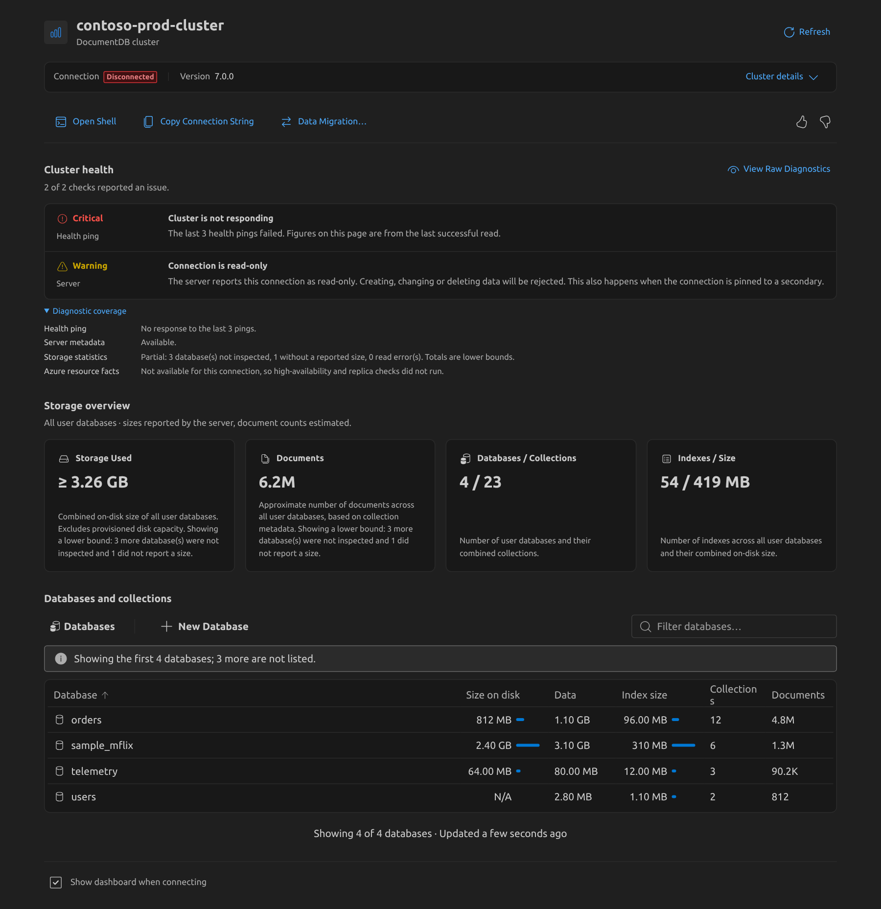

Stepped into a database, where the cards follow the level:

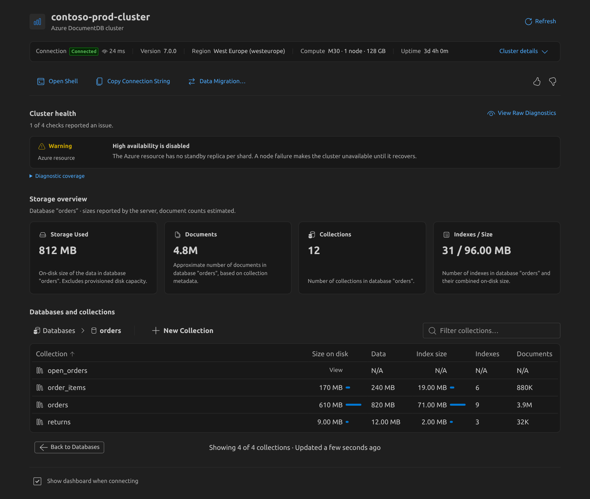

Narrow panel (520 px)

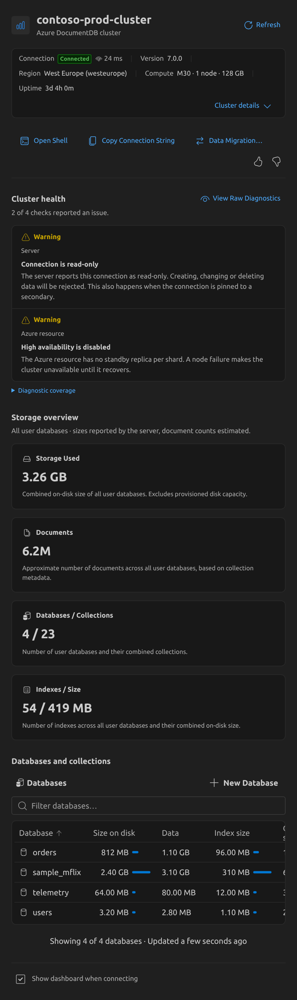

---

## 3. Side-by-side comparison

The target column comes first; their Original is last, for context.

| Aspect             | Cosmos — Preview (target)                                                                            | Ours — original                                                  | Ours — draft                                                                                           | Cosmos — Original (context)                                                  |
| ------------------ | ---------------------------------------------------------------------------------------------------- | ---------------------------------------------------------------- | ------------------------------------------------------------------------------------------------------ | ---------------------------------------------------------------------------- |
| Genre              | Problem-first summary over the same monitoring data                                                  | Data inventory ([0006])                                          | Inventory with a problem-first header                                                                  | Monitoring dashboard                                                         |
| Page shape         | Centred column, max 1120 px, section headings outside cards                                          | Full width, shaded identity band, then content                   | Same as Preview                                                                                        | Two columns: main and right rail                                             |
| Identity           | Product icon, name, type subtitle; time range, scope, Refresh, Refresh options on the right          | Icon, name; badge, ping, facts inline                            | Icon, name, type subtitle; Refresh on the right                                                        | Title, health pill, fact chips                                               |
| Status facts       | One bordered row: `Provisioning \| Regions \| Capacity mode \| Throughput limit`                     | Inline in the band; lower-priority facts shed on narrow widths   | One bordered row: `Connection \| Version \| Region \| Compute \| Uptime`; wraps rather than sheds      | Chips                                                                        |
| Details disclosure | "Account details" chevron; opens **inside** the status row; footer holds View cost and JSON view     | "Show/Hide details" button; separate card under the band         | "Cluster details" chevron inside the row; footer holds Copy Connection String and View Raw Diagnostics | "More details" link                                                          |
| Actions            | Link-coloured subtle buttons: Add database, Add container, Delete account                            | Fluent Toolbar with overflow menu; Refresh on the right          | Link-coloured buttons: Open Shell, Copy Connection String, Data Migration…                             | —                                                                            |
| Health             | **Account health** rows (severity · source · title · evidence · actions), top 3, "View all findings" | Resilience badges in the header                                  | **Cluster health** rows from facts we already had (see §5.1)                                           | Health pill, per-row badges, right-rail cards                                |
| Coverage honesty   | "Diagnostic coverage" disclosure per section; "no findings ≠ healthy"                                | Lower-bound `≥` marks and tooltips on tiles; list-level warnings | "Diagnostic coverage" disclosure; "N checks ran"                                                       | Reason-specific empty states ("Access required", "Partial coverage" pill)    |
| Headline numbers   | Three throughput cards and four diagnostic cards; semantics in "Measurement details"                 | Four `MetricGrid` tiles; explanations in tooltips                | Four cards; explanation printed in each                                                                | Nine tiles, each selects the chart                                           |
| Charts             | Small inline sparkline; bars; partition mini-histogram                                               | None ([0004] custom sparkline, now unused)                       | None                                                                                                   | Recharts trend with throttling bands, sparklines in table                    |
| Inventory          | **Top 5** ranked by consumed RU/s; full inventory is a detail view                                   | Complete, sortable, filterable, two levels ([0014])              | Complete, unchanged, in a card frame                                                                   | Complete table: throughput mode, partition key, indexing, sparklines, health |
| Drill-down         | Summary → detail views with **Back to summary**, focus moved to the heading                          | Step into a database; open a collection                          | Unchanged from original                                                                                | Tiles select chart; heatmap selects container                                |
| Refresh model      | Same; "Refresh options" popover with last refreshed and pause                                        | 5 s ping while visible; storage on open and on demand ([0015])   | Unchanged from original                                                                                | Metrics every 60 s, inventory every 30 s; pause toggle; paused while hidden  |
| Time/scope         | Time range and database scope in the header; every section states its own window                     | Level = cluster or one database                                  | Level only                                                                                             | Time range 1H/24H/7D; container scope                                        |
| Styling            | Same as Original                                                                                     | SCSS on Fluent tokens                                            | SCSS on Fluent tokens mapped to the same VS Code colours                                               | Fluent `makeStyles` on `--vscode-*` variables                                |

[0004]: ../../decisions.md#0004--custom-svg-sparkline-instead-of-a-charting-dependency-reconstructed
[0006]: ../../decisions.md#0006--the-page-is-a-data-inventory-not-a-performance-dashboard-reconstructed
[0014]: ../../decisions.md#0014--step-into-a-database-do-not-expand-it
[0015]: ../../decisions.md#0015--storage-refresh-is-explicit-after-initial-load

---

## 4. What is shown, what is behind a click, what is absent

Their Preview is built around a deliberate split. The summary shows the few most relevant facts;
everything else stays **reachable** through a disclosure or a detail view; and anything that
could not be measured is **stated**, never silently dropped. Their spec puts it as: _"The compact
summary must not silently remove document counts, throughput modes, partition keys, indexing
settings, metric selection, time controls, refresh pause, or diagnostic-source coverage
information."_

Legend: **●** always visible · **◐** one click (disclosure, tooltip, popover) · **→** separate detail view · **—** not available

### 4.1 Cosmos Preview

| Information                                            | Where                      | Notes                                                                 |
| ------------------------------------------------------ | -------------------------- | --------------------------------------------------------------------- |
| Name, type, provisioning, regions, capacity mode       | ●                          | Status row                                                            |
| Resource group, subscription, URI, backup, free tier   | ◐ Account details          | Two-column label/value grid                                           |
| Consistency, retention, failover, throughput limit     | ◐ ◐ Additional properties  | Second-level disclosure                                               |
| Last refreshed, pause auto-refresh                     | ◐ Refresh options          | "Auto-refresh paused" stays visible beside Refresh                    |
| Top 3 health findings                                  | ●                          | Alerts, derived rules; ranked by `overviewFindingsModel`              |
| Finding scope, threshold, action, benefit              | ◐ Details per row          | Evidence text is clamped to two lines until opened                    |
| All alerts, recommendations, derived advisories        | → All findings             | Original right-rail widgets, reused unchanged                         |
| Which sources answered                                 | ◐ Diagnostic coverage      | Alerts window, derived checks, Advisor, inventory telemetry, log tier |
| Normalized RU, 429 rate, provisioned vs consumed       | ●                          | Aggregation semantics under ◐ Measurement details                     |
| Full metric charts                                     | → Metric details           | "Inspect latency" opens the latency chart directly                    |
| Top 5 containers                                       | ●                          | Measurement notes under ⓘ popover                                     |
| Partition key, indexing, throughput mode per container | → Databases and Containers | Not in the summary table                                              |
| Per-container storage, 7-day growth, row actions       | ◐ Resource details         | Open query editor, Reveal in tree, Inspect partitions                 |
| Partition heatmap                                      | ● mini-bars → full view    | Measured labels in the disclosure                                     |
| Data Modeler, confidence scores, savings %             | —                          | Omitted on purpose: no data source or agreed method                   |

### 4.2 Ours — original and draft

| Information                                              | Original                | Draft                            | Notes                                                         |
| -------------------------------------------------------- | ----------------------- | -------------------------------- | ------------------------------------------------------------- |
| Name, connection state, ping                             | ●                       | ●                                |                                                               |
| Version, region, compute, uptime                         | ● (shed on narrow)      | ● (wraps)                        | Uptime is a placeholder on vCore (`serverStatus` unsupported) |
| High availability off, read-only connection              | ● badges                | ● Cluster health rows            | The draft adds source, evidence and severity                  |
| Replica role ≠ Primary                                   | ◐ details only          | ● Cluster health row             | Existing ARM fact, newly surfaced                             |
| Hosts, topology, auth mechanisms, Azure resource facts   | ◐ Show details          | ◐ Cluster details                |                                                               |
| Raw diagnostics export                                   | ◐ menu / details footer | ◐ details footer, health heading | Host-side, confirmed before export ([0017])                   |
| Which reads succeeded                                    | Implicit (message bars) | ◐ Diagnostic coverage            | Ping, server metadata, storage statistics, Azure facts        |
| Storage, documents, databases/collections, indexes       | ● tiles                 | ● cards                          |                                                               |
| What each figure means                                   | ◐ tooltip on ⓘ          | ● printed                        | The same strings, moved out of tooltips                       |
| Partial totals                                           | ● `≥` and ◐ tooltip     | ● `≥` and printed reason         |                                                               |
| Complete inventory, sort, filter, two levels             | ●                       | ●                                | Our main content; not truncated to a top N                    |
| Row actions and tree context menu                        | ◐ hover, context menu   | ◐ unchanged                      | [0016]                                                        |
| Last updated                                             | ● table footer          | ● table footer                   |                                                               |
| Time window, trends, throughput, latency, errors, alerts | —                       | —                                | No data source today; see §6                                  |

[0016]: ../../decisions.md#0016--row-context-menu-entries-run-on-the-host
[0017]: ../../decisions.md#0017--diagnostics-carry-raw-replies-not-a-second-reading-of-them

### 4.3 Their Preview, section by section: where we stand

This is the forward-looking map. Each row is one section of their Preview, top to bottom, with
our nearest equivalent and the gap. The idea numbers refer to §5 and §6.

| Preview section                | What it gives the reader                                                                  | Ours today (original)                                                                                                        | Draft                           | Gap and candidate ideas                                                                                                                          |
| ------------------------------ | ----------------------------------------------------------------------------------------- | ---------------------------------------------------------------------------------------------------------------------------- | ------------------------------- | ------------------------------------------------------------------------------------------------------------------------------------------------ |
| Header controls                | Time range, database scope, Refresh, Refresh options (last refreshed, pause)              | Refresh in the toolbar; level via step-in; "Updated … ago" in the table footer                                               | Refresh moved to the header     | A time range only makes sense once we have windowed data (6.2, 6.3). Name the window and scope on every figure now (5.6)                         |
| Status row and Account details | Four facts; details in place; cost and JSON actions; second-level "additional properties" | Band with facts and badges; Show details with Server and Azure groups; raw diagnostics                                       | Matches the Preview's shape     | Cost and ARM JSON links (6.10); more ARM facts (6.5); a second disclosure tier if the Azure group grows (5.5)                                    |
| Account actions                | Add database, Add container, Delete account                                               | Open Shell, Copy Connection String, More (raw diagnostics, Data Migration); New Database/Collection in the inventory toolbar | Link row                        | Functionally at parity. Placement only. Deleting a cluster from the page is not proposed                                                         |
| **Account health**             | Top 3 findings from alerts and derived rules; View all findings; diagnostic coverage      | Resilience badges in the header                                                                                              | **Cluster health**, 4 checks    | Our sources are thin: add derived checks (6.1), fired alerts (6.6), Resource Health (6.8). "View all findings" once there can be more than three |
| Throughput health              | Normalized RU with sparkline; measured 429 rate; provisioned vs consumed                  | —                                                                                                                            | —                               | vCore has no RU model. The analogue is **compute health**: CPU, memory and storage % of provisioned (6.2, 6.1b), plus request error rate (6.3)   |
| Top RU consumers               | Top 5 containers ranked by consumed RU/s; bars; per-row details and actions               | Complete inventory with relative size bars; row actions and context menu                                                     | Unchanged                       | Keep the complete table; add traffic, latency and error **columns** and let them be the sort (5.7, 6.3)                                          |
| Latency and queries            | Peak interval-average latency; query diagnostics from logs                                | —                                                                                                                            | —                               | `MongoRequestDurationMs` (6.3); link to our per-collection Query Insights rather than rebuilding it; logs only after the 0019 question (6.9)     |
| Partition skew                 | Busiest partition saturation; mini-histogram; full heatmap view                           | —                                                                                                                            | —                               | Per-shard skew for multi-shard clusters (6.4). Not applicable to single-node clusters, and should say so                                         |
| Storage and index              | Latest data + index storage; document count; growth notes                                 | **Storage Used**, **Documents**, **Indexes / Size** tiles; per-row sizes                                                     | Cards with printed explanations | Our strongest area. Missing: growth over time (Azure Monitor `StorageUsed` history) and index-to-data ratio (6.1a)                               |
| Availability and resilience    | Availability %; read/write regions; automatic failover                                    | HA and read-only badges; region in the band                                                                                  | HA and replica findings         | HA, replicas and geo-replicas as one card from ARM (6.5). The vCore metric list has no availability metric; Resource Health may stand in (6.8)   |
| Prioritized recommendations    | Advisor and derived advice, top 3, with evidence and Dismiss                              | —                                                                                                                            | —                               | Advice needs a source: derived rules (6.1a, 6.1c, 6.1d) and Advisor (6.7). Keep it separate from health findings (5.10)                          |
| Detail views                   | Metric details, Databases and Containers, Partition distribution, All findings            | The inventory is the page                                                                                                    | —                               | A **Metrics** detail view is the natural home for 6.2/6.3 without turning the landing page into a monitor (5.3, [0006])                          |
| Preview selector               | Original / Preview switch over one shared state owner                                     | —                                                                                                                            | —                               | A way to ship our own redesign without a hard cut-over (5.9)                                                                                     |

**Takeaway.** We already practise most of the "state what is missing" discipline: `N/A`, `≥`,
list-level warnings. We just express it through tooltips and message bars. Theirs gathers it in one
predictable place per section, the coverage disclosure, and **names the checks that could not run**.
That is the idea most worth taking, and it does not require their visual language.

---

## 5. Ideas worth revisiting — design patterns

Each idea lists what their **Preview** does, what the draft did, and how well it fits us. "Fit" judges the idea
against our design language and decisions, not against their styling.

### 5.1 A "Cluster health" section: findings with severity, source and evidence

- **Theirs.** Account health shows up to three rows. Each row has a severity (icon plus word,
  never colour alone), a source ("Azure Monitor alert", "Derived finding"), a title, two lines of
  evidence, a Details disclosure, and actions (Inspect Azure alert, Inspect evidence, Dismiss).
  Ranking and de-duplication live in a pure model,
  [`overviewFindingsModel.ts`](https://github.com/microsoft/vscode-cosmosdb/blob/a8457294667f272ca2734cfb42fdd51ad21a3844/src/webviews/cosmosdb/AccountOverviewV2/overviewFindingsModel.ts),
  and "View all findings" opens the complete lists.
- **Draft.** [`clusterHealthModel.ts`](../../../../../../src/webviews/documentdb/clusterDashboard/components/clusterHealthModel.ts)
  restates signals the page already had as findings: _Cluster is not responding_ (ping failures),
  _Connection is read-only_ (`hello.readOnly`), _High availability is disabled_ (ARM), and _This
  cluster is a replica_ (ARM `replicaRole`). Findings are sorted by severity. An empty list reads
  "N checks ran; none reported an issue", never "healthy".
- **Fit.** Good. It answers "is this cluster safe?", which [0006] reserves for the page, without
  adding motion. Today the list is short, so it grows mainly with the data ideas in §6.
- **Open.** Should it appear only when a finding exists (empty state collapsed), or always, so the
  reader learns where to look?

### 5.2 Diagnostic coverage: say what was checked and what could not be

- **Theirs.** Every summary has a coverage disclosure listing each source's state. States are
  reason-specific (missing RBAC role, diagnostic settings off, no data yet, transient error). A
  degraded tier never blanks the section: Tier-1 results render and a "Partial coverage" notice
  names the gap.
- **Draft.** The same disclosure for ping, server metadata, storage statistics (with counts of
  databases not inspected, unreported sizes and read errors) and Azure resource facts. For a
  connection-string cluster it says the HA and replica checks did not run.
- **Fit.** Very good. It extends [0002] (per-command degradation) to the UI and replaces scattered
  tooltips with one predictable place. It works with our current look.

[0002]: ../../decisions.md#0002--per-command-trycatch-no-capability-probe-reconstructed

### 5.3 Summary first, full detail one click away

- **Theirs.** The Preview never removes a widget; it moves widgets to detail views (Metric details,
  Databases and Containers, Partition Key Distribution Health, All findings) and reuses the original
  components there. Focus moves to the destination heading; **Back to summary** returns to the
  element that opened the view. Specific summary actions deep-link to the matching detail, e.g.
  "Inspect latency" opens the latency chart rather than the default one.
- **Draft.** Not adopted: our inventory _is_ the main content.
- **Fit.** Mixed. We should not hide the inventory behind a summary ([0006], [0014]). The **focus and
  return-path contract** is worth copying for our step-in navigation and for any future detail view,
  such as an Azure metrics view (§6.2).

### 5.4 Print the explanation; keep tooltips for extras

- **Theirs.** Every number carries a one-line label ("Peak interval-average server latency") and a
  "Measurement details" disclosure with the aggregation, window and caveats ("not P99", "not
  consumed RU or traffic share").
- **Draft.** Card explanations moved out of tooltips. It reads better, but four cards of 11 px text
  is a lot of text for an inventory.
- **Fit.** Take the discipline, not necessarily the layout. A middle ground: a short printed label
  under each value (e.g. "on disk, all user databases"), with the long explanation in a disclosure
  or a focusable ⓘ. Tooltip-only information needs a focusable trigger anyway (WCAG 1.4.13).

### 5.5 Status row with an in-place details disclosure

- **Theirs.** Status facts sit in a bordered row; "Account details" opens beneath them **in the same
  card**, in a two-column label/value grid, with contextual actions (View cost, JSON view) in the
  disclosure footer and a second-level disclosure for rarer properties.
- **Draft.** The same, with our Server and Azure resource groups.
- **Fit.** Moderate. Ours already has a disclosure. Opening it inside the fact row is a small,
  compatible change. The "rare properties behind a second disclosure" tier is worth considering if
  the Azure group grows (§6.5).

### 5.6 Time window and refresh stated explicitly

- **Theirs.** Time range and scope sit in the header, and every section restates its own window
  ("Account-wide · 24H"). "Refresh options" shows the last refresh time and a pause switch;
  "Auto-refresh paused" stays visible when active. Their spec: _"An account-level label must not
  imply that every signal follows one global time window."_
- **Draft.** Not adopted. We have no time-windowed data.
- **Fit.** Becomes relevant the moment anything in §6.2–§6.3 lands. The rule "every figure names
  its window and scope" is cheap to adopt now: our storage figures are point-in-time, and "Updated
  a few seconds ago" already does part of this.

### 5.7 Ranked resource table with per-row disclosure

- **Theirs.** Top 5 containers ranked by a measured signal, with a bar and value per signal. A
  "Resource details" disclosure on each row holds storage, growth and actions (Open query editor,
  Reveal in tree, Inspect partitions). Measurement notes sit in an ⓘ popover by the heading.
- **Draft.** Not adopted. We keep the full, sortable table.
- **Fit.** Top-N truncation conflicts with the inventory. **Ranking by a signal** is compatible:
  it is a sort order plus a column, and it becomes useful once we have per-collection traffic (§6.3).

### 5.8 Smaller things

| Idea                                                             | Theirs                           | Fit for us                                                                            |
| ---------------------------------------------------------------- | -------------------------------- | ------------------------------------------------------------------------------------- |
| Session-only **Dismiss** on a derived finding                    | Yes, focus moves to the next row | Only once findings include advice rather than facts                                   |
| Section headings outside cards; subtitle states scope and window | Yes                              | Cheap and helps scanning; compatible with our tokens                                  |
| Centred max-width column                                         | 1120 px                          | Diverges from Collection View's full width; a wide-screen question                    |
| Link-style subtle actions instead of a toolbar                   | Yes                              | **Reject**: our toolbar with overflow is the extension-wide pattern                   |
| Product icon in the header                                       | PNG                              | We use a Fluent glyph; an SVG product icon needs an asset loader in the webview build |
| Muted, regular-weight table headings                             | Yes                              | **Reject** for now: our tables match the Collection View index list                   |

### 5.9 Ship the redesign behind an opt-in switch, as they did

- **Theirs.** One state hook owns loading, polling, scope and dismissals. The Original/Preview
  selector sits above it, and exactly one presentation is mounted. Switching keeps the time
  window, scope, pause state and dismissals, and does not start a second polling loop. Their spec
  then makes a usability comparison of both layouts, on the same accounts and tasks, the release
  gate.
- **Draft.** Replaced the presentation in place on a branch.
- **Fit.** Good, if we decide to move toward the Preview. Our state already lives in
  `ClusterDashboard.tsx`; extracting it into a hook, as their first increment did, would let a new
  presentation run beside the current one. It would also give us their evaluation protocol
  (§"Manual comparison protocol" in their spec) almost for free.

### 5.10 Keep health and advice apart

- **Theirs.** "Account health" holds findings about the current state (alerts, hot partitions,
  throttling). "Prioritized recommendations" holds advice (autoscale, SDK upgrades, indexing). Both
  use the same row component, but they are separate sections with separate "View all" links.
- **Draft.** Health only; we have no advice source yet.
- **Fit.** Good, and it matters as soon as 6.1 lands: "index is 60% of data" is advice, not a health
  problem, and mixing the two dilutes the health section.

---

## 6. Ideas worth revisiting — data we do not have yet

Most of their actionable content comes from Azure data planes we do not read: Azure Monitor
metrics, Alerts Management, Azure Advisor and Log Analytics. Ours comes from the wire protocol plus
the ARM facts the tree already holds, at no extra API cost. The table sorts candidates by how much
new plumbing each needs.

| #    | Idea                                       | Answers                                                                                         | Data source                                                                                                               | Works for         | Needs                                                                  | Fit with [0006]/[0007]                                           |
| ---- | ------------------------------------------ | ----------------------------------------------------------------------------------------------- | ------------------------------------------------------------------------------------------------------------------------- | ----------------- | ---------------------------------------------------------------------- | ---------------------------------------------------------------- |
| 6.1a | Index-to-data ratio finding                | "Are my indexes bigger than they should be?"                                                    | `dbStats` / `collStats` sizes we already read                                                                             | Every cluster     | Nothing new                                                            | Good (static)                                                    |
| 6.1b | Used vs provisioned storage                | "How close is the disk to full?"                                                                | `dbStats` total ÷ ARM `diskSize` (both already loaded)                                                                    | Azure clusters    | A clear caveat: the sum excludes oplog, journal, system databases      | Good; closes the open gap in [README](../../README.md#open-gaps) |
| 6.1c | Unused indexes                             | "Which indexes cost writes and serve nothing?"                                                  | `$indexStats` (already used by the Indexes tab)                                                                           | Every cluster     | One command per collection; must be bounded ([0011])                   | Good if on demand, not on open                                   |
| 6.1d | Large collections with only `_id`          | "Where will queries scan?"                                                                      | `collStats.nindexes` + size                                                                                               | Every cluster     | Nothing new                                                            | Good                                                             |
| 6.2  | Compute and storage saturation             | "Is the cluster running hot?"                                                                   | Azure Monitor `CpuPercent`, `MemoryPercent`, `StoragePercent`, `IOPS`, network, per `ServerName`                          | Azure vCore       | `@azure/arm-monitor`, Monitoring Reader                                | Performance-genre: detail view, peak over window, not live       |
| 6.3  | Traffic, latency and errors per collection | "Which collections are busy, slow or failing?"                                                  | Azure Monitor `MongoRequestDurationMs`, split by `DatabaseName`, `CollectionName`, `Operation`, `StatusCode`, `ErrorCode` | Azure vCore       | As 6.2                                                                 | Good as **columns and a sort order** in our inventory            |
| 6.4  | Per-shard skew                             | "Is one shard doing all the work or holding all the data?"                                      | `StorageUsed`, `CpuPercent` split by `ServerName`                                                                         | Multi-shard vCore | As 6.2                                                                 | Good as a finding, detail on demand                              |
| 6.5  | More ARM facts and posture findings        | Backup retention, maintenance window, public network access, firewall `0.0.0.0/0`, geo-replicas | `@azure/arm-mongocluster` `mongoClusters.get` (dependency already present)                                                | Azure vCore       | One ARM read on open                                                   | Good (static)                                                    |
| 6.6  | Fired Azure Monitor alerts as findings     | "Is something already alerting?"                                                                | `@azure/arm-alertsmanagement` `alerts.getAll(scope)`                                                                      | Azure             | New SDK, Monitoring Reader                                             | Good as findings with source "Azure Monitor alert"               |
| 6.7  | Azure Advisor recommendations              | Cost, reliability, performance advice                                                           | `@azure/arm-advisor`; they coalesce one subscription-wide call across panels                                              | Azure             | New SDK; coverage for `mongoClusters` **unverified**                   | Good as recommendations                                          |
| 6.8  | Resource Health                            | "Is Azure itself reporting a problem?"                                                          | `Microsoft.ResourceHealth/availabilityStatuses`                                                                           | Azure             | Support for `mongoClusters` **unverified**                             | Good as a finding                                                |
| 6.9  | Log-based diagnostics (their "Tier-2")     | Slow operations, failing operations, top operation shapes                                       | Diagnostic setting `vCoreMongoRequests` → `AzureDiagnostics` in Log Analytics                                             | Azure vCore       | Diagnostic settings enabled, Log Analytics Reader; partial-coverage UI | **Collides with [0019]**: rows may carry command shapes          |
| 6.10 | Cost and ARM JSON deep links               | "What does this cost?" / "Show me the resource"                                                 | Portal Cost Analysis URL; ARM GET                                                                                         | Azure             | Nothing new beyond the resource id                                     | Good; sits in the details footer                                 |

[0007]: ../../decisions.md#0007--nothing-above-the-fold-moves-reconstructed
[0011]: ../../decisions.md#0011--cost-is-bounded-per-connection-not-per-call
[0019]: ../../decisions.md#0019--currentop-is-out-of-scope-for-this-iteration

Metric and log names are from Microsoft Learn:
[supported metrics for `Microsoft.DocumentDB/mongoClusters`](https://learn.microsoft.com/azure/azure-monitor/reference/supported-metrics/microsoft-documentdb-mongoclusters-metrics)
and [supported logs](https://learn.microsoft.com/azure/azure-monitor/reference/supported-logs/microsoft-documentdb-mongoclusters-logs).
Items marked **unverified** need checking before they are designed for.

### How they built the equivalent, for reference

Both of their presentations sit on the same host services and the same state hook; the Preview
adds only opt-in procedures (`getOverviewAnalytics`) on top.

- **Metric fetch contract.** One neutral `MetricSeriesResult` for every metric (`available`,
  `reason`, `points`, `peak`, `timeRange`, scope). Failures become `available: false` plus a reason,
  never an exception. Granularity follows the window: `1H → PT1M`, `24H → PT5M`, `7D → PT1H`.
  ([`metrics/contracts.ts`](https://github.com/microsoft/vscode-cosmosdb/blob/a8457294667f272ca2734cfb42fdd51ad21a3844/src/panels/accountOverview/metrics/contracts.ts))
- **Rule engine.** Twenty pure rule functions over metrics and ARM config. Each has a stable id, a
  severity, a rationale, a suggested action and a threshold reference. Thresholds are settings
  (`cosmosDB.accountOverview.advisories.*`), each marked as either a platform limit or internal
  guidance. ([`docs/account-overview-dashboard.md`](https://github.com/microsoft/vscode-cosmosdb/blob/a8457294667f272ca2734cfb42fdd51ad21a3844/docs/account-overview-dashboard.md#detections-we-compute))
- **Health escalation.** A base state from provisioning and throttling, then **escalated, never
  downgraded** by alerts and high-impact Advisor items.
- **Tiered coverage.** Tier-1 (metrics + ARM) always runs; Tier-2 (logs) is optional and reports
  why it did not run.
- **Bundle hygiene.** ARM SDKs are imported dynamically so they stay out of the activation bundle.
- **Opt-in cost.** Expensive Preview-only data is fetched through explicit procedures, only while
  Preview is open, on the shared refresh generation. No second polling loop.

For us, the metric contract, the tiered-coverage idea and lazy SDK loading carry over directly to
§6.2–§6.6. The rule-engine shape (pure rules, threshold references, settings) fits §6.1 and would
let our findings grow without growing `ClusterHealth.tsx`.

---

## 7. Where the ideas collide with our recorded decisions

| Decision                                                       | Tension                                                                                  | Suggested reading                                                                                       |
| -------------------------------------------------------------- | ---------------------------------------------------------------------------------------- | ------------------------------------------------------------------------------------------------------- |
| [0006] Data inventory, not a performance dashboard             | Their page is a performance dashboard with a problem-first summary                       | Take findings and coverage; add metrics as inventory columns (6.3) or a detail view, not a landing page |
| [0007] Nothing above the fold moves                            | Their trends poll every 60 s; the sparkline animates                                     | Show window aggregates (peak, total) read on open and on Refresh; no auto-refresh above the fold        |
| [0004] Custom SVG sparkline, no chart dependency               | They use Recharts                                                                        | If trends return, revisit 0004 explicitly rather than drift into a dependency                           |
| [0011] Cost bounded per connection                             | `$indexStats` for every collection, per-collection Monitor splits                        | Bound by the same caps as `collStats`; fetch on step-in or on demand                                    |
| [0019] `currentOp` out of scope                                | Log-based diagnostics (6.9) may surface command shapes                                   | Treat 6.9 like `currentOp`: needs its own redaction answer first                                        |
| [0021] Unavailable values are enough for best-effort summaries | Their coverage disclosure and our draft's lower-bound reasons go further than 0021 asked | Decide whether a coverage disclosure replaces per-tile caveats (simpler) or adds to them                |
| [0022] Labels name content; icons communicate navigation       | Their action labels are verbs in link style                                              | Keep our labels and icons; borrow placement only                                                        |

[0021]: ../../decisions.md#0021----unavailable-table-values-are-enough-for-best-effort-summaries
[0022]: ../../decisions.md#0022-labels-name-content-icons-communicate-navigation

---

## 8. Questions for the discussion

1. **Cluster health.** Adopt a findings section in our own visual language? If so, keep it when
   empty (it teaches where to look) or show it only when something fires?
2. **Coverage disclosure.** Should one "Diagnostic coverage" place per section replace the tooltips
   and scattered caveats, as a follow-up to [0021]?
3. **First derived checks.** Which of 6.1a–6.1d first? 6.1a and 6.1b need no new reads; 6.1b closes
   a documented gap.
4. **Azure data.** Is a first Azure Monitor read (6.2/6.3) in scope for this feature, given
   [0006]? If yes: traffic and latency as **inventory columns** (6.3), or a separate **metrics
   detail view** (6.2)?
5. **Alerts and Advisor.** Worth a new SDK each (6.6/6.7), or wait until Advisor coverage for
   `mongoClusters` is confirmed?
6. **Printed explanations.** Short printed labels plus a disclosure, or keep the current ⓘ
   tooltips?
7. **Layout.** Anything from the Preview's page shape worth taking: the centred max-width column, section
   headings outside cards, details opening inside the fact row? Or none of it?
8. **Adopting the Preview's direction.** Move toward it incrementally in our visual language, or
   build a second presentation behind an opt-in switch (5.9) and compare both with users?
9. **Compute health.** Is CPU, memory and storage % (6.2, 6.1b) the right counterpart of their
   Throughput health for vCore, or does it pull us too far into monitoring?
10. **Shared components.** They and we both build findings rows, coverage disclosures and metric
    contracts. Is there appetite for a shared package, like `@microsoft/vscode-ext-webview-fluentui`,
    so the two extensions converge over time?

---

## 9. How the screenshots were made

Neither dashboard can be screenshotted against a real cluster or account without credentials, so
each was rendered in a throwaway browser harness (not committed):

- The real top-level components (`ClusterDashboard`; `AccountOverview` with its Original/Preview
  switch) were bundled with esbuild, wrapped in `VSCodeFluentProvider`, with
  `@microsoft/vscode-ext-webview/react` stubbed to return a **mock tRPC client**.
- The mock data is fictional: `contoso-prod-cluster` with four databases; `contoso-orders-prod`
  with seven containers, a hot partition, two alerts, three Advisor items and five derived
  advisories.
- VS Code Dark Modern colour variables were set on `<html>`. Captured with headless Chromium at
  1.5× device scale. The font is Ubuntu, not Segoe UI, so text widths differ slightly from VS Code.
- The DocumentDB "original" images are from `feature/cluster-dashboard-poc` at
  [`aae1336`](https://github.com/microsoft/vscode-documentdb/commit/aae1336c); the "draft" images are
  from this branch.
