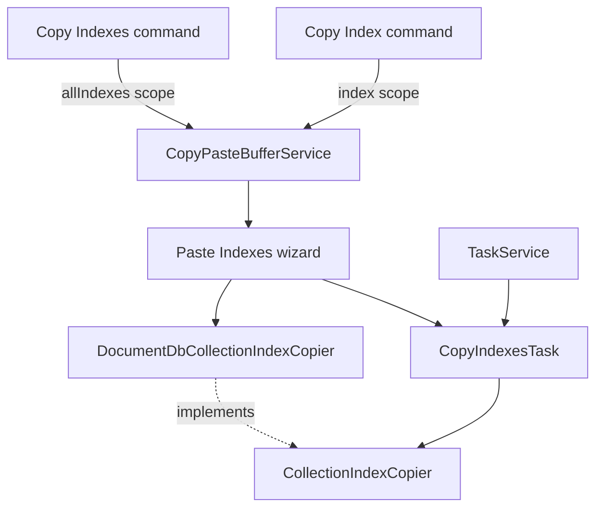

# Dedicated Index Copy and Paste

## Purpose

Add a dedicated workflow for copying secondary indexes without copying documents:

- **Copy Index…** on one index node;
- **Copy Indexes…** on an Indexes parent, meaning every copyable secondary index in that collection;
- **Paste Indexes…** on a target Indexes parent.

The feature must build on the index-copy implementation already used by Copy and Paste Collection.
It must not introduce a second catalog comparison or index creation path. New copied-index state
belongs behind a service with an explicit contract; migrating existing collection copy state out of
the global `ext` namespace is deferred.

Add dedicated index copy and paste using the existing copier, preserve collection-copy behavior,
and make only the supporting contract, tree, notification, and test changes required for that
workflow. The collection flow needs internal adaptations, not a redesign.

## Product scope

### Included

- Copy one secondary index by selecting an `IndexItem`.
- Copy a selected subset of secondary indexes from one collection using VS Code tree multi-selection.
- Copy all secondary indexes by selecting an `IndexesItem`.
- Paste into an existing target collection through its `IndexesItem`.
- Copy across collections, databases, and connected clusters supported by the same
  `CollectionIndexCopier` implementation.
- Preserve the existing handling for equivalent definitions, name collisions, supported index
  options, vector indexes, hidden state, cancellation, diagnostics, and telemetry.
- Show determinate index-by-index progress for the dedicated index-only operation.
- Classify catalog entries as copyable or not **in the presentation layer**, and use that to gate the
  new menu entries, explain non-copyable entries in the tree, and warn in the dedicated Paste
  Indexes confirmation.
- Improve the `IndexItem` tooltip so a non-copyable entry explains itself, and remove the
  placeholder `Support coming soon` child node.
- Remove the false promise in the Paste Collection prompt that "all" secondary index definitions are
  copied. Keep its existing counts and warnings; see "Known gaps". The shared-contract adaptations
  and explicitly listed notification and command-palette fixes remain in scope.

### Not included

- Copying the built-in `_id` index. Every target collection already owns it.
- Copying search-index entries or any other catalog entry without an ordinary index definition.
- Any notion of non-copyable entries inside `CollectionIndexCopier`. The copier stays unaware of
  catalog entries it cannot create; see "Index copyability".
- Exclusion reporting or count changes in the Paste Collection confirmation. Scoped out
  deliberately; see "Known gaps".
- Selecting an arbitrary subset in a picker.
- Creating a target collection as part of Paste Indexes. The target is always an existing
  `IndexesItem`.
- Cross-database-family index translation. Decision 0003 still applies.
- Persisting copied selections across extension-host restarts.

## User experience

### Copy one index

1. The user opens an Indexes node and invokes **Copy Index…** on a copyable secondary index.
2. The command records a stable source collection descriptor and the selected index name.
3. A notification says that the index is ready to paste and offers **Cancel Copy**.
4. The user invokes **Paste Indexes…** on another collection's Indexes node.
5. A confirmation shows the source, target, the one selected index name, and its applicable unique
   or TTL warnings. It shows no whole-collection count or unrelated excluded entries.
6. A background task copies the index and shows determinate progress.

The `_id` node and non-copyable entries do not offer **Copy Index…**; they are gated out by the
`state_copyable` context value described under "Command and menu integration".

### Copy selected indexes

1. The user selects two or more index rows from one collection and invokes **Copy Index…** on a
   copyable selected index.
2. The command receives the right-clicked item and VS Code's selected-items array, matching the
   existing Move to Folder command pattern.
3. It retains copyable `IndexItem` nodes from the same collection and records their names as a
   snapshot subset. Expanded index-field rows, `_id`, and keyless non-copyable entries are ignored.
4. If copyable indexes from more than one collection are selected, the command rejects the
   selection rather than silently choosing one source descriptor.
5. Paste validates every retained name and shows only the selected names and their applicable
   unique or TTL warnings.

The right-clicked node controls menu eligibility. Right-clicking an expanded field row does not
offer **Copy Index…**; right-clicking a copyable index while field rows are also selected offers the
command and ignores those rows.

#### Notification button label

Use **Cancel Copy**, not **Undo**. Nothing has been written to a database at this point, and
**Undo** reads as reverting a database operation. **Cancel Copy** names exactly what is discarded
and cannot be misread as destructive.

Apply the same rename to the existing Copy Collection notification in
`src/commands/copyCollection/copyCollection.ts`, which currently offers **Undo**. Also correct the
sibling button from `Learn more` to `Learn More` for VS Code title-case consistency while editing
that line. The telemetry property recorded on that branch keeps its existing meaning; only the
visible label changes.

Ignore the stale-notification race, in which an open notification from an earlier copy clears a
newer selection. It already exists for Copy Collection, it requires the user to deliberately leave a
notification open across two copies, and matching the existing behavior is preferable to making the
two flows differ.

### Copy all indexes

1. The user invokes **Copy Indexes…** on an Indexes parent.
2. The command records an `all` source selection. It does not retain the current child nodes or a
   snapshot of provider-specific index definitions.
3. The confirmation notification says that the collection's copyable secondary indexes are ready to
   paste and offers **Cancel Copy**. It must not claim "all indexes", because `_id` and any
   non-copyable entries are excluded.
4. Paste resolves the current source catalog, excluding `_id` and non-copyable entries, and starts
   the same dedicated task.

`all` has live-reference semantics: indexes added before Paste Indexes are included, and indexes
removed before Paste Indexes are absent. A single-index selection instead requires that name to
still exist. This matches the existing collection copy behavior, which marks a source and reads it
again when work starts rather than serializing its contents at copy time.

The two cases reach the copier differently, and this is what preserves liveness without a
discriminated union in the contract:

- **Copy Index…** passes that one name, so a vanished index fails — correct, because the user
  confirmed a specific index;
- **Copy Indexes…** passes `undefined`, so the copier resolves "all copyable" itself, exactly as the
  collection flow does today.

A consequence worth accepting rather than engineering against: for the `all` case the count shown in
the confirmation is a best-effort snapshot and can drift by one if an index is created between
confirmation and execution. The collection flow already behaves this way.

### Paste validation

Paste Indexes must:

- reject an empty copy buffer with an actionable message;
- reject source and target descriptors that identify the same collection;
- verify that the source cluster is still connected and the source collection still exists;
- verify that every named source index still exists and is still copyable;
- distinguish "no longer exists" from "not copyable" in the failure message, using the classified
  read described under "Paste wizard"; a named entry that resolves to a search index must not be
  reported as missing;
- fail rather than silently reducing a single-index selection when that index was deleted or changed
  to an unsupported kind;
- clear stale copied-index state when the source cluster, collection, or copied index name can no
  longer be resolved;
- allow `all` to resolve to zero copyable secondary indexes and report that there is nothing to
  copy, listing the excluded entries so the outcome is explainable;
- let target catalog changes after confirmation be handled by the existing equivalence and naming
  rules when the task reads its stable target snapshot.

### Buffer lifetime after a successful paste

A successful Paste Indexes leaves the buffer intact, matching Copy Collection: the source stays
marked so the user can paste the same selection into several targets without re-copying. The buffer
is replaced only by another index copy command, cleared by **Cancel Copy**, or cleared by validation when
the source can no longer be resolved. Write this down in the feature README so it is not
re-litigated at implementation time.

## Index copyability

### Where classification belongs

Classification is a **presentation-layer** concern. It must not enter the copier contract.

`CollectionIndexCopier` is provider-neutral, and its notion of a catalog is _ordinary index
definitions it can create_ — a complete, self-consistent concept that it fully owns. The tree's
notion is _everything worth showing a user_, which today includes Atlas search indexes and tomorrow
includes whatever else `IndexesItem.fetchIndexes()` starts merging in.

Asking the copier to report on entries it cannot copy would force a database-agnostic interface to
track the presentation layer's superset. That superset is unbounded and is not the copier's to know:
every future addition to the tree would become a change to the shared contract. An earlier draft of
this plan did exactly that. It was backed out because it produced two concrete defects — the copier
would have needed a second catalog read it has no business making, and the shared predicate could
not be typed, because the tree holds `IndexItemModel` while the copier holds the driver's
`IndexDescriptionInfo`. Do not reintroduce it.

| Layer                                           | Knows about                                                                      | Owns                                                                                  |
| ----------------------------------------------- | -------------------------------------------------------------------------------- | ------------------------------------------------------------------------------------- |
| Tree, commands, paste wizard — `IndexItemModel` | the full user-visible catalog, including search indexes and future additions     | classification, menu gating, confirmation; passes a name only for a single-index copy |
| `CollectionIndexCopier` — provider-neutral      | the ordinary driver catalog, including `_id`, and copyable secondary definitions | catalog counting, comparison, naming, creation; accepts an optional name list         |

The practical consequence: the copier keeps reading only the driver's `collection.indexes()`. It
gains no search-catalog read, no classification, and no change to `toIndexDefinition()`. Everything
concerning non-copyable entries happens above it.

### Shared predicate

Introduce one predicate next to `IndexItemModel` in `src/documentdb/`, typed on `IndexItemModel` and
imported by the tree and the paste wizard. It is **not** referenced by or exported through the
copier contract. It returns a reason rather than a boolean so callers can explain the outcome:

```typescript
export type IndexExclusionReason = 'builtInId' | 'notCopyable';

export function getIndexExclusionReason(index: IndexItemModel): IndexExclusionReason | undefined;
```

`undefined` means copyable.

The reason vocabulary stays generic. `notCopyable` is deliberately not named `atlasSearchIndex`,
because the same predicate must keep working when a non-Atlas search concept appears. Vendor
specificity belongs in the label, not the enum — presentation code renders the concrete
`IndexItemModel.type` value (for example `search` or `vectorSearch`) when it has one, and falls back
to a generic phrase when it does not.

### Classification rules

- **`builtInId`**: the key is exactly `{ _id: ... }`. The copier keeps its own private `isIdIndex`
  check. The two are allowed to coexist: they answer the same question at different layers over
  different types, and neither can see the other's. Do not try to unify them.
- **`notCopyable`**: `index.key` is `undefined`. Key on the absence of `key`, **not** on
  `type === 'search'`. The cast in `ClustersClient.listSearchIndexesForAtlas()` widens the Atlas
  value to `'traditional' | 'search'`, but Atlas also returns `vectorSearch`, so a `type` comparison
  silently misclassifies vector search indexes. Absence of `key` is also exactly what the copier's
  `toIndexDefinition()` already depends on, so the layers stay consistent without sharing code.
- Widen `IndexItemModel.type` to `'traditional' | 'search' | 'vectorSearch'` and remove the unsound
  cast, so the label has accurate data to render.

### Do not confuse the two vector concepts

A DocumentDB vector index is an **ordinary** index carrying `cosmosSearchOptions`. It has a `key`,
it is copyable, and it is already handled. An Atlas `vectorSearch` entry is a **search index**: no
`key`, not copyable. Labels and documentation must keep these distinct.

### Exclusions are best-effort

`listSearchIndexesForAtlas()` swallows every error and returns an empty array on platforms where
`$listSearchIndexes` is unsupported. A transient failure therefore under-reports exclusions. What
the copier will actually copy is authoritative; the exclusion list is advisory. State this where the
list is rendered, and never derive a copy decision from the exclusion list being empty.

### Tree presentation

- `IndexItem` adds a row description for non-copyable entries — for example `(Atlas Search)` or
  `(vector search)`, derived from `IndexItemModel.type` — merged with the existing `(hidden)`
  description rather than replacing it.
- Enrich the tooltip for a non-copyable entry so it explains itself: the concrete index type, an
  explicit statement that this entry cannot be copied by Copy/Paste Indexes, and whatever Atlas
  reports through `status` and `queryable`. The existing tooltip already emits a type badge; the
  missing part is the plain-language consequence.
- Remove the `Support coming soon` placeholder child from `IndexItem.getChildren()`. It promises
  work that is not planned and adds an expandable node with nothing behind it.
- When removing it, set `collapsibleState` to `None` for entries without a `key`. The current
  implementation always returns `Collapsed`, so dropping the placeholder without this change leaves
  an expand arrow that opens onto nothing.

### The Paste Collection prompt string

The existing collection flow keeps its current reporting. One correction is in scope, because it is
a factual error rather than an imprecision.

`PromptIndexConfigurationStep` offers: _"Copy **all** secondary index definitions from source to
target collection."_ To a user an Atlas Search index **is** a secondary index — it sits in the tree
under **Indexes** beside the ordinary ones — and it is not copied. This is the only place in the
product that actively asserts completeness; everywhere else is merely silent.

Replace it with unconditional, neutral wording that drops the universal quantifier:

> Copy the source collection's secondary index definitions.

Do not add _"excluding search indexes"_. That would be noise for the large majority of users who
have none, and the collection flow deliberately performs no classification, so it cannot say it
conditionally.

This is one localized string. It requires no new read, no new data, no contract change, and no
ordering change. The remaining inaccuracy in that flow — the `({0} available)` count — is
deliberately left alone and recorded under "Known gaps".

#### Constraints that must not be "improved" away

- **Do not move counting before the prompt.** It is tempting, because it would let the Yes option
  show a count. Decision 0009 settled this: the documents-only flow must never read indexes.
  Reordering would make every paste pay an index read the user may not want.
- **Do not add classification to the collection flow.** It has no `IndexesItem` in hand —
  `ext.copiedCollectionNode` is a `CollectionItem` — so it would need a fresh classification
  round-trip purely to print a line. Out of scope; see "Known gaps".
- **Classification describes catalog shape, not target capability.** An index the target platform
  rejects, such as an unsupported text index, is a runtime creation failure, not a non-copyable
  entry. Do not let the predicate grow into capability probing.

## Architecture



The main boundaries are:

- `CopyPasteBufferService` owns transient copy-source state and command-context synchronization;
- commands translate tree nodes into stable descriptors and never store tree nodes;
- `CollectionIndexCopier` owns the public name-filter and progress contracts, and knows nothing
  about entries it cannot copy;
- the Paste Indexes wizard owns classification, exclusion reporting, and collapsing a copied scope
  into the copier's `sourceIndexNames` argument;
- `DocumentDbCollectionIndexCopier` remains the only DocumentDB API catalog comparison and creation
  implementation;
- `CopyIndexesTask` owns index-only lifecycle, visible progress, cancellation, task telemetry, and
  resource tracking;
- `CopyPasteCollectionTask` continues to coordinate documents and uses the same copier with
  `sourceIndexNames` omitted.

## Public copier contract

Source selection must be part of the top-level provider-neutral interface, not a constructor-only
option on `DocumentDbCollectionIndexCopier`. Callers and test doubles must be able to request the
same operation through `CollectionIndexCopier` without narrowing to its concrete implementation.

Keep the addition as small as the requirement allows — one optional list of names:

```typescript
export interface GetSourceIndexSummaryOptions {
    /** Omit for every copyable secondary index. */
    readonly sourceIndexNames?: readonly string[];
    readonly signal?: AbortSignal;
}

export interface CopyIndexesOptions {
    /** Omit for every copyable secondary index. */
    readonly sourceIndexNames?: readonly string[];
    readonly signal?: AbortSignal;
    readonly onStart?: (total: number) => void;
    readonly onProgress?: (progress: IndexCopyProgress) => void;
}

export interface CollectionIndexCopier {
    getSourceIndexSummary(options?: GetSourceIndexSummaryOptions): Promise<SourceIndexSummary>;
    copyIndexes(options?: CopyIndexesOptions): Promise<IndexCopyResult>;
}
```

Omitting `sourceIndexNames` means every copyable secondary index. There is deliberately **no**
discriminated `IndexSourceSelection` union with an explicit `{ kind: 'all' }` member. An earlier
draft had one, which gave two spellings of the same request and doubled the test matrix for no
caller benefit. "All" is the absence of a restriction, and the copier should express it that way.

The live-versus-snapshot distinction that the union was carrying belongs in the buffer, which is a
presentation-layer concept and may keep a discriminated shape of its own; see "Transient copy-state
service".

Use a readonly array rather than exposing `Set` in the contract. The copier normalizes it to a set,
rejects duplicate names as invalid input, and keeps mutation and lookup details private.

### Selection order and validation

`DocumentDbCollectionIndexCopier` applies the name filter after reading the source catalog and
excluding `_id`, but before `onStart`, progress totals, comparison, or creation:

1. Read the source catalog once, using the existing driver read. No search-catalog read is added.
2. Convert copyable secondary indexes to private `IndexDefinition` values, as today.
3. Filter by `sourceIndexNames` when supplied.
4. Fail if a supplied name does not resolve, listing the unresolved names.
5. Preserve source catalog order for deterministic creation and collision naming.
6. Call `onStart` with the resolved copyable count.
7. Read the target catalog once and run the existing comparison and creation algorithm.

The copier cannot distinguish "this index was deleted" from "this index is a search index", because
search indexes never appear in its catalog. That is correct and intentional: the **wizard** performs
the classified validation and produces the actionable message, and the copier's blunt "not found" is
only ever seen in the narrow race window between the wizard's read and the task's read. Do not push
classification down to improve this message.

Selection must not be implemented by filtering target comparisons or by exposing `IndexDefinition`.
The copier still compares selected source definitions against the whole target catalog **excluding
`_id`**, which is what `readCopyableIndexes` returns for the target today. Phrase the corresponding
test assertion that way; "complete target catalog" would assert behavior the code does not have.

`onStart` fires before the target catalog read, so a target read failure can surface after the user
has already seen a total. This is existing behavior and is acceptable; do not reorder it to "fix"
the message, because moving `onStart` after the target read would delay the only signal the user
gets during a slow target read.

### Copier construction

`createIndexCopier()` currently lives in `src/commands/pasteCollection/createIndexCopier.ts` and
takes a `PasteCollectionWizardContext`, so the dedicated wizard cannot reuse it. Move it next to the
copier and have it take two `DocumentDbCollectionEndpoint` values; leave a thin adapter in the
paste-collection wizard that maps its context onto that signature. Do this as its own step so the
move stays reviewable.

### Source summaries

`getSourceIndexSummary` accepts the same optional name list so the dedicated wizard can scope its
unique and TTL warnings to what will actually be copied.

Keep the existing summary fields and their collection-copy behavior:

```typescript
export interface SourceIndexSummary {
  count: number;
  uniqueIndexNames: string[];
  ttlIndexNames: string[];
}
```

`count` remains the size of the unfiltered ordinary driver catalog, including `_id` and excluding
search indexes, even when `sourceIndexNames` is supplied. The name filter validates the selection
and scopes `uniqueIndexNames` and `ttlIndexNames`; it does not change `count`. Warning names always
exclude `_id`.

Do not rename `count`, change its meaning, or add `copyableCount`, `catalogCount`, or `excluded` to
this contract. The dedicated wizard already computes its own catalog counts and exclusions from
`ClustersClient`, and ignores the summary's `count`. The copier needs no search-catalog read or
presentation-layer classification.

An earlier draft changed `count` to an `_id`-free `copyableCount` while promising unchanged
collection reporting. That contradicted the current caller, which displays `summary.count`
directly. Preserve the existing field and its semantics instead. `CountSourceIndexesStep` adapts
the call from `getSourceIndexSummary(signal)` to `getSourceIndexSummary({ signal })`, still omits
`sourceIndexNames`, and keeps assigning `summary.count` to `context.sourceIndexCount`. Its displayed
count and telemetry measurement remain unchanged, preserving decision 0012 without an extra read.

`getSourceIndexSummary` fails on an unresolved name exactly as `copyIndexes` does, so
`LoadSourceIndexesStep` gets validation without duplicating rules. There is an unavoidable
time-of-check/time-of-use window between the wizard's read and the task's read: the wizard is the
user-facing check and produces an actionable message that may clear the buffer; the copier is the
final authority and produces a task failure. Both paths must exist; neither is redundant.

## Progress contract and presentation

The copier already has callback-shaped progress at the top-level interface. Dedicated index copy
makes its behavioral guarantees explicit:

- `onStart(total)` is called exactly once after source selection resolves and before target
  processing starts;
- `total` counts selected, copyable secondary indexes only;
- `onProgress` is called exactly once for each evaluated source index, including equivalent indexes
  that are skipped;
- `completed` is monotonic and ranges from `1` through `total`;
- `indexName` is the final target name for a created index and the source name for a skipped index;
- no callback is emitted for `_id`, an unselected index, or work not reached after cancellation;
- callback failures are not swallowed: callbacks are part of task coordination, not optional
  telemetry sinks.

`IndexCopyResult.sourceIndexCount` is renamed to `selectedIndexCount` in the shared contract, with
all callers and the telemetry measurement updated in the same change. The measurement has not
shipped, so there is no continuity to preserve and no compatibility shim is needed. Fold the known
naming duplication into this rename rather than leaving it as separate cleanup: reconcile
`copyIndexesEnabled` against `copyIndexes`, and remove the duplicated `sourceIndexCount`
measurement.

### Collection copy presentation

`CopyPasteCollectionTask` omits `sourceIndexNames`, so all copyable secondary indexes are copied. It
may use `onStart` to update a phase message and `onProgress` for trace logging, but it does not turn
each index callback into a visible percentage update. Document progress remains the primary progress
scale for that task, and its existing presentation-only pause remains unchanged.

In other words, the regular task consumes copier progress for orchestration and diagnostics but does
not expose determinate index-by-index progress to the user.

Preserve the rest of the collection workflow as well: target creation or merge, document conflict
handling, source validation, and the existing unique/TTL warnings. Indexes still run after the
target exists and before document streaming, including for an empty source collection. Index failure
or cancellation prevents document streaming; already-created indexes remain. A separately copied
index selection must never restrict this flow. See the Paste Collection regression checklist below.

### Dedicated index-copy presentation

`CopyIndexesTask` converts copier progress to visible task progress:

```text
percentage = total === 0 ? 100 : floor(completed / total * 100)
```

Suggested messages:

- start: `Preparing to copy 4 indexes…`;
- progress: `Copying indexes: 2/4 (customer_email_1)`;
- completion: `3 indexes created, 1 already existed, 1 renamed.`;
- cancellation: `Stopped after 2/4 indexes. Created indexes remain on the target.`

Skipped indexes advance progress because they have been fully evaluated. The dedicated task does not
use the collection task's five-second transition delay; there is no following document phase whose
message could replace the completion state.

## Transient copy-state service

### Name

Use `CopyPasteBufferService` in `src/services/CopyPasteBufferService.ts`.

The name is deliberate:

- **IndexCopyService** is misleading because this service performs no database copy;
- **ClipboardService** suggests `vscode.env.clipboard`, but the state contains typed internal
  descriptors and is not written to the operating-system clipboard;
- **SelectionService** can be confused with the current VS Code tree selection;
- **CopyPasteBufferService** describes transient typed sources prepared by one command and consumed
  by another.

### Responsibilities

The service owns:

- the current copied-index selection;
- immutable snapshots on write and read so command code cannot mutate service state;
- setting and clearing the `documentdb.hasCopiedIndexes` VS Code context key;
- replacing the previous copied-index selection when another Copy Index or Copy Indexes command
  runs;
- stale-state clearing requested by validation;
- a test reset method consistent with existing exported singleton services.

It does not own:

- tree nodes or `treeId` values;
- database clients or provider-specific index definitions;
- source validation;
- notifications, wizard UI, tasks, telemetry, or execution;
- persistence across extension-host sessions.

Proposed stored shape:

```typescript
export type CopiedIndexScope =
    | { readonly kind: 'index'; readonly indexName: string }
  | { readonly kind: 'indexes'; readonly indexNames: readonly string[] }
    | { readonly kind: 'allIndexes' };

export interface CopiedIndexSelection {
    readonly source: {
        readonly clusterId: string;
        readonly databaseName: string;
        readonly collectionName: string;
    };
    readonly sourceConnectionName: string;
    readonly scope: CopiedIndexScope;
}
```

`CopiedIndexScope` is a discriminated union here even though the copier contract has none. That is
deliberate: the buffer is presentation-layer state and genuinely has three different intents to
record — one specific index, a snapshot of selected names, or a live reference to a parent. The
wizard collapses that intent into the copier's `sourceIndexNames` argument at call time.

Only `clusterId` is used for client lookup. `treeId` is intentionally absent because it changes when
a connection moves between folders and because copied state can outlive a particular tree-node
instance.

Proposed API:

```typescript
class CopyPasteBufferServiceImpl {
    public getIndexes(): CopiedIndexSelection | undefined;
    public setIndexes(selection: CopiedIndexSelection): Promise<void>;
    public clearIndexes(): Promise<void>;
    public resetForTests(): Promise<void>;
}

export const CopyPasteBufferService = new CopyPasteBufferServiceImpl();
```

### Context key handling

`setIndexes` writes state and then awaits the `documentdb.hasCopiedIndexes` context update before
returning, so a caller that returns to the UI can never observe an enabled **Paste Indexes…** menu
with an empty buffer. Call sites must `await` buffer mutations; never `void` them. Commands must not
set the same key independently.

Do **not** add rollback-and-rethrow behavior for a failing `setContext`, and do not write a test for
it. `setContext` is an in-process VS Code built-in: it writes into the context key service and
resolves. It performs no IO, does not validate key names, and rejects only if the built-in command
is unregistered — a state in which nothing else works either. A rollback branch would be unreachable
in production, its test could only assert the behavior of a mock that lies, and making `setIndexes`
reject would force every call site to handle and localize an impossible error.

The divergence that _is_ reachable is the opposite one: a key that is never wired up correctly.
`CopyPasteCollectionTask` sets `documentdb.copiedCollectionNode` to `false` on stale-source cleanup,
but nothing ever sets it to `true` and no menu `when` clause reads it, so the key is dead. That
same cleanup uses `void` on the context update, making the write order non-deterministic against a
concurrent copy command.

Guard against that instead, with tests that assert:

- `setIndexes` drives the key to `true`;
- `clearIndexes` and `resetForTests` drive it to `false`;
- the **Paste Indexes…** menu entry in `package.json` gates on that exact key name.

### Relationship to existing collection state

Do not add `ext.copiedIndexes`. The dedicated feature starts directly on `CopyPasteBufferService`.

`ext.copiedCollectionNode` remains temporarily unchanged to keep this feature focused. A follow-up
should migrate it to the service as a stable collection descriptor, remove the existing TODO from
`extensionVariables.ts`, and either wire up or delete the dead `documentdb.copiedCollectionNode`
context key. The service API should therefore be organized by payload kind (`getIndexes`,
`setIndexes`, `clearIndexes`) so collection methods can be added without weakening types or exposing
one `unknown` payload.

Index and collection buffers should remain independent during that migration unless product design
explicitly chooses single-slot clipboard semantics. Copying an index must not unexpectedly erase a
collection that was already marked for copy.

## Command and menu integration

Add commands:

- `vscode-documentdb.command.copyIndex`;
- `vscode-documentdb.command.copyIndexes`;
- `vscode-documentdb.command.pasteIndexes`.

Register Paste Indexes and the parent Copy Indexes command with
`registerCommandWithTreeNodeUnwrapping` and `withTreeNodeCommandCorrelation`, matching the other
index tree commands. Register Copy Index with plain `registerCommand` and `withCommandCorrelation`
so VS Code's `(clickedItem, selectedItems[])` multi-selection arguments are preserved, matching
Move to Folder.

Follow the repository's one-folder-per-command convention: `src/commands/copyIndexes/` holds both
copy commands, since they share the descriptor-building and notification code, and
`src/commands/pasteIndexes/` holds the wizard.

### Context values

The tree emits `treeItem_index` and `treeItem_indexes` with a capital `I`. The `when` clauses use
case-insensitive regular expressions, so the lowercase spelling seen elsewhere in `package.json`
still matches, but code must use the exact constant.

`IndexItem` adds a positive `state_copyable` context value, derived from the shared predicate, for
entries the copier accepts. Gate **Copy Index…** on `state_copyable` alone. Do not combine it with
negative exclusions of `state_default` or a new unsupported state: a positive gate is sufficient,
removes the need for an extra state value, and avoids a negative clause accidentally excluding
hidden indexes, which carry `state_hidden` and are copyable.

### Menu entries

- **Copy Index…** on `treeItem_index`, gated by `state_copyable` and available during
  multi-selection;
- **Copy Indexes…** on `treeItem_indexes`;
- **Paste Indexes…** on `treeItem_indexes`, gated by `documentdb.hasCopiedIndexes`.

Retain the existing view and experience gates. Retain `!listMultiSelection` for parent copy and
paste, but omit it from **Copy Index…**. Put copy and paste near the other constructive Indexes
actions, before hide/unhide/delete operations.

### Command palette

All three commands require a tree node, so add `"when": "never"` entries for each in the
`commandPalette` section of `package.json`. This is easy to miss: `copyCollection` and
`pasteCollection` were never added there, so invoking them from the palette throws
"No node selected." Do not repeat that. Adding the two collection commands to the same block is a
welcome drive-by fix.

## Paste wizard

Create `src/commands/pasteIndexes/` using the established AzureWizard structure:

```text
pasteIndexes/
├── PasteIndexesWizardContext.ts
├── LoadSourceIndexesStep.ts
├── ConfirmPasteIndexesStep.ts
├── ExecuteStep.ts
└── pasteIndexes.ts
```

The initialized wizard context uses stable source and target descriptors and non-null empty arrays
for values that must survive back navigation. It carries both the catalog view and the copier view,
because they come from different layers:

- `catalogCount`, `copyableCount`, and `excluded` — computed by the wizard from `ClustersClient`;
- `uniqueIndexNames` and `ttlIndexNames` — selection-scoped names returned by `getSourceIndexSummary`;
- `sourceIndexNames` — `undefined` for a parent copy, a one-element array for a single-index copy,
  or the validated selected-name array for a multi-index copy.

The catalog fields describe the entire classified catalog in both scopes. They are displayed only
for a parent copy. A single-index confirmation uses the validated selected name and its warning
names, never the catalog counts or exclusions. The summary's `count` is not used by this wizard.

### LoadSourceIndexesStep

This step owns classification. It performs two reads behind the existing loading QuickPick pattern
from `CountSourceIndexesStep`:

1. The **classified read**, straight off `ClustersClient` — `listIndexes()` plus
   `listSearchIndexesForAtlas()`, the same pair `IndexesItem.fetchIndexes()` uses. Apply
   `getIndexExclusionReason()` to produce `catalogCount`, `copyableCount`, and the `excluded` list.
   These are catalog-wide values, not selection counts. Using the same pair as the tree is what
   makes the parent-copy confirmation reconcile with the catalog the user sees, subject to the
   best-effort search read and live-reference timing described above.
2. The **copier summary**, `getSourceIndexSummary({ sourceIndexNames, signal })`, for the unique and
   TTL warning names.

The parent-copy display uses only the classified read for its counts and exclusions. A single-index
copy resolves and validates its selected name against that read, but renders no catalog-wide
numbers. Do not compare these counts with `SourceIndexSummary.count`: that field has deliberately
different semantics and exists to preserve the collection flow.

Also:

- construct the copier from source and target endpoints using the relocated factory;
- validate a single-index selection here, where classification is available, so the message can say
  "not copyable" rather than "not found";
- classify errors by `error.name` for telemetry and put detailed diagnostics in the output channel;
- abort both requests when the loading UI is dismissed;
- clear the buffer only for confirmed stale-source errors, not transient network failures;
- never fail the step because the search-index read returned empty or threw —
  `listSearchIndexesForAtlas()` returns `[]` on every platform without `$listSearchIndexes`, which is
  most of them. Omit unavailable search entries, but retain ordinary-catalog counts and known
  exclusions such as `_id`. An empty search result must not erase those exclusions.

### ConfirmPasteIndexesStep

Always show:

- source connection, database, and collection;
- target connection, database, and collection;
- whether one named index, a named subset, or the collection's copyable secondary indexes were
  selected.

For **Copy Index**, show only the validated selected index name and its applicable warnings. Do not
show a whole-collection denominator, unrelated index names, or any catalog exclusion line. If the
selected entry is missing or no longer copyable, fail validation rather than showing a reduced
selection.

For **Copy Indexes** from the parent, show:

- the count as `{copyableCount} of {catalogCount} will be copied`;
- resolved copyable names where the list remains readable;
- when `excluded` is non-empty, one warning line itemizing every excluded entry with its reason,
  including `_id`:

  ```text
  ⚠️ Not copied: "_id_" (the target's own _id index already exists or is created automatically),
     "product_search" (Atlas Search index — recreate it manually on the target).
  ```

  Itemizing `_id` is deliberate: it is the difference between a number the user can verify and a
  number they must trust, and the phrasing must cover both an existing target and one created
  automatically. Omit this line only when there are no known exclusions, not merely because the
  search-index read was empty or failed. Indicate that search-index exclusions are best-effort.

For both scopes, show a warning that equivalent indexes are skipped, name collisions are renamed,
and cancellation does not roll back indexes already created.

Use dedicated index-only warning wording in this step, based on the selection-scoped names from the
summary:

- Unique: `Creating unique indexes ({0}) may fail if existing target documents contain duplicate values.`
- TTL: `TTL indexes ({0}) may delete expired documents already in the target collection, including after this task finishes.`

Keep `formatIndexCopyWarnings` and its collection-copy callers unchanged. Its warnings about copied
documents and generated IDs belong to that workflow, not this one. The dedicated warning text must
not imply that documents are being transferred.

Use a modal warning when unique or TTL indexes are selected; otherwise use a modal information
confirmation.

## Dedicated task

Add `CopyIndexesTask` under the Task Service rather than reusing `CopyPasteCollectionTask`.

Reusing the collection task would also bring target creation, document counting, conflict policy,
document streaming, document progress, and the document-transition delay. The correct reuse level is
`Task`, `TaskService`, `ResourceTrackingTask`, and `CollectionIndexCopier`.

### Responsibilities

`CopyIndexesTask`:

- has task type `copy-paste-indexes`, matching the existing `copy-paste-collection` naming;
- has a localized user-visible `name`, as `CopyPasteCollectionTask` does, since it appears in the
  task notification and the output channel;
- receives source and target resource descriptors, one `CollectionIndexCopier`, and the optional
  `sourceIndexNames` already resolved by the wizard;
- validates source credentials and collection existence during initialization;
- calls `copyIndexes` during work;
- maps callbacks to determinate visible progress;
- records selected, created, skipped, renamed, failed, and cancelled outcomes;
- logs partial completion without attempting rollback;
- exposes source and target collections from `getUsedResources()`;
- refreshes the target Indexes parent in every terminal state.

Source validation behavior shared with `CopyPasteCollectionTask` should be extracted only when doing
so removes real duplication without coupling the two task types. A small helper that validates a
stable collection descriptor is preferable to inheriting one task from the other.

### Tree annotations and refresh identity

Annotate the target Indexes node with `Pasting…` while the task runs. A source annotation is optional
because index reads are short and non-mutating. On completion, failure, or cancellation:

- clear temporary annotations;
- refresh the target Indexes node so created indexes and its count appear.

A tree refresh necessarily addresses a node by `treeId`, so the rule is about _provenance_, not about
banning `treeId` outright:

- the **target** `treeId` comes from the live command invocation in the current session and is valid
  for annotation and refresh;
- the **source** has no usable `treeId`, because the buffer can outlive the tree node and a
  connection can move between folders; the source is addressed by `clusterId` only;
- all database access and task resource tracking use `clusterId` on both sides.

### Resource tracking semantics

`getUsedResources()` feeds `hasResourceConflict`, which blocks destructive operations such as
dropping a collection while a task uses it. It does **not** serialize tasks. Two Paste Indexes tasks
targeting the same collection can therefore run concurrently and both resolve the same collision
name, so the second creation fails. Accept this and record it under "Error behavior" rather than
building a task-level lock; the failure is visible, recoverable by retrying, and the scenario
requires deliberate concurrent pastes.

## Telemetry

Command wrappers provide duration, result, cancellation, and errors. Add only domain-specific data.

Copy commands:

- property `copyScope`: `index`, `indexes`, or `allIndexes`;
- property `copyCancelled`: whether **Cancel Copy** was chosen.

Paste Indexes wizard:

- measurements `catalogIndexCount`, `copyableIndexCount`, and `excludedIndexCount` from the
  full classified catalog in either scope, even though single-index confirmation does not display
  these values. This is now the only place the extension learns how often real users hit
  non-copyable entries, which is the evidence needed to decide whether copying search indexes is
  ever worth building. Lower volume than the collection flow would have given, but the same signal,
  and it cannot be backfilled later.

Dedicated task:

- properties `isCrossConnection`, `isCrossDatabase`, `copyScope`, `indexCopyCancelled`;
- measurements `selectedIndexCount`, `createdIndexCount`, `skippedIndexCount`, and
  `renamedIndexCount`;
- a stable error codename for an additional `indexCopyError` classification when needed, not a raw
  message.

None of the index-copy telemetry has shipped yet, so names can be corrected freely in this change.
Rename `sourceIndexCount` to `selectedIndexCount`, reconcile `copyIndexesEnabled` with
`copyIndexes`, and drop the duplicated `sourceIndexCount` measurement rather than carrying these as
separate follow-ups. The `sourceIndexCount` measurement recorded in `CountSourceIndexesStep` keeps
its current name and catalog-inclusive value from `summary.count`; do not remove it along with
duplicate task-level measurements. Internal telemetry adaptations do not change collection-copy
behavior.

Do not duplicate duration, result, or generic error telemetry already emitted by command and task
frameworks. Do not record connection, database, collection, or index names.

## Error behavior

- Catalog or creation failures fail the dedicated task and preserve the original error as `cause`.
- User-facing failures include the failed target index where known and offer **Show Output** through
  the existing task progress reporting path.
- Cancellation stops before the next index; the abort signal is not plumbed into an in-flight
  `createIndex`, so a long index build completes before the task stops. Created indexes remain on
  the target.
- A post-creation hide failure reports that the index was created but visibility could not be
  restored, matching current copier behavior.
- An equivalent target definition is a successful skip, not an error.
- A source name collision is impossible within one catalog; duplicate names supplied by a caller are
  rejected before work starts.
- The **wizard** reports a non-copyable selection as "not supported" and a deleted one as "missing".
  The **copier** cannot tell them apart and reports an unresolved name bluntly; that message is only
  reachable in the race window after the wizard's read.
- Two concurrent pastes into the same target can collide on a generated name; the second creation
  fails with the driver's error and is recoverable by retrying.

## Test plan

### `CollectionIndexCopier` contract and DocumentDB implementation

Add focused tests proving:

- omitted `sourceIndexNames` processes all copyable secondary indexes;
- a supplied name list processes only those indexes;
- processing order follows source catalog order, not caller array order;
- `_id` cannot be named or copied;
- an unresolved name fails before any target creation;
- duplicate names are rejected before work starts;
- target comparison uses the whole target catalog excluding `_id`;
- `onStart` is called once with the resolved copyable total;
- `onProgress` is monotonic and fires once for created and skipped indexes;
- unselected indexes do not affect copy totals, results, or callbacks;
- existing fallback-name behavior for unnamed ordinary indexes is preserved;
- cancellation emits no callback for unreached work;
- existing equivalence, deterministic rename, vector option, hidden-state, and error tests pass with
  a name list supplied;
- `getSourceIndexSummary.count` remains the unfiltered driver-catalog size, including `_id`, with
  or without a supplied name list, while warning names are selection-scoped and exclude `_id`.

The copier has **no** test for search indexes, exclusions, or classification. If such a test seems
necessary, the layering has been violated; see "Where classification belongs".

### Copyability predicate

Test:

- an `_id` key classifies as `builtInId`;
- an entry without `key` classifies as `notCopyable`, including one whose `type` is `vectorSearch`;
- a DocumentDB vector index carrying `cosmosSearchOptions` classifies as copyable;
- a hidden index classifies as copyable.

### Buffer service

Test:

- immutable set/get behavior;
- replacement of a previous index selection;
- both `scope` variants round-trip;
- clear behavior, including via **Cancel Copy**;
- the context key reaches `true` on set and `false` on clear and reset;
- the **Paste Indexes…** menu `when` clause references that exact key name;
- no dependence on `ext` or tree-node instances.

Do not test rollback on a failing `setContext`; see "Context key handling".

### Commands and wizard

Test:

- Copy Index stores an `index` scope with a stable descriptor;
- Copy Index stores an `indexes` scope for multiple selected copyable indexes, ignoring expanded
  field rows, `_id`, and keyless non-copyable entries;
- multi-selected copyable indexes from different collections are rejected;
- Copy Indexes stores `allIndexes` without expanding or retaining children;
- `_id` and non-copyable index commands are unavailable or rejected defensively;
- Paste without copied state is actionable;
- same-collection paste is rejected using `clusterId`, database, and collection names;
- cross-database and cross-connection targets are accepted;
- stale single-index selections clear only the index buffer;
- a successful paste leaves the buffer intact;
- an `index` scope passes a one-element `sourceIndexNames`, and `allIndexes` passes `undefined`;
- an `indexes` scope validates and passes every selected name;
- a single-index confirmation shows only its selected name and applicable warnings, with no
  catalog-wide count, unrelated names, or exclusion line;
- a parent-copy confirmation renders `{copyableCount} of {catalogCount} will be copied`;
- the parent-copy exclusion line itemizes `_id` with wording valid for both an existing and a
  newly created target, and names a non-copyable entry with its reason;
- no parent-copy exclusion line is rendered when nothing is excluded;
- an empty or failed search-index read does not fail the step and retains ordinary-catalog counts
  and known exclusions, including the parent-copy `_id` warning;
- a non-copyable single-index selection is reported as "not supported", not "missing";
- unique and TTL selections use warning confirmation;
- dedicated unique/TTL warnings describe existing target data, never document transfer or generated
  IDs, and are scoped to the selected indexes;
- cancellation before execution creates no task.

### Dedicated task

Test:

- actual progress percentages for created and skipped indexes;
- zero-index completion;
- result summary and telemetry counts;
- cancellation and partial completion;
- creation and hide failures;
- source and target resource declarations;
- target refresh and annotation cleanup for completed, failed, and stopped states.

No `TDD:` behavior contract should be changed automatically if one fails while implementing this
plan; stop for an explicit behavior decision.

### Paste Collection

Preserve existing behavior while adapting the shared contract, factory calls, task result fields,
and telemetry. Reuse and supplement existing tests rather than creating another parallel suite.
The regression checklist is:

- Documents-only paste performs no index catalog read, summary request, or index copy.
- The index summary is read only after opting in; summary failures still stop prompting.
- `CountSourceIndexesStep` passes `{ signal }` without a name filter, still reads `summary.count`,
  and preserves the displayed catalog-inclusive count and its `sourceIndexCount` measurement.
- Target creation or existing-target merge behavior and document conflict handling are unchanged;
  the target exists before index creation starts.
- Indexes are copied before document streaming, including when the source collection has no
  documents.
- Index creation failure or cancellation prevents document streaming, preserves original failure
  causes, and leaves already-created indexes on the target.
- Collection copy omits `sourceIndexNames` and processes every copyable secondary index, even when
  the independent index buffer contains a single-index selection. Index buffer mutations do not
  erase or change collection copy state.
- Existing unique/TTL warnings, equivalence and rename behavior, vector options, hidden-state
  handling, document-focused progress, and the cancellation-aware presentation pause are unchanged.
- The prompt no longer promises "all" secondary definitions; the notification uses **Cancel Copy**
  and **Learn More**; the two collection commands are hidden from the command palette.
- Task measurements use the agreed result-field rename without changing the collection wizard's
  catalog count.

## Decisions to record

Append these to `docs/ai-and-plans/features/copy-paste-collections/decisions.md` as implementation
makes them final, following the existing table-plus-section format. Assign the next free numbers at
the time of writing rather than hardcoding the ones below — other work may have landed entries in
the meantime. Decision entries are semantically immutable: append, never rewrite.

| Proposed | Decision                                                                                       |
| -------- | ---------------------------------------------------------------------------------------------- |
| 0013     | Keep index copyability classification in the presentation layer, out of the copier contract    |
| 0014     | Express "all indexes" as an omitted `sourceIndexNames`, not a discriminated union              |
| 0015     | Classify on the absence of `key`, never on `type === 'search'`                                 |
| 0016     | Keep the exclusion vocabulary generic (`notCopyable`, not `atlasSearchIndex`)                  |
| 0017     | Itemize catalog exclusions for parent copy; single-index confirmation shows only its selection |
| 0018     | Remove the `Support coming soon` placeholder instead of implementing it                        |
| 0019     | Label the copy notification **Cancel Copy** rather than **Undo**                               |
| 0020     | Own transient copied state in `CopyPasteBufferService`, not `ext`                              |
| 0021     | Do not add rollback behavior for a failing `setContext`                                        |
| 0022     | Leave the buffer intact after a successful paste                                               |
| 0023     | Add a dedicated `CopyIndexesTask` rather than reusing `CopyPasteCollectionTask`                |
| 0024     | Preserve collection-copy behavior and summary count while adapting the shared copier contract  |
| 0025     | Reuse the cluster multi-selection invocation pattern while filtering index-specific child rows |

0013 is the most important entry to write well. Record that an earlier draft put classification
inside `CollectionIndexCopier`, that it was backed out, and the two concrete defects that forced the
reversal — an unnecessary second catalog read in the copier, and a predicate that could not be typed
across `IndexItemModel` and `IndexDescriptionInfo`. Without that reasoning the next contributor will
re-propose it, because it looks tidier from the outside.

Two existing entries need attention rather than a new number:

- **0012** (include `_id` in the source catalog count) is **untouched**. It concerns what the Paste
  Collection confirmation displays, and that display does not change. Note in 0024's reasoning that
  the proposed `count` to `copyableCount` change was rejected because the collection caller displays
  the summary directly. Preserve `SourceIndexSummary.count` and its existing semantics; the
  dedicated wizard owns its separate counts.
- **0009** (count indexes only after the user chooses to copy them) is **reaffirmed**. Note in
  0024's reasoning that adding counts to the prompt step was considered and rejected, so the
  question does not get reopened.

Each entry needs the question it answers, the decision, the reasoning, and the consequence — not
just the one-line summary. The value of this file is the reasoning, not the verdict.

Record the single-index confirmation decision in 0017: whole-catalog counts and unrelated
exclusions were rejected because the user selected one index, not its siblings. In 0024, distinguish
preserved behavior from the necessary internal adaptations and explicitly scoped text/menu fixes.

## Known gaps

Recorded deliberately so the analysis is not lost and is not rediscovered as a surprise.

**Paste Collection index count.** `ConfirmOperationStep` renders `Copy Indexes: Yes ({0} available)`
from the copier summary, which counts driver-visible entries. That number **includes `_id`**, which
is never copied, and **excludes search indexes**, which `collection.indexes()` does not return. For
a collection with `_id_`, three ordinary indexes, and one Atlas Search index, the tree shows five
entries, the confirmation claims four, and three are copied — three numbers, none of which
reconcile.

This is left alone. Fixing it needs a classified read in a flow that holds a `CollectionItem`, not
an `IndexesItem`, so it would mean a fresh round-trip purely to print a line, and it would widen
this change into the shipped collection flow. The false **promise** is corrected because it costs
one string; the imprecise **number** is deferred.

If it is picked up later, the pieces already exist: `getIndexExclusionReason()` and the two-read
pattern in `LoadSourceIndexesStep`. The open question is whether the displayed denominator should
stay catalog-inclusive per decision 0012 or drop `_id`.

**Search index copying.** Not planned. The wizard telemetry
(`excludedIndexCount`) is the evidence that would justify it.

## Implementation sequence

### Work item log

| Item | Status   | Commit     | Implementation note                                                                                                                                                                                                                                                                                                                                                                                                                                                                                                                                                                                                                                                                                                                                                                                                                |
| ---- | -------- | ---------- | ---------------------------------------------------------------------------------------------------------------------------------------------------------------------------------------------------------------------------------------------------------------------------------------------------------------------------------------------------------------------------------------------------------------------------------------------------------------------------------------------------------------------------------------------------------------------------------------------------------------------------------------------------------------------------------------------------------------------------------------------------------------------------------------------------------------------------------- |
| 1    | Complete | `d08e6fd7` | Added presentation-layer classification for `_id` and keyless entries, widened Atlas `vectorSearch` typing, and covered ordinary vector and hidden indexes. The implementation followed the design without deviation.                                                                                                                                                                                                                                                                                                                                                                                                                                                                                                                                                                                                              |
| 2    | Complete | `8db355fe` | Extended the provider-neutral contract with optional source names and summary options, renamed the result count, and documented callback timing. Direct callers were adapted without changing collection-copy behavior. The implementation followed the design without deviation.                                                                                                                                                                                                                                                                                                                                                                                                                                                                                                                                                  |
| 3    | Complete | `433512be` | Applied source-name filtering after the ordinary source read, preserving source order and full target comparison. Duplicate and unresolved names fail before target work, summaries retain catalog-inclusive counts, and callbacks cover only selected work. The implementation followed the design without deviation.                                                                                                                                                                                                                                                                                                                                                                                                                                                                                                             |
| 4    | Complete | `e08245e7` | Moved endpoint-based copier construction beside the data API implementation and retained a thin paste-collection context adapter. Existing and newly created target-name resolution remain unchanged. The implementation followed the design without deviation.                                                                                                                                                                                                                                                                                                                                                                                                                                                                                                                                                                    |
| 5    | Complete | `0b9e2b51` | Completed collection-task adaptation by recording `selectedIndexCount`, omitting source names for collection copy, and proving documents-only work does not invoke the copier. Existing ordering and progress behavior remain unchanged. The implementation followed the design without deviation.                                                                                                                                                                                                                                                                                                                                                                                                                                                                                                                                 |
| 6    | Complete | `dc6dd8dd` | Replaced the false promise to copy “all” secondary index definitions with neutral wording and left the collection confirmation’s catalog-inclusive count and warning behavior unchanged. The implementation followed the design without deviation.                                                                                                                                                                                                                                                                                                                                                                                                                                                                                                                                                                                 |
| 7    | Complete | `6b12b427` | Added positive copyability state for ordinary secondary indexes, explained keyless search entries in descriptions and tooltips, and removed their placeholder child and expand affordance. Hidden and type descriptions are merged. The implementation followed the design without deviation.                                                                                                                                                                                                                                                                                                                                                                                                                                                                                                                                      |
| 8    | Complete | `f606ab61` | Added `CopyPasteBufferService` with stable typed descriptors, defensive snapshots, replacement semantics, and awaited synchronization of `documentdb.hasCopiedIndexes`. The service remains independent from `ext` and tree nodes. The implementation followed the design without deviation.                                                                                                                                                                                                                                                                                                                                                                                                                                                                                                                                       |
| 9    | Complete | `bbfb4c5f` | Added single and parent copy commands, stable descriptor storage, cancellation, telemetry, menu and palette contributions, positive copyability gating, and exact buffer-key tests. **Sequencing deviation (>80% confidence):** Paste Indexes is declared and gated here but its registration is deferred to item 11 with the real wizard. Registering a temporary stub would make a visible command fail and require throwaway behavior/tests; deferring registration keeps each exposed handler functional, at the cost of this intermediate commit declaring one command before activation wires it.                                                                                                                                                                                                                            |
| 10   | Complete | `f2ef4593` | Renamed the collection-copy notification action to **Cancel Copy**, corrected **Learn More** title casing, and preserved the existing branch telemetry meaning. The implementation followed the design without deviation.                                                                                                                                                                                                                                                                                                                                                                                                                                                                                                                                                                                                          |
| 11   | Complete | `9ada91b3` | Added classified source loading, stale-state validation, scope-specific confirmation and warnings, task construction, command registration, target annotation, and terminal refresh. Successful pastes leave the buffer intact. **Driver cancellation deviation (>80% confidence):** the installed driver does not accept an `AbortSignal` in `collection.indexes()`. Option A was to change or patch the driver API; its advantage is true server-side cancellation, but it adds dependency risk and an unsupported call shape. Option B, chosen, aborts the wizard's wait over both reads, passes a real signal to search aggregation, and discards a late ordinary-catalog result. This keeps dismissal immediate and uses supported APIs; its cost is that an in-flight ordinary catalog request may finish in the background. |
| 12   | Complete | `fb1f2e53` | Added the dedicated task with source validation, stable resource tracking, selected-name forwarding, determinate progress, partial-cancellation messaging, preserved failure causes, and domain telemetry. **Sequence deviation (>80% confidence):** This item was implemented before item 11 because the wizard execute step must instantiate a real task, while the task has no wizard dependency. A temporary task interface would keep numerical order but add throwaway code and tests; reversing the two adjacent items produces independently buildable commits, at the cost of commit history not following the plan’s numbering.                                                                                                                                                                                          |
| 13   | Complete | `cc628a76` | Completed the regression matrix for selected-name special options, fallback naming, skip/create progress, stale source cleanup, zero and exclusion confirmation states, confirmation cancellation, all-scope forwarding, and collection-flow independence. The implementation followed the design without deviation.                                                                                                                                                                                                                                                                                                                                                                                                                                                                                                               |
| 14   | Complete | `dbb73468` | Appended decisions 0013-0024, updated the durable feature design and README, refreshed the colocated copier README, and documented the index-only user workflow and reusable buffer lifetime. The implementation followed the design without deviation.                                                                                                                                                                                                                                                                                                                                                                                                                                                                                                                                                                            |

1. Add the copyability predicate and exclusion reasons next to `IndexItemModel`, widen
   `IndexItemModel.type` to include `vectorSearch`, and remove the unsound cast in
   `listSearchIndexesForAtlas`. Do not touch the copier in this step.
2. Add `sourceIndexNames` and the summary options object to `CollectionIndexCopier`, preserving
   `SourceIndexSummary.count` and its catalog-inclusive semantics. Apply the task result's
   `selectedIndexCount` rename and document the callback guarantees.
3. Implement name filtering and validation in `DocumentDbCollectionIndexCopier`; update its focused
   tests first. The copier gains no new read and no classification.
4. Move `createIndexCopier()` next to the copier, change it to take two endpoints, and adapt the
   paste-collection call site.
5. Update `CopyPasteCollectionTask` for the renamed result field and task telemetry. Adapt the
   paste-collection summary call to `{ signal }`, preserving its `summary.count` assignment,
   displayed count, and wizard telemetry. Run the focused collection regression tests.
6. Correct the `PromptIndexConfigurationStep` string so it no longer promises "all". Leave the
   collection confirmation's counts and unique/TTL warnings unchanged.
7. Update `IndexItem`: `state_copyable` context value, non-copyable row description, enriched
   tooltip, removal of the `Support coming soon` child, and `collapsibleState: None` for entries
   without a `key`.
8. Add and test `CopyPasteBufferService`; do not add copied-index state to `ext`.
9. Add copy commands under `src/commands/copyIndexes/`, command registration, `package.json` menu
   contributions, and `commandPalette` `when: never` entries for the new commands and for
   `copyCollection` and `pasteCollection`.
10. Rename the Copy Collection notification button from **Undo** to **Cancel Copy** and correct
    `Learn more` to `Learn More`.
11. Add the Paste Indexes wizard under `src/commands/pasteIndexes/`, including the classified read,
    parent-only `x of z` count and exclusion line, single-index confirmation scoped to its selected
    name, and dedicated unique/TTL warning text about existing target data.
12. Add `CopyIndexesTask`, visible progress mapping, resource tracking, annotations, and refresh.
13. Add predicate, command, wizard, and task tests, including the collection regression checklist.
14. Record the decisions listed above in `decisions.md`, update the feature README and `design.md`,
    colocated indexes README, and user documentation. Follow the verification gates below.

This ships as a **single PR**. Steps 1–6 form a coherent first half that leaves the tree compiling
and the collection flow behaviorally unchanged, which makes a useful review checkpoint even though
it is not a separate branch.

## Verification and handoff

Follow `.github/copilot-instructions.md` rather than introducing a separate gate for this feature:

- While implementing, committing, pushing, or working on a draft PR, use Case 1: `npm run build`
  and `npx jest --no-coverage <path>` for the touched behavior, including collection regressions.
  Do not run localization generation, formatting, lint, or packaging at this stage.
- Only when marking a PR ready for review, run the full Case 2 list in that file, including
  `npm run l10n` for the changed user-facing strings and the required AI pre-review. Do not mark
  ready until those gates pass. With no PR, remain on Case 1.

This design update is a handoff to implementation, not approval to mark a PR ready for review.

## Acceptance criteria

- One supported secondary index can be copied and pasted independently of documents.
- All copyable secondary indexes can be copied from an Indexes parent and pasted to another.
- `CollectionIndexCopier` publicly supports an optional `sourceIndexNames` list and progress
  callbacks; callers do not depend on `DocumentDbCollectionIndexCopier` for these capabilities.
- The copier contains no notion of search indexes, exclusions, or classification, performs no
  additional catalog read, and `toIndexDefinition()` is unchanged.
- Existing collection copy omits `sourceIndexNames`, copies all copyable secondary indexes, and does
  not show determinate per-index progress.
- Collection summary counts retain their existing meaning, including `_id`; documents-only paste
  performs no index reads, and collection copy state stays independent of copied-index state.
- Collection target creation, conflict handling, index-before-document ordering, failure and
  cancellation behavior, warnings, and presentation pause satisfy the regression checklist.
- Dedicated index copy shows monotonic determinate progress based on evaluated selected indexes.
- Both workflows use the same DocumentDB API comparison, naming, creation, hidden-state, and
  cancellation implementation.
- Copied index state lives in `CopyPasteBufferService`, not `ext`, and contains no tree nodes or
  `treeId` values.
- A non-copyable entry is explained in the tree and itemized with its reason in the parent-copy
  confirmation, whose `{copyableCount} of {catalogCount}` numbers describe the classified catalog,
  subject to the documented best-effort reads and live-reference timing.
- Single-index and selected-subset confirmations show only selected indexes and applicable warnings,
  without whole-catalog counts or unrelated exclusions. Dedicated unique/TTL warnings describe
  risks to existing target data; collection-copy warnings stay unchanged.
- An empty or failed search-index read retains known exclusions such as `_id` for parent copy.
- No user-facing string promises to copy "all" indexes.
- The `Support coming soon` placeholder is gone and entries without a `key` are not expandable.
- Both copy notifications offer **Cancel Copy** rather than **Undo**, and all three new commands are
  hidden from the command palette.
- Equivalent definitions are skipped, conflicting names are deterministically renamed, and partial
  work is not rolled back.
- Focused tests cover classification, name filtering, callback guarantees, service state and context
  key wiring, stale sources, progress, cancellation, refresh, existing special index options, and
  collection-flow regressions.
- The decisions listed under "Decisions to record" are appended to `decisions.md` with their
  reasoning, decision 0013 records why classification was kept out of the copier, and decisions 0009
  and 0012 are explicitly addressed rather than silently changed.
