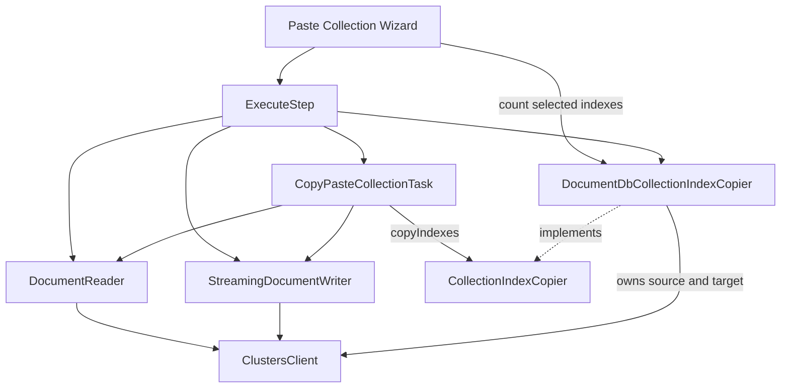
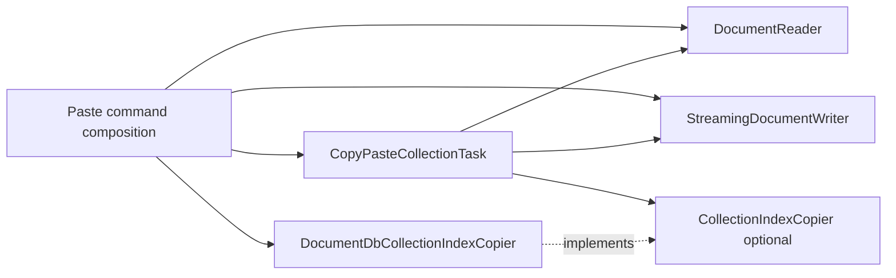
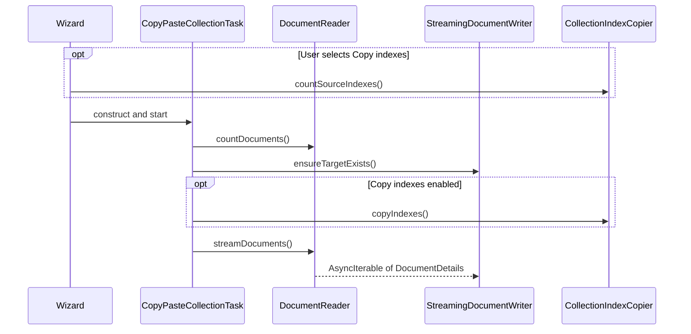

# Copy and Paste Collections Design

## Scope

This document records the intended component boundaries for collection copy/paste. It begins after
the feature and most of its technical documentation already existed. It therefore links to, rather
than replaces, the implementation-oriented [Task Service](../../../../src/services/taskService/README.md)
and [Data API](../../../../src/services/taskService/data-api/README.md) READMEs.

Code and tests are authoritative for current behavior. This document records the implemented
component boundary and the reason its scope is deliberately narrower than cross-database index
migration.

## Current architecture



### Document transfer

`DocumentReader` exposes document counting and an asynchronous document stream. `BaseDocumentReader`
owns optional keep-alive behavior while concrete readers own database access.

`StreamingDocumentWriter` owns buffering, adaptive batch sizing, retry, statistics, and progress.
Concrete writers provide target creation, batch writes, error classification, and partial-progress
extraction.

This is a useful database boundary for the data plane: the task coordinates opaque
`DocumentDetails` without interpreting provider-specific document content.

### Index transfer

`CopyPasteCollectionTask` depends on one optional `CollectionIndexCopier`. The DocumentDB API
implementation owns source and target endpoint descriptors and the complete comparison and creation
algorithm. Source index counting acquires only the source client; copying acquires both clients.

The copier contains DocumentDB API details such as `_id` exclusion, ordered key definitions, vector
options, background creation, and create-then-hide behavior. Neither the task nor the shared copier
contract exposes those definitions.

## Chosen boundary

The task will receive one optional copier:

```typescript
export interface CollectionIndexCopier {
    countSourceIndexes(signal?: AbortSignal): Promise<number>;

    copyIndexes(options?: CopyIndexesOptions): Promise<IndexCopyResult>;
}
```

The implemented ownership rules are:

- one copier instance owns the complete source-to-target index operation;
- the task knows progress and result contracts, not index definitions or database clients;
- the copier owns index discovery, equivalence, collision handling, creation, and post-creation
  state changes;
- index processing remains bounded and sequential;
- the dependency is optional because document-only copy must not touch index APIs;
- index counting still occurs only after the user chooses to copy indexes.



`DocumentDbCollectionIndexCopier` is DocumentDB API-specific and owns two `ClustersClient`-backed
collection endpoints. This removes concrete index types from the task without introducing a generic
index model before one is required.

## Execution order



The target must exist before indexes are created. Index creation must finish before document
streaming starts. An index failure fails the task; cancellation leaves indexes already created on
the target and prevents document transfer.

## Cross-database scope

The chosen copier deliberately optimizes for the operation currently supported: copying indexes
between collections whose index semantics are understood by one implementation. It does not expose
an intermediate index representation and does not promise cross-database index translation.

This does not prevent cross-database document transfer. Source and target document implementations
remain independent. It does mean that cross-database **index** migration must not be added by
forcing unlike providers through `CollectionIndexCopier`.

Revisit the boundary when there is an approved requirement to translate indexes between different
database families. At that point, split the operation into source catalog extraction, translation or
planning, and target creation, with explicit unsupported and lossy outcomes. The proposed shape and
the reason it was deferred are recorded in [decision 0003](./decisions.md#0003--defer-a-portable-index-model-until-cross-database-index-migration-is-required).
