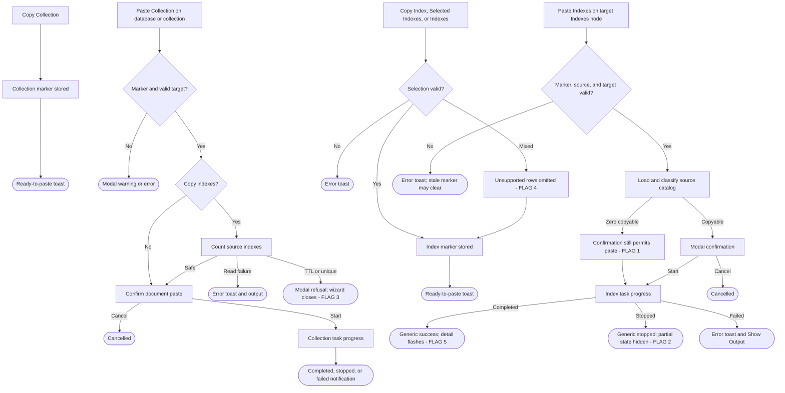

# Copy and Paste Indexes - UX Review Pack

> **Who this is for:** anyone about to do a hands-on UX review of the **Copy and Paste
> Indexes** feature, or anyone triaging the findings.
> **What this is:** a single catch-up document that captures a round of runtime UX feedback,
> states what the code _actually does today_ (verified against the current branch), and - for
> each item - offers a **suggestion** and a **status**. Items are **sorted by priority**
> (P0 -> P3).

- **Feature area:** `package.json`, `src/commands/copyIndexes/**`,
  `src/commands/pasteCollection/**`, `src/commands/pasteIndexes/**`,
  `src/services/CopyPasteBufferService.ts`, and the copy/paste Task Service tasks
- **PR / branch:** [microsoft/vscode-documentdb#848](https://github.com/microsoft/vscode-documentdb/pull/848)
  · `copilot/add-copy-indexes-feature`
- **Related design docs:** [feature overview](../README.md), [design](../design.md),
  [decisions](../decisions.md), and [user guide](../../../../user-manual/copy-and-paste.md)
- **Scope:** the UX-facing surface (tree commands, wording, wizard flow, confirmation,
  progress, cancellation, completion, and error recovery). Backend internals appear only where
  they explain a user-visible symptom.
- **Review date:** 2026-09-18

## How this review was run

The preparation phase inventoried the current branch and traced every user action to its terminal
state. The operator then exercised and tested the real feature, reviewed all five pre-assessment
flags, and accepted the current behavior. Each item is closed as a non-issue for present usage,
with the option to revisit it if usage grows and user evidence justifies the change. Items are
grouped and ordered **by priority**; each carries an **Observation**, a
**Finding**, a **Suggestion**, and a **Status**. Heavier design questions with real trade-offs are
pulled into [Open ideas](#open-ideas---options-pros--cons).

## Legend

### Priority

| Priority | Meaning                                            |
| -------- | -------------------------------------------------- |
| **P0**   | Blocking - the user gets stuck                     |
| **P1**   | Broken / misleading, or a consistency & safety gap |
| **P2**   | Polish, expectation, or a smaller feature gap      |
| **P3**   | Nice-to-have / cosmetic / acknowledged             |

### Status

| Status             | Meaning                                                                  |
| ------------------ | ------------------------------------------------------------------------ |
| 🟠 **Open**        | Recorded + analyzed; carries a recommendation but stays a _suggestion_   |
| 🟡 **Open (soft)** | Open, but depends on an investigation or is a soft "leave as-is"         |
| ✅ **Implemented** | Changed on this branch and verified (Decision + commit link recorded)    |
| 🚫 **Closed**      | Won't fix - with a mandatory one-line reason                             |
| 🔗 **Tracked**     | Deferred to a repo issue (linked); dropped from the active priority list |

> **Items are worked in iterations.** Anything still 🟠 Open at the end of an iteration
> **moves to the next one** - an item leaves this ledger only as ✅ Implemented, 🚫 Closed,
> or 🔗 Tracked. Each fix records **why it was chosen** (Decision) and **how it was done**
> (Implemented + commit link).

### Markers (inline)

| Marker            | Meaning                                                 |
| ----------------- | ------------------------------------------------------- |
| ⚠️ **Flag**       | Confirmed gap or bug                                    |
| 💡 **Suggestion** | A design/wording recommendation to react to             |
| 🔍 **Answered**   | A "how does this work?" question answered from the code |

> **For the operator:** items below are **Open** by default. Each recommendation is a
> suggestion, not a final decision. Disagree freely; where there are real trade-offs, see
> [Open ideas](#open-ideas---options-pros--cons).

---

## User interaction map

Where every user action **starts** and where it **terminates**. Divergent or misleading
terminations are flagged here and should be re-checked live.

**ASCII flow**

```text
Collection -> Copy Collection -> marker stored -> ready-to-paste toast
    |
Database/Collection -> Paste Collection
    -> no marker / same target -------------------------> modal warning/error
    -> target name or conflict policy
    -> documents only -> confirm -> task progress ------> completed/stopped/failed notification
    -> copy indexes -> count source indexes
         -> read failure -------------------------------> error toast + output
         -> TTL/unique found ---------------------------> modal error; wizard closes [FLAG 3]
         -> safe indexes -> confirm -> task progress ---> completed/stopped/failed notification

Index row(s)/Indexes node -> Copy Index/Selected Indexes/Indexes
    -> invalid single/cross-collection selection -------> error toast
    -> mixed selection -> unsupported rows omitted -----> retained-count toast [FLAG 4]
    -> parent scope ------------------------------------> ready-to-paste toast (catalog not loaded)
         |
Indexes node -> Paste Indexes
    -> missing/stale source ----------------------------> error toast; stale marker cleared
    -> source equals target ----------------------------> error toast
    -> load and classify
         -> zero copyable indexes -> confirm -> task ---> successful no-op [FLAG 1]
         -> copyable indexes -> modal confirmation -> task progress
              -> completed -----------------------------> generic success; result detail flashes [FLAG 5]
              -> stopped -------------------------------> generic stopped; partial state hidden [FLAG 2]
              -> failed --------------------------------> error toast + Show Output
```

**Mermaid**



**Interaction inventory**

| # | User action (entry) | Where it lives | Terminal state(s) | Surface | ⚠️ |
| - | ------------------- | -------------- | ----------------- | ------- | -- |
| 1 | Copy Collection on a collection | [package.json](../../../../../package.json#L1306) | Marker stored; ready-to-paste toast; Cancel Copy clears it | Tree + toast | |
| 2 | Paste Collection on a database | [package.json](../../../../../package.json#L1150) | Name, index choice, confirmation, then task; or modal/error/cancel | Tree + wizard + task notification | |
| 3 | Paste Collection on a collection | [package.json](../../../../../package.json#L1312) | Conflict choice, index choice, confirmation, then task; or modal/error/cancel | Tree + wizard + task notification | |
| 4 | Copy Index on one copyable index | [package.json](../../../../../package.json#L1228) | Marker stored and ready-to-paste toast; defensive errors for unsupported rows | Tree + toast | |
| 5 | Copy Selected Indexes on a multi-selection | [package.json](../../../../../package.json#L1234) | Copyable same-collection subset stored; invalid source mix errors | Tree + toast | ⚠️ 4 |
| 6 | Copy Indexes on an Indexes parent | [package.json](../../../../../package.json#L1216) | Live parent scope stored without loading the catalog | Tree + toast | ⚠️ 1 |
| 7 | Paste Indexes on a target Indexes parent | [package.json](../../../../../package.json#L1222) | Load, modal confirmation, task progress, then completion/stopped/error notification | Tree + wizard + task notification | ⚠️ 1, 2, 5 |
| 8 | Cancel a running task | [taskProgressReportingService.ts](../../../../../src/services/taskService/UI/taskProgressReportingService.ts#L103) | Stopping progress, then stopped notification | Progress notification + output | ⚠️ 2 |

## The story in one paragraph

PR #848 adds optional index recreation to Paste Collection and a dedicated Copy/Paste Indexes
workflow for existing collections. The flows consistently use modal confirmation before writes and
the shared Task Service supplies cancellable progress plus terminal notifications. The operator
reviewed and tested all five pre-assessment flags and found the current behavior acceptable for the
feature's present usage. No product changes are requested; the ideas remain documented for possible
reconsideration if usage grows.

## Priority index

| # | Priority | Item | Status |
| - | -------- | ---- | ------ |
| 1 | **P1** | A known-empty index selection can report success | 🚫 Closed |
| 2 | **P1** | Stopped notification hides partial target changes | 🚫 Closed |
| 3 | **P2** | TTL/unique refusal forces a full wizard restart | 🚫 Closed |
| 4 | **P2** | Mixed selection silently omits unsupported rows | 🚫 Closed |
| 5 | **P2** | Dedicated paste result summary is replaced immediately | 🚫 Closed |

## P0 - Blocking (the user gets stuck)

No P0 candidates were found during pre-assessment.

## P1 - Broken / misleading, or consistency & safety

### 1. A known-empty index selection can report success ⚠️

**Priority:** P1 · **Status:** 🚫 Closed

**Observation:** The operator reviewed and tested this flow and considers the current behavior a
non-issue at present usage.

**Finding:**

- ⚠️ The parent copy command stores an unresolved `allIndexes` scope and says that copyable
  secondary indexes are ready without first loading the catalog
  ([copyIndexes.ts](../../../../../src/commands/copyIndexes/copyIndexes.ts#L82)).
- ⚠️ Paste-time loading can resolve that scope to zero names. The confirmation correctly says
  there are no copyable indexes, but still presents the **Paste Indexes** action
  ([ConfirmPasteIndexesStep.ts](../../../../../src/commands/pasteIndexes/ConfirmPasteIndexesStep.ts#L13),
  [ConfirmPasteIndexesStep.ts](../../../../../src/commands/pasteIndexes/ConfirmPasteIndexesStep.ts#L58)).
- ⚠️ The task treats an empty operation as successful; existing coverage explicitly expects this
  behavior ([CopyIndexesTask.test.ts](../../../../../src/services/taskService/tasks/copy-indexes/CopyIndexesTask.test.ts#L111)).

💡 **Suggestion:** once loading proves that nothing can be copied, terminate with an informational
message that explains the exclusions instead of offering a task that reports success. See [O1](#o1-how-should-a-zero-copyable-parent-scope-terminate-item-1).

> **Decision (Iteration 1):** Close as a non-issue / won't fix. **Reason:** the operator reviewed
> and tested the current behavior and does not consider a change justified at present usage. Revisit
> if usage grows and user evidence makes the extra handling worthwhile.

### 2. Stopped notification hides partial target changes ⚠️

**Priority:** P1 · **Status:** 🚫 Closed

**Observation:** The operator reviewed and tested this flow and considers the current behavior a
non-issue at present usage.

**Finding:**

- ⚠️ Confirmation warns that cancellation does not remove created indexes
  ([ConfirmPasteIndexesStep.ts](../../../../../src/commands/pasteIndexes/ConfirmPasteIndexesStep.ts#L83)).
- ⚠️ The task computes the useful terminal detail - `Stopped after X/Y indexes. Created indexes
  remain on the target.` - and writes it to progress and the output channel
  ([CopyIndexesTask.ts](../../../../../src/services/taskService/tasks/copy-indexes/CopyIndexesTask.ts#L115)).
- ⚠️ The shared terminal notification ignores that status detail and only says the named task
  `was stopped` ([taskProgressReportingService.ts](../../../../../src/services/taskService/UI/taskProgressReportingService.ts#L321)).

💡 **Suggestion:** make the stopped terminal surface retain the partial-result warning and offer
**Show Output**, while preserving the shared Task Service behavior for unrelated tasks.

> **Decision (Iteration 1):** Close as a non-issue / won't fix. **Reason:** the operator reviewed
> and tested the current behavior and does not consider a change justified at present usage. Revisit
> if usage grows and user evidence makes stronger cancellation feedback worthwhile.

## P2 - Polish, expectation, or feature gap

### 3. TTL/unique refusal forces a full wizard restart ⚠️

**Priority:** P2 · **Status:** 🚫 Closed

**Observation:** The operator reviewed and tested this flow and considers the current behavior a
non-issue at present usage.

**Finding:**

- 🔍 Refusing document-affecting indexes is an accepted safety decision; this review does not
  challenge it ([decisions.md](../decisions.md#0026--refuse-document-affecting-indexes-during-collection-paste)).
- ⚠️ After loading discovers such indexes, the modal tells the user to choose **No, only copy
  documents**, then throws `UserCancelledError`, which closes the wizard instead of returning to
  the preceding choice ([CountSourceIndexesStep.ts](../../../../../src/commands/pasteCollection/CountSourceIndexesStep.ts#L68)).

💡 **Suggestion:** keep the safety refusal, but offer a documents-only continuation or return to
the index-choice step so target naming and conflict choices do not need to be repeated.

> **Decision (Iteration 1):** Close as a non-issue / won't fix. **Reason:** the operator reviewed
> and tested the restart flow and does not consider additional wizard recovery justified at present
> usage. Revisit if usage grows and repeated restarts become a demonstrated source of friction.

### 4. Mixed selection silently omits unsupported rows ⚠️

**Priority:** P2 · **Status:** 🚫 Closed

**Observation:** The operator reviewed and tested this flow and considers the current behavior a
non-issue at present usage.

**Finding:**

- 🔍 Filtering `_id`, keyless indexes, and field rows is the accepted interaction model
  ([decisions.md](../decisions.md#0025--filter-index-tree-multi-selection-into-one-source-subset)).
- ⚠️ The copy notification only reports the retained count. It does not say that selected rows
  were omitted or why ([copyIndexes.ts](../../../../../src/commands/copyIndexes/copyIndexes.ts#L27),
  [copyIndexes.ts](../../../../../src/commands/copyIndexes/copyIndexes.ts#L59)).

💡 **Suggestion:** preserve permissive filtering, but mention the omitted count or names when the
retained set differs from the selected set.

> **Decision (Iteration 1):** Close as a non-issue / won't fix. **Reason:** the operator reviewed
> and tested mixed selection and considers the retained-count notification sufficient at present
> usage. Revisit if usage grows and omission confusion appears in user feedback.

### 5. Dedicated paste result summary is replaced immediately ⚠️

**Priority:** P2 · **Status:** 🚫 Closed

**Observation:** The operator reviewed and tested this flow and considers the current behavior a
non-issue at present usage.

**Finding:**

- ⚠️ `CopyIndexesTask` builds a detailed final summary and reports it at 100 percent
  ([CopyIndexesTask.ts](../../../../../src/services/taskService/tasks/copy-indexes/CopyIndexesTask.ts#L127)).
- ⚠️ Returning from the task immediately changes the status message to **Task completed
  successfully**, and the final notification also uses only generic success wording
  ([taskService.ts](../../../../../src/services/taskService/taskService.ts#L337),
  [taskProgressReportingService.ts](../../../../../src/services/taskService/UI/taskProgressReportingService.ts#L318)).
- 🔍 The collection-paste sibling deliberately pauses after index creation so that its phase result
  remains perceptible ([CopyPasteCollectionTask.ts](../../../../../src/services/taskService/tasks/copy-and-paste/CopyPasteCollectionTask.ts#L455)).

💡 **Suggestion:** retain the dedicated result totals in the terminal notification or add a short,
cancellation-aware presentation interval before generic completion.

> **Decision (Iteration 1):** Close as a non-issue / won't fix. **Reason:** the operator reviewed
> and tested the completion experience and considers the current task and output surfaces sufficient
> at present usage. Revisit if usage grows and persistent result summaries become valuable.

## P3 - Nice-to-have / cosmetic / acknowledged

No P3 candidates were found during pre-assessment.

## Implemented

No product changes were needed. The operator reviewed and tested every pre-assessment item and
closed all five as current non-issues.

## Iteration log

A running record of each fix pass. Items still 🟠 Open at the end of an iteration roll into the
next one; nothing is dropped without a terminal status.

### Iteration 1

| # | Item | Decision (why) | Outcome |
| - | ---- | -------------- | ------- |
| 1 | Empty index selection | Current behavior is acceptable at present usage | 🚫 Closed - revisit if usage grows |
| 2 | Partial-state cancellation feedback | Current feedback is sufficient at present usage | 🚫 Closed - revisit if usage grows |
| 3 | TTL/unique restart flow | Additional recovery is not justified at present usage | 🚫 Closed - revisit if usage grows |
| 4 | Mixed-selection filtering | Retained-count feedback is sufficient at present usage | 🚫 Closed - revisit if usage grows |
| 5 | Dedicated result summary | Existing task/output feedback is sufficient at present usage | 🚫 Closed - revisit if usage grows |

## Open ideas - options, pros & cons

Genuinely open design questions with real trade-offs. Recommendations are suggestions to react to,
not decisions.

### O1. How should a zero-copyable parent scope terminate? (item 1)

| Option | Pros | Cons |
| ------ | ---- | ---- |
| **A. Stop after loading with an informational modal** | No false-success task; exclusions can remain visible | Adds a distinct terminal surface |
| **B. Return to the target tree with a toast** | Fast exit; consistent with command-level validation | Exclusion detail may be harder to inspect |
| **C. Keep the confirmation and relabel the action** | Preserves the current flow and source/target detail | Still creates a task that cannot change the target |

> 💡 **Suggested:** Option A, because the wizard already has the complete exclusion report and can
> explain why no operation will run.

## Appendix A - current flow (reference)

### Collection paste

1. **Copy Collection** stores the source tree node and shows a reusable-marker notification.
2. **Paste Collection** validates the marker and target, estimates source size, then optionally
   warns for large collections.
3. A database target asks for a new collection name; an existing collection asks for document
   conflict behavior.
4. The wizard asks whether to copy indexes. Documents-only skips the source index API entirely.
5. Index-enabled paste loads the source summary. Read failure terminates through the command error
   surface; TTL or unique indexes terminate through a dedicated modal and require a restart.
6. A modal summarizes source, target, conflict policy, and available index count.
7. Task Service shows cancellable notification progress, refreshes tree descriptions, and produces
   completed, stopped, or failed terminal notifications.

### Dedicated index paste

1. **Copy Index**, **Copy Selected Indexes**, or **Copy Indexes** stores a stable source descriptor
   and immutable named scope or live parent scope. The `documentdb.hasCopiedIndexes` context key
   exposes **Paste Indexes** on Indexes parents.
2. Paste validates source credentials and rejects the source collection as its own target.
3. Loading revalidates the source collection, reads ordinary and best-effort search catalogs,
   classifies exclusions, freezes the selected names, and computes TTL/unique warnings.
4. A modal shows source, target, selected or copyable counts, known exclusions, collision behavior,
   partial-cancellation behavior, and document-affecting warnings.
5. Task Service creates indexes sequentially with determinate progress. Equivalent definitions and
   same-key option conflicts are skipped; different-key name collisions are renamed.
6. Completion, cancellation, and failure all refresh the target Indexes node. The copied marker is
   intentionally retained after success so the same scope can be pasted into another target.
