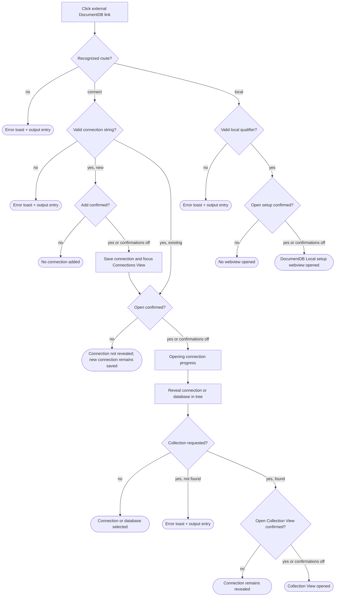

# Deep-link verbs — UX Review Pack

> **Who this is for:** anyone about to do a hands-on UX review of the **deep-link verbs**
> feature, or anyone triaging the findings.
> **What this is:** a single catch-up document that captures the pre-assessment and a round of
> runtime UX feedback, states what the code _actually does today_ (verified against the current
> branch), and — for each item — offers a **suggestion** and a **status**. Items are **sorted by
> priority** (P0 → P3).

- **Feature area:** [`src/vscodeUriHandler.ts`](../../../../../src/vscodeUriHandler.ts),
  [`src/extension.ts`](../../../../../src/extension.ts), and
  [`docs/user-manual/how-to-construct-url.md`](../../../../user-manual/how-to-construct-url.md)
- **PR / branch:** [microsoft/vscode-documentdb#898](https://github.com/microsoft/vscode-documentdb/pull/898) · `dev/guanzhousong/deep-link-verbs`
- **Reviewed commit:** [`8069d189`](https://github.com/microsoft/vscode-documentdb/commit/8069d189e0f5dad44e311cba7ce7198b4b398a3c)
- **Related design docs:** [Deep Links](../README.md) · [Deep-link decisions](../decisions.md)
- **Scope:** the UX-facing surface (external URL entry, route validation, confirmations, progress,
  navigation, errors, and cancellation). Backend internals appear only where they explain a
  user-visible symptom.
- **Review date:** 2026-09-01

## How this review was run

This document is currently at the **pre-assessment** stage. An AI assistant inventoried the
interaction paths, traced each terminal state at the reviewed commit, and seeded code-backed flags.
The hands-on pass is still pending: a person should exercise each journey and dictate what they
observe, after which each item can be confirmed, reprioritized, or closed. Items are grouped and
ordered **by priority**; each carries an **Observation**, a **Finding**, a **Suggestion**, and a
**Status**. Heavier design questions with real trade-offs are pulled into
[Open ideas](#open-ideas--options-pros--cons).

## Legend

### Priority

| Priority | Meaning                                            |
| -------- | -------------------------------------------------- |
| **P0**   | Blocking — the user gets stuck                     |
| **P1**   | Broken / misleading, or a consistency & safety gap |
| **P2**   | Polish, expectation, or a smaller feature gap      |
| **P3**   | Nice-to-have / cosmetic / acknowledged             |

### Status

| Status             | Meaning                                                                  |
| ------------------ | ------------------------------------------------------------------------ |
| 🟠 **Open**        | Recorded + analyzed; carries a recommendation but stays a _suggestion_   |
| 🟡 **Open (soft)** | Open, but depends on an investigation or is a soft "leave as-is"         |
| ✅ **Implemented** | Changed on this branch and verified (Decision + commit link recorded)    |
| 🚫 **Closed**      | Won't fix — with a mandatory one-line reason                             |
| 🔗 **Tracked**     | Deferred to a repo issue (linked); dropped from the active priority list |

> **Items are worked in iterations.** Anything still 🟠 Open at the end of an iteration
> **moves to the next one** — an item leaves this ledger only as ✅ Implemented, 🚫 Closed,
> or 🔗 Tracked. Each fix records **why it was chosen** (Decision) and **how it was done**
> (Implemented + commit link).

### Markers (inline)

| Marker            | Meaning                                                 |
| ----------------- | ------------------------------------------------------- |
| ⚠️ **Flag**       | Confirmed gap or bug                                    |
| 💡 **Suggestion** | A design/wording recommendation to react to             |
| 🔍 **Answered**   | A "how does this work?" question answered from the code |

> **For the operator:** items below are **Open** by default — each records a recommendation
> that is a **suggestion, not a final decision**. Disagree freely; where there are real
> trade-offs, see [Open ideas](#open-ideas--options-pros--cons).

---

## User interaction map _(seed now)_

Where every user action **starts** and where it **terminates**. Failure surfaces are called out so
their consistency can be re-checked live.

**ASCII flow**

```text
External vscode:// link
|
+-- path is empty or /connect[/qualifiers]
|   +-- missing/invalid connectionString -> non-modal error toast + output entry
|   +-- valid connectionString
|       +-- new connection
|       |   +-- add confirmation dismissed -> no connection added
|       |   +-- accepted / confirmations disabled -> connection saved + Connections View focused
|       +-- existing connection -> no storage change
|       +-- open confirmation dismissed -> connection is not revealed
|       +-- accepted / confirmations disabled -> progress notification -> connection revealed
|           +-- no collection target -> selected tree destination
|           +-- collection target missing -> non-modal error toast + output entry
|           +-- collection target found
|               +-- Collection View confirmation dismissed -> connection remains revealed
|               +-- accepted / confirmations disabled -> Collection View opened
|
+-- /local or /local/documentdb
|   +-- confirmation dismissed -> no webview opened
|   +-- accepted / confirmations disabled -> DocumentDB Local setup webview opened
|
+-- unknown verb or invalid local qualifier -> non-modal error toast + output entry
```

**Mermaid**



**Interaction inventory**

| #   | User action (entry)                        | Where it lives                                                              | Terminal state(s)                                                | Surface                         | ⚠️                                   |
| --- | ------------------------------------------ | --------------------------------------------------------------------------- | ---------------------------------------------------------------- | ------------------------------- | ------------------------------------ |
| 1   | Open a legacy no-path connection link      | [`globalUriHandler`](../../../../src/vscodeUriHandler.ts#L124)              | Same connect flow as `/connect`                                  | modal / tree / progress / toast |                                      |
| 2   | Open `/connect` with a new connection      | [`handleConnectionStringRequest`](../../../../src/vscodeUriHandler.ts#L283) | connection saved; then revealed or left saved after cancellation | modal / tree / progress         | ⚠️ target is not identified          |
| 3   | Open `/connect` for an existing connection | [`handleConnectionStringRequest`](../../../../src/vscodeUriHandler.ts#L283) | existing connection revealed or no-op after cancellation         | modal / tree / progress         | ⚠️ target is not identified          |
| 4   | Include database and collection parameters | [`handleConnectionStringRequest`](../../../../src/vscodeUriHandler.ts#L469) | Collection View, revealed connection, or error toast             | modal / webview / toast         | ⚠️ invalid dependency can be ignored |
| 5   | Open `/local` or `/local/documentdb`       | [`handleLocalQuickStartRequest`](../../../../src/vscodeUriHandler.ts#L247)  | setup webview or no-op after cancellation                        | modal / webview                 |                                      |
| 6   | Open an unknown verb                       | [`parseDeepLinkRoute`](../../../../src/vscodeUriHandler.ts#L187)            | error toast + output entry                                       | toast / output                  |                                      |
| 7   | Open an invalid local resource route       | [`parseLocalResourceType`](../../../../src/vscodeUriHandler.ts#L217)        | error toast + output entry                                       | toast / output                  |                                      |

**Failure-surface consistency check**

| Failure                                 | Feature-owned result   | Shared wrapper result                | Consistent? |
| --------------------------------------- | ---------------------- | ------------------------------------ | ----------- |
| Unknown verb                            | localized thrown error | non-modal error toast + output entry | Yes         |
| Invalid local resource type/path        | localized thrown error | non-modal error toast + output entry | Yes         |
| Missing/invalid connection string       | localized thrown error | non-modal error toast + output entry | Yes         |
| Connection or collection lookup failure | localized thrown error | non-modal error toast + output entry | Yes         |

🔍 **Answered:** there is no modal/toast/silent asymmetry among thrown deep-link failures. The
shared `callWithTelemetryAndErrorHandling` wrapper consistently writes to the output channel and
shows a non-modal error toast. Cancellation branches return silently, which is normal for dismissed
native confirmation dialogs and should be checked for state clarity during the hands-on pass.

---

## The story in one paragraph

The PR turns the handler from a connection-only endpoint into a small, allow-listed router:
legacy links and `/connect` enter the existing connection flow, while `/local` opens the
DocumentDB Local setup after one lightweight confirmation. Routing failures use one consistent
toast-and-output surface. The main pre-assessment risks are that malformed `connect` routes and
invalid collection parameter combinations still perform partial work, and that connection
confirmations do not identify the target supplied by an untrusted external link.

---

## Priority index

| #   | Priority | Item                                                   | Status  |
| --- | -------- | ------------------------------------------------------ | ------- |
| 1   | **P1**   | `/connect` silently accepts path qualifiers            | 🟠 Open |
| 2   | **P1**   | Connection confirmation does not identify the target   | 🟠 Open |
| 3   | **P1**   | `collection` without a database can silently degrade   | 🟠 Open |
| 4   | **P2**   | Malformed-link errors lead with internal "URI" wording | 🟠 Open |

---

## P0 — Blocking (the user gets stuck)

No P0 items were pre-discovered.

## P1 — Broken / misleading, or consistency & safety

### 1. `/connect` silently accepts path qualifiers ⚠️

**Priority:** P1 · **Status:** 🟠 Open

**Observation:** Code inspection shows that `/connect/anything` is treated as `/connect` and can
add or open a connection. Confirm live with a harmless local test connection.

**Finding:**

- ⚠️ [`parseDeepLinkRoute`](../../../../src/vscodeUriHandler.ts#L187) preserves every segment after
  the verb as `qualifiers`, but the `connect` branch at
  [`globalUriHandler`](../../../../src/vscodeUriHandler.ts#L152) never validates or consumes them.
- The public manual says an unrecognized action is refused so a mistyped link never acts on
  unintended parameters ([Action routing](../../../user-manual/how-to-construct-url.md#L156)).
- The accepted local-routing decision says unknown types and additional qualifiers are rejected
  rather than silently performing a different action
  ([decision 0006](../../features/deep-links/decisions.md#0006--local-links-model-the-resource-type)).

💡 **Suggestion:** Require zero qualifiers for `connect` and reject extra path segments before
extracting the connection string or performing any side effect. Add route tests for
`/connect/anything` and `/connect/extra/path`.

### 2. Connection confirmation does not identify the target ⚠️

**Priority:** P1 · **Status:** 🟠 Open

**Observation:** Before storing or opening a connection supplied by an external page, the modal
only says that a DocumentDB connection will be opened or added. The user cannot tell which host or
saved connection they are approving. Confirm live with two visibly different local endpoints.

**Finding:**

- ⚠️ The new-connection confirmation is shown after the connection string has been parsed and the
  display label has been calculated, but it uses only generic text
  ([new connection confirmation](../../../../src/vscodeUriHandler.ts#L349)).
- ⚠️ The existing-connection confirmation is also generic
  ([open connection confirmation](../../../../src/vscodeUriHandler.ts#L408)). An external link is
  untrusted input, so the user needs a non-secret target preview to give informed consent.
- The first accepted action can store the connection string in secret storage and focus the
  Connections View before the second confirmation. This is disclosed as a side effect, but its
  target is not.

💡 **Suggestion:** Show a sanitized target summary in the confirmation detail: connection label or
host(s), optional database/collection destination, and whether the link will add a new connection
or open an existing one. Never display the password or full connection string. See
[O1](#o1-how-much-of-the-connection-target-should-the-confirmation-preview-item-2).

### 3. `collection` without a database can silently degrade ⚠️

**Priority:** P1 · **Status:** 🟠 Open

**Observation:** A link with `collection=orders` but no resolvable database still adds or opens the
connection, then ends at the connection instead of opening the requested collection. No message
explains that part of the request was ignored.

**Finding:**

- ⚠️ The handler only enters collection verification when both `selectedDatabase` and
  `params.collection` are truthy
  ([collection branch](../../../../src/vscodeUriHandler.ts#L469)). It does not reject a collection
  parameter whose database dependency is absent.
- The public parameter table says `collection` requires a `database` parameter
  ([Supported Parameters](../../../user-manual/how-to-construct-url.md#L49)), while the code also
  accepts a database embedded in the connection-string path. Neither case justifies silently
  ignoring an unresolved collection target.
- Validation happens after the connection can be saved, so the malformed request can leave a
  partial side effect even though it did not reach the destination named by the link.

💡 **Suggestion:** Resolve the database first, then reject `collection` when no database is
available, before confirmations or storage changes. Clarify in the manual whether a database in
the connection string satisfies the dependency, and add tests for both cases.

## P2 — Polish, expectation, or feature gap

### 4. Malformed-link errors lead with internal "URI" wording ⚠️

**Priority:** P2 · **Status:** 🟠 Open

**Observation:** Invalid routes ultimately display messages such as "Failed to process URI: This
DocumentDB link...". The actionable part is present, but it follows an implementation-oriented
prefix and uses a different term from the confirmations and manual.

**Finding:**

- ⚠️ Every route error is wrapped with `Failed to process URI: {0}` before the shared wrapper shows
  it ([error wrapper](../../../../src/vscodeUriHandler.ts#L171)).
- User-facing confirmation and documentation consistently say "link"; "URI" is internal
  terminology and the extra failure prefix adds no recovery information.
- 🔍 The underlying new route messages are otherwise actionable: unknown actions suggest checking
  for an update or verifying the link, while invalid local paths name the supported forms.

💡 **Suggestion:** Surface the localized underlying message directly and keep failure-stage context
in telemetry/output diagnostics. If a prefix is retained, use the user-facing term "link" and avoid
restating that processing failed.

## P3 — Nice-to-have / cosmetic / acknowledged

No P3 items were pre-discovered.

## Implemented

No UX-review items have been implemented yet.

---

## Iteration log

A running record of each fix pass. Items still 🟠 Open at the end of an iteration roll into the
next one; nothing is dropped without a terminal status.

No implementation iteration has started.

---

## Open ideas — options, pros & cons

Genuinely open design questions with real trade-offs. Recommendations are suggestions to react to,
not decisions.

### O1. How much of the connection target should the confirmation preview? (item 2)

| Option                             | Pros                                                            | Cons                                                            |
| ---------------------------------- | --------------------------------------------------------------- | --------------------------------------------------------------- |
| **A. Display label/host only**     | Compact; makes the external target recognizable; avoids secrets | Database/collection destination remains implicit                |
| **B. Label/host plus destination** | Gives complete informed consent for automatic navigation        | Longer modal; needs careful truncation for long names           |
| **C. Keep generic copy**           | Shortest flow; no accidental display of connection metadata     | User cannot distinguish a trusted target from an unexpected one |

> 💡 **Suggested:** **B**, with bounded/truncated fields and no password, because the modal is the
> only review point before the handler stores or opens external content.

---

## Appendix A — current flow (reference)

### Route and error behavior

1. VS Code activates the extension and passes the URL to `globalUriHandler`.
2. An empty path permanently defaults to `connect`; recognized verbs are matched
   case-insensitively.
3. Unknown verbs, invalid local qualifiers, invalid connection parameters, and downstream lookup
   failures all throw localized errors.
4. `callWithTelemetryAndErrorHandling` writes each thrown error to the output channel and shows a
   non-modal error toast. It does not rethrow to the URI registration boundary.

### Connect flow

1. Parse the connection string and optional destination, mask sensitive telemetry values, and
   detect an existing matching connection.
2. For a new connection, optionally confirm the storage change, focus the Connections View, save
   the connection, and refresh the tree.
3. Optionally confirm opening, then show notification and tree progress while revealing the
   connection or database.
4. When both database and collection resolve, optionally confirm and open the Collection View.
   Otherwise the flow ends at the revealed tree target; a requested collection without a database
   is currently ignored.

### Local flow

1. `/local` defaults to resource type `documentdb`; `/local/documentdb` names it explicitly.
2. Reject unsupported resource types and additional path segments before showing UI.
3. When URL confirmations are enabled, show one modal with **Open setup**; dismissal ends the flow
   without opening a panel.
4. Open or reveal the singleton DocumentDB Local setup webview. The deep link does not provision a
   resource by itself; provisioning decisions remain inside the setup experience.
