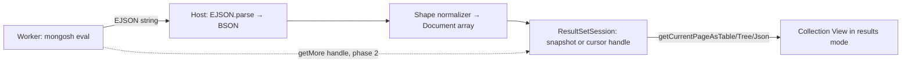

# Showing playground and shell results in Collection View–style views

The Collection View runs `find` queries and shows results as a table, tree, or JSON. The Query
Playground and the Interactive Shell show results only as EJSON text. This note asks what it would
take to present playground and shell results the way the Collection View does.

Short answer: the hard part is mostly done. Results already reach the extension host as typed BSON
documents. What is missing is everything around them: a data source the Collection View can read
from, paging, knowing which collection the results came from, and turning off actions that do not
apply.

## What already works

**Typed documents reach the extension host.** The worker turns the result into an EJSON string
(`playgroundWorker.ts`). The host parses it back with `EJSON.parse(..., { relaxed: false })`
(`PlaygroundEvaluator.ts`), so `ObjectId`, `Date`, `Decimal128`, `Long` and so on keep their real
types. Text is produced only at the very end, in `resultFormatter.ts` (playground) and
`ShellOutputFormatter.ts` (shell).

**The grid converters do not care where documents come from.** `toSlickGridTable`,
`toSlickGridTree` and `ClusterSession.getCurrentPageAsJson()` all take a `WithId<Document>[]`.

**Results sometimes say which collection they came from.** `ExecutionResult.source.namespace`
carries `{ db, collection }` for cursor results, together with `type` and `cursorHasMore`.

**There is already a way into the Collection View, but it re-runs the query.**
`playgroundOpenInCollectionView.ts` and the shell's "Open in Collection View" action line re-parse
the `find(...)` text (`parseFindExpression`) and run it again. They do not show the results already
produced, and only work for simple `find` calls.

## Challenges

### 1. The Collection View is tied to a live collection

Its router context is `clusterId + databaseName + collectionName + sessionId`. `ClusterSession`
re-runs `find` with skip/limit for every page, and the toolbar assumes it can edit and re-run the
query. A script result has no query that can be re-run safely: re-running a script may repeat
writes and may be slow.

**Missing:** a result-set abstraction to use instead of `ClusterSession` for this case, e.g. a
`ResultSetSession` with `getPage(n)`, `hasMore`, optional `namespace`, and an `editable` flag. The
`getCurrentPageAsTable/Tree/Json` procedures would read from it.

### 2. Paging and cursor lifetime

- **Playground:** each run gets a fresh context. One batch (`displayBatchSize`) comes back with
  `cursorHasMore`, and the cursor is gone when the run ends.
- **Shell:** the cursor lives in mongosh state inside the worker and is advanced with `it`. A grid
  pulling pages from the same cursor would interfere with the terminal.

**Missing:** pick one:

- **Snapshot:** show only the batch already returned, labelled "first N results, more available".
  Read-only, no paging.
- **Fetch up to a cap:** the worker converts the cursor to an array up to N documents (e.g. 1,000);
  the host pages through that in memory.
- **Cursor handles:** the worker keeps a registry of open cursors by ID; a new `getMore(handleId)`
  message fetches the next batch. Needs cleanup rules (timeout, panel closed, next shell eval,
  worker restart). Real paging, most work.

### 3. Not every result is a list of documents

`printable` can be a cursor batch, a single document, a number from `countDocuments()`, a string,
an array of plain values, an insert/update result, `explain` output, or help text. The converters
assume one document per row with an `_id`. Aggregation output often has no `_id`, or non-unique
`_id` values (e.g. after `$group`).

**Missing:** a normalizer from `printable` to `Document[]`:

- unwrap the cursor wrapper;
- wrap single values as `{ value: x }`;
- one row per element for arrays of plain values;
- fall back to text output for help and other non-data results;
- synthetic row IDs instead of relying on `_id`.

### 4. Edit, delete and view-document can be wrong for script results

These actions assume each row is the stored document in `db.collection`. That holds only for a plain
`find` on a single collection.

- With a projection, rows are partial. Viewing is fine (Document View loads by `_id`), editing in
  the grid is risky.
- For aggregations (`$project`, `$lookup`, `$group`), rows are computed. `source.namespace` names
  the collection the pipeline ran on, not where the rows live. Deleting by `_id` could hit the wrong
  documents.

**Missing:** a rule for when actions are allowed. Default to read-only. Allow edit/delete only when
the result type is `Cursor` from a `find`, the namespace is known, and every row has an `_id`.
Document View should always reload by `_id` before editing.

### 5. Which result to show

A playground block returns only its last expression; `print()` output goes to the output channel.
A block with three queries shows only the last one. Users will expect to see all of them.

**Missing:** either accept "last expression only" and say so in the UI, or collect intermediate
results (a runtime change — see the companion note).

### 6. Webview UI changes

The React Collection View calls `trpcClient.mongoClusters.collectionView.*` directly and always
shows the query editor and toolbar.

**Missing:** a "results mode" that hides the query editor, run/refresh and insert; shows where the
results came from (shell or playground line, time, batch info); and keeps table / tree / JSON and
path navigation. Alternative: a separate, lighter "Results View" webview that reuses the grid
components.

### 7. Snapshot timing and panel lifecycle

- **Shell:** results must be captured when the action line is printed; after `it` or another
  command they are gone. Keep a short history of recent results (e.g. last 5) in the host, keyed by
  an ID embedded in the terminal link.
- **Playground:** decide whether the grid replaces the text output, sits beside it, or opens on
  demand (CodeLens or setting), and whether each run opens a new panel or reuses one per file.

### 8. Size and performance

Results are serialized several times: worker → EJSON string → host parse → webview conversion.
Fine for 20–100 documents. A "fetch up to a cap" approach needs a hard limit and a visible
"results truncated" message.

### 9. Smaller points

- The Collection View JSON view uses `JSON.stringify`, not EJSON; the playground uses EJSON. Pick one.
- Telemetry for new entry points and result shapes, l10n for new strings, screen-reader
  announcements when the grid loads.

## Suggested phases

| Phase | Scope                                                                                                                                                                      | Effort                                    |
| ----- | -------------------------------------------------------------------------------------------------------------------------------------------------------------------------- | ----------------------------------------- |
| 1     | Read-only snapshot of the current batch: normalizer, `ResultSetSession`, Collection View "results mode", entry points from the shell action line and a playground CodeLens | Small to medium, mostly reuse             |
| 2     | Paging via worker cursor handles and `getMore`, plus cleanup rules                                                                                                         | Medium, mostly concurrency and cleanup    |
| 3     | Edit and delete when results are provably plain `find` documents                                                                                                           | Small once the rule in challenge 4 is set |

