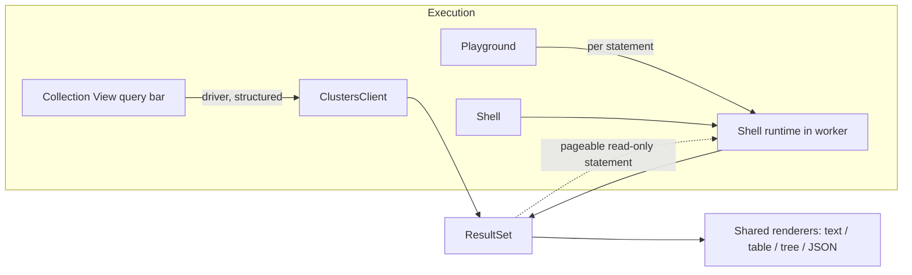

# Should every read run through the shell execution pipeline?

Companion to [01-result-views-research.md](./01-result-views-research.md). Question: instead of
bolting grid views onto playground and shell results, refactor first so that everything, including
the Collection View, runs through the shell execution pipeline rather than calling the driver
directly.

Short answer: it would give one execution path and make multi-result views natural, but it costs
speed, structured error codes, and the safety of the Collection View's current filter parsing,
which never runs code. Recommended: unify the **result side** now, and do not yet route Collection
View queries through mongosh.

## How other tools present results

Some database tools show one result pane per statement in a script, each with its own timing and a
view chosen by the result shape: a scalar (e.g. a `count()`) as plain text, a cursor as a tree with
table / JSON toggles and its own paging controls. Others put each result in a tab. Tabs versus
stacked panes is only a layout choice; both need a **list of results, one per statement**.

Per-pane paging in such tools is typically done by re-running that one statement with skip/limit,
not by keeping a live cursor. If a statement is a pure read returning a cursor (`find` /
`aggregate`), re-running just that statement with `.skip().limit()` is safe. That avoids cursor
lifetime management in the worker and matches the Collection View's existing paging model.
Statements that write are never re-run.

Today our runtime returns only the last expression's value (`evaluator.customEval(...)` in
`DocumentDBShellRuntime.ts`).

## What the full refactor would mean

The Collection View query bar would build
`db.getCollection(c).find(f, p).sort(s).skip(k).limit(l)` as text and evaluate it in the worker via
`DocumentDBShellRuntime`, instead of `ClustersClient.runFindQuery()`. One result type
(`ExecutionResult`) would feed every renderer.

Realistically only reads would move: find, aggregate, count, maybe explain. Tree loading, database
and collection listing, indexes, stats, import/export, Document View / upsert, and delete by `_id`
stay on the driver; generating and evaluating code for those adds nothing. So two paths remain
either way.

## Pros

1. **Same text, same meaning everywhere.** A filter behaves identically in the Collection View,
   playground and shell. "Open in Playground/Shell" becomes a lossless text copy; the current
   reverse handoff relies on the fragile `parseFindExpression`.
2. **One result model, one set of renderers.** Playground and shell get table / tree / JSON for
   free; multiple results per run become natural.
3. **A more capable query bar.** Users could type `aggregate([...])`, chained cursor methods and
   helpers — the Collection View becomes a one-statement playground with a grid.
4. **Heavy work leaves the extension host.** BSON decoding of large results happens in the worker.
   Cancellation could terminate the worker — a hard stop that actually works.
5. **One place for cross-cutting concerns:** batch size, console output, schema-store feeding.

## Cons and risks

1. **Security posture changes.** The Collection View filter currently goes through
   `parseShellBSON`, which parses without executing. Through mongosh the filter is JavaScript run in
   a `vm` context, and `vm` is not a security boundary. Acceptable when typed by the user (the
   playground already allows it), but any filter arriving from outside — URI handler, deep link,
   pre-filled query — would then **execute code**. Needs a "run only after explicit user action"
   rule and careful quoting of collection names and inputs in generated code.
2. **Performance (needs measuring).**
   - Worker start-up and a separate `MongoClient`: a second connection pool and a second
     authentication, painful with Entra / OIDC token flows.
   - Fresh mode creates a new `ShellInstanceState` per eval.
   - Every page adds an EJSON stringify/parse round trip before the existing webview conversions.
   - Paging, refresh and view switching are the Collection View's most frequent actions.
3. **Loss of structured errors.** The Collection View uses `QueryError` codes (`INVALID_FILTER`,
   `INVALID_PROJECTION`, `INVALID_SORT`) for targeted messages. mongosh errors have a different
   shape (syntax, rewriter, server), so a new error-mapping layer is needed, including for
   connection diagnostics.
4. **Query Insights and the index advisor would have to move too.** They depend on `explainFind`,
   `explainAggregate`, `explainCount` with structured parameters. `.explain()` via text returns
   shapes that vary by method and server.
5. **Tighter coupling to mongosh internals.** `ShellInstanceState`, the async rewriter and the
   service-provider shim are less stable than the driver API. mongosh upgrades and DocumentDB
   compatibility quirks would then affect the most-used feature.
6. **Paging still re-runs the query.** No gain there unless cursor handles are also built.
7. **Migration risk and cost.** The Collection View is stable and heavily tested against a mocked
   `ClustersClient`. Moving its read path touches query parsing, errors, telemetry, cancellation,
   Query Insights and tests — for a feature that works today.
8. **Credentials.** The connection string with password must be handed to another worker. The
   playground already does this, but it widens exposure.

## Recommended path: unify the result side

| Step | What                                                                                                                                                                                                   | Why                                                              |
| ---- | ------------------------------------------------------------------------------------------------------------------------------------------------------------------------------------------------------ | ---------------------------------------------------------------- |
| 1    | Define a shared **`ResultSet`**: `kind` (cursor / document / scalar / write result / text), documents or value, `namespace?`, `hasMore`, `pageable` (+ statement to re-run), `editable`                | One model produced by both the driver path and the shell path    |
| 2    | Move the table / tree / JSON converters and the React grid onto `ResultSet` instead of `ClusterSession` internals                                                                                      | Collection View keeps the driver but renders through shared code |
| 3    | **One result per statement** in the runtime: split into top-level statements (mongosh already uses Babel in the async rewriter), evaluate sequentially in the same context, collect a `ResultSet` each | Multi-result views, stacked or tabbed                            |
| 4    | **Paging by re-running the statement**, only for statements detected as read-only cursor expressions (`find` / `aggregate` at the end)                                                                 | Same model as Collection View, no cursor lifecycle               |
| 5    | Optional later: an "advanced" Collection View query bar that runs through the shell, with a clear way back to the structured path                                                                      | Extra power without breaking the stable path                     |

Statement splitting has its own pitfalls:

- variables shared between statements — fine, the context is shared;
- `use db` mid-script changes the namespace for later statements;
- `print()` output must be attributed to the statement that produced it;
- top-level `await`;
- a block failing midway — show results so far plus the error.

The full refactor mainly buys "same semantics everywhere" and a more powerful query bar. New result
views, multiple results and per-pane paging come almost entirely from steps 1–4 without changing
how the Collection View executes queries. Building steps 1–3 also shows whether the worker path is
fast and stable enough to carry the Collection View later, so step 5 can be decided on evidence.
