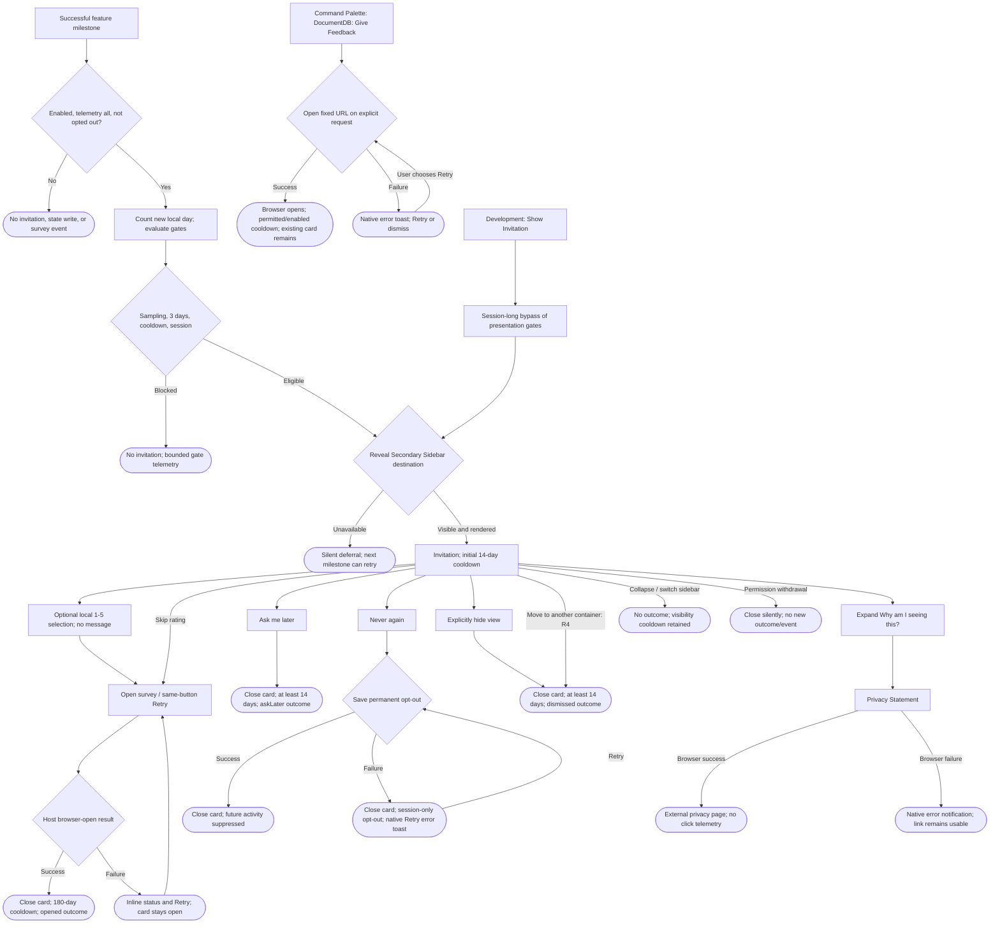

# Survey refresh - PR review and UX review pack

> **Who this is for:** the author and anyone preparing the hands-on review of #992.
> **What this is:** severity-ranked code-review results and a pre-seeded UX walkthrough.
> This is not a completed workbench UX review or privacy approval.

- **PR / branch:** [#992](https://github.com/microsoft/vscode-documentdb/pull/992), `dev/tnaum/survey`, draft.
- **Reviewed head:** `121ff4463ac25f0022e444996e3d181ae1314c13`.
- **Verified fix head (Iteration 3):** `618891c649526ec7f1bc477500a513f9b705d06f`.
- **PR base:** `1380b7582a4d1dbd2861db6ba6ee8aac1c0596c6` on `main`.
- **Diff merge base:** `5fd3fb897904a02e9d722e49659b6e6cb3349525`; the local 63-file
  comparison matches GitHub's PR file list.
- **Review date:** 2026-10-08.
- **Feature area:** [survey service and invitation](../../../../../src/services/survey/),
  [Give Feedback](../../../../../src/commands/giveFeedback/giveFeedback.ts),
  [developer commands](../../../../../src/debug/registerDebugCommands.ts), and the nine activity hooks in Appendix C.
- **Related intent:** [design](../design.md), [decisions](../decisions.md),
  [implementation history](./01-implementation-plan.md).
- **Scope:** correctness, persistence, permission/telemetry boundaries, activity integration,
  invitation actions, error recovery, and preparation for real workbench interaction.

## How this review was run

An AI assistant reviewed the PR diff, traced the affected callers and state transitions, ran
the focused suite and build, and executed local fault-injection probes against the compiled
production modules. Browser checks used the production HTML builder and English strings,
with a local VS Code API stub and theme variables. No survey answer was submitted and no
production preference was changed. No person has yet driven the live UX walkthrough in this review.

The four original findings are code-confirmed. R1 was reproduced with overlapping asynchronous
storage writes; R2 with both the service and browser; R3 with the host message handler.
R4 combines the handler reproduction with the VS Code 1.106.0 lifecycle implementation.
These are not claims of having reproduced the races or view movement in a real workbench.
R5 was added after the operator's follow-up: source inspection confirmed missing local traces
before Iteration 3. R2/R3/R5 are now implemented and verified; their original observations
are retained below as history, followed by inline implementation and check results.

### Operator triage - 2026-10-08

Iteration 2 was documentation-only. Its directions below were then implemented in Iteration 3.
The original reproduction results describe the pre-fix head, not the repaired implementation.

| Item | Operator direction                                                                                   | Disposition                                                                |
| ---- | ---------------------------------------------------------------------------------------------------- | -------------------------------------------------------------------------- |
| R1   | Treat overlapping writes as an edge case; accept the last write winning rather than add coordination | Low/P3, closed as accepted risk; existing merge protections remain         |
| R2   | Do not stop a user opening the form after an arbitrary number of attempts; they can see each failure | Medium/P2, implemented and verified; replaced the exhausted-state proposal |
| R3   | Add a notification if Privacy Statement fails to open                                                | Medium/P2, implemented and verified                                        |
| R4   | Explore the lifecycle limitation, then leave it as-is                                                | Low/P3, closed after source/API investigation; no behavior change          |
| R5   | Add survey traces for acknowledged activity, active days, and suppression reasons                    | Medium/P2, implemented and verified                                        |

R1 caveat: "last write" is not necessarily the last deliberate preference. It can be a
background usage update, and there is no overwrite notification. The user may only notice
when another invitation appears. Accepting this rare case does not require removing the
existing opt-out/maximum-cooldown merges on ordinary sequential updates.

### Initial review verification evidence

| Check                                 | Result / boundary                                                                                                                                                                                                               |
| ------------------------------------- | ------------------------------------------------------------------------------------------------------------------------------------------------------------------------------------------------------------------------------- |
| `npm run build`                       | Passed, including workspace prebuilds and extension TypeScript build.                                                                                                                                                           |
| Focused Jest invocation below         | **12 suites, 358 tests passed**, no coverage collection.                                                                                                                                                                        |
| `git diff --check origin/main...HEAD` | Passed for the reviewed implementation.                                                                                                                                                                                         |
| Local overlapping-write probe         | Both saves succeed, but a new store sees `isOptedOut === false` after the stale activity write lands.                                                                                                                           |
| Local service/browser-open probe      | Results are `failed`, `failed`, `failed`, `blocked`; only three browser calls occur.                                                                                                                                            |
| Browser recovery check                | After the third failure, Retry is visible/enabled and copy says "Please try again"; the fourth click changes to unavailable without opening anything.                                                                           |
| Browser layout                        | Expanded explanation at 240/320/480 px, at 100% and 200% CSS zoom: no horizontal document overflow and no unnamed buttons/links/disclosure controls in all six combinations. One dark-theme variable set and English copy only. |
| Browser keyboard                      | Initial focus is BODY; Tab visits stars 1-5, Open survey, Ask me later, Never again, disclosure; Enter expands it and the next Tab reaches Privacy Statement.                                                                   |
| GitHub checks                         | Build & Package, Code Quality & Tests, Integration Tests, API typings, CodeQL and CLA reported success during this review. Not a substitute for local handoff checks.                                                           |
| Workbench / external services         | Actual focus preservation, Chat displacement, view movement, reload, remote latency, screen-reader speech, live form availability, and KQL execution remain unverified here.                                                    |

```bash
npx --no-install jest --no-coverage --runInBand \
  src/services/survey \
  src/commands/giveFeedback/giveFeedback.test.ts \
  src/debug/debug.test.ts \
  src/extension.test.ts \
  src/utils/feedbackPermission.test.ts \
  src/webviews/documentdb/clusterDashboard/clusterDashboardRouter.test.ts \
  src/webviews/documentdb/localQuickStart/localQuickStartRouter.test.ts
```

The editor test tool could not discover these files; the repository's Jest runner above
provided the actual result. Passing existing tests does not cover the missing scenarios below.

**Verification case: Case 1, still working.** The PR remains a draft. The full Case 2 checks,
including `prettier-fix`, were deferred until ready for review; this review did not run
localization, formatting, lint, the full suite, or packaging. The initial review made no
production fixes; Iteration 3 below implements R2/R3/R5. The switch stayed off through
Iteration 3 and is enabled in Iteration 4 at the operator's request.

The Iteration 2 operator-triage follow-up was documentation-only. Source references and document links
were checked; the build/test results above belong to the initial review and were not rerun
for that documentation update.

### Iteration 3 batched verification

Sol 6.1 completed all three coding items before any test/build run. A lightweight task agent
then ran the focused command above once: **13 suites / 390 tests passed**. The build exposed
one test-only TS2367 overload assertion in Give Feedback; a narrow Sol 6.1 follow-up fixed it
in [`618891c6`](https://github.com/microsoft/vscode-documentdb/commit/618891c6).

Only the repaired suite and failed build were rerun:

```bash
npx --no-install jest --no-coverage --runInBand src/commands/giveFeedback/giveFeedback.test.ts
npm run build
```

Both passed: **1 suite / 6 tests**, and the full workspace/extension TypeScript build.
No production code changed after the 390-test run. No repeated full-suite runs, l10n,
formatting, lint, or packaging were performed. Case 2 and real workbench checks remain pending.

## Legend

### Priority

| Priority | Meaning                                            |
| -------- | -------------------------------------------------- |
| **P0**   | Blocking — the user gets stuck                     |
| **P1**   | Broken / misleading, or a consistency & safety gap |
| **P2**   | Polish, expectation, or a smaller feature gap      |
| **P3**   | Nice-to-have / cosmetic / acknowledged             |

For code-review triage here, P1 is **High**, P2 is **Medium**, and P3 is **Low**.
Severity describes the feature when exercised; the production kill switch currently prevents
automatic invitations. R1 and R4 were downgraded during operator triage; original evidence is retained.

### Status

| Status             | Meaning                                                                  |
| ------------------ | ------------------------------------------------------------------------ |
| 🟠 **Open**        | Recorded + analyzed; carries a recommendation but stays a suggestion     |
| 🟡 **Open (soft)** | Open, but the recommendation depends on an investigation or is "as-is"   |
| ✅ **Implemented** | A change was made on this branch and verified (Decision + commit link)   |
| 🚫 **Closed**      | Won't fix — with a mandatory one-line reason                             |
| 🔗 **Tracked**     | Deferred to a repo issue (linked); dropped from the active priority list |

### Markers

| Marker            | Meaning                                                 |
| ----------------- | ------------------------------------------------------- |
| ⚠️ **Flag**       | Confirmed gap or bug                                    |
| 💡 **Suggestion** | A design/wording recommendation to react to             |
| 🔍 **Answered**   | A "how does this work?" question answered from the code |

Suggestions below are not operator decisions. Record the chosen direction and its reason
before implementation; keep every unresolved item in the next iteration.

## User interaction map

This map describes the implementation after Iteration 3. User-directed browser attempts are
uncapped; failures remain actionable. Quiet UI terminations now have local Trace diagnostics.



R1 crosses the persistence branches: a concurrent activity write from another window can
erase a successfully saved opt-out or longer cooldown. See its interleaving below.

### Interaction inventory

| Entry / action                                     | Where it lives                                                                                                                                        | Terminal state / surface                                                                   | Review note                                                                             |
| -------------------------------------------------- | ----------------------------------------------------------------------------------------------------------------------------------------------------- | ------------------------------------------------------------------------------------------ | --------------------------------------------------------------------------------------- |
| Nine successful milestones                         | Appendix C                                                                                                                                            | Suppressed, eligibility-blocked, deferred, or visible invitation                           | Background failures must not break the original action.                                 |
| Five stars; Open survey                            | [HTML](../../../../../src/services/survey/invitation/surveyInvitationHtml.ts), [service](../../../../../src/services/survey/SurveyService.ts)         | Stars select locally; only the primary button navigates to the fixed URL                   | D0023: optional numeric `selectedRating` on opening telemetry, never on selection alone |
| Retry after failed browser open                    | [HTML result handler](../../../../../src/services/survey/invitation/surveyInvitationHtml.ts#L153)                                                     | Another explicit attempt; permission/lifecycle gates still apply                           | ✅ R2; navigation is not attempt-capped                                                 |
| Ask me later                                       | [choice handler](../../../../../src/services/survey/SurveyService.ts#L420)                                                                            | Card closes, 14-day cooldown unless a later one already applies                            | No success toast; disappearance is the feedback.                                        |
| Never again; save-error Retry                      | [opt-out handler](../../../../../src/services/survey/SurveyService.ts#L429), [notification](../../../../../src/services/survey/SurveyService.ts#L542) | Permanent or in-memory suppression; failed save gets a native non-modal error              | ⚠️ R1 for overlapping windows                                                           |
| Explicit hide / move / collapse / switch           | [view lifecycle](../../../../../src/services/survey/invitation/SurveyInvitationView.ts#L105)                                                          | Dispose records dismissal; temporary invisibility does not                                 | ⚠️ R4 for moves                                                                         |
| Explanation disclosure                             | [HTML](../../../../../src/services/survey/invitation/surveyInvitationHtml.ts#L124)                                                                    | Inline expansion: local day count, prior outcome, English-only note, telemetry description | Reminder copy derives from persisted state.                                             |
| Privacy Statement                                  | [host message handler](../../../../../src/services/survey/invitation/SurveyInvitationView.ts)                                                         | External page or native failure notification                                               | ✅ R3; no click telemetry                                                               |
| Give Feedback                                      | [command](../../../../../src/commands/giveFeedback/giveFeedback.ts#L12)                                                                               | External page or native non-modal error/retry                                              | Works despite opt-out, telemetry off, or kill switch off. Never clears opt-out.         |
| Show Invitation / Simulate Milestone / Reset State | [debug commands](../../../../../src/debug/registerDebugCommands.ts#L27)                                                                               | Forced presentation, real policy evaluation, or silent reset                               | Development only; Show changes the rest of that session.                                |

### Error / feedback surface comparison

| Event                                                      | Current feedback                                                   | Assessment                                                                    |
| ---------------------------------------------------------- | ------------------------------------------------------------------ | ----------------------------------------------------------------------------- |
| Survey open fails in invitation                            | Inline polite status + Retry                                       | Each explicit retry remains available; fixed in R2.                           |
| Survey open fails from command                             | Native non-modal error; user-selected Retry                        | No navigation attempt cap; dismissing stops the command.                      |
| Privacy page cannot open                                   | Native non-modal error for `false` or rejection                    | Fixed in R3; user can click the link again.                                   |
| Never again cannot persist                                 | Native non-modal error + user-driven Retry; card closes            | Explains the session-only guarantee; existing tests cover retries.            |
| Ask later / dismissal / visibility cooldown cannot persist | In-memory state and a local persistence-failed trace; no new toast | R5 improves diagnosis without adding an unsolicited notification.             |
| Automatic reveal fails / times out                         | No user error; bounded deferral telemetry and local reason trace   | Reasonable for an unsolicited prompt, not a reason to interrupt with a modal. |
| Survey initialization fails                                | DocumentDB output-channel error; manual command remains available  | Feature isolation is intentional.                                             |

There are no new tree rows, database-destructive actions, or clipboard/secret operations in
this surface. Discovery-provider modal-error conventions do not automatically apply to it.

## The story in one paragraph

The refresh replaces click scoring with successful activity on three local days and a
lightweight invitation. The main paths, permission checks, bounded telemetry, and fixed-URL
rating boundary are well covered by the existing suite. Iteration 3 implements and verifies
**all three Medium/P2 fixes**: unrestricted user-driven browser retries, a privacy-link failure
notification, and local diagnostic traces. R1's write race and R4's disposal classification
are **Low/P3 accepted limitations**, not requirements for additional coordination or heuristics.
Iteration 4 re-enables automatic invitations at the operator's explicit direction.
Privacy/form and real-telemetry validation are still not claimed complete by this review.
The browser checks are preparation, not proof of workbench focus or assistive-technology behavior.
Iteration 5 evaluates the rendered invitation as a design, not just a layout that fits.
It records new open recommendations R6-R10; no UI changes or policy decisions were made in that pass.

## Priority index

| #   | Severity / priority | Item                                                                                                                                   | Confidence                                                                             | Status                         |
| --- | ------------------- | -------------------------------------------------------------------------------------------------------------------------------------- | -------------------------------------------------------------------------------------- | ------------------------------ |
| R6  | **High / P1**       | [Rating affordance and navigation contract compete](#r6-rating-affordance-and-navigation-contract-compete-)                            | D0023 optional rating, explicit opening, and disclosed telemetry; tests/browser checks | ✅ Implemented                 |
| R8  | **High / P1**       | [Star artwork; small-copy concern accepted](#r8-enabled-stars-look-disabled-key-explanations-are-tiny-)                                | Native radios and matching outline/filled icons; helper size retained                  | ✅ Implemented                 |
| R7  | **Medium / P2**     | [Whitespace and heading hierarchy do not express the task](#r7-whitespace-and-heading-hierarchy-do-not-express-the-task-)              | Task-led hierarchy/spacing implemented and browser-verified                            | ✅ Implemented                 |
| R10 | **Medium / P2**     | [Failure duplicates the primary action and loses keyboard focus](#r10-failure-duplicates-the-primary-action-and-loses-keyboard-focus-) | One primary action; retained keyboard focus verified in browser                        | ✅ Implemented                 |
| R9  | **Low / P3**        | [The secondary-action section is visually over-weighted](#r9-the-secondary-action-section-is-visually-over-weighted-)                  | Quieter equal-access controls/disclosure implemented and verified                      | ✅ Implemented                 |
| R2  | **Medium / P2**     | [Retry remains offered after attempts are exhausted](#r2-retry-remains-offered-after-attempts-are-exhausted-)                          | Regression tests + build                                                               | ✅ Implemented                 |
| R3  | **Medium / P2**     | [Privacy-link failure is silent](#r3-privacy-link-failure-is-silent-)                                                                  | Regression tests + build                                                               | ✅ Implemented                 |
| R5  | **Medium / P2**     | [Survey activity and eligibility lack local traces](#r5-survey-activity-and-eligibility-lack-local-traces-)                            | Trace assertions + build                                                               | ✅ Implemented                 |
| R1  | **Low / P3**        | [Concurrent writes can erase Never again](#r1-concurrent-writes-can-erase-never-again-)                                                | High; deterministic interleaving                                                       | 🚫 Closed - accepted edge case |
| R4  | **Low / P3**        | [Moving the view is recorded as dismissal](#r4-moving-the-view-is-recorded-as-dismissal-)                                              | High code confidence; live UX pending                                                  | 🚫 Closed - leave as-is        |

## P0 — Blocking (the user gets stuck)

No P0 finding established.

## P1 — Broken / misleading, or consistency & safety

R1 remains closed under P3. The new items here concern the ordinary invitation, not that
accepted edge case.

### R6. Rating affordance and navigation contract compete ⚠️

**Priority:** P1 / High · **Status:** ✅ Implemented

**Observation:** This looks like a one-question in-place rating form: a satisfaction question,
five independently hoverable stars, and endpoint labels. But clicking a star only opens another
form, where the person must answer again. The clarifying text appears after the primary button.

**Finding:** The [opening controls and note](../../../../../src/services/survey/invitation/surveyInvitationHtml.ts#L115)
and [generic message handler](../../../../../src/services/survey/invitation/surveyInvitationHtml.ts#L143)
confirm the mismatch between the visual affordance and the action. The browser preview confirms
that the controls post identical messages; there is no in-place submission or rating selection.
This implements the approved no-rating-collection contract, not a backend defect. Whether users
misunderstand it has not been established by a user study; the likely expectation cost is the
UX risk.

💡 **Suggestion:** Make "preview / answer in browser" visible **before** the stars, at normal
supporting-text size, rather than relying on a post-button disclaimer. Keep Open survey as the
unambiguous primary action. The structurally simpler alternative is one CTA with a noninteractive
preview, but that would reopen the approved interactive-star design; see O2.

**Initial recommendation:** Do not transmit or retain ratings merely to resolve the ambiguity.
The operator subsequently changed that boundary explicitly in D0023, recorded below.

> **Operator direction (Iteration 6, 2026-10-09):** Only Open survey should open the browser;
> the stars are a visual invitation, not a functioning rating form. **Reason (operator):**
> clicking a star to open a different survey is surprising, and the selected star count
> cannot be forwarded to the external form because of a technical constraint.
>
> The inability to forward a selection is recorded as an operator-provided constraint, not
> an independently investigated limitation of the external form platform.

> **Discussion still open:** A purely visual selected state would still suggest an answer
> that should transfer. Prefer no selectable/retained rating, no per-star pointer/focus
> affordance, and no star-triggered navigation. The proposed gold treatment is in O2;
> no implementation or final choice of visual behavior has been made.

> **Decision (Iteration 7, D0023):** Replace the decorative proposal with actual optional
> local selection. Only Open survey navigates, and its permitted opening telemetry records
> the selected rating. **Reason (operator):** button-hover gold could appear preselected;
> the operator prefers selecting deliberately and accepts that the rating will not transfer
> and people may abandon the longer external form. The operator explicitly said not to
> require a rating and to omit the field when unselected.
>
> ✅ **Implementation:** Native radio selection starts empty; selection itself posts nothing.
> The primary action posts optional numeric `selectedRating`; the host and telemetry emitter
> validate 1-5 and preserve feedback-permission and attempt-reporting bounds. Updated visible
> copy discloses rating telemetry and the need to answer again externally. Nothing is added
> to the URL or persisted survey state. Verified by the 371-test batch and browser checks
> recorded in Iteration 7. Commit:
> [`996a846e`](https://github.com/microsoft/vscode-documentdb/commit/996a846e).

### R8. Enabled stars look disabled; key explanations are tiny ⚠️

**Priority:** P1 / High · **Status:** ✅ Implemented

**Observation:** The unhovered stars are pale like unavailable controls, while the copy that
explains what happens and the permanent opt-out has less visual prominence than ordinary body text.

**Finding:** In the shared light preview, the [star rule](../../../../../src/services/survey/invitation/surveyInvitationHtml.ts#L91)
uses `rgb(97, 97, 97)` at `opacity: .55` over white. The composited result is approximately
`rgb(168, 168, 168)`, or **2.38:1 contrast**. That is below the 3:1 non-text contrast target
for an identifying control graphic. This is a measurement of the preview's supplied colors,
not a full workbench accessibility audit.

Separately, [`.below`](../../../../../src/services/survey/invitation/surveyInvitationHtml.ts#L90)
shrinks the 13 px base to 11.96 px, and [`.note`](../../../../../src/services/survey/invitation/surveyInvitationHtml.ts#L101)
shrinks it again to **10.5248 px** with a 14.7347 px line height. This affects the browser/English
explanation and the permanent opt-out explanation. There is no WCAG minimum-font-size claim
here; the compound reduction is a readability problem for unusually important copy.

💡 **Suggestion:** Remove disabled-looking opacity from enabled controls, use an appropriate
theme foreground, and verify normal/hover/focus/high-contrast states against real theme colors.
Avoid hard-coded yellow as the only way to communicate interaction. Use an explicit readable
helper size around 12-13 px instead of nested shrinking; keep behavior-changing instructions
at body size. Do not make the whole panel larger to compensate for tiny subtrees.

**Initial review status:** Open, requiring implementation and theme/keyboard verification.

> **Operator disposition (Iteration 6, 2026-10-09):** The small explanatory copy is acceptable
> as-is; it just needs to remain present. **Reason (operator):** its small size is not a big
> concern and they do not expect many people to read it. The font-size enlargement proposal
> is therefore **closed**, not part of the next implementation pass. The explanations remain.

> **Artwork request:** Use an outlined star for the resting appearance and a matching filled
> star when gold. The installed `@fluentui/react-icons` **2.0.324** already provides
> `Star24Regular` and `Star24Filled` (also 20 px variants); their matching SVG geometries were
> verified in `lib/sizedIcons/chunk-11.js`. No new dependency or React conversion is needed to
> use the licensed artwork in the native HTML surface.
>
> **Scope boundary:** If R6 makes the stars wholly decorative, the previous 3:1 identifying-control
> assessment no longer applies to them as controls. Do not claim an inaccessible rating input
> exists after removing the input semantics. Still check that the illustration reads clearly
> in the supported themes. Gold-state triggering remains a design question, not a selected answer.

> ✅ **Implemented (Iteration 7):** D0023 resolves the earlier decorative question in favor
> of actual radio selection. Fluent outline stars now fill gold up to the checked rating,
> with a theme-foreground outline retained for contrast and full opacity while enabled.
> Button hover/focus does not change the stars. Native radio semantics provide a real checked
> state and Space/arrow-key support. Small explanatory text remains at its previous size,
> as requested; the text itself is corrected for the new data collection. Browser and
> regression verification are recorded in Iteration 7. Commit:
> [`996a846e`](https://github.com/microsoft/vscode-documentdb/commit/996a846e).

## P2 — Polish, expectation, or feature gap

### R7. Whitespace and heading hierarchy do not express the task ⚠️

**Priority:** P2 / Medium · **Status:** ✅ Implemented

**Observation (operator):** "It definitely needs more work with white space."

**Finding:** Browser measurements at a 346 px CSS viewport agree with the
[source spacing](../../../../../src/services/survey/invitation/surveyInvitationHtml.ts#L81):

| Relationship                              | Current value             |
| ----------------------------------------- | ------------------------- |
| Header to first content heading           | 16 px content inset       |
| "Your Feedback Matters"                   | 16 px / weight 700        |
| Promotional heading to question           | 28 px                     |
| Actual satisfaction question              | 14 px / weight 600        |
| Question to star-control row              | 10 px                     |
| Star row to endpoint captions             | 6 px                      |
| Endpoint captions to primary action       | 16 px                     |
| Helper text to secondary-action group     | 20 px                     |
| Secondary note to disclosure rule/content | 20 px, then 12 px padding |

The hierarchy promotes the generic message above the real task, while the large gap separates
the two introductory headings. In contrast, important microcopy and the action are tightly packed.
The large blank area after the content is not itself a defect: a small invitation should not
stretch to fill a tall sidebar.

💡 **Suggestion:** Use the question as the principal content heading; remove or demote the
generic "Your Feedback Matters" line. Compose three groups: invitation/preview, primary action
and context, then secondary choices/disclosure. Start with **8 px inside related elements,
16 px between related blocks, and 24 px between groups**. Keep star labels close to the stars.
If increasing the horizontal inset to 16-20 px, keep header and body alignment together and
recheck the 240 px layout. Do not simply increase every margin or vertically distribute the
content to consume the remaining height.

**Progress (Iteration 8):** The operator reiterated the original assessment and asked why
this agreed work was left behind. The agent had narrowed the implementation to star/telemetry
changes; that scoping mistake is being corrected. D0024 removes the promotional heading,
promotes the question, moves explanatory copy before the stars, and uses an 8/16/24 spacing
rhythm with aligned 16 px gutters. Implementation is in progress; verification is pending.

> ✅ **Implemented (Iteration 8, D0024):** Removed "Your Feedback Matters" and its unused
> string property; promoted the actual question to the sole content `h2`. The collection/
> browser explanation is before the stars, at the smaller size the operator accepted.
> Content uses 24 px vertical / 16 px horizontal padding, 8 px internal spacing, 24 px major
> action separation, and a 16 px disclosure gap. Header/body gutters remain aligned.
> Browser measurements verify the 16 px question, unchanged 10.5248 px helper text, aligned
> surfaces, and no overflow. Tests/build and commit reference are recorded in Iteration 8.
> Commit: [`45145cde`](https://github.com/microsoft/vscode-documentdb/commit/45145cde).

### R10. Failure duplicates the primary action and loses keyboard focus ⚠️

**Priority:** P2 / Medium · **Status:** ✅ Implemented

**Observation:** In the shared preview, focus Open survey and press Enter. The simulated browser
failure shows two full-width blue buttons, Open survey and Retry, doing the same thing. Focus
returns to BODY rather than remaining on a useful control.

**Finding:** [Both primary buttons](../../../../../src/services/survey/invitation/surveyInvitationHtml.ts#L119)
remain in the document. The [click handler](../../../../../src/services/survey/invitation/surveyInvitationHtml.ts#L152)
disables the focused button; the result handler reenables controls and unhides Retry without
restoring focus. The actual browser measurement returned `activeElement: BODY` and both
primary button names. This was a harness-produced failure, not an actual OS-browser outage.

💡 **Suggestion:** Keep one primary action in the same position and reuse it for retry. Pair
it with the existing live status and restore focus to the initiating action if focus was lost
because that control was disabled. Do not steal focus if the user moved elsewhere during the
await. Preserve explicit unlimited retries; this is a presentation/focus fix, not reopening R2.

**Initial review status:** Open, requiring mouse and keyboard recovery verification.

> ✅ **Implemented (Iteration 7):** Removed the duplicate Retry control. The same primary
> button becomes Retry after failure. It stays focused during opening via `aria-disabled`
> plus the existing busy guard instead of becoming native-disabled; selection/other choice
> controls are temporarily disabled. No focus-restoration routine steals focus from Privacy
> Statement if the user moved there. Stars no longer initiate navigation. Tests cover double
> clicks, preserved selection and focus, and movement to Privacy; the real browser check
> confirmed one primary action and retained focus after a simulated failure.
> Commit: [`996a846e`](https://github.com/microsoft/vscode-documentdb/commit/996a846e).

### R2. Retry remains offered after attempts are exhausted ⚠️

**Priority:** P2 / Medium · **Status:** ✅ Implemented

**Observation:** After three failed browser opens, the browser displays "Please try again"
and an enabled Retry. Clicking it makes no browser call and changes the status to unavailable.
The five stars and Open survey remain enabled even then.

**Original finding:** [onOpenForm at the reviewed head](https://github.com/microsoft/vscode-documentdb/blob/121ff4463ac25f0022e444996e3d181ae1314c13/src/services/survey/SurveyService.ts#L399) blocked calls
after three attempts, but the third failure still returns `failed`.
[The HTML result handler](../../../../../src/services/survey/invitation/surveyInvitationHtml.ts#L153)
reenables every control and offers Retry for every `failed`. The UI has no remaining-attempt
information. The [original command flow](https://github.com/microsoft/vscode-documentdb/blob/121ff4463ac25f0022e444996e3d181ae1314c13/src/commands/giveFeedback/giveFeedback.ts#L27)
already removes its Retry action at the final attempt.

> **Decision (Iteration 2):** Remove the user-facing attempt cap. **Reason (operator):**
> this is an edge case; the user chooses to try and sees whether it fails. An arbitrary limit
> should not prevent another explicit attempt.

💡 **Implementation direction:** Replace the earlier exhausted-state proposal with unrestricted
**user-driven** retries in both the invitation and Give Feedback command. Do not add an automatic
retry loop. Preserve the in-flight guard, fixed URL, current permission/lifecycle checks, and
ordinary failure feedback. Keep bounded telemetry separate from whether the user may open
the browser: removing the navigation cap need not expand the approved event budget.

**Verification after implementation:** Fail at least four consecutive browser opens, then
succeed on a fifth explicit action. Both surfaces must actually attempt every requested open;
the invitation closes and applies the opened cooldown only after success. A command retry
stops when the user dismisses its notification. Test telemetry bounds separately.

**Status:** ✅ Implemented and verified in Iteration 3.

> **Progress (Iteration 3, 2026-10-08):** Assigned to the Sol 6.1 coding pass with R3/R5.
> Remove the navigation cap in both entry points, preserve bounded telemetry, and add
> regression coverage for a fifth explicit attempt succeeding. Checks are deferred until
> the complete coding batch, per the operator's request.
>
> **Coding complete; verification pending:** [`01bcc3de`](https://github.com/microsoft/vscode-documentdb/commit/01bcc3de)
> removes the navigation cap and separates the telemetry budget, with retry regression tests.
> No test/build command ran during the coding pass.
>
> **First batched check:** 13 suites / 390 tests passed. The build found one overload-typing
> error in the new Give Feedback retry test (TS2367, line 90); a narrow Sol 6.1 repair is in
> progress. This is a test typing failure, not a failed retry behavior assertion.
>
> ✅ **Implemented (Iteration 3):** [`01bcc3de`](https://github.com/microsoft/vscode-documentdb/commit/01bcc3de)
> changes [SurveyService](../../../../../src/services/survey/SurveyService.ts),
> [Give Feedback](../../../../../src/commands/giveFeedback/giveFeedback.ts),
> [configuration](../../../../../src/services/survey/surveyConfig.ts), and
> [telemetry](../../../../../src/services/survey/surveyTelemetry.ts), with service/command
> regression tests. Fifth-attempt success is allowed while opening telemetry remains limited
> to attempts 1-3. Test typing repaired in
> [`618891c6`](https://github.com/microsoft/vscode-documentdb/commit/618891c6).
> **Verified:** 390-test batch passed; repaired command suite's 6 tests and build passed.

### R3. Privacy-link failure is silent ⚠️

**Priority:** P2 / Medium · **Status:** ✅ Implemented

**Observation:** When the browser API returns false for Privacy Statement, the host sends no
status back. The invitation remains unchanged; a rejected call is swallowed too.

**Original finding:** [the privacy branch at the reviewed head](https://github.com/microsoft/vscode-documentdb/blob/121ff4463ac25f0022e444996e3d181ae1314c13/src/services/survey/invitation/SurveyInvitationView.ts#L179)
ignores `openExternal`'s Boolean result. Rejections terminate in the empty
[message-listener catch](../../../../../src/services/survey/invitation/SurveyInvitationView.ts#L101).
Unlike survey-opening failures, the user has no explanation or actionable recovery for the
link that explains data handling.

> **Decision (Iteration 2):** Add a notification when opening Privacy Statement fails.
> **Reason:** the confirmed failure currently gives no feedback; the operator requested
> "just add a notification if it fails."

💡 **Implementation direction:** Use a localized native non-modal error notification for both
`openExternal === false` and rejection. Leave the invitation and its link usable so the user
can click again. Do not build a new retry workflow, record privacy clicks, or change the fixed URL.

**Live confirmation:** Exercise false/rejected browser-open results without changing system
browser settings. Ensure the failure is visible and announced, and no survey outcome is saved.

**Status:** ✅ Implemented and verified in Iteration 3.

> **Progress (Iteration 3, 2026-10-08):** Included in the same Sol 6.1 coding pass.
> Add the native failure notification and false/rejection coverage; keep privacy clicks
> unrecorded. The coding pass will not run checks after individual edits.
>
> **Coding complete; verification pending:** [`3abfa319`](https://github.com/microsoft/vscode-documentdb/commit/3abfa319)
> adds the localized Privacy Statement failure notification and focused tests.
>
> **First batched check:** Privacy tests passed within the 390-test run. Final verification
> is waiting on the unrelated R2 test-overload type repair; no R3 failure was reported.
>
> ✅ **Implemented (Iteration 3):** [`3abfa319`](https://github.com/microsoft/vscode-documentdb/commit/3abfa319)
> updates [SurveyInvitationView](../../../../../src/services/survey/invitation/SurveyInvitationView.ts)
> and its [tests](../../../../../src/services/survey/invitation/SurveyInvitationView.test.ts).
> False/rejected privacy opens show "We couldn't open the Privacy Statement in your browser.
> Please try again." The link/card remains usable, with no click telemetry or outcome change.
> **Verified:** targeted tests passed in the 390-test batch; final build passed.

### R5. Survey activity and eligibility lack local traces ⚠️

**Priority:** P2 / Medium · **Status:** ✅ Implemented

**Observation (operator):** The output should explain "acknowledged usage", the number of active
days, and why an invitation is not shown, such as the cooldown window not having expired.

**Original finding:** A pre-fix source sweep found no `ext.outputChannel` or `.trace()` call in the survey service,
state/policy, presenter, Give Feedback command, or survey debug commands.
[recordSurveyActivity](../../../../../src/services/survey/SurveyService.ts#L129) silently returns
for admission failure, in-flight coalescing, or unchanged same-day activity.
[process](../../../../../src/services/survey/SurveyService.ts#L298) records activity and evaluates
gates, but only emits bounded telemetry.
[surveyState](../../../../../src/services/survey/surveyState.ts#L147) counts days without local
diagnostic messages. The [activation error](../../../../../src/extension.ts#L87) is an error log,
not a lifecycle trace. Developer warning toasts and `DEBUGTELEMETRY` output do not explain all
these early returns or provide the requested local day/cooldown detail.

> **Decision (Iteration 2):** Record the missing trace messages as work to implement with
> `ext.outputChannel.trace`. **Reason (operator):** make acknowledged usage, day counts, and
> "not showing because the window has not expired" visible during diagnosis.

💡 **Implementation checklist:**

- [x] At admitted milestones, trace acknowledged usage using the finite feature-area name.
- [x] Distinguish a newly counted local day from an already-counted day; report count and
      required threshold without implying every milestone increments it.
- [x] Explain admission suppression: survey disabled, feedback not permitted, opted out, or disposed.
- [x] Explain evaluation suppression: already evaluated today or covered by in-flight evaluation.
- [x] Explain the actual first blocking gate: sampling, active days, cooldown, or session suppression.
      For cooldown, report the locally stored end time/remaining wait, not just "not eligible".
- [x] Trace eligible, presentation requested, visible, unavailable/timeout/failed, and permission
      withdrawal, so a successful evaluation is distinguishable from a failed reveal.
- [x] Trace generic outcomes and persistence success/failure without rating, star identity,
      connection strings, query text, database/resource names, or other secrets.
- [x] Use localized `[Survey]` messages on the existing DocumentDB output channel at **Trace**,
      not notifications. Follow existing [service tracing](../../../../../src/services/releaseNotesNotification.ts#L150).
      Logging must not change eligibility or interfere with successful feature actions.
- [x] Keep these diagnostics local: do not add usage counts, dates, or expiry times to telemetry.
      Do not collect/count activity solely to populate traces when admission disallows it.
- [x] Test the actual trace messages and gate reasons; repeated same-day activity must still
      leave the count unchanged, and logging must not change event budgets or expose sensitive data.

Implemented message examples (values depend on local state):

```text
[Survey] Acknowledged usage: queryPlayground.
[Survey] Counted a new active day: 2 of 3 required.
[Survey] Active day already counted: 2 of 3 required.
[Survey] Not showing invitation: active-day threshold not reached.
[Survey] Not showing invitation: cooldown has not expired; eligible after <timestamp>, remaining <milliseconds> ms.
[Survey] Skipping evaluation: today's activity was already evaluated.
[Survey] Not showing invitation: an invitation was already issued this session.
[Survey] Presentation deferred: destination unavailable.
```

**Verification after implementation:** Set the DocumentDB output channel's log level to Trace,
then exercise new-day, same-day, cooldown, opt-out, permission, and unavailable-presenter paths.
Each suppressed case must explain the actual reason, without a new toast or telemetry payload.

**Status:** ✅ Implemented and verified in Iteration 3.

> **Progress (Iteration 3, 2026-10-08):** Included in the same Sol 6.1 coding pass.
> Add local survey traces and focused assertions against actual messages, without changing
> eligibility, telemetry payloads, or the accepted R1/R4 behavior. A lightweight task agent
> will run the combined focused tests and build after the coding pass finishes.
>
> **Coding complete; verification pending:** [`1ab9bd12`](https://github.com/microsoft/vscode-documentdb/commit/1ab9bd12)
> adds a guarded, lazy trace formatter targeting the existing output channel, service/view
> diagnostics, and trace tests. No checks ran between these three implementation commits.
>
> **First batched check:** Trace tests passed within the 390-test run. Final verification
> is waiting on the R2 test-overload type repair; no tracing failure was reported.
>
> ✅ **Implemented (Iteration 3):** [`1ab9bd12`](https://github.com/microsoft/vscode-documentdb/commit/1ab9bd12)
> adds [surveyDiagnostics](../../../../../src/services/survey/surveyDiagnostics.ts) and its
> [tests](../../../../../src/services/survey/surveyDiagnostics.test.ts), and updates
> [SurveyService](../../../../../src/services/survey/SurveyService.ts),
> [SurveyInvitationView](../../../../../src/services/survey/invitation/SurveyInvitationView.ts),
> their tests, and a [type comment](../../../../../src/services/survey/surveyTypes.ts).
> A guarded lazy formatter writes local-only diagnostics to `ext.outputChannel.trace`.
> **Verified:** trace assertions passed in the 390-test batch; final build passed.
> To inspect manually, set the DocumentDB output channel to Trace and repeat the walkthrough.

## P3 — Nice-to-have / cosmetic / acknowledged

### R9. The secondary-action section is visually over-weighted ⚠️

**Priority:** P3 / Low · **Status:** ✅ Implemented

**Observation:** Two equally broad filled secondary buttons, a permanence explanation, a divider,
and a bold disclosure form a substantial second visual section underneath the single main CTA.

**Finding:** [`.choices`](../../../../../src/services/survey/invitation/surveyInvitationHtml.ts#L97)
gives each button equal flex width and filled secondary styling; the opt-out note and
[disclosure](../../../../../src/services/survey/invitation/surveyInvitationHtml.ts#L127) follow.
The choices are accessible and understandable; this is a density/emphasis critique, not a
claim that equal access to declining is wrong.

💡 **Suggestion:** Try a quieter secondary row, such as subtle/text buttons, while preserving
adequate hit areas, readable labels, and equally easy access to postponement and opt-out.
"Don't ask again" may read more naturally than "Never again"; any wording change must still
make permanence clear. Do not hide opt-out under the disclosure, add friction to declining,
or move the controls to the bottom of the sidebar just to fill space.

**Progress (Iteration 8):** D0024 completes this part of the original UX pass too: transparent
secondary buttons with equal access, preserved hit areas, unchanged opt-out wording, and a
quieter unbolded disclosure without the heavy divider. Small helper text remains unchanged.
Implementation is in progress; verification is pending.

> ✅ **Implemented (Iteration 8, D0024):** Both secondary choices are transparent, regular-weight
> text buttons with equal access and retained 32 px minimum height. They wrap rather than
> compress excessively at narrow widths. Removed the heavy disclosure divider and bold
> summary treatment. Permanent opt-out wording/explanation remains visible and unchanged.
> Native controls and focus rings remain. Tests/build and commit reference are recorded
> in Iteration 8.
> Commit: [`45145cde`](https://github.com/microsoft/vscode-documentdb/commit/45145cde).

### R1. Concurrent writes can erase Never again ⚠️

**Priority:** P3 / Low (initial assessment: P1 / High) · **Status:** 🚫 Closed

**Observation:** A local probe using two stores over shared asynchronous storage loses a
successfully persisted opt-out when the other window's previously prepared activity write
commits afterwards. Reopening the store reports not opted out.

**Finding:** [save/persistCurrentState](../../../../../src/services/survey/surveyState.ts#L220)
serializes only one store's writes. The read/merge at line 228 and whole-object update at
line 229 are not atomic across extension hosts:

1. A prepares its opt-out save; B prepares activity from the old value without opt-out.
2. A's update commits successfully; its UI may close with no error.
3. B's update commits its stale object, replacing the persisted opt-out.
4. A exits before another write can repair the state; a fresh host can invite again.

The same race can overwrite a longer cooldown.
[Cross-window tests](../../../../../src/services/survey/surveyState.test.ts#L468) establish
sequential refresh, not overlapping-write safety. VS Code's
[Memento implementation](https://github.com/microsoft/vscode/blob/1.106.0/src/vs/workbench/api/common/extHostMemento.ts#L25)
uses per-host cached values and asynchronous storage writes rather than a cross-host transaction.

> **Decision (Iteration 2):** Accept the existing last-writer outcome for overlapping writes;
> do not add cross-window coordination. **Reason (operator):** this is an edge case, and a
> user can notice the preference being overridden. The rare repeat invitation is accepted.

🔍 **Clarification:** There is no immediate overwrite notification; another invitation may be
the first visible sign. This is an accepted limitation, not proof that permanent persistence
is atomic. Existing sequential merges stay intact; this decision does not make an ordinary
Ask me later shorten an opened-form cooldown.

💡 **Disposition:** Leave implementation as-is. The stronger persistence alternatives in O1
are no longer required for this PR. No product wording change is implied by this triage.

### R4. Moving the view is recorded as dismissal ⚠️

**Priority:** P3 / Low (initial assessment: P2 / Medium) · **Status:** 🚫 Closed

**Observation:** The disposal probe always invokes `onChoice('dismissed')`. VS Code disposes
the old view pane when moving it between containers, so dragging an active invitation is
treated as declining it rather than rearranging the workbench.

**Finding:** [onDidDispose](../../../../../src/services/survey/invitation/SurveyInvitationView.ts#L105)
unconditionally classifies disposal as dismissal when not busy. VS Code 1.106.0
[removePane](https://github.com/microsoft/vscode/blob/1.106.0/src/vs/workbench/browser/parts/views/viewPaneContainer.ts#L1016)
disposes the removed pane, and
[WebviewViewPane.dispose](https://github.com/microsoft/vscode/blob/1.106.0/src/vs/workbench/contrib/webviewView/browser/webviewViewPane.ts#L114)
fires the view-disposal event. The service saves a dismissal and clears the invitation,
potentially closing the newly resolved destination. Telemetry and later reminder copy now
attribute a choice the user did not make.

This was already noted in [Stage 2 history](./01-implementation-plan.md#progress-2); it remains
present at the reviewed head. The visibility cooldown fix did not distinguish moves from hides.

🔍 **Exploration result:** The stable `WebviewView.onDidDispose` event is `Event<void>`: it
provides no cause or destination. Visibility changes also provide no move reason, and the view
exposes no current container identity. Waiting for re-resolution could be a heuristic, but a
move to a hidden destination can resolve late or not at all. Treating all disposal as silent
would instead lose the explicit-hide outcome. Neither change is justified by this review.

> **Decision (Iteration 2):** Leave the behavior as-is after exploration.
> **Reason:** the operator explicitly requested "let's explore, but then just leave as is";
> no further operator rationale was supplied. The API investigation above explains the
> implementation trade-off, not an invented operator rationale.

💡 **Disposition:** No move-detection timer, proposed API, or new lifecycle machinery. Retain
the known limitation that `dismissed` includes disposal during relocation.

**Live confirmation:** Move the visible view into the Primary Sidebar and panel, then repeat
explicit Hide, collapse, and container switching. Capture persistence, lifecycle events,
whether content survives, and focus. This workbench check has not been performed here.

## Implemented

R2, R3, and R5 are implemented and verified, with decisions, individual commit references,
and progress/check results inline above. R1 and R4 remain accepted limitations, not fixes.
Actual workbench interaction, screen-reader speech, and the pre-existing enablement gates
remain unverified; passing automated checks does not close those manual tasks.

## Iteration log

### Iteration 1 - pre-assessment

| Item | Decision (why) | Outcome                                                     |
| ---- | -------------- | ----------------------------------------------------------- |
| R1   | Not yet chosen | 🟠 Open; carry into the first fix iteration                 |
| R2   | Not yet chosen | 🟠 Open; carry into the first fix iteration                 |
| R3   | Not yet chosen | 🟠 Open; carry into the first fix iteration                 |
| R4   | Not yet chosen | 🟠 Open; confirm workbench behavior before choosing the fix |

### Iteration 2 - operator triage and trace investigation

| Item | Decision (why)                                                            | Outcome                                                                    |
| ---- | ------------------------------------------------------------------------- | -------------------------------------------------------------------------- |
| R1   | Accept the rare overlapping-write outcome rather than add coordination    | 🚫 Closed - accepted risk; no implementation change                        |
| R2   | Remove the navigation attempt cap; explicit retries already show failures | 🟠 Open → Iteration 3; implementation pending                              |
| R3   | Notify on privacy-link failure; no extra workflow                         | 🟠 Open → Iteration 3; implementation pending                              |
| R4   | Explore, then leave as-is per operator request                            | 🚫 Closed - stable API offers no disposal reason; no implementation change |
| R5   | Add local traces so usage and suppression can be diagnosed                | 🟠 Open → Iteration 3; implementation pending                              |

### Iteration 3 coordination

The operator requested one sustained Sol 6.1 coding pass, simpler agents for checks, and
progress updates inline on each finding and in chat. Implement R2/R3/R5 as individually
identifiable commits; run the focused Case 1 validation as a batch rather than after every
edit. R1/R4 remain closed and unchanged. No item becomes Implemented until checks pass.

| Item | Outcome                                                                                                            |
| ---- | ------------------------------------------------------------------------------------------------------------------ |
| R2   | ✅ Implemented - `01bcc3de`; test typing repair `618891c6`; 390-test batch plus repaired 6-test suite/build passed |
| R3   | ✅ Implemented - `3abfa319`; targeted tests and final build passed                                                 |
| R5   | ✅ Implemented - `1ab9bd12`; trace tests and final build passed                                                    |

No requested code fix carries into Iteration 4. Only the separately listed manual UX,
privacy/form/enablement, and ready-for-review checks remain.

### Iteration 4 - normal enablement and dashboard-style invitation

> **Decision:** Remove the enablement launch setting and reintroduce the survey in production
> as well as development. **Reason (operator):** "it should always just work"; this PR is
> reintroducing the feature, so enable it in code for debug and production.
> [D0021](../decisions.md#0021-re-enable-surveys-in-production-and-development) supersedes
> the initial conservative development-only interpretation before its validation/commit.

> **Progress (2026-10-08):** Removed all three launch entries, the environment-reader property,
> and the obsolete override resolver/tests. `SURVEY_ENABLED=true` now applies identically to
> all modes; ordinary eligibility/permission gates remain. No environment variable is needed.
>
> ✅ **Implemented:** [`07d6aaba`](https://github.com/microsoft/vscode-documentdb/commit/07d6aaba)
> changes the launch configurations, debug reader/tests, shared switch, initializer/tests,
> policy/tests, and the related type comment. Verified by the batched tests/build below.

> **Decision:** Use the screenshot's left-side Cluster Dashboard as the survey's visual reference.
> **Reason (operator):** align icon/title sizes, header spacing, and the transition to the
> editor-colored content area. [D0022](../decisions.md#0022-match-the-dashboard-header-and-content-surfaces)
> records the concrete layout and theme mappings.

> **Progress:** Added the full-width shaded header, 36 px icon, 18 px/24 px semibold title,
> 12 px gap, 8 px vertical header padding, and aligned 14 px gutters. Content now uses the
> editor background/foreground. The header uses the exact neutral-surface/separator fallback
> chains from the Fluent theme translator; controls, wording, and message payloads are unchanged.
>
> ✅ **Implemented:** [`86342e85`](https://github.com/microsoft/vscode-documentdb/commit/86342e85)
> updates the native HTML builder and its layout contract test. Verified by the batched
> tests/build and the browser measurements below.

> **Verification:** One batched run passed **10 suites / 332 tests** and `npm run build`.
> Source/config searches found no remaining removed override/resolver reference. Browser checks
> passed at 240/320/480 px across light/dark/high-contrast token sets, with ordinary 100% layouts
> and doubled-title/question text at 200% CSS zoom: **18 combinations**, no horizontal overflow,
> full-width band, aligned content, loaded icon, and the exact header dimensions above.
> Initial focus remained BODY; the five stars and Open survey still posted identical
> `{ type: 'openForm' }` messages. The first zoom measurement mixed scaled and unscaled
> coordinates; checking consistent coordinates after layout settled passed without a code change.
> This is browser geometry, not a claim of real workbench zoom or screen-reader validation.

> **Visual check:** The 360 px light-theme browser preview was inspected and shown in chat.
> No new screenshot is archived here: the browser tool's image file is not in the workspace.
> The theme supplies the white content surface in the light preview; dark/high-contrast
> remain theme-derived.

### Iteration 5 - live design assessment, no implementation

**Operator observation:** the invitation needs more work on whitespace, and possibly more
than whitespace. The agent inspected the shared browser page at a 346 x 769 CSS-pixel viewport,
measured computed styles, and exercised a keyboard-initiated simulated failure. Source baseline:
`e77f76a9`. The production invitation markup/strings were used with the earlier preview's theme
and host stubs; no external form was opened or submitted. The initial preview state was restored
after the failure check.

**Assessment:** the dashboard-style header and editor surface are a good foundation, and the
primary action is recognizable. The main problem is intentional grouping and truthful
interaction, not a blanket need for more whitespace. Geometry/no-overflow checks from Iteration 4
did not establish contrast, reading hierarchy, or failed-action focus recovery.

| Item | Evidence / direction                                                                                                                      | Outcome                                                                |
| ---- | ----------------------------------------------------------------------------------------------------------------------------------------- | ---------------------------------------------------------------------- |
| R6   | Five interactive stars imply in-place rating; browser-only explanation follows the CTA. Clarify the preview before interaction.           | 🟡 Open (soft); operator decision required for structural alternatives |
| R7   | 28 px headline/question separation; promotional heading heavier than the question. Use task-led hierarchy and an 8/16/24 grouping rhythm. | 🟠 Open; proposal, not an approved pixel specification                 |
| R8   | Helper text computes to 10.5248 px; inactive-looking stars composite to approximately 2.38:1 against the preview background.              | 🟠 Open; readability/control-contrast improvements recommended         |
| R9   | Filled secondary row plus repeated explanation/disclosure adds visual weight. Try a quieter presentation without obscuring opt-out.       | 🟡 Open (soft); optional refinement                                    |
| R10  | Simulated failure shows Open survey and Retry together and leaves keyboard focus on BODY.                                                 | 🟠 Open; one primary action and deliberate focus recovery recommended  |

**Recommended order:** clarify the browser/preview contract, make the question the main content
heading, then normalize spacing and readable typography/contrast; finally simplify secondary
visual weight and failure recovery. Keep the existing native header/theme direction. Do not
vertically stretch or center the invitation merely to eliminate empty space below it.

All R6-R10 recommendations remain open for the next design iteration. No production change,
new operator decision, formal accessibility approval, or build/test run is claimed here.

### Iteration 6 - star artwork and invitation semantics

**Operator feedback:** agrees with the UX direction, requests outlined stars that become filled
when gold, accepts the smaller explanatory copy, and proposes that only Open survey navigate.
The stars cannot forward a selected rating and should therefore be treated as a visual invitation.
The operator explicitly invited discussion of what that visual element should do.

- **Found:** Fluent `Star24Regular` / `Star24Filled`, already installed; no dependency change.
- **Recorded:** keep the helper copy at its current size; do not prioritize enlarging it.
- **Direction:** button-only navigation, no rating collection/forwarding, and no real selected
  state in the invitation. Current code still has clickable stars until this is implemented.
- **Recommendation, not a decision:** outline stars at rest; if the gold transition is retained,
  fill the whole decorative row when Open survey is hovered or keyboard-focused. That relates
  emphasis to the real action rather than simulating a 1-5 answer.
- **Still open:** whether to use the button-linked effect, a completely static illustration,
  or omit the star row. No choice was available from the clarification prompt; do not treat
  the recommendation as operator approval.

No UI or dependency change was made in this discussion pass. R6/R8 remain open for the
chosen artwork/interaction implementation; R8's helper-size sub-item is closed. R7/R9/R10
remain in the existing UX work list rather than being silently dropped.

### Iteration 7 - optional rating on explicit opening

**Source commit:** [`996a846e`](https://github.com/microsoft/vscode-documentdb/commit/996a846e).
Files: [invitation HTML/tests](../../../../../src/services/survey/invitation/),
[service/tests](../../../../../src/services/survey/SurveyService.ts),
[telemetry/tests](../../../../../src/services/survey/surveyTelemetry.ts),
[presentation contract](../../../../../src/services/survey/surveyPresentation.ts), and
[rating guard/type](../../../../../src/services/survey/surveyTypes.ts).

**Operator decision and reason:** [D0023](../decisions.md#0023-optional-local-rating-recorded-when-opening-the-survey)
reverses the no-rating telemetry boundary. The operator prefers choosing stars then opening,
rejects CTA-hover preselection effects, accepts that the external form will not retain the
choice, and explicitly allows opening without a rating. Unselected means **field omitted**,
never a zero or default vote.

**Implementation progress:**

- R6: stars are native radio choices and never navigate or post selection-only messages.
  The one primary button sends an optional `selectedRating` with its opening request.
- Host/emitter boundaries accept only integer 1-5. The existing `survey.openForm` event carries
  the score as a numeric measurement on invitation attempts, after the browser API resolves.
  Existing permission checks and first-three-reported-attempt bounds remain; navigation
  retries are unlimited. Give Feedback, local state, URLs, traces, and other events get no score.
- R8: matching Fluent outline/filled paths, full-opacity theme outline, gold selected fill,
  no button-hover star effect, and unchanged helper-text sizing.
- R10: one primary Open/Retry button; focus remains on it after failed opens, without
  pulling focus back if the user moved elsewhere.
- Copy/privacy/schema documentation now discloses selected-rating telemetry instead of claiming
  that no rating/answers are recorded. The external form remains unprefilled and its answers
  and completion are not collected by the extension.

**Verification:** One batched run passed **11 suites / 371 tests** and `npm run build`.
Tests cover selected/unselected payloads, no zero/default field, malformed/foreign payloads,
permission withdrawal, no rating persistence/URL parameters, and exclusion from other events.
The actual browser confirmed zero initial selection, no gold change on Open hover, Space/arrow
selection with no host message, `{ type: 'openForm' }` when skipped, and
`{ type: 'openForm', selectedRating: 4 }` only after explicitly opening with four selected.
After a simulated failure there was one primary button, focus remained on it, and four remained
selected. Light/dark/high-contrast token sets at 240/320/480 px and 100%/200% CSS zoom passed
**18 combinations** with no horizontal overflow or selection-only messages.

The preview shown in chat has four stars selected by the test, not a default selection.
No live survey was submitted or live telemetry queried. The updated privacy packet remains
unapproved by independent review; Case 2 localization/formatting/lint/full-suite/package checks
remain deferred while the PR is a draft. R7/R9's broader layout refinements remain open.

### Iteration 8 - complete the original UX pass

**Source commit:** [`45145cde`](https://github.com/microsoft/vscode-documentdb/commit/45145cde).
Files: [invitation HTML](../../../../../src/services/survey/invitation/surveyInvitationHtml.ts),
its [tests](../../../../../src/services/survey/invitation/surveyInvitationHtml.test.ts), and
[localized strings](../../../../../src/services/survey/invitation/SurveyInvitationView.ts).

The operator pointed back to the full original assessment, not just the newer rating behavior.
The star/telemetry work did narrow the agent's focus; R7/R9 should not have been left for the
operator to rediscover. This pass completes those agreed recommendations and adds the requested
24 px stars, local visual hover preview, and repeat-activation reset. D0023's optional rating
and opening-only telemetry, the accepted small helper text, and single focus-preserving
Open/Retry behavior are preserved. Hover is visual only; no hover telemetry is added.

**Progress:** The first batch passed 4 suites / 192 tests and the build. Real browser testing
confirmed mouse hover/reset and unchanged opening payloads, but found that native Space does
not activate an already-checked radio, so click-to-clear alone did not provide keyboard parity.
Space now explicitly routes through the same toggle handler and ignores held-key repeats;
arrow keys retain native behavior. A focused regression was added before final revalidation.

**Final verification:** the corrected HTML suite passed **23 tests** and the rebuilt project
passed `npm run build`. The unchanged host/service/telemetry tests had passed in the initial
**4-suite / 192-test** batch; only the changed suite and build were rerun.

The actual browser then passed the complete interaction sequence:

- Start empty; hover three/five stars without changing the checked value or posting anything.
- Select three, hover five, and leave: return visually to three.
- Click the selected star again: immediately clear both selection and filled state, even
  with the pointer still there; Open survey then posts no `selectedRating`.
- Use Space to select, ArrowRight to move, and Space again to clear; arrow selection still
  works after clearing. Hold-repeat handling is covered by the added unit test.
- Hover five while three is committed and activate Open survey by keyboard: send three,
  not the uncommitted preview; retain one primary action and its focus after a simulated failure.

Layout checks passed **18 combinations**: 240/320/480 px, light/dark/high-contrast token sets,
and 100%/200% CSS zoom. Verified one task heading, no promotional line, notice before stars,
24 px glyphs (allowed to shrink at extreme narrow zoom), 40 px-high hit areas, aligned gutters,
transparent secondary controls, regular-weight disclosure, preserved small helper type,
and no horizontal overflow. The new light preview was visually inspected and shown in chat.
Measured normal-width gaps were 24 px from header to question, 8 px through the
question/notice/stars/captions group, 24 px before the primary and secondary action groups,
8 px before the opt-out note, and 16 px before the disclosure.

**Original review accounted for:** R6's interaction/collection direction was implemented under
D0023; R7 and R9 are now implemented; R8's star treatment is implemented and its helper-size
proposal was explicitly declined; R10's single-action/focus recovery is preserved. R1/R4
remain accepted limitations. No original requested UX implementation item is silently deferred.
Actual workbench/screen-reader, independent privacy, and draft-to-review checks remain separate.

### Iteration 9 - rendering review and modal failures

**Method:** the actual `buildSurveyInvitationHtml` output was rendered in a browser with
Dark Modern / Light Modern token values at 260, 340 and 440 px (empty, selected, disclosure
open, failed). Browser geometry, not a workbench or screen-reader check.

The operator was not happy with spacing and rendering but could not tell where. Findings:

| #   | Pri | Observation (measured)                                                                                     | Resolution                                                                                   |
| --- | --- | ---------------------------------------------------------------------------------------------------------- | -------------------------------------------------------------------------------------------- |
| V1  | P1  | Dark themes: the logo's navy glyph vanished on the ~#262626 header; only brackets showed                   | ✅ Light-glyph SVG variant derived from the repo's vector logo, switched by body theme class |
| V2  | P2  | 50 px between stars and "Open survey" (8 + empty 18 px label + 24) - the largest gap, inside the main task | ✅ Label 4 px below stars, button 16 px after (38 px when empty)                             |
| V3  | P2  | Stars spread by `1fr` columns (59-95 px apart) and centered; label centered under the row, not the star    | ✅ 36 px cells, 4 px gaps, left-aligned; label left-aligned                                  |
| V4  | P2  | "You'll answer this question in the external form" sat above stars that do record a rating                 | ✅ "Optional: pick a rating, then finish the short survey in your browser."                  |
| V5  | P2  | Transparent, centered 50/50 secondary actions looked like labels                                           | ✅ Left-aligned natural-width VS Code secondary buttons                                      |
| V6  | P2  | Six text sizes (18/16/13/12/11.96/10.52); `.below` 0.92em cascade; disclosure body louder than key notes   | ✅ One 12/16 px helper size; disclosure body muted                                           |
| V7  | P3  | Five title layers; orphaned "Your Feedback Matters"                                                        | ✅ Line removed                                                                              |
| V8  | P3  | "Ask me later" / "Never again" differ from VS Code vocabulary                                              | ✅ "Remind me later" / "Don't ask again"                                                     |
| V9  | P3  | Failure text plain, below the button; bare "Retry"                                                         | ✅ Superseded by D0026 modal                                                                 |
| V10 | P3  | Header title wraps at 260 px                                                                               | 🚫 Closed - acceptable wrapping                                                              |
| V11 | P3  | Three stacked tones in Dark Modern (sidebar title, header, editor body)                                    | 🚫 Closed - D0022 deliberate                                                                 |

> **Decision (Iteration 9):** apply V1-V9 as proposed ([D0025](../decisions.md#0025-apply-the-rendering-review-to-the-invitation-layout)).
> **Reason:** the operator agreed with every observation and proposed change.

> **Decision (Iteration 9):** replace all open-failure Retry UI with a modal error
> ([D0026](../decisions.md#0026-report-open-failures-in-a-modal-remove-retry-ui)).
> **Reason (operator):** "we don't need that extra UI for 'retry', just a modal error dialog and
> we're good" - the retry code was obsolete and too much to maintain and test. The opt-out
> _save_ Retry (R1/R3 area) is a different concern and was left unchanged.

> ✅ **Implemented (Iteration 9):** invitation layout, copy, dark logo and host modal in
> [`49f8c2d3`](https://github.com/microsoft/vscode-documentdb/commit/49f8c2d3); Give Feedback single
> attempt + modal in [`662f8172`](https://github.com/microsoft/vscode-documentdb/commit/662f8172).
> Files: [invitation HTML](../../../../../src/services/survey/invitation/surveyInvitationHtml.ts),
> [view host](../../../../../src/services/survey/invitation/SurveyInvitationView.ts),
> [Give Feedback](../../../../../src/commands/giveFeedback/giveFeedback.ts),
> [dark logo](../../../../../resources/documentdb/documentdb_icon_dark.svg), and their tests.
> Verified via 8 suites / 363 tests, `npm run build`, and a browser re-render at 260/380 px in
> both themes. At 260 px the two secondary buttons wrap to separate rows at natural width.
> `npm run l10n` is deferred to the Case 2 handoff (strings were added and removed).

### Iteration 10 - operator refinements after the D0025 render

The operator reviewed the Iteration 9 render and asked for refinements
([D0027](../decisions.md#0027-centered-smaller-rating-stretched-actions-no-save-retry)):

| #   | Request                                                                    | Resolution                                                                             |
| --- | -------------------------------------------------------------------------- | -------------------------------------------------------------------------------------- |
| W1  | Helper copy "Pick a rating (optional), then finish..."                     | ✅ "Pick a rating (optional), then finish the short survey in your browser."           |
| W2  | SVG logo for light themes too                                              | ✅ `documentdb_icon_light.svg` (the repo's vector logo) replaces the PNG               |
| W3  | Opt-out save failure: modal stating the save failed, no Retry              | ✅ Modal error; `retrySave` and the retry notification removed                         |
| W4  | Space above the stars equal to the existing space below them to the button | ✅ 38 px box gap above = 4 + 18 + 16 below; measured 44 px glyph-to-text both ways     |
| W5  | Remove the "Don't ask again" explanation                                   | ✅ Removed (string and element)                                                        |
| W6  | Stars one default size smaller, centered                                   | ✅ 20 px glyphs in 32 px cells, centered with centered description                     |
| W7  | Stretch the two buttons into the primary's box                             | ✅ `flex: 1 1 140px`; share one row, stack full-width below ~320 px sidebar width      |
| W8  | Better primary label than "Open survey"                                    | ✅ "Continue to survey" - continues from the optional rating and names the destination |

> **Decision (Iteration 10):** apply W1-W8. **Reason (operator):** refinements after seeing the
> render; the opt-out save failure "is really an edge case", so a modal suffices. Accepted
> consequence: after a failed opt-out save the user may be invited again after a restart.

> ✅ **Implemented (Iteration 10):** opt-out modal in [`a599e22b`](https://github.com/microsoft/vscode-documentdb/commit/a599e22b); layout, copy and logos in [`a2b89e52`](https://github.com/microsoft/vscode-documentdb/commit/a2b89e52). Verified via 8 suites /
> 363 tests, `npm run build`, and a browser re-render (dark/light, 260/380 px).

## Open ideas — options, pros & cons

### O2. Is this a form or an invitation? (R6)

**Resolved by D0023:** the operator rejected the button-hover decorative treatment and chose
actual optional selection plus rating telemetry on Open survey. The alternatives below are
retained as the rejected/considered designs from Iteration 6, not the current implementation.

The earlier clickable-star proposal is no longer the preferred direction after the operator's
2026-10-09 feedback. Only the Open survey button should navigate. The remaining question is
how a decorative star row earns its space, not how to fake a rating that cannot be carried forward.

| Option                                                                     | Pros                                                                                        | Cons                                                                               |
| -------------------------------------------------------------------------- | ------------------------------------------------------------------------------------------- | ---------------------------------------------------------------------------------- |
| Outline stars at rest; fill the entire row gold on Open survey hover/focus | Keeps the requested visual transition; only the real action is interactive; no chosen score | Adds decoration without functionality; must not look like a saved five-star answer |
| Static decorative stars; one Open survey action                            | Honest, calm, and accessible; no pseudo-input or extra tab stops                            | Does not provide the requested outline-to-gold transition                          |
| Omit the stars; use a concise invitation and one action                    | Simplest model and strongest focus on the actual next step                                  | Loses the visual preview of the survey question and the desired star motif         |

💡 **Suggested:** if the star motif stays, treat it explicitly as an illustration. The button-linked
whole-row effect is a compromise that preserves the requested outline/filled artwork without a
local selection. Static artwork is calmer; omitting it is leaner still. Do not retain hover/click
selection of a particular star count: that repeats the expectation problem even if it no longer
opens the browser. This was the recommendation before D0023; it is superseded by the operator's
decision and the implementation recorded in Iteration 7.

### O1. How should permanent preference persistence span windows? (R1)

**Disposition:** Closed by operator triage in Iteration 2. Alternatives are retained for
provenance, not as additional work required by this review.

| Option                                                                              | Pros                                                                     | Cons                                                                                        |
| ----------------------------------------------------------------------------------- | ------------------------------------------------------------------------ | ------------------------------------------------------------------------------------------- |
| Durable cross-host coordination / atomic persistence                                | Can uphold the permanent-preference contract despite overlapping updates | More lifecycle and failure handling; must cover local/remote hosts and crashes              |
| Separate append-only opt-out record in a store with suitable concurrency guarantees | Avoids rewriting opt-out as part of ordinary activity                    | Requires a supported storage design; merely changing the Memento key is not proof of safety |
| Accept best-effort persistence and revise the promise                               | Small implementation footprint                                           | Weakens an explicit permanent-choice requirement; needs operator approval and honest UX     |

The initial recommendation to strengthen persistence was not selected. The operator accepts
the existing best-effort behavior for overlapping writes; see R1 for the reason and caveat.

## Appendix A - current flow reference

1. **Admission:** shared code switch enabled, feedback permission exactly `all`, and no permanent opt-out.
   Production, Development, and Test use the same code switch, now true (D0021).
   Development always-invite bypasses these for presentation, but never telemetry permission.
2. **Activity:** a new host-local calendar day increments the local counter. Same-day
   milestones are coalesced; no navigation/click score remains.
3. **Eligibility:** sampling (1.0), three active days, cooldown, then session suppression.
   Later gates are `notEvaluated` after the first blocked gate.
4. **Presentation:** reserve before awaiting, attempt the current view destination, defer on
   unavailability. The presenter timeout is 1500 ms; visible plus the rendered message
   triggers the shown event and initial 14-day cooldown.
5. **Choice:** opened -> 180 days; askLater/dismissed -> 14 days; the later cooldown wins;
   neverAgain -> permanent. First visibility alone does not invent a resolved outcome.
6. **Withdrawal/shutdown:** close without a user outcome. A new host does not restore the
   invitation content at activation.
7. **Manual command:** browser opening is always allowed at explicit request. Enabled/permitted
   calls emit command-triggered opening telemetry; a cooldown is saved only if also not opted out.
   It does not close an already-visible invitation.

## Appendix B - hands-on review setup and ordered checklist

### Keep layout preview separate from policy verification

Use VS Code **1.106.0 or newer** and a throwaway development profile/data directory. The
[launch configurations](../../../../../.vscode/launch.json) use the profile
`noExtensionsProfile` in the webpack variants; confirm it is disposable before resetting
survey state. A separate `--user-data-dir` is safer than assuming an existing profile is empty.
Use only test connections/data for feature milestones.

**Pass A - immediate visual preview**

1. Launch the Extension Development Host with the existing webpack launch configuration.
2. Run `_DocumentDB: Survey: Show Invitation`.
3. Inspect layout, labels, keyboard navigation, and each local action.
4. **Stop/restart the debug session before Pass B.** Show Invitation sets a session-long
   forced-invite flag. Reset State does not clear it. Never again and telemetry-off
   suppression must not be judged in this bypassed session.

**Pass B - real policy**

1. Start a fresh Extension Development Host; normal survey behavior is enabled by the shared code switch.
   Leave `DOCUMENTDB_DEBUG_SURVEY_ALWAYS_INVITE` unset/false and do not use Show Invitation.
2. Set `telemetry.telemetryLevel` to `all`; run `_DocumentDB: Survey: Reset State`.
3. Use `_DocumentDB: Survey: Simulate Milestone` or a real successful milestone.
   Simulating three times on one day is still **one day**, not three.
4. For accelerated cases, after Reset State place a breakpoint at entry to
   [recordSurveyActivity](../../../../../src/services/survey/SurveyService.ts#L129), invoke
   Simulate Milestone, and seed only the test host's storage from that frame:

   ```js
   this.options.storage.update('documentdb.survey.state', {
       version: 1,
       activeDayCount: 2,
       lastActiveDay: '2000-01-01'
   })
   ```

   This is a debugger-only fixture, not a public API. Wait for the update to settle and inspect
   `this.options.storage.get('documentdb.survey.state')`, then resume. The next counted day
   should be day three. Always reset before replacing a fixture: the store merges maxima
   and sticky opt-out rather than accepting an arbitrary overwrite. Do not change the OS clock
   or edit the user's storage database.

5. Variants: use count zero for a new installation; add a future `nextEligibleAt` plus
   `lastOutcome: 'askLater'` for cooldown; an elapsed date plus each timed outcome for reminder
   wording; or `optedOutAt` for permanent suppression. Use real absolute dates relative to
   the test run. Inspect the stored result after each action.
6. Use existing test seams/probes for storage and browser failures. Do not make the actual
   profile unwritable or break the system browser to manufacture errors.

### Review one journey at a time

All boxes below are **pending workbench observation**, including cases already covered by unit tests.
R2/R3/R5 rows are manual acceptance checks for the implemented fixes; automated coverage is
recorded above, not a substitute for observations in the actual workbench.
R1/R4 remain optional confirmation of accepted limitations, not requests to reopen their fixes.

| Done | Journey / action                                              | Expected observation / evidence to capture                                                                                                                                        |
| ---- | ------------------------------------------------------------- | --------------------------------------------------------------------------------------------------------------------------------------------------------------------------------- |
| [ ]  | Production/default-enabled activation                         | Activation alone does not invite; successful eligible activity can invite. Permission, active days, cooldowns, and opt-out apply; debug commands remain absent.                   |
| [ ]  | Fresh state, days one/two/three                               | No prompt before third distinct host-local day; repeated same-day actions do not increment again.                                                                                 |
| [ ]  | Eligible milestone with editor / terminal focused             | Invitation appears without taking typing focus; record actual milestone-to-visible latency.                                                                                       |
| [ ]  | Eligible milestone with Chat focused in Secondary Sidebar     | Observe replacement/focus effects; `preserveFocus` alone is not proof that the previous view stays usable.                                                                        |
| [ ]  | Each star and Open survey                                     | No default rating; stars only select. The primary button sends optional `selectedRating` and opens the unchanged URL; card closes only on success.                                |
| [ ]  | Repeated browser failures, then success                       | After R2: fourth and later explicit retries really open the browser; success on a fifth attempt closes the invitation. Repeat Give Feedback; verify telemetry remains bounded.    |
| [ ]  | Ask me later; explicit Hide                                   | Distinct outcomes, at least 14-day cooldown; reload does not restore the card.                                                                                                    |
| [ ]  | Collapse, switch container, close sidebar                     | No invented dismissal; visibility cooldown remains.                                                                                                                               |
| [ ]  | Move to another container                                     | Optional confirmation of accepted R4 behavior: disposal can record dismissed. Compare with explicit Hide and repeat the next session's reveal; no move-detection fix is required. |
| [ ]  | Ignore and reload                                             | No activation restore; a subsequent milestone stays blocked by visibility cooldown.                                                                                               |
| [ ]  | Never again and restart; two windows                          | Ordinary/sequential paths retain opt-out. R1's concurrent last-writer race is accepted; an overlap probe documents the limitation rather than blocks this PR.                     |
| [ ]  | Opt-out save failure / Retry                                  | Warning explains session-only suppression; retry saves and does not re-open the invitation.                                                                                       |
| [ ]  | Telemetry changes to error/crash/off while visible or opening | Card closes, no new lifecycle outcome/event after withdrawal; test in Pass B, not forced preview.                                                                                 |
| [ ]  | Give Feedback after opt-out / with telemetry off              | Explicit browser request works; opt-out remains; no prohibited survey telemetry.                                                                                                  |
| [ ]  | Give Feedback while card is visible                           | Command currently leaves card open; a later deferral must not shorten its 180-day cooldown. Decide whether leaving it open is desirable.                                          |
| [ ]  | Why text for first invitation and all reminder outcomes       | Actual count and correct prior outcome; English note and data-handling explanation remain understandable.                                                                         |
| [ ]  | Privacy link succeeds/fails                                   | After R3: native notification on false/rejection, link stays usable, and no click telemetry is added.                                                                             |
| [ ]  | Survey output at Trace level                                  | After R5: acknowledged usage, new/already-counted days, and the actual suppression/defer reason appear locally; counts/dates are not added to telemetry.                          |
| [ ]  | Previously hidden / moved / slow remote destination           | Prompt settles or defers promptly; no delayed unsolicited resurrection. Include visible shell with missing rendered handshake.                                                    |
| [ ]  | Real zoom / high contrast / long localized text               | No clipping, actionable focus ring, readable stars and endpoints, no horizontal scrolling. Browser CSS zoom is only a proxy.                                                      |
| [ ]  | Screen reader and keyboard recovery                           | Named grouped stars; disclosure reachable; failed-open status announced; usable focus after controls disable/re-enable and after card closes.                                     |

For every observation record: test mode and overrides, VS Code/OS version, initial state,
entry point, actual terminal state, screenshot or spoken announcement, and applicable lifecycle
events. Redact identifiers and connection details. Do not infer survey submission from browser success.

### Remaining release/handoff gates, not newly discovered bugs

- Privacy packet approval and confirmation that the external form is live remain unverified here.
  The operator explicitly chose code enablement in this PR (D0021); that direction is not
  evidence that these independent checks have run.
- KQL is an unverified draft; its validation belongs to the separate telemetry workstream.
- Complete the workbench checks above and resolve or explicitly disposition the findings.
- Run all required Case 2 checks before requesting review; do not enable the survey merely
  because unit tests or CI are green.
- Existing [240 px](./02-invitation-240.png), [320 px](./02-invitation-320.png), and
  [480 px](./02-invitation-480.png) screenshots are previous implementation evidence,
  not screenshots captured by this review.

## Appendix C - activity-hook walkthrough

No new tree menus or database actions were added for the survey. Exercise the existing
feature entry point and observe whether its success causes eligibility evaluation.

| Entry / milestone                                        | Owning source                                                                                                                      | Activity area / success boundary                                                  |
| -------------------------------------------------------- | ---------------------------------------------------------------------------------------------------------------------------------- | --------------------------------------------------------------------------------- |
| Local Quick Start completes, including resumed readiness | [localQuickStartRouter](../../../../../src/webviews/documentdb/localQuickStart/localQuickStartRouter.ts#L127)                      | `connection`; terminal done event                                                 |
| Collection View initial query completes                  | [collectionViewRouter](../../../../../src/webviews/documentdb/collectionView/collectionViewRouter.ts#L255)                         | `dataBrowsing`; initial intent, not aborted; refresh/pagination excluded          |
| Document save completes                                  | [documentsViewRouter](../../../../../src/webviews/documentdb/documentView/documentsViewRouter.ts#L112)                             | `dataBrowsing`; successful save                                                   |
| Playground run completes                                 | [executePlaygroundCode](../../../../../src/commands/playground/executePlaygroundCode.ts#L224)                                      | `queryPlayground`; not cancelled                                                  |
| Interactive shell command evaluates successfully         | [DocumentDBShellPty](../../../../../src/documentdb/shell/DocumentDBShellPty.ts#L774)                                               | `interactiveShell`; errors, interrupts, and special-result early returns excluded |
| Create index succeeds                                    | [indexViewRouter](../../../../../src/webviews/documentdb/collectionView/indexesTab/indexViewRouter.ts#L299)                        | `dataManagement`; non-success result throws first                                 |
| Copy collection / indexes task completes                 | [taskService](../../../../../src/services/taskService/taskService.ts#L342)                                                         | `dataManagement`; only those task types in Completed branch                       |
| Query Insights AI reaches completion                     | [queryInsightsEventsRouter](../../../../../src/webviews/documentdb/collectionView/queryInsights/queryInsightsEventsRouter.ts#L585) | `queryInsights`; abort checked before completion                                  |
| Cluster Dashboard initial inventory loads                | [clusterDashboardRouter](../../../../../src/webviews/documentdb/clusterDashboard/clusterDashboardRouter.ts#L250)                   | `clusterDashboard`; non-null inventory, initial reason, not aborted               |

**Handoff:** Start the hands-on investigation with Appendix B and report what you see.
The agent can verify each observation against the code and maintain this document's priority
index and iteration ledger. Open findings are intentionally not fixes or accepted decisions.
