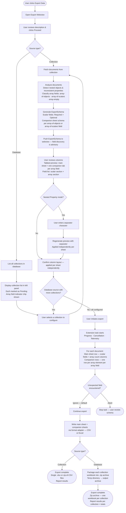

# Architecture

## System

### UI Layer

Each UI (Export webview, Import webview) is a dedicated React webview following the extension's standard webview pattern (see [react-webview-architecture skill](../../../../.github/skills/react-webview-architecture/SKILL.md)).
All UI components must use **FluentUI React v9**.

### Communication Layer — tRPC

The webview communicates with the extension host exclusively through tRPC procedures (see [webview-trpc-messaging skill](../../../../.github/skills/webview-trpc-messaging/SKILL.md)):

- **Queries** — fetch schema, preview rows, collection/database lists.
- **Mutations** — confirm schema, start export/import task.
- **Subscriptions** — stream task progress and cancellation signals back to the webview.

Each feature has its own `WebviewController` subclass and a dedicated tRPC router on the extension-host side.

### Task API Layer

All long-running operations (export write, import insert) run as extension tasks:

- Progress reporting streamed to the webview via tRPC subscription.
- Cancellation tokens propagated from the webview through to the database adapter.
- Errors, telemetry events, and cleanup (partial file removal on cancel/failure) handled by the task lifecycle.

### Database-Neutral Adapter Pattern

The core export and import pipelines are database-neutral:

| Concern | Location |
|---|---|
| File reading / writing (CSV, Excel) | Shared pipeline |
| Field schema discovery & fixed contract | Shared pipeline |
| Document transformation & row mapping | Shared pipeline |
| Schema preview & column customization | Shared pipeline |
| DocumentDB-specific document fetch / cursor | DB adapter |
| DocumentDB-specific document insert / upsert | DB adapter |
| Conflict resolution, retry, throttle handling | DB adapter |

This separation allows the pipeline to be reused or adapted by other database extensions.

### File and Folder Conventions

Each webview follows the standard layout:

```
src/webviews/import-export
└── exportData/
    ├── ExportData.tsx                # Root component
    ├── exportData.scss
    ├── exportDataContext.ts          # Context + state types
    ├── exportDataController.ts       # WebviewController subclass
    ├── exportDataRouter.ts           # tRPC router
    ├── components/
    ├── hooks/
    ├── types/
    └── utils/

src/webviews/import-export
└── importData/
    ├── ImportData.tsx
    ├── importData.scss
    ├── importDataContext.ts
    ├── importDataController.ts
    ├── importDataRouter.ts
    ├── components/
    ├── hooks/
    ├── types/
    └── utils/
```

---

## Control Flow

### Export Feature

The diagram below covers both Collection and Database source paths in a single flow. The Database path converges into the Collection path once a collection is selected for configuration.



### Export Edge Cases and Failure Modes

This section defines expected behavior for non-happy-path export scenarios. It is normative for implementation and tests.

#### Schema Discovery and Contract Formation

| ID | Trigger | Expected behavior |
|---|---|---|
| EXP-SCHEMA-001 | Selected collection has zero documents | Return an empty schema and block task start with a clear UI message: no fields available for export. |
| EXP-SCHEMA-002 | Sampling misses rare fields | Keep discovery advisory only; allow manual field-path addition and show that sampled schema may be incomplete. |
| EXP-SCHEMA-003 | Collection shape changes after schema sampling and before task start | Freeze the confirmed field contract at start; runtime documents are evaluated against that immutable snapshot. |
| EXP-SCHEMA-004 | Path keys contain literal dots (example: `"customer.name"`) | Preserve literal key semantics during extraction and path lookup; do not silently reinterpret as nested path segments. |
| EXP-SCHEMA-005 | Very deep or pathological object nesting | Apply bounded traversal depth and cycle guard to avoid runaway recursion or stack overflow. |
| EXP-SCHEMA-006 | `array-of-scalars` at any path | Classify as `array-of-scalars`; produce companion sheet with `_sourceDocId`, `_arrayIndex`, `value` columns; emit `_count` summary column in main sheet; no array value emitted as a cell in the main sheet. |
| EXP-SCHEMA-006b | `array-of-objects` at any path, collection export | Classify for companion sheet expansion; discover element fields using bounded depth-first walk; emit `_count` column in main sheet; no array value emitted as a cell in the main sheet. |
| EXP-SCHEMA-006c | Arrays nested inside array elements | Treat as leaf in the companion sheet; serialize as JSON text in the element field cell; no recursive companion sheet expansion. |
| EXP-SCHEMA-006d | `array-empty` (always `[]` or absent across all samples) | No companion sheet produced; emit `_count` column in main sheet (always 0); show advisory note in field list; re-evaluate if live export encounters non-empty values at that path. |
| EXP-SCHEMA-007 | Empty-string property key is discovered | Surface as a blocking schema validation issue until the user renames or excludes the field. |

#### Field List, Header Naming, and Preview

| ID | Trigger | Expected behavior |
|---|---|---|
| EXP-FIELD-001 | User unchecks all fields | Disable Export action and reject task start because contract is empty. |
| EXP-FIELD-002 | User creates duplicate output column headers (rename or separator collision) | Block confirmation with a duplicate-header validation error; require uniqueness. |
| EXP-FIELD-003 | User renames a column header to empty text | Block confirmation with a required-header validation error. |
| EXP-FIELD-004 | User adds a manual field path that already exists | De-duplicate safely and preserve a single field entry. |
| EXP-FIELD-005 | Separator set to empty or special regex-like characters | Accept only valid single-character separators, escape safely in implementation, and revalidate headers after change. |
| EXP-FIELD-006 | Preview row limit exceeds available documents | Show only available rows without error and keep selector state intact. |
| EXP-FIELD-007 | Manual field exists in contract but not in preview rows | Keep column visible and render empty cells; this is not an error condition. |

#### Unexpected Field Policy

| ID | Trigger | Expected behavior |
|---|---|---|
| EXP-POLICY-001 | Runtime document contains fields outside the confirmed contract and policy is Ignore | Drop unknown fields silently and continue processing row normally. |
| EXP-POLICY-002 | Runtime document contains fields outside the confirmed contract and policy is Abort | Stop task immediately and report offending field name and document index. |
| EXP-POLICY-003 | Document contains multiple unexpected fields | Report all offending field names for that document in error details to reduce retry cycles. |
| EXP-POLICY-004 | Case-only key differences (example: `orderId` vs `OrderId`) | Treat as distinct keys and evaluate strictly against contract. |

#### Document-to-Row Transformation

| ID | Trigger | Expected behavior |
|---|---|---|
| EXP-ROW-001 | Contract path missing in a document | Emit empty cell for that position. |
| EXP-ROW-002 | Contract path exists with explicit `null` | Emit empty cell; distinguish from string value `"null"`. |
| EXP-ROW-003 | Contract leaf resolves to nested object value | Serialize object to stable JSON string for the output cell. |
| EXP-ROW-004 | BSON Date value | Serialize to ISO-8601 UTC string. |
| EXP-ROW-005 | BSON ObjectId value | Serialize to canonical hex string. |
| EXP-ROW-006 | High-precision numeric BSON values (Decimal128, Int64 beyond safe integer) | Preserve precision by serializing to string rather than lossy JS number. |
| EXP-ROW-007 | Non-finite numeric values (`NaN`, `Infinity`) | Normalize to empty cell and record a conversion warning when applicable. |

#### CSV Writer and Filesystem Behavior

| ID | Trigger | Expected behavior |
|---|---|---|
| EXP-CSV-001 | Cell text contains delimiter, quote, or newline | Apply CSV quoting/escaping rules per selected dialect. |
| EXP-CSV-002 | Selected encoding cannot represent a value | Fail task with encoding error category; do not emit corrupted output. |
| EXP-CSV-003 | Output file path is invalid, unwritable, or too long | Fail fast during start validation before cursor streaming begins. |
| EXP-CSV-004 | Destination file already exists | Apply a deterministic overwrite policy (prompt, fail, or auto-suffix) and keep behavior consistent across runs. |
| EXP-CSV-005 | Disk full or stream write failure mid-export | Abort task, close resources, and clean up partial output file. |

#### Excel Writer Constraints

| ID | Trigger | Expected behavior |
|---|---|---|
| EXP-XLSX-001 | Worksheet row count exceeds Excel max (1,048,576) | Fail with explicit limit error before completing invalid sheet output. |
| EXP-XLSX-002 | Column count exceeds Excel max (16,384) | Block export start with explicit limit error. |
| EXP-XLSX-003 | Sheet name contains invalid characters or exceeds 31 chars | Sanitize and truncate deterministically, then ensure uniqueness. |
| EXP-XLSX-004 | Values begin with formula-like prefixes (`=`, `+`, `-`, `@`) | Write as text values to avoid formula execution. |
| EXP-XLSX-005 | Workbook streaming write fails | Abort task and clean up incomplete workbook output. |

#### Progress, Cancellation, and Task Lifecycle

| ID | Trigger | Expected behavior |
|---|---|---|
| EXP-TASK-001 | Total estimate unavailable or zero | Keep progress bar indeterminate until a safe denominator exists. |
| EXP-TASK-002 | Estimate is inaccurate | Clamp computed percentage and only finalize at task completion event. |
| EXP-TASK-003 | Progress events are high-frequency | Throttle UI updates while preserving final accuracy. |
| EXP-TASK-004 | Cancellation arrives before file creation | Complete cancellation safely without cleanup exception noise. |
| EXP-TASK-005 | Cancellation arrives mid-stream | Stop cursor and writer, then delete partial output file. |
| EXP-TASK-006 | Cancellation requested multiple times | Treat cancellation as idempotent. |
| EXP-TASK-007 | Cleanup deletion fails (file lock or permission race) | Report cancellation as successful but append cleanup warning telemetry/error detail. |

#### Database-Level Export Packaging

| ID | Trigger | Expected behavior |
|---|---|---|
| EXP-DB-001 | Selected database has zero collections | Show empty-state UI and disable export action. |
| EXP-DB-002 | Collection list changes while webview is open | Treat list as point-in-time snapshot; validate existence again at execution time. |
| EXP-DB-003 | Multiple sheet names collide after sanitization/truncation | Apply deterministic suffixing to guarantee unique worksheet names. |
| EXP-DB-004 | Multi-file zip packaging fails | Fail packaging step; delete partial zip; preserve temp directory and surface its path in error detail so the user can access individual collection files. |
| EXP-DB-005 | Only one collection is Ready in multi-collection flow | Database export always produces a zip archive regardless of collection count; single-workbook output is out of scope. |

#### Array Support — Companion Sheets and Zip Packaging

| ID | Trigger | Expected behavior |
|---|---|---|
| EXP-ARRAY-001 | Document has no `_id` field | Use 0-based export position as `_sourceDocIndex`; write as string in companion system field column. |
| EXP-ARRAY-002 | Array field is absent in some documents | Those documents emit zero companion rows; their `_count` in the main sheet is 0. |
| EXP-ARRAY-003 | Array field is `null` in a document | Treat as absent; same behavior as EXP-ARRAY-002. |
| EXP-ARRAY-004 | Array-of-objects elements have inconsistent keys across elements | Apply Required/Optional classification per companion schema; emit empty string for missing optional element fields. |
| EXP-ARRAY-005 | User unchecks all element fields in a companion sheet leaving only system fields | Allow export; companion sheet contains only `_sourceDocId` and `_arrayIndex` columns; valid output. |
| EXP-ARRAY-006 | User unchecks an array field in the array section of the field list | Remove companion sheet, remove `_count` column from main sheet, and remove companion tab from preview — all in real time. |
| EXP-ARRAY-007 | Companion sheet row count exceeds Excel row limit (1,048,576) | Fail the companion sheet write with an explicit limit error identifying which array field caused it; do not fail the main sheet write. |
| EXP-ARRAY-008 | Two array fields produce the same companion sheet name after sanitization or truncation | Apply deterministic numeric suffix: `orders_items`, `orders_items_1`, `orders_items_2`. |
| EXP-ARRAY-009 | Database export cancelled mid-collection | Signal active cursor to stop; delete all temp `.xlsx` files and the partial `.zip` if it exists; report rows written per completed collection. |
| EXP-ARRAY-010 | Zip packaging fails after all collection workbooks are fully written | Delete the partial zip; preserve the temp directory; surface the temp directory path in the error detail so the user can access individual files. |
| EXP-ARRAY-011 | Scalar array contains a null element | Write empty string for that element's `value` cell; `_arrayIndex` still advances; no row is skipped. |
| EXP-ARRAY-012 | All elements in a scalar array share the same BSON type (e.g., all `Date`) | Preserve the native type in the companion sheet cell; apply the same type-mapping rules as main sheet scalar cells. |

#### Telemetry and Error Taxonomy

All export failures should map to stable error categories for analytics and support triage:

- `schema_error`
- `validation_error`
- `unexpected_field_abort`
- `transformation_error`
- `write_error`
- `encoding_error`
- `filesystem_error`
- `array_expansion_error`
- `companion_sheet_row_limit`
- `zip_packaging_error`
- `cancelled`
- `cleanup_warning`

#### Import Feature — File Format and Validation

| ID | Trigger | Expected behavior |
|---|---|---|
| IMP-FILE-001 | User uploads a file that is not a zip archive | Reject with explicit error: "File must be a zip archive. Single CSV or Excel files must be packaged in a zip before import." |
| IMP-FILE-002 | Zip archive is corrupted or unreadable | Fail fast during extraction with clear error message including file path and corruption detail. |
| IMP-FILE-003 | Zip archive contains no valid sheets (empty or no .csv/.xlsx files) | Reject with error: "Zip archive contains no importable files. Expected .csv or .xlsx files." |
| IMP-FILE-004 | Zip archive contains >100 files | Succeed but show warning: "Large archive detected (N files). This may take time to process." |

#### Import Feature — Array Pattern Detection and Matching

| ID | Trigger | Expected behavior |
|---|---|---|
| IMP-ARRAY-001 | Columns detected with `_sourceDocId` and `_arrayIndex` names | Classify as **companion sheet pattern**. Match to main sheet by naming convention: if main sheet is `orders.csv`, look for `orders_{arrayPath}.csv` (e.g., `orders_items.csv`). |
| IMP-ARRAY-002 | Detected companion sheet has no matching main sheet | Show error: "Companion sheet 'orders_items.csv' found but no matching main sheet 'orders.csv'. Rename or provide the main sheet." |
| IMP-ARRAY-003 | Columns detected with bracketed indices (items[0].sku, items[1].sku) | Classify as **indexed tabular pattern**. Extract base path (`items`), index (0, 1), and element field (`sku`). Group all indices for same base path. |
| IMP-ARRAY-004 | Detected column contains valid JSON array strings in majority of non-empty cells | Classify as **JSON-in-cell pattern**. Try-parse cells; confidence threshold >80% non-empty cells are valid JSON. |
| IMP-ARRAY-005 | Multiple array patterns detected in the same sheet (both companion sheet link AND indexed columns for same array) | Prioritize in order: **Companion Sheets > Indexed Tabular > JSON-in-Cell**. Use the highest-priority pattern found and ignore the others. |
| IMP-ARRAY-006 | Array pattern detection encounters parse error (malformed JSON, invalid regex match) | Log warning but continue: include the problematic field as a scalar fallback. Do not fail the entire schema detection. |

#### Import Feature — Companion Sheet Pattern

| ID | Trigger | Expected behavior |
|---|---|---|
| IMP-ARRAY-COMP-001 | Companion sheet has rows with `_sourceDocId` not present in main sheet | Fail import with error identifying orphaned rows: "Referential integrity violation in orders_items.csv: _sourceDocId values [9999, 10000] have no matching documents in orders.csv. Matching documents: [1001, 1002, ...]." |
| IMP-ARRAY-COMP-002 | Companion sheet indices are non-contiguous (e.g., _arrayIndex 0, 2, missing 1) | User choice at import time via **reconstruction policy**: **Compact** (shift indices to 0, 1, 2) or **Sparse** (preserve gaps with null elements). Default: Compact. |
| IMP-ARRAY-COMP-003 | Companion sheet row count exceeds safe limit (>1M rows) | Warn user but allow: "Companion sheet 'orders_items.csv' has N rows. This may be slow to reconstruct. Continue?" |
| IMP-ARRAY-COMP-004 | Main sheet lacks all `_sourceDocId` values that would identify documents uniquely | Fall back to row position (0-indexed) as the join key. Update UI label: "_sourceDocId not found; using row position as document identifier." |
| IMP-ARRAY-COMP-005 | Companion sheet columns are missing after `_sourceDocId` and `_arrayIndex` | Treat as empty array type (no element fields). Result documents have array field as empty `[]`. |
| IMP-ARRAY-COMP-006 | Duplicate `_sourceDocId` values within a single companion sheet for the same array path | Fail with error identifying duplicate key ranges. User must deduplicate or provide different join key. |

#### Import Feature — Indexed Tabular Pattern

| ID | Trigger | Expected behavior |
|---|---|---|
| IMP-ARRAY-IDX-001 | Indexed columns detected for same base path but with inconsistent element field nesting | Example: `items[0].sku` but also `items[0].payment.method` (inconsistent depth). Fail schema detection with error: "Inconsistent nesting depth for array field 'items': rows have both direct fields (items[0].sku) and nested fields (items[0].payment.method). All elements must have consistent structure." |
| IMP-ARRAY-IDX-002 | Indexed column detected but no other columns for same base path and index | Treat as array-of-scalars with single element field per index slot. Example: `tags[0]` → array of scalar strings. |
| IMP-ARRAY-IDX-003 | Index gaps detected in column names (e.g., columns `items[0].sku`, `items[2].sku` but no `items[1].sku`) | Inform user of gap and apply **reconstruction policy** (Compact or Sparse) to decide handling. Show preview with both options. |
| IMP-ARRAY-IDX-004 | Maximum detected index is very high (e.g., `items[500].sku`) | Warn user: "Array field 'items' has up to 500 elements per document. This may result in very wide rows in memory. Continue?" |
| IMP-ARRAY-IDX-005 | Indexed column value is empty for a specific index slot in a row | Treat as absent element at that index. If Compact policy: skip. If Sparse policy: insert null. |
| IMP-ARRAY-IDX-006 | All indexed columns for a particular base path are completely empty in a row | Result in zero array elements for that field in the document (empty array `[]`). |

#### Import Feature — JSON-in-Cell Pattern

| ID | Trigger | Expected behavior |
|---|---|---|
| IMP-ARRAY-JSON-001 | Column contains JSON array strings; some cells are empty or non-JSON | Skip empty cells (treat as `[]` or absent array). Non-JSON cells are logged as conversion errors per error policy (Abort, Skip, or Convert). |
| IMP-ARRAY-JSON-002 | JSON array parses successfully but contains unexpected element types | Example: `[1, "text", null]` for a field expected to be array-of-objects. Parse as-is; user sees mixed-type preview and can rename/reclassify the field. |
| IMP-ARRAY-JSON-003 | JSON cell contains very deeply nested structures | Accept and store as-is (no depth limit for JSON-in-cell, unlike companion sheets). |
| IMP-ARRAY-JSON-004 | JSON string in cell uses non-UTF8 escape sequences | Parse according to JSON spec; if unmappable to UTF-8, apply error policy. |
| IMP-ARRAY-JSON-005 | User has both indexed columns for an array AND a JSON-in-cell column with same base path name | Prioritize pattern by order (Companion > Indexed > JSON) and ignore the lower-priority pattern. Log a diagnostic warning. |

#### Import Feature — Schema Configuration and Reconstruction

| ID | Trigger | Expected behavior |
|---|---|---|
| IMP-ARRAY-SCHEMA-001 | User unchecks all element fields for an array field, leaving only system fields | Allow schema confirmation; array field will be imported as empty array `[]` in all documents. |
| IMP-ARRAY-SCHEMA-002 | User changes the name of an array field during schema configuration | Rename must not conflict with existing top-level field names. Example: renaming array `items` to `product` fails if `product` is already a scalar field. |
| IMP-ARRAY-SCHEMA-003 | User wants to move array elements into a nested document structure | Example: rename array element field from `items.sku` → `items.details.sku`. Allow and treat as nested object within the array element. |
| IMP-ARRAY-SCHEMA-004 | User sets reconstruction policy to **Sparse** for indexed tabular pattern | Array may have null elements at gap positions. Warn: "Sparse arrays with null elements are supported but may require special handling in queries." |
| IMP-ARRAY-SCHEMA-005 | User attempts to rename `_sourceDocId` or `_arrayIndex` system fields | Prevent rename of system fields. Show message: "System fields cannot be renamed." |
| IMP-ARRAY-SCHEMA-006 | User excludes the main document entirely and tries to import only companion sheet data | Block confirmation with error: "At least one scalar or object field from the main sheet must be included to create documents." |

#### Import Feature — Data Transformation and Insertion

| ID | Trigger | Expected behavior |
|---|---|---|
| IMP-ARRAY-XFM-001 | During companion sheet join, a companion row has null or empty `_arrayIndex` value | Treat as invalid; apply error policy (Abort or Skip). |
| IMP-ARRAY-XFM-002 | Reconstructed array element has all-null or all-empty fields after transformation | Include the element with empty/null values (do not skip). If element is supposed to be non-empty, user's schema/policy allows this. |
| IMP-ARRAY-XFM-003 | Final document would exceed safe JSON size (~16 MB) after array reconstruction | Warn during preview; allow import but log a performance warning. DocumentDB insert attempt may fail if document exceeds hard limits. |
| IMP-ARRAY-XFM-004 | Type conversion fails for an array element field (e.g., `sku` expected string but value is valid JSON object) | Apply the error policy: Abort (stop), Skip (skip element or document), or Convert (store as string). |
| IMP-ARRAY-XFM-005 | Insertion of reconstructed document succeeds but array field is unexpectedly empty in the database | Log diagnostic: insertion succeeded but array field mismatch detected; may indicate upstream filtering or null handling. |

#### Import Feature — Telemetry and Error Taxonomy

All import failures should map to stable error categories:

- `file_format_error`
- `zip_extraction_error`
- `file_not_found` (expected sheet in zip)
- `schema_detection_error`
- `array_pattern_conflict`
- `orphaned_rows_error` (companion sheet referential integrity)
- `index_gap_error` (indexed tabular with strict validation)
- `json_parse_error`
- `nesting_inconsistency_error`
- `type_conversion_error`
- `duplicate_key_error`
- `insert_error`
- `cancelled`
- `skip_record_warning`

---

### Import Feature

The diagram covers both Collection and Database destination paths. The Database path resolves to the Collection path for each selected sheet/collection. All input must be a zip archive.

```mermaid
flowchart TD
    A([User clicks Import Data]) --> B[Open Import Webview]
    B --> C[User selects destination type & uploads zip file]
    C --> D[Server extracts zip & detects contents]
    D --> E[Display zip preview with detected collections]
    E --> F{User confirms?}
    F -->|No| G([Cancel or re-upload])
    F -->|Yes| H{Destination type?}

    H -->|Collection| I[Detect array patterns in single sheet\nCompanion sheets · Indexed tabular · JSON-in-cell]
    H -->|Database| J[List all sheets from zip]
    J --> K[For each sheet: detect array patterns]
    K --> L[Display detected collections with array indicators]
    L --> M[User selects, renames, or excludes collections]
    M --> N[User clicks Proceed]
    N --> I

    I --> O[Classify array fields by pattern\nCompanion sheets matched by naming\nIndexed columns grouped by base path and index\nJSON-in-cell columns parsed]
    O --> P[Analyze column names + array patterns\nFlat vs separator-inferred nesting\nDot-notation inference applied]
    P --> Q[Generate sample schema with array reconstruction\nPush to webview]
    Q --> R[User reviews source record + resulting JSON document with arrays\nNavigate bounded preview records]

    R --> S[User customizes schema per sheet\nRename · Rearrange · Move · Type config · Defaults]
    S --> T[Configure array reconstruction\nSparse vs compact policy per array field\nSelect array pattern if multiple detected]
    T --> U[User confirms schema & clicks Proceed]

    U --> V[Extension task starts\nProgress · Cancellation · Telemetry]
    V --> W[Reconstruct arrays from source pattern\nJoin companion sheets on _sourceDocId\nGroup indexed columns by index\nParse JSON strings]
    W --> X[Transform & validate records per confirmed schema]

    X --> Y{Error or conversion\nfailure?}
    Y -->|Abort on error| Z([Stop task — report error and last written record])
    Y -->|Skip invalid records| AA[Collect skipped-record summary\nContinue with valid records]
    Y -->|Convert where possible| AB[Apply conversion\nLog unconverted values]

    AA --> AC[Insert documents via DB adapter]
    AB --> AC

    AC --> AD([Return import summary\nTotal · Success · Failed · Errors])
```


