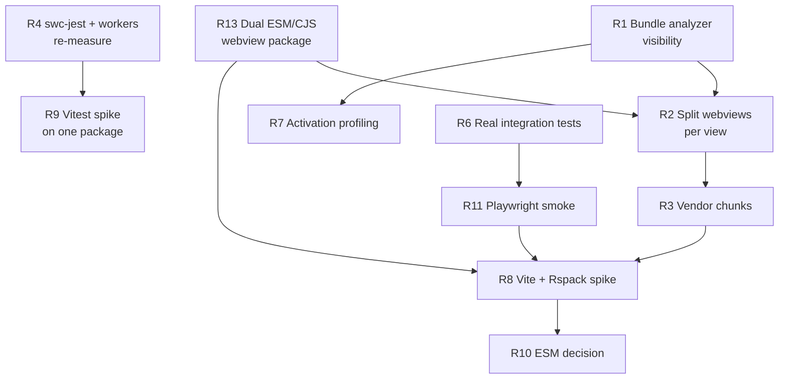

# Modernization Catch-Up: Build, Bundling, and Test Stack

**Research date:** 2026-08-07
**This repo:** `microsoft/vscode-documentdb`, branch `dev/tnaum/modernization`
**Reference repo:** `microsoft/vscode-cosmosdb`, `main` at `4b1bb6c598230a5e22fd4f09934211bdf0572290`

**Companion document:** [`modernization-e2e-testing-strategy.md`](./modernization-e2e-testing-strategy.md) — deep dive on their
Playwright E2E suite and how it relates to our parked PR #867.

---

## Executive Summary & Recommendation

> Added after the research was complete, in response to the constraint: _"assume conversion effort
> can be outsourced to efficient coding agents; I want to do this transformation once and be
> future-proof for a while."_ That constraint changes the answer — see the note at the end of
> this section.

### What the measurements say

I rebuilt and ran the reference repo at the commits immediately before and after their migration.

| Question                          | Answer                                                                                                |
| --------------------------------- | ----------------------------------------------------------------------------------------------------- |
| Is Vite's build faster?           | **Yes — 8.95x** (71.5s → 8.0s), identical source. Their published ~8x claim replicates independently. |
| Does it produce a smaller bundle? | **Yes — ~29% less JavaScript** (completeness-adjusted). The one benefit nothing cheaper replicates.   |
| Smaller VSIX?                     | **Only ~6–10%.** Half the package is copied assets, and ZIP compression flattens the rest.            |
| Is Vitest much faster than Jest?  | **The premise is wrong.** ~95% of the speedup is dropping `ts-jest`; Vitest itself contributes ~5%.   |
| Side effect                       | Their dependency count fell **1,385 → 784 packages (−43%)**.                                          |

### Our two problems are unrelated, and only one is about the stack

1. **The 6.4 MB single-chunk `views.js`** is caused by `LimitChunkCountPlugin({ maxChunks: 1 })` in
   our own config. Local Quick Start and Atlas Credentials load Monaco _and_ SlickGrid despite
   importing neither. A disabled Webpack feature, not a Webpack limitation.
2. **The test suite** uses `ts-jest` in all six projects, type-checking in every worker — which is
   why the config caps `maxWorkers: '25%'`.

### Recommendation: do the full migration, with one hard precondition

Target end state: **ESM + Vite (both targets) + Vitest + Playwright + per-view code splitting.**

| Decision                                | Verdict                                         | Reasoning                                                                                                                                              |
| --------------------------------------- | ----------------------------------------------- | ------------------------------------------------------------------------------------------------------------------------------------------------------ |
| **Vite**                                | **Adopt**                                       | Only path to the ~29% output reduction. Sibling team already solved the hard parts. Vite→Rolldown is the ecosystem direction.                          |
| **ESM**                                 | **Adopt**                                       | Required for the Vite extension-host build; the future-proof direction.                                                                                |
| **Vitest**                              | **Adopt — for pipeline unification, not speed** | One config for dev/build/test. Be honest internally that it is not a speed play.                                                                       |
| **Playwright + real integration tests** | **Adopt — but _after_ the migration**           | Getting E2E right is its own project, and building it on the outgoing stack wastes part of it. This is also what they did. Phase 0 covers the interim. |
| **Rspack**                              | **Drop**                                        | It was a hedge against migration _effort_. That constraint is gone.                                                                                    |
| **Oxlint / Oxfmt**                      | **Skip**                                        | Pure churn, no measured pain, a second linter to maintain forever.                                                                                     |

**The precondition — verify the packaged artifact, not the dev build.** Cosmos DB shipped
**four** post-migration fixes: blank packaged webviews, missing CSS, Monaco workers failing under
the dev server, and dev-watch output corrupting E2E. **None are catchable by unit tests**, and
crucially **none are visible in F5 development mode** — which is why one of them survived 18 days.
Manual testing is acceptable at our current surface (four webviews); testing only via F5 is not.

**But "build E2E first" is the wrong conclusion — their own history disproves it.** [MEASURED]
Cosmos DB migrated on `main` (2026-04-30), had production webview rendering broken for **18 days**,
fixed it (2026-05-18), and only built the Playwright suite **three weeks later** (2026-06-10). No
release was tagged in the broken window — the next tags, `v0.32.1`/`v0.32.2`, are dated 2026-05-19,
the day _after_ the fix — and the fix was never backported to a release branch. **Nothing broken
ever shipped.** They caught it without E2E.

So E2E is not the gate. The gate is **verifying the right artifact**. The reason that bug survived
18 days is precise and instructive: PR #3037 is titled _"restore **production** rendering"_ —
dev mode worked fine the whole time. **F5 development testing would not have caught it.**

### Sequence

| Phase                         | Work                                                                                | Why here                                                                                                                                |
| ----------------------------- | ----------------------------------------------------------------------------------- | --------------------------------------------------------------------------------------------------------------------------------------- |
| **0. Verification checklist** | A written manual checklist run against a **packaged VSIX**, not F5 (see below)      | An hour of work; targets the exact failure classes they hit. E2E is a big project and would partly be built against the outgoing stack. |
| **1. Prerequisites**          | ESM-first build for `@microsoft/vscode-ext-webview`; engine-floor decision          | We already hit CJS friction with it on the Cosmos DB side.                                                                              |
| **2. Migration**              | ESM + Vite (ext + views) + Vitest + per-view lazy loading + `manualChunks`          | Coupled; run as one program.                                                                                                            |
| **3. Lock in**                | CI gates on bundle size and activation time                                         | Prevents silent regression.                                                                                                             |
| **4. Test layers**            | Extension Host integration tests, then Playwright E2E, then unpark the #867 harness | Built **on** the new stack, so none of it is throwaway. Mirrors what they did.                                                          |

**Do not** do the Webpack code-splitting fix first. If Vite is the destination, that work is
throwaway — `manualChunks` is the mechanism that survives. The same logic is why E2E belongs in
Phase 4: its `globalSetup` build invocation and the #867 harness are both stack-coupled.

### Phase 0: the checklist that replaces "build E2E first"

Manual testing is a reasonable call while the surface is four webviews — provided it is written
down and aimed at the right build. Run this **against an installed VSIX** after each migration
step, not against F5:

| #   | Check                                                                | Failure class it catches                               |
| --- | -------------------------------------------------------------------- | ------------------------------------------------------ |
| 1   | Install the packaged VSIX; extension activates                       | Packaging / entry-point / ESM resolution               |
| 2   | Open all four webviews; each renders non-blank                       | Their #3037 — lost entry export in app-mode build      |
| 3   | Styling is correct (grid, editor, splitters, icons, fonts)           | Their #3037 — emitted CSS not linked into webview HTML |
| 4   | Monaco loads and edits; check DevTools for worker errors             | Their #3169 — worker origin under `vscode-webview://`  |
| 5   | DevTools console clean on every panel                                | CSP violations, failed asset URLs, lazy-chunk 404s     |
| 6   | Exercise a lazily-loaded path (Kubernetes plugin, playground worker) | Dynamic-import chunk resolution                        |
| 7   | Confirm dev-watch output cannot be mistaken for production           | Their #3164 — build-mode confusion                     |
| 8   | Record `dist` sizes + activation time                                | Baseline for the Phase 3 CI gates                      |

Checks 2–5 are exactly the bugs the reference project shipped post-migration, and all four are
visible within seconds of opening a panel in a production build.

### The one decision only you can make

**Engine floor.** Cosmos DB ships ESM at `vscode ^1.109.0`; we are at `^1.105.0`. **Update (Part J):**
the Azure Tools migration guide gives the only hard floor as Node 22 → **VS Code 1.101.0**, with no
separate ESM requirement — so we are likely already clear, and Cosmos DB's 1.109 is probably
unrelated to ESM. Confirm empirically before Phase 2, but treat this as a check rather than a
likely blocker.

### How you will know it worked

- All webviews render from a **packaged** build (CSS, Monaco, workers, lazy chunks, real CSP)
- `npm test` runs real Extension Host tests
- Local Quick Start no longer loads Monaco or SlickGrid
- JS output down ~30%; VSIX down ~6–10% (set expectations accordingly)
- Dev-watch and production builds cannot corrupt each other

### Decision log

The recommendation changed three times during this research. Each revision was driven by new
information, and all are recorded here so a later reader can tell current guidance from
superseded guidance.

| Rev             | Recommendation                                                                                                                                       | Why it changed                                                                                                                                                                                                                                                                                                                                                                                                                                                                        |
| --------------- | ---------------------------------------------------------------------------------------------------------------------------------------------------- | ------------------------------------------------------------------------------------------------------------------------------------------------------------------------------------------------------------------------------------------------------------------------------------------------------------------------------------------------------------------------------------------------------------------------------------------------------------------------------------- |
| **1**           | Defer stack changes; capture the cheap wins first (`@swc/jest`, Webpack code-splitting, bundle analyzer). Tiered by effort.                          | Original framing assumed migration labour was the binding constraint. Preserved in Section 0 and Part F.                                                                                                                                                                                                                                                                                                                                                                              |
| **2**           | Do the full migration (ESM + Vite + Vitest), but **build E2E first** as a safety net.                                                                | The constraint changed: conversion effort can be outsourced to coding agents, and the goal is to transform once. With effort no longer binding, deferral arguments lose their force.                                                                                                                                                                                                                                                                                                  |
| **3 — current** | Full migration, but **E2E comes after it**. Phase 0 is a written manual checklist run against a **packaged VSIX**.                                   | The reference project's own timeline disproved "E2E first": they migrated (2026-04-30), ran broken for 18 days, released only after fixing (2026-05-19), and built E2E six weeks later (2026-06-10). Nothing broken shipped. Building E2E first would also mean building part of it against the outgoing stack — the same "don't build on the layer you're deleting" argument already used to reject doing Webpack code-splitting first. Rev 2 applied that reasoning inconsistently. |
| **4 — current** | Unchanged on substance: **Vite for both targets**. esbuild evaluated and rejected as the _primary_ stack, retained as a host-only fallback (Part J). | Reviewed `vscode-azuretools/eng/MIGRATION.md`. Their esbuild standardisation is silent on webviews — our actual pain — and ships as an **alpha** eng package that also imposes Mocha. Two of our assumptions improved though: the ESM engine floor is likely a non-issue (Node 22 → VS Code 1.101.0), and `@microsoft/vscode-azext-utils` already ships dual ESM/CJS.                                                                                                                 |

**What survived every revision:** the measurements in Parts A, C and I, and the four failure
classes in the Phase 0 checklist. Those are evidence, not preference.

> **Note on internal consistency.** Section 0 and Part F below are written _effort-optimized_ —
> they defer stack changes because migration labour is expensive (Rev 1). This Executive Summary
> supersedes them on **sequencing**. The **measurements** in Parts A, C and I are unaffected and
> remain the evidence base.

---

## 0. How to read this document

Everything here is labelled by evidence strength, because "X is faster" claims are where
modernization projects usually go wrong:

| Tag             | Meaning                                                                                                             |
| --------------- | ------------------------------------------------------------------------------------------------------------------- |
| **[MEASURED]**  | Measured on this machine, in this repo, during this research session. Reproducible with the commands in Appendix A. |
| **[PUBLISHED]** | A number or statement published by the Cosmos DB team in their own PR/commit/docs.                                  |
| **[VENDOR]**    | A claim by the tool's own maintainers. Directionally useful, not independent evidence.                              |
| **[INFERRED]**  | My reasoning from the code. Plausible, but not verified by execution.                                               |

The single most important message: **most of the performance win you are looking for does
not require changing the stack.** Two of the biggest costs in this repo are self-imposed
configuration choices that Webpack and Jest would happily let you remove today. Changing
the stack is a separate, later decision, and it should be made on measurements you do not
have yet.

---

## 1. TL;DR — headline findings

1. **Your suspicion is correct, and it is worse than "all webviews load".** [MEASURED]
   `webpack.config.views.js` contains `new webpack.optimize.LimitChunkCountPlugin({ maxChunks: 1 })`.
   That forces **every** webview, every vendor library, Monaco's editor core and SlickGrid
   into one file. `dist/views.js` is **6.4 MB minified**. Opening Local Quick Start — which
   imports neither Monaco nor SlickGrid — loads all 6.4 MB.

2. **This is not a Webpack limitation.** Code splitting is a native Webpack feature that is
   explicitly switched off. You can fix this without Vite, without ESM, and without touching
   the test stack.

3. **Your test suite's likely bottleneck is `ts-jest`, not Jest.** [MEASURED]
   All six Jest projects use `ts-jest`, which runs the TypeScript compiler for type checking
   on every test file, in every worker. Your own config comments say each worker costs
   ~500 MB and therefore caps `maxWorkers: '25%'` — so on a many-core machine you are
   deliberately using a quarter of it. `@swc/jest` is **already in your devDependencies**
   and unused by the root config.

4. **Cosmos DB published one hard number, and we independently reproduced it.** [PUBLISHED + MEASURED]
   PR #2997: "`vite-prod` cold build: ~4s vs webpack ~30s (~8x faster)". Rebuilding their repo
   at that exact commit on this machine: **71.5s vs 8.0s — 8.95x**. The ratio replicates. See Part I.

5. **We measured what they never published: Jest vs Vitest — and the headline is misleading.** [MEASURED]
   Same 551 tests, adjacent commits: **ts-jest 22.4s → Vitest 1.7s (13x)**. But swapping only the
   transform to `@swc/jest`, keeping Jest, gives **2.7s**. So **~95% of the speedup is the
   transform, not the framework.** See Part I.

6. **Your `npm test` is a no-op.** This is the clearest correctness gap in the repo, and it
   is independent of any bundler debate.

7. **On one axis you are upstream of them, not behind.** [MEASURED]
   `@microsoft/vscode-ext-webview` — a package this repo owns and publishes — is already being
   consumed by a Vite-based Cosmos DB branch, where it required a workaround because it ships
   CommonJS only. See Part H.5.

---

## 2. Part A — What is actually true about _this_ repo

### A1. The webview bundle: one file, everything in it

**Evidence chain:**

`src/webviews/_integration/WebviewRegistry.ts` statically imports all four views:

```ts
import { AtlasCredentialsView } from '../documentdb/atlasCredentials/AtlasCredentialsView';
import { CollectionView } from '../documentdb/collectionView/CollectionView';
import { DocumentView } from '../documentdb/documentView/documentView';
import { LocalQuickStart } from '../documentdb/localQuickStart/LocalQuickStart';

export const WebviewRegistry = {
  collectionView: CollectionView,
  documentView: DocumentView,
  localQuickStart: LocalQuickStart,
  atlasCredentials: AtlasCredentialsView,
} as const;
```

`src/webviews/index.tsx` then does a plain object lookup: `const Component = WebviewRegistry[key]`.

A static import plus a static lookup means the bundler must include all four component trees.
Then `webpack.config.views.js` removes the last escape hatch:

```js
new webpack.optimize.LimitChunkCountPlugin({
    maxChunks: 1,
}),
```

**What this costs you** [MEASURED, from the current `dist/`]:

| Artifact                                       | Size                         | Note                                                                        |
| ---------------------------------------------- | ---------------------------- | --------------------------------------------------------------------------- |
| `dist/views.js`                                | **6,405,079 bytes (6.4 MB)** | Verified minified (single line, license banner). One chunk, all four views. |
| `dist/main.js`                                 | 15,796,621 bytes (15.8 MB)   | Extension host bundle, from the same build output.                          |
| `dist/editor.worker.js`, `dist/json.worker.js` | separate                     | Monaco workers _are_ already emitted as separate files.                     |

**Which views actually need the heavy libraries** [MEASURED, by import scan]:

| View               | Monaco                                      | SlickGrid | Verdict             |
| ------------------ | ------------------------------------------- | --------- | ------------------- |
| `collectionView`   | yes                                         | yes       | Genuinely heavy     |
| `documentView`     | yes (`@monaco-editor/react` + `editor.api`) | no        | Needs Monaco only   |
| `localQuickStart`  | **no**                                      | **no**    | Pays for both today |
| `atlasCredentials` | **no**                                      | **no**    | Pays for both today |

So two of your four webviews load a multi-megabyte editor and data grid they never render.
That is the concrete form of the problem you suspected.

**A second, subtler consequence.** `maxChunks: 1` also neutralizes deliberate lazy loading
elsewhere. `src/webviews/query-language-support/registerLanguage.ts` contains:

```ts
const jsLanguage = await import('monaco-editor/esm/vs/basic-languages/javascript/javascript.js');
```

Someone wrote that `await import()` to defer a cost. With `maxChunks: 1` the chunk is folded
back into `views.js`, so the deferral buys nothing at load time. [INFERRED — the plugin's
documented behavior is to merge chunks; not separately verified by build inspection.]

**Why the constraint probably exists** [INFERRED]: the host loads exactly one script file.
`src/webviews/_integration/configuration.ts` declares `bundled: { dir: '', file: 'views.js' }`,
and the framework builds webview HTML pointing at that one file. Additional chunks need a
correct absolute URL under the `vscode-webview://` origin and a CSP that permits them. So
`maxChunks: 1` is a _simplifying_ choice, not an accident.

Encouragingly, the groundwork is already half-present: `src/webviews/typings.d.ts` declares
`__webpack_public_path__`, which is exactly the runtime hook needed to point chunk loading at
the webview base URI.

### A2. The test stack: `ts-jest` everywhere, workers throttled

**Evidence** [MEASURED]. `jest.config.js` root project:

```js
maxWorkers: '25%',
projects: [
    {
        displayName: 'extension',
        testEnvironment: 'node',
        testMatch: ['<rootDir>/src/**/*.test.ts'],
        transform: { '^.+\\.tsx?$': ['ts-jest', {}] },
    },
    '<rootDir>/packages/documentdb-js-schema-analyzer',
    ...
]
```

All five workspace packages use `['ts-jest', {}]` too. The config's own comment states the
reason for the throttle: _"Each ts-jest worker loads the TypeScript compiler and consumes
~500MB+."_

Current suite performance [MEASURED, earlier in this session]:
**210 suites, 3,406 tests, 4 snapshots — 38.2 s wall clock**, at 25% workers.

Two independent costs are stacked here:

1. **`ts-jest` type-checks while testing.** By default it runs a full TypeScript program.
   That is the single slowest common Jest transform. `@swc/jest` (Rust) does syntax-only
   transformation and is typically far faster — and `@swc/jest ~0.2.39` is _already_ a
   devDependency in this repo, alongside `@swc/core`.
2. **Memory pressure forces `maxWorkers: '25%'`.** Type checking is what makes each worker
   expensive. Remove the cause and the throttle can likely be relaxed, which is a second,
   multiplicative win.

**Why this matters for the stack decision:** if you migrate to Vitest _without_ changing this,
you will attribute the speedup to Vitest when much of it actually came from dropping
type-checking-during-test. Conversely, if you fix the transform first and the suite becomes
fast enough, the case for migrating on _speed_ grounds largely evaporates — and you would
migrate (or not) for other reasons like config unification and watch-mode DX.

You lose nothing in safety: `npm run build` already runs `tsc` across the workspace, so types
are checked there. Type checking inside the test runner is duplicated work.

### A3. The extension host bundle

`dist/main.js` is 15.8 MB [MEASURED]. The extension build _does_ split — `dist/` contains
numbered chunks (`58.js` at 4.1 MB, `244.js` at 1.36 MB, `505.js` at 631 KB, and others), and
`src/plugins/service-kubernetes/kubernetesClient.ts` documents a deliberately lazy chunk. So
the ext side is architecturally healthier than the views side.

Still worth attention: a large eager bundle is parsed at activation. VS Code activation time
is user-visible. This deserves its own measurement (Appendix A) before any optimization.

Also note `du -sh dist` reports **131 MB** total [MEASURED]. Much of that is copied resources,
and `dist/.vscodeignore` will exclude some from the VSIX — but it is worth confirming what
actually ships.

---

## 3. Part B — What Cosmos DB did, when, and why

Their modernization was a deliberate, staged program between April and June 2026 — not one
big-bang PR. The staging is the most transferable part.

| Date       | PR                 | What                                                                         | Stated rationale                                                                                                          |
| ---------- | ------------------ | ---------------------------------------------------------------------------- | ------------------------------------------------------------------------------------------------------------------------- |
| 2026-04-20 | #2986              | ESLint → Oxlint                                                              | Speed. Adjacent work, **not** a prerequisite for anything else.                                                           |
| 2026-04-24 | #2996              | `.oxlintrc.jsonc`, tighter ESLint, fix findings                              | Consolidation; kept ESLint alongside Oxlint for rules Oxlint lacks.                                                       |
| 2026-04-30 | #2997              | Webpack configs → ESM (`.mjs`), `"type": "module"`, **Vite added alongside** | Explicitly labelled _"zero-risk benchmark"_. Webpack stayed the default. This is where the ~4s vs ~30s number comes from. |
| 2026-04-30 | #2999              | Vite becomes default; **Jest → Vitest**                                      | Remove duplicate pipelines; single config for dev/build/test.                                                             |
| 2026-05-18 | #3037              | Fix blank packaged webviews + missing CSS                                    | Vite app-mode build dropped the entry's named `render` export; emitted CSS was not linked into webview HTML.              |
| 2026-06-05 | (commit `f7bc40d`) | Mocha → Vitest for integration tests                                         | One assertion API. 52 packages removed.                                                                                   |
| 2026-06-10 | #3136              | Vitest integration runner + Playwright E2E                                   | Real Extension Host + real VS Code + isolated emulator.                                                                   |
| 2026-06-18 | #3164              | Force production `dist` for E2E                                              | A dev watch build looked "fresh" by mtime but broke webview rendering under the harness.                                  |
| 2026-06-23 | #3169              | Fix Monaco workers under Vite dev server                                     | `vscode-webview://` cannot construct a worker from a cross-origin dev URL.                                                |
| 2026-06-23 | #3172              | React component tests                                                        | jsdom + Testing Library, opted in per file.                                                                               |

### The shape worth copying

**Phase 1 was explicitly non-committal.** They added Vite _next to_ Webpack, kept Webpack as
the default F5/watch path, and used the coexistence period to benchmark. Only after that did
they flip the default. That is exactly how to de-risk this in your repo.

### The costs they paid (do not skip this)

The four post-migration fix PRs are the honest price list for a Vite webview migration:

- **Production ≠ dev.** A working dev server proved nothing about the packaged bundle (#3037).
- **CSS delivery is your problem.** Vite emits CSS files; someone must inject `<link>` tags
  into the generated webview HTML (#3037).
- **Workers and origins are subtle.** Monaco workers needed different handling in `serve` vs
  `build` because of the webview origin (#3169).
- **Build modes collide.** Dev-watch output overwriting production output silently broke E2E
  (#3164).

Their `docs/webview-build.md` is a whole document of rationale for non-obvious Vite settings:
relative `base` in prod, ES-module workers, font inlining, flat `assetsDir`, dev-server origin
and CORS, React Refresh preamble, Monaco worker plugin, CSS injection. **That file is the real
scope estimate for "migrate webviews to Vite".**

### One architectural idea worth stealing regardless of bundler

Their `vite.config.views.mjs` uses `manualChunks` to create _stable, cacheable_ vendor groups:
`monaco-editor`, `fluentui`, `griffel`, `react`, `react-data-grid`, and a catch-all `vendor`.
The comments explain the goal: predictable named chunks instead of a "file-name lottery", and
several medium parallel-loadable chunks instead of one huge one. They also note that
`react-data-grid` is deliberately kept out of `vendor` because only two of their views use it —
**precisely the optimization your `maxChunks: 1` currently forbids.**

---

## 4. Part C — The speed evidence, graded honestly

### C1. Build speed: Vite vs Webpack

**The one real data point** [PUBLISHED], from Cosmos DB PR #2997:

> `vite-prod` cold build: ~4s vs webpack ~30s (~8x faster)

Strengths of this evidence: same problem domain (VS Code extension + React webviews + Monaco),
same team, both configs written by people who understood the codebase, measured on the same
machine.

Limits you must respect:

- Single machine, single run, no variance reported.
- Their Webpack config used `ts-loader`; **yours uses `swc-loader`**, which is Rust-based and
  substantially faster than `ts-loader`. Your Webpack baseline is therefore probably better
  than theirs was, so **you should not expect an 8x improvement**.
- "Cold build" excludes watch/HMR, which is what you actually feel while developing.
- Output differences (chunking, minifier, sourcemaps) can dominate.

**Why Vite is architecturally faster in dev** (mechanism, not marketing):

| Phase               | Webpack                                         | Vite                                                     |
| ------------------- | ----------------------------------------------- | -------------------------------------------------------- |
| Dev server start    | Build the graph before serving                  | Serve immediately; transform modules on request          |
| Dependency handling | Push `node_modules` through the loader pipeline | Pre-bundle once with esbuild (Go), then serve cached ESM |
| Single-file edit    | Invalidate + rebuild affected chunks            | Transform the one module, push HMR update                |
| Production          | Webpack compiler                                | Rollup/Rolldown                                          |

The dev-side advantage is real and structural. The production-side advantage is
workload-dependent.

**Vite's own costs**, visible in Cosmos DB's config: they needed `optimizeDeps.include` for
Fluent UI/Griffel and `server.warmup` for ~230 webview source files because otherwise the
first panel open paid a **~1.5 s** sequential transform waterfall [PUBLISHED, in their config
comments]. Vite is not free; it relocates cost.

### C2. Test speed: Jest vs Vitest — what is actually proven

**What Cosmos DB published:** nothing about speed. PR #2999 says "All 536 unit tests pass".
PR #3136 reports "1092 passed, 1 skipped". Their stated motivation is **de-duplication of
pipelines**, not raw speed:

> **Update:** we have since measured this ourselves by rebuilding their repo at the commits
> before and after the migration. See **Part I** for the numbers — they confirm a large
> speedup but attribute ~95% of it to the transform rather than to Vitest.

> "in a world where we have Vite providing support for the most common web tooling…
> Jest represents a duplication of complexity… having two different pipelines to configure
> and maintain is not justifiable" — Vitest docs [VENDOR], echoed by their PR framing.

**What Vitest itself claims** [VENDOR]:

> "Vitest cares a lot about performance and uses Worker threads to run as much as possible in
> parallel. Some ports have seen test running an order of magnitude faster."

Note the careful wording: _"some ports"_. That is a best-case anecdote, not a general result.

**Where a genuine Jest-vs-Vitest gap comes from:**

| Factor             | Effect                                                                             | Applies to you?                        |
| ------------------ | ---------------------------------------------------------------------------------- | -------------------------------------- |
| Transform cost     | `ts-jest` (type-checks) ≫ `babel-jest` > `@swc/jest` ≈ esbuild                     | **Yes — this is your dominant factor** |
| Isolation model    | Jest sandboxes per test file in child processes; Vitest defaults to worker threads | Partially                              |
| Watch mode         | Vitest re-runs only affected tests via Vite's module graph                         | Yes — real DX gain                     |
| Config duplication | Separate test pipeline vs shared Vite config                                       | Only if you adopt Vite                 |
| ESM handling       | Jest's ESM support is still awkward                                                | Only if you go ESM                     |

**The critical caveat:** Jest 30 (which you are on, `~30.3.0`) is markedly faster than the Jest
that most "Jest is slow" blog posts were written about. And with `@swc/jest`, Jest's transform
is _also_ Rust-based. **Equalize the transform and the framework gap narrows dramatically.**

So: "tests will run much faster with the other framework" is **plausible but unproven for your
codebase**, and it is confounded by a variable you can control today for far less effort.

### C3. How to settle it honestly

> **Update:** steps 1–4 below were executed against the _reference_ repo, where the
> before/after commits exist. See **Part I**. They still need running against _this_ repo,
> because our suite is 6.2x larger and structured differently.

Run this sequence. It is designed so each step isolates one variable:

1. **Baseline.** `npx jest --no-coverage` three times, record the median. (Current known value:
   38.2 s.)
2. **Change only the transform.** Swap `ts-jest` → `@swc/jest` in all six projects. Re-measure.
   _This tells you how much of the "Jest is slow" story is really "ts-jest is slow"._
3. **Change only the worker cap.** Raise `maxWorkers` (e.g. `50%`, then `75%`). Re-measure and
   watch memory. _This tells you how much the OOM-avoidance throttle was costing._
4. **Only then**, prototype Vitest on **one** package (e.g. `packages/documentdb-js-schema-analyzer`,
   which is self-contained). Compare against the _already-optimized_ Jest number, not the
   original baseline.

If step 4 still shows a decisive win on a fair baseline, you have a real, defensible reason to
migrate. If it does not, migrate later for pipeline unification — or not at all.

---

## 5. Part D — Big picture: what each tool is actually for

Useful if you want the mental model rather than the config details.

**The two runtimes.** A VS Code extension with React webviews is really two programs:

- **Extension host** — Node/Electron. Owns `vscode` APIs, commands, storage, credentials.
  Constraint: VS Code provides `vscode`; native/optional deps must stay external.
- **Webview** — a browser iframe with a synthetic `vscode-webview://` origin, a strict CSP,
  and no Node access. Constraint: asset URLs, workers, and CSS must all resolve under that
  origin.

Almost every hard problem in this space comes from the second column.

**Bundler.** Walks imports from an entry, transforms TS/JSX/SCSS, resolves packages, and emits
files for one runtime. It decides _what is in which file_ — which is exactly your webview
problem. Webpack and Vite both do this; they differ mainly in dev-time model and defaults.

**Transformer.** Turns TS/JSX into JS. `tsc`/`ts-jest` (slow, type-aware), Babel (medium),
SWC and esbuild (fast, syntax-only). **Type checking and transformation are separable** —
this is the insight behind both `@swc/jest` and Vite.

**Test runner.** Finds tests, runs them with isolation, provides assertions/mocks/coverage.
Cannot, by itself, prove your extension activates in VS Code or that a webview renders under
CSP. Hence three layers:

| Layer                             | Proves                                 | Cost                        |
| --------------------------------- | -------------------------------------- | --------------------------- |
| Unit (Jest/Vitest)                | Logic, services, components            | Fast                        |
| Integration (real Extension Host) | Activation, commands, contributions    | Medium                      |
| E2E (Playwright + real VS Code)   | Panels actually render; workflows work | Slow, environment-sensitive |

You currently have layer 1 (strong: 3,406 tests) and **neither layer 2 nor 3**.

**Where your subset is thin or non-idiomatic:**

- You use Webpack but disable its central feature (code splitting) for webviews.
- You have `webpack-bundle-analyzer` installed but **commented out** in `webpack.config.views.js`,
  so bundle regressions are invisible.
- You have `@swc/jest` installed but use `ts-jest` everywhere.
- You have `@vscode/test-electron` and `@vscode/test-cli` installed, plus Mocha and reporters,
  but `npm test` is a no-op — dependency weight with no coverage.

---

## 6. Part E — Market overview

**Bundlers / build tools**

| Tool        | Model                                 | Fit here                                                     | Caution                                                       |
| ----------- | ------------------------------------- | ------------------------------------------------------------ | ------------------------------------------------------------- |
| **Webpack** | Mature, plugin/loader based           | What you have; handles dual-target, externals, workers well  | Config-heavy; slower dev model; you own more machinery        |
| **Vite**    | ESM dev server + Rollup/Rolldown prod | Strong fit for React webviews; proven in the sibling repo    | ESM-first; webview asset/CSP/worker work is real              |
| **Rspack**  | Rust, Webpack-API-compatible          | Speed **without** rewriting config; underrated for your case | Verify Monaco plugin + extension-specific plugin parity       |
| **esbuild** | Extremely fast transformer/bundler    | Great for the _extension host_ bundle                        | Fewer features for complex webview output                     |
| **Rollup**  | ESM library bundler                   | Powers Vite's prod build                                     | Not a dev-server story on its own                             |
| **tsup**    | esbuild wrapper for libraries         | Good for `packages/*`                                        | Not an app/webview solution                                   |
| **Parcel**  | Zero-config                           | Low config burden                                            | Rare in VS Code extensions; less control                      |
| **Bun**     | Runtime + bundler + test runner       | Interesting long-term                                        | Extension runtime is Node/Electron; adds a compatibility axis |

**Note on Rspack:** given that your pain is _configuration you already own_ rather than
Webpack's API, Rspack is a legitimate middle path — Webpack-compatible config, Rust speed, no
ESM migration required. It deserves a spike alongside Vite rather than being skipped.

**Test runners**

| Tool            | Role             | Note                                                            |
| --------------- | ---------------- | --------------------------------------------------------------- |
| **Jest**        | Unit             | Mature; Jest 30 is fast; your bottleneck is the transform       |
| **Vitest**      | Unit             | Jest-compatible API; shines when paired with Vite               |
| **Mocha**       | Unit/integration | Historic VS Code integration choice; Cosmos DB dropped it       |
| **node:test**   | Unit             | Zero-dependency, built into Node; viable for `packages/*`       |
| **Playwright**  | E2E              | Can drive Electron/VS Code; the only way to prove panels render |
| **WebdriverIO** | E2E              | Has a dedicated VS Code service; alternative to raw Playwright  |

---

## 7. Part F — Recommendations, in priority order

Ordered by **value ÷ effort**, not by novelty. Tiers 1–2 need no stack change at all.

### Tier 1 — High value, low risk, no stack change

**R1. Turn on bundle visibility first.** _(effort: ~1h)_
Re-enable `webpack-bundle-analyzer` in `webpack.config.views.js` behind an env flag (Cosmos DB
uses `BUNDLE_ANALYZE`). You cannot manage what you cannot see, and every later recommendation
is validated with this. Commit the baseline numbers.

**R2. Split the webview bundle per view.** _(effort: 1–3 days; the biggest single user-facing win)_

This is the fix for the problem you identified. Three coordinated changes:

1. **Remove** `LimitChunkCountPlugin({ maxChunks: 1 })`.
2. **Make the registry lazy** in `src/webviews/_integration/WebviewRegistry.ts`:
   ```ts
   export const WebviewRegistry = {
     collectionView: lazy(() => import('../documentdb/collectionView/CollectionView')),
     documentView: lazy(() => import('../documentdb/documentView/documentView')),
     localQuickStart: lazy(() => import('../documentdb/localQuickStart/LocalQuickStart')),
     atlasCredentials: lazy(() => import('../documentdb/atlasCredentials/AtlasCredentialsView')),
   } as const;
   ```
   `WebviewName = keyof typeof WebviewRegistry` still works, so the compile-time safety you
   documented is preserved. Wrap the render in `<Suspense>` in `src/webviews/index.tsx`.
3. **Make chunk URLs resolvable** under the webview origin. The declaration already exists in
   `src/webviews/typings.d.ts`; since the views build emits ESM (`libraryTarget: 'module'`,
   `experiments.outputModule`), the runtime value can be derived at the top of the entry:
   ```ts
   __webpack_public_path__ = new URL('.', import.meta.url).href;
   ```
   Then confirm the framework's generated CSP permits loading those sibling scripts.

**Expected outcome** [INFERRED — verify with R1]: Local Quick Start and Atlas Credentials
should drop from 6.4 MB to roughly the shared React + Fluent UI + framework core, with Monaco
and SlickGrid moving into chunks loaded only by the views that use them. Measure before
claiming a number.

**Risk to watch:** this is exactly where Cosmos DB got burned — dev worked, production was
blank. Test the **packaged** extension for all four panels, not just the dev server.

**R3. Add stable vendor chunks.** _(effort: ~half a day, after R2)_
Once splitting is on, group `monaco-editor`, `@fluentui/*` + Griffel, `react`/`react-dom`, and
`slickgrid` into named `cacheGroups` via `optimization.splitChunks`. Mirror Cosmos DB's intent:
predictable names, independently cacheable, parallel-loadable.

**R4. Replace `ts-jest` with `@swc/jest`.** _(effort: ~2h across six configs; dependency already present)_
Then raise `maxWorkers` and re-measure. Type safety is unaffected — `npm run build` already
runs `tsc`. Record before/after; this single number determines how much of the Vitest case is
real.

> **Measured on the reference repo (Part I):** this exact swap took their suite from
> **22.4s → 2.7s (8.4x)**. Budget for one caveat: one of their 17 suites failed afterwards with
> `Cannot access 'mockContext' before initialization` — a `jest.mock()` hoisting difference.
> **That same test file, `src/utils/survey.initSurvey.test.ts`, exists in this repo**, and we
> have 313 `jest.mock()` call sites, so expect a handful of similar fixes.
> **R5. Audit what Monaco actually needs.** _(effort: ~2h)_
> `MonacoWebpackPlugin({ languages: ['sql', 'json'] })` — confirm `sql` is still required for a
> DocumentDB/MongoDB-API extension. Dropping an unused language removes a worker and grammar
> weight.

**R13. Ship a dual ESM + CJS build of `@microsoft/vscode-ext-webview`.** _(effort: ~1 day)_
The package this repo publishes is currently CJS-only, which hurts tree-shaking in the webview
bundle you are trying to shrink in R2/R3 — and already forced a workaround in a Cosmos DB
branch. Full rationale in **H.5**.

### Tier 2 — High value, moderate effort, still no stack change

**R6. Restore a real integration test layer.** _(effort: 2–4 days)_
`npm test` being a no-op is your largest _correctness_ gap, and it is independent of Vite.
You already have `@vscode/test-electron`. Start with three tests: extension activates, a key
command is registered, one connection workflow succeeds. Cosmos DB's `scripts/run-integration-tests.mjs`
(~80 LOC) is a good structural model even if you keep Jest/Mocha for now.

**R7. Measure activation cost.** _(effort: ~1 day)_
15.8 MB of extension bundle is parsed at activation. Use VS Code's extension profiler, identify
the heaviest eager imports (Azure SDKs, shell runtime, Kubernetes client), and push more behind
`await import()`. The Kubernetes client already demonstrates the pattern in your codebase.

### Tier 3 — Stack changes, only after Tier 1–2 data exists

**R8. Run a Vite _and_ Rspack webview spike, side by side.** _(effort: 3–5 days)_
Keep Webpack as default. Emit to a separate directory. Success criteria, all four panels, in a
**packaged** build:

- panel renders (not blank), CSS applied
- Monaco loads; workers construct in dev _and_ prod
- lazy chunks fetch under CSP
- HMR works in dev
- production size ≤ post-R2/R3 Webpack numbers

Include Rspack because it may deliver most of the speed with a fraction of the migration risk.

**R9. Prototype Vitest on one package.** _(effort: 1–2 days)_
Use `packages/documentdb-js-schema-analyzer`. Compare against the post-R4 Jest baseline.
Decide on evidence.

**R10. Defer ESM.** ESM conversion (`"type": "module"`, `main.mjs`) is the highest-blast-radius
change: packaging, `__dirname`, worker resolution, optional native deps, compiled tests. Cosmos
DB needed it because Vite is ESM-first for the _extension_ build. You do **not** need it for the
webview-only work in R2/R3/R8. Keep it as a separate, later decision.

**R11. Add a Playwright smoke suite.** _(effort: 2–4 days)_
Only after R6. Start with: launch VS Code, activate, open each of the four panels, assert the
root mounts. This is the regression net that would have caught Cosmos DB's #3037 blank-webview
bug — and would protect your R2 splitting work.

**R12. Skip the lint/format migration for now.** Oxlint/Oxfmt is unrelated to your goals and
Cosmos DB's own history shows it was independent. Revisit only if lint time becomes a
measured complaint.

### Suggested sequencing



---

## 8. Part G — Decision gates

Promote any new tool to default **only** when all hold:

1. Packaged extension activates on Windows, Linux, macOS.
2. All four webviews render from a **production** build: CSS, fonts, Monaco, workers, lazy
   chunks, all under real CSP.
3. Dev server and watch do not corrupt production output (Cosmos DB #3164).
4. Unit coverage green with no unexplained mock/timer/snapshot semantic changes.
5. `npm test` runs real Extension Host tests.
6. Measured: bundle sizes, activation time, first-panel time, dev-server start, save-to-update
   latency, and production build time — each compared against the _optimized_ Webpack baseline
   from Tier 1, not today's baseline.
7. CI produces actionable failure diagnostics.

---

## 9. Part H — What would we actually gain by matching Cosmos DB?

### H.1 The question is really eight questions

"Match Cosmos DB" sounds like one decision. It is at least eight separable ones, and they have
very different payoffs for _this_ repo:

1. ESM package (`"type": "module"`, `main.mjs`)
2. Vite for the webview build
3. Vite for the extension-host build
4. Vitest for unit tests
5. Vitest running inside the real Extension Host for integration tests
6. Playwright E2E against real VS Code
7. Oxlint + Oxfmt replacing/augmenting ESLint + Prettier
8. Their staged migration _method_ (coexistence, then flip)

Bundling these into "modernize the stack" is how a project ends up paying for the expensive
items to get the benefits of the cheap ones.

### H.2 Scope reality check: matching costs us more than it cost them

The migration is not the same size for both repos. Measured:

| Dimension                    | Cosmos DB at migration         | DocumentDB today                                              | Implication                                          |
| ---------------------------- | ------------------------------ | ------------------------------------------------------------- | ---------------------------------------------------- |
| Unit tests to migrate        | 536 (PR #2999)                 | **3,406**                                                     | **~6.4x larger** test migration                      |
| Files touching `jest.*` APIs | —                              | **110**                                                       | Broad, not concentrated                              |
| `jest.*` call sites          | —                              | **1,905**                                                     | Mostly mechanical, but large                         |
| `jest.mock()` calls          | —                              | **313**                                                       | The genuinely risky part (hoisting semantics differ) |
| Extension-host entry points  | 1 (`main.ts`)                  | **3** (`main`, `playgroundWorker`, `playgroundTsPlugin`)      | Vite lib mode is single-entry-oriented               |
| Optional/native externals    | `vscode`, `vs`, Node built-ins | **18** (kerberos, snappy, ssh2, mongodb-client-encryption, …) | Much larger externals surface to port                |
| Engine floor                 | `^1.109.0`                     | `^1.105.0`                                                    | ESM may require raising it — a user-reach cost       |

And the target is not "write two config files". Cosmos DB's actual Vite surface is **507 lines
of config** (`vite.config.ext.mjs` 257 + `vite.config.views.mjs` 250), **six custom plugins**
(`no-extension-imports`, `webview-entry`, `react-refresh-preamble`, `monaco-workers`,
`inline-css`, `bundle-report`), plus **263 lines** of `docs/webview-build.md` explaining why
each non-obvious setting exists, plus **313 lines** of `docs/test-configuration.md`.

That is the honest scope of "matching", and their `ts-loader` starting point made their
before/after look better than yours will (you already use `swc-loader`).

### H.3 Choice-by-choice: gain, cost, verdict

| #   | Choice                                       | What we'd gain                                                                                                                                         | What it costs                                                                                                       | Verdict                                                                                                      |
| --- | -------------------------------------------- | ------------------------------------------------------------------------------------------------------------------------------------------------------ | ------------------------------------------------------------------------------------------------------------------- | ------------------------------------------------------------------------------------------------------------ |
| 8   | **Staged method** (coexist, then flip)       | De-risks everything else; a reversible decision at every step                                                                                          | Nothing — it is a process                                                                                           | **Adopt now.** Free.                                                                                         |
| 5   | **Integration tests in real Extension Host** | Fills a genuine hole: `npm test` is a no-op today. Catches activation/command/contribution regressions                                                 | 2–4 days; can be done with your existing `@vscode/test-electron`                                                    | **Adopt** (see R6). Doesn't require Vitest.                                                                  |
| 6   | **Playwright E2E**                           | The only layer that proves a panel actually renders under real CSP. Would have caught their #3037 blank-webview bug — and protects your splitting work | 2–4 days + CI time + flake maintenance                                                                              | **Adopt, scoped small.** Smoke only.                                                                         |
| 2   | **Vite for webviews**                        | Faster dev server/HMR; native SCSS; `manualChunks` ergonomics                                                                                          | 6 custom plugins' worth of edge cases: CSP, worker origins, CSS injection, asset paths                              | **Defer** until after R2/R3 prove splitting in Webpack. Then compare fairly — and evaluate Rspack alongside. |
| 4   | **Vitest**                                   | Unified config with Vite; better watch mode; single assertion API                                                                                      | 110 files, 1,905 call sites, 313 `jest.mock()` migrations                                                           | **Defer.** Do R4 (`@swc/jest`) first — it may capture most of the speed for ~2h of work.                     |
| 3   | **Vite for extension host**                  | Consistency with the views build; possibly faster prod build                                                                                           | Hardest item for us: 3 entries, 18 native externals, CJS interop, packaging                                         | **Defer.** Lowest gain-to-risk ratio of the set.                                                             |
| 1   | **ESM package**                              | Unlocks item 3; modern module semantics                                                                                                                | Highest blast radius: packaging, `__dirname`, worker resolution, native deps, compiled tests, **engine floor bump** | **Defer / decide separately.** Not required for items 2, 5, 6.                                               |
| 7   | **Oxlint + Oxfmt**                           | Faster lint/format                                                                                                                                     | Re-tuning rules; churn across the codebase; a second linter to maintain                                             | **Skip for now.** No measured pain here.                                                                     |

### H.4 What we'd gain _only_ by matching — versus what's available cheaper

This is the crux of the analysis.

**Gains genuinely unique to matching them:**

- **A single transform pipeline** for dev, build, and test. If you adopt Vite _and_ Vitest,
  one resolver/transform config serves all three. This is Vitest's own stated rationale, and
  it is a real long-term maintenance reduction — it is not, primarily, a speed argument.
- **Native-ESM dev server semantics** — on-demand module transforms and Vite HMR. Webpack's
  dev model cannot replicate this; Rspack partially can.
- **Shared solutions with a sibling team.** Their `docs/webview-build.md` becomes usable
  documentation for your problems, and fixes flow both ways.

**Gains that do _not_ require matching them** (already covered in Part F, Tier 1):

- Per-view code splitting → **Webpack feature you disabled**, not a Vite feature.
- Stable vendor chunks → `optimization.splitChunks` today.
- Bundle visibility → `webpack-bundle-analyzer`, already installed, currently commented out.
- Faster tests → `@swc/jest`, already installed, currently unused.
- Real integration tests → `@vscode/test-electron`, already installed.

**So the honest framing is:** the largest measurable wins available to you right now
(a 6.4 MB single-chunk webview bundle and a type-checking test transform) are **not** things
Cosmos DB's stack gives you and yours withholds. They are things your current stack already
offers and your configuration currently declines.

### H.5 Where we are ahead — and a concrete action that helps both repos

A notable asymmetry surfaced during this research [MEASURED]:

Cosmos DB's `main` still uses its own local webview RPC packages. But the branch
`dev/tnuam/use-npm-webview-api` removes them in favour of **`@microsoft/vscode-ext-webview`** —
the package _this_ repo owns and publishes (`packages/vscode-ext-webview`, v0.10.1).

That branch also records a concrete Vite integration finding, in commit `620206e`:

> `@microsoft/vscode-ext-webview` ships CommonJS. List its dev-facing subpaths in
> `optimizeDeps.include` so Vite pre-bundles the CJS→ESM interop shim at dev-server start,
> instead of triggering a re-optimize and a full webview reload the first time a panel opens.
> _Dev-only and removable once the package ships an ESM build._

Verified against this repo: `packages/vscode-ext-webview/tsconfig.json` sets
`"module": "commonjs"`, and its `exports` map exposes only a `default` condition per subpath —
no `import` condition, no `module` field. It is **CJS-only**.

**R13. Ship a dual ESM + CJS build of `@microsoft/vscode-ext-webview`.** _(effort: ~1 day)_

Gains, in order of value:

1. **Better tree-shaking in the webview bundle.** CJS is hard to statically analyse, which
   works directly against R2/R3 — the 6.4 MB problem. This is a _current_ cost, not a
   future-Vite cost.
2. Removes the workaround already required downstream in Cosmos DB.
3. Removes a known first-panel reload penalty from any future DocumentDB Vite adoption.
4. Improves the package for every external consumer.

This is a rare item that is cheap, benefits the current Webpack setup, benefits a sibling team
today, and de-risks a possible future migration. It should sit in Tier 1.

### H.6 What matching would cost us that is easy to overlook

- **Engine floor.** Cosmos DB ships ESM at `vscode ^1.109.0`; you are at `^1.105.0`. Confirm
  the minimum VS Code version supporting ESM extension entry points before committing —
  raising the floor drops users on older builds. This is a product decision, not a build one.
- **Two migrations at once.** Their #2999 changed the bundler _and_ the test runner in one PR.
  With 3,406 tests, doing the same here would make any regression hard to attribute.
- **Loss of a stable baseline.** Until R1 gives you bundle numbers and R4 gives you a fair test
  baseline, a migration cannot be evaluated — only asserted.
- **Config ownership doesn't disappear.** You would trade ~470 lines of Webpack config for
  ~507 lines of Vite config plus six custom plugins. The maintenance is different, not absent.

### H.7 Net verdict

If the goal is _measurable improvement_, match them **partially and in this order**:

| Action                                                                                                                                                         | Rationale                                                    |
| -------------------------------------------------------------------------------------------------------------------------------------------------------------- | ------------------------------------------------------------ |
| **Match now:** staged coexistence method; real Extension Host integration tests; small Playwright smoke suite; vendor-chunk discipline; bundle reporting in CI | Fills genuine holes or is free                               |
| **Do instead of matching:** enable code splitting; `@swc/jest`; dual-build the webview package (R13)                                                           | Captures the biggest measured wins at a fraction of the cost |
| **Defer, decide on data:** Vite for webviews (compare against Rspack); Vitest                                                                                  | Only justified after a fair baseline exists                  |
| **Skip for now:** ESM extension host; Vite for extension host; Oxlint/Oxfmt                                                                                    | Highest cost, least evidence of benefit for this codebase    |

Expected outcome of that subset: most of the user-visible performance benefit Cosmos DB got,
plus the test-confidence layers they built, **without** the ESM blast radius, the engine-floor
bump, or a 1,905-call-site test migration — while keeping the option to adopt Vite later on
evidence rather than on analogy.

---

## 10. Part I — Measured: rebuilding their repo before and after

### I.1 Why this was worth doing, and the design

Everything in Parts B–C rests on _their_ claims. Those claims cover build time only — they never
published output size, VSIX size, or test-runner timings. Those are exactly the questions that
matter for a go/no-go decision here.

A rare opportunity makes a **controlled** experiment possible: commit `1ae9fd8` (PR #2997) has
**Webpack and Vite configs in the same tree**, with `webpack-prod`, `vite-prod` and `jesttest`
all present. Building both from identical source removes every confound — same dependencies,
same code, same machine, same minification intent.

**Environment:** Linux, 16 cores, 31 GB RAM, Node 22.21.1, npm 10.9.3. Clean builds (both
scripts begin with `rimraf ./dist`). Single runs — treat ±10% as noise.

| Point  | Commit                           | State                                          |
| ------ | -------------------------------- | ---------------------------------------------- |
| Before | `1ae9fd8` (PR #2997, 2026-04-30) | Webpack default; Vite present; Jest + ts-jest  |
| After  | `f0f606f` (PR #2999, 2026-04-30) | Vite default; Vitest; Webpack and Jest removed |

### I.2 Build: Webpack vs Vite, identical source

| Metric                         | Webpack          | Vite            | Delta            |
| ------------------------------ | ---------------- | --------------- | ---------------- |
| **Build wall-clock**           | **71,510 ms**    | **7,975 ms**    | **8.95x faster** |
| `dist` total (`du -sb`)        | 20,315,268 B     | 16,113,151 B    | −20.7%           |
| Top-level JS + MJS             | 9,486,599 B      | 5,264,154 B     | **−44.5%**       |
| JS/MJS chunk count             | 24               | 27              | +3               |
| Monaco core chunk              | 3,616,832 B      | 2,260,518 B     | **−37.5%**       |
| `main.mjs` (extension host)    | 1,953,201 B      | 1,524,722 B     | −21.9%           |
| **`dist` zipped (VSIX proxy)** | **10,999,997 B** | **9,904,851 B** | **−10.0%**       |

**Their published claim reproduced.** They reported ~30s vs ~4s (8x). We measured 71.5s vs 8.0s
(8.95x). Both absolute numbers are ~2.2x slower on this machine, but **the ratio replicates
independently** — which is the part that transfers.

**Important fairness check.** This is not a rigged comparison in Webpack's disfavour:

- Their Webpack views config already enables `usedExports: true`, `sideEffects: true`
  (tree shaking) and a full `splitChunks` setup with `monaco`, `react-vendor`, `fluent-icons`
  cache groups.
- Terser runs with `mangle: true` and **no** `keep_fnames`/`keep_classnames`, so Webpack is not
  penalised by name preservation.
- Both externalize `vscode`/`vs`.

**The one real caveat — and it matters.** The Vite build at this commit is **not production-
complete**. It emits _no_ Monaco worker files and no codicon font, where Webpack emits
`json.worker.js` (784,419 B), `editor.worker.js` (654,938 B) and an 80,340 B `.ttf`. It also
emits CSS to `dist/assets/` that was **not yet linked into the webview HTML** — which is
precisely the bug PR #3037 fixed three weeks later.

Correcting for the missing ~1.52 MB of workers + font:

| Measure            | Raw delta | Completeness-adjusted delta |
| ------------------ | --------- | --------------------------- |
| Top-level JS + MJS | −44.5%    | **≈ −29%**                  |
| Zipped package     | −10.0%    | **≈ −6–7%**                 |

So the honest headline is: **Vite/Rollup produced roughly 30% less JavaScript from identical
source**, largely through better tree-shaking and flat-scope hoisting rather than any
configuration trick.

### I.3 Answering the VSIX question directly

> _"did they manage to reduce the size of the vsix?"_

**Yes, but far less than the bundle numbers suggest — roughly 6–10%.**

The reason is instructive: a 44.5% cut in raw JavaScript became only a 10.0% cut in the zipped
package (≈6–7% adjusted). Two effects compress the win:

1. **About half the package is not JavaScript.** Of Webpack's 20.3 MB `dist`, ~10.2 MB is
   copied `resources/`, `l10n/`, `syntaxes/`, `skills/` and `NOTICE.html` — byte-identical in
   both builds.
2. **A VSIX is a ZIP.** Minified JS compresses well regardless of who minified it, so raw-size
   advantages shrink substantially after deflate.

**Read-across for us:** our `dist` is 131 MB with a 6.4 MB `views.js` and 15.8 MB `main.js`.
Bundler choice would trim the JS share; it would do nothing for the copied-asset share. If VSIX
size is a goal, auditing what gets copied into `dist` is likely worth more than changing
bundler — and it is free.

### I.4 Tests: the decomposition that changes the recommendation

Same 551 tests, 17 suites, same machine.

| Setup                                                           | Commit                | Reported | Wall-clock    | vs ts-jest |
| --------------------------------------------------------------- | --------------------- | -------- | ------------- | ---------- |
| Jest + **ts-jest** (their original)                             | `1ae9fd8`             | 21.342 s | **22,402 ms** | 1.0x       |
| Jest + **`@swc/jest`** (transform swapped, framework unchanged) | `1ae9fd8` + our patch | 1.695 s  | **2,681 ms**  | **8.4x**   |
| **Vitest** (their migration)                                    | `f0f606f`             | 0.974 s  | **1,729 ms**  | **13.0x**  |

**Attribution of the 20,673 ms total gap (wall-clock):**

| Source of speedup                                     | Amount    | Share     |
| ----------------------------------------------------- | --------- | --------- |
| Dropping `ts-jest` for a Rust/esbuild-class transform | 19,721 ms | **95.4%** |
| Vitest itself (over an already-fast Jest)             | 952 ms    | **4.6%**  |

This is the single most decision-relevant result in the whole document. "Tests run much faster
on the other framework" is **true in outcome but wrong in cause**. The framework contributes
about one twentieth of it. The rest is not running the TypeScript compiler inside the test
runner — which you can stop doing today, on Jest, in an afternoon.

**Caveats, stated plainly:**

- The `@swc/jest` run completed 515 of 551 tests because **one suite failed to run**:
  `src/utils/survey.initSurvey.test.ts` — `ReferenceError: Cannot access 'mockContext' before
initialization`, a `jest.mock()` factory referencing a `const` declared below it. `ts-jest`
  tolerated the hoisting; `@swc/jest` does not. If that suite is unusually slow, the 2,681 ms
  figure is slightly optimistic.
- Vitest ran all 551. Their PR #2999 notes they used `vi.hoisted` for hoisted mocks — i.e.
  **they had to fix the same class of problem**, just under different syntax.
- Single runs; no warm/cold cache control beyond clean checkouts.

**Direct read-across to this repo:** that failing file, `src/utils/survey.initSurvey.test.ts`,
**exists here too**, and we have 313 `jest.mock()` call sites. Expect a small number of hoisting
fixes on the `@swc/jest` path — and note that the Vitest path requires those same fixes _plus_
rewriting 1,905 `jest.*` call sites across 110 files.

### I.5 A side finding: dependency weight

`npm ci` package counts at the two commits:

| Commit    | Stack                           | Packages installed |
| --------- | ------------------------------- | ------------------ |
| `1ae9fd8` | Webpack + Jest (+ Vite present) | **1,385**          |
| `f0f606f` | Vite + Vitest                   | **784**            |

**−601 packages (−43%).** Consistent with their commit note about removing 52 packages just for
Mocha. Smaller install, smaller supply-chain surface, faster CI `npm ci` — a real benefit that
nobody quantified before now, and one that has nothing to do with runtime performance.

### I.6 What this changes in the recommendations

| Finding                                             | Effect on the plan                                                                                                       |
| --------------------------------------------------- | ------------------------------------------------------------------------------------------------------------------------ |
| ~95% of test speedup is the transform               | **Strengthens R4** and further justifies deferring the Vitest migration until after it                                   |
| SWC hoisting failure is real                        | **Adds a known cost to R4** — small, but budget for it                                                                   |
| Vite produced ~29–44% less JS from identical source | **New, genuine argument for Vite** that no cheaper change replicates — raises the value of the R8 spike                  |
| VSIX only shrank ~6–10%                             | **Lowers** the priority of bundler choice if package size is the goal; **raises** the priority of auditing copied assets |
| Build ratio (~9x) reproduced                        | Vite's dev-loop advantage is real; still must be re-measured against our `swc-loader` baseline, not theirs               |
| −601 packages                                       | Adds a maintenance/supply-chain argument that was previously invisible                                                   |

**Net:** the case for `@swc/jest` (R4) is now strongly evidenced. The case for Vitest on _speed_
grounds is much weaker than folklore suggests. The case for Vite gains a **new** dimension —
output size — that is not available from any Webpack-side tuning, and that should now be an
explicit success criterion in the R8 spike.

---

## 11. Part J — esbuild and the Azure Tools path

Source: [`vscode-azuretools/eng/MIGRATION.md`](https://github.com/microsoft/vscode-azuretools/blob/main/eng/MIGRATION.md).
This matters more than a random third-party comparison, because that repo publishes the
`@microsoft/vscode-azext-*` packages **this extension depends on**.

### J.1 What esbuild is

A bundler and transformer written in Go. It is the fastest mainstream option and is deliberately
narrow in scope: it transforms and bundles: it is not a dev-server/framework tool. Vite itself
uses esbuild internally for dependency pre-bundling and TS/JSX transforms.

One constraint dominates everything below: **esbuild code splitting works only with `esm` output
format.** [VENDOR — esbuild docs; corroborated by the Azure Tools guide, which discusses splitting
exclusively in its ESM section.]

### J.2 What the Azure Tools team actually standardised

Not "esbuild" in isolation — a whole shared engineering package, `@microsoft/vscode-azext-eng`,
which supplies eslint config, esbuild config, Mocha setup, `vscode-test` config and vsce.
Consuming extensions **delete their own** lint/bundle/test/publish devDependencies — including
`typescript`.

| Element            | Their choice                                                                  |
| ------------------ | ----------------------------------------------------------------------------- |
| Bundler            | esbuild, via `esbuild.mjs` + `autoSelectEsbuildConfig()`                      |
| Entry              | `main.mjs` thin loader that `await import()`s the bundle                      |
| Node/VS Code floor | Node 22 → **minimum VS Code 1.101.0**                                         |
| ESM                | **Optional**, and its stated purpose is "allows ESBuild to do code splitting" |
| Unit tests         | **Mocha**, run directly on TS via Node `experimental-transform-types` + tsx   |
| VS Code tests      | `.vscode-test.mjs`                                                            |
| Webviews           | **Not addressed at all**                                                      |

### J.3 Three assumptions of ours that this corrects

**1. The engine-floor worry is largely defused.** [MEASURED / PUBLISHED]
I previously flagged that Cosmos DB ships ESM at `vscode ^1.109.0` while we are at `^1.105.0`.
The Azure Tools guide states the only hard floor as **Node 22 → VS Code 1.101.0**, and gives no
separate ESM engine requirement. We are already above that. Cosmos DB's 1.109 is therefore
likely unrelated to ESM. Still worth an empirical check, but this is no longer a likely blocker.

**2. Our main Azure dependency is already ESM-ready.** [MEASURED]
`@microsoft/vscode-azext-utils@4.1.0` ships **dual ESM/CJS** with a proper conditional exports map
(`import` → `dist/esm/...`, `require` → `dist/cjs/...`). Their guide requires `^4.0.4` for ESM;
we satisfy it. The other three are **CJS-only** (no exports map): `vscode-azext-azureutils@4.2.0`,
`vscode-azext-azureauth@4.1.1`, `vscode-azureresources-api@2.5.1`. Both Vite and esbuild handle
that through CJS interop — it is exactly why Cosmos DB injects a `createRequire` banner — but it
confirms we will need that shim.

**3. ESM is no longer a differentiator; it is a prerequisite.**
Vite is ESM-first. esbuild needs ESM **to code-split at all**. Since per-view code splitting is our
headline problem, **every path that solves it requires ESM.** ESM therefore stops being a
cost to weigh against Vite and becomes a shared precondition.

### J.4 esbuild vs Vite on the dimensions that matter here

| Dimension                                  | esbuild                  | Vite                                                                  |
| ------------------------------------------ | ------------------------ | --------------------------------------------------------------------- |
| Raw speed                                  | Fastest available        | Fast (uses esbuild for transforms; Rollup/Rolldown for prod)          |
| Extension-host bundle                      | Excellent fit            | Proven by Cosmos DB; measured **−21.9%** vs webpack on `main.mjs`     |
| Multiple entrypoints (we have **3**)       | Native, trivial          | Supported via `build.lib.entry` object / `rollupOptions.input`        |
| Externals (we have **18** optional/native) | Simple array/function    | Function-based; equally workable                                      |
| Code splitting                             | **ESM output only**      | Yes, with `manualChunks` control                                      |
| Tree-shaking quality                       | Good                     | Generally better (Rollup); we **measured −29% JS** overall vs webpack |
| React webviews                             | No HMR / no Fast Refresh | Dev server + HMR + React Refresh                                      |
| SCSS                                       | Needs a plugin           | Native                                                                |
| Monaco workers                             | Manual wiring            | Query-suffix support (they still needed a custom plugin)              |
| CSS emission for webviews                  | Basic                    | Full asset pipeline (still needs HTML `<link>` injection)             |
| Test-runner alignment                      | Mocha (their stack)      | Vitest shares the config/transform                                    |
| Config surface                             | Small                    | Larger (Cosmos DB: ~507 lines + 6 plugins)                            |

### J.5 The decisive observation

**The Azure Tools guide is silent on webviews.** Its entrypoint examples are "the extension itself
plus one for each language server". It is an excellent answer to _extension-host_ bundling.

Our actual pain is a **webview** problem: a 6.4 MB single-chunk `views.js` containing Monaco,
SlickGrid, Fluent UI and SCSS, needing HMR for development and CSP-correct assets in production.
esbuild alone does not address that, and `@microsoft/vscode-azext-eng` does not either.

### J.6 The three real options

| Option                                                                  | Shape                     | Pros                                                                                  | Cons                                                                                                             | Verdict                 |
| ----------------------------------------------------------------------- | ------------------------- | ------------------------------------------------------------------------------------- | ---------------------------------------------------------------------------------------------------------------- | ----------------------- |
| **A. All-Vite** (Cosmos DB path)                                        | One tool, both targets    | Measured −29% JS / 8.95x build; best webview DX; Vitest alignment; one config surface | Larger config; we own the webview edge cases                                                                     | **Recommended**         |
| **B. All-esbuild via `@microsoft/vscode-azext-eng`** (Azure Tools path) | Shared eng package        | Ecosystem alignment; least bespoke host config; lint/test/publish included            | **No webview story**; pulls in Mocha, conflicting with Vitest; package is **alpha** (`latest` = `1.0.0-alpha.1`) | **Not viable alone**    |
| **C. Hybrid** — esbuild for host, Vite for webviews                     | Two tools, one per target | Best-of-both; esbuild is a natural fit for a 3-entry Node bundle                      | Two config surfaces to maintain; splits the "do it once" story                                                   | **Documented fallback** |

**Recommendation: Option A**, for three reasons:

1. **`@microsoft/vscode-azext-eng` is alpha** (`latest: 1.0.0-alpha.1`, `alpha: 1.1.0-alpha.3`).
   Building a "do it once, stay future-proof" migration on an alpha shared eng package is the
   opposite of future-proof.
2. **It is a whole opinionated stack, not a bundler.** Adopting it means adopting their Mocha and
   ESLint choices too, which conflicts with the Vitest direction and deepens Azure-Tools coupling
   at a time when this extension is positioning as DocumentDB-first.
3. **Rollup's tree-shaking is what produced the measured win.** The −29% figure came from
   Vite/Rollup. esbuild's tree-shaking is good but generally less aggressive, and nobody has
   measured it here.

**Trigger for falling back to Option C:** if the extension-host Vite build proves genuinely painful
— specifically the 18 optional/native externals, the 3 entrypoints, or CJS interop with the
mongosh/kerberos family — swap **only that target** to esbuild. The webview decision is unaffected.

### J.7 Steal these regardless of bundler choice

The guide contains hard-won gotchas that apply to us whichever path we take:

| Gotcha                                                                                                                           | Why it matters here                                                                                                                                    |
| -------------------------------------------------------------------------------------------------------------------------------- | ------------------------------------------------------------------------------------------------------------------------------------------------------ |
| `"type": "module"` is required or **telemetry silently breaks**                                                                  | We have substantial telemetry; this is a silent failure we would ship                                                                                  |
| `main.mjs` becomes a thin loader that `await import()`s the bundle                                                               | Clean pattern; also removes the bundled-vs-unbundled env-var switch                                                                                    |
| "A lot of the time, the externals are no longer needed — do your research"                                                       | We carry **18**. Auditing them is likely to shrink the bundle for free                                                                                 |
| "Build your VSIX, unzip it, compare contents to the previous version"                                                            | Adopt directly into the Phase 0 checklist                                                                                                              |
| Tests import a **copy** of `src`, not the extension's live instance — so `extensionVariables` and other shared state do not work | Independently matches Cosmos DB's conclusion that integration tests must target the public API surface. Design our Phase 4 tests that way from day one |

---

## 12. Part K — Consolidated adoption checklist

Every "steal this" item found across both reference projects, in one place. Nothing here is new —
it is an index into the detail, so this section can be worked through without re-reading the
document.

### K.1 From Cosmos DB — build & bundling

| #   | Pattern                                                                                                                   | Why                                                                                  | Detail      |
| --- | ------------------------------------------------------------------------------------------------------------------------- | ------------------------------------------------------------------------------------ | ----------- |
| 1   | **Coexistence phase**: add the new bundler alongside the old, keep the old as default, flip only after benchmarking       | Makes every step reversible; it is how they de-risked the whole program              | Part B      |
| 2   | **Named vendor chunks** via `manualChunks` — `monaco-editor`, `fluentui`, `griffel`, `react`, `react-data-grid`, `vendor` | Cacheable, predictable, parallel-loadable; avoids the "chunk name lottery"           | Part B      |
| 3   | **Keep heavy libs out of the shared `vendor` chunk** when only some views use them                                        | Exactly our Local Quick Start / Atlas Credentials problem                            | Part B, A1  |
| 4   | **Do not force-group lazily-imported code into named chunks**                                                             | Silently defeats the `await import()` boundary                                       | Part B      |
| 5   | **`optimizeDeps.include`** for Fluent UI / Griffel / our own CJS packages                                                 | Prevents a dev re-optimize + full webview reload on first panel open                 | Part B, H.5 |
| 6   | **`server.warmup`** for webview sources                                                                                   | They measured ~1.5 s of first-open transform waterfall without it                    | Part C1     |
| 7   | **Bundle report committed to CI**                                                                                         | Bundle regressions are otherwise invisible                                           | Part F (R1) |
| 8   | **Document non-obvious build settings in one file** (their `docs/webview-build.md`)                                       | `base`, worker format, `assetsDir`, CORS, CSP, font inlining each have a real reason | Part B      |

### K.2 From Cosmos DB — testing

| #   | Pattern                                                                                           | Why                                                                                 | Detail       |
| --- | ------------------------------------------------------------------------------------------------- | ----------------------------------------------------------------------------------- | ------------ |
| 9   | **`consoleHealth` with an empty allowlist** — fail on any `console.error` from the webview origin | Arguably their best idea; catches CSP, asset and runtime errors automatically       | E2E doc §1.3 |
| 10  | **Worker-scoped Playwright fixtures** + `closeAllEditorTabs` in `afterEach`                       | ~5 s vs ~50 s per 10-test file                                                      | E2E doc §1.3 |
| 11  | **Activation handshake before any spec runs**                                                     | Removes a whole class of flake                                                      | E2E doc §1.3 |
| 12  | **Test-only commands** gated by env var **and** context key                                       | Reach real states fast without shipping them to users                               | E2E doc §1.3 |
| 13  | **Build-mode marker** in staleness checks, not just mtime                                         | A dev watch build looked "fresh" and silently broke E2E (their #3164)               | E2E doc §1.3 |
| 14  | **Run-scoped isolation** (`runId` + temp/results/reports dirs)                                    | Parallel workers and repeat runs never collide                                      | E2E doc §1.3 |
| 15  | **Self-managed screenshot/trace capture** with env-var modes                                      | Playwright's declarative capture does not apply to a manually launched Electron app | E2E doc §1.3 |
| 16  | **Separate Docker project + ports** for any test backend                                          | Never touches the developer's own instance                                          | E2E doc §1.3 |
| 17  | **Integration tests target only the public API surface**                                          | Independently confirmed by the Azure Tools guide (see #22)                          | Part B       |

### K.3 From Azure Tools (`vscode-azuretools/eng/MIGRATION.md`)

| #   | Pattern                                                                                   | Why                                                                      | Detail |
| --- | ----------------------------------------------------------------------------------------- | ------------------------------------------------------------------------ | ------ |
| 18  | **`"type": "module"` is mandatory or telemetry silently breaks**                          | We have substantial telemetry; this is a failure we would ship unnoticed | J.7    |
| 19  | **`main.mjs` as a thin `await import()` loader**                                          | Also removes the bundled-vs-unbundled env-var switch entirely            | J.7    |
| 20  | **Audit externals — "a lot of the time they are no longer needed"**                       | We carry **18**; removing stale ones shrinks the bundle for free         | J.7    |
| 21  | **Unzip the VSIX and diff against the previous version**                                  | Cheap, catches packaging surprises; folded into Phase 0                  | J.7    |
| 22  | **Tests import a _copy_ of `src`** — shared state like `extensionVariables` will not work | Design Phase 4 integration tests around the public API from day one      | J.7    |
| 23  | **Type-check as a separate `--noEmit` step** alongside bundling                           | Neither esbuild nor Vite type-checks; `tsc` must stay in the pipeline    | J.4    |

### K.4 Ours to fix (found during this research)

| #   | Item                                                                              | Detail    |
| --- | --------------------------------------------------------------------------------- | --------- |
| 24  | Remove `LimitChunkCountPlugin({ maxChunks: 1 })` and lazy-load views              | A1, F(R2) |
| 25  | Replace `ts-jest` with a fast transform; expect `jest.mock()` hoisting fixes      | A2, I.4   |
| 26  | Ship a dual/ESM build of `@microsoft/vscode-ext-webview` (helps tree-shaking now) | H.5       |
| 27  | Re-enable the bundle analyzer (installed, currently commented out)                | F (R1)    |
| 28  | Audit what gets copied into `dist` — ~half the VSIX is non-JS assets              | I.3       |
| 29  | Restore a real `npm test`                                                         | F (R6)    |

---

## Appendix A — Reproducing the measurements

```bash
# Webview bundle size and whether it is minified
ls -la dist/views.js dist/main.js
head -c 300 dist/views.js && wc -l dist/views.js

# Which views pull heavy libraries
for v in localQuickStart atlasCredentials collectionView documentView; do
  echo "== $v"
  grep -rhoE "from '[^']*(monaco|slickgrid|react-data-grid)[^']*'" "src/webviews/documentdb/$v" | sort -u
done

# Test baseline (run 3x, take median)
npx jest --no-coverage

# Confirm transform in use
grep -rn "ts-jest\|swc/jest" jest.config.js packages/*/jest.config.js
```

### Cross-repo benchmark (Part I)

Reproduces the controlled Webpack-vs-Vite and ts-jest/swc-jest/Vitest comparisons.

```bash
git clone --filter=blob:none https://github.com/microsoft/vscode-cosmosdb.git /tmp/cosmosdb
mkdir -p /tmp/cosmos-bench

# "Before": Webpack + Vite coexist in one commit, Jest still present
git -C /tmp/cosmosdb worktree add /tmp/cosmos-bench/at-2997 1ae9fd8
cd /tmp/cosmos-bench/at-2997 && npm ci

time npm run webpack-prod      # measured: 71.5 s
du -sb dist && (cd dist && zip -qr /tmp/webpack.zip .)

time npm run vite-prod         # measured:  8.0 s
du -sb dist && (cd dist && zip -qr /tmp/vite.zip .)

npx jest --silent              # measured: 22.4 s wall (ts-jest)

# Transform-only swap: keep Jest, change ts-jest -> @swc/jest
npm i --no-save @swc/jest @swc/core
# write jest.swc.cjs with transform '^.+\\.tsx?$': ['@swc/jest', ...]
npx jest -c jest.swc.cjs --silent   # measured: 2.7 s wall

# "After": Vite default + Vitest
git -C /tmp/cosmosdb worktree add /tmp/cosmos-bench/at-2999 f0f606f
cd /tmp/cosmos-bench/at-2999 && npm ci
npx vitest run --silent        # measured: 1.7 s wall

# Cleanup (each worktree carries a full node_modules)
git -C /tmp/cosmosdb worktree remove --force /tmp/cosmos-bench/at-2997
git -C /tmp/cosmosdb worktree remove --force /tmp/cosmos-bench/at-2999
```

## Appendix B — Source trail

**Cosmos DB (public):**

- PR #2997 — ESM + Vite alongside Webpack; **"~4s vs webpack ~30s (~8x faster)"**; 2026-04-30
- PR #2999 — Vite default + Jest→Vitest; "All 536 unit tests pass"; 2026-04-30
- PR #3037 — production webview render + CSS fix; 2026-05-18
- PR #3136 — Vitest integration runner + Playwright E2E; 2026-06-10
- PR #3164 — production-build guard for E2E; 2026-06-18
- PR #3169 — Monaco workers under Vite dev server; 2026-06-23
- PR #3172 — React component tests (jsdom + Testing Library); 2026-06-23
- `docs/webview-build.md`, `docs/test-configuration.md`, `vite.config.views.mjs`, `vitest.config.ts`, `playwright.config.ts`
- Branch `dev/tnuam/use-npm-webview-api` (**not merged to `main`**) — commits `f8d11a9` (remove
  local `@cosmosdb/webview-rpc`) and `620206e` (pre-bundle `@microsoft/vscode-ext-webview`
  subpaths in dev, with the CJS rationale quoted in H.5); 2026-07-29

**Vitest docs (vendor):** `vitest.dev/guide/why`, `vitest.dev/guide/comparisons`

**This repo (measured 2026-08-07):** `webpack.config.views.js`, `webpack.config.ext.js`,
`jest.config.js`, `packages/*/jest.config.js`, `src/webviews/index.tsx`,
`src/webviews/_integration/WebviewRegistry.ts`, `src/webviews/_integration/configuration.ts`,
`src/webviews/typings.d.ts`, `packages/vscode-ext-webview/package.json`,
`packages/vscode-ext-webview/tsconfig.json`, `dist/`
