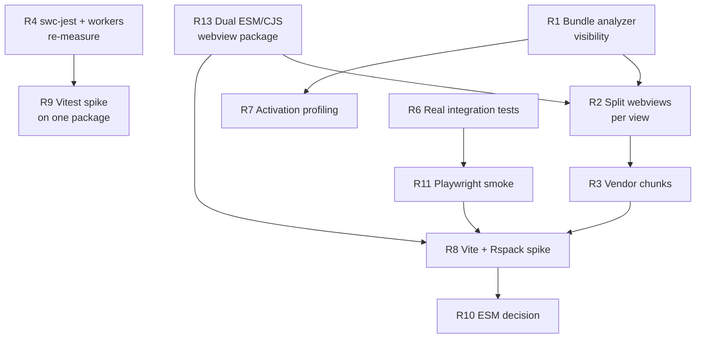

# Modernization Catch-Up: Build, Bundling, and Test Stack

**Research date:** 2026-08-07
**This repo:** `microsoft/vscode-documentdb`, branch `dev/tnaum/modernization`
**Reference repo:** `microsoft/vscode-cosmosdb`, `main` at `4b1bb6c598230a5e22fd4f09934211bdf0572290`

**Companion document:** [`e2e-testing-strategy.md`](./e2e-testing-strategy.md) — deep dive on their
Playwright E2E suite and how it relates to our parked PR #867.

**Re-reviewed:** 2026-09-30 against `vscode-cosmosdb` `main` at `07ac7f86` (84 commits after the
reference commit), and revised on 2026-10-01 after an independent review.

**How to read this document.** The [execution plan](#execution-plan) comes first and reads top to
bottom: scope, ground rules, the automated checks, then Stage 0 to Stage 7 with every task written
into its stage. [Plan background](#plan-background) follows and records why each change exists; it
is not needed to execute a stage. Everything from the Executive Summary down is the original August
research. It is the evidence base, and the execution plan overrides it on sequencing and scope.

Related files in this folder:

- [pipelines-readme.md](./pipelines-readme.md): GitHub Actions and ADO, network isolation, and where
  each check runs.
- [slickgrid-removal.md](./slickgrid-removal.md): the later grid replacement.
- [future-work.md](./future-work.md): deferred items.
- [e2e-testing-strategy.md](./e2e-testing-strategy.md): input for the next iteration.

---

## Execution plan

### Scope

In scope:

- The unit-test runner: Jest to Vitest.
- The webview and extension-host bundlers: webpack to Vite, with per-view code splitting.
- ESM for the extension and for our six workspace packages.
- Removing the legacy Mocha / `@vscode/test-cli` harness under `test/`, which was never maintained
  in this repo and never runs.
- A small set of automated checks on the packaged VSIX, split between GitHub Actions and ADO.

Out of scope:

- The E2E suite (Playwright against a real VS Code, and unparking PR #867). It gets its own
  iteration after this one.
- Replacing SlickGrid. A later iteration with its own plan; this one only isolates it.
- Oxlint / Oxfmt.

### Ground rules

1. **One branch, one PR** (operator, 2026-10-01). All stages are committed to
   `dev/tnaum/modernization`, and its single draft PR to `main` merges only after Stage 6 passes.
   Coding agents must:
   - commit to this branch only, never to `main`, and open no separate per-stage PRs;
   - prefix commit subjects with the stage, for example `S2: convert schema-analyzer tests to Vitest`;
   - keep the PR in draft until G6; CI runs on every push through it;
   - bring in `main` with a merge commit, not a rebase. Merge `main` at the start of every stage and
     before every gate, but only up to a commit whose lockfile is past the 7-day ADO feed
     quarantine. If `main` carries fresher versions, merge an older `main` commit or the latest
     release tag instead. (Operator, 2026-10-02: the branch was rebased onto `v0.11.0` once, because
     the ADO build rejected fresh Dependabot versions that a `main` merge had brought in.) After
     Stage 2, convert any Jest tests that arrive with a merge;
   - never hand-merge `package-lock.json` (or `l10n/bundle.l10n.json`). Take either side and
     regenerate it with the Node and npm versions from `.nvmrc`, so CI's `npm ci` accepts it;
   - maintain the mandatory inline execution record defined in ground rule 8.
2. **Sequential.** Each stage is one stretch of autonomous agent work followed by one operator gate.
   A stage starts only after the previous gate passes. Every stage ends with the branch building and
   passing its checks.
   - **Exception: Stages 1 to 3 run back to back (operator decision, 2026-10-02).** G1, G2 and G3
     are combined into one checkpoint, **G1-3**, after Stage 3. Each of the three stages still ends
     with the branch building and passing its checks and its inline record before the next one
     starts, so the checkpoint reviews three separable stages. The agent stops before G1-3
     only when L1, L2 or L3 fails and the only fix would weaken a check, when ground rule 6 cannot
     be satisfied, or when a decision is needed that this plan does not make. Stage 4 starts only
     after G1-3 passes.
   - **How Stages 1 to 3 are executed (operator decision, 2026-10-02).** One orchestrating session
     (Claude Opus 5.5) runs each stage through subagents and keeps only their reports, to save
     context. Authors: Stage 1 GPT-6.1 Sol; Stage 2 Claude Opus 5.5, with GPT-6.1 Sol subagents for
     the bulk test conversion; Stage 3 Claude Opus 5.5. These replace the picks under each stage.
     The three AI reviews are written after Stage 3, one file per stage, by a separate Claude Opus
     5.5 session. For Stages 2 and 3, author and reviewer are then the same model family, which
     departs from ground rule 7; the operator chose this setup. Where a model offers several context
     sizes, the orchestrator and every subagent use the largest one, which overrides the
     default-context guidance in ground rule 7 and Stage 2.
   - **`TDD:` suites may change in this work (operator decision, 2026-10-02).** This overrides, for
     this branch only, the repository rule to stop and ask before changing a `TDD:` suite. Every
     such change is recorded under its stage's task: the suite and file, whether the behavior
     changed or only the test mechanics, the contract before and after, the reason, and the
     commit. The operator reviews the list at G1-3.
3. **Release.** `main` is not touched until the PR merges, so this plan does not block releases from
   `main`. The modernization reaches users only after the merge, through the release steps in
   Stage 6.
4. **The repository's verification rules apply.** Case 1 while working. Every stage ends with an AI
   review of that stage's diff by the stage's reviewer model, committed as
   `docs/ai-and-plans/modernization/iterations/<NN>-<stage>-review.md`. The full Case 2 list and the
   AI pre-review of CONTRIBUTING.md §6 run once, before the PR is marked ready for review. The checks
   L1 to L3 below run at the end of a stage and in CI, not on every commit.
5. **Verify the packaged VSIX, not F5.** Every gate installs the packaged VSIX. Cosmos DB's four
   post-migration bugs (blank webviews, missing CSS, Monaco workers, a dev build mistaken for
   production) were all invisible in development mode.
6. **New dependencies (operator decision, 2026-10-02).** After every change to `package.json` or a
   lockfile, run the `flagging-fresh-dependencies` skill's scan:
   `node .github/skills/flagging-fresh-dependencies/scripts/find-fresh-dependencies.mjs --fail-on-fresh`.
   For this development and testing phase, remove every version it reports as published within the
   last 7 days, direct or transitive: pin a direct dependency to its newest version older than 7
   days, or add an `overrides` entry for a transitive one, then regenerate the lockfile and rescan
   until it reports none. Exit code 3 means the lookup was incomplete; rerun before concluding.
   Record the scan result (counts, and every version pinned back or overridden) under the stage's
   task. Remove overrides that are no longer needed before G6.
7. **Models.** Each stage names an author model and a reviewer model. The rules behind the picks:
   - author and reviewer come from **different model families**, so they tend to catch different
     mistakes;
   - bulk work goes to the cheaper, efficient models, and risky module and build work to the
     strongest;
   - keep the default context and reasoning settings (for GPT models, input above 272K tokens costs
     about twice as much);
   - avoid models marked ⚠ in the picker (Claude Opus 4.7 and Gemini 3.5 / 3.6 Flash retire on
     2026-10-02).

   The picks come from GitHub's published model descriptions and prices
   ([supported models](https://docs.github.com/en/copilot/reference/ai-models/supported-models),
   [comparison](https://docs.github.com/en/copilot/reference/ai-models/model-comparison),
   [pricing](https://docs.github.com/en/copilot/reference/copilot-billing/models-and-pricing),
   2026-09-30), not from runs in this repo. Revisit them when the model list changes.

8. **Mandatory inline execution record — part of stage completion, not optional housekeeping.**
   Read these ground rules and the stage's existing notes before starting work. For every stage:
   - **Update this plan as work is committed**, directly beneath the task or step concerned. Use
     brief summaries, not a separate work-log section, an end-of-stage reconstruction, or only a
     chat/PR comment. A prompt follow-up documentation commit may cite the implementation hash.
   - **Reference the actual implementation commits** and state what landed. Mark each task as
     completed, deferred, skipped or blocked; distinguish committed work from uncommitted work
     and operator-only steps.
   - **Record deviations and additions with their reasons.** Include alternatives actually
     considered and why they were rejected. If none were evaluated, say so; do not invent an
     operator's rationale or imply that an unavailable operator approved a decision.
   - **Record verification results and limitations inline**, including failures and their
     resolutions, pending checks, and the status of required operator approvals. Do not turn an
     implementation or offline test into a claim that its real-artifact gate passed.
   - **Before declaring stage work complete or handing it to the operator gate**, reconcile the
     stage notes against its commit history and actual check results. Missing summaries, commit
     references, reasons or considered alternatives must be filled in first. A final chat summary
     does not satisfy this requirement, and an updated record does not itself pass the gate.


### The automated checks

Built in Stage 0 and used by every later stage. Operator time is the scarce resource: anything these
checks prove does not go to a manual gate.

**L0: build and unit tests.** `npm run build` (type check), lint, unit tests. Exists today.

**L1: VSIX inspection.** A Node script with no UI and no network. It runs locally, on GitHub
Actions, and in the ADO release build before signing. It unzips the VSIX and:

- diffs the file list and sizes against a committed baseline manifest, with a tolerance;
- asserts that `views.js` exports `render` (the webview HTML imports it by name; Cosmos DB's Vite
  build once dropped it and every panel went blank);
- asserts that every chunk a dynamic import references exists in the VSIX;
- asserts that the production output contains no dev-server strings (`127.0.0.1:18080`,
  `DEVSERVER`);
- records each webview's import graph from the bundle report. From Stage 4 on, it asserts that Local
  Quick Start and Atlas Credentials exclude the Monaco and SlickGrid chunks. Before Stage 4 this
  part only records, because today every view is in one chunk;
- asserts exactly one `bson` module per entry graph (`main`, `playgroundWorker`, each webview).
  Stage 3 explains why.

**L2: production-bundle pass in the integrated browser.** Run by the agent in VS Code's integrated
browser at each gate; automated in CI only in the E2E iteration.

- Serve the `dist/` extracted from the VSIX with a static server, under a non-root path prefix, so
  root-relative asset URLs fail.
- Generate one HTML page per webview from the same template as
  `WebviewController.getDocumentTemplate` in `packages/vscode-ext-webview`: the same CSP meta tag
  with `cspSource` set to the static origin, and the same boot script. Add a fake `acquireVsCodeApi`
  that answers tRPC calls from typed fixtures. Use one static page per view, with no query string:
  the remote port forward mangles query strings.
- Drive each of the five views to a settled, view-specific state with `open_browser_page`,
  `read_page` and `run_playwright_code`, then assert:
  - the fixture's content is visible (for example grid rows, not the Collection View's loading
    animation);
  - view-specific styles (grid, editor, splitter) resolve to their expected computed values;
  - no `console.error`, `pageerror`, `securitypolicyviolation`, `vite:preloadError`, failed request
    or non-2xx response;
  - which chunks were fetched;
  - for Monaco views, a worker round-trip completes (for example a JSON validation marker appears),
    not just worker construction.
- This extends the dev-server technique in
  [live-preview-playwright.md](../live-preview-playwright.md) to the production artifact. Its
  gotchas apply: set no viewport before screenshots, and only answer tRPC paths you have a real
  payload for.

**L2-dev: the scenario page (built in Stage 4, from parked PR #867).** L2 is a release gate: one
settled state per view, from the packaged VSIX, minutes per run. PR #867 showed the other half that
agents need while developing: any state of a panel, in seconds, with no host, backend or Docker. The
two share one core and differ only in what they load:

|         | L2 (gate)                                 | L2-dev (development loop)                   |
| ------- | ----------------------------------------- | ------------------------------------------- |
| Loads   | `dist/` extracted from the VSIX, real CSP | Webview sources from the Vite dev server    |
| States  | One settled state per view                | Many named scenarios per view, three themes |
| Used by | Gates and the release                     | Agents and reviewers while iterating        |

Learnings from #867 that shape both:

- **One fixture core, typed.** #867's scenarios were untyped literals in its HTML and drifted from
  the router while still passing (`willReuse` vs `canReuseExistingData`; missing `suggestedPort`,
  `checkPort`, `onInstanceChanged`). L2's fixtures are typed against `AppRouter` and an unknown
  procedure is an error. L2-dev reuses that core; it does not get its own copy.
- **Escaping actions are recorded, not performed.** #867 logged `common.openUrl`,
  `copyConnectionString` and `openConnection` on `window.__harnessCalls`, which is how "the Windows
  install button opens the Docker Desktop page" became assertable. The shared core records every
  call this way in both modes.
- **Wait for an explicit ready signal**, never `load` or `networkidle`. #867 hung on `load` and
  added `__harnessReady`; L2 hit the same failure and waits for settled content.
- **Address scenarios by path, not query string**: `/<view>/<scenario>/<theme>`. #867 used
  `?scenario=&theme=`, and the remote port forward used here mangles query strings.
- **Stale bundles disappear with the Vite dev server.** #867's "number one time waster" was a stale
  `dist/views.js` from an in-memory `webpack serve`. Do not port its `writeToDisk` patch.
- **Screenshots are artifacts, never baselines.** Text is rendered by the OS; baselines need one
  container image. Settled in #867 and in both reference projects.
- **Prove it can fail.** #867's one falsifiable claim was a mutation test: revert a known webview
  fix and expect exactly its assertions to fail. On this branch that fix is `457b913e` (Local Quick
  Start sends Windows and macOS users to Docker Desktop).

L2-dev adds no new test runner and no `@playwright/test` dependency in this iteration: agents drive
it with the integrated browser tools. Wiring its assertions into CI (Vitest browser mode, option B)
is an E2E-iteration decision; see [e2e-testing-strategy.md](./e2e-testing-strategy.md) §4.

**L3: installed-VSIX activation check.** Runs on GitHub Actions only, because it downloads VS Code,
which an isolated ADO build may block ([pipelines-readme.md](./pipelines-readme.md)). Locally it
needs a display; this dev machine has no Xvfb, so the operator installs it once.

- `@vscode/test-electron` downloads VS Code and installs our VSIX into a temporary
  `--extensions-dir`. The only development extension is a tiny probe extension.
- The probe activates `ms-azuretools.vscode-documentdb` and asserts that:
  - the extension was loaded from the installed VSIX path, not a development path;
  - commands registered late in activation exist;
  - after the run, the log files in the temporary user-data directory (the extension host log and
    our own log channel) contain no errors from our extension.
- The log check matters because `activateInternal` runs initialization inside
  `callWithTelemetryAndErrorHandling`, which does not rethrow by default. A failed initialization
  still returns the API, so "activation succeeded" alone proves little.
- It covers activation-time failures only. Workers, the TS server plugin, native optional
  dependencies, name-dependent code and telemetry are explicit operator checks.

**Prove that each check can fail.** Stage 0 runs L1 to L3 on today's VSIX, where they must pass, and
then on deliberately broken variants, where they must fail: CSS dropped, `render` renamed, a dynamic
import pointing at a missing chunk, an error injected after partial activation. A check that has
never failed has not been shown to work.

**Optional L4: the whole workbench in the integrated browser** through `code serve-web`. A spike got
the workbench running with the packaged VSIX installed, but the extension's views did not appear
yet (see B3). No stage depends on it.

**What only the operator can check** in this iteration: real `vscode-webview://` behavior (Monaco
workers, `asWebviewUri`); dark and high-contrast themes in the real workbench; the F5 / watch / HMR
loop; Windows and macOS; the URI handler on a cold start; the playground worker and the TS server
plugin in a real editor; Kubernetes, Atlas and Azure discovery against real backends.

**The manual checklist** used at the gates. Always on the installed VSIX, never F5:

1. The extension activates.
2. All five webviews render and are not blank: Collection View, Document View, Local Quick Start,
   Atlas Credentials, Cluster Dashboard.
3. Styling is correct: grid, editor, splitters, icons, fonts.
4. Monaco loads and edits; DevTools shows no worker errors.
5. The DevTools console is clean on every panel.
6. A lazily loaded path works: Kubernetes discovery, a playground run.
7. The VSIX came from a production build, not from dev-watch output.
8. Record `dist` sizes and activation time.

### Stage 0: baselines and the automated checks

- **Models:** author **Claude Opus 5.5**, reviewer **GPT-6 Sol**. Open-ended tool building needs
  strong agentic recovery; GPT-6 Sol is a low-cost reviewer with a published model card. Optional:
  build the L1 script head-to-head with GPT-6.1 Sol or GPT-6 Astra as a model trial.
  - **Execution note:** authoring retained the existing session/subagent defaults rather than
    explicitly pinning the author model; the actual author family is not asserted here. GPT-6 Sol
    was explicitly selected for the stage review. No optional model comparison was run, so no
    comparative-model result or operator-approved substitution is claimed.
- **Goal:** measure today's stack and build the checks every later stage relies on, before anything
  changes.
- **Tasks:**
  - Record baselines on today's stack and commit them in this document: `webpack-prod` time (three
    runs), per-file `dist` sizes, VSIX size and file manifest, installed package count, unit-test wall
    time (three runs, median).
    - **Landed in `e100be7d`.** Node 22.18.0, npm 10.9.3; production-build wall times:
      **125.167 / 122.616 / 120.087 seconds**. Jest wall times:
      **61.784 / 41.721 / 43.031 seconds**, median **43.031 seconds**. All three runs passed:
      **291 suites, 4,562 tests, four snapshots**. Package inventory: **1,836 installed locations**
      from `npm ls --all --parseable`, excluding the repository root.
    - Measured `dist`: **31,739,702 bytes across 123 files**; `views.js`: **6,490,321 bytes**;
      `main.js`: **4,761,155 bytes**. The complete per-file inventory and raw timings are committed
      in [measurements.json](../../../build/verification/measurements.json).
    - The initial baseline production VSIX is **9,606,938 bytes, 124 archive files**; its file/size manifest and
      entry graphs are committed in [baseline.json](../../../build/verification/baseline.json).
      SHA-256: `aee1a0591f3342adbf439831b007178babd3bc96d8f0cb65c25c0ef2678abe42`.
      Timing runs were sequential, without concurrent production builds/full test suites. The
      workspace lockfile arrived through the preparatory `main` merge (`35622214`); `npm ci`
      succeeded. No dependency versions were added or changed by Stage 0.
    - **Progress records:** `4dee490e` committed these measurements and implementation results
      inline; `a90c79ef` committed subsequent gate evidence and the stage review; `f5614a1b`
      completed the inline reasons, alternatives and final browser proof. The initial
      baseline remained unchanged after the lifecycle fix: later artifacts were compared with the
      measured starting point rather than replacing it with a more convenient baseline.
    - **Rebased onto `v0.11.0` and re-baselined (operator, 2026-10-02).** The operator-run ADO
      build failed because the preparatory `main` merge had brought in Dependabot versions still
      inside the 7-day feed quarantine (#983 to #989). The operator chose to rebase onto the
      `v0.11.0` tag. The branch's own 22 commits were replayed unchanged; the resulting tree differs
      from the pre-rebase head `051ab71a` only in `package-lock.json` and two release-pipeline
      renames from `main`. L1 then failed against the old baseline, correctly:
      `playgroundWorker.js` grew from 6,555,517 to 7,443,125 bytes (+13.5%), because the older
      `caniuse-lite` (1.0.30001790, via webpack's `browserslist` 4.28.2) is 0.88 MB larger than
      1.0.30001814, and `caniuse-lite` is bundled into the playground worker. There was no product
      change. `baseline.json` and `measurements.json` were regenerated on the `v0.11.0` lockfile
      and are now the Stage 0 reference; the numbers above are the first measurement on `main`'s
      lockfile. Side finding for the Stage 5 externals audit: about 2.3 MB of browser-compatibility
      data ships inside a Node worker; the importing module has not been traced yet.
    - **Re-measured on `v0.11.0` (2026-10-02, Node 22.21.1, npm 10.9.3):** production builds
      **120.796 / 119.535 / 120.139 seconds**; Jest **44.531 / 42.205 / 41.875 seconds**, median
      **42.205 seconds**, all three passing **291 suites, 4,564 tests, four snapshots**;
      **1,836** installed packages. `dist`: **32,628,226 bytes across 123 files**; `views.js`
      **6,490,321**, `main.js` **4,761,367**, `playgroundWorker.js` **7,443,125 bytes**. VSIX
      **9,597,420 bytes**, SHA-256
      `cc7118461d1d327089871b5ec3bee78d00b7bc6a9500f27955977601aee66785`. L1 and its four repacked
      negative controls passed against the regenerated baseline.
  - Re-enable the webpack bundle analyzer (installed, currently commented out in
    `webpack.config.views.js`) behind a `BUNDLE_ANALYZE` environment variable.
    - **Landed in `e100be7d`.** `BUNDLE_ANALYZE=true` writes a static `views.html` report without
      opening a browser/server. Both production configs also write complete module/chunk reports,
      tied to the actual JavaScript bytes with SHA-256. Reports stay outside `dist` and are ignored
      by Git. The opt-in analyzer build passed.
    - **Reason/addition:** machine-readable reports accompany the visual analyzer because L1
      needs complete entry/module/chunk graphs and provenance, not just a treemap. Default
      grouped/filtered stats omitted dependent modules; complete reporting prevents false counts.
      A visual report alone and reports shipped inside the VSIX were not used: the former cannot
      support these assertions, and the latter would change the artifact being measured.
    - **Known limitation, accepted by the operator on 2026-10-02:** `BundleReportPlugin` also runs
      in development builds and reads the emitted files from disk. `watch:views` is `webpack serve`,
      which builds in memory: without an existing `dist/views.js` it fails with
      `ENOENT ... dist/views.js` from `BundleReportPlugin.cjs`; with an older `dist/` it hashes
      stale files. It disappears with webpack (views in Stage 4, host in Stage 6). Until then, run
      `npm run webpack-dev-wv` once before `watch:views`, and never give L1 reports from a dev or
      watch build: regenerate them with `npm run package`.
  - Build L1 with its baseline manifest. Add it to a GitHub Actions job and to the ADO build, before
    the signing step.
    - **Landed in `e100be7d`.** `npm run verify:vsix -- <vsix>` inspects the packaged archive
      offline. GitHub Actions has a separate inspection job consuming the package job's VSIX and
      matching reports. ADO invokes the same check before signing and stages its matching reports
      for operator/release inspection. The operator approved an exact file list and a per-file
      size tolerance of **10% or 4 KiB, whichever is greater**.
    - **Alternatives/reason:** exact sizes and a looser 20%/8 KiB allowance were offered; the
      operator selected 10%/4 KiB. The relative allowance plus an absolute floor handles small
      metadata files without relaxing the exact file list. The ZIP reader uses Node built-ins
      with checksum, size and path validation: adding an unzip dependency or relying on a
      transitive-only package was avoided to keep L1 offline and avoid new feed/quarantine inputs.
    - **Operator direction, 2026-10-02:** a PR that adds or removes assets must not fail L1. The
      exact file list and per-file size tolerance are a candidate for replacement by a PR report
      (added/removed files, size deltas, per-view sizes), keeping the invariant assertions as hard
      failures. The design is not decided; until it is, the exact list stays as implemented.
    - **First ADO run (2026-10-02) failed L1 on `NOTICE.html`:** 1,854,647 bytes against the
      committed 536,377. ADO's `notice@0` task regenerates the file and falls back to the
      committed copy if it fails, so its size depends on the pipeline, not the build. The file
      must still be present, but its size is no longer compared. L1 now reports every size
      mismatch in one run instead of stopping at the first. A check of the local VSIX found no
      other file whose size CRLF conversion on the Windows agent could push past its tolerance.
      This is the same friction as the operator direction above, met in ADO first.
    - **Plan discrepancy requiring G0 confirmation:** today's host and playground worker each
      include one BSON implementation, but all five browser graphs include **zero**. Requiring one
      everywhere would fail the unchanged baseline; adding BSON solely to satisfy the checker
      would change the shipped artifact during a baseline stage. The implemented rule requires one
      in both host graphs and permits zero in browser graphs, while always rejecting duplicates.
      Clarification was requested, but the operator was unavailable; this is an explicit pragmatic
      deviation, not an approved design decision. All five views currently record the same heavy
      graph; the lightweight-view assertion remains opt-in until Stage 4.
      **Accepted by the operator at G0 (2026-10-02):** browser graphs may contain zero or one BSON
      implementation; host graphs exactly one; duplicates always fail.
    - **Review correction landed in `c1d29535`:** numeric webpack chunk references now resolve only
      within the referencing file's owning compilation. A collision/ambiguous-owner regression
      test was added; six inspector tests and the final-VSIX positive/negative checks passed.
      The combined-ID map was rejected because webpack IDs are only unique within a compilation;
      changing the bundler's chunk IDs solely for the checker was unnecessary.
  - Build L2: the page generator and typed fixtures for the five views. Exclude the harness from the
    VSIX through `.vscodeignore`.
    - **Landed in `e100be7d`.** All five registry views have typed fixtures and query-free pages
      beneath `/stage0/l2/`, generated from the extracted VSIX using the unchanged production host
      template/CSP. Existing `build/**` exclusion already covers every harness file; archive
      inspection confirmed **zero packaged harness/probe files**.
    - **Initial final-VSIX rendering proof passed:** five settled fixture views, no unexpected console/page/
      CSP/preload/network errors, matching computed styles, and recorded fetched chunks. Collection
      and Document views completed standalone packaged-worker round-trips, but **review F02
      superseded that worker evidence**: it did not prove the editors used their configured workers.
      The rendered-editor correction landed in `c1d29535`; the final reliable proof is recorded
      below. This is a static-browser artifact check, not real
      `vscode-webview://` behavior. See [the stage review](./iterations/00-stage0-review.md).
    - **Reason/deviation:** construction or a standalone validation reply was insufficient
      evidence of editor integration, so it was replaced rather than retained as a passing proxy.
      Collection View's custom query validator runs on the main thread; its proof uses the actual
      editor worker's Unicode-highlighting response. Document View requires an actual JSON-worker
      validation response. Both correlate the response with the edited model. Product test hooks
      and weaker CSP were avoided; the harness observes production-created workers instead.
    - **Readiness correction landed in `0be05e8c`:** parent reruns exposed hidden-page/layout
      failures, a navigation timeout, and incomplete editor selection. The helper now activates
      the page, waits for visibility, uses bounded `domcontentloaded` navigation, and waits for
      settled content, fonts and editor geometry. It explicitly focuses the editor, uses the
      browser's platform modifier and verifies an empty editor before inserting the probe.
      Keeping `networkidle` or merely increasing that timeout was rejected in favor of checking
      the actual ready state. Viewport overrides, skipped geometry checks and waived diagnostics
      were not used; failed phases remain explicit.
    - **Final L2 proof passed at 2026-10-02 08:21 UTC on the first final-artifact attempt:** all
      five views verified with no unexpected diagnostics or non-2xx responses. Collection View
      completed its rendered-editor `$computeUnicodeHighlights` round-trip; Document View
      completed rendered-editor JSON `doValidation`. The CSS-negative case retained seven
      expected CSS/layout failures, a genuine editor-worker response and no unexpected errors.
      The exact VSIX was **9,607,031 bytes**, SHA-256
      `1a9ed2a78bbbfc5221221d65c2a2495c98a4a37668b048e8dcdd9cb4c966a541`.
      Six reports and compact `proof-summary.json` persist in the execution session's
      `s0-l2-final-vsix-1a9e` directory. This supersedes the older artifact/standalone-worker proof.
      The final local build and **30 native harness tests plus 45 browser Jest tests** passed.
  - Build L3: `npm run test:vsix [path-to-vsix]`, the probe extension, and a GitHub Actions job with
    a cached `.vscode-test/` folder.
    - **Landed in `e100be7d`.** The runner pins VS Code to minimum engine **1.105.0**, installs the
      artifact in isolated temporary directories, launches only the development probe, verifies
      installed path/late commands, and checks real post-exit logs for swallowed activation errors.
      The GitHub job runs both positive and negative controls under Xvfb with a VS Code cache.
    - **Real-host verification remains blocked locally.** The attempted run downloaded VS Code,
      then hit its WSL installation prompt before launching the host. The runner now explicitly
      sets `DONT_PROMPT_WSL_INSTALL=1`, with a regression assertion. No Xvfb/system dependencies
      were installed. A display-enabled GitHub run must prove actual activation and injected-error
      rejection; the **19 offline activation tests are not a substitute**.
      The prompt was fixed instead of treating installation failure as a negative-control pass;
      installing system display packages locally was left to the operator, as planned.
    - **Actions launch correction landed in `afc08faa`:** the third CI run passed code quality,
      product tests, packaging and **L1 on the GitHub-built artifact**, then the installed-host
      job hit Electron's SUID sandbox restriction after successfully installing the VSIX.
      The runner now uses `--no-sandbox` only for Linux `GITHUB_ACTIONS=true` probe runs, not normal
      local launches or generic CI; **20 offline activation tests** cover that scope. Failed-host
      logs are uploaded as diagnostic artifacts. The next push must still prove real activation
      and the injected-error control; a host launch failure is not a successful negative proof.
      Broadly disabling the sandbox for every platform/local run or changing system helper
      ownership/permissions was not used; the correction is confined to the Linux Actions probe.
    - **Baseline-blocking lifecycle correction landed in `ffac8111`:** the fourth CI run did
      activate the installed VSIX and complete the late-command probe. Its logs exposed one
      classifier false positive (`[trace] initData` manifest metadata) and a real pre-existing
      disposal-order bug: `SchemaStore.dispose()` logged after the output channel was disposed,
      throwing and interrupting cleanup. Trace/debug metadata no longer counts as an error, but
      **the genuine shutdown errors remain blocking; none are suppressed**.
    - The small product fix registers schema teardown before its logging dependency while
      preserving all other subscription ordering. **29 schema tests** passed, including final
      logging, complete timer/cache cleanup, singleton reset, and missing-dependency validation;
      **22 offline activation tests** passed. The local build passed. Approval to extend Stage 0
      to this coupled baseline fix was requested, but the operator was unavailable; the pragmatic
      fix preserves intended cleanup rather than relaxing the gate. Ignoring teardown errors was
      rejected because the exception demonstrably skipped cleanup. Leaving the required baseline
      gate permanently failing was the other alternative.
      **Operator, 2026-10-02:** the fix stays on this branch and reaches `main` with the PR; no
      separate fix to `main`.
    - The corrected local production artifact is **9,607,031 bytes**, SHA-256
      `1a9ed2a78bbbfc5221221d65c2a2495c98a4a37668b048e8dcdd9cb4c966a541`.
      L1 and its repacked negative controls passed against the **unchanged initial baseline**.
      These measurements preserve the pre-fix baseline; they are not silently rebased to hide
      artifact changes. The fifth CI push must still prove positive activation and injected-error
      rejection on the actual GitHub-built artifact.
    - **Actual positive/negative host proof passed in run
      [36979370550](https://github.com/microsoft/vscode-documentdb/actions/runs/36979370550)
      at `a6689e76`.** The fifth run had already passed genuine activation/installed-path/late
      commands/clean logs, but its negative injector used the extensionless manifest entry as a
      literal file path. `a6689e76` uses Node's module resolver and preserves the realpath guard;
      **24 offline activation tests** cover extensionless `main`, explicit CJS/ESM paths and
      symlink escapes. The sixth CI run passed **all jobs**, including L1 and actual L3:
      positive activation was clean, and the negative run registered the final commands but its
      real logs rejected `L3_INJECTED_SWALLOWED_ACTIVATION_ERROR`. No activation or shutdown
      errors were waived. The legacy integration step remains disabled; its enclosing job's
      success is not an E2E/integration-test claim.
      Node resolution was chosen over assuming a `.js` suffix because the manifest can use an
      extensionless entry, explicit CJS/ESM files or module-typed JavaScript; the installed-directory
      realpath guard still rejects checkout paths and symlink escapes.
  - Prove each check can fail, as described above.
    - **Landed in `e100be7d`; local proof passed where runnable.** L1 rejected actual repacked
      variants with renamed `render`, missing dynamic-import target, a dev-server string, and a
      missing baseline file. L2's negative page suppresses the production bundle's inserted CSS,
      without changing the CSP or adding override styles: **seven CSS/layout assertions failed**
      while runtime/network diagnostics and the worker round-trip remained clean. This control
      must be adapted when Stage 4 extracts CSS into linked files. L3's partial-activation mutation
      and proof runner initially passed offline; the actual host rejection subsequently passed in
      run `36979370550`, as recorded under L3. CSS suppression was chosen to remove the current
      style-loader output; injecting unrelated override styles would not prove lost production CSS.
    - Local Case 1 verification passed: `npm run build`, the three baseline product Jest runs,
      browser-fixture type-check, initially **24 native harness tests** and **27 scoped browser Jest tests**.
      Pipeline YAML parsing and patch whitespace checks passed. Local lint, localization,
      `prettier-fix`, and the full Case 2 handover suite were not run; CI retains its existing checks.
    - **Draft CI feedback addressed in `c1d29535`:** the first push passed product tests,
      localization, API extraction and CodeQL, but lint and one documentation-formatting check
      failed before packaging. Introduced header/import/type-safety issues and the precise webpack
      helper import allowance were corrected; only the failing documentation file was formatted.
      Final local build and scoped regressions passed: **25 native tests and 44 browser Jest tests**.
      The second push triggers the full existing draft CI plus L1/L3; it is not a Case 2 handover.
    - **Follow-up landed in `c37882ea`:** the second CI run passed localization, formatting and
      product tests, leaving only two webpack-helper import-policy errors. The import rule
      normalizes away `./`; the exact allowance now uses the normalized path. The third push
      retries the artifact jobs after this correction.
  - Optional, time-boxed: the L4 follow-up (B3 lists what to try).
    - **Not attempted.** L4 is optional and does not gate G0; effort stayed on L1 to L3.
- **Automated verification:** L0 to L3 pass on the current VSIX; the broken variants fail.
  - **Recorded result:** local L1/L2 and their negative controls passed on the corrected production
    artifact; actual GitHub-built L1/L3 and their negative controls passed at `a6689e76`.
    The documentation/review push `a90c79ef` also passed all PR checks. The final browser-helper
    correction is `0be05e8c`, validated by the local build, scoped tests and final-artifact browser
    proof; the next PR push will rerun CI on that commit and this documentation update.
- **Operator gate G0:** install the current VSIX and run the manual checklist once, as the baseline.
  Install Xvfb locally if L3 should run on the dev machine. Confirm the harness is not in the VSIX.
- **Exit:** baselines are committed. L1 and L3 run as GitHub Actions jobs on PRs that touch build
  config, `package.json` or lockfiles, entry points or assets. L2 results are recorded at each gate.
  - **Current status:** implementation/baselines are committed; L1 and L3 are wired on PRs
    (including all relevant changes, without a path-filter bypass). The final rendered-editor L2
    proof is complete. G0 is **not passed**: the operator-run ADO build, the installed-VSIX manual
    checklist, and confirmation of the BSON deviation remain outstanding. PR #880 stays draft;
    Stage 1 must not start yet. This is Case 1; the full Case 2 checks, including `prettier-fix` and
    the final ready-for-review pre-review, remain deferred.
  - **G0 progress (operator, 2026-10-02):** CI green at `051ab71a`, with L1 and L3 run and their
    proofs logged (four L1 rejections, `L3 PASS`, `L3 PROOF PASS`). The installed-VSIX manual
    checklist passed; the harness is confirmed absent from the VSIX; the BSON rule is accepted; the
    SchemaStore fix stays on the branch. The ADO build failed on quarantined dependencies, which
    led to the `v0.11.0` rebase recorded under the baseline task.
  - **G0 passed (operator, 2026-10-02):** the ADO build passed on the rebased branch (`266aa693`).
    Stage 1 may start; Stages 1 to 3 run back to back under ground rule 2. The L1 manifest design
    (operator direction recorded under the L1 task) stays open and must be decided before Stage 4.

### Stage 1: remove the legacy test harness

- **Models:** author **Claude Sonnet 5.5**, reviewer **GPT-6 Sol** for the AI pre-review. Small,
  mechanical, and easy to check.
  - **Execution (2026-10-02):** authored by **GPT-6.1 Sol**, superseding the Models line per
    ground rule 2. The requested variant is the largest, long-context variant; the runtime does
    not expose an independently verifiable context-tier identifier, so that variant cannot be
    confirmed here. No stage review file is written in this run; the separate review follows
    Stage 3 under ground rule 2.
  - **Operator decision (2026-10-02):** do **not** merge `main` into this branch during this run,
    overriding ground rule 1's stage-start merge. Work remains on `dev/tnaum/modernization`;
    no rebase, merge, force push, `main` changes or new PR are part of this stage.
- **Goal:** delete the Mocha suite and everything that only exists for it. This repo tests with Jest;
  the Mocha files are not in the Jest `testMatch` and never run.
- **Tasks:**
  - First, check whether `improveError`, `wrapError`, `getIp` and `setEnvironmentVariables` already
    have Jest tests. Write a small Jest test only where one is missing; do not port the Mocha files.
    - **Completed in `521fb828`:** searched
      `src/` and `packages/` before deleting the
      harness: none of the four had Jest coverage. Added four small independent suites under
      `src/utils/`, including `testUtils/setEnvironmentVariables.test.ts`, with **18 new tests**.
      Network requests are mocked; range boundaries, valid/fallback IPv4 retrieval, final error
      propagation, error identity/message handling and environment restoration are covered.
      No Mocha files were ported and no `TDD:` suite was changed.
    - **Verification:** baseline full Jest passed **291 suites / 4,564 tests / 4 snapshots**
      (Node 22.21.1, 39.964 s). Initial helper-only run failed **2 suites / 5 tests** because
      `jest-mock-vscode` does not define `CancellationError`, which the real `parseError` uses.
      Added that class to the two suites' local VS Code mocks, without replacing `parseError`;
      the subsequent targeted `npm test` run passed **8 suites / 89 tests**, including all four
      connection-storage regression suites (Node 22.18.0).
  - Delete:
    - `test/improveError.test.ts`, `test/wrapError.test.ts`, `test/util/getIp.test.ts`,
      `test/util/setEnvironmentVariables.test.ts`;
    - the harness: `test/global.test.ts`, `TestActionContext.ts`, `TestOutputChannel.ts`,
      `TestUserInput.ts`, `runWithSetting.ts`, `test.code-workspace`,
      `test/util/setEnvironmentVariables.ts` (nothing under `src/` or `packages/` imports them; move
      `setEnvironmentVariables` next to its new test if it is still needed);
    - `extension.bundle.ts` (only `test/**` imports it), and the
      `export * from './src/utils/getIp'` at the end of `main.ts`;
    - `.vscode-test.js` (it still installs the retired `ms-vscode.azure-account`);
    - the "Launch Tests" and "Launch Tests (webpack)" configurations in `.vscode/launch.json`, which
      point at files that do not exist;
    - the Mocha block for `test/**` in `eslint.config.mjs`, and the commented-out
      `types: ["jest", "mocha", ...]` block in `tsconfig.json`;
    - `.azure-pipelines/linux/xvfb.init` (no pipeline references it);
    - the disabled `integration-tests` job (`if: false`) in `.github/workflows/main.yml`;
    - the `🧪 Test` step in `.azure-pipelines/build.yml`. It runs the no-op `npm test` today, and
      would break an isolated ADO build as soon as `npm test` downloads VS Code.
    - **Completed in `521fb828`:** removed
      every listed legacy file/configuration, the Mocha
      ESLint import/block and obsolete bundle-import restriction, the commented TypeScript types
      block, the disabled GitHub integration job and ADO Test step. The GitHub job itself had a
      normal trigger condition; its actual test step was `if: false`, so the entire idle job was
      removed as requested. Updated workflow descriptions, pipeline documentation and the
      repository test-location guidance.
    - **Plan-permitted retention:** moved the environment utility to
      `src/utils/testUtils/setEnvironmentVariables.ts`, beside its new test, and replaced its
      retired bundle type import with the local `IDisposable` type. The unset-variable case now
      deletes the variable on disposal rather than assigning the literal string `"undefined"`.
      Considered deleting the utility entirely, but retained it to satisfy the explicit request
      for missing helper coverage. This is test-only code, not a shipped feature change.
  - Remove devDependencies: `mocha`, `@types/mocha`, `mocha-junit-reporter`, `mocha-multi-reporters`,
    `eslint-plugin-mocha`, `@vscode/test-cli`. Keep `@vscode/test-electron` (L3 uses it), `ts-node`
    (package scripts use it until Stage 3) and `jest-mock-vscode` (unit tests use it).
    - **Completed in `521fb828`:** removed
      exactly the six dependencies; retained all three
      required tools. Regenerated the lockfile with `npm install`, using
      `--ignore-scripts --no-audit --no-fund`, on Node **22.18.0** / npm **10.9.3** (not hand-edited).
      The lock diff contains only
      removals; no surviving version changed.
    - **Ground rule 6 passed:** the required scan after the manifest edit found **0 fresh**
      versions (root **1,772 versions / 1,599 packages**, API **116 / 106**). The scan after
      lockfile regeneration again found **0 fresh** (root **1,745 / 1,580**, API **116 / 106**),
      both exit 0, with no lookup failures. One existing root git/private/unpublished entry has
      no registry publish time. No pins or overrides were needed; the API lockfile is unchanged.
  - Point `npm test` at the unit tests.
    - **Completed in `521fb828`:** delegates
      to `npm run jesttest --`, preserving its
      workspace prebuild and forwarding test selectors/options. Verified via the targeted
      **8-suite / 89-test** run above; it no longer prints a no-op deprecation notice.
  - Convert the one `const enum` (`SecretIndex` in `src/services/connectionStorageService.ts`) to a
    plain object. Bundlers that compile files one at a time cannot inline `const enum` values across
    files.
    - **Completed in `521fb828`:** replaced
      it with an `as const` object, preserving every
      append-only secret slot **0 through 6** and all consumers. Existing storage tests passed;
      no storage schema, auth contract or `TDD:` test changed.
  - Keep root `main.js` and the "Launch Extension + Host" configuration for now; Stage 5 replaces
    them.
    - **Completed in `521fb828`:** root `main.js` and that launch configuration are retained unchanged.
  - Dev loop: `watch:views` fails on a tree without `dist/views.js`. Run `npm run webpack-dev-wv`
    once first (see the known limitation under Stage 0).
    - **Skipped:** no dev watch or UI loop was needed for this harness-only stage.
- **Automated verification:** L0; L1 (the VSIX contents must not change); L3.
  - **Local L0 passed:** `npm run build` passed before and after dependency pruning.
    Post-change full Jest passed **295 suites / 4,582 tests / 4 snapshots** (Node 22.18.0,
    44.519 s), a delta of **+4 suites / +18 tests**. The editor reports a pre-existing
    TypeScript 6 `baseUrl` deprecation; the repository's TypeScript 5.9.3 build passes. No
    suppression or TypeScript upgrade was added (Stage 6 owns that).
    A final build/full Jest rerun after the lint fix also passed **295 suites / 4,582 tests /
    4 snapshots** (38.199 s).
  - **Local artifact checks passed:** `npm run package`, `npm run verify:vsix --
vscode-documentdb-0.11.0.vsix`, `npm run prove:vsix -- vscode-documentdb-0.11.0.vsix` and
    `npm run test:verification`. The archive file list is identical: **124 entries**; VSIX
    **9,597,420 -> 9,596,077 bytes**. Only `extension/main.js` (**4,761,367 -> 4,757,299**),
    `extension/package.json` (**96,079 -> 95,636**) and `extension/playgroundWorker.js`
    (**7,443,125 -> 7,440,948**) changed size, all within L1 tolerance. No baseline or check changed.
    SHA-256: `e133f0167a2bee2327636cfdacd06a5194c0ed806f221f870ced2202fd72b16b`.
    The four local proof lines are `PASS: render-renamed rejected for the expected reason`,
    `PASS: missing-import rejected for the expected reason`, `PASS: dev-server rejected for the
expected reason`, `PASS: missing-file rejected for the expected reason`.
    Verification tooling passed **32 Node tests** and **3 Jest suites / 45 tests**.
    Production webpack emitted its existing bundle-size/performance warnings.
  - **Pre-push checks:** changed-file `npx prettier --write` ran. Initial `npm run lint` failed
    on two inline `import()` type annotations in the new mocks; switched them to namespace type
    imports. Lint and the **8-suite / 89-test** targeted rerun then passed.
  - **Preceding CI limitation:** a preceding Stage 0 run
    [37004033067](https://github.com/microsoft/vscode-documentdb/actions/runs/37004033067)
    failed L1: `extension/playgroundWorker.js` was **6,555,531 bytes**, versus the committed
    **7,443,125-byte** baseline (allowed delta **744,313**); L3 passed. This is not claimed as
    Stage 1 evidence, and no speculative fix or baseline regeneration was attempted.
    No L2 UI pass is required by this stage, and none
    is claimed. Case 1 plus the requested stage checks applies; full Case 2 (including
    repository-wide `prettier-fix`) remains deferred until ready for review. No localization
    strings changed; `npm run l10n` was not run.
  - **STOPPED on CI L1 (2026-10-02):** implementation `521fb828` and inline-record follow-up
    `0bcb9e7e` were normally pushed; `gh run watch --exit-status` returned 1 for
    [37007434324](https://github.com/microsoft/vscode-documentdb/actions/runs/37007434324),
    whose reported head is `0bcb9e7e1c978fb5b92e692eeffabb7a5b1d9fc8`.
    Code quality (including lint/Prettier), **295 Jest suites / 4,582 tests**, packaging and L3
    passed. L1 verification tooling passed, but artifact inspection failed:
    `extension/playgroundWorker.js: size 6553354 differs from 7443125 by more than 744313 bytes`.
    The delta is **-889,771 bytes**, outside the existing tolerance. No L1 baseline was regenerated.
    The four L1 expected-rejection proof lines are **absent**: inspection failed before
    `prove:vsix` ran. The two actual L3 log lines are:
    - `L3 PASS: installed VSIX activated, final commands registered, and DocumentDB activation logs are clean.`
    - `L3 PROOF PASS: activation and final commands passed; actual logs rejected L3_INJECTED_SWALLOWED_ACTIVATION_ERROR.`
    - **Observed artifact difference, not a waiver:** CI's checkout log shows synthetic PR merge
      `b565cbfecd3ffc770bd8888648fbb6a81ea1c6c8` at `refs/remotes/pull/880/merge`, rather than
      the branch checkout used for the passing local L1 run. The run API records PR base
      `1380b7582a4d1dbd2861db6ba6ee8aac1c0596c6`. The agent did not merge `main` locally.
      No checkout change or dependency change was attempted to resolve this mismatch.
    - **Alternatives considered:** regenerating the L1 baseline is explicitly forbidden in
      Stage 1; weakening tolerance is forbidden. An exact-head/manual CI run would not resolve
      the failed PR merge-ref artifact check, and changing the workflow's checkout policy needs
      an operator decision not made by this plan. None was executed.
    - **Completion status:** all implementation tasks and local checks are complete; Stage 1's
      CI gate is **blocked**, not passed. This documentation-only stop record is committed
      locally, not pushed, leaving `0bcb9e7e` as the pushed and inspected head. No Stage 2 work,
      stage review file or PR readiness change follows. The operator must resolve the CI artifact
      mismatch without weakening L1 before resuming.
- **Operator gate G1:** review the dependency and CI diff. No manual UI check is needed. Reviewed
  at the combined checkpoint G1-3 after Stage 3.

### Stage 2: Jest to Vitest, in one sweep

- **Models:** author **Claude Sonnet 5.5** for the codemod and the bulk sweep (alternative:
  GPT-5.3-Codex). Hand mock-hoisting failures and every `TDD:` suite to **Claude Opus 5.5**.
  Reviewer **GPT-6 Sol**. Work in batches of test files rather than switching to the 1M-token
  context. (Superseded for this run by ground rule 2: largest context, still in batches.)
- **Goal:** one test runner that shares Vite's transform pipeline and loads ESM natively.
- **Why now:**
  - Vitest does not need Vite as the bundler. With it in place, Stages 3 to 5 have a fast,
    ESM-native test net, and a bundler regression cannot be confused with a test-runner change.
  - Jest cannot load ESM-only packages without transform workarounds: three Cluster Dashboard tests
    already `jest.mock()` the ESM fluentui package for that reason. Stage 3 makes more packages ESM.
  - The test surface grew 48 % in seven weeks (now 293 test files, 2,812 `jest.*` call sites,
    448 `jest.mock()` calls). Later costs more.
- **Tasks:**
  - Codemod `jest.*` to `vi.*`. Fix mock-hoisting failures with `vi.hoisted`: a `jest.mock()` factory
    that references a `const` declared below it works under `ts-jest` and fails elsewhere.
  - Replace the separate jsdom Jest project with a per-file `// @vitest-environment jsdom` docblock.
  - Merge the six package projects into one Vitest workspace.
  - Add two temporary interop settings, as Cosmos DB did:
    - `deps.optimizer.ssr` pre-bundling for `@microsoft/vscode-ext-webview` and its `/host`,
      `/react` and `/webview` subpaths. Its CommonJS host entry `require`s `vscode` past the test
      alias. Stage 3 should make this unnecessary.
    - `server.deps.inline` for `@microsoft/vscode-ext-webview-fluentui`. It is already ESM, but it
      imports named exports from Fluent, which is CommonJS under Node. This is a separate problem
      that Stage 3 does not solve; keep the setting until a consumer test passes without it.
  - Replace the fluentui `jest.mock()` stubs in the Cluster Dashboard tests with the real package
    where the test allows.
  - Remove `ts-jest`, `@swc/jest`, `jest`, `jest-environment-jsdom`, `eslint-plugin-jest` and the
    `jest.config.js` files. Add the Vitest ESLint plugin if wanted.
  - In the same stage, update every place that names the Jest commands:
    `.github/copilot-instructions.md` (the Case 1 and Case 2 lists), `CONTRIBUTING.md`, the backport
    skill, the `jesttest` step in `.github/workflows/main.yml`, and the `test` script.
  - **Convert the Stage 0 harness tests too.** `npm run test:verification` runs
    `build/verification/browser/*.test.ts` under Jest with `@swc/jest`
    (`build/verification/browser/jest.config.cjs`, `jest.*` calls, `types: ["jest"]` in its
    `tsconfig.json`). Convert them with the rest; `runtime.test.ts` needs the jsdom environment.
    The `node --test` half stays. These 45 tests count toward the preserved total. The CI L1 job
    runs `test:verification`, so a missed conversion fails there, not in the unit-test job.
  - Dev loop: see the `watch:views` limitation under Stage 0.
- **Automated verification:** the same test count as before, give or take documented deletions;
  wall time compared with the Stage 0 baseline; L0. The shipped artifact does not change, so L1 to L3
  are a formality.
- **Operator gate G2:** review the tests that changed beyond mechanical renames, and every recorded
  `TDD:` suite change (ground rule 2). Reviewed at the combined checkpoint G1-3 after Stage 3.

### Stage 3: our packages to ESM

- **Models:** author **Claude Opus 5.5**, reviewer **GPT-6.1 Sol** (or GPT-6 Sol). Module format,
  `exports` maps, `require(esm)` and the duplicate-`bson` risk are subtle, and mistakes only show up
  in consumers.
- **Goal:** all six workspace packages ship as **ESM-only**, not as dual ESM + CJS builds.
- **Why ESM-only:**
  - Dual packages load two module instances. This repo has been bitten by exactly that: `bson`
    ships separate ESM and CJS entries, both got bundled, `instanceof` failed, and the schema
    analyzer classified `ObjectId`, `Double` and `Int32` as plain objects.
  - CommonJS consumers can still load an ESM-only package: `require(esm)` works from Node 20.19 and
    22.12 on, for modules without top-level await. VS Code 1.105 already ships Node 22.19.0.
  - It removes workarounds on both sides: Cosmos DB's Vite and Vitest settings for our CJS webview
    package, and our own `jest.mock()` stubs.
  - It improves tree-shaking in the webview bundle.
- **Before starting (decided 2026-10-01):** raise `engines.vscode` to `^1.109.0`, matching Cosmos DB,
  and `@types/vscode` with it. `engines.node` stays `>=22.18.0`; the packages declare the same floor.
- **The packages:**

  | Package                                  | Today              | Runs in                                                     | Specific work                                                                       | New version |
  | ---------------------------------------- | ------------------ | ----------------------------------------------------------- | ----------------------------------------------------------------------------------- | ----------- |
  | `@documentdb-js/operator-registry`       | 0.8.1, CJS         | Extension host (completions)                                | Scripts run on `ts-node`                                                            | 0.9.0       |
  | `@documentdb-js/schema-analyzer`         | 1.0.0, CJS         | Extension host                                              | Depends on `mongodb`: single `bson` instance                                        | 2.0.0       |
  | `@documentdb-js/shell-api-types`         | 0.8.1, CJS         | Extension host, playground TS plugin                        | Reads a `.d.ts` through `__dirname`; a script runs on `ts-node`                     | 0.9.0       |
  | `@documentdb-js/shell-runtime`           | 0.8.1, CJS         | Playground worker thread, interactive shell                 | Depends on `mongodb`: single `bson` instance; the worker is a separate entry point  | 0.9.0       |
  | `@microsoft/vscode-ext-webview`          | 0.10.1, CJS        | Extension host (`/host`) and webview (`/webview`, `/react`) | Host entry must resolve `vscode` through an ESM import                              | 0.11.0      |
  | `@microsoft/vscode-ext-webview-fluentui` | 1.1.0, already ESM | Webview                                                     | Sourcemaps only; check whether named imports from Fluent's CJS build can be avoided | 1.1.1       |

  The `@documentdb-js/*` packages are published from GitHub (`npm-publish-documentdb-js.yml`), the
  `@microsoft/*` packages from ADO (`release-npm-packages.yml`).

- **Tasks**, one package per commit, in dependency order:
  1. `"type": "module"`, and an `exports` map with `types` and `default` for every subpath.
  2. `tsconfig`: `module` and `moduleResolution` `NodeNext` for the packages that run under Node (the
     four `@documentdb-js/*` packages and `vscode-ext-webview`). `NodeNext` requires `.js`
     extensions on relative imports; a codemod adds them. fluentui is browser-only and keeps
     `bundler`.
  3. `__dirname` to `import.meta.dirname` (shell-api-types).
  4. `inlineSources: true`, so the published sourcemaps carry their sources (issue #926 reports a
     wall of sourcemap warnings without them).
  5. Package scripts (operator-registry `scrape` / `generate` / `evaluate`, shell-api-types `verify`)
     from `ts-node` to `tsx`, then drop `ts-node`. Node's built-in type stripping is not enough: it
     needs real file extensions and ignores `tsconfig`, and the scripts import package sources
     without extensions. Convert the scripts' own `__dirname` uses too.
  6. The version bumps in the table.
  7. **A single `bson` instance.** `mongodb` is CommonJS and `require`s the CJS `bson` entry; ESM
     code that imports `bson` gets the ESM entry, and a bundle with both breaks `instanceof`.
     - Pin one `bson` entry with a resolve alias in every bundler config (webpack now, Vite later).
     - Check **identity, not classification**: `BSONTypes` falls back to `_bsontype` tags, so an
       analyzer test passes even with two copies. Assert that `ObjectId` reached through `mongodb`
       and through `bson` is the same constructor, in each runtime graph (extension host, playground
       worker). Prove the check by adding a second copy on purpose and watching it fail.
  8. Remove the Stage 2 Vitest setting for `vscode-ext-webview` once the tests pass without it.
     Remove the fluentui one only if its own consumer test passes without it.
  9. **Stage 0 tooling that depends on this stage:**
     - `prepare:browser-check` and `serve:browser-check` run on `ts-node`. Move them to `tsx`
       together with the package scripts, before dropping `ts-node`.
     - `build/verification/browser/template.ts` transpiles
       `packages/vscode-ext-webview/src/host/WebviewController.ts` to CommonJS and `require`s it,
       so L2 uses the real production template and CSP. Once the package is ESM with `.js`
       relative imports, check that this still loads, or import the built package instead. Do not
       copy the template by hand: L2's value is that it uses the real one.
     - Rerun L2 before G3 to prove both.
- **Automated verification:**
  - Per package, on the packed tarball: `publint` and `@arethetypeswrong/cli`; then `require()` it
    (exercises `require(esm)`), `import` it, import it under Vitest (with the `vscode` alias for
    `vscode-ext-webview/host`), and make representative calls on every subpath, not only imports
    (for example, shell-api-types must actually read its `.d.ts`).
  - The dependency graph has no top-level await, which would break `require(esm)`.
  - The `bson` identity check passes, and fails with a second copy.
  - L0; L1 (our `views.js` should shrink slightly from better tree-shaking, and must not grow); L2;
    L3.
- **Operator gate G3:** decide the version bumps. Publish the packages only after the PR has merged,
  from `main`: publishing is irreversible, and a package should not ship from an unmerged branch.
  This repo uses the workspace copies, so no stage waits on publishing. Decided at the combined
  checkpoint G1-3.

### Combined checkpoint G1-3 (after Stage 3)

What the operator actually has to do. Everything else in Stages 1 to 3 is covered by L0 to L3, the
Stage 3 package checks and the three AI reviews.

**Review (reading, no setup):**

1. The inline records of Stages 1 to 3 and the three review files under `iterations/`.
2. The dependency diff: what was removed (Mocha, Jest, `ts-jest`, `ts-node`, ...), what was added
   (Vitest, `tsx`, `publint`, `@arethetypeswrong/cli`, ...), and the fresh-dependency scan results
   with every pinned-back version (ground rule 6).
3. The CI diff: the removed `integration-tests` job and ADO `🧪 Test` step, and the Vitest step
   that replaces `jesttest`. CI is green on the Stage 3 head with L1 and L3 actually run.
4. The list of `TDD:` suite changes, and of tests changed beyond mechanical renames.
5. Decisions: the package versions in the Stage 3 table (`schema-analyzer` becomes 2.0.0, a major
   version), and accepting that `engines.vscode` `^1.109.0` stops updates for users on VS Code
   1.105 to 1.108.

**Hands-on, on the VSIX that CI built from the Stage 3 head**, installed in VS Code 1.109 or newer
(not F5). Stages 1 and 2 do not change the VSIX, which L1 proves, so these checks target Stage 3:
our packages become ESM inside the bundles, and L3 does not cover workers or the TS plugin.

1. **Playground (worker and `shell-runtime`):** open a `.documentdb` playground and run a query
   against a real cluster. Results appear, and the output channel shows no errors.
2. **TS plugin (`shell-api-types` reading its `.d.ts`):** in the same file, completions and hover
   return results for shell methods such as `db.collection.find`.
3. **Single `bson` copy, as the user sees it (`schema-analyzer`):** open a collection whose
   documents contain `ObjectId`, `Double` and `Int32` fields. Schema-driven completions and types
   show those BSON types, not plain `object`.
4. **Query completions (`operator-registry`):** operator completions appear in the Collection View
   query editor.
5. **Webviews (`vscode-ext-webview` is now ESM):** Collection View and Document View open and
   render, and editing and saving a document works.
6. **Interactive shell**, if available in your setup: one command returns a result.
7. **Clean run:** _Developer: Show Running Extensions_ lists DocumentDB without errors, and the
   DevTools console shows no errors from the panels used above.

Optional: run the unit tests once locally with the new command to check that the developer
workflow still suits you.

Passing G1-3 allows Stage 4 to start. Before Stage 4, the L1 file-list decision recorded under
Stage 0 must also be made.

### Stage 4: webviews to Vite, split per view

- **Models:** author **Claude Opus 5.5**, reviewer **GPT-6 Sol**. Vite config, CSS inlining, workers
  and chunking each have several plausible-but-wrong solutions; L2 catches most regressions.
- **Goal:** each webview loads only what it uses. Today `webpack.config.views.js` forces a single
  6.4 MB `views.js` (`LimitChunkCountPlugin({ maxChunks: 1 })`), so Local Quick Start and Atlas
  Credentials load Monaco and SlickGrid without using either.
- **Tasks:**
  - Add `vite.config.views.mjs` **next to** webpack, writing to `dist/` the same way. Keep webpack as
    the default until every check passes, then flip. Keep the webpack views config until Stage 6.
  - Make `src/webviews/_integration/WebviewRegistry.ts` lazy (`React.lazy` per view, `Suspense` in
    `src/webviews/index.tsx`). The `WebviewName` type stays the same.
  - `manualChunks` for `monaco-editor`, Fluent + Griffel, React, and a separate **SlickGrid
    JavaScript chunk** that only the Collection View loads. Record its size: it is the baseline for
    the later grid replacement. Watch the default-import interop: `tsconfig.json` carries
    `allowSyntheticDefaultImports` "to fix SlickGrid integration".
  - CSS: set `build.cssCodeSplit: false` and inline the single stylesheet into the entry chunk,
    as Cosmos DB's `vite-plugin-inline-css.mjs` does. Our webview HTML template emits one
    `<script type="module">` and no stylesheet link, so CSS has to travel through JavaScript. CSS is
    then global to all views, which the operator accepted on 2026-10-01 (SlickGrid's CSS goes away
    with SlickGrid). [VERIFY that this leaves no per-chunk CSS preload references to deleted files;
    the `vite:preloadError` check in L2 catches it if it does.]
  - `base: './'`. Keep fonts as files, not `data:` URIs: the webview CSP allows `data:` for images
    only. Do not relax the CSP to make a check pass.
  - Keep the `render` named export of the entry (Cosmos DB #3037: an app-mode build dropped it and
    every packaged webview went blank).
  - Make Monaco workers load in both the dev server and the production build (Cosmos DB #3169: a
    `vscode-webview://` page cannot construct a worker from a cross-origin dev URL).
  - Point `watch:views` at the Vite dev server. Pre-bundle Fluent / Griffel with `optimizeDeps` and
    warm up the webview sources if the first panel opens slowly.
  - Decide whether Monaco still needs the `sql` language.
  - **Port L1 to Vite output before the flip.** L1's graph, lazy-chunk and BSON checks read webpack
    stats only (`BundleReportPlugin.cjs`; `entryGraph` and the `.e(chunkId)` check in
    `inspect.cjs`), and `inspect()` requires both `host.json` and `views.json` in that format. In
    this stage the views come from Vite while the host is still webpack:
    - add a Vite report plugin (`generateBundle`: per chunk `isEntry`, `imports`, `dynamicImports`,
      `moduleIds`, size, and the SHA-256 of the emitted bytes). Cosmos DB's
      `plugins/vite-plugin-bundle-report.mjs` is the starting point; it lacks module IDs and hashes;
    - make `inspect.cjs` read a bundler-neutral graph, so it accepts a webpack host report next to
      a Vite views report;
    - define the per-view graph explicitly: the entry's static imports plus that view's lazy chunk
      and its static imports, **not** every dynamic child of the entry. Falling back to the whole
      `views` entry puts Monaco in every view, and the lightweight-view assertion then fails for
      the wrong reason;
    - `import()` with a non-literal specifier fails L1. If Vite output contains one, add a
      reviewed, named allowlist entry; do not drop the check;
    - prove the ported checks fail (missing lazy chunk, Monaco in Local Quick Start, duplicate
      BSON) before relying on them.
  - Keep `entryFileNames: 'views.js'`. How chunk names meet L1's file list depends on the pending
    L1 manifest decision under Stage 0. With `[name]-[hash].js` chunks (Cosmos DB's choice), any
    file-list comparison must strip the hash.
  - Adapt L2's CSS-negative control: it suppresses webpack's style-loader injection, and the
    inline-CSS plugin injects differently.
  - The Vite views build does not use `BundleReportPlugin`, which ends the Stage 0 `watch:views`
    limitation.
  - **Build L2-dev after the flip**, once L2 passes on the Vite build, so it cannot delay the gate
    (see L2-dev under the automated checks):
    - extract the fake `acquireVsCodeApi`, the tRPC answering and the call log from
      `build/verification/browser/runtime.ts` and `fixtures.ts` into one core that both L2 and
      L2-dev import. L2 must still pass unchanged afterwards;
    - scenarios are typed data (`as const satisfies` against the router's inferred outputs), kept
      beside L2's fixtures. Start with the five L2 states plus #867's Local Quick Start set
      (`introduction`, `configure`, `provisioning`, `success`, `failed-port-in-use`,
      `failed-timeout`, `docker-missing-windows`, `docker-missing-mac`, `docker-missing-linux`),
      retyped against today's router rather than copied;
    - a dev-server route `/<view>/<scenario>/<theme>` with dark, light and high-contrast theme
      variables, and a `data-ready` signal per scenario;
    - any `console.error`, `pageerror` or unknown tRPC path fails the page;
    - mutation proof: with `457b913e`'s webview change reverted, exactly the Docker Desktop link
      assertions for `docker-missing-windows` and `docker-missing-mac` fail;
    - document it where agents look: a short note in `.github/copilot-instructions.md` and an
      update of [live-preview-playwright.md](../live-preview-playwright.md), which describes the
      older hand-made page technique.
- **Automated verification:** L1, now enforcing the per-view graph assertions and recording sizes;
  **L2 is the main gate** (all five views settled on their fixtures, styled, CSP clean, no preload
  errors, worker round-trips complete); L3.
- **Operator gate G4:** the manual checklist on the installed VSIX, plus: dark, light and
  high-contrast themes in all five webviews; Monaco editing and workers in the real
  `vscode-webview://` origin; F5 plus watch give a working dev loop with HMR. Open three L2-dev
  scenarios in the integrated browser to confirm the agent loop works. Decide whether to close
  PR #867 with credit to its author, now that its goal is covered.

### Stage 5: extension host to ESM and Vite

- **Models:** author **Claude Opus 5.5**. The alternative is a head-to-head trial against **GPT-6
  Astra**, which is positioned for long autonomous runs with independent verification but costs
  about 2.5 times as much. Whichever writes it, the other reviews. This is the riskiest stage.
- **Goal:** the extension itself runs as ESM, built by Vite.
- **Tasks:**
  - `"type": "module"` in the root `package.json`. The Azure Tools migration guide warns that
    telemetry silently breaks without it.
  - A `main.mjs` thin loader that `await import()`s the bundle. Delete root `main.js` and the
    "Launch Extension + Host" configuration.
  - `vite.config.ext.mjs` with three entries: `main`, `playgroundWorker`, `playgroundTsPlugin`.
  - **The TS server plugin stays CommonJS** (operator, 2026-10-01). TypeScript's plugin loader needs
    a callable factory (`export = pluginModuleFactory`), which an ESM default export does not
    provide. Emit it as a `.cjs` file at the `node_modules/documentdb-playground-ts-plugin` path that
    the `typescriptServerPlugins` contribution resolves.
  - If the webpack configs stay as a fallback until Stage 6, rename them to `.cjs`: `"type":
"module"` breaks their CommonJS globals.
  - Audit the 18 externals and drop the ones no longer needed. Every guarded optional
    `require` (`try { require('x') } catch {}`) needs an explicit external. Never mark a type-only
    module external: that turns a compile-time no-op into a runtime `require` that crashes activation.
  - Convert the `__dirname` uses: `src/documentdb/playground/WorkerSessionManager.ts` (worker path)
    and `src/documentdb/playground/tsPlugin/index.ts` (`.d.ts` path).
  - `keepNames: true` in production. The code compares `constructor.name`, and the current Terser
    config already keeps names for that reason.
  - A `createRequire` banner for CommonJS dependencies.
  - The single `bson` alias from Stage 3.
  - `tsconfig.json`: `module: ESNext`, `moduleResolution: Bundler`, no `baseUrl` and no `"*"` paths
    mapping.
  - If the host build turns out to be painful (the 18 externals, three entries, CommonJS interop),
    fall back to esbuild **for the host only**. The webviews stay on Vite.
  - **Port the host side of L1:** the Stage 4 report plugin for `main`, `playgroundWorker` and
    `playgroundTsPlugin`, so the one-BSON-per-host-graph check reads Vite module IDs. With the
    esbuild fallback, produce the same neutral report from its metafile.
  - Stage 0 tooling under `"type": "module"`: the `build/verification/**/*.cjs` files keep working.
    Check that the browser harness TypeScript still runs under `tsx` with the new root
    `tsconfig.json`, which its own `tsconfig.json` extends. If the webpack configs are renamed to
    `.cjs`, update their `require` of `BundleReportPlugin.cjs` and the `import/no-internal-modules`
    allowance in `eslint.config.mjs`.
- **Automated verification:** **L3 is the main gate** (activation, late commands, clean logs); L1
  (entry files, chunks, externals present or absent as intended, the TS plugin as `.cjs` at its
  path, one `bson` per entry graph); L2 (views unchanged); L0.
- **Operator gate G5:** the manual checklist, plus:
  - activation time compared with the baseline;
  - a `vscode://` URI on a cold start (an async loader changes activation order; Cosmos DB fixed a
    race exactly there in #3288);
  - a playground run (worker), and TS plugin **completions and hover returning results** in a
    `.documentdb` file;
  - Kubernetes, Atlas and Azure discovery;
  - a connection that uses Kerberos or another native optional dependency, where one is available;
  - telemetry events appear with `DEBUGTELEMETRY` set.

### Stage 6: remove webpack, lock in, TypeScript 6

- **Models:** author **Claude Sonnet 5.5**, reviewer **GPT-6 Sol**. Escalate to Claude Opus 5.5 if
  the TypeScript 6 bump surfaces type errors that need judgment.
- **Goal:** one build pipeline, guarded in CI, and the release.
- **Tasks:**
  - Delete the webpack configs, loaders and plugins. Record the installed package count against the
    baseline (Cosmos DB's went from 1,385 to 784).
  - CI: add a size budget with a tolerance to L1, in GitHub Actions and in the ADO build. Keep L3 on
    GitHub Actions. Publish the bundle report as a PR artifact.
  - Write a build-rationale document like Cosmos DB's `docs/webview-build.md`: one place that
    explains every non-obvious Vite setting (`base`, workers, CSS inlining, chunking, CSP).
  - Bump TypeScript to 6.x with feed-safe versions. Keep the packages' `NodeNext` configurations and
    run every package build.
  - Remove the webpack-only Stage 0 tooling: `BundleReportPlugin.cjs`, the `.e(chunkId)` branch in
    `inspect.cjs` and its tests, and the ESLint allowance. Rerun `npm run prove:vsix` afterwards.
  - Apply the L1 manifest decision recorded under Stage 0 (PR report or gate) before L1 runs on
    PRs to `main`.
- **Automated verification:** L0 to L3, plus a comparison with the Stage 0 baselines, recorded in
  this document.
- **Operator gate G6:** the full manual checklist on Windows or macOS as well as Linux. Then:
  1. Run the full Case 2 list and the CONTRIBUTING.md §6 AI pre-review; mark the PR ready for
     review; merge it into `main`.
  2. Publish the package versions decided at G3, from `main`.
  3. Build the extension in ADO from `main`, with versions past the feed quarantine.
  4. Download the signed VSIX and record its SHA-256.
  5. Run L1 and L3 on that exact file (`npm run test:vsix -- <signed.vsix>`), and an L2 pass on its
     extracted contents.
  6. Approve `release.yml` only for that digest.

### Stage 7: hand-over to the E2E iteration

- **Models:** **Claude Sonnet 5.5** to write the hand-over.
- **What the E2E iteration inherits:** the L2 harness (to run headless in CI), L2-dev and its typed
  scenarios (to wire their assertions into CI, screenshots as artifacts only), L3 (to extend into
  Extension Host integration tests), the L4 spike notes (B3), and two candidate specs from Cosmos DB
  production fixes: proxy routing through VS Code (#3367) and the URI handler activation race
  (#3288). Its starting point is [e2e-testing-strategy.md](./e2e-testing-strategy.md).

### After this iteration

- Replace SlickGrid: [slickgrid-removal.md](./slickgrid-removal.md).
- Deferred items: [future-work.md](./future-work.md).

---

## Plan background

Why the plan looks the way it does. None of this is needed to execute a stage.

### B1. What Cosmos DB changed since the reference commit

Reference commit `4b1bb6c` (2026-08-05), re-checked at `07ac7f86` (2026-09-29). Most of the 84
commits are product fixes. This table lists the ones that touch the stack, the pipeline, or a
failure class the migration could bring back. E2E-only commits are left to the companion document.

| #   | Cosmos DB change                                                                                                                                                                                                                                                                                                                | Source                               | How it differs from our plan                                                                                                                                                                                                 | Action for us                                                                                                                                        |
| --- | ------------------------------------------------------------------------------------------------------------------------------------------------------------------------------------------------------------------------------------------------------------------------------------------------------------------------------- | ------------------------------------ | ---------------------------------------------------------------------------------------------------------------------------------------------------------------------------------------------------------------------------- | ---------------------------------------------------------------------------------------------------------------------------------------------------- |
| N1  | Adopted **our** `@microsoft/vscode-ext-webview` on `main`. Vite dev still needs `optimizeDeps.include` for three subpaths because the package is CJS                                                                                                                                                                            | #3217 (2026-08-26)                   | H.5 described this as a finding on an unmerged branch. It is now in production on `main`                                                                                                                                     | R13 becomes **ESM-only packages** (Stage 3)                                                                                                          |
| N2  | Vitest needs `deps.optimizer.ssr` pre-bundling for `@microsoft/vscode-ext-webview` (root, `/host`, `/react`, `/webview`). The CJS host entry `require`s `vscode`, which bypasses the Vitest alias to the mock                                                                                                                   | `9fb37690`, `vitest.config.ts`       | **New.** The plan assumed the CJS cost only affected the Vite dev server. It affects the test runner too, and we will hit it ourselves in Stage 2                                                                            | Copy Cosmos DB's workaround in Stage 2. Stage 3 ships the package as ESM, which should make it unnecessary; a consumer test in the package proves it |
| N3  | Adopted `@microsoft/vscode-ext-webview-fluentui` 1.1.0. Vitest needs `server.deps.inline` for it: the package is ESM and imports named Fluent exports that resolve to CJS under Node (`Named export 'createDarkTheme' not found`)                                                                                               | `9fb37690`, `e7049bda`               | **New.** The plan predates this package. Our second package has a consumer-side interop cost too, but in the opposite direction                                                                                              | Expect the same `inline` entry in our own Vitest config. Look at whether the package can avoid named imports from Fluent's CJS build                 |
| N4  | Every `.js.map` published in fluentui 1.1.0 points at `src` files that are not in the package. The result is a wall of sourcemap warnings on every Vitest run                                                                                                                                                                   | issue #926 (in this repo)            | **New**                                                                                                                                                                                                                      | Set `inlineSources: true` in all packages (Stage 3)                                                                                                  |
| N5  | The ADO build moved to **`networkisolation: DefaultDeny`** (SFI ES-4.2.4). `npm test` downloads VS Code and installs a Marketplace extension. Both were blocked with `EACCES`, so the step was disabled in ADO. Integration and E2E tests now gate only on GitHub Actions                                                       | #3275, #3278, #3280, #3289           | **New. It directly affects Phase 0a.** The plan assumed the installed-VSIX check could run in any CI. Our `.azure-pipelines/build.yml` still has a `🧪 Test` step that runs `npm test`                                       | Anything that downloads VS Code runs **on GitHub Actions only**. Remove the ADO Test step in Stage 1. Full explanation: pipelines-readme.md          |
| N6  | Dependency bump reverted, then relanded lockfile-only with "feed-safe" versions (past the internal feed quarantine)                                                                                                                                                                                                             | #3272, #3281, #3284                  | **New constraint.** The migration adds many devDependencies (Vite, Vitest, plugin-react, coverage, jsdom). A version newer than the quarantine window breaks the internal build                                              | Choose every new version with the `flagging-fresh-dependencies` skill. Regenerate the lockfile once per stage (repo memory: lockfile discipline)     |
| N7  | Toolchain on `main` now: Vite `~8.0` (Rolldown-based, still configured through `build.rollupOptions.output.manualChunks`), Vitest `~4.1`, `@vitejs/plugin-react` `^6`, `@playwright/test` `~1.61`, `@vscode/test-electron` `~3.0`, **TypeScript `~6.0`** with `module: ESNext` + `moduleResolution: Bundler`, engine `^1.109.0` | `package.json`, `tsconfig.base.json` | The plan did not cover TypeScript. Our `tsconfig.json` is `module: commonjs`, with `baseUrl` and a `"*"` paths mapping, so it is not ready for TS 6/7 defaults                                                               | Switch `tsconfig` to Bundler resolution together with ESM (Stage 5). Bump TypeScript last (Stage 6)                                                  |
| N8  | Webview CSS goes through JS via a ~30-line `vite-plugin-inline-css.mjs`, because the webview HTML has no hook for `<link>` tags                                                                                                                                                                                                 | `plugins/`                           | Confirms #3037 from the other side. **The HTML template is ours:** `WebviewController.getDocumentTemplate` in `packages/vscode-ext-webview` emits one `<script type="module">` that imports `render`, and no stylesheet link | Adopt the inline-css approach in Stage 4. Do not change the package template in this iteration                                                       |
| N9  | Proxy routing now goes through VS Code (`http.proxySupport`) by clearing custom agents, and an isolated proxy/TLS test launcher was added                                                                                                                                                                                       | #3367                                | A product fix that came from a production problem. Not about the stack                                                                                                                                                       | Out of scope. Pass it to the E2E iteration: our Azure and Atlas discovery HTTP calls are the equivalent surface                                      |
| N10 | Fixed an activation race: the external URI handler ran before the Azure Resources API was ready                                                                                                                                                                                                                                 | #3288                                | A product fix, but activation ordering **changes** when the entry becomes an async `main.mjs` loader                                                                                                                         | Add "open a `vscode://` URI on a cold start" to the Stage 5 operator gate                                                                            |
| N11 | `vsce` for signing now comes from the repo-pinned version through `npx`, not a global install                                                                                                                                                                                                                                   | #3286                                | Pipeline hygiene                                                                                                                                                                                                             | Note only                                                                                                                                            |
| N12 | Their pre-ship visual checklist was **removed** from the repo docs as "PR review content"                                                                                                                                                                                                                                       | `e7049bda`                           | Our plan keeps a checklist                                                                                                                                                                                                   | Keep ours, but in this plan and in iteration files, not in user-facing docs                                                                          |

Unrelated production fixes (large JSON freezes #3342, document data loss #3266, tree sorting, NL2Query)
were reviewed and do not affect the stack.

### B2. What changed in this repo since the research date

| Plan claim                                                       | Now (measured 2026-09-30)                                                                                                                                                                                                                                                                        | Consequence                                                                                                                      |
| ---------------------------------------------------------------- | ------------------------------------------------------------------------------------------------------------------------------------------------------------------------------------------------------------------------------------------------------------------------------------------------ | -------------------------------------------------------------------------------------------------------------------------------- |
| "All six Jest projects use `ts-jest`" (A2, R4)                   | The root `extension` project moved to `@swc/jest` in `95dc1786` (2026-09-14, "reduce Jest memory usage in CI"). The new `extension-webview` (jsdom) project and the five package projects still use `ts-jest`. `maxWorkers: '25%'` is unchanged                                                  | **R4 is half done.** Do not convert the rest to `@swc/jest`: Vitest replaces them in Stage 2                                     |
| Four webviews                                                    | **Five**: `clusterDashboard` was added                                                                                                                                                                                                                                                           | All checks cover five                                                                                                            |
| 110 files, 1,905 `jest.*` call sites, 313 `jest.mock()`          | **293 test files, 2,812 `jest.*` call sites, 448 `jest.mock()`**                                                                                                                                                                                                                                 | **+48 % in seven weeks.** Every week of delay makes the Vitest conversion larger. This argues for Stage 2 early and in one sweep |
| One owned package, CJS                                           | Six workspace packages, all published. Five are CJS (`module: commonjs`): the four `@documentdb-js/*` packages and `vscode-ext-webview` 0.10.1. `vscode-ext-webview-fluentui` 1.1.0 is already ESM. Jest cannot load the ESM one: three Cluster Dashboard tests `jest.mock()` it for that reason | All six move to ESM-only in Stage 3, after Vitest                                                                                |
| `maxChunks: 1`, analyzer commented out, Monaco `['sql', 'json']` | Unchanged                                                                                                                                                                                                                                                                                        | A1 still holds                                                                                                                   |
| Engine `^1.105.0`                                                | Unchanged                                                                                                                                                                                                                                                                                        | **Decided 2026-10-01:** bump to `^1.109.0`, matching Cosmos DB, at the start of Stage 3 (B5)                                     |
| `npm test` is a no-op                                            | Unchanged. The ADO `build.yml` still runs it. The GitHub `main.yml` `integration-tests` job has `if: false`                                                                                                                                                                                      | Stage 1                                                                                                                          |
| K.4 #27 `keepNames` "if anything compares `fn.name`"             | `webpack.config.ext.js` already sets Terser `keep_classnames` / `keep_fnames: true`, with a TODO saying "code should not rely on function names"                                                                                                                                                 | Not hypothetical: carry `keepNames: true` into the new host build from day one                                                   |
| K.4 #24 `const enum`                                             | One, local to its module (`SecretIndex` in `connectionStorageService.ts`)                                                                                                                                                                                                                        | Safe under `isolatedModules`. Convert it to a plain object in Stage 1 anyway                                                     |
| K.4 #25 `__dirname`                                              | Three runtime uses: `playground/WorkerSessionManager.ts` (worker path), `playground/tsPlugin/index.ts`, `packages/documentdb-js-shell-api-types/src/index.ts`                                                                                                                                    | All three are about separate entry points or files on disk. Convert them in Stage 5 and verify them in the **packaged** build    |

### B3. The L4 spike: the whole workbench in the integrated browser

**L4 spike (2026-09-30, exploratory, cleaned up afterwards).** The team has only used the integrated
browser for individual webviews. This spike checked whether it can also host the **entire
workbench**:

- Worked: the standalone CLI (`~/.vscode-server/code-<commit> serve-web --port … --without-connection-token --server-data-dir <tmp> --cli-data-dir <tmp>`)
  downloaded the server. `<cli-data-dir>/serve-web/<commit>/bin/code-server --install-extension <vsix> --extensions-dir <server-data-dir>/extensions`
  installed the packaged DocumentDB 0.10.2 VSIX in isolation. The workbench rendered in the
  integrated browser, and Playwright could drive it: the activity bar, the Extensions view (DocumentDB
  listed as installed on the server), the command palette, dialogs, and the full accessibility tree.
- Did not work yet: the DocumentDB view container did not appear, and its commands were not in the
  palette. The folder opened in **Restricted Mode**, and the machine setting
  `security.workspace.trust.enabled: false` had no effect, since trust is client-side in the web.
  Several built-in web extensions failed with "Not Found" / 403 behind the remote port forward.
- Not verified: webview iframes in VS Code for the Web are expected to load from a `vscode-cdn.net`
  origin, so they would need internet access. [INFERRED]
- Next time-boxed attempt (Stage 0, optional): run on a local, not port-forwarded, machine; try the
  server's `--disable-workspace-trust`, which may not pass through `serve-web` [INFERRED]; then open a
  DocumentDB webview and check that Playwright can reach into its frame through `page.frames()`.
- If this works, it replaces most operator gate items with agent runs. **No stage depends on it.**

### B4. Why SlickGrid stays in this iteration

SlickGrid will be replaced, but not during the stack migration. Both change the Collection View, and
doing them together would make any regression impossible to attribute. Doing the swap before Stage 2
would also mean writing its component tests twice, once in Jest and again in Vitest. Stage 4 only
gives its JavaScript a separate chunk and records the size, so the replacement can be measured
against it.

### B5. Review round 1 (2026-10-01): findings, operator decisions, amendments

An independent agent (a different model family) reviewed the plan read-only and reported 21
findings, F01 to F21. Each finding at major or above was re-assessed against the code before it was
accepted. The accepted changes are written into the stages of the execution plan. Findings that
ended below major are tracked in [future-work.md](./future-work.md); the ones that were cheap,
contradiction-only fixes were also corrected directly.

**Operator decisions (2026-10-01):**

| Topic                    | Decision                                                                                      | Effect on the plan                                                                                                                   |
| ------------------------ | --------------------------------------------------------------------------------------------- | ------------------------------------------------------------------------------------------------------------------------------------ |
| Releases during the work | No release until the full modernization is complete and tested                                | Refined the same day: all stages stay on `dev/tnaum/modernization` in one PR that merges after G6, so `main` is untouched until then |
| CSS isolation            | Not a hard requirement. SlickGrid is replaced after this migration, so do not optimize for it | Global inlined CSS with `cssCodeSplit: false`; isolation applies to JavaScript chunks only                                           |
| Node / engine floor      | Match Cosmos DB on `main`                                                                     | `engines.vscode` `^1.109.0`, `engines.node` `>=22.18.0`, decided before Stage 3                                                      |
| TS server plugin         | A CommonJS plugin entry is acceptable; VS Code's TypeScript loads it                          | `playgroundTsPlugin` stays `.cjs` inside the otherwise ESM host                                                                      |
| Feed quarantine          | 7 days for ADO; not a concern                                                                 | Freshness automation moves to future work                                                                                            |
| ADO pipeline use         | ADO builds run only when a release is prepared, from quarantine-clear versions                | `pipelines-readme.md` updated; no post-merge ADO failures on `main` to guard against                                                 |

**Re-assessment of the findings at major or above:**

| ID  | Reviewer severity | Re-assessed | Verdict and reasoning                                                                                                                                                                                                                                                        | Where it landed                           |
| --- | ----------------- | ----------- | ---------------------------------------------------------------------------------------------------------------------------------------------------------------------------------------------------------------------------------------------------------------------------- | ----------------------------------------- |
| F01 | major             | **major**   | Confirmed in `src/extension.ts`: initialization runs inside `callWithTelemetryAndErrorHandling` and the API is returned regardless. L3 now checks late commands and log files, is mutation-tested, and no longer claims coverage of workers, native deps, names or telemetry | L3 check; Stage 5                         |
| F02 | major             | **major**   | Agreed that file lists and sizes do not prove equivalence. Fixed differently from the suggestion: since releases are deliberate, the checks run **on the ADO artifact itself** at release time, with its SHA-256 recorded, instead of comparing hashes across two builds     | Stage 6 release; `pipelines-readme.md` §4 |
| F03 | blocker           | **blocker** | Confirmed: the registry imports all views eagerly and `maxChunks: 1` forces one chunk, so S0 could never pass. Per-view assertions run in record mode until Stage 4                                                                                                          | L1 check; Stage 0                         |
| F04 | major             | **major**   | Confirmed: `export = pluginModuleFactory` in the plugin and a name-based `typescriptServerPlugins` entry. Operator accepted a CommonJS plugin. G5 now requires completions and hover to return results                                                                       | Stage 5                                   |
| F05 | major             | resolved    | The plugin does concatenate all CSS into the entry. With CSS isolation dropped by the operator, the remaining risk is stale per-chunk CSS preload references; `cssCodeSplit: false` plus a `vite:preloadError` check in L2 covers it                                         | Stage 4; L2 check                         |
| F06 | major             | **major**   | Agreed: a non-empty root and one Fluent style can pass while the Collection View shows only its loading state. L2 now drives typed fixtures to settled, view-specific states and checks a worker round-trip                                                                  | L2 check; Stage 4                         |
| F07 | major             | **major**   | Confirmed via the `_bsontype` fallback (repo memory): a classification test passes with two copies. Now an identity check per runtime graph, proven by a deliberate failure                                                                                                  | Stage 3; L1 check                         |
| F08 | major             | resolved    | The Node question is answered (VS Code 1.105 ships Node 22.19.0) and the engine decision moved before Stage 3. The part still open is folded into Stage 3: representative calls, not import-only smoke tests, and a top-level-await check                                    | Stage 3                                   |
| F09 | major             | **major**   | Confirmed: the scripts import sources without extensions and use `__dirname`, which Node's type stripping cannot run. Use `tsx` instead                                                                                                                                      | Stage 3, task 5                           |
| F10 | major             | **major**   | Agreed: serving from the origin root hides root-relative URLs, and our CSP has no `data:` for fonts while Vite inlines small assets by default. L2 serves under a prefix; Stage 4 sets `base: './'` and keeps fonts as files                                                 | L2 check; Stage 4                         |
| F11 | major             | minor       | Real in general, but ADO only runs for deliberate releases built from quarantine-clear versions                                                                                                                                                                              | future-work.md                            |
| F12 | major             | minor       | Resolved by the single-PR rule: no stage reaches `main` or users on its own, and G6 covers the platforms before the merge                                                                                                                                                    | Ground rules; future-work.md              |
| F13 | major             | **major**   | Confirmed: `.github/copilot-instructions.md` mandates Jest commands and the AI pre-review. Stage 2 now updates every place that names Jest; every stage keeps the AI pre-review, including Stage 1                                                                           | Ground rules; Stage 1; Stage 2            |
| F18 | major             | minor       | Correct about ARIA (a header row is a valid `row`), but it is wording in a later plan, not a risk to this iteration. Fixed in the grid plan                                                                                                                                  | `slickgrid-removal.md`                    |

---

## Executive Summary & Recommendation

> Added after the research was complete, in response to the constraint: _"assume conversion effort
> can be outsourced to efficient coding agents; I want to do this transformation once and be
> future-proof for a while."_ That constraint changes the answer — see the note at the end of
> this section.

### What the measurements say

I rebuilt and ran the reference repo at the commits immediately before and after their migration.

| Question                          | Answer                                                                                                |
| --------------------------------- | ----------------------------------------------------------------------------------------------------- |
| Is Vite's build faster?           | **Yes — 8.95x** (71.5s → 8.0s), identical source. Their published ~8x claim replicates independently. |
| Does it produce a smaller bundle? | **Yes — ~29% less JavaScript** (completeness-adjusted). The one benefit nothing cheaper replicates.   |
| Smaller VSIX?                     | **Only ~6–10%.** Half the package is copied assets, and ZIP compression flattens the rest.            |
| Is Vitest much faster than Jest?  | **The premise is wrong.** ~95% of the speedup is dropping `ts-jest`; Vitest itself contributes ~5%.   |
| Side effect                       | Their dependency count fell **1,385 → 784 packages (−43%)**.                                          |

### Our two problems are unrelated, and only one is about the stack

1. **The 6.4 MB single-chunk `views.js`** is caused by `LimitChunkCountPlugin({ maxChunks: 1 })` in
   our own config. Local Quick Start and Atlas Credentials load Monaco _and_ SlickGrid despite
   importing neither. A disabled Webpack feature, not a Webpack limitation.
2. **The test suite** uses `ts-jest` in all six projects, type-checking in every worker — which is
   why the config caps `maxWorkers: '25%'`.

### Recommendation: do the full migration, with one hard precondition

Target end state: **ESM + Vite (both targets) + Vitest + Playwright + per-view code splitting.**

| Decision                                | Verdict                                         | Reasoning                                                                                                                                              |
| --------------------------------------- | ----------------------------------------------- | ------------------------------------------------------------------------------------------------------------------------------------------------------ |
| **Vite**                                | **Adopt**                                       | Only path to the ~29% output reduction. Sibling team already solved the hard parts. Vite→Rolldown is the ecosystem direction.                          |
| **ESM**                                 | **Adopt**                                       | Required for the Vite extension-host build; the future-proof direction.                                                                                |
| **Vitest**                              | **Adopt — for pipeline unification, not speed** | One config for dev/build/test. Be honest internally that it is not a speed play.                                                                       |
| **Playwright + real integration tests** | **Adopt — but _after_ the migration**           | Getting E2E right is its own project, and building it on the outgoing stack wastes part of it. This is also what they did. Phase 0 covers the interim. |
| **Rspack**                              | **Drop**                                        | It was a hedge against migration _effort_. That constraint is gone.                                                                                    |
| **Oxlint / Oxfmt**                      | **Skip**                                        | Pure churn, no measured pain, a second linter to maintain forever.                                                                                     |

**The precondition — verify the packaged artifact, not the dev build.** Cosmos DB shipped
**four** post-migration fixes: blank packaged webviews, missing CSS, Monaco workers failing under
the dev server, and dev-watch output corrupting E2E. **None are catchable by unit tests**, and
crucially **none are visible in F5 development mode** — which is why one of them survived 18 days.
Manual testing is acceptable at our current surface (four webviews); testing only via F5 is not.

**But "build E2E first" is the wrong conclusion — their own history disproves it.** [MEASURED]
Cosmos DB migrated on `main` (2026-04-30), had production webview rendering broken for **18 days**,
fixed it (2026-05-18), and only built the Playwright suite **three weeks later** (2026-06-10). No
release was tagged in the broken window — the next tags, `v0.32.1`/`v0.32.2`, are dated 2026-05-19,
the day _after_ the fix — and the fix was never backported to a release branch. **Nothing broken
ever shipped.** They caught it without E2E.

So E2E is not the gate. The gate is **verifying the right artifact**. The reason that bug survived
18 days is precise and instructive: PR #3037 is titled _"restore **production** rendering"_ —
dev mode worked fine the whole time. **F5 development testing would not have caught it.**

### Sequence

| Phase                          | Work                                                                                                                                                             | Why here                                                                                                       |
| ------------------------------ | ---------------------------------------------------------------------------------------------------------------------------------------------------------------- | -------------------------------------------------------------------------------------------------------------- |
| **0a. VSIX activation check**  | **One automated test**: package → install into a temp extensions dir → launch with **no** `--extensionDevelopmentPath` → assert activation + zero console errors | ~150 lines, bundler-agnostic; nothing in it is invalidated by the migration. Companion document §5.4 and §5.14 |
| **0b. Verification checklist** | A written manual checklist run against a **packaged VSIX**, not F5 (see below)                                                                                   | An hour of work; covers rendering, styling, workers and lazy chunks, which one activation test cannot          |
| **1. Prerequisites**           | ESM-first build for `@microsoft/vscode-ext-webview`; engine-floor decision                                                                                       | We already hit CJS friction with it on the Cosmos DB side.                                                     |
| **2. Migration**               | ESM + Vite (ext + views) + Vitest + per-view lazy loading + `manualChunks`                                                                                       | Coupled; run as one program.                                                                                   |
| **3. Lock in**                 | CI gates on bundle size and activation time                                                                                                                      | Prevents silent regression.                                                                                    |
| **4. Test layers**             | Extension Host integration tests, then Playwright E2E, then unpark the #867 harness                                                                              | Built **on** the new stack, so none of it is throwaway. Mirrors what they did.                                 |

> **Superseded on sequencing by [the execution plan](#execution-plan)**, which splits this table
> into eight sequential stages and moves Phase 4 (E2E) into its own iteration.

**Do not** do the Webpack code-splitting fix first. If Vite is the destination, that work is
throwaway — `manualChunks` is the mechanism that survives. The same logic is why the E2E _suite_
belongs in Phase 4: its `globalSetup` build invocation and the #867 harness are both stack-coupled.
**Phase 0a is the deliberate exception** — it asserts on a VSIX rather than on a build config, so it
is the one piece of test infrastructure the migration cannot invalidate.

### Phase 0: the checklist that replaces "build E2E first"

Manual testing is a reasonable call while the surface is four webviews — provided it is written
down and aimed at the right build. Run this **against an installed VSIX** after each migration
step, not against F5. Check 0 is automated (Phase 0a); the rest are manual.

| #   | Check                                                                                                                                        | Failure class it catches                                                      |
| --- | -------------------------------------------------------------------------------------------------------------------------------------------- | ----------------------------------------------------------------------------- |
| 0   | **Automated:** install the VSIX, launch without `--extensionDevelopmentPath`, assert activation + a registered command + zero console errors | Everything below that is fatal rather than cosmetic — and it runs on every PR |
| 1   | Install the packaged VSIX; extension activates                                                                                               | Packaging / entry-point / ESM resolution                                      |
| 2   | Open all five webviews (Rev 6); each renders non-blank                                                                                       | Their #3037 — lost entry export in app-mode build                             |
| 3   | Styling is correct (grid, editor, splitters, icons, fonts)                                                                                   | Their #3037 — emitted CSS not linked into webview HTML                        |
| 4   | Monaco loads and edits; check DevTools for worker errors                                                                                     | Their #3169 — worker origin under `vscode-webview://`                         |
| 5   | DevTools console clean on every panel                                                                                                        | CSP violations, failed asset URLs, lazy-chunk 404s                            |
| 6   | Exercise a lazily-loaded path (Kubernetes plugin, playground worker)                                                                         | Dynamic-import chunk resolution                                               |
| 7   | Confirm dev-watch output cannot be mistaken for production                                                                                   | Their #3164 — build-mode confusion                                            |
| 8   | Record `dist` sizes + activation time                                                                                                        | Baseline for the Phase 3 CI gates                                             |

Checks 2–5 are exactly the bugs the reference project shipped post-migration, and all four are
visible within seconds of opening a panel in a production build.

**Four more failure classes to add to the pre-migration audit**, from Ref1's own bundler-migration
post-mortem (companion document §5.14) — all four are invisible in source mode and fatal in the
packaged artifact:

1. **`const enum`** — `tsc` inlines the values; esbuild/Rollup cannot inline them across a `.d.ts`
   boundary and will fail to resolve the import. Ban them with `isolatedModules` **before** starting.
2. **`__dirname` / `__filename` / `require.resolve`** in our code or our dependencies — these break
   moving _to_ ESM, exactly as `import.meta.url` broke for them moving to CJS. Grep
   `node_modules` before starting; it is a five-minute check.
3. **Optional guarded requires** (`try { require('x') } catch {}`) — each needs an explicit
   `external` entry, or the bundle fails to resolve it.
4. **`constructor.name` / `fn.name` comparisons** — minification renames them, so the failure
   appears **only in production builds**. `keepNames` is the fix.

### The one decision only you can make

**Engine floor.** Cosmos DB ships ESM at `vscode ^1.109.0`; we are at `^1.105.0`. **Update (Part J):**
the Azure Tools migration guide gives the only hard floor as Node 22 → **VS Code 1.101.0**, with no
separate ESM requirement — so we are likely already clear, and Cosmos DB's 1.109 is probably
unrelated to ESM. Confirm empirically before Phase 2, but treat this as a check rather than a
likely blocker.

### How you will know it worked

- All webviews render from a **packaged** build (CSS, Monaco, workers, lazy chunks, real CSP)
- `npm test` runs real Extension Host tests
- Local Quick Start no longer loads Monaco or SlickGrid
- JS output down ~30%; VSIX down ~6–10% (set expectations accordingly)
- Dev-watch and production builds cannot corrupt each other

### Decision log

The recommendation changed several times during this research. Each revision was driven by new
information, and all are recorded here so a later reader can tell current guidance from
superseded guidance.

| Rev             | Recommendation                                                                                                                                                                            | Why it changed                                                                                                                                                                                                                                                                                                                                                                                                                                                                                                                                                                                                                                                                                           |
| --------------- | ----------------------------------------------------------------------------------------------------------------------------------------------------------------------------------------- | -------------------------------------------------------------------------------------------------------------------------------------------------------------------------------------------------------------------------------------------------------------------------------------------------------------------------------------------------------------------------------------------------------------------------------------------------------------------------------------------------------------------------------------------------------------------------------------------------------------------------------------------------------------------------------------------------------- |
| **1**           | Defer stack changes; capture the cheap wins first (`@swc/jest`, Webpack code-splitting, bundle analyzer). Tiered by effort.                                                               | Original framing assumed migration labour was the binding constraint. Preserved in Section 0 and Part F.                                                                                                                                                                                                                                                                                                                                                                                                                                                                                                                                                                                                 |
| **2**           | Do the full migration (ESM + Vite + Vitest), but **build E2E first** as a safety net.                                                                                                     | The constraint changed: conversion effort can be outsourced to coding agents, and the goal is to transform once. With effort no longer binding, deferral arguments lose their force.                                                                                                                                                                                                                                                                                                                                                                                                                                                                                                                     |
| **3 — current** | Full migration, but **E2E comes after it**. Phase 0 is a written manual checklist run against a **packaged VSIX**.                                                                        | The reference project's own timeline disproved "E2E first": they migrated (2026-04-30), ran broken for 18 days, released only after fixing (2026-05-19), and built E2E six weeks later (2026-06-10). Nothing broken shipped. Building E2E first would also mean building part of it against the outgoing stack — the same "don't build on the layer you're deleting" argument already used to reject doing Webpack code-splitting first. Rev 2 applied that reasoning inconsistently.                                                                                                                                                                                                                    |
| **4 — current** | Unchanged on substance: **Vite for both targets**. esbuild evaluated and rejected as the _primary_ stack, retained as a host-only fallback (Part J).                                      | Reviewed `vscode-azuretools/eng/MIGRATION.md`. Their esbuild standardisation is silent on webviews — our actual pain — and ships as an **alpha** eng package that also imposes Mocha. Two of our assumptions improved though: the ESM engine floor is likely a non-issue (Node 22 → VS Code 1.101.0), and `@microsoft/vscode-azext-utils` already ships dual ESM/CJS.                                                                                                                                                                                                                                                                                                                                    |
| **5 — current** | Unchanged on the stack. **Sequencing amended:** Phase 0 splits into **0a**, one automated installed-VSIX activation check built _before_ the migration, and **0b**, the manual checklist. | A detailed architecture report on **Ref1** (an internal, more mature sibling suite) landed. Its hardest-defended claim is that a bundler migration must be validated against a **packaged artifact continuously**, because packaging-time breakage is invisible to both F5 and source-mode tests. Ref1 has the lane that catches this but runs it on `workflow_dispatch` only, so its own bundler migration was never covered by it. Rev 3's "do not build on the layer you are deleting" logic still holds for the E2E _suite_; it does not apply to 0a, which asserts on a VSIX rather than a build config. Ref1 also supplied four concrete bundler-breakage classes now folded into Phase 0 and K.5. |

| **6 - current** | Stack unchanged. **Execution rewritten as eight sequential stages** (see the execution plan), each ending on an operator gate. Vitest moves **before** the bundler. E2E becomes its own iteration. The legacy Mocha harness is dropped. Our six packages move to **ESM-only**, not dual (Stage 3). The installed-VSIX check (0a, now L3) runs on GitHub Actions only, and L1 runs in both pipelines (pipelines-readme.md). SlickGrid removal gets its own plan ([slickgrid-removal.md](./slickgrid-removal.md)). | Re-review against Cosmos DB `main` at `07ac7f86` (B1): their ADO pipeline adopted `DefaultDeny` network isolation, which blocked `npm test`; both of our packages now carry consumer-side interop costs in their Vitest config; the feed-quarantine constraint on new dependencies; TypeScript 6. In this repo (B2): the Jest surface grew 48 % in seven weeks, which argues for converting it early; there is now a fifth webview. The automated checks (L0 to L3) move most verification from the operator to the agent. |

**What survived every revision:** the measurements in Parts A, C and I, and the four failure
classes in the Phase 0 checklist. Those are evidence, not preference.

> **Note on internal consistency.** Section 0 and Part F below are written _effort-optimized_ —
> they defer stack changes because migration labour is expensive (Rev 1). This Executive Summary
> supersedes them on **sequencing**. The **measurements** in Parts A, C and I are unaffected and
> remain the evidence base.

---

## 0. How to read this document

Everything here is labelled by evidence strength, because "X is faster" claims are where
modernization projects usually go wrong:

| Tag             | Meaning                                                                                                             |
| --------------- | ------------------------------------------------------------------------------------------------------------------- |
| **[MEASURED]**  | Measured on this machine, in this repo, during this research session. Reproducible with the commands in Appendix A. |
| **[PUBLISHED]** | A number or statement published by the Cosmos DB team in their own PR/commit/docs.                                  |
| **[VENDOR]**    | A claim by the tool's own maintainers. Directionally useful, not independent evidence.                              |
| **[INFERRED]**  | My reasoning from the code. Plausible, but not verified by execution.                                               |

The single most important message: **most of the performance win you are looking for does
not require changing the stack.** Two of the biggest costs in this repo are self-imposed
configuration choices that Webpack and Jest would happily let you remove today. Changing
the stack is a separate, later decision, and it should be made on measurements you do not
have yet.

---

## 1. TL;DR — headline findings

1. **Your suspicion is correct, and it is worse than "all webviews load".** [MEASURED]
   `webpack.config.views.js` contains `new webpack.optimize.LimitChunkCountPlugin({ maxChunks: 1 })`.
   That forces **every** webview, every vendor library, Monaco's editor core and SlickGrid
   into one file. `dist/views.js` is **6.4 MB minified**. Opening Local Quick Start — which
   imports neither Monaco nor SlickGrid — loads all 6.4 MB.

2. **This is not a Webpack limitation.** Code splitting is a native Webpack feature that is
   explicitly switched off. You can fix this without Vite, without ESM, and without touching
   the test stack.

3. **Your test suite's likely bottleneck is `ts-jest`, not Jest.** [MEASURED]
   All six Jest projects use `ts-jest`, which runs the TypeScript compiler for type checking
   on every test file, in every worker. Your own config comments say each worker costs
   ~500 MB and therefore caps `maxWorkers: '25%'` — so on a many-core machine you are
   deliberately using a quarter of it. `@swc/jest` is **already in your devDependencies**
   and unused by the root config.

4. **Cosmos DB published one hard number, and we independently reproduced it.** [PUBLISHED + MEASURED]
   PR #2997: "`vite-prod` cold build: ~4s vs webpack ~30s (~8x faster)". Rebuilding their repo
   at that exact commit on this machine: **71.5s vs 8.0s — 8.95x**. The ratio replicates. See Part I.

5. **We measured what they never published: Jest vs Vitest — and the headline is misleading.** [MEASURED]
   Same 551 tests, adjacent commits: **ts-jest 22.4s → Vitest 1.7s (13x)**. But swapping only the
   transform to `@swc/jest`, keeping Jest, gives **2.7s**. So **~95% of the speedup is the
   transform, not the framework.** See Part I.

6. **Your `npm test` is a no-op.** This is the clearest correctness gap in the repo, and it
   is independent of any bundler debate.

7. **On one axis you are upstream of them, not behind.** [MEASURED]
   `@microsoft/vscode-ext-webview` — a package this repo owns and publishes — is already being
   consumed by a Vite-based Cosmos DB branch, where it required a workaround because it ships
   CommonJS only. See Part H.5.

---

## 2. Part A — What is actually true about _this_ repo

### A1. The webview bundle: one file, everything in it

**Evidence chain:**

`src/webviews/_integration/WebviewRegistry.ts` statically imports all four views:

```ts
import { AtlasCredentialsView } from '../documentdb/atlasCredentials/AtlasCredentialsView';
import { CollectionView } from '../documentdb/collectionView/CollectionView';
import { DocumentView } from '../documentdb/documentView/documentView';
import { LocalQuickStart } from '../documentdb/localQuickStart/LocalQuickStart';

export const WebviewRegistry = {
  collectionView: CollectionView,
  documentView: DocumentView,
  localQuickStart: LocalQuickStart,
  atlasCredentials: AtlasCredentialsView,
} as const;
```

`src/webviews/index.tsx` then does a plain object lookup: `const Component = WebviewRegistry[key]`.

A static import plus a static lookup means the bundler must include all four component trees.
Then `webpack.config.views.js` removes the last escape hatch:

```js
new webpack.optimize.LimitChunkCountPlugin({
    maxChunks: 1,
}),
```

**What this costs you** [MEASURED, from the current `dist/`]:

| Artifact                                       | Size                         | Note                                                                        |
| ---------------------------------------------- | ---------------------------- | --------------------------------------------------------------------------- |
| `dist/views.js`                                | **6,405,079 bytes (6.4 MB)** | Verified minified (single line, license banner). One chunk, all four views. |
| `dist/main.js`                                 | 15,796,621 bytes (15.8 MB)   | Extension host bundle, from the same build output.                          |
| `dist/editor.worker.js`, `dist/json.worker.js` | separate                     | Monaco workers _are_ already emitted as separate files.                     |

**Which views actually need the heavy libraries** [MEASURED, by import scan]:

| View               | Monaco                                      | SlickGrid | Verdict             |
| ------------------ | ------------------------------------------- | --------- | ------------------- |
| `collectionView`   | yes                                         | yes       | Genuinely heavy     |
| `documentView`     | yes (`@monaco-editor/react` + `editor.api`) | no        | Needs Monaco only   |
| `localQuickStart`  | **no**                                      | **no**    | Pays for both today |
| `atlasCredentials` | **no**                                      | **no**    | Pays for both today |

So two of your four webviews load a multi-megabyte editor and data grid they never render.
That is the concrete form of the problem you suspected.

**A second, subtler consequence.** `maxChunks: 1` also neutralizes deliberate lazy loading
elsewhere. `src/webviews/query-language-support/registerLanguage.ts` contains:

```ts
const jsLanguage = await import('monaco-editor/esm/vs/basic-languages/javascript/javascript.js');
```

Someone wrote that `await import()` to defer a cost. With `maxChunks: 1` the chunk is folded
back into `views.js`, so the deferral buys nothing at load time. [INFERRED — the plugin's
documented behavior is to merge chunks; not separately verified by build inspection.]

**Why the constraint probably exists** [INFERRED]: the host loads exactly one script file.
`src/webviews/_integration/configuration.ts` declares `bundled: { dir: '', file: 'views.js' }`,
and the framework builds webview HTML pointing at that one file. Additional chunks need a
correct absolute URL under the `vscode-webview://` origin and a CSP that permits them. So
`maxChunks: 1` is a _simplifying_ choice, not an accident.

Encouragingly, the groundwork is already half-present: `src/webviews/typings.d.ts` declares
`__webpack_public_path__`, which is exactly the runtime hook needed to point chunk loading at
the webview base URI.

### A2. The test stack: `ts-jest` everywhere, workers throttled

**Evidence** [MEASURED]. `jest.config.js` root project:

```js
maxWorkers: '25%',
projects: [
    {
        displayName: 'extension',
        testEnvironment: 'node',
        testMatch: ['<rootDir>/src/**/*.test.ts'],
        transform: { '^.+\\.tsx?$': ['ts-jest', {}] },
    },
    '<rootDir>/packages/documentdb-js-schema-analyzer',
    ...
]
```

All five workspace packages use `['ts-jest', {}]` too. The config's own comment states the
reason for the throttle: _"Each ts-jest worker loads the TypeScript compiler and consumes
~500MB+."_

Current suite performance [MEASURED, earlier in this session]:
**210 suites, 3,406 tests, 4 snapshots — 38.2 s wall clock**, at 25% workers.

Two independent costs are stacked here:

1. **`ts-jest` type-checks while testing.** By default it runs a full TypeScript program.
   That is the single slowest common Jest transform. `@swc/jest` (Rust) does syntax-only
   transformation and is typically far faster — and `@swc/jest ~0.2.39` is _already_ a
   devDependency in this repo, alongside `@swc/core`.
2. **Memory pressure forces `maxWorkers: '25%'`.** Type checking is what makes each worker
   expensive. Remove the cause and the throttle can likely be relaxed, which is a second,
   multiplicative win.

**Why this matters for the stack decision:** if you migrate to Vitest _without_ changing this,
you will attribute the speedup to Vitest when much of it actually came from dropping
type-checking-during-test. Conversely, if you fix the transform first and the suite becomes
fast enough, the case for migrating on _speed_ grounds largely evaporates — and you would
migrate (or not) for other reasons like config unification and watch-mode DX.

You lose nothing in safety: `npm run build` already runs `tsc` across the workspace, so types
are checked there. Type checking inside the test runner is duplicated work.

### A3. The extension host bundle

`dist/main.js` is 15.8 MB [MEASURED]. The extension build _does_ split — `dist/` contains
numbered chunks (`58.js` at 4.1 MB, `244.js` at 1.36 MB, `505.js` at 631 KB, and others), and
`src/plugins/service-kubernetes/kubernetesClient.ts` documents a deliberately lazy chunk. So
the ext side is architecturally healthier than the views side.

Still worth attention: a large eager bundle is parsed at activation. VS Code activation time
is user-visible. This deserves its own measurement (Appendix A) before any optimization.

Also note `du -sh dist` reports **131 MB** total [MEASURED]. Much of that is copied resources,
and `dist/.vscodeignore` will exclude some from the VSIX — but it is worth confirming what
actually ships.

---

## 3. Part B — What Cosmos DB did, when, and why

Their modernization was a deliberate, staged program between April and June 2026 — not one
big-bang PR. The staging is the most transferable part.

| Date       | PR                 | What                                                                         | Stated rationale                                                                                                          |
| ---------- | ------------------ | ---------------------------------------------------------------------------- | ------------------------------------------------------------------------------------------------------------------------- |
| 2026-04-20 | #2986              | ESLint → Oxlint                                                              | Speed. Adjacent work, **not** a prerequisite for anything else.                                                           |
| 2026-04-24 | #2996              | `.oxlintrc.jsonc`, tighter ESLint, fix findings                              | Consolidation; kept ESLint alongside Oxlint for rules Oxlint lacks.                                                       |
| 2026-04-30 | #2997              | Webpack configs → ESM (`.mjs`), `"type": "module"`, **Vite added alongside** | Explicitly labelled _"zero-risk benchmark"_. Webpack stayed the default. This is where the ~4s vs ~30s number comes from. |
| 2026-04-30 | #2999              | Vite becomes default; **Jest → Vitest**                                      | Remove duplicate pipelines; single config for dev/build/test.                                                             |
| 2026-05-18 | #3037              | Fix blank packaged webviews + missing CSS                                    | Vite app-mode build dropped the entry's named `render` export; emitted CSS was not linked into webview HTML.              |
| 2026-06-05 | (commit `f7bc40d`) | Mocha → Vitest for integration tests                                         | One assertion API. 52 packages removed.                                                                                   |
| 2026-06-10 | #3136              | Vitest integration runner + Playwright E2E                                   | Real Extension Host + real VS Code + isolated emulator.                                                                   |
| 2026-06-18 | #3164              | Force production `dist` for E2E                                              | A dev watch build looked "fresh" by mtime but broke webview rendering under the harness.                                  |
| 2026-06-23 | #3169              | Fix Monaco workers under Vite dev server                                     | `vscode-webview://` cannot construct a worker from a cross-origin dev URL.                                                |
| 2026-06-23 | #3172              | React component tests                                                        | jsdom + Testing Library, opted in per file.                                                                               |

### The shape worth copying

**Phase 1 was explicitly non-committal.** They added Vite _next to_ Webpack, kept Webpack as
the default F5/watch path, and used the coexistence period to benchmark. Only after that did
they flip the default. That is exactly how to de-risk this in your repo.

### The costs they paid (do not skip this)

The four post-migration fix PRs are the honest price list for a Vite webview migration:

- **Production ≠ dev.** A working dev server proved nothing about the packaged bundle (#3037).
- **CSS delivery is your problem.** Vite emits CSS files; someone must inject `<link>` tags
  into the generated webview HTML (#3037).
- **Workers and origins are subtle.** Monaco workers needed different handling in `serve` vs
  `build` because of the webview origin (#3169).
- **Build modes collide.** Dev-watch output overwriting production output silently broke E2E
  (#3164).

Their `docs/webview-build.md` is a whole document of rationale for non-obvious Vite settings:
relative `base` in prod, ES-module workers, font inlining, flat `assetsDir`, dev-server origin
and CORS, React Refresh preamble, Monaco worker plugin, CSS injection. **That file is the real
scope estimate for "migrate webviews to Vite".**

### One architectural idea worth stealing regardless of bundler

Their `vite.config.views.mjs` uses `manualChunks` to create _stable, cacheable_ vendor groups:
`monaco-editor`, `fluentui`, `griffel`, `react`, `react-data-grid`, and a catch-all `vendor`.
The comments explain the goal: predictable named chunks instead of a "file-name lottery", and
several medium parallel-loadable chunks instead of one huge one. They also note that
`react-data-grid` is deliberately kept out of `vendor` because only two of their views use it —
**precisely the optimization your `maxChunks: 1` currently forbids.**

---

## 4. Part C — The speed evidence, graded honestly

### C1. Build speed: Vite vs Webpack

**The one real data point** [PUBLISHED], from Cosmos DB PR #2997:

> `vite-prod` cold build: ~4s vs webpack ~30s (~8x faster)

Strengths of this evidence: same problem domain (VS Code extension + React webviews + Monaco),
same team, both configs written by people who understood the codebase, measured on the same
machine.

Limits you must respect:

- Single machine, single run, no variance reported.
- Their Webpack config used `ts-loader`; **yours uses `swc-loader`**, which is Rust-based and
  substantially faster than `ts-loader`. Your Webpack baseline is therefore probably better
  than theirs was, so **you should not expect an 8x improvement**.
- "Cold build" excludes watch/HMR, which is what you actually feel while developing.
- Output differences (chunking, minifier, sourcemaps) can dominate.

**Why Vite is architecturally faster in dev** (mechanism, not marketing):

| Phase               | Webpack                                         | Vite                                                     |
| ------------------- | ----------------------------------------------- | -------------------------------------------------------- |
| Dev server start    | Build the graph before serving                  | Serve immediately; transform modules on request          |
| Dependency handling | Push `node_modules` through the loader pipeline | Pre-bundle once with esbuild (Go), then serve cached ESM |
| Single-file edit    | Invalidate + rebuild affected chunks            | Transform the one module, push HMR update                |
| Production          | Webpack compiler                                | Rollup/Rolldown                                          |

The dev-side advantage is real and structural. The production-side advantage is
workload-dependent.

**Vite's own costs**, visible in Cosmos DB's config: they needed `optimizeDeps.include` for
Fluent UI/Griffel and `server.warmup` for ~230 webview source files because otherwise the
first panel open paid a **~1.5 s** sequential transform waterfall [PUBLISHED, in their config
comments]. Vite is not free; it relocates cost.

### C2. Test speed: Jest vs Vitest — what is actually proven

**What Cosmos DB published:** nothing about speed. PR #2999 says "All 536 unit tests pass".
PR #3136 reports "1092 passed, 1 skipped". Their stated motivation is **de-duplication of
pipelines**, not raw speed:

> **Update:** we have since measured this ourselves by rebuilding their repo at the commits
> before and after the migration. See **Part I** for the numbers — they confirm a large
> speedup but attribute ~95% of it to the transform rather than to Vitest.

> "in a world where we have Vite providing support for the most common web tooling…
> Jest represents a duplication of complexity… having two different pipelines to configure
> and maintain is not justifiable" — Vitest docs [VENDOR], echoed by their PR framing.

**What Vitest itself claims** [VENDOR]:

> "Vitest cares a lot about performance and uses Worker threads to run as much as possible in
> parallel. Some ports have seen test running an order of magnitude faster."

Note the careful wording: _"some ports"_. That is a best-case anecdote, not a general result.

**Where a genuine Jest-vs-Vitest gap comes from:**

| Factor             | Effect                                                                             | Applies to you?                        |
| ------------------ | ---------------------------------------------------------------------------------- | -------------------------------------- |
| Transform cost     | `ts-jest` (type-checks) ≫ `babel-jest` > `@swc/jest` ≈ esbuild                     | **Yes — this is your dominant factor** |
| Isolation model    | Jest sandboxes per test file in child processes; Vitest defaults to worker threads | Partially                              |
| Watch mode         | Vitest re-runs only affected tests via Vite's module graph                         | Yes — real DX gain                     |
| Config duplication | Separate test pipeline vs shared Vite config                                       | Only if you adopt Vite                 |
| ESM handling       | Jest's ESM support is still awkward                                                | Only if you go ESM                     |

**The critical caveat:** Jest 30 (which you are on, `~30.3.0`) is markedly faster than the Jest
that most "Jest is slow" blog posts were written about. And with `@swc/jest`, Jest's transform
is _also_ Rust-based. **Equalize the transform and the framework gap narrows dramatically.**

So: "tests will run much faster with the other framework" is **plausible but unproven for your
codebase**, and it is confounded by a variable you can control today for far less effort.

### C3. How to settle it honestly

> **Update:** steps 1–4 below were executed against the _reference_ repo, where the
> before/after commits exist. See **Part I**. They still need running against _this_ repo,
> because our suite is 6.2x larger and structured differently.

Run this sequence. It is designed so each step isolates one variable:

1. **Baseline.** `npx jest --no-coverage` three times, record the median. (Current known value:
   38.2 s.)
2. **Change only the transform.** Swap `ts-jest` → `@swc/jest` in all six projects. Re-measure.
   _This tells you how much of the "Jest is slow" story is really "ts-jest is slow"._
3. **Change only the worker cap.** Raise `maxWorkers` (e.g. `50%`, then `75%`). Re-measure and
   watch memory. _This tells you how much the OOM-avoidance throttle was costing._
4. **Only then**, prototype Vitest on **one** package (e.g. `packages/documentdb-js-schema-analyzer`,
   which is self-contained). Compare against the _already-optimized_ Jest number, not the
   original baseline.

If step 4 still shows a decisive win on a fair baseline, you have a real, defensible reason to
migrate. If it does not, migrate later for pipeline unification — or not at all.

---

## 5. Part D — Big picture: what each tool is actually for

Useful if you want the mental model rather than the config details.

**The two runtimes.** A VS Code extension with React webviews is really two programs:

- **Extension host** — Node/Electron. Owns `vscode` APIs, commands, storage, credentials.
  Constraint: VS Code provides `vscode`; native/optional deps must stay external.
- **Webview** — a browser iframe with a synthetic `vscode-webview://` origin, a strict CSP,
  and no Node access. Constraint: asset URLs, workers, and CSS must all resolve under that
  origin.

Almost every hard problem in this space comes from the second column.

**Bundler.** Walks imports from an entry, transforms TS/JSX/SCSS, resolves packages, and emits
files for one runtime. It decides _what is in which file_ — which is exactly your webview
problem. Webpack and Vite both do this; they differ mainly in dev-time model and defaults.

**Transformer.** Turns TS/JSX into JS. `tsc`/`ts-jest` (slow, type-aware), Babel (medium),
SWC and esbuild (fast, syntax-only). **Type checking and transformation are separable** —
this is the insight behind both `@swc/jest` and Vite.

**Test runner.** Finds tests, runs them with isolation, provides assertions/mocks/coverage.
Cannot, by itself, prove your extension activates in VS Code or that a webview renders under
CSP. Hence three layers:

| Layer                             | Proves                                 | Cost                        |
| --------------------------------- | -------------------------------------- | --------------------------- |
| Unit (Jest/Vitest)                | Logic, services, components            | Fast                        |
| Integration (real Extension Host) | Activation, commands, contributions    | Medium                      |
| E2E (Playwright + real VS Code)   | Panels actually render; workflows work | Slow, environment-sensitive |

You currently have layer 1 (strong: 3,406 tests) and **neither layer 2 nor 3**.

**Where your subset is thin or non-idiomatic:**

- You use Webpack but disable its central feature (code splitting) for webviews.
- You have `webpack-bundle-analyzer` installed but **commented out** in `webpack.config.views.js`,
  so bundle regressions are invisible.
- You have `@swc/jest` installed but use `ts-jest` everywhere.
- You have `@vscode/test-electron` and `@vscode/test-cli` installed, plus Mocha and reporters,
  but `npm test` is a no-op — dependency weight with no coverage.

---

## 6. Part E — Market overview

**Bundlers / build tools**

| Tool        | Model                                 | Fit here                                                     | Caution                                                       |
| ----------- | ------------------------------------- | ------------------------------------------------------------ | ------------------------------------------------------------- |
| **Webpack** | Mature, plugin/loader based           | What you have; handles dual-target, externals, workers well  | Config-heavy; slower dev model; you own more machinery        |
| **Vite**    | ESM dev server + Rollup/Rolldown prod | Strong fit for React webviews; proven in the sibling repo    | ESM-first; webview asset/CSP/worker work is real              |
| **Rspack**  | Rust, Webpack-API-compatible          | Speed **without** rewriting config; underrated for your case | Verify Monaco plugin + extension-specific plugin parity       |
| **esbuild** | Extremely fast transformer/bundler    | Great for the _extension host_ bundle                        | Fewer features for complex webview output                     |
| **Rollup**  | ESM library bundler                   | Powers Vite's prod build                                     | Not a dev-server story on its own                             |
| **tsup**    | esbuild wrapper for libraries         | Good for `packages/*`                                        | Not an app/webview solution                                   |
| **Parcel**  | Zero-config                           | Low config burden                                            | Rare in VS Code extensions; less control                      |
| **Bun**     | Runtime + bundler + test runner       | Interesting long-term                                        | Extension runtime is Node/Electron; adds a compatibility axis |

**Note on Rspack:** given that your pain is _configuration you already own_ rather than
Webpack's API, Rspack is a legitimate middle path — Webpack-compatible config, Rust speed, no
ESM migration required. It deserves a spike alongside Vite rather than being skipped.

**Test runners**

| Tool            | Role             | Note                                                            |
| --------------- | ---------------- | --------------------------------------------------------------- |
| **Jest**        | Unit             | Mature; Jest 30 is fast; your bottleneck is the transform       |
| **Vitest**      | Unit             | Jest-compatible API; shines when paired with Vite               |
| **Mocha**       | Unit/integration | Historic VS Code integration choice; Cosmos DB dropped it       |
| **node:test**   | Unit             | Zero-dependency, built into Node; viable for `packages/*`       |
| **Playwright**  | E2E              | Can drive Electron/VS Code; the only way to prove panels render |
| **WebdriverIO** | E2E              | Has a dedicated VS Code service; alternative to raw Playwright  |

---

## 7. Part F — Recommendations, in priority order

Ordered by **value ÷ effort**, not by novelty. Tiers 1–2 need no stack change at all.

### Tier 1 — High value, low risk, no stack change

**R1. Turn on bundle visibility first.** _(effort: ~1h)_
Re-enable `webpack-bundle-analyzer` in `webpack.config.views.js` behind an env flag (Cosmos DB
uses `BUNDLE_ANALYZE`). You cannot manage what you cannot see, and every later recommendation
is validated with this. Commit the baseline numbers.

**R2. Split the webview bundle per view.** _(effort: 1–3 days; the biggest single user-facing win)_

This is the fix for the problem you identified. Three coordinated changes:

1. **Remove** `LimitChunkCountPlugin({ maxChunks: 1 })`.
2. **Make the registry lazy** in `src/webviews/_integration/WebviewRegistry.ts`:
   ```ts
   export const WebviewRegistry = {
     collectionView: lazy(() => import('../documentdb/collectionView/CollectionView')),
     documentView: lazy(() => import('../documentdb/documentView/documentView')),
     localQuickStart: lazy(() => import('../documentdb/localQuickStart/LocalQuickStart')),
     atlasCredentials: lazy(() => import('../documentdb/atlasCredentials/AtlasCredentialsView')),
   } as const;
   ```
   `WebviewName = keyof typeof WebviewRegistry` still works, so the compile-time safety you
   documented is preserved. Wrap the render in `<Suspense>` in `src/webviews/index.tsx`.
3. **Make chunk URLs resolvable** under the webview origin. The declaration already exists in
   `src/webviews/typings.d.ts`; since the views build emits ESM (`libraryTarget: 'module'`,
   `experiments.outputModule`), the runtime value can be derived at the top of the entry:
   ```ts
   __webpack_public_path__ = new URL('.', import.meta.url).href;
   ```
   Then confirm the framework's generated CSP permits loading those sibling scripts.

**Expected outcome** [INFERRED — verify with R1]: Local Quick Start and Atlas Credentials
should drop from 6.4 MB to roughly the shared React + Fluent UI + framework core, with Monaco
and SlickGrid moving into chunks loaded only by the views that use them. Measure before
claiming a number.

**Risk to watch:** this is exactly where Cosmos DB got burned — dev worked, production was
blank. Test the **packaged** extension for all four panels, not just the dev server.

**R3. Add stable vendor chunks.** _(effort: ~half a day, after R2)_
Once splitting is on, group `monaco-editor`, `@fluentui/*` + Griffel, `react`/`react-dom`, and
`slickgrid` into named `cacheGroups` via `optimization.splitChunks`. Mirror Cosmos DB's intent:
predictable names, independently cacheable, parallel-loadable.

**R4. Replace `ts-jest` with `@swc/jest`.** _(effort: ~2h across six configs; dependency already present)_
Then raise `maxWorkers` and re-measure. Type safety is unaffected — `npm run build` already
runs `tsc`. Record before/after; this single number determines how much of the Vitest case is
real.

> **Measured on the reference repo (Part I):** this exact swap took their suite from
> **22.4s → 2.7s (8.4x)**. Budget for one caveat: one of their 17 suites failed afterwards with
> `Cannot access 'mockContext' before initialization` — a `jest.mock()` hoisting difference.
> **That same test file, `src/utils/survey.initSurvey.test.ts`, exists in this repo**, and we
> have 313 `jest.mock()` call sites, so expect a handful of similar fixes.
> **R5. Audit what Monaco actually needs.** _(effort: ~2h)_
> `MonacoWebpackPlugin({ languages: ['sql', 'json'] })` — confirm `sql` is still required for a
> DocumentDB/MongoDB-API extension. Dropping an unused language removes a worker and grammar
> weight.

**R13. Ship a dual ESM + CJS build of `@microsoft/vscode-ext-webview`.** _(effort: ~1 day)_
The package this repo publishes is currently CJS-only, which hurts tree-shaking in the webview
bundle you are trying to shrink in R2/R3 — and already forced a workaround in a Cosmos DB
branch. Full rationale in **H.5**.

### Tier 2 — High value, moderate effort, still no stack change

**R6. Restore a real integration test layer.** _(effort: 2–4 days)_
`npm test` being a no-op is your largest _correctness_ gap, and it is independent of Vite.
You already have `@vscode/test-electron`. Start with three tests: extension activates, a key
command is registered, one connection workflow succeeds. Cosmos DB's `scripts/run-integration-tests.mjs`
(~80 LOC) is a good structural model even if you keep Jest/Mocha for now.

**R7. Measure activation cost.** _(effort: ~1 day)_
15.8 MB of extension bundle is parsed at activation. Use VS Code's extension profiler, identify
the heaviest eager imports (Azure SDKs, shell runtime, Kubernetes client), and push more behind
`await import()`. The Kubernetes client already demonstrates the pattern in your codebase.

### Tier 3 — Stack changes, only after Tier 1–2 data exists

**R8. Run a Vite _and_ Rspack webview spike, side by side.** _(effort: 3–5 days)_
Keep Webpack as default. Emit to a separate directory. Success criteria, all four panels, in a
**packaged** build:

- panel renders (not blank), CSS applied
- Monaco loads; workers construct in dev _and_ prod
- lazy chunks fetch under CSP
- HMR works in dev
- production size ≤ post-R2/R3 Webpack numbers

Include Rspack because it may deliver most of the speed with a fraction of the migration risk.

**R9. Prototype Vitest on one package.** _(effort: 1–2 days)_
Use `packages/documentdb-js-schema-analyzer`. Compare against the post-R4 Jest baseline.
Decide on evidence.

**R10. Defer ESM.** ESM conversion (`"type": "module"`, `main.mjs`) is the highest-blast-radius
change: packaging, `__dirname`, worker resolution, optional native deps, compiled tests. Cosmos
DB needed it because Vite is ESM-first for the _extension_ build. You do **not** need it for the
webview-only work in R2/R3/R8. Keep it as a separate, later decision.

**R11. Add a Playwright smoke suite.** _(effort: 2–4 days)_
Only after R6. Start with: launch VS Code, activate, open each of the four panels, assert the
root mounts. This is the regression net that would have caught Cosmos DB's #3037 blank-webview
bug — and would protect your R2 splitting work.

**R12. Skip the lint/format migration for now.** Oxlint/Oxfmt is unrelated to your goals and
Cosmos DB's own history shows it was independent. Revisit only if lint time becomes a
measured complaint.

### Suggested sequencing



---

## 8. Part G — Decision gates

Promote any new tool to default **only** when all hold:

1. Packaged extension activates on Windows, Linux, macOS.
2. All four webviews render from a **production** build: CSS, fonts, Monaco, workers, lazy
   chunks, all under real CSP.
3. Dev server and watch do not corrupt production output (Cosmos DB #3164).
4. Unit coverage green with no unexplained mock/timer/snapshot semantic changes.
5. `npm test` runs real Extension Host tests.
6. Measured: bundle sizes, activation time, first-panel time, dev-server start, save-to-update
   latency, and production build time — each compared against the _optimized_ Webpack baseline
   from Tier 1, not today's baseline.
7. CI produces actionable failure diagnostics.

---

## 9. Part H — What would we actually gain by matching Cosmos DB?

### H.1 The question is really eight questions

"Match Cosmos DB" sounds like one decision. It is at least eight separable ones, and they have
very different payoffs for _this_ repo:

1. ESM package (`"type": "module"`, `main.mjs`)
2. Vite for the webview build
3. Vite for the extension-host build
4. Vitest for unit tests
5. Vitest running inside the real Extension Host for integration tests
6. Playwright E2E against real VS Code
7. Oxlint + Oxfmt replacing/augmenting ESLint + Prettier
8. Their staged migration _method_ (coexistence, then flip)

Bundling these into "modernize the stack" is how a project ends up paying for the expensive
items to get the benefits of the cheap ones.

### H.2 Scope reality check: matching costs us more than it cost them

The migration is not the same size for both repos. Measured:

| Dimension                    | Cosmos DB at migration         | DocumentDB today                                              | Implication                                          |
| ---------------------------- | ------------------------------ | ------------------------------------------------------------- | ---------------------------------------------------- |
| Unit tests to migrate        | 536 (PR #2999)                 | **3,406**                                                     | **~6.4x larger** test migration                      |
| Files touching `jest.*` APIs | —                              | **110**                                                       | Broad, not concentrated                              |
| `jest.*` call sites          | —                              | **1,905**                                                     | Mostly mechanical, but large                         |
| `jest.mock()` calls          | —                              | **313**                                                       | The genuinely risky part (hoisting semantics differ) |
| Extension-host entry points  | 1 (`main.ts`)                  | **3** (`main`, `playgroundWorker`, `playgroundTsPlugin`)      | Vite lib mode is single-entry-oriented               |
| Optional/native externals    | `vscode`, `vs`, Node built-ins | **18** (kerberos, snappy, ssh2, mongodb-client-encryption, …) | Much larger externals surface to port                |
| Engine floor                 | `^1.109.0`                     | `^1.105.0`                                                    | ESM may require raising it — a user-reach cost       |

And the target is not "write two config files". Cosmos DB's actual Vite surface is **507 lines
of config** (`vite.config.ext.mjs` 257 + `vite.config.views.mjs` 250), **six custom plugins**
(`no-extension-imports`, `webview-entry`, `react-refresh-preamble`, `monaco-workers`,
`inline-css`, `bundle-report`), plus **263 lines** of `docs/webview-build.md` explaining why
each non-obvious setting exists, plus **313 lines** of `docs/test-configuration.md`.

That is the honest scope of "matching", and their `ts-loader` starting point made their
before/after look better than yours will (you already use `swc-loader`).

### H.3 Choice-by-choice: gain, cost, verdict

| #   | Choice                                       | What we'd gain                                                                                                                                         | What it costs                                                                                                       | Verdict                                                                                                      |
| --- | -------------------------------------------- | ------------------------------------------------------------------------------------------------------------------------------------------------------ | ------------------------------------------------------------------------------------------------------------------- | ------------------------------------------------------------------------------------------------------------ |
| 8   | **Staged method** (coexist, then flip)       | De-risks everything else; a reversible decision at every step                                                                                          | Nothing — it is a process                                                                                           | **Adopt now.** Free.                                                                                         |
| 5   | **Integration tests in real Extension Host** | Fills a genuine hole: `npm test` is a no-op today. Catches activation/command/contribution regressions                                                 | 2–4 days; can be done with your existing `@vscode/test-electron`                                                    | **Adopt** (see R6). Doesn't require Vitest.                                                                  |
| 6   | **Playwright E2E**                           | The only layer that proves a panel actually renders under real CSP. Would have caught their #3037 blank-webview bug — and protects your splitting work | 2–4 days + CI time + flake maintenance                                                                              | **Adopt, scoped small.** Smoke only.                                                                         |
| 2   | **Vite for webviews**                        | Faster dev server/HMR; native SCSS; `manualChunks` ergonomics                                                                                          | 6 custom plugins' worth of edge cases: CSP, worker origins, CSS injection, asset paths                              | **Defer** until after R2/R3 prove splitting in Webpack. Then compare fairly — and evaluate Rspack alongside. |
| 4   | **Vitest**                                   | Unified config with Vite; better watch mode; single assertion API                                                                                      | 110 files, 1,905 call sites, 313 `jest.mock()` migrations                                                           | **Defer.** Do R4 (`@swc/jest`) first — it may capture most of the speed for ~2h of work.                     |
| 3   | **Vite for extension host**                  | Consistency with the views build; possibly faster prod build                                                                                           | Hardest item for us: 3 entries, 18 native externals, CJS interop, packaging                                         | **Defer.** Lowest gain-to-risk ratio of the set.                                                             |
| 1   | **ESM package**                              | Unlocks item 3; modern module semantics                                                                                                                | Highest blast radius: packaging, `__dirname`, worker resolution, native deps, compiled tests, **engine floor bump** | **Defer / decide separately.** Not required for items 2, 5, 6.                                               |
| 7   | **Oxlint + Oxfmt**                           | Faster lint/format                                                                                                                                     | Re-tuning rules; churn across the codebase; a second linter to maintain                                             | **Skip for now.** No measured pain here.                                                                     |

### H.4 What we'd gain _only_ by matching — versus what's available cheaper

This is the crux of the analysis.

**Gains genuinely unique to matching them:**

- **A single transform pipeline** for dev, build, and test. If you adopt Vite _and_ Vitest,
  one resolver/transform config serves all three. This is Vitest's own stated rationale, and
  it is a real long-term maintenance reduction — it is not, primarily, a speed argument.
- **Native-ESM dev server semantics** — on-demand module transforms and Vite HMR. Webpack's
  dev model cannot replicate this; Rspack partially can.
- **Shared solutions with a sibling team.** Their `docs/webview-build.md` becomes usable
  documentation for your problems, and fixes flow both ways.

**Gains that do _not_ require matching them** (already covered in Part F, Tier 1):

- Per-view code splitting → **Webpack feature you disabled**, not a Vite feature.
- Stable vendor chunks → `optimization.splitChunks` today.
- Bundle visibility → `webpack-bundle-analyzer`, already installed, currently commented out.
- Faster tests → `@swc/jest`, already installed, currently unused.
- Real integration tests → `@vscode/test-electron`, already installed.

**So the honest framing is:** the largest measurable wins available to you right now
(a 6.4 MB single-chunk webview bundle and a type-checking test transform) are **not** things
Cosmos DB's stack gives you and yours withholds. They are things your current stack already
offers and your configuration currently declines.

### H.5 Where we are ahead — and a concrete action that helps both repos

A notable asymmetry surfaced during this research [MEASURED]:

Cosmos DB's `main` still uses its own local webview RPC packages. But the branch
`dev/tnuam/use-npm-webview-api` removes them in favour of **`@microsoft/vscode-ext-webview`** —
the package _this_ repo owns and publishes (`packages/vscode-ext-webview`, v0.10.1).

That branch also records a concrete Vite integration finding, in commit `620206e`:

> `@microsoft/vscode-ext-webview` ships CommonJS. List its dev-facing subpaths in
> `optimizeDeps.include` so Vite pre-bundles the CJS→ESM interop shim at dev-server start,
> instead of triggering a re-optimize and a full webview reload the first time a panel opens.
> _Dev-only and removable once the package ships an ESM build._

Verified against this repo: `packages/vscode-ext-webview/tsconfig.json` sets
`"module": "commonjs"`, and its `exports` map exposes only a `default` condition per subpath —
no `import` condition, no `module` field. It is **CJS-only**.

**R13. Ship a dual ESM + CJS build of `@microsoft/vscode-ext-webview`.** _(effort: ~1 day)_

Gains, in order of value:

1. **Better tree-shaking in the webview bundle.** CJS is hard to statically analyse, which
   works directly against R2/R3 — the 6.4 MB problem. This is a _current_ cost, not a
   future-Vite cost.
2. Removes the workaround already required downstream in Cosmos DB.
3. Removes a known first-panel reload penalty from any future DocumentDB Vite adoption.
4. Improves the package for every external consumer.

This is a rare item that is cheap, benefits the current Webpack setup, benefits a sibling team
today, and de-risks a possible future migration. It should sit in Tier 1.

### H.6 What matching would cost us that is easy to overlook

- **Engine floor.** Cosmos DB ships ESM at `vscode ^1.109.0`; you are at `^1.105.0`. Confirm
  the minimum VS Code version supporting ESM extension entry points before committing —
  raising the floor drops users on older builds. This is a product decision, not a build one.
- **Two migrations at once.** Their #2999 changed the bundler _and_ the test runner in one PR.
  With 3,406 tests, doing the same here would make any regression hard to attribute.
- **Loss of a stable baseline.** Until R1 gives you bundle numbers and R4 gives you a fair test
  baseline, a migration cannot be evaluated — only asserted.
- **Config ownership doesn't disappear.** You would trade ~470 lines of Webpack config for
  ~507 lines of Vite config plus six custom plugins. The maintenance is different, not absent.

### H.7 Net verdict

If the goal is _measurable improvement_, match them **partially and in this order**:

| Action                                                                                                                                                         | Rationale                                                    |
| -------------------------------------------------------------------------------------------------------------------------------------------------------------- | ------------------------------------------------------------ |
| **Match now:** staged coexistence method; real Extension Host integration tests; small Playwright smoke suite; vendor-chunk discipline; bundle reporting in CI | Fills genuine holes or is free                               |
| **Do instead of matching:** enable code splitting; `@swc/jest`; dual-build the webview package (R13)                                                           | Captures the biggest measured wins at a fraction of the cost |
| **Defer, decide on data:** Vite for webviews (compare against Rspack); Vitest                                                                                  | Only justified after a fair baseline exists                  |
| **Skip for now:** ESM extension host; Vite for extension host; Oxlint/Oxfmt                                                                                    | Highest cost, least evidence of benefit for this codebase    |

Expected outcome of that subset: most of the user-visible performance benefit Cosmos DB got,
plus the test-confidence layers they built, **without** the ESM blast radius, the engine-floor
bump, or a 1,905-call-site test migration — while keeping the option to adopt Vite later on
evidence rather than on analogy.

---

## 10. Part I — Measured: rebuilding their repo before and after

### I.1 Why this was worth doing, and the design

Everything in Parts B–C rests on _their_ claims. Those claims cover build time only — they never
published output size, VSIX size, or test-runner timings. Those are exactly the questions that
matter for a go/no-go decision here.

A rare opportunity makes a **controlled** experiment possible: commit `1ae9fd8` (PR #2997) has
**Webpack and Vite configs in the same tree**, with `webpack-prod`, `vite-prod` and `jesttest`
all present. Building both from identical source removes every confound — same dependencies,
same code, same machine, same minification intent.

**Environment:** Linux, 16 cores, 31 GB RAM, Node 22.21.1, npm 10.9.3. Clean builds (both
scripts begin with `rimraf ./dist`). Single runs — treat ±10% as noise.

| Point  | Commit                           | State                                          |
| ------ | -------------------------------- | ---------------------------------------------- |
| Before | `1ae9fd8` (PR #2997, 2026-04-30) | Webpack default; Vite present; Jest + ts-jest  |
| After  | `f0f606f` (PR #2999, 2026-04-30) | Vite default; Vitest; Webpack and Jest removed |

### I.2 Build: Webpack vs Vite, identical source

| Metric                         | Webpack          | Vite            | Delta            |
| ------------------------------ | ---------------- | --------------- | ---------------- |
| **Build wall-clock**           | **71,510 ms**    | **7,975 ms**    | **8.95x faster** |
| `dist` total (`du -sb`)        | 20,315,268 B     | 16,113,151 B    | −20.7%           |
| Top-level JS + MJS             | 9,486,599 B      | 5,264,154 B     | **−44.5%**       |
| JS/MJS chunk count             | 24               | 27              | +3               |
| Monaco core chunk              | 3,616,832 B      | 2,260,518 B     | **−37.5%**       |
| `main.mjs` (extension host)    | 1,953,201 B      | 1,524,722 B     | −21.9%           |
| **`dist` zipped (VSIX proxy)** | **10,999,997 B** | **9,904,851 B** | **−10.0%**       |

**Their published claim reproduced.** They reported ~30s vs ~4s (8x). We measured 71.5s vs 8.0s
(8.95x). Both absolute numbers are ~2.2x slower on this machine, but **the ratio replicates
independently** — which is the part that transfers.

**Important fairness check.** This is not a rigged comparison in Webpack's disfavour:

- Their Webpack views config already enables `usedExports: true`, `sideEffects: true`
  (tree shaking) and a full `splitChunks` setup with `monaco`, `react-vendor`, `fluent-icons`
  cache groups.
- Terser runs with `mangle: true` and **no** `keep_fnames`/`keep_classnames`, so Webpack is not
  penalised by name preservation.
- Both externalize `vscode`/`vs`.

**The one real caveat — and it matters.** The Vite build at this commit is **not production-
complete**. It emits _no_ Monaco worker files and no codicon font, where Webpack emits
`json.worker.js` (784,419 B), `editor.worker.js` (654,938 B) and an 80,340 B `.ttf`. It also
emits CSS to `dist/assets/` that was **not yet linked into the webview HTML** — which is
precisely the bug PR #3037 fixed three weeks later.

Correcting for the missing ~1.52 MB of workers + font:

| Measure            | Raw delta | Completeness-adjusted delta |
| ------------------ | --------- | --------------------------- |
| Top-level JS + MJS | −44.5%    | **≈ −29%**                  |
| Zipped package     | −10.0%    | **≈ −6–7%**                 |

So the honest headline is: **Vite/Rollup produced roughly 30% less JavaScript from identical
source**, largely through better tree-shaking and flat-scope hoisting rather than any
configuration trick.

### I.3 Answering the VSIX question directly

> _"did they manage to reduce the size of the vsix?"_

**Yes, but far less than the bundle numbers suggest — roughly 6–10%.**

The reason is instructive: a 44.5% cut in raw JavaScript became only a 10.0% cut in the zipped
package (≈6–7% adjusted). Two effects compress the win:

1. **About half the package is not JavaScript.** Of Webpack's 20.3 MB `dist`, ~10.2 MB is
   copied `resources/`, `l10n/`, `syntaxes/`, `skills/` and `NOTICE.html` — byte-identical in
   both builds.
2. **A VSIX is a ZIP.** Minified JS compresses well regardless of who minified it, so raw-size
   advantages shrink substantially after deflate.

**Read-across for us:** our `dist` is 131 MB with a 6.4 MB `views.js` and 15.8 MB `main.js`.
Bundler choice would trim the JS share; it would do nothing for the copied-asset share. If VSIX
size is a goal, auditing what gets copied into `dist` is likely worth more than changing
bundler — and it is free.

### I.4 Tests: the decomposition that changes the recommendation

Same 551 tests, 17 suites, same machine.

| Setup                                                           | Commit                | Reported | Wall-clock    | vs ts-jest |
| --------------------------------------------------------------- | --------------------- | -------- | ------------- | ---------- |
| Jest + **ts-jest** (their original)                             | `1ae9fd8`             | 21.342 s | **22,402 ms** | 1.0x       |
| Jest + **`@swc/jest`** (transform swapped, framework unchanged) | `1ae9fd8` + our patch | 1.695 s  | **2,681 ms**  | **8.4x**   |
| **Vitest** (their migration)                                    | `f0f606f`             | 0.974 s  | **1,729 ms**  | **13.0x**  |

**Attribution of the 20,673 ms total gap (wall-clock):**

| Source of speedup                                     | Amount    | Share     |
| ----------------------------------------------------- | --------- | --------- |
| Dropping `ts-jest` for a Rust/esbuild-class transform | 19,721 ms | **95.4%** |
| Vitest itself (over an already-fast Jest)             | 952 ms    | **4.6%**  |

This is the single most decision-relevant result in the whole document. "Tests run much faster
on the other framework" is **true in outcome but wrong in cause**. The framework contributes
about one twentieth of it. The rest is not running the TypeScript compiler inside the test
runner — which you can stop doing today, on Jest, in an afternoon.

**Caveats, stated plainly:**

- The `@swc/jest` run completed 515 of 551 tests because **one suite failed to run**:
  `src/utils/survey.initSurvey.test.ts` — `ReferenceError: Cannot access 'mockContext' before
initialization`, a `jest.mock()` factory referencing a `const` declared below it. `ts-jest`
  tolerated the hoisting; `@swc/jest` does not. If that suite is unusually slow, the 2,681 ms
  figure is slightly optimistic.
- Vitest ran all 551. Their PR #2999 notes they used `vi.hoisted` for hoisted mocks — i.e.
  **they had to fix the same class of problem**, just under different syntax.
- Single runs; no warm/cold cache control beyond clean checkouts.

**Direct read-across to this repo:** that failing file, `src/utils/survey.initSurvey.test.ts`,
**exists here too**, and we have 313 `jest.mock()` call sites. Expect a small number of hoisting
fixes on the `@swc/jest` path — and note that the Vitest path requires those same fixes _plus_
rewriting 1,905 `jest.*` call sites across 110 files.

### I.5 A side finding: dependency weight

`npm ci` package counts at the two commits:

| Commit    | Stack                           | Packages installed |
| --------- | ------------------------------- | ------------------ |
| `1ae9fd8` | Webpack + Jest (+ Vite present) | **1,385**          |
| `f0f606f` | Vite + Vitest                   | **784**            |

**−601 packages (−43%).** Consistent with their commit note about removing 52 packages just for
Mocha. Smaller install, smaller supply-chain surface, faster CI `npm ci` — a real benefit that
nobody quantified before now, and one that has nothing to do with runtime performance.

### I.6 What this changes in the recommendations

| Finding                                             | Effect on the plan                                                                                                       |
| --------------------------------------------------- | ------------------------------------------------------------------------------------------------------------------------ |
| ~95% of test speedup is the transform               | **Strengthens R4** and further justifies deferring the Vitest migration until after it                                   |
| SWC hoisting failure is real                        | **Adds a known cost to R4** — small, but budget for it                                                                   |
| Vite produced ~29–44% less JS from identical source | **New, genuine argument for Vite** that no cheaper change replicates — raises the value of the R8 spike                  |
| VSIX only shrank ~6–10%                             | **Lowers** the priority of bundler choice if package size is the goal; **raises** the priority of auditing copied assets |
| Build ratio (~9x) reproduced                        | Vite's dev-loop advantage is real; still must be re-measured against our `swc-loader` baseline, not theirs               |
| −601 packages                                       | Adds a maintenance/supply-chain argument that was previously invisible                                                   |

**Net:** the case for `@swc/jest` (R4) is now strongly evidenced. The case for Vitest on _speed_
grounds is much weaker than folklore suggests. The case for Vite gains a **new** dimension —
output size — that is not available from any Webpack-side tuning, and that should now be an
explicit success criterion in the R8 spike.

---

## 11. Part J — esbuild and the Azure Tools path

Source: [`vscode-azuretools/eng/MIGRATION.md`](https://github.com/microsoft/vscode-azuretools/blob/main/eng/MIGRATION.md).
This matters more than a random third-party comparison, because that repo publishes the
`@microsoft/vscode-azext-*` packages **this extension depends on**.

### J.1 What esbuild is

A bundler and transformer written in Go. It is the fastest mainstream option and is deliberately
narrow in scope: it transforms and bundles: it is not a dev-server/framework tool. Vite itself
uses esbuild internally for dependency pre-bundling and TS/JSX transforms.

One constraint dominates everything below: **esbuild code splitting works only with `esm` output
format.** [VENDOR — esbuild docs; corroborated by the Azure Tools guide, which discusses splitting
exclusively in its ESM section.]

### J.2 What the Azure Tools team actually standardised

Not "esbuild" in isolation — a whole shared engineering package, `@microsoft/vscode-azext-eng`,
which supplies eslint config, esbuild config, Mocha setup, `vscode-test` config and vsce.
Consuming extensions **delete their own** lint/bundle/test/publish devDependencies — including
`typescript`.

| Element            | Their choice                                                                  |
| ------------------ | ----------------------------------------------------------------------------- |
| Bundler            | esbuild, via `esbuild.mjs` + `autoSelectEsbuildConfig()`                      |
| Entry              | `main.mjs` thin loader that `await import()`s the bundle                      |
| Node/VS Code floor | Node 22 → **minimum VS Code 1.101.0**                                         |
| ESM                | **Optional**, and its stated purpose is "allows ESBuild to do code splitting" |
| Unit tests         | **Mocha**, run directly on TS via Node `experimental-transform-types` + tsx   |
| VS Code tests      | `.vscode-test.mjs`                                                            |
| Webviews           | **Not addressed at all**                                                      |

### J.3 Three assumptions of ours that this corrects

**1. The engine-floor worry is largely defused.** [MEASURED / PUBLISHED]
I previously flagged that Cosmos DB ships ESM at `vscode ^1.109.0` while we are at `^1.105.0`.
The Azure Tools guide states the only hard floor as **Node 22 → VS Code 1.101.0**, and gives no
separate ESM engine requirement. We are already above that. Cosmos DB's 1.109 is therefore
likely unrelated to ESM. Still worth an empirical check, but this is no longer a likely blocker.

**2. Our main Azure dependency is already ESM-ready.** [MEASURED]
`@microsoft/vscode-azext-utils@4.1.0` ships **dual ESM/CJS** with a proper conditional exports map
(`import` → `dist/esm/...`, `require` → `dist/cjs/...`). Their guide requires `^4.0.4` for ESM;
we satisfy it. The other three are **CJS-only** (no exports map): `vscode-azext-azureutils@4.2.0`,
`vscode-azext-azureauth@4.1.1`, `vscode-azureresources-api@2.5.1`. Both Vite and esbuild handle
that through CJS interop — it is exactly why Cosmos DB injects a `createRequire` banner — but it
confirms we will need that shim.

**3. ESM is no longer a differentiator; it is a prerequisite.**
Vite is ESM-first. esbuild needs ESM **to code-split at all**. Since per-view code splitting is our
headline problem, **every path that solves it requires ESM.** ESM therefore stops being a
cost to weigh against Vite and becomes a shared precondition.

### J.4 esbuild vs Vite on the dimensions that matter here

| Dimension                                  | esbuild                  | Vite                                                                  |
| ------------------------------------------ | ------------------------ | --------------------------------------------------------------------- |
| Raw speed                                  | Fastest available        | Fast (uses esbuild for transforms; Rollup/Rolldown for prod)          |
| Extension-host bundle                      | Excellent fit            | Proven by Cosmos DB; measured **−21.9%** vs webpack on `main.mjs`     |
| Multiple entrypoints (we have **3**)       | Native, trivial          | Supported via `build.lib.entry` object / `rollupOptions.input`        |
| Externals (we have **18** optional/native) | Simple array/function    | Function-based; equally workable                                      |
| Code splitting                             | **ESM output only**      | Yes, with `manualChunks` control                                      |
| Tree-shaking quality                       | Good                     | Generally better (Rollup); we **measured −29% JS** overall vs webpack |
| React webviews                             | No HMR / no Fast Refresh | Dev server + HMR + React Refresh                                      |
| SCSS                                       | Needs a plugin           | Native                                                                |
| Monaco workers                             | Manual wiring            | Query-suffix support (they still needed a custom plugin)              |
| CSS emission for webviews                  | Basic                    | Full asset pipeline (still needs HTML `<link>` injection)             |
| Test-runner alignment                      | Mocha (their stack)      | Vitest shares the config/transform                                    |
| Config surface                             | Small                    | Larger (Cosmos DB: ~507 lines + 6 plugins)                            |

### J.5 The decisive observation

**The Azure Tools guide is silent on webviews.** Its entrypoint examples are "the extension itself
plus one for each language server". It is an excellent answer to _extension-host_ bundling.

Our actual pain is a **webview** problem: a 6.4 MB single-chunk `views.js` containing Monaco,
SlickGrid, Fluent UI and SCSS, needing HMR for development and CSP-correct assets in production.
esbuild alone does not address that, and `@microsoft/vscode-azext-eng` does not either.

### J.6 The three real options

| Option                                                                  | Shape                     | Pros                                                                                  | Cons                                                                                                             | Verdict                 |
| ----------------------------------------------------------------------- | ------------------------- | ------------------------------------------------------------------------------------- | ---------------------------------------------------------------------------------------------------------------- | ----------------------- |
| **A. All-Vite** (Cosmos DB path)                                        | One tool, both targets    | Measured −29% JS / 8.95x build; best webview DX; Vitest alignment; one config surface | Larger config; we own the webview edge cases                                                                     | **Recommended**         |
| **B. All-esbuild via `@microsoft/vscode-azext-eng`** (Azure Tools path) | Shared eng package        | Ecosystem alignment; least bespoke host config; lint/test/publish included            | **No webview story**; pulls in Mocha, conflicting with Vitest; package is **alpha** (`latest` = `1.0.0-alpha.1`) | **Not viable alone**    |
| **C. Hybrid** — esbuild for host, Vite for webviews                     | Two tools, one per target | Best-of-both; esbuild is a natural fit for a 3-entry Node bundle                      | Two config surfaces to maintain; splits the "do it once" story                                                   | **Documented fallback** |

**Recommendation: Option A**, for three reasons:

1. **`@microsoft/vscode-azext-eng` is alpha** (`latest: 1.0.0-alpha.1`, `alpha: 1.1.0-alpha.3`).
   Building a "do it once, stay future-proof" migration on an alpha shared eng package is the
   opposite of future-proof.
2. **It is a whole opinionated stack, not a bundler.** Adopting it means adopting their Mocha and
   ESLint choices too, which conflicts with the Vitest direction and deepens Azure-Tools coupling
   at a time when this extension is positioning as DocumentDB-first.
3. **Rollup's tree-shaking is what produced the measured win.** The −29% figure came from
   Vite/Rollup. esbuild's tree-shaking is good but generally less aggressive, and nobody has
   measured it here.

**Trigger for falling back to Option C:** if the extension-host Vite build proves genuinely painful
— specifically the 18 optional/native externals, the 3 entrypoints, or CJS interop with the
mongosh/kerberos family — swap **only that target** to esbuild. The webview decision is unaffected.

### J.7 Steal these regardless of bundler choice

The guide contains hard-won gotchas that apply to us whichever path we take:

| Gotcha                                                                                                                           | Why it matters here                                                                                                                                    |
| -------------------------------------------------------------------------------------------------------------------------------- | ------------------------------------------------------------------------------------------------------------------------------------------------------ |
| `"type": "module"` is required or **telemetry silently breaks**                                                                  | We have substantial telemetry; this is a silent failure we would ship                                                                                  |
| `main.mjs` becomes a thin loader that `await import()`s the bundle                                                               | Clean pattern; also removes the bundled-vs-unbundled env-var switch                                                                                    |
| "A lot of the time, the externals are no longer needed — do your research"                                                       | We carry **18**. Auditing them is likely to shrink the bundle for free                                                                                 |
| "Build your VSIX, unzip it, compare contents to the previous version"                                                            | Adopt directly into the Phase 0 checklist                                                                                                              |
| Tests import a **copy** of `src`, not the extension's live instance — so `extensionVariables` and other shared state do not work | Independently matches Cosmos DB's conclusion that integration tests must target the public API surface. Design our Phase 4 tests that way from day one |

---

## 12. Part K — Consolidated adoption checklist

Every "steal this" item found across all three reference projects, in one place. Nothing here is
new — it is an index into the detail, so this section can be worked through without re-reading the
document.

> **For value / complexity / carrying-cost scores on these items**, and for the option neither
> reference project chose, see the companion document's
> [Part 7](./e2e-testing-strategy.md#7-recommendations--scored-and-not-limited-to-copying). This
> section is the index; Part 7 is the decision artifact.

### K.1 From Cosmos DB — build & bundling

| #   | Pattern                                                                                                                   | Why                                                                                  | Detail      |
| --- | ------------------------------------------------------------------------------------------------------------------------- | ------------------------------------------------------------------------------------ | ----------- |
| 1   | **Coexistence phase**: add the new bundler alongside the old, keep the old as default, flip only after benchmarking       | Makes every step reversible; it is how they de-risked the whole program              | Part B      |
| 2   | **Named vendor chunks** via `manualChunks` — `monaco-editor`, `fluentui`, `griffel`, `react`, `react-data-grid`, `vendor` | Cacheable, predictable, parallel-loadable; avoids the "chunk name lottery"           | Part B      |
| 3   | **Keep heavy libs out of the shared `vendor` chunk** when only some views use them                                        | Exactly our Local Quick Start / Atlas Credentials problem                            | Part B, A1  |
| 4   | **Do not force-group lazily-imported code into named chunks**                                                             | Silently defeats the `await import()` boundary                                       | Part B      |
| 5   | **`optimizeDeps.include`** for Fluent UI / Griffel / our own CJS packages                                                 | Prevents a dev re-optimize + full webview reload on first panel open                 | Part B, H.5 |
| 6   | **`server.warmup`** for webview sources                                                                                   | They measured ~1.5 s of first-open transform waterfall without it                    | Part C1     |
| 7   | **Bundle report committed to CI**                                                                                         | Bundle regressions are otherwise invisible                                           | Part F (R1) |
| 8   | **Document non-obvious build settings in one file** (their `docs/webview-build.md`)                                       | `base`, worker format, `assetsDir`, CORS, CSP, font inlining each have a real reason | Part B      |

### K.2 From Cosmos DB — testing

| #   | Pattern                                                                                           | Why                                                                                 | Detail       |
| --- | ------------------------------------------------------------------------------------------------- | ----------------------------------------------------------------------------------- | ------------ |
| 9   | **`consoleHealth` with an empty allowlist** — fail on any `console.error` from the webview origin | Arguably their best idea; catches CSP, asset and runtime errors automatically       | E2E doc §1.3 |
| 10  | **Worker-scoped Playwright fixtures** + `closeAllEditorTabs` in `afterEach`                       | ~5 s vs ~50 s per 10-test file                                                      | E2E doc §1.3 |
| 11  | **Activation handshake before any spec runs**                                                     | Removes a whole class of flake                                                      | E2E doc §1.3 |
| 12  | **Test-only commands** gated by env var **and** context key                                       | Reach real states fast without shipping them to users                               | E2E doc §1.3 |
| 13  | **Build-mode marker** in staleness checks, not just mtime                                         | A dev watch build looked "fresh" and silently broke E2E (their #3164)               | E2E doc §1.3 |
| 14  | **Run-scoped isolation** (`runId` + temp/results/reports dirs)                                    | Parallel workers and repeat runs never collide                                      | E2E doc §1.3 |
| 15  | **Self-managed screenshot/trace capture** with env-var modes                                      | Playwright's declarative capture does not apply to a manually launched Electron app | E2E doc §1.3 |
| 16  | **Separate Docker project + ports** for any test backend                                          | Never touches the developer's own instance                                          | E2E doc §1.3 |
| 17  | **Integration tests target only the public API surface**                                          | Independently confirmed by the Azure Tools guide (see #22)                          | Part B       |

### K.3 From Azure Tools (`vscode-azuretools/eng/MIGRATION.md`)

| #   | Pattern                                                                                   | Why                                                                      | Detail |
| --- | ----------------------------------------------------------------------------------------- | ------------------------------------------------------------------------ | ------ |
| 18  | **`"type": "module"` is mandatory or telemetry silently breaks**                          | We have substantial telemetry; this is a failure we would ship unnoticed | J.7    |
| 19  | **`main.mjs` as a thin `await import()` loader**                                          | Also removes the bundled-vs-unbundled env-var switch entirely            | J.7    |
| 20  | **Audit externals — "a lot of the time they are no longer needed"**                       | We carry **18**; removing stale ones shrinks the bundle for free         | J.7    |
| 21  | **Unzip the VSIX and diff against the previous version**                                  | Cheap, catches packaging surprises; folded into Phase 0                  | J.7    |
| 22  | **Tests import a _copy_ of `src`** — shared state like `extensionVariables` will not work | Design Phase 4 integration tests around the public API from day one      | J.7    |
| 23  | **Type-check as a separate `--noEmit` step** alongside bundling                           | Neither esbuild nor Vite type-checks; `tsc` must stay in the pipeline    | J.4    |

### K.4 From Ref1 — bundler-migration failure classes and test infrastructure

Ref1 is an internal, more mature sibling extension; its architecture report is distilled in the
companion document §5. It migrated the extension host from unbundled `tsc` output to a bundled
artifact, and its build files document what broke. Names and paths are redacted; the mechanics are
not.

| #   | Pattern                                                                                    | Why                                                                                                         | Detail              |
| --- | ------------------------------------------------------------------------------------------ | ----------------------------------------------------------------------------------------------------------- | ------------------- |
| 24  | **Ban `const enum` (`isolatedModules: true`) before migrating**                            | `tsc` inlines the values; esbuild/Rollup cannot inline across a `.d.ts` boundary and fails to resolve       | E2E doc §5.14       |
| 25  | **Audit our code and `node_modules` for `__dirname` / `__filename` / `require.resolve`**   | These break moving _to_ ESM, mirroring how `import.meta.url` broke for them moving to CJS. Five-minute grep | E2E doc §5.14       |
| 26  | **Every optional guarded `require` needs an explicit `external`**                          | `try { require('x') } catch {}` for uninstalled packages otherwise fails the bundle                         | E2E doc §5.14       |
| 27  | **`keepNames` in production** if anything compares `constructor.name` / `fn.name`          | Minification renames them; the failure appears **only** in production builds                                | E2E doc §5.14       |
| 28  | **Never mark a type-only ambient module `external`**                                       | Converts a compile-time no-op into an unguarded runtime `require` that crashes activation                   | E2E doc §5.14       |
| 29  | **Unify the build: one pipeline for dev, tests and packaging**                             | Their two-mode setup means the tests do not run the code that ships — the root cause of all of the above    | E2E doc §5.14       |
| 30  | **`metafile` / bundle stats on from day one**                                              | "Why did the bundle grow 400 KB?" answerable without archaeology                                            | E2E doc §5.14       |
| 31  | **Hand-maintained entry-point list, not globbing**                                         | Lets you deliberately exclude an entry and document why                                                     | E2E doc §5.14       |
| 32  | **Installed-VSIX activation check on every PR touching build config**                      | Their equivalent lane is dispatch-only, so their bundler migration was never continuously validated         | E2E doc §5.4        |
| 33  | **Launch-arg rewriter that _throws_ if `--extensionDevelopmentPath` survives**             | Makes "green build that silently tested source" structurally unrepresentable                                | E2E doc §5.4        |
| 34  | **Console-error + `pageerror` assertions with an empty allowlist**                         | Ref1 has none and calls it its own biggest gap; it is the best detector of module-resolution breakage       | E2E doc §5.5, §5.6  |
| 35  | **A readiness contract in the product** (`data-webview-id` + `data-ready`)                 | ~60 lines of product code that deletes several hundred lines of test heuristics, permanently                | E2E doc §5.7        |
| 36  | **Convention scanner in `--strict` mode, in PR CI, from day one**                          | Agent-written specs follow visible patterns and ignore prose rules                                          | E2E doc §5.8, §5.12 |
| 37  | **Build-once-distribute with _post-archive_ verification**                                 | Catches the `nullglob` failure mode where a glob expands to nothing and the archive ships incomplete        | E2E doc §5.8        |
| 38  | **Fail the build when the notification path itself fails** (`!= 'false'`, not `== 'true'`) | Otherwise broken alerting is discovered after a month of silent red                                         | E2E doc §5.8        |
| 39  | **Never put a test seam at the layout boundary**                                           | Their 23 test-only buttons distorted hit-testing for every other test                                       | E2E doc §5.6        |

### K.5 Ours to fix (found during this research)

| #   | Item                                                                              | Detail    |
| --- | --------------------------------------------------------------------------------- | --------- |
| 40  | Remove `LimitChunkCountPlugin({ maxChunks: 1 })` and lazy-load views              | A1, F(R2) |
| 41  | Replace `ts-jest` with a fast transform; expect `jest.mock()` hoisting fixes      | A2, I.4   |
| 42  | Ship a dual/ESM build of `@microsoft/vscode-ext-webview` (helps tree-shaking now) | H.5       |
| 43  | Re-enable the bundle analyzer (installed, currently commented out)                | F (R1)    |
| 44  | Audit what gets copied into `dist` — ~half the VSIX is non-JS assets              | I.3       |
| 45  | Restore a real `npm test`                                                         | F (R6)    |

---

## Appendix A — Reproducing the measurements

```bash
# Webview bundle size and whether it is minified
ls -la dist/views.js dist/main.js
head -c 300 dist/views.js && wc -l dist/views.js

# Which views pull heavy libraries
for v in localQuickStart atlasCredentials collectionView documentView; do
  echo "== $v"
  grep -rhoE "from '[^']*(monaco|slickgrid|react-data-grid)[^']*'" "src/webviews/documentdb/$v" | sort -u
done

# Test baseline (run 3x, take median)
npx jest --no-coverage

# Confirm transform in use
grep -rn "ts-jest\|swc/jest" jest.config.js packages/*/jest.config.js
```

### Cross-repo benchmark (Part I)

Reproduces the controlled Webpack-vs-Vite and ts-jest/swc-jest/Vitest comparisons.

```bash
git clone --filter=blob:none https://github.com/microsoft/vscode-cosmosdb.git /tmp/cosmosdb
mkdir -p /tmp/cosmos-bench

# "Before": Webpack + Vite coexist in one commit, Jest still present
git -C /tmp/cosmosdb worktree add /tmp/cosmos-bench/at-2997 1ae9fd8
cd /tmp/cosmos-bench/at-2997 && npm ci

time npm run webpack-prod      # measured: 71.5 s
du -sb dist && (cd dist && zip -qr /tmp/webpack.zip .)

time npm run vite-prod         # measured:  8.0 s
du -sb dist && (cd dist && zip -qr /tmp/vite.zip .)

npx jest --silent              # measured: 22.4 s wall (ts-jest)

# Transform-only swap: keep Jest, change ts-jest -> @swc/jest
npm i --no-save @swc/jest @swc/core
# write jest.swc.cjs with transform '^.+\\.tsx?$': ['@swc/jest', ...]
npx jest -c jest.swc.cjs --silent   # measured: 2.7 s wall

# "After": Vite default + Vitest
git -C /tmp/cosmosdb worktree add /tmp/cosmos-bench/at-2999 f0f606f
cd /tmp/cosmos-bench/at-2999 && npm ci
npx vitest run --silent        # measured: 1.7 s wall

# Cleanup (each worktree carries a full node_modules)
git -C /tmp/cosmosdb worktree remove --force /tmp/cosmos-bench/at-2997
git -C /tmp/cosmosdb worktree remove --force /tmp/cosmos-bench/at-2999
```

## Appendix B — Source trail

**Cosmos DB (public):**

- PR #2997 — ESM + Vite alongside Webpack; **"~4s vs webpack ~30s (~8x faster)"**; 2026-04-30
- PR #2999 — Vite default + Jest→Vitest; "All 536 unit tests pass"; 2026-04-30
- PR #3037 — production webview render + CSS fix; 2026-05-18
- PR #3136 — Vitest integration runner + Playwright E2E; 2026-06-10
- PR #3164 — production-build guard for E2E; 2026-06-18
- PR #3169 — Monaco workers under Vite dev server; 2026-06-23
- PR #3172 — React component tests (jsdom + Testing Library); 2026-06-23
- `docs/webview-build.md`, `docs/test-configuration.md`, `vite.config.views.mjs`, `vitest.config.ts`, `playwright.config.ts`
- Branch `dev/tnuam/use-npm-webview-api` (**not merged to `main`**) — commits `f8d11a9` (remove
  local `@cosmosdb/webview-rpc`) and `620206e` (pre-bundle `@microsoft/vscode-ext-webview`
  subpaths in dev, with the CJS rationale quoted in H.5); 2026-07-29

**Cosmos DB, Rev 6 re-review (2026-09-30, `main` at `07ac7f86`):**

- PR #3217 / `800cb298` - adopt `@microsoft/vscode-ext-webview` on `main`; Vite `optimizeDeps` for its CJS subpaths; 2026-08-26
- `9fb37690`, `e7049bda` - adopt `@microsoft/vscode-ext-webview-fluentui`; Vitest `server.deps.inline` and `deps.optimizer.ssr` rationale; 2026-09-16
- PRs #3275, #3278, #3280, #3289 - ADO `networkisolation: DefaultDeny`; `npm test` disabled in ADO; 2026-08-18/19
- PRs #3272, #3281, #3284 - dependency bump reverted, relanded as feed-safe lockfile-only; 2026-08-18/19
- PR #3286 - pinned local `vsce` for signing; 2026-08-19
- PR #3288 - external URI activation race; 2026-08-19
- PR #3367 - proxy routing through VS Code, plus an isolated proxy/TLS launcher; 2026-09-29
- `plugins/vite-plugin-inline-css.mjs` - CSS through JS because the webview HTML has no `<link>` hook
- Issue #926 (this repo) - fluentui sourcemaps and theme gaps reported from Cosmos DB's adoption

**Ref1 (internal, redacted):** a ten-chapter architecture report on an internal sibling extension's
E2E system and build pipeline, produced for this research. Not committed — it cannot be sufficiently
anonymised. Distilled in the companion document §5; build-relevant findings in §5.14 and K.4.

**Vitest docs (vendor):** `vitest.dev/guide/why`, `vitest.dev/guide/comparisons`

**This repo (measured 2026-08-07):** `webpack.config.views.js`, `webpack.config.ext.js`,
`jest.config.js`, `packages/*/jest.config.js`, `src/webviews/index.tsx`,
`src/webviews/_integration/WebviewRegistry.ts`, `src/webviews/_integration/configuration.ts`,
`src/webviews/typings.d.ts`, `packages/vscode-ext-webview/package.json`,
`packages/vscode-ext-webview/tsconfig.json`, `dist/`
