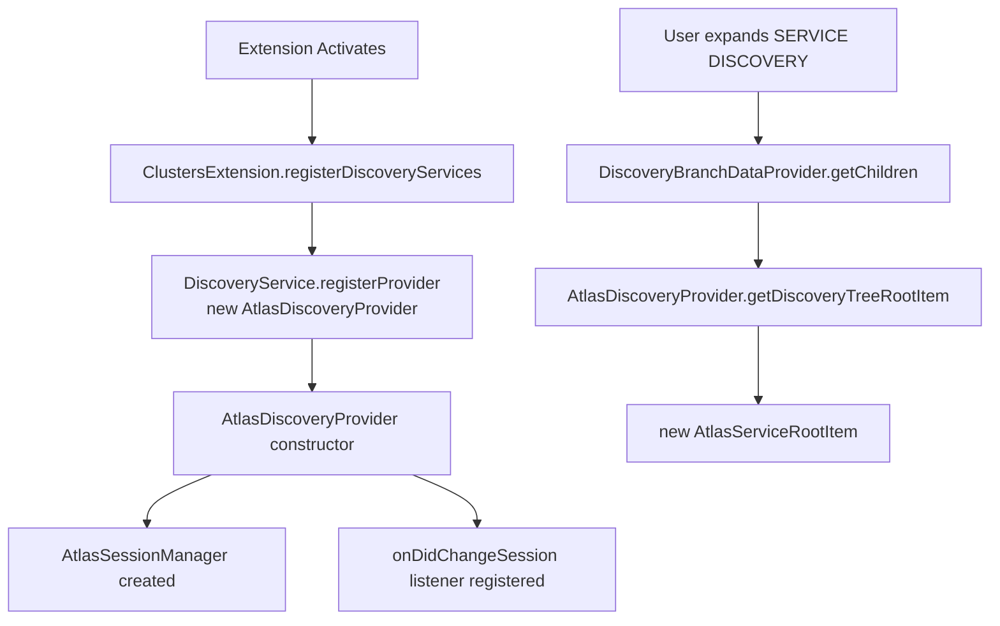

# Atlas MongoDB Discovery Provider — Click-by-Click Flow

This document traces the complete user interaction flow from the "Atlas MongoDB" node appearing in the Service Discovery tree through to clusters being displayed, mapping each user action to the exact method and file.

---

## Architecture Overview



---

## Phase 1: Extension Activation & Provider Registration

| Step | User Action | Method | File |
|------|-------------|--------|------|
| 1.1 | Extension activates | `ClustersExtension.registerDiscoveryServices()` | `src/documentdb/ClustersExtension.ts:129` |
| 1.2 | — | `DiscoveryService.registerProvider(new AtlasDiscoveryProvider())` | `src/documentdb/ClustersExtension.ts:133` |
| 1.3 | — | `AtlasDiscoveryProvider.constructor()` | `src/plugins/service-atlas-mongodb/AtlasDiscoveryProvider.ts:37` |
| 1.4 | — | Creates `AtlasSessionManager(secretStorage, globalState)` | `src/plugins/service-atlas-mongodb/auth/AtlasSessionManager.ts:37` |
| 1.5 | — | Registers `onDidChangeSession` listener → calls `resetNodeErrorState()` + `refresh()` | `src/plugins/service-atlas-mongodb/AtlasDiscoveryProvider.ts:46` |

---

## Phase 2: Root Node Appears in Tree

| Step | User Action | Method | File |
|------|-------------|--------|------|
| 2.1 | User expands "SERVICE DISCOVERY" panel | `DiscoveryBranchDataProvider.getChildren()` | `src/tree/discovery-view/DiscoveryBranchDataProvider.ts` |
| 2.2 | — | `AtlasDiscoveryProvider.getDiscoveryTreeRootItem(parentId)` | `src/plugins/service-atlas-mongodb/AtlasDiscoveryProvider.ts:55` |
| 2.3 | — | Returns `new AtlasServiceRootItem(sessionManager, parentId)` | `src/plugins/service-atlas-mongodb/discovery-tree/AtlasServiceRootItem.ts:35` |
| 2.4 | VS Code renders the root node | `AtlasServiceRootItem.getTreeItem()` | `src/plugins/service-atlas-mongodb/discovery-tree/AtlasServiceRootItem.ts:107` |

**Result:** Tree shows `☁ Atlas MongoDB` with collapsed chevron.

---

## Phase 3: User Expands "Atlas MongoDB" — No Session

| Step | User Action | Method | File |
|------|-------------|--------|------|
| 3.1 | User clicks expand arrow on "Atlas MongoDB" | `AtlasServiceRootItem.getChildren()` | `src/plugins/service-atlas-mongodb/discovery-tree/AtlasServiceRootItem.ts:41` |
| 3.2 | — | `sessionManager.getSession()` → returns `undefined` (no stored creds) | `src/plugins/service-atlas-mongodb/auth/AtlasSessionManager.ts:50` |
| 3.3 | — | Calls `this.promptAuthentication()` | `src/plugins/service-atlas-mongodb/discovery-tree/AtlasServiceRootItem.ts:120` |

**If user cancels the prompt** → returns `[this.createSignInNode()]` → tree shows "↪ Sign in to view Atlas clusters"

---

## Phase 4: Authentication Prompt

| Step | User Action | Method | File |
|------|-------------|--------|------|
| 4.1 | QuickPick appears | `promptAtlasAuthMethod()` | `src/plugins/service-atlas-mongodb/auth/AtlasAuthQuickPick.ts:14` |
| 4.2 | Shows two options: | | |
|      | • `$(globe) Sign in with browser (OAuth 2.0)` — recommended | | |
|      | • `$(key) Use API Key` — manual entry | | |
| 4.3 | User selects an option | Returns `'oauth'` or `'apikey'` | |

---

## Phase 5A: OAuth 2.0 Device Code Flow (if user chose OAuth)

| Step | User Action | Method | File |
|------|-------------|--------|------|
| 5A.1 | — | `executeOAuthDeviceFlow(sessionManager)` | `src/plugins/service-atlas-mongodb/auth/AtlasOAuthDeviceFlow.ts:20` |
| 5A.2 | — | `sessionManager.setAuthenticating()` → state = `Authenticating` | `src/plugins/service-atlas-mongodb/auth/AtlasSessionManager.ts:141` |
| 5A.3 | — | `requestDeviceAuthorization(cts.token)` | `src/plugins/service-atlas-mongodb/auth/AtlasOAuthClient.ts:41` |
| 5A.4 | — | POST `https://cloud.mongodb.com/api/private/unauth/account/device/authorize` | `src/plugins/service-atlas-mongodb/config.ts:32` |
|      | — | Body: `client_id=0oabtxactgS3gHIR0297&scope=openid+profile+offline_access` | |
| 5A.5 | — | Returns `{ device_code, user_code, verification_uri, expires_in, interval }` | |
| 5A.6 | Notification shown | `vscode.window.withProgress(...)` — shows user_code | `AtlasOAuthDeviceFlow.ts:30` |
| 5A.7 | Browser opens | `vscode.env.openExternal(verification_uri)` | `AtlasOAuthDeviceFlow.ts:47` |
| 5A.8 | Code copied to clipboard | `vscode.env.clipboard.writeText(user_code)` | `AtlasOAuthDeviceFlow.ts:50` |
| 5A.9 | User enters code in browser and approves | (external) | |
| 5A.10 | — | `pollForDeviceToken(device_code, interval, expires_in, cts.token)` | `src/plugins/service-atlas-mongodb/auth/AtlasOAuthClient.ts:76` |
| 5A.11 | — | POST `https://cloud.mongodb.com/api/private/unauth/account/device/token` | `src/plugins/service-atlas-mongodb/config.ts:33` |
|       | — | Body: `client_id=...&device_code=...&grant_type=urn:ietf:params:oauth:grant-type:device_code` | |
|       | — | Polls every `interval` seconds, handles `DEVICE_AUTHORIZATION_PENDING` | |
| 5A.12 | Token granted | Returns `{ access_token, refresh_token, expires_in, token_type }` | |
| 5A.13 | — | `sessionManager.storeOAuthTokens(access_token, refresh_token, expires_in)` | `src/plugins/service-atlas-mongodb/auth/AtlasSessionManager.ts:69` |
| 5A.14 | — | Stores in SecretStorage: access token, refresh token, expiry timestamp | |
| 5A.15 | — | `globalState.update(STATE_AUTH_METHOD, 'oauth')` | |
| 5A.16 | — | `transitionTo(AtlasSessionState.Active)` → fires `onDidChangeSession` | `AtlasSessionManager.ts:230` |

---

## Phase 5B: API Key Flow (if user chose API Key)

| Step | User Action | Method | File |
|------|-------------|--------|------|
| 5B.1 | — | `executeApiKeyFlow(sessionManager)` | `src/plugins/service-atlas-mongodb/auth/AtlasApiKeyFlow.ts:16` |
| 5B.2 | — | `sessionManager.setAuthenticating()` → state = `Authenticating` | |
| 5B.3 | InputBox appears | `vscode.window.showInputBox(...)` — "Enter your Atlas API public key" | `AtlasApiKeyFlow.ts:20` |
| 5B.4 | User enters public key | Validates non-empty | |
| 5B.5 | InputBox appears (masked) | `vscode.window.showInputBox(...)` — "Enter your Atlas API private key" | `AtlasApiKeyFlow.ts:38` |
| 5B.6 | User enters private key | Validates non-empty | |
| 5B.7 | — | `validateApiKeyCredentials(publicKey, privateKey)` | `AtlasApiKeyFlow.ts:83` |
| 5B.8 | — | Creates `AtlasApiClient({ type: 'apikey', publicKey, privateKey })` | |
| 5B.9 | — | Calls `client.listProjects()` → GET `/api/atlas/v2/groups` with Digest Auth | `src/plugins/service-atlas-mongodb/api/AtlasApiClient.ts:32` |
| 5B.10 | — | First request returns 401 + `WWW-Authenticate: Digest ...` challenge | `AtlasApiClient.ts:83` |
| 5B.11 | — | `parseDigestChallenge(wwwAuth)` → extracts realm, nonce, qop | `src/plugins/service-atlas-mongodb/api/AtlasDigestAuth.ts` |
| 5B.12 | — | `computeDigestHeader(method, uri, publicKey, privateKey, challenge, nc)` | `AtlasDigestAuth.ts` |
| 5B.13 | — | Retry request with `Authorization: Digest ...` header | |
| 5B.14 | Validation succeeds | Returns `true` | |
| 5B.15 | — | `sessionManager.storeApiKeyCredentials(publicKey, privateKey)` | `src/plugins/service-atlas-mongodb/auth/AtlasSessionManager.ts:86` |
| 5B.16 | — | Stores in SecretStorage: public key, private key | |
| 5B.17 | — | `globalState.update(STATE_AUTH_METHOD, 'apikey')` | |
| 5B.18 | — | `transitionTo(AtlasSessionState.Active)` → fires `onDidChangeSession` | |
| 5B.19 | Info message shown | "Successfully authenticated with MongoDB Atlas." | `AtlasApiKeyFlow.ts:75` |

---

## Phase 6: Session Change → Tree Refresh

| Step | Trigger | Method | File |
|------|---------|--------|------|
| 6.1 | `onDidChangeSession` fires with `Active` state | Listener in `AtlasDiscoveryProvider` constructor | `AtlasDiscoveryProvider.ts:46` |
| 6.2 | — | `resetNodeErrorState(rootId)` — clears cached sign-in error node | `BaseExtendedTreeDataProvider.ts:228` |
| 6.3 | — | `ext.discoveryBranchDataProvider.refresh()` — full tree refresh | `BaseExtendedTreeDataProvider.ts:307` |
| 6.4 | VS Code calls `getChildren()` again for the root item | | |

---

## Phase 7: Fetching & Displaying Projects

| Step | User Action | Method | File |
|------|-------------|--------|------|
| 7.1 | Tree re-expands root | `AtlasServiceRootItem.getChildren()` | `AtlasServiceRootItem.ts:41` |
| 7.2 | — | `sessionManager.getSession()` → returns cached session (Active) | `AtlasSessionManager.ts:50` |
| 7.3 | — | `new AtlasApiClient(session)` | `AtlasApiClient.ts:26` |
| 7.4 | — | `client.listProjects()` | `AtlasApiClient.ts:32` |
| 7.5 | — | GET `https://cloud.mongodb.com/api/atlas/v2/groups` | |
|     | — | Header: `Accept: application/vnd.atlas.2023-02-01+json` | |
|     | — | Auth: `Bearer <token>` (OAuth) or Digest (API Key) | |
| 7.6 | — | Response: `{ results: [{ id, name, orgId, clusterCount, created }] }` | |
| 7.7 | — | Sort projects alphabetically | `AtlasServiceRootItem.ts:78` |
| 7.8 | — | Returns `projects.map(p => new AtlasProjectItem(this.id, p, sessionManager))` | `AtlasServiceRootItem.ts:79` |
| 7.9 | VS Code renders each project | `AtlasProjectItem.getTreeItem()` | `AtlasProjectItem.ts:87` |

**Result:** Tree shows:
```
☁ Atlas MongoDB
  └─ 📁 Project 0       1 clusters
  └─ 📁 Project 1       3 clusters
```

---

## Phase 8: User Expands a Project → Clusters Load

| Step | User Action | Method | File |
|------|-------------|--------|------|
| 8.1 | User clicks expand arrow on a project | `AtlasProjectItem.getChildren()` | `AtlasProjectItem.ts:32` |
| 8.2 | — | `sessionManager.getSession()` → returns session | |
| 8.3 | — | `new AtlasApiClient(session)` | |
| 8.4 | — | `client.listClusters(project.id)` | `AtlasApiClient.ts:39` |
| 8.5 | — | GET `https://cloud.mongodb.com/api/atlas/v2/groups/{projectId}/clusters` | |
| 8.6 | — | Response: `{ results: [{ id, name, stateName, clusterType, ... }] }` | |
| 8.7 | — | Sort clusters alphabetically | `AtlasProjectItem.ts:61` |
| 8.8 | — | Returns `clusters.map(c => new AtlasClusterItem(this.id, project, c))` | `AtlasProjectItem.ts:62` |
| 8.9 | VS Code renders each cluster | `AtlasClusterItem.getTreeItem()` | `AtlasClusterItem.ts:37` |
| 8.10 | — | `resolveProviderSettings()` — extracts tier/provider/region | `AtlasClusterItem.ts:64` |
|      | — | Checks `cluster.providerSettings` (legacy) first | |
|      | — | Falls back to `cluster.replicationSpecs[0].regionConfigs[0]` (API v2) | |
| 8.11 | — | `buildDescription()` → e.g., "M10, AWS, us-east-1" | `AtlasClusterItem.ts:83` |
| 8.12 | — | `getStateIcon()` → green circle (IDLE), spinner (CREATING), etc. | `AtlasClusterItem.ts:125` |

**Result:** Tree shows:
```
☁ Atlas MongoDB
  └─ 📁 Project 0       1 clusters
       └─ ● MyCluster   M10, AWS, us-east-1
```

---

## Phase 9: Cluster Context Menu — "Add to Connections"

| Step | User Action | Method | File |
|------|-------------|--------|------|
| 9.1 | Cluster node has `contextValue: 'treeItem_atlasCluster;enableAddToConnectionsCommand'` | | `AtlasClusterItem.ts:22` |
| 9.2 | User right-clicks cluster → "Add to Connections" | (VS Code command contribution in `package.json`) | |
| 9.3 | — | Uses `cluster.connectionString` (SRV preferred) | `AtlasClusterItem.ts:25` |
|     | — | Set from `cluster.connectionStrings.standardSrv ?? cluster.connectionStrings.standard` | `AtlasClusterItem.ts:33` |

---

## Sign-In via "Sign in to view Atlas clusters" Node

When the tree shows the sign-in placeholder instead of projects:

| Step | User Action | Method | File |
|------|-------------|--------|------|
| S.1 | User clicks "↪ Sign in to view Atlas clusters" | Command: `discoveryView.manageCredentials` with `args: [rootItem]` | `AtlasServiceRootItem.ts:137` |
| S.2 | — | `manageCredentials(context, node)` | `src/commands/discoveryService.manageCredentials/manageCredentials.ts:13` |
| S.3 | — | Extracts `providerId` from `node.id` | `manageCredentials.ts:28` |
| S.4 | — | `DiscoveryService.getProvider(providerId)` | |
| S.5 | — | `provider.configureCredentials(context, node)` | `AtlasDiscoveryProvider.ts:72` |
| S.6 | — | (State is `None`) → skips sign-out check → proceeds to `promptAtlasAuthMethod()` | |
| S.7 | — | ... flows into Phase 4 → Phase 5A/5B → Phase 6 | |
| S.8 | After success | `resetNodeErrorState(node.id)` — clears cached sign-in node | `AtlasDiscoveryProvider.ts:119` |
| S.9 | — | `refresh(node)` — tells VS Code to re-call `getChildren()` | `AtlasDiscoveryProvider.ts:123` |

---

## Sign-Out / Manage Credentials

| Step | User Action | Method | File |
|------|-------------|--------|------|
| M.1 | User right-clicks "Atlas MongoDB" → "Manage Credentials" | `manageCredentials(context, node)` | `manageCredentials.ts:13` |
| M.2 | — | `provider.configureCredentials(context, node)` | `AtlasDiscoveryProvider.ts:72` |
| M.3 | (State is `Active`) | Shows QuickPick: "Sign Out" / "Switch Account" | `AtlasDiscoveryProvider.ts:78` |
| M.4a | If "Sign Out" | `sessionManager.signOut()` | `AtlasSessionManager.ts:101` |
|      | — | Deletes all tokens from SecretStorage | |
|      | — | `globalState.update(STATE_AUTH_METHOD, undefined)` | |
|      | — | `transitionTo(None)` → fires `onDidChangeSession` → tree refreshes | |
| M.4b | If "Switch Account" | Falls through to `promptAtlasAuthMethod()` → Phase 4 again | |

---

## File Map

| File | Purpose |
|------|---------|
| `src/plugins/service-atlas-mongodb/config.ts` | Constants: provider ID, API URLs, OAuth endpoints, storage keys |
| `src/plugins/service-atlas-mongodb/AtlasDiscoveryProvider.ts` | Main provider class, implements `DiscoveryProvider` interface |
| `src/plugins/service-atlas-mongodb/auth/AtlasSession.ts` | Type definitions: session union, state enum, auth method type |
| `src/plugins/service-atlas-mongodb/auth/AtlasSessionManager.ts` | Session state machine, token storage/restore/refresh, SecretStorage |
| `src/plugins/service-atlas-mongodb/auth/AtlasAuthQuickPick.ts` | QuickPick: OAuth vs API Key selection |
| `src/plugins/service-atlas-mongodb/auth/AtlasOAuthClient.ts` | HTTP calls: `requestDeviceAuthorization()`, `pollForDeviceToken()`, `refreshOAuthToken()` |
| `src/plugins/service-atlas-mongodb/auth/AtlasOAuthDeviceFlow.ts` | Orchestrates device flow: request code → notification → poll → store |
| `src/plugins/service-atlas-mongodb/auth/AtlasApiKeyFlow.ts` | Prompts public/private key InputBoxes, validates, stores |
| `src/plugins/service-atlas-mongodb/api/AtlasApiClient.ts` | Atlas Admin API v2 client: `listProjects()`, `listClusters()`, Digest + Bearer auth |
| `src/plugins/service-atlas-mongodb/api/AtlasDigestAuth.ts` | HTTP Digest Authentication: challenge parsing + header computation |
| `src/plugins/service-atlas-mongodb/discovery-tree/AtlasServiceRootItem.ts` | Root "Atlas MongoDB" tree node, auth gating, project fetching |
| `src/plugins/service-atlas-mongodb/discovery-tree/AtlasProjectItem.ts` | Project folder node, fetches clusters on expand |
| `src/plugins/service-atlas-mongodb/discovery-tree/AtlasClusterItem.ts` | Cluster leaf node: state icon, description, tooltip, connection string |
| `src/plugins/service-atlas-mongodb/models/AtlasProjectModel.ts` | Interfaces: `AtlasProject`, `AtlasCluster`, `AtlasProviderSettings`, etc. |
| `src/plugins/service-atlas-mongodb/models/AtlasClusterModel.ts` | `AtlasClusterModel` extending `BaseClusterModel`, factory function |

---

## Key Design Decisions

1. **OAuth Client ID**: Uses Atlas CLI's public client `0oabtxactgS3gHIR0297` — no app registration needed
2. **Device Code Flow**: Required because Atlas doesn't support `vscode://` redirect URIs for unregistered apps
3. **Dual Auth**: Supports both OAuth (browser-based, recommended) and API Keys (programmatic, for automation)
4. **Error Caching**: `failedChildrenCache` prevents repeated network calls for failed nodes; must be cleared via `resetNodeErrorState()` after successful auth
5. **API v2 Compatibility**: Provider info resolved from either `providerSettings` (legacy) or `replicationSpecs[].regionConfigs[]` (API v2)
6. **Digest Auth**: API Key auth uses HTTP Digest (RFC 7616) — two-request pattern (challenge → authenticated request)
