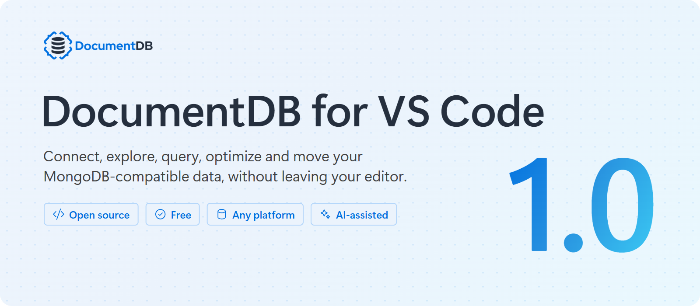
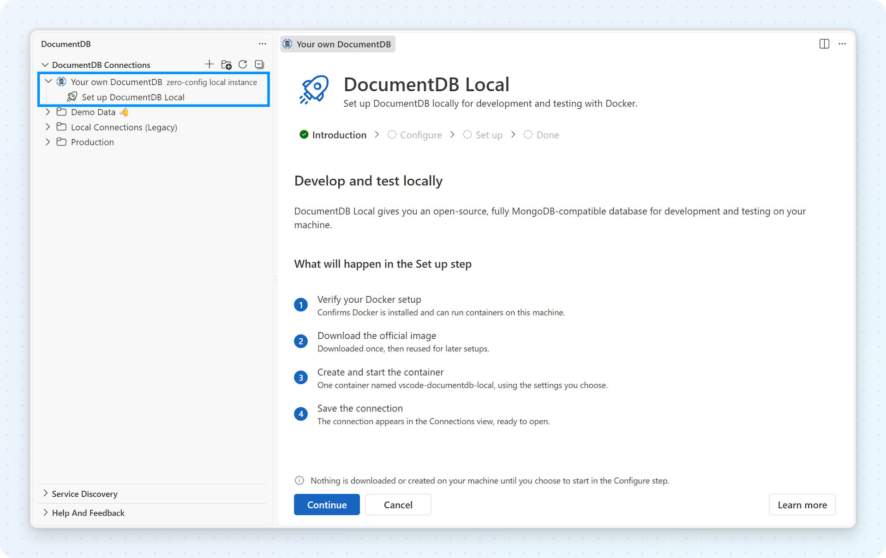
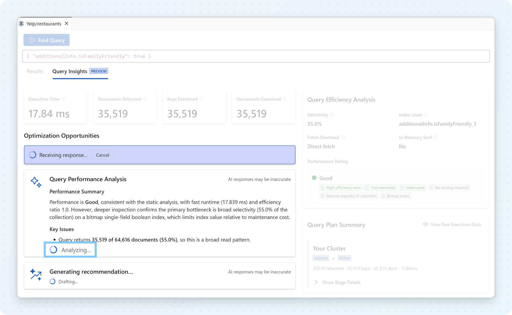
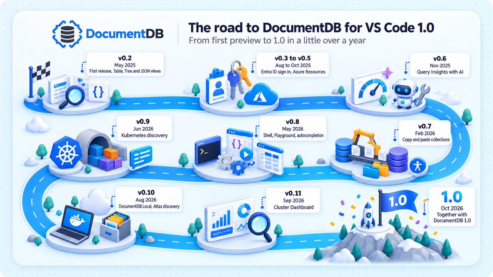

# DocumentDB for VS Code 1.0: Run It Locally, Bring Your Data

_Released alongside DocumentDB 1.0_

_🔴 **[Input needed: publish date]**, by Tomasz Naumowicz and the DocumentDB for VS Code team_

DocumentDB for VS Code 1.0 is here. Released alongside [DocumentDB 1.0](https://documentdb.io/) 🔴 **[Input needed: link to the DocumentDB 1.0 announcement]**, the free, open-source extension is a **MongoDB GUI** and **DocumentDB GUI**, built right into Visual Studio Code. It works with DocumentDB, Azure DocumentDB and other MongoDB-compatible databases, wherever they run.

The milestone reflects what we built across all the releases on the way to 1.0, over a little more than a year. Version 1.0 focuses on fixes and polish, and celebrates how far that experience has come. Here is the shortest path from reading about DocumentDB 1.0 to working with it: run it locally, bring your own data, and understand what you have.

## Get started with DocumentDB 1.0 in minutes

The quickest way to try DocumentDB 1.0 is **DocumentDB Local**, right from VS Code. If Docker is installed, open the Connections view, expand **Your own DocumentDB**, and select **Set up DocumentDB Local**. Keep the defaults and start it.

The extension does the rest: it pulls the official DocumentDB image, creates a persistent volume so your data survives restarts, generates credentials, picks a free port, loads sample data, and saves a ready-to-use connection. No `docker run` command to assemble. From then on, you start, stop or restart the container from the same place, and if Docker isn't ready, the setup tells you exactly what's wrong and how to fix it.

## Bring your data with you

Sample data is a good start, but your own data tells you more. With **copy and paste**, you move a collection between any two connections the same way you copy files: right-click a collection and choose **Copy Collection…**, then right-click a database on the same cluster or any other and choose **Paste Collection…**.

That means a collection from MongoDB Atlas, Azure or a shared development cluster can land in your DocumentDB Local instance in a few clicks. If the target already has documents, you decide what happens with duplicates: stop, skip, overwrite, or give the pasted documents new IDs. The collection's indexes can come along too.

Copy and paste is built for development and small to medium datasets. For large production migrations, use a dedicated migration service.

## See what you have

Whether the data came from a sample, a copy or a production cluster, the first question is usually "what's in here?" The **Cluster Dashboard** answers it on one page: whether you're connected, the round-trip time, and an inventory of every database and collection with its storage size, index size and document count. Sort and filter the list, drill into a database, or create and delete databases and collections right there.

## Understand how it runs

Queries don't always come from you anymore. Whether you wrote one yourself or an AI agent suggested it, you still want to know how it runs. **Query Insights** explains it in three steps: the query plan, then execution statistics with a simple Good, Fair or Poor rating, and then optional AI recommendations from GitHub Copilot that explain what's happening and suggest changes you can apply directly.

**Index management** sits right next to it, so understanding a query and fixing it happen in the same place. See which indexes are used and which are not, and hide an index first to check the impact before you delete it.

## And there is more

- **Find your clusters, wherever they run.** Service Discovery lists your databases on Azure, in Kubernetes (including clusters managed by the DocumentDB Kubernetes Operator) and in MongoDB Atlas, so you pick a cluster instead of copying connection strings.
- **Sign in once.** Use a username and password, or Microsoft Entra ID with your VS Code account or the managed identity of an Azure virtual machine. Every view uses the same connection.
- **Look at the data your way.** Browse documents in Table, Tree or JSON view, ask the next question in the Interactive Shell, or save queries in a Query Playground file. One click moves the same query between them, and everything is bundled with the extension.

## A shared milestone, built in the open

DocumentDB 1.0 is a milestone for the open-source database. DocumentDB for VS Code 1.0 celebrates the developer experience around it, one that also works with the MongoDB-compatible databases you already run.

We didn't get here alone. Eleven community developers contributed nearly 30 pull requests along the way, and many more of you shaped the extension with issue reports, accessibility reviews and bug bash findings. Thank you for helping us reach 1.0.

> **Run it locally. Bring your data. Understand what you have.** That's the experience we have been building, release by release.

## Try it

- [DocumentDB for VS Code 1.0 release notes](https://github.com/microsoft/vscode-documentdb/blob/main/docs/release-notes/1.0.md) (the full tour, with every feature explained)
- [DocumentDB 1.0 announcement](https://documentdb.io/) 🔴 **[Input needed: final link]**
- [Documentation](https://microsoft.github.io/vscode-documentdb/)
- [GitHub repository](https://github.com/microsoft/vscode-documentdb)
