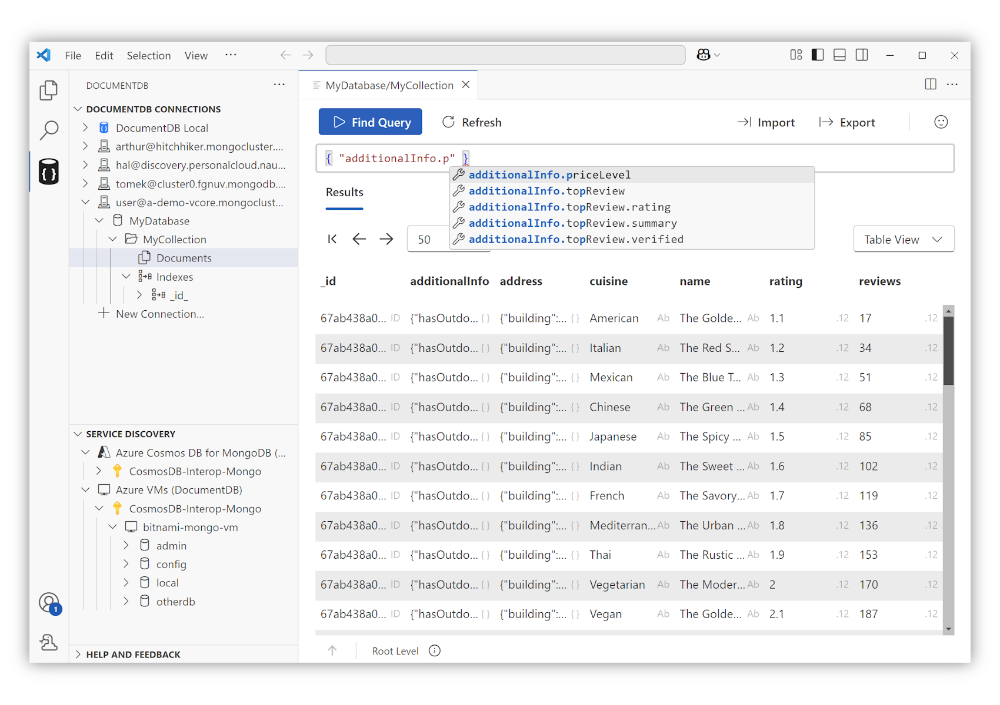

# DocumentDB for VS Code

[Install from Visual Studio Marketplace](https://marketplace.visualstudio.com/items?itemName=ms-azuretools.vscode-documentdb)

[Join the Discussion Board](https://github.com/microsoft/vscode-documentdb/discussions)

[Report Issues](https://github.com/microsoft/vscode-documentdb/issues)

---

**A powerful, open-source DocumentDB and MongoDB GUI for everyone.**

**DocumentDB for VS Code** helps you browse, manage, and query **DocumentDB** and **MongoDB** databases across any cloud, hybrid, or local environment.

# Features

### Universal DocumentDB and MongoDB Support

Connect to any MongoDB or DocumentDB instance: cloud, hybrid cloud, on-premises, or a local machine.

- **Flexible Connections:** Use a connection string or browse your cloud providers.
- **Cross-Platform Service Discovery:** Connect to DocumentDB and MongoDB instances hosted with your provider.
- **Wide Compatibility:** Full support for all DocumentDB and MongoDB databases.

### Developer-Centric Experience

DocumentDB for VS Code focuses on providing developer productivity features with minimal setup.

- **Multiple Data Views**: Inspect collections using **Table**, **Tree**, or **JSON** layouts, with built-in pagination.
- **Query Editing**: Execute `find` queries with syntax highlighting, auto-completion, and field name suggestions.
- **Document Management**: Create, edit, and delete documents directly from VS Code.
- **Data Import/Export**: Quickly import JSON files or export documents, query results, or collections.

### Open Development

We believe in building in the open. All development, roadmap planning, and feature discussions happen publicly on GitHub.
Your feedback, contributions, and ideas shape the future of the extension.

# Table of Contents

## User Manual

The User Manual provides guidance on using DocumentDB for VS Code. It contains detailed documentation for specific features and concepts. These documents provide additional context and examples for features you encounter while using the extension:

### Connecting to Databases

- [Connecting with a URL](./user-manual/how-to-construct-url)
- [Service Discovery](./user-manual/service-discovery)
  - [Azure DocumentDB](./user-manual/service-discovery-azure-cosmosdb-for-mongodb-vcore)
  - [Azure Cosmos DB for MongoDB (RU)](./user-manual/service-discovery-azure-cosmosdb-for-mongodb-ru)
  - [Azure VMs (DocumentDB)](./user-manual/service-discovery-azure-vms)
  - [Managing Azure Subscriptions](./user-manual/managing-azure-discovery)
- [Connecting to Local Instances](./user-manual/local-connection)
  - [Azure Cosmos DB for MongoDB (RU) Emulator](./user-manual/local-connection-mongodb-ru)
  - [DocumentDB Local](./user-manual/local-connection-documentdb-local)

### Data Management

- [Data Migrations (Experimental)](./user-manual/data-migrations)

## Release Notes

Explore the history of updates and improvements to the DocumentDB for VS Code extension. Each release brings new features, enhancements, and fixes to improve your experience.

- [0.5](./release-notes/0.5) | [0.5.1](./release-notes/0.5#patch-release-v051) | [0.5.2](./release-notes/0.5#patch-release-v052)
- [0.4](./release-notes/0.4) | [0.4.1](./release-notes/0.4#patch-release-v041)
- [0.3](./release-notes/0.3) | [0.3.1](./release-notes/0.3#patch-release-v031)
- [0.2.4](./release-notes/0.2.4)
- [0.2.3](./release-notes/0.2.3)
- [0.2.2](./release-notes/0.2.2)
- [0.2.1](./release-notes/0.2.1)
