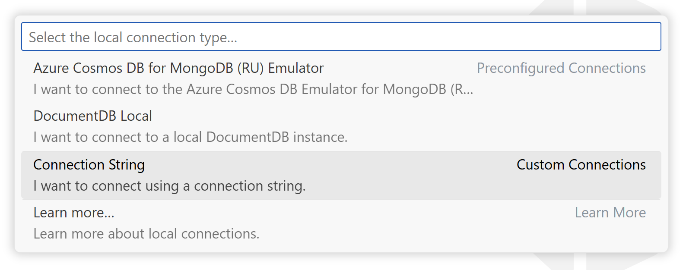

<!-- Learn More Section Badge or Breadcrumb -->

> **Learn More** &mdash; [Back to Learn More Index](./index)

---

# Local Connection

**DocumentDB for VS Code** allows you to connect to local DocumentDB and MongoDB instances. This can be useful for development, testing, or working with emulators on your own machine.

## How to Connect Locally

You have two main options for connecting to a local instance:

- **Use Preconfigured Options:**
  The extension provides ready-to-use configurations for popular local setups:

  - **[Azure CosmosDB for MongoDB (RU) Emulator](./local-connection-mongodb-ru)**
  - **[DocumentDB Local](./local-connection-documentdb-local)**

- **Use a Raw Connection String:**
  If your local deployment type is not listed, you can always provide a custom connection string.

## Advantages of Using the `DocumentDB Local` Area

- **Guided Experience:**
  The extension walks you through the connection process, making it easier to get started.

- **TLS/SSL Configuration Overrides:**
  You can override security settings to allow unsecured connections. This is helpful if your local instance does not have SSL/TLS enabled.

## TLS/SSL Security for Local Connections

### Why TLS/SSL Matters

TLS/SSL provides encryption for data in transit, protecting your information from being intercepted or tampered with. In production environments, enabling TLS/SSL is a standard security practice.

### Local Development Considerations

We understand that setting up TLS/SSL for local deployments can sometimes be inconvenient or unnecessary, especially when you're just experimenting or developing on your own machine. For this reason, the extension allows you to disable the security requirement for local connections. When this option is selected, DocumentDB for VS Code will not verify SSL/TLS certificates.

### A Note on Security Best Practices

While it's possible to skip SSL/TLS verification for local development, it's worth considering investing a bit of time into configuring security even on your local setup. Doing so can help you catch application errors related to security earlier in the development process and make it easier to transition your application to production later on. It's not about being perfect, it's just about making things smoother for yourself down the road.
