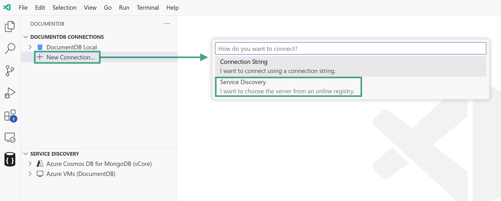
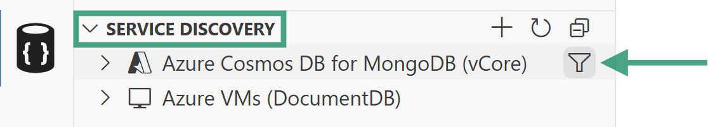

<!-- Learn More Section Badge or Breadcrumb -->

> **Learn More** &mdash; [Back to Learn More Index](./index)

---

# Azure CosmosDB for MongoDB (vCore) Service Discovery Plugin

The **Azure CosmosDB for MongoDB (vCore)** plugin is available as part of the [Service Discovery](./service-discovery) feature in DocumentDB for VS Code. This plugin helps you connect to your Azure CosmosDB for MongoDB (vCore) clusters by handling authentication, resource discovery, and connection management within the extension.

## How to Access

You can access this plugin in two ways:

- Through the `Service Discovery` panel in the extension sidebar.
- When adding a new connection, select the `Azure CosmosDB for MongoDB (vCore)` option.

## How It Works

When you use the Azure CosmosDB for MongoDB (vCore) plugin, the following steps are performed:

1. **Authentication:**
   The plugin authenticates you with Azure using your credentials.

2. **Subscription Discovery:**
   All available Azure subscriptions are listed.

   > **Tip:** You can `filter` which subscriptions are shown in the `Service Discovery` panel. Click the funnel icon next to the service discovery provider name, wait for the list to populate, and select the subscriptions you want to include.
   >
   > 

3. **Cluster Discovery:**
   The plugin enumerates all Azure CosmosDB for MongoDB (vCore) clusters available in your selected subscriptions.

4. **Connection Options:**
   - You can connect to a cluster by expanding its entry in the tree view.
   - You can save a cluster to your `DocumentDB Connections` list using the context menu or by clicking the save icon next to its name.
   - When connecting or saving, the extension detects the authentication methods supported by the cluster (e.g., **Username/Password** or **Entra ID**). If multiple are available, you will be prompted to choose your preferred method.

## Additional Notes

- Subscription filtering helps you focus on relevant resources, especially if you have access to many Azure subscriptions.
- All authentication and discovery steps are handled within the extension, so you do not need to manually gather connection strings or resource details.

## Feedback and Contributions

If you have suggestions for improving this plugin or would like to see support for additional Azure resource types, please [join the discussion board](https://github.com/microsoft/vscode-documentdb/discussions) and share your feedback.

---
