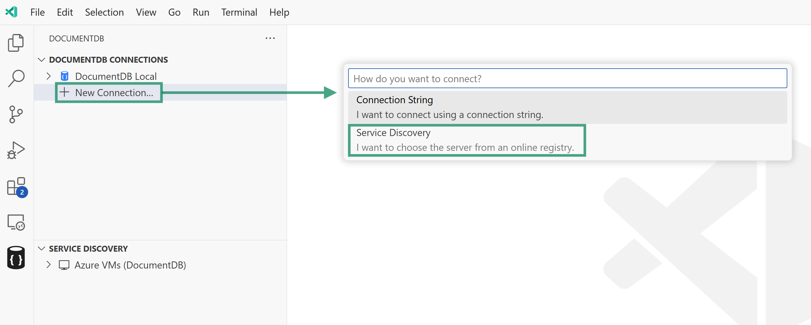
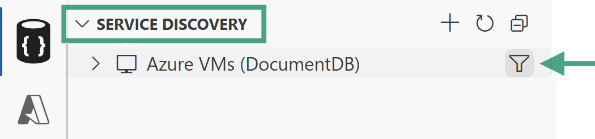

<!-- Learn More Section Badge or Breadcrumb -->

> **Learn More** &mdash; [Back to Learn More Index](./index)

---

# Azure VMs (DocumentDB) Service Discovery Plugin

The **Azure VMs (DocumentDB)** plugin is available as part of the [Service Discovery](./service-discovery) feature in DocumentDB for VS Code. This plugin helps you locate and connect to your virtual machines hosted in Azure that are running self-hosted DocumentDB or MongoDB instances.

## How to Access

You can access this plugin in two ways:

- Through the `Service Discovery` panel in the extension sidebar.
- When adding a new connection, select the `Azure VMs (DocumentDB)` option.

## How It Works

When you use the Azure VMs (DocumentDB) plugin, the following steps are performed:

1. **Authentication:**
   The plugin authenticates you with Azure using your credentials.

2. **Subscription Discovery:**
   All available Azure subscriptions are listed.

   > **Tip:** You can `filter` which subscriptions are shown in the `Service Discovery` panel. Click the funnel icon next to the service discovery provider name, wait for the list to populate, and select the subscriptions you want to include.
   >
   > 

3. **VM Filtering by Tag:**
   The plugin searches for virtual machines within your selected subscriptions that have a specific tag assigned. By default, the tag is set to `DocumentDB`, but you can change this in the filter function as needed.

   > **Tip:** When using Service Discovery from within the `DocumentDB Connections` area, you'll always be asked to confirm the `tag` used. The `Service Discovery` area works with the default `DocumentDB` tag. Changing it is possible using the `filter` feature.

4. **Connection Options:**
   - You can connect to a VM by expanding its entry in the tree view.
   - You can save a VM to your `DocumentDB Connections` list using the context menu or by clicking the save icon next to its name.

## Additional Notes

- Tag-based filtering helps you focus on relevant virtual machines, especially if you have many resources in your Azure environment.
- All authentication and discovery steps are handled within the extension, so you do not need to manually gather connection strings or VM details.
- You can change the tag used for filtering in the filter function if your environment uses a different tagging convention.

## Feedback and Contributions

If you have suggestions for improving this plugin or would like to see support for additional VM filtering options, please [join the discussion board](https://github.com/microsoft/vscode-documentdb/discussions) and share your feedback.

---
