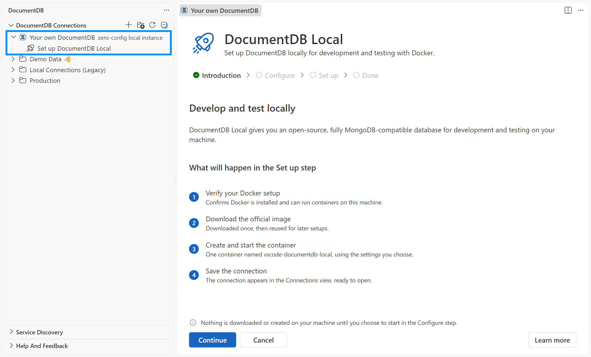
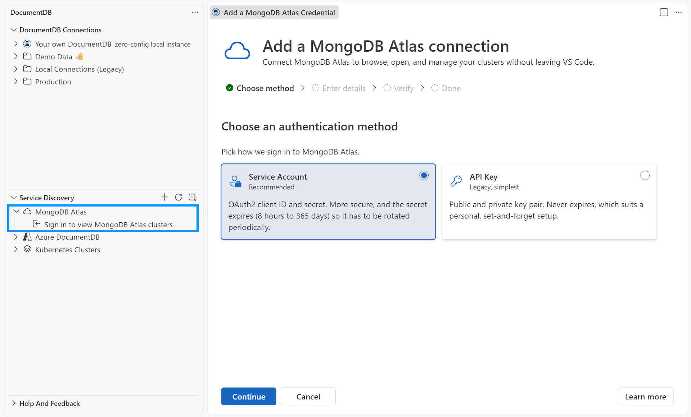

> **Release Notes** - [Back to Release Notes](../index.md#release-notes)

---

# DocumentDB for VS Code Extension v0.10

We are excited to announce the release of **DocumentDB for VS Code Extension v0.10**.

This is the largest release of the extension so far, and it lands three major features at once. **DocumentDB Local** gets you from a Docker-ready machine to an open local database in a few clicks, without writing a single `docker run` command. **MongoDB Atlas Service Discovery** brings your Atlas organizations, projects, and clusters into the Discovery view, so you can connect without hunting for endpoints in the Atlas console. And **Index Management** adds a full Indexes tab to Collection View, so you can review, create, hide, and delete indexes right next to the queries they serve.

## What's New in v0.10

### ⭐ DocumentDB Local

Getting a local database running should not be a research project. **DocumentDB Local** setup does the whole thing for you: it pulls the official [DocumentDB](https://documentdb.io/) image, creates a persistent Docker volume, waits until the database actually accepts connections, and saves a ready-to-use connection in the Connections view.

Open the **Connections** view, expand **Your own DocumentDB**, and select **Set up DocumentDB Local**. On the happy path you keep the defaults, select **Start DocumentDB Local**, and then select **Open Connection**. Credentials are generated for you, sample data is included, and an available host port is picked automatically.

#### Honest Docker diagnostics

Local databases fail for boring environment reasons, and those reasons are usually invisible. The setup view separates Docker CLI, daemon, and daemon-platform facts, and it tells you exactly what to do next for your environment: native Linux socket permissions, WSL integration with Docker Desktop, a stopped Docker Engine service, an unreachable `DOCKER_HOST` or Docker context, or a daemon running Windows containers.

The extension is deliberately conservative about what it does on your behalf. It never installs Docker, never runs `sudo`, never changes group membership, and never switches your Docker context. Where a fix requires a command, that command is presented as copy-only text with an explanation of why a plain window reload is not enough.

Remote development is treated honestly too. In WSL, SSH, dev containers, or Codespaces, the container runs in the extension-host environment, and the setup view says so rather than pretending `localhost` means your laptop.

#### Lifecycle you can trust

The managed instance appears in the Connections view with start, stop, restart, and delete actions, plus a tooltip carrying container and Docker host details. State is reconciled with Docker on demand, so stopping the container outside VS Code no longer leaves the extension believing it is still running. Expanding the cluster preflights the container first, and a stopped instance offers to start rather than failing with a cryptic driver timeout.

Destructive actions are gated. Every container and volume removal is guarded by a label precondition, so the extension can never remove a container it did not create. If saved credentials go missing, the instance surfaces a **Needs attention** row that walks you through recovery instead of dead-ending or offering an immediate delete.

For the complete guide, see [Set up DocumentDB Local](https://microsoft.github.io/vscode-documentdb/user-manual/local-quick-start) and [DocumentDB Local](https://microsoft.github.io/vscode-documentdb/user-manual/local-connection-documentdb-local).

[#798](https://github.com/microsoft/vscode-documentdb/pull/798)

Pre-release refinements: [#841](https://github.com/microsoft/vscode-documentdb/pull/841), [#849](https://github.com/microsoft/vscode-documentdb/pull/849), [#851](https://github.com/microsoft/vscode-documentdb/issues/851), [#852](https://github.com/microsoft/vscode-documentdb/issues/852), [#855](https://github.com/microsoft/vscode-documentdb/issues/855), [#856](https://github.com/microsoft/vscode-documentdb/issues/856), [#857](https://github.com/microsoft/vscode-documentdb/issues/857), [#858](https://github.com/microsoft/vscode-documentdb/issues/858), [#865](https://github.com/microsoft/vscode-documentdb/issues/865), [#866](https://github.com/microsoft/vscode-documentdb/pull/866), [#873](https://github.com/microsoft/vscode-documentdb/issues/873), [#876](https://github.com/microsoft/vscode-documentdb/pull/876), [#879](https://github.com/microsoft/vscode-documentdb/pull/879), [#883](https://github.com/microsoft/vscode-documentdb/pull/883)

---

### ⭐ MongoDB Atlas Service Discovery

**MongoDB Atlas** joins Azure and Kubernetes as a first-class Service Discovery provider. Browse your Atlas organizations, projects, and clusters directly in the extension, then save any cluster as a regular DocumentDB connection without copying endpoints by hand.

You can start from the **Service Discovery** view, or from **New Connection** > **Service Discovery** > **MongoDB Atlas**.

#### Two supported credential types, kept separate from database access

Discovery authenticates against the Atlas Admin API using either an **API Key** (Public Key and Private Key) or a **Service Account** (Client ID and Client Secret). The credential is verified with Atlas before it is saved, and secrets are stored in VS Code Secret Storage.

Crucially, this credential is only used to find things. It is never treated as a database login. You still enter an Atlas database username and password when you connect to a cluster, and the extension never retrieves database passwords.

#### One credential per organization, many organizations at once

An Atlas API Key or Service Account belongs to a single organization, so the extension supports several credentials side by side. Resources from all configured credentials are combined into one view, and a resource visible through more than one credential appears only once.

A dedicated **Manage MongoDB Atlas Credentials** view lets you add a credential, retry one that is failing, update a rotated secret without losing the credential's identity, open it in Atlas to review roles and IP access lists, or sign out of one or all of them.

#### Tree view, list view, and honest cluster status

The default tree shows organizations, then projects, then clusters. A view toggle switches to a flat list where each cluster carries its `organization · project` context, and your choice is remembered between sessions.

Atlas often shows clusters that are not ready for a database connection, and the extension no longer lets you walk into a doomed connection attempt. Paused, Creating, Updating, Repairing, and Deleting clusters are all labeled. This matters most for paused clusters: Atlas reports them with `stateName: "IDLE"`, which used to make a paused cluster look perfectly healthy until every connection timed out. Paused clusters now render as a leaf with a **Paused** annotation, a tooltip that explains the apparent contradiction, and a connection wizard that lists them as unavailable instead of failing.

A new **Open in MongoDB Atlas** action on any discovered cluster deep-links to its overview page, so when the extension tells you to resume a cluster it can also take you to where you do that.

For the complete guide, see [MongoDB Atlas Service Discovery](https://microsoft.github.io/vscode-documentdb/user-manual/service-discovery-mongodb-atlas), [Browse and Connect to MongoDB Atlas](https://microsoft.github.io/vscode-documentdb/user-manual/service-discovery-mongodb-atlas-browse), [Manage MongoDB Atlas Credentials](https://microsoft.github.io/vscode-documentdb/user-manual/service-discovery-mongodb-atlas-credentials), and [Troubleshoot MongoDB Atlas Service Discovery](https://microsoft.github.io/vscode-documentdb/user-manual/service-discovery-mongodb-atlas-troubleshooting).

[#259](https://github.com/microsoft/vscode-documentdb/issues/259), [#261](https://github.com/microsoft/vscode-documentdb/issues/261), [#765](https://github.com/microsoft/vscode-documentdb/pull/765)

Pre-release refinements: [#799](https://github.com/microsoft/vscode-documentdb/pull/799), [#813](https://github.com/microsoft/vscode-documentdb/pull/813), [#834](https://github.com/microsoft/vscode-documentdb/pull/834), [#842](https://github.com/microsoft/vscode-documentdb/pull/842), [#850](https://github.com/microsoft/vscode-documentdb/pull/850), [#883](https://github.com/microsoft/vscode-documentdb/pull/883)

---

### ⭐ Index Management in Collection View

Indexes are where query performance is won or lost, and until now you had to leave the extension to work with them. Collection View gains an **Indexes** tab, sitting between **Results** and **Query Insights**, so index work happens next to the queries it affects. You can also double-click the collection's **Indexes** node in the Explorer to open Collection View directly on that tab.

#### Inspect what you have

A metrics row summarizes index count, total size, and total usage for the collection. Below it, a table lists every index with its name, type, properties, server-reported size, and server-reported usage. Sort by any column, filter by name or field, use the **Hidden** and **Unused** quick toggles to find candidates for cleanup, and expand a row to inspect the index fields, the full property set, and the raw server-reported definition.

Index state is visible while it changes: **Ready**, **Creating**, and **Building** are distinguished, and the tab refreshes itself while a build is in progress.

#### Create indexes with a guided drawer

The **Create Index** drawer covers **Standard**, **Wildcard**, and **Vector** indexes.

- **Standard** indexes support compound fields with per-field direction and type, plus options such as unique, sparse, TTL with inline validation, partial filter expressions, collation, and a custom name. Less common settings live under **Advanced**.
- **Wildcard** indexes support all three scopes: **All fields** (`$**`), **Parent path** (for example `metadata.$**`), and **Projection** to include or exclude selected paths. The form validates incompatible selections for the chosen scope.
- **Vector** indexes support **DiskANN**, **HNSW**, and **IVF**, each with a short description of what it is good at. Set the vector field and dimensions, pick a similarity metric (cosine, L2, or inner product), and tune the algorithm and compression settings under **Advanced**.

**Preview as JSON** shows the generated definition before you commit to it. And if you would rather run the command yourself, the drawer can hand the generated command off to a **Query Playground** or the **Interactive Shell** instead of creating the index directly, which is useful when you want to tweak it first or keep working with the collection afterwards.

#### Manage existing indexes safely

Each row offers **Hide**, **Unhide**, and **Delete**, with a confirmation that spells out what will happen. Hiding is the low-risk way to test whether your queries actually need an index before you remove it. The default `_id_` index is protected and cannot be hidden or deleted. The same actions and the same confirmations are available from the Explorer context menu on an individual index.

For the complete guide, see [Manage Indexes in Collection View](https://microsoft.github.io/vscode-documentdb/user-manual/collection-view-index-management), [Wildcard Indexes in Collection View](https://microsoft.github.io/vscode-documentdb/user-manual/collection-view-wildcard-indexes), [Vector Indexes in Collection View](https://microsoft.github.io/vscode-documentdb/user-manual/collection-view-vector-indexes), and [Troubleshoot Index Management](https://microsoft.github.io/vscode-documentdb/user-manual/collection-view-index-management-troubleshooting).

[#732](https://github.com/microsoft/vscode-documentdb/pull/732)

Pre-release refinements: [#836](https://github.com/microsoft/vscode-documentdb/pull/836), [#837](https://github.com/microsoft/vscode-documentdb/pull/837)

## Key Fixes and Improvements

- **Failures Are Explained by the Component That Caused Them**
  - A connection can fail for reasons that have nothing to do with the database, and until now those reasons arrived as raw driver errors. Failures caused by a stopped DocumentDB Local container, a broken Kubernetes port forward, or an Atlas TLS rejection are now explained in the words of the component that owns that infrastructure, across the tree views, Collection View, Document View, the shell, and the query playground. [#873](https://github.com/microsoft/vscode-documentdb/issues/873), [#876](https://github.com/microsoft/vscode-documentdb/pull/876)

- **The Shell Terminal No Longer Disappears on a Failed Connect**
  - Previously a failed connect wrote an error line and then immediately closed the terminal, taking the message with it. The shell now stays open with a prompt, and the next command you type becomes the retry. The failure is also reported through a notification and the output channel, so it survives the terminal either way. [#876](https://github.com/microsoft/vscode-documentdb/pull/876)

- **Collection View Import and Export**
  - Fixed import and export resolution for collections reached through Atlas Discovery and DocumentDB Local. Resolution failures now show a clear message with a **Show Output** action instead of an unhandled error. [#871](https://github.com/microsoft/vscode-documentdb/pull/871)

- **Improved VS Code Theme Support in Webviews**
  - Webview components already followed your VS Code theme, but a handful of Fluent UI elements had been missed and kept using fixed palette values. Shared surfaces, interaction and disabled states, fields, and progress indicators are now mapped to semantic theme colors, and index-table zebra striping, hover, pressed, header, and badge styling are corrected across tinted themes. [#838](https://github.com/microsoft/vscode-documentdb/pull/838)

- **Security: Dependency Updates**
  - Updated `fast-uri` from 3.1.4 to 3.1.5 and `postcss` from 8.5.10 to 8.5.26. [#844](https://github.com/microsoft/vscode-documentdb/pull/844), [#845](https://github.com/microsoft/vscode-documentdb/pull/845)

## Changelog

See the full changelog entry for this release:
➡️ [CHANGELOG.md#0100](https://github.com/microsoft/vscode-documentdb/blob/main/CHANGELOG.md#0100)
