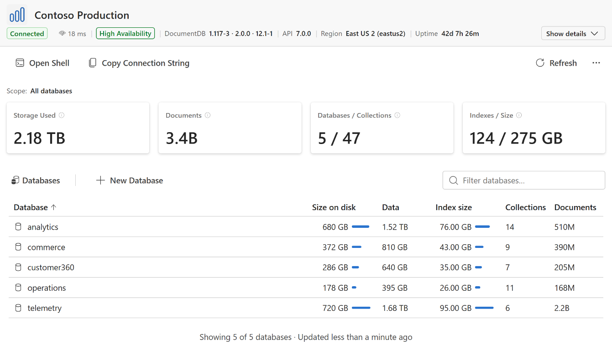

> **Release Notes** - [Back to Release Notes](../index.md#release-notes)

---

# DocumentDB for VS Code Extension v0.11

We are excited to announce **DocumentDB for VS Code Extension v0.11**. Explore your databases at a glance with the new **Cluster Dashboard**, work faster in a more helpful **Interactive Shell**, connect from Azure VMs with **Managed Identity authentication**, and carry indexes along when you **copy and paste** collections. Local setup is more dependable, too.

## What's New in v0.11

### ⭐ Cluster Dashboard

We are introducing a major new feature: the **Cluster Dashboard**. Opened from a cluster tree node, it gives you a focused inventory of everything a cluster holds, without leaving VS Code. The dashboard shows an overview with cluster identity, connection status, round-trip time, and Azure high-availability facts, plus a details view with server and other metadata you can copy directly.

<p align="center"></p>

Below the header, a database and collection inventory reports storage, data, index, collection, and document statistics where the server provides them, with sorting, filtering, drill-in, refresh, create, and delete actions. Open Shell and Copy Connection String are one click away, and a failed or partial read shows a clear retry state instead of a guessed number.

Use the dashboard to get oriented and navigate your cluster on demand. It presents a snapshot of your data rather than a live view of running operations.

### ⭐ A More Helpful Interactive Shell

The **Interactive Shell** now helps you find your way from the first prompt, with more context up front and useful guidance as you type.

#### Know where you are

The new connection header shows your saved connection name, host, authentication method, active database, and identity when available. For example:

```text
Connected to: Local development (mycluster.example.com)
Identity: admin | Authentication: Username and Password (SCRAM) | Database: myDatabase
```

With Microsoft Entra ID account sign-in, the header makes your signed-in identity just as clear:

```text
Connected to: Production (prod.example.com)
Identity: alex@contoso.com | Authentication: Microsoft Entra ID (Account) | Database: inventory
```

#### Discover as you type

After connecting or switching databases, collection suggestions are prepared for you. Type `db.` to see how many collections are available in the current database; press **Tab** to browse their names and the database methods. Once you finish typing a method, the shell explains it before you run it:

```text
myDatabase> db.
  🛈 7 collections

myDatabase> db.restaurants.countDocuments
  🛈 Counts documents matching a filter (uses aggregate)
```

Complete the query with `({})` to count documents. Previously entered commands can also appear as inline history suggestions, and terminal resizing or narrow widths no longer disrupt your input and cursor.

#### Let Tab handle tricky names

For a collection named `restaurants-something`, the shell previews the bracket notation it needs. Press **Tab** to replace the dot notation with valid syntax:

```text
myDatabase> db.rest
  🛈 ['restaurants-something']

myDatabase> db['restaurants-something']
```

Need to change how the shell behaves? Run `help` and follow the clickable link directly to the Interactive Shell settings.

Learn more in the [Interactive Shell user manual](https://microsoft.github.io/vscode-documentdb/user-manual/interactive-shell).

### ⭐ Managed Identity Authentication

We've added **managed identity authentication** for Azure DocumentDB (vCore) connections from VS Code running on Azure VMs. Connect with a system-assigned or user-assigned identity, and keep using it across the Collection View, Query Playground, and Interactive Shell. Your choice is remembered when you save, reconnect, or update a connection, with guidance when an identity endpoint is unavailable or a cross-tenant configuration is unsupported.

Signing in is easier to navigate, too. Choose Username and Password, Microsoft Entra ID, or No Authentication first; if you choose Microsoft Entra ID, you can sign in with your account, use a managed identity from the connection string or current machine, or enter a user-assigned identity's client ID. You can return to the authentication choice at any step.

Learn more in the [Managed Identity user manual](https://microsoft.github.io/vscode-documentdb/user-manual/connect-with-managed-identity).

### ⭐ Copy and Paste Indexes

We've extended **Copy and Paste Collections** with full support for indexes, so you no longer have to recreate them by hand, whether you're copying an entire collection or just moving index definitions on their own.

- **Indexes with your collection**: When you paste a collection, choose whether to recreate eligible secondary indexes on the target. To protect the data being copied, TTL and unique indexes are not included in this option; copy the documents first, then apply those indexes with the dedicated workflow below.

- **Indexes on their own**: Use **Copy Index…**, **Copy Selected Indexes…**, or **Copy Indexes…** on a collection's Indexes node, then **Paste Indexes…** into a target collection, database, or another connected cluster. This workflow can include TTL and unique indexes without moving any documents.

Existing equivalent indexes are skipped, conflicting names are handled automatically, and vector options and hidden-index state carry over. Your copied selection stays ready for the next target, making it easy to apply the same indexes across collections. Learn more in the [Copy and Paste user manual](https://microsoft.github.io/vscode-documentdb/user-manual/copy-and-paste).

## Key Fixes and Improvements

- **DocumentDB Local Quick Start Reliability**
  - Set up or start fresh with greater confidence: Quick Start checks that setup can proceed before removing an existing data volume.
  - See useful Docker errors promptly and catch unsupported credentials or empty ports during configuration.
  - Pick up where you left off after an interrupted setup or external container or data removal. Your instance password stays out of the setup output channel, and temporary credentials are cleared as soon as the container starts.
- **Settings Organization**
  - Find settings in eight expandable sections: General, Connections & Discovery, Queries & Results, Copy & Paste, Query Playground, Interactive Shell, AI Assistant, and Accessibility.
  - Shell and Query Playground connection timeouts now share `documentDB.connectionTimeout`. Nine settings have been renamed; if you customized any of the old settings, set their new equivalents again because previous values are not migrated.
- **Azure Discovery Connections**
  - Connect more reliably to Azure Cosmos DB for MongoDB (RU) clusters from the Azure Resources view. Azure VM Discovery also shows VMs without a reachable address as unavailable, so you can see them without attempting a connection that cannot succeed.
- **Connection Startup Diagnostics**
  - See whether a slow connection is waiting on Microsoft Entra ID authentication or the database, with separate timing information across Collection View, Interactive Shell, and Query Playground.
- **Completion and UI Polish**
  - Field completions and Collection View now show document fields instead of internal BSON properties, including `MinKey` and `MaxKey` fields in completions.
  - Keyboard focus remains visible on the Create Index drawer's Standard and Vector tabs. When you select multiple connections, the deletion command clearly says **Delete Selected Connections**.

## Changelog

See the full changelog entry for this release:
➡️ [CHANGELOG.md#0110](https://github.com/microsoft/vscode-documentdb/blob/main/CHANGELOG.md#0110)
