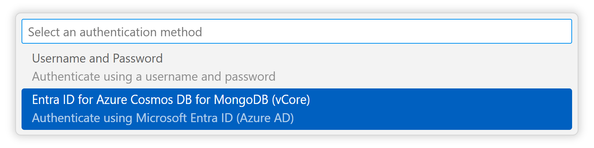

<!-- Release Notes Section Badge or Breadcrumb -->

> **Release Notes** &mdash; [Back to Release Notes Index](./index)

---

# DocumentDB for VS Code Extension v0.3.0

We are excited to announce the release of **DocumentDB for VS Code Extension v0.3.0**. This release introduces a major new feature: support for **Microsoft Entra ID** authentication with **Azure Cosmos DB for MongoDB (vCore)** clusters. This enhances security for enterprise scenarios and aligns with modern identity management practices.

## What's New in v0.3.0

### ⭐ **Support for Entra ID for Azure Cosmos DB for MongoDB (vCore)** ([#123](https://github.com/microsoft/vscode-documentdb/issues/123))

You can now connect to Azure Cosmos DB for MongoDB (vCore) clusters using Microsoft Entra ID (formerly Azure AD), providing a secure, passwordless authentication method. This feature is integrated throughout the extension's connection workflows.

For an efficient authentication process, the extension leverages your existing Azure session within VS Code. If you are already signed in to Azure, your identity will be used automatically for Entra ID authentication. If no active session is found, you will be prompted to sign in to your Azure account first.

The available authentication methods are:

- **Username and Password**: The traditional authentication method.
- **Entra ID for Azure Cosmos DB for MongoDB (vCore)**: Authenticate using your Microsoft Entra ID credentials.

#### **Service Discovery**

When connecting to a cluster directly from the **Service Discovery** view, the extension automatically detects the authentication methods supported by your cluster.

- If multiple authentication methods are available, you will be prompted to choose your preferred one.
- If only one method is supported, it will be selected automatically.

#### **Saving Connections**

When you save a connection from the **Service Discovery** view, it is added to your **Connections** list without an immediate prompt. The first time you attempt to connect to this saved entry, you will be asked to choose your preferred authentication method. At that point, you will have the option to persist your choice for all future connections to that cluster.

#### **Adding a New Connection**

When adding a new connection using a connection string, you can now select your preferred authentication method from a list of all supported methods.

To help guide you, if the provided hostname is not recognized as an Azure Cosmos DB for MongoDB (vCore) cluster, a note ("Cluster support unknown") will appear next to the Entra ID option. We display all available methods to ensure you are not blocked from using this feature, even with custom or unrecognized hostnames.

## Changelog

See the full changelog entry for this release:
➡️ [CHANGELOG.md#030](https://github.com/microsoft/vscode-documentdb/blob/main/CHANGELOG.md#030)
