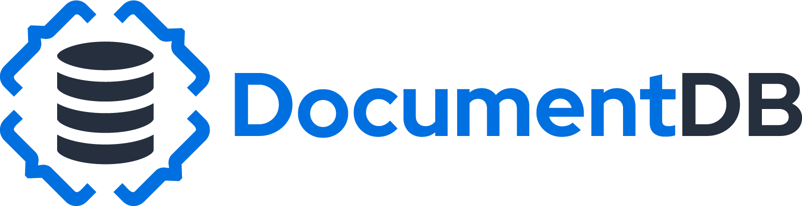
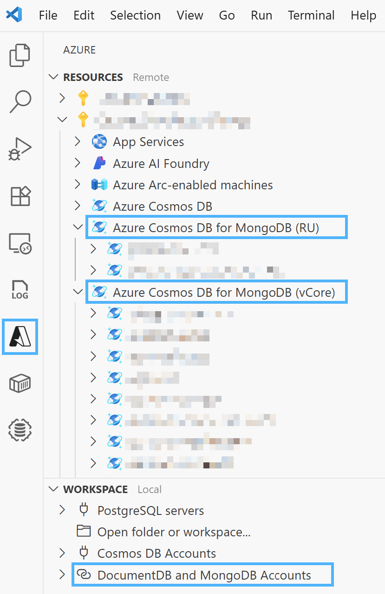

<!-- Release Notes Section Badge or Breadcrumb -->

> **Release Notes** — [Back to Home](../index.md)

---

# DocumentDB for VS Code Extension v0.4

We are excited to announce the release of **DocumentDB for VS Code Extension v0.4**. This is a landmark update that introduces deep integration with the Azure ecosystem, adds powerful new service discovery capabilities, and aligns our branding with the official [DocumentDB](https://documentdb.io) identity.

This release improves how developers working with Azure discover, connect to, and manage their MongoDB-compatible databases, all from within a unified VS Code experience.

## What's New in v0.4

### ⭐ **Deep Integration with the Azure Resources Extension** ([#58](https://github.com/microsoft/vscode-documentdb/issues/58))

> **Note: This is a staged feature release**
> It is coordinated across three extensions: DocumentDB for VS Code, Azure Databases, and Azure Resources.
>
> The full integration experience will be enabled when the Azure Resources extension update is released in the coming days.

This release improves the user experience for developers in the Azure ecosystem by integrating directly with the **Azure Resources extension**. The DocumentDB extension now takes ownership of the **Azure Cosmos DB for MongoDB (RU)** and **(vCore)** nodes directly within the Azure resource tree.

This collaboration provides a single, authoritative view for all your Azure resources while enriching the experience with the specialized MongoDB tooling that our extension provides.

- **Unified Azure View**: Discover and manage your MongoDB resources directly within the familiar Azure Resources view without needing to switch between extensions.
- **Rich MongoDB Tooling**: Access all of DocumentDB for VS Code's features - like data exploration, query scrapbooks, and management commands - directly from the Azure tree.
- **Coordinated Orchestration**: The Azure Resources extension now directs which extension manages which resource, ensuring a stable and conflict-free experience.
- **Automatic Migration**: Existing MongoDB connections are automatically migrated for an efficient transition.

### 2️⃣ **Service Discovery for Azure Cosmos DB for MongoDB (RU)** ([#244](https://github.com/microsoft/vscode-documentdb/issues/244))

We've expanded our service discovery capabilities by adding a dedicated provider for **Azure Cosmos DB for MongoDB (RU)** resources. This complements our existing vCore provider and makes connecting to RU-based accounts easier than ever.

- **New Discovery Option**: A new "Azure Cosmos DB for MongoDB (RU)" provider is now available in the Discovery View.
- **Consistent User Experience**: The new provider uses the same authentication and wizard-based workflow (select subscription → select cluster → connect) that users are already familiar with.
- **Optimized for RU**: The provider uses RU-specific Azure APIs to ensure accurate and reliable discovery.

[Learn more about Service Discovery →](../learn-more/service-discovery.md)

### 3️⃣ **Official DocumentDB Logo and Branding** ([#246](https://github.com/microsoft/vscode-documentdb/pull/246))

The extension has been updated with the **official DocumentDB logo and branding**. This change provides better brand recognition and creates a more consistent visual identity across the DocumentDB ecosystem. You'll see the new logo in the VS Code activity bar, the marketplace, and throughout our documentation.

## Key Fixes and Improvements

#### 🐛 **Restored Password Support for Connection Strings** ([#247](https://github.com/microsoft/vscode-documentdb/pull/247))

We've fixed a regression that prevented users from creating new connections using a connection string with a password in certain configurations. The validation logic in the connection workflow has been improved to ensure all valid connection strings are handled correctly.

#### 🛠️ **Improved Debugging with Enhanced Error Details** ([#236](https://github.com/microsoft/vscode-documentdb/pull/236))

As part of our commitment to stability, we've enhanced our internal error handling. `nonNull` checks now include file context in their error messages, making it significantly easier for our team to diagnose and triage reported issues.

## Changelog

See the full changelog entry for this release:
➡️ [CHANGELOG.md#040](https://github.com/microsoft/vscode-documentdb/blob/main/CHANGELOG.md#040)

---

## Patch Release v0.4.1

This patch release includes a minor fix and a small user-experience update related to the walkthrough welcome screen.

### What's Changed in v0.4.1

#### **Walkthrough Welcome Screen & Sidebar Icon Discovery** ([#253](https://github.com/microsoft/vscode-documentdb/pull/253))

The walkthrough welcome screen behavior has been updated to help users notice the updated extension icon in the VS Code sidebar. This change highlights the new branding so users can find the extension more easily from the environment they already use.

### Changelog

See the full changelog entry for this release:
➡️ [CHANGELOG.md#041](https://github.com/microsoft/vscode-documentdb/blob/main/CHANGELOG.md#041)
