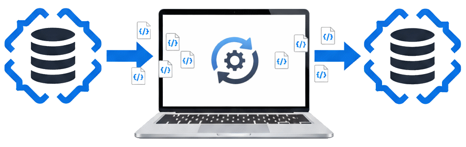

> **Release Notes** — [Back to Release Notes](../index.md#release-notes)

---

# DocumentDB for VS Code Extension v0.7

We are excited to announce the release of **DocumentDB for VS Code Extension v0.7**. This is a major update for our DocumentDB and MongoDB GUI, delivering long-awaited features that improve data management workflows.

It includes **Lightweight Data Migration** for collection copying, adds **Folder Management for Connections** to organize your workspace, and delivers **Accessibility Improvements** that make the extension more inclusive.

## What's New in v0.7

### 1️⃣ Lightweight Data Migration

We're introducing **Lightweight Data Migration** (also known as "**Collection Copy-and-Paste**"). This feature enables you to copy collections and paste them into new or existing collections, across different databases or even different servers - all directly within VS Code.

Designed for **smaller-to-medium datasets** that can be streamed through your local machine, this feature simplifies moving data between environments. It's useful for:

- Creating test or development copies of production collections
- Moving data between different database systems
- Merging data from multiple sources
- Backing up specific collections

**Conflict Resolution**

When pasting into an existing collection, the migration wizard offers four conflict resolution strategies:

1. **Abort on Conflict** - Stop immediately if a duplicate `_id` is detected
2. **Skip Conflicting Documents** - Keep existing documents unchanged, only insert new ones
3. **Overwrite Existing Documents** - Replace existing documents with source data
4. **Generate New IDs for All Documents** - Create unique copies while preserving original IDs in `_original_id`

**Lightweight Data Migration** streams data through your local machine, reading from the source and writing to the target in efficient batches. For production-scale migrations with terabytes of data, we recommend using dedicated migration services. However, for development workflows and smaller datasets, this feature provides a convenient option.

📖 For complete details on using this feature, including all conflict resolution strategies and best practices, see our comprehensive documentation: ➡️ [Collection Copy-and-Paste User Guide](https://microsoft.github.io/vscode-documentdb/user-manual/copy-and-paste)

[#63](https://github.com/microsoft/vscode-documentdb/issues/63), [#170](https://github.com/microsoft/vscode-documentdb/pull/170)

### 2️⃣ Folder Management for Connections

Managing multiple database connections is now easier with hierarchical folder organization. We've redesigned the **Connections View** to support **hierarchical folder organization**, converting what was previously a flat list into an organized system.

**Key Capabilities**

- **Create Folders and Subfolders**: Organize connections by environment (dev/staging/prod), project, team, or any structure that makes sense for your workflow
- **Move Items Wizard**: Use the "Move Items" wizard to relocate connections and folders with validation and conflict detection
- **Rename and Delete**: Full management capabilities for both connections and folders
- **Visual Hierarchy**: Folders display with expandable/collapsible state and clear visual indicators

**Additional Features**

- **Automatic Sorting**: Folders and connections are alphabetically sorted for easy navigation
- **Empty Folder Indicators**: Visual feedback when folders contain no items
- **Multi-Item Moving**: Select and move multiple connections or folders simultaneously
- **Boundary Protection**: Enforced separation between emulator and non-emulator connections to prevent configuration issues

This feature is particularly valuable for developers managing:

- Multiple client environments
- Various project databases
- Team-shared connection configurations
- Complex enterprise database topologies

[#426](https://github.com/microsoft/vscode-documentdb/pull/426)

### 3️⃣ Accessibility Improvements

Accessibility is a core value for us, and this release includes improvements to ensure the extension is usable by everyone, regardless of ability. We've addressed nine accessibility issues reported by the Microsoft Accessibility Testing team, focusing on screen reader support, keyboard navigation, and ARIA labeling.

**Screen Reader Enhancements**

- **Search Results Announcements** ([#384](https://github.com/microsoft/vscode-documentdb/issues/384)): Screen readers now properly announce search result counts and "No Results Found" messages in the Collection View
- **AI Analysis Status** ([#380](https://github.com/microsoft/vscode-documentdb/issues/380)): Screen readers now announce the "AI is analyzing..." status message instead of generic "Document" text in Query Insights
- **Rating Button Context** ([#381](https://github.com/microsoft/vscode-documentdb/issues/381)): Added proper grouping labels so screen readers announce "How would you rate AI insights?" when focusing on like/dislike buttons

**Keyboard Navigation Improvements**

- **Focus Visibility** ([#385](https://github.com/microsoft/vscode-documentdb/issues/385)): Keyboard focus is now immediately visible when opening the "Edit Selected Document" dialog, eliminating the need to press Tab multiple times
- **Tooltip Accessibility** ([#375](https://github.com/microsoft/vscode-documentdb/issues/375)): All tooltips in the Query Insights tab are now accessible via keyboard navigation

**ARIA Labeling Fixes**

- **Query Field Labels** ([#379](https://github.com/microsoft/vscode-documentdb/issues/379)): Added proper visual labels for query fields with programmatic names that correctly reflect field purpose
- **Button Naming** ([#378](https://github.com/microsoft/vscode-documentdb/issues/378)): Next, Previous, and Close buttons in the Tips section now have proper accessible names
- **Spin Button Labels** ([#377](https://github.com/microsoft/vscode-documentdb/issues/377)): Skip and Limit spin buttons now have appropriate accessible names for assistive technologies
- **Label-in-Name Compliance** ([#374](https://github.com/microsoft/vscode-documentdb/issues/374)): Refresh and Validate buttons now have accessible names that include their visual labels, ensuring compatibility with voice control

**User Impact**

These improvements help developers using screen readers (NVDA, JAWS, Narrator, VoiceOver), keyboard-only navigation, or voice control software interact with extension features. This work aligns with WCAG 2.1 AA standards and reflects our ongoing commitment to inclusive design.

## 🤲 Community Contributions

We're grateful for the contributions from our open-source community! This release includes both code contributions and valuable bug reports that helped improve the extension:

### 1️⃣ Alphabetical Collection Sorting ([#465](https://github.com/microsoft/vscode-documentdb/pull/465))

Collections within DocumentDB databases are now displayed in alphabetical order, making it much easier to find the collection you're looking for. This improvement enhances usability when working with databases that contain many collections.

**Contributed by [@VanitasBlade](https://github.com/VanitasBlade)**, fixing issue [#456](https://github.com/microsoft/vscode-documentdb/issues/456) originally reported by [@majelbstoat](https://github.com/majelbstoat).

### 2️⃣ Bug Reports from the Community

- **Invalid query JSON handling**: Reported by [@majelbstoat](https://github.com/majelbstoat) ([#458](https://github.com/microsoft/vscode-documentdb/issues/458)); fixed in [Query Parsing Error Handling](#query-parsing-error-handling).
- **Keyboard paste shortcuts**: Reported by [@cveld](https://github.com/cveld) and [@markjbrown](https://github.com/markjbrown) ([#435](https://github.com/microsoft/vscode-documentdb/issues/435)); fixed in [Monaco Editor Keyboard Paste](#monaco-editor-keyboard-paste).

## Additional Improvements

### Estimated Document Count Display

Collections in the tree view now display an estimated document count, helping you assess collection sizes without running explicit count queries. This makes it easier to understand your data at a glance.

### Query Insights Performance Enhancement ([#468](https://github.com/microsoft/vscode-documentdb/pull/468))

The Query Insights feature has been improved with an updated AI model (GPT-4o) and refined prompt architecture. Key improvements include:

- **Faster Response Times**: The GPT-4o model delivers query analysis results more quickly than previous models
- **Enhanced Security**: Restructured prompt components with explicit delimiters and security instructions to protect against prompt injection attacks
- **Better Reliability**: Improved prompt structure ensures more consistent and accurate recommendations

These changes make the Query Insights feature faster and more reliable for analyzing query performance.

### Connection String Handling ([#467](https://github.com/microsoft/vscode-documentdb/pull/467))

Connection string inputs are now automatically trimmed and validated. This prevents issues when pasting connection strings that may contain leading or trailing whitespace, ensuring successful connections every time.

### Improved Data Migration Feedback

Two enhancements improve the collection paste experience:

- **Accurate Count Updates** ([#482](https://github.com/microsoft/vscode-documentdb/pull/482)): Document count estimates now refresh correctly after paste operations, even when some documents fail to insert
- **Complete Error Logging** ([#484](https://github.com/microsoft/vscode-documentdb/pull/484)): All write errors, including unique index violations, are now properly logged. Failed operations automatically open the output log to ensure you don't miss important error details

### Copy Connection String with Password ([#436](https://github.com/microsoft/vscode-documentdb/pull/436))

When copying connection details to the clipboard, you can now choose whether to include the password. Previously, it wasn't possible to copy connection strings with passwords included—this option provides the flexibility needed for different security contexts.

### Improved AI Response Formatting ([#428](https://github.com/microsoft/vscode-documentdb/issues/428))

Fixed markdown formatting issues in AI-generated responses from the Query Insights feature. The extension now restricts formatting options to prevent malformed output, ensuring recommendations are always readable and properly rendered.

## Key Fixes

### Dark Theme Support ([#457](https://github.com/microsoft/vscode-documentdb/issues/457))

Resolved UI rendering issues that affected users of dark themes like Nord. Text in certain controls was dark-on-dark and invisible, making parts of the interface unusable. All UI elements now properly respect theme colors for better visibility in both light and dark modes.

### Security Dependency Updates ([#434](https://github.com/microsoft/vscode-documentdb/pull/434))

Updated `qs` and `express` dependencies to address security vulnerabilities, ensuring the extension maintains high security standards.

### Query Parsing Error Handling ([#471](https://github.com/microsoft/vscode-documentdb/pull/471))

Fixed an issue where invalid JSON in query fields (filter, projection, sort) was silently replaced with empty objects, making it difficult to understand why queries weren't working as expected. Parse failures now display clear error dialogs with helpful JSON syntax examples. **Reported by [@majelbstoat](https://github.com/majelbstoat)** in [#458](https://github.com/microsoft/vscode-documentdb/issues/458).

### Monaco Editor Keyboard Paste ([#470](https://github.com/microsoft/vscode-documentdb/pull/470))

Restored keyboard paste functionality (`Ctrl+V` / `Cmd+V`) in the Query Editor and Document View. A regression in Monaco Editor 0.53.x/0.54.x broke keyboard shortcuts for paste operations. Downgrading to Monaco 0.52.2 resolves this issue. Context menu paste always worked, but keyboard shortcuts are now functional again. **Reported by [@cveld](https://github.com/cveld)** in [#435](https://github.com/microsoft/vscode-documentdb/issues/435).

### Document Import from Discovery View ([#479](https://github.com/microsoft/vscode-documentdb/pull/479))

Fixed document import failures when using the Azure Service Discovery View with Azure Cosmos DB for MongoDB (RU) resources. The extension now properly retrieves connection strings even when metadata cache hasn't fully populated, ensuring reliable imports from discovered resources. Resolves [#368](https://github.com/microsoft/vscode-documentdb/issues/368).

### Azure Resources View Connectivity ([#480](https://github.com/microsoft/vscode-documentdb/pull/480))

Resolved connection failures when expanding Azure DocumentDB clusters in the Azure Resources view. Previously, undefined resource group metadata caused cryptic API errors. The extension now correctly extracts resource group information from resource IDs, ensuring reliable connectivity to vCore and Azure Cosmos DB for MongoDB (RU) clusters.

## Changelog

See the full changelog entry for this release:
➡️ [CHANGELOG.md#070](https://github.com/microsoft/vscode-documentdb/blob/main/CHANGELOG.md#070)
