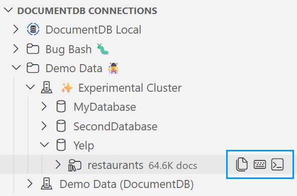

> **Release Notes** : [Back to Release Notes](../index.md#release-notes)

---

# DocumentDB for VS Code Extension v0.8

We are excited to announce the release of **DocumentDB for VS Code Extension v0.8**. This is a landmark update, and our biggest release yet, transforming the extension from a GUI browser into a **full-featured query development environment** for DocumentDB and MongoDB API databases.

This release introduces three major features: **context-aware autocompletion** in the Collection View, a brand-new **Query Playground** for writing and running scripts, and a built-in **Interactive Shell** for ad-hoc exploration. Everything is bundled, requires zero external tools, and works with Entra ID out of the box.

## What's New in v0.8

### ⭐ Context-Aware Autocompletion in the Collection View

The filter, project, sort, and aggregation editors in the Collection View now understand your data. As you type queries, the editor suggests **field names** sampled from your collection's actual schema, **operators** with type-aware sorting, and **values**, all with hover documentation for every operator linking to the DocumentDB API docs.

The editor knows your schema and guides you through every keystroke, so you no longer need to look up operator syntax or guess between similar operators like `$gte` and `$gt`.

In this example, the field `additionalInfo.isFamilyFriendly` is a boolean. The editor suggests `true` and `false` first, followed by comparison operators. Each suggestion shows its category (boolean literal, comparison, projection, element) and the documentation panel at the bottom describes the selected item.

- **Schema-aware field suggestions**: Field names come from your collection's actual data, complete with type indicators and optionality markers, so you always know what fields are available and what types they hold.
  > Schema information is gathered locally from the documents you browse and query. No data is sent to external services for this purpose.
- **Type-aware operator ordering**: When you type `$` after a field, operators are sorted by relevance to that field's type. Comparison operators appear first for numbers, regex operators for strings.
- **Relaxed query syntax**: You can now type queries using unquoted keys, single-quoted strings, BSON constructors (`ObjectId()`, `ISODate()`), and JavaScript expressions (`Date.now()`, `Math.min()`). All the input restrictions from previous releases are gone.
- **Real-time validation**: Syntax errors are highlighted as you type, and near-miss typos produce helpful "Did you mean `ObjectId`?" warnings.
- **Hover documentation**: Hover over any `$`-prefixed operator or BSON constructor to see its description and a direct link to the DocumentDB API docs.

[#508](https://github.com/microsoft/vscode-documentdb/pull/508), [#506](https://github.com/microsoft/vscode-documentdb/pull/506), [#513](https://github.com/microsoft/vscode-documentdb/pull/513), [#518](https://github.com/microsoft/vscode-documentdb/pull/518)

### ⭐ Query Playground

The Query Playground introduces a `.documentdb.js` file type that lets you write and run JavaScript scripts against your cluster, directly inside VS Code. Think of it as a notebook-style scratchpad for DocumentDB.

The screenshot shows a `.documentdb.js` file connected to a cluster. The **Run All** CodeLens at the top runs the entire file, while each block has its own **Run** button plus shortcuts to open the same query in the **Collection View** or the **Interactive Shell**.

- **CodeLens-driven execution**: Each script block has its own **Run** button, and there's a **Run All** at the top. Results appear in a dedicated tab alongside your script.
- **Cross-feature CodeLens links**: Each block also shows **Collection View** and **Shell** links that open the same query in the respective surface, so you can switch tools without copy-pasting.
- **Full JavaScript syntax**: Write `db.collection.find()`, `db.collection.aggregate()`, or any valid JavaScript, with autocompletion for `db.*` chains, collection methods, BSON constructors, and schema-aware field suggestions.
- **Console output**: `console.log()`, `print()`, and `printjson()` all work, with output displayed in a dedicated console section of the results panel.
- **Per-file connections**: Each playground document is permanently bound to its cluster and database. Multiple playgrounds can be open simultaneously, each connected to a different server.
- **Keyboard shortcuts**: `Ctrl+Enter` runs the current block, `Ctrl+Shift+Enter` runs the entire file.

**No external tools required.** The previous scratchpad relied on a locally installed shell executable. That dependency is completely gone. The query runtime is now bundled directly into the extension and reuses the connection you already established when connecting to the cluster. This means it works seamlessly with **Azure DocumentDB clusters using Entra ID authentication**: no extra configuration, no credential juggling.

Just install the extension and start writing queries. No platform-specific headaches, no version mismatches, no PATH configuration.

[#508](https://github.com/microsoft/vscode-documentdb/pull/508), [#573](https://github.com/microsoft/vscode-documentdb/pull/573), [#589](https://github.com/microsoft/vscode-documentdb/pull/589)

### ⭐ Interactive Shell

A full REPL terminal embedded in VS Code, giving you a shell experience fully integrated with the extension's connection management. Open it from any cluster, database, or collection node in the tree view, and you're immediately connected and ready to explore.

The screenshot shows two key features: tab completion suggesting `find()`, `findOne()`, and other collection methods after typing `db.restaurants.find`, and ghost text suggesting the field name `reviews` after the user typed `re` in a query. The field suggestion comes from schema information gathered locally as you browse and query your data.

- **Shell commands**: `show dbs`, `show collections`, `use <db>`, `help`, `it` (cursor iteration), `exit`/`quit`, `cls`/`clear`.
- **Persistent context**: Variables and state persist across commands within a session. Define a variable and use it in the next command.
- **Syntax highlighting**: Real-time colorization of keywords, strings, numbers, BSON constructors, and `$`-operators as you type.
- **Tab completion and ghost text**: Context-aware autocompletion with tab cycling and inline "ghost text" suggestions. When there are multiple matches (e.g., `db.users.`), a list of options is shown. When only one match remains (e.g., typing `re` in a query where `reviews` is the only matching field), the suggestion appears as inline ghost text. The shell also suggests closing brackets automatically: type `db.col.find({ _id: { $exists: true ` and see `}})` appear as ghost text. Supports database names, collection names, collection methods, shell commands, and operators.
- **Cancellation**: `Ctrl+C` cancels long-running operations immediately.
- **Clickable links**: After query results, two clickable links appear: one to open the collection in the Collection View and another to open it in a new Query Playground.
- **Dynamic prompt**: The prompt shows your current database (e.g., `myDatabase>`), and `use <db>` updates both the prompt and the terminal tab name.

**Same zero-install philosophy.** The Interactive Shell uses the same bundled runtime as the Query Playground: no external shell executable needed. It works with every connection type the extension supports, including **Azure DocumentDB with Entra ID**. Install the extension and you have a fully functional shell, regardless of your OS or environment.

[#508](https://github.com/microsoft/vscode-documentdb/pull/508), [#573](https://github.com/microsoft/vscode-documentdb/pull/573), [#576](https://github.com/microsoft/vscode-documentdb/pull/576), [#580](https://github.com/microsoft/vscode-documentdb/pull/580)

### ⭐ Cross-Feature Navigation

All three query surfaces (Collection View, Query Playground, and Interactive Shell) are linked together with navigation actions, so you can seamlessly move your work between them.

Every collection node in the tree view now shows three inline action buttons for instant access:

From left to right: **Open Collection View**, **New Query Playground**, and **Open Interactive Shell**. The same actions are available through right-click context menus on database and collection nodes.

#### 1️⃣ Collection View to Playground and Shell

The Collection View toolbar includes **Open in Playground** and **Open in Shell** buttons. Clicking either one takes your current find query (filter, project, and sort) and exports it into the target surface. The playground receives a complete `db.getCollection('...').find(filter, project).sort(sort)` statement ready to run. The shell receives the same expression pre-filled at the prompt so you can edit it before executing.

#### 2️⃣ Shell to Collection View and Playground

After every query result in the Interactive Shell, two clickable links appear: `↗ Collection View [db.collection]` and `↗ Query Playground [db.collection]`. Clicking either one opens the referenced collection in the corresponding surface, so you can switch from ad-hoc exploration to visual browsing or scripting with a single click.

#### 3️⃣ Playground to Collection View and Shell

Each code block in a Query Playground file shows **Collection View** and **Shell** CodeLens links alongside the **Run** button. These open the same query in the Collection View or launch an Interactive Shell session for the same connection. Some scripts (e.g., loops, aggregations, or multi-statement blocks) may not be convertible to the Collection View.

#### 4️⃣ Clipboard Copy and Paste

The Collection View toolbar includes a **Copy** button that copies the current find expression to the clipboard in `db.getCollection('...').find(filter, project).sort(sort)` format. You can paste this text into a playground file, a shell session, or share it with a colleague.

The Collection View also supports **Paste**: paste a find expression from the clipboard and the extension parses it back into the filter, project, and sort editors.

[#589](https://github.com/microsoft/vscode-documentdb/pull/589)

## Key Fixes and Improvements

- **Query Insights: Static Analysis Improvements**
  - Improved the static query performance evaluation with new selectivity and fetch overhead metrics, three-color badge system, index strategy advisories, and edge case fixes for empty queries and zero-result scenarios. [#615](https://github.com/microsoft/vscode-documentdb/pull/615)
  - Aligned AI analysis with static analysis so the AI is aware of what the user was already shown, eliminating contradictions between the two analyses. [#616](https://github.com/microsoft/vscode-documentdb/pull/616)
  - Demoted score for wasteful single-field bitmap indexes that return a large fraction of the collection. [#623](https://github.com/microsoft/vscode-documentdb/pull/623)

- **Duplicate Connection Reveal**
  - Fixed an issue where revealing a duplicate connection failed silently when the connection lived inside a folder. The folder now expands and the connection is selected correctly. [#602](https://github.com/microsoft/vscode-documentdb/pull/602)

- **About Dialog**
  - Added an "About" entry to the Help & Feedback view showing extension version, VS Code version, OS details, and registered plugins, with a Copy button for easy bug reporting. [#612](https://github.com/microsoft/vscode-documentdb/pull/612)

- **Prerelease Version Migration**
  - Implemented migration logic for prerelease version handling in notifications, ensuring update prompts work correctly for beta users. [#610](https://github.com/microsoft/vscode-documentdb/pull/610)

- **Double-Click to Open Collection View**
  - The Documents tree item now requires a double-click to open the Collection View, preventing tabs from opening accidentally when single-clicking to browse the tree.

- **Custom Editor Tab Icons**
  - Collection View, Document View, and Query Playground tabs now display dedicated icons instead of the default webview icon, making it easier to identify open tabs at a glance.

### Dependencies

- Updated `fast-uri`, `fast-xml-builder`, `basic-ftp`, `path-to-regexp`, and other transitive dependencies to their latest versions. [#624](https://github.com/microsoft/vscode-documentdb/pull/624), [#606](https://github.com/microsoft/vscode-documentdb/pull/606), [#607](https://github.com/microsoft/vscode-documentdb/pull/607), [#609](https://github.com/microsoft/vscode-documentdb/pull/609), [#627](https://github.com/microsoft/vscode-documentdb/pull/627), [#628](https://github.com/microsoft/vscode-documentdb/pull/628), [#629](https://github.com/microsoft/vscode-documentdb/pull/629)

## Changelog

See the full changelog entry for this release:
➡️ [CHANGELOG.md#080](https://github.com/microsoft/vscode-documentdb/blob/main/CHANGELOG.md#080)

---

## Patch Release v0.8.1

This patch delivers Node 24 compatibility, significantly faster extension startup, tree view quality-of-life improvements with live item counts, AI transparency in Query Insights, batch connection deletion, and a fantastic wave of community contributions.

### 🤲 Community Contributions

This release would not be what it is without our fantastic open-source community. A big thank you to everyone who submitted pull requests, reported issues, and helped shape v0.8.1!

- **[@lte-z](https://github.com/lte-z)** contributed two improvements in this release: hidden index visibility and context menu cleanup ([#674](https://github.com/microsoft/vscode-documentdb/pull/674)) and shard key display in collection tooltips ([#670](https://github.com/microsoft/vscode-documentdb/pull/670)).
- **[@omribz156](https://github.com/omribz156)** added contextual filenames for new Query Playground files ([#664](https://github.com/microsoft/vscode-documentdb/pull/664)).
- **[@Jacquelinezhong](https://github.com/Jacquelinezhong)** fixed the `_id_` index sort order so it always appears first in the Indexes list ([#662](https://github.com/microsoft/vscode-documentdb/pull/662)).
- **[@Green00101](https://github.com/Green00101)** cleaned up the obsolete release-notes notification migration code ([#622](https://github.com/microsoft/vscode-documentdb/pull/622)).
- **[@CalvinMagezi](https://github.com/CalvinMagezi)**, **[@Jah-yee](https://github.com/Jah-yee)**, and **[@Enocko](https://github.com/Enocko)** each independently submitted a fix for the `credentialId` → `clusterId` parameter rename ([#568](https://github.com/microsoft/vscode-documentdb/pull/568), [#575](https://github.com/microsoft/vscode-documentdb/pull/575), [#651](https://github.com/microsoft/vscode-documentdb/pull/651)) — three contributors tackling the same issue is a rare and wonderful thing. All of their work influenced the final merged result ([#652](https://github.com/microsoft/vscode-documentdb/pull/652)).

### What's Changed in v0.8.1

#### 💠 **Node 24 Compatibility** ([#699](https://github.com/microsoft/vscode-documentdb/pull/699))

**VS Code 1.123** (released June 3, 2026) ships with Node 24. If you updated VS Code and found the DocumentDB extension no longer loading, this fix is for you. The extension now works correctly with VS Code 1.123 and later.

#### 💠 **Item Counts on Tree Nodes** ([#714](https://github.com/microsoft/vscode-documentdb/pull/714))

The tree view now tells you more before you click. Two new at-a-glance counts appear automatically as you browse:

- **Collection count on database nodes** — After expanding a cluster, each database shows how many collections it contains (e.g., `·· 12`). For large clusters, counts cap at 50+ to keep the query lightweight.
- **Index count on the Indexes folder** — Expanding a collection now shows how many indexes are present at a glance (e.g., `·· 4`).

Counts load asynchronously in the background so tree expansion remains instant. A new `documentDB.accessibility.hideCountPrefix` setting lets you suppress the `··` visual separator for a cleaner look or better screen reader experience.

#### 💠 **AI Model Transparency in Query Insights** ([#690](https://github.com/microsoft/vscode-documentdb/pull/690))

Query Insights now tells you exactly which AI model analyzed your query and confirms upfront that the feature uses a **utility model that does not count against your GitHub Copilot premium request quota**. Both the pre-invocation card and the post-response panel now show:

- A persistent _"No additional cost for most GitHub Copilot subscribers"_ disclosure with a **Learn more** link.
- A _"Powered by {model} via GitHub Copilot"_ attribution byline after each successful analysis.

This gives you full transparency into what's happening under the hood every time you use AI-powered index recommendations.

#### 💠 **Batch Connection Deletion** ([#667](https://github.com/microsoft/vscode-documentdb/pull/667))

You can now select multiple connections in the Connections View and delete them all at once. The command adapts its confirmation message to reflect the number of selected items, continues through individual failures so a single bad connection does not block the rest, and reports a summary when done. Clearing out stale connections from a long list just became much less tedious.

#### 💠 **Faster Extension Startup and Connection Loading** ([#726](https://github.com/microsoft/vscode-documentdb/pull/726))

The extension loads noticeably faster, with the biggest gains for users on **Remote-WSL** or anyone with a large number of saved connections. Your connections appear in the tree sooner after VS Code opens.

> **Note:** This release removes the one-time import of connections from the legacy Azure Databases VS Code extension (`ms-azuretools.vscode-cosmosdb`). If you have connections in that extension that were never opened in DocumentDB for VS Code, you will need to re-add them manually using a connection string.

#### 💠 **Performance: Throttled Background Document-Count Fetches** ([#685](https://github.com/microsoft/vscode-documentdb/pull/685))

When a database with many collections is expanded, every collection fires a background document-count request. Previously, these all launched in parallel, potentially saturating the connection pool and competing with foreground queries. A new per-cluster concurrency limiter caps simultaneous count fetches at 5 and staggers them 250 ms apart, dramatically reducing server load while keeping the tree feeling responsive.

#### 💠 **Hidden Index Visibility and Context Menu** ([#656](https://github.com/microsoft/vscode-documentdb/issues/656), [#674](https://github.com/microsoft/vscode-documentdb/pull/674))

Hidden indexes are now clearly labeled in the tree view with a `hidden` description, and the right-click context menu has been tightened so only valid actions appear: hidden indexes show only **Unhide Index…**, non-hidden indexes show only **Hide Index…**, and the `_id_` index shows neither. No more guessing which action applies.

> ⭐ Thanks to **[@lte-z](https://github.com/lte-z)** for this contribution!

#### 💠 **Shard Key in Collection Tooltip** ([#661](https://github.com/microsoft/vscode-documentdb/issues/661), [#670](https://github.com/microsoft/vscode-documentdb/pull/670))

Sharded collections now expose their shard key in the hover tooltip alongside document count and storage size. The information is extracted directly from the `listCollections()` response with no extra round-trips, and is only shown when a shard key is actually present — unsharded collections are unaffected.

> ⭐ Thanks to **[@lte-z](https://github.com/lte-z)** for this contribution!

#### 💠 **Contextual Query Playground Filenames** ([#660](https://github.com/microsoft/vscode-documentdb/issues/660), [#664](https://github.com/microsoft/vscode-documentdb/pull/664))

New Query Playground files opened from the tree now get meaningful names derived from their context — for example, `myCluster_myCollection.documentdb.js` instead of a generic untitled name. Invalid filename characters are stripped automatically, and a numeric suffix is appended if the same name is already open.

> ⭐ Thanks to **[@omribz156](https://github.com/omribz156)** for this contribution!

#### 💠 **`_id_` Index Always Sorted First** ([#657](https://github.com/microsoft/vscode-documentdb/issues/657), [#662](https://github.com/microsoft/vscode-documentdb/pull/662))

The `_id_` index — present on every collection — now always appears at the top of the Indexes list regardless of other index names. Previously, indexes with uppercase-leading names could sort above `_id_` due to locale comparison rules.

> ⭐ Thanks to **[@Jacquelinezhong](https://github.com/Jacquelinezhong)** for this contribution!

#### 💠 **Community Code Quality: `credentialId` → `clusterId` Rename** ([#567](https://github.com/microsoft/vscode-documentdb/issues/567), [#652](https://github.com/microsoft/vscode-documentdb/pull/652))

The internal `credentialId` parameter in `ClustersClient` and `ClusterSession` has been renamed to `clusterId` to match the established naming convention throughout the codebase. This was a popular community contribution — three contributors submitted independent PRs for the same issue, and all of their work informed the final result.

> ⭐ Thanks to **[@CalvinMagezi](https://github.com/CalvinMagezi)** ([#568](https://github.com/microsoft/vscode-documentdb/pull/568)), **[@Jah-yee](https://github.com/Jah-yee)** ([#575](https://github.com/microsoft/vscode-documentdb/pull/575)), and **[@Enocko](https://github.com/Enocko)** ([#651](https://github.com/microsoft/vscode-documentdb/pull/651)) for independently contributing to this fix!

#### 💠 **Removed Obsolete Notification Migration Code** ([#611](https://github.com/microsoft/vscode-documentdb/issues/611), [#622](https://github.com/microsoft/vscode-documentdb/pull/622))

Pre-0.7.0 transitional release-notes notification logic and a leftover `0.8.0-bugbash` migration path have been cleaned out, simplifying the notification system.

> ⭐ Thanks to **[@Green00101](https://github.com/Green00101)** for this contribution!

#### 💠 **Dependency Updates** ([#654](https://github.com/microsoft/vscode-documentdb/pull/654), [#672](https://github.com/microsoft/vscode-documentdb/pull/672), [#673](https://github.com/microsoft/vscode-documentdb/pull/673), [#678](https://github.com/microsoft/vscode-documentdb/pull/678))

Updated `webpack-dev-server` (5.2.3 → 5.2.4, includes a CORP security header fix), `@nevware21/ts-utils` (0.13.0 → 0.14.0), and `qs`/`express` to their latest versions.

### Changelog

See the full changelog entry for this release:
➡️ [CHANGELOG.md#081](https://github.com/microsoft/vscode-documentdb/blob/main/CHANGELOG.md#081)
