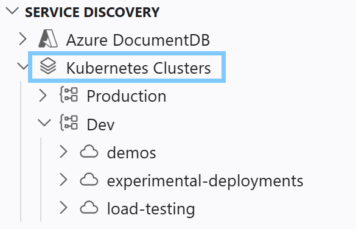
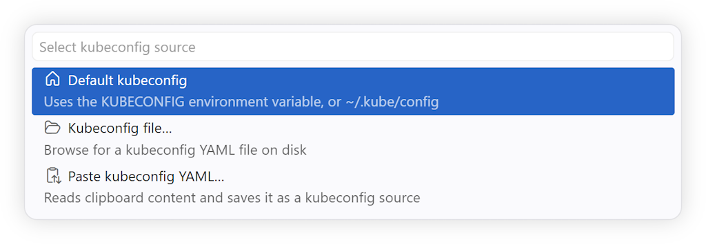
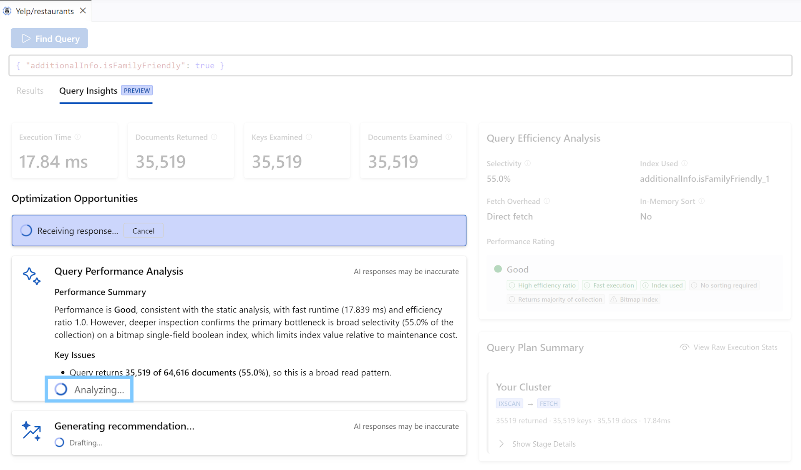

> **Release Notes** - [Back to Release Notes](../index.md#release-notes)

---

# DocumentDB for VS Code Extension v0.9

We are excited to announce the release of **DocumentDB for VS Code Extension v0.9**.

This release expands the extension's multicloud reach with first-class **Kubernetes service discovery**, letting you connect to DocumentDB clusters running on AKS, EKS, GKE, on-premises, or local Kubernetes without writing connection strings or running `kubectl port-forward` manually. It also delivers a dramatically improved **Query Insights experience** with progressive streaming of AI-generated recommendations, so you can follow along as analysis unfolds rather than staring at a spinner for 15+ seconds.

## What's New in v0.9

### ⭐ Kubernetes Service Discovery

We are introducing **Kubernetes service discovery**, bringing true multicloud and hybrid-cloud support to the extension. If you run DocumentDB-compatible clusters in any Kubernetes environment (AKS, EKS, GKE, OpenShift, or local clusters like kind, minikube, k3s, or Docker Desktop), the extension can now find them automatically and connect you without manual configuration.

#### Multiple kubeconfig sources

The new **Kubernetes Clusters** root in the Discovery view lets you register one or more kubeconfig sources side by side, each expanding independently into its own contexts → namespaces → targets subtree:

- **Default kubeconfig**: reads from `KUBECONFIG` or the Kubernetes default path (`~/.kube/config`).
- **Kubeconfig file…**: pick any file from disk.
- **Paste kubeconfig YAML…**: paste YAML directly; a copy is saved in VS Code Secret Storage.
- **Drag-and-drop**: drop a kubeconfig file onto the Discovery view; you are asked to confirm (with an option to preview the file) before it is imported.

#### Auto-discovery and DocumentDB Kubernetes Operator awareness

The extension discovers **DocumentDB Kubernetes Operator (DKO)** managed clusters first, surfacing them as named first-class cluster nodes. Generic services that opt in via an annotation or expose known DocumentDB-compatible ports are discovered as a fallback. No changes to your cluster manifests are required for DKO-managed clusters.

#### Transparent port-forwarding

ClusterIP services are reached through a local port-forward tunnel. The extension establishes and restores the tunnel automatically. When you open a saved connection, the tunnel restarts behind the scenes with no extra clicks. The reachability model is honest and visible:

| Connectivity label | What it means                                                                                                                 |
| ------------------ | ----------------------------------------------------------------------------------------------------------------------------- |
| _(none)_           | LoadBalancer with a public address; the connection string is portable.                                                        |
| `node-routed`      | NodePort or node-addressed LoadBalancer; only reachable if the node is accessible.                                            |
| `port-forward`     | ClusterIP; requires a local port-forward tunnel. The connection string only works on this machine while the tunnel is active. |
| `pending`          | LoadBalancer awaiting an external IP.                                                                                         |

Hover any discovered target for a rich tooltip that explains reachability, lists the service type, port, namespace, and cloud provider.

For ClusterIP targets, the **Copy Connection String** command opens a grouped picker. The **Connection string** group offers connection string variants with and without the password. The **Kubernetes** group adds a ready-to-run `kubectl port-forward` command you can paste to re-establish the same tunnel or share with a teammate. See [Copy Connection String](https://microsoft.github.io/vscode-documentdb/user-manual/copy-connection-string) for details.

#### Per-context display aliases

Context names auto-generated by cloud CLIs (`clusterUser_*`, `arn:aws:eks:*`, `gke_*`) are often opaque. You can now right-click any context and choose **Rename Context…** to assign a friendly display name without touching the underlying kubeconfig file.

#### List and tree view modes

A toggle on each context node lets you switch between:

- **List view** (default): contexts show discovered clusters directly, with the namespace in the description. Empty namespaces are hidden.
- **Tree view**: contexts show namespaces; clusters are nested inside. Empty namespaces are grouped under **Other namespaces**.

For the full feature reference, see the [Kubernetes Service Discovery](https://microsoft.github.io/vscode-documentdb/user-manual/service-discovery-kubernetes) user manual. For a step-by-step walkthrough that creates a local or AKS cluster and validates the full flow, see the [Kubernetes Service Discovery Getting Started guide](https://microsoft.github.io/vscode-documentdb/user-manual/service-discovery-kubernetes-getting-started).

[#621](https://github.com/microsoft/vscode-documentdb/pull/621)

---

### ⭐ Streaming Query Insights

**Query Insights** now streams AI-generated recommendations progressively, eliminating the ~15-second blank wait that existed before. After clicking **Get AI Performance Insights**, results appear as they are generated: you can read the summary while individual index recommendations are still being produced.

Previously, the extension buffered the entire AG-generated response (which took 10–20 s to generate) before parsing and rendering it all at once. Users had no signal that anything was happening past the first second. The new experience connects the model's natural streaming output directly to the UI:

- **Summary** and **educational content** stream in line by line as the model writes them.
- Each **recommendation card** appears as soon as the model completes it, growing the count progressively rather than snapping in at the end.
- **Verification steps** appear at the end after the full response is reconciled.
- The layout never reorders or flickers: cards are pinned to their revealed position as more cards arrive.

For information on which AI model is used and how billing works, see [AI Performance Insights: Model and Billing](https://microsoft.github.io/vscode-documentdb/user-manual/ai-utility-model).

[#711](https://github.com/microsoft/vscode-documentdb/pull/711)

## Key Fixes and Improvements

- **Security: `ws` DoS Vulnerability Fixed**: Upgraded `ws` from 8.20.0 to 8.21.0, which fixes a remote memory exhaustion denial-of-service vulnerability where a peer could crash a server or client using a high volume of tiny WebSocket fragments with modest network traffic. [#744](https://github.com/microsoft/vscode-documentdb/pull/744)

- **Security: `form-data` Encoding Fix**: Upgraded `form-data` from 4.0.5 to 4.0.6, which fixes improper escaping of CR, LF, and `"` characters in multipart field names and filenames. [#745](https://github.com/microsoft/vscode-documentdb/pull/745)

- **Dependency Update: `launch-editor`**: Upgraded `launch-editor` from 2.13.2 to 2.14.1, including a fix for UNC path rejection. [#747](https://github.com/microsoft/vscode-documentdb/pull/747)

## Changelog

See the full changelog entry for this release:
➡️ [CHANGELOG.md#090](https://github.com/microsoft/vscode-documentdb/blob/main/CHANGELOG.md#090)
