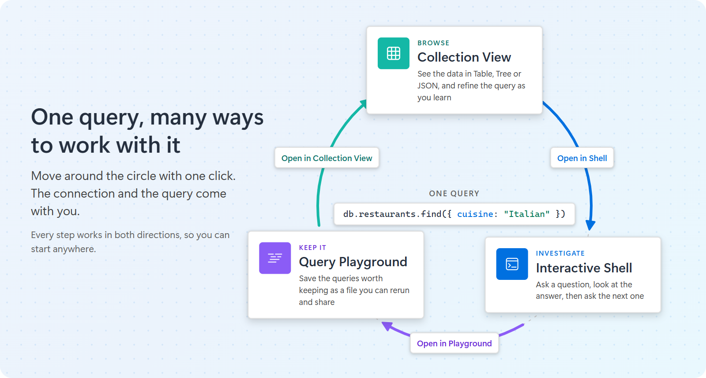
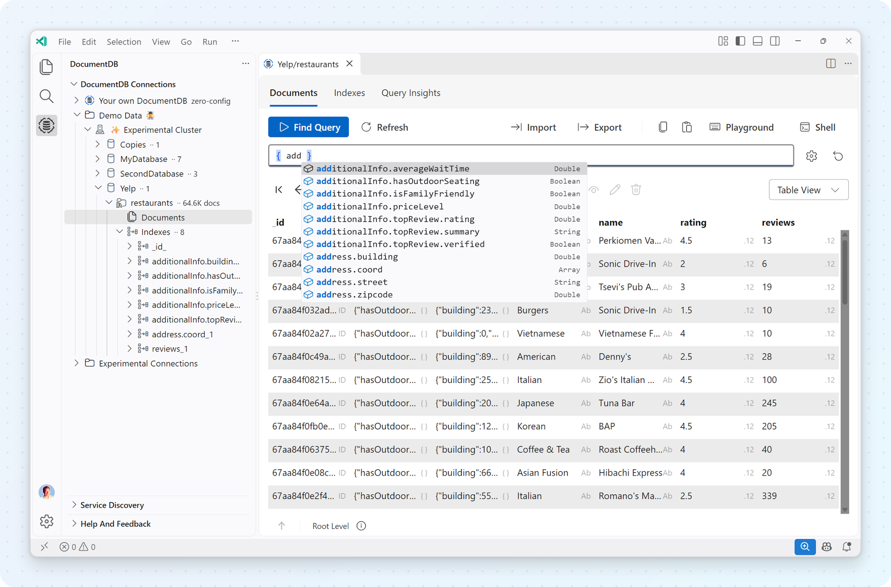
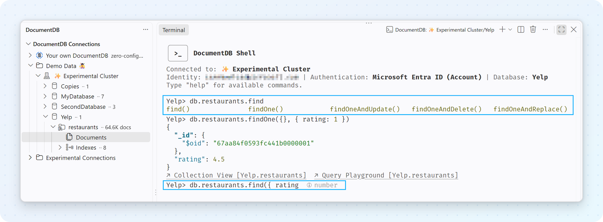
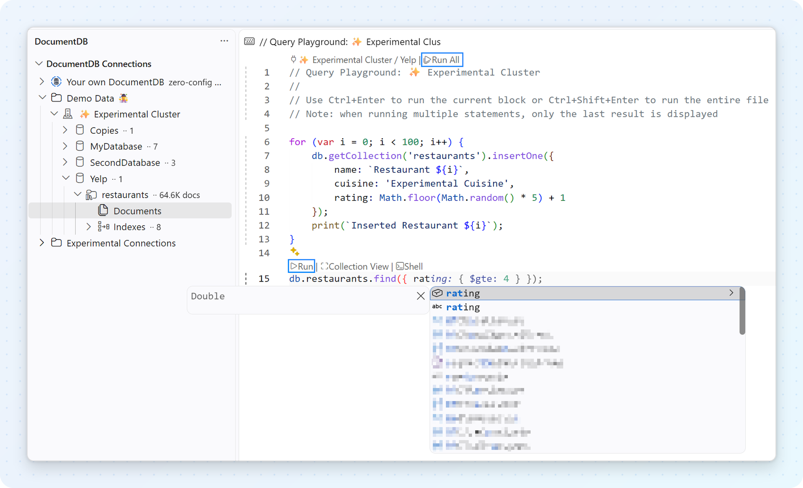
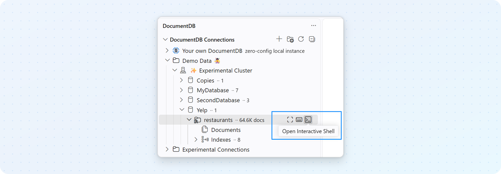
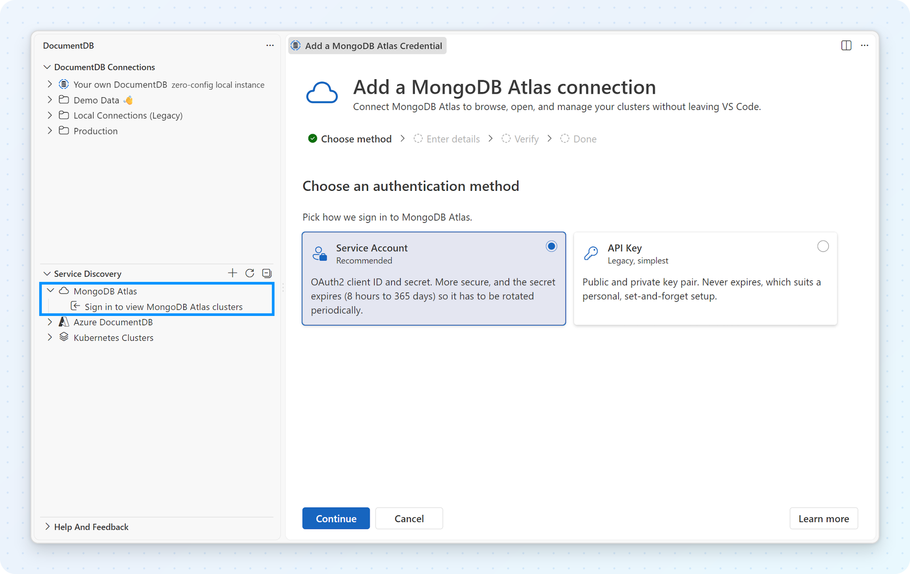
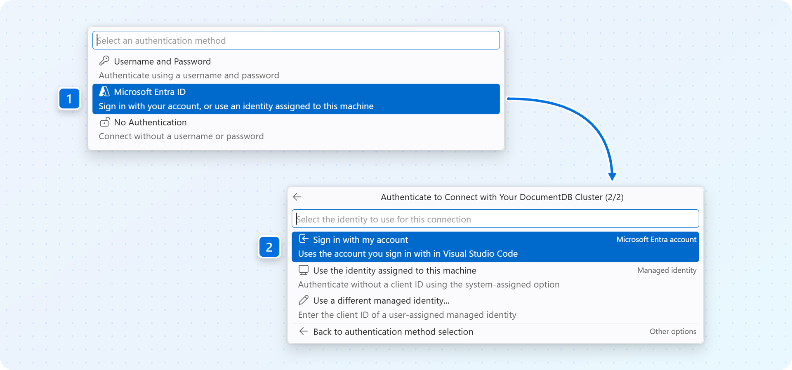
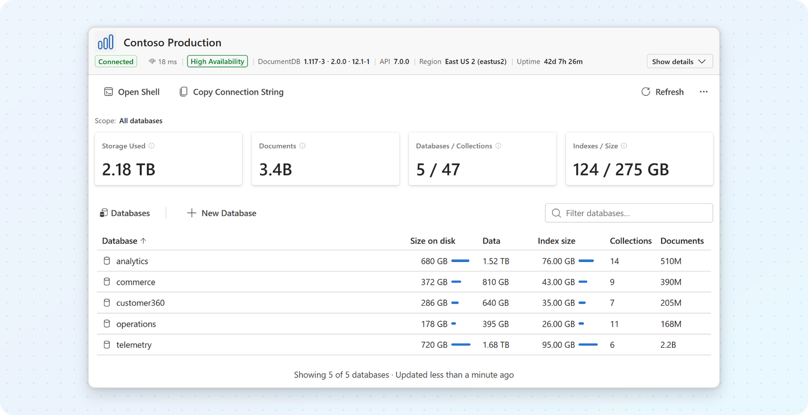
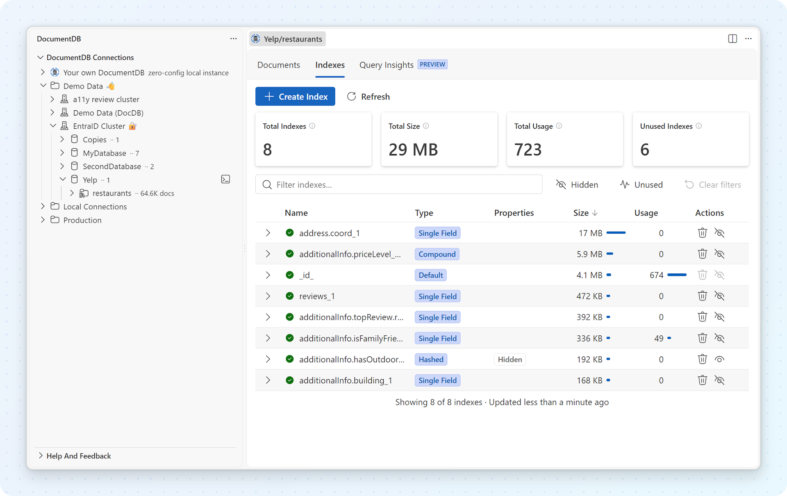
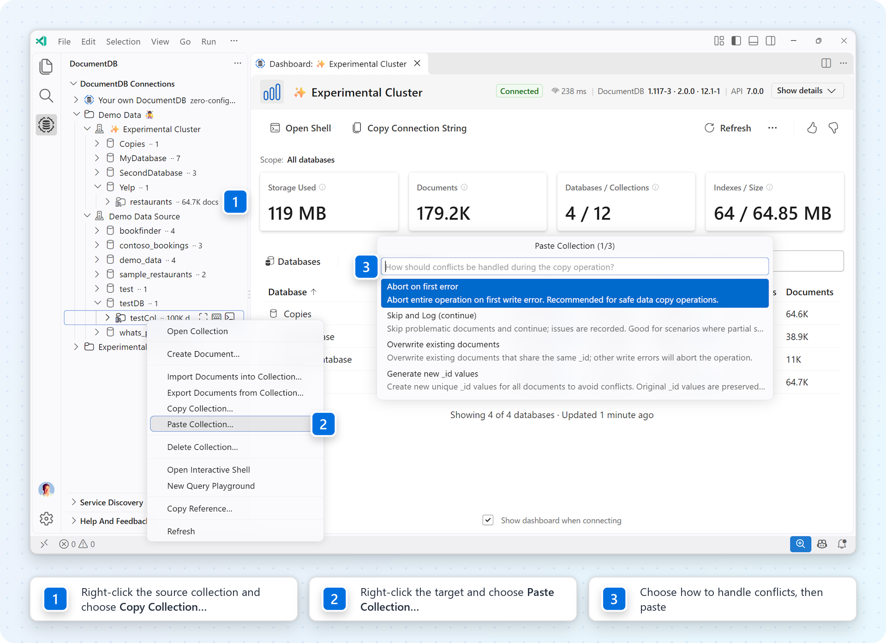

> **Release Notes** - [Back to Release Notes](../index.md#release-notes)

---

# DocumentDB for VS Code Extension v1.0

We are proud to announce **DocumentDB for VS Code Extension v1.0**.

**New here?** DocumentDB for VS Code is a free, open-source **MongoDB GUI** and **DocumentDB GUI**, built right into Visual Studio Code. It works with [DocumentDB](https://documentdb.io/), the open-source document database built on PostgreSQL, with Azure DocumentDB, and with other MongoDB-compatible databases, wherever they run: on your laptop, in Kubernetes, on Azure, or in MongoDB Atlas. You can connect, browse and edit documents, write and run queries, find out why a query is slow, and move data between environments, without switching tools.

We are celebrating this milestone alongside [DocumentDB 1.0](https://documentdb.io/) 🔴 **[Input needed: link to the DocumentDB 1.0 announcement]**, the open-source document database. For the extension, 1.0 recognizes the work that brought these everyday workflows together. This release focuses on fixes and polish; the capabilities below were built across all the releases on the way to 1.0.

If you have been with us along the way, thank you. If you are joining now, here is what you can do with DocumentDB for VS Code today.

 Free and open source. Everything is bundled, so there is nothing else to install.

> 🚀 **Trying DocumentDB 1.0?** Start with [DocumentDB Local](#no-database-yet-start-documentdb-local) to run it on your machine in a few clicks, then [bring your own data with copy and paste](#copy-and-paste-collections).

## A Tour of DocumentDB for VS Code

Working with data usually follows the same arc. It starts with a **connection**: a local database on your laptop, a cluster in Kubernetes, or a service on Azure or MongoDB Atlas. Then you **explore**: you get a feel for what a cluster holds and what the documents look like. And then the **heavier work** begins: writing and refining queries, finding out why one is slow, and moving data to where it's needed.

DocumentDB for VS Code covers that whole arc. We'll start where you meet your data most directly, the query, whether you write it yourself or an AI agent writes it for you, and then show everything around it.

### One Query, Many Ways to Work With It

Sometimes you need to see a few documents before you know what to ask. Sometimes you already know the query. And sometimes a quick investigation turns into something you want to keep. You shouldn't have to pick one way of working for all three, so you don't have to: the same query moves between three connected views with one click.

#### ⭐ Browse: Start with the Data, Not a Blank Query

Open a collection (or select its **Open Collection View** button) to see the **Collection View**, the visual home for your data. Choose the layout that answers your question:

- **Table view** shows one document per row, which makes it easy to compare values across documents.
- **Tree view** unfolds nested objects and arrays, ideal for deeply structured documents.
- **JSON view** shows the documents exactly as stored, ideal for copying or reviewing exact values.

Above the results, a query bar lets you **filter**, choose which fields to return (**projection**), **sort**, **skip** and **limit**. You don't need to remember the syntax: as you type, the editor suggests field names from your collection, suggests the operators that make sense for each field's type (for example `true` and `false` for a boolean field), and shows documentation for each operator. You can type relaxed syntax, such as unquoted keys or `ObjectId()` and `ISODate()`, and typos are flagged with suggestions before you run the query.

From the same view you can open and edit individual documents, and import or export documents as JSON.

> Field suggestions are built locally from the documents you browse and query. No data is sent to an external service for this.

📖 Learn more about filtering, sorting and field suggestions in the [Collection View querying](https://microsoft.github.io/vscode-documentdb/user-manual/collection-view-querying) documentation.

#### ⭐ Investigate: Follow the Next Question in the Interactive Shell

When typing is the fastest way forward, use the **Interactive Shell**, a full shell in the VS Code terminal. Right-click a cluster, database or collection and select **Open Interactive Shell**, and you are connected immediately with the same credentials, including Microsoft Entra ID.

When the shell opens, a header shows which connection, database, user and authentication method you are using. Familiar commands such as `show dbs`, `use <db>`, `show collections`, `help` and `it` work as expected, and variables persist between commands, so you can change a threshold and try again instead of rewriting the whole query. As you type, the shell completes collection names, methods and fields, explains a method before you run it, and suggests bracket notation for collection names that need it (such as `db['orders-2026']`). Press `Ctrl+C` to cancel a long-running command.

📖 Learn more about commands, completion and shortcuts in the [Interactive Shell](https://microsoft.github.io/vscode-documentdb/user-manual/interactive-shell) documentation.

#### ⭐ Keep It: Save Your Work in a Query Playground

A one-off query often becomes something worth keeping. The **Query Playground** gives that work a home in a `.documentdb.js` file connected to a cluster and database.

Write JavaScript such as `db.restaurants.find(...)` or `db.orders.aggregate([...])`, then select **Run** above a block (or press `Ctrl+Enter`) to run it, or **Run All** to run the whole file. Results appear in a panel next to your code, including `console.log()` and `print()` output. Completion knows your collections, methods and fields, and hovering an operator shows its documentation. Because a playground is a regular file, you can keep it in your project, commit it, and share it with your team. You can have several playgrounds open at once, each connected to a different cluster.

📖 Learn more about running, saving and sharing scripts in the [Query Playground](https://microsoft.github.io/vscode-documentdb/user-manual/query-playground) documentation.

#### Switch Approaches Without Starting Over

These are connected workflows, not three separate tools. You never have to copy a query from one to another:

- Each collection in the Connections view has three inline buttons: **Open Collection View**, **New Query Playground** and **Open Interactive Shell**.
- In the **Collection View**, **Open in Playground** and **Open in Shell** take your current filter, projection and sort with you.
- In a **Query Playground**, the **Collection View** and **Shell** links above each block open the same query there.
- In the **Interactive Shell**, links after each result open the collection in the Collection View or a new Query Playground.

> 💡 **Try one investigation three ways.** Open a restaurants collection and look around in Table view. Filter for highly rated restaurants, then switch to Tree view to inspect a nested address. Open the query in the Shell to try a few variations. When you have something worth keeping, move it to a Playground and save it with your project.

Not every script can become a visual query: loops, aggregations and multi-statement blocks may not map to the Collection View.

## And There Is More

Querying is the heart of the extension, but it is not the whole story. Here is everything around it: finding your databases, getting oriented, making queries fast, and moving data where you need it.

---

### ⭐ Connect: Start Where Your Data Already Lives

Before you can work with data, you need a connection. DocumentDB for VS Code gives you several ways to get one, and keeps your connections in the **Connections** view, organized in folders you create (for example "Production" and "Development").

#### No database yet? Start DocumentDB Local

**DocumentDB Local** is the quickest way to try DocumentDB 1.0. If Docker is installed, open the **Connections** view, expand **Your own DocumentDB**, and select **Set up DocumentDB Local**. Keep the defaults and select **Start DocumentDB Local**. The extension pulls the official DocumentDB image, creates a persistent volume so your data survives restarts, generates credentials, picks a free port, loads sample data, and saves a ready-to-use connection. No `docker run` command to assemble.

From then on, start, stop, restart or delete the container from the Connections view. If Docker isn't ready (for example the daemon is stopped, or WSL integration is missing), the setup view tells you exactly what is wrong and what to do. The extension never installs software or runs commands with elevated privileges on your behalf.

📖 Learn how to set up and manage a local database in the [DocumentDB Local quick start](https://microsoft.github.io/vscode-documentdb/user-manual/local-quick-start).

#### Discover your clusters instead of copying connection strings

**Service Discovery** signs in to the platforms you already use and lists the databases it finds there. Pick a cluster from the list and the extension creates the connection for you. Enable only the sources you need in the **Service Discovery** view.

- **Azure**: finds Azure DocumentDB clusters, Azure Cosmos DB for MongoDB (RU) accounts, and MongoDB-compatible databases running on Azure virtual machines. It works across multiple Azure accounts and tenants, and you choose which subscriptions to include.
- **Kubernetes**: reads your kubeconfig and finds DocumentDB clusters on AKS, EKS, GKE, OpenShift, or local clusters such as kind, minikube, k3s and Docker Desktop. Clusters managed by the DocumentDB Kubernetes Operator are recognized automatically. When a cluster is only reachable inside Kubernetes, the extension opens and restores the port forward for you, so you never have to run `kubectl port-forward` by hand.
- **MongoDB Atlas**: lists your Atlas organizations, projects and clusters, so you can connect to MongoDB Atlas from VS Code without copying endpoints. See [Using MongoDB Atlas?](#using-mongodb-atlas-browse-and-connect-to-your-atlas-clusters-in-vs-code) below.

📖 Learn more about [Service Discovery](https://microsoft.github.io/vscode-documentdb/user-manual/service-discovery) in the documentation, including how to discover clusters in [Kubernetes](https://microsoft.github.io/vscode-documentdb/user-manual/service-discovery-kubernetes) and how to choose accounts, tenants and subscriptions for [Azure](https://microsoft.github.io/vscode-documentdb/user-manual/managing-azure-discovery).

#### Using MongoDB Atlas? Browse and connect to your Atlas clusters in VS Code

If your data lives in **MongoDB Atlas**, DocumentDB for VS Code works as a free, open-source MongoDB GUI for your Atlas clusters, right inside your editor. **MongoDB Atlas discovery** brings your Atlas organizations, projects and clusters into the **Service Discovery** view, so you can find a cluster and connect to it without hunting for its endpoint in the Atlas console.

To start, expand **MongoDB Atlas** in the **Service Discovery** view and select **Sign in to view MongoDB Atlas clusters** (or choose **New Connection** > **Service Discovery** > **MongoDB Atlas**). A short guided setup asks how the extension should sign in to Atlas:

- **Service Account** (recommended): an OAuth2 client ID and secret. The secret expires and is rotated periodically, which makes it the more secure choice.
- **API Key**: a public and private key pair, the simplest option for a personal setup.

The credential is verified with Atlas before it is saved, and secrets are kept in VS Code Secret Storage.

What makes it work well day to day:

- **Discovery only, never your database login.** The Atlas credential is used just to find clusters. You still connect to each cluster with your Atlas database user, and the extension never retrieves database passwords.
- **Many organizations at once.** An Atlas API key or service account belongs to one organization, so you can add several side by side. Their clusters appear together in one view, and you can add, rotate, retry or sign out of each credential in **Manage MongoDB Atlas Credentials**.
- **Tree or list.** Browse organizations, then projects, then clusters, or switch to a flat list where each cluster shows its organization and project.
- **Honest cluster status.** Paused, creating, updating, repairing and deleting clusters are labeled, so you don't wait on a connection that cannot succeed. **Open in MongoDB Atlas** takes you straight to the cluster in the Atlas console, for example to resume a paused cluster.

Once connected, an Atlas cluster works like any other connection: browse it in the Collection View, query it in the Shell or a Playground, check performance with Query Insights, manage indexes, or copy a collection to DocumentDB Local for local development.

📖 Learn more about [MongoDB Atlas discovery](https://microsoft.github.io/vscode-documentdb/user-manual/service-discovery-mongodb-atlas) in the documentation, including how to [browse and connect to Atlas clusters](https://microsoft.github.io/vscode-documentdb/user-manual/service-discovery-mongodb-atlas-browse) and how to [manage your Atlas credentials](https://microsoft.github.io/vscode-documentdb/user-manual/service-discovery-mongodb-atlas-credentials).

#### Working in Azure every day? Use the Azure Resources view

If you already manage your cloud resources with the [Azure Resources](https://marketplace.visualstudio.com/items?itemName=ms-azuretools.vscode-azureresourcegroups) extension, you don't need a separate place to find your databases. DocumentDB for VS Code plugs directly into the **Azure** view: your Azure DocumentDB clusters and Azure Cosmos DB for MongoDB (RU) accounts appear in the same resource tree as your App Services, Functions and storage accounts, grouped the way you are used to (by subscription, resource group or resource type).

Expand an Azure DocumentDB cluster there and it opens into its databases and collections, with the full DocumentDB for VS Code experience one click away: open the Collection View, start a Query Playground or open the Interactive Shell. There is no extra connection to create and no connection string to copy. If Azure is the center of your work, this is likely the most natural way in. If you also work with databases outside Azure, the **Service Discovery** and **Connections** views bring everything together in one place.

#### Or paste a connection string

You can always add a connection the classic way, with a connection string. Sign in with a username and password, with **Microsoft Entra ID** (your Azure account, or a managed identity when VS Code runs on an Azure VM) for supported Azure connections, or with no authentication for local development databases.

📖 Learn how to connect from an Azure virtual machine without a password in the [managed identity](https://microsoft.github.io/vscode-documentdb/user-manual/connect-with-managed-identity) documentation.

---

### ⭐ See: Get Oriented with the Cluster Dashboard

The first question on an unfamiliar cluster is usually "what's in here?" Open the **Cluster Dashboard** from any cluster in the Connections view to see the answer on one page.

At the top, the dashboard shows the cluster's identity, whether it is connected, the round-trip time, and on Azure, its high-availability configuration. Below, an inventory lists every database and collection with its storage size, data size, index size and document count. You can sort and filter the list, drill into a database, create or delete databases and collections, open a shell, or copy the connection string.

The dashboard is a snapshot you refresh on demand, not a live monitor. If the server can't report a number, you see a clear retry state instead of a guess.

---

### ⭐ Optimize: Find Out Why a Query Is Slow, and Fix It

#### Query Insights

When the question becomes "why does this query do so much work?", run it in the Collection View and open the **Query Insights** tab. Insights work in three stages, each going deeper:

1. **Query plan**: an immediate view of how the database intends to run the query, such as whether it uses an index or scans the whole collection. Nothing is re-run.
2. **Execution statistics**: the query runs again with full statistics, showing how many documents and index keys were examined, how long it took, and whether results were sorted in memory. A rating of Good, Fair or Poor helps you spot a problem at a glance.
3. **AI recommendations**: select **Get AI Performance Insights** and GitHub Copilot analyzes the query shape and statistics, explains what is happening, and recommends changes, such as creating or hiding an index, which you can apply directly. The answer streams in as it is written.

AI recommendations require GitHub Copilot. The extension sends the query shape and execution statistics, not your documents.

📖 Learn more about how the AI recommendations work in the [index advisor](https://learn.microsoft.com/en-us/azure/documentdb/index-advisor) documentation on Microsoft Learn.

#### Index management

Indexes decide whether a query is fast or slow. The **Indexes** tab in the Collection View keeps the next step close to the query: it lists every index on the collection with its size and how often it is used, and highlights indexes that are unused or hidden.

From there you can create new indexes with a guided form (standard, wildcard, and on databases that support them, vector indexes using DiskANN, HNSW or IVF), preview the definition as JSON before you create it, and delete indexes you no longer need. Not sure if an index is safe to remove? **Hide** it first: the database stops using it but keeps it, so you can check the impact and unhide it in one click. The `_id` index is protected from accidental changes.

---

### ⭐ Move: Take Your Data Where You Need It

#### Copy and paste collections

Need a copy of a collection for testing, or want to move sample data from your laptop to a cloud cluster? Copy and paste collections the same way you copy files. Right-click a collection and select **Copy Collection…**, then right-click a database, on the same cluster or any other, and select **Paste Collection…**.

If the target collection already has documents, you choose what happens when two documents share the same `_id`: **Abort on first error**, **Skip and Log (continue)**, **Overwrite existing documents**, or **Generate new _id values** for every pasted document (the original is kept in `_original_id`). You can also choose to recreate the collection's indexes on the target.

You can copy indexes on their own, too: select **Copy Indexes…** on a collection's Indexes node, then **Paste Indexes…** on another collection to apply the same indexes without moving any documents.

Copy and paste streams data through your machine, so it is designed for development and small to medium datasets. For production migrations of large volumes, use a dedicated migration service.

📖 Learn more about conflict handling, index copying and limits in the [copy and paste](https://microsoft.github.io/vscode-documentdb/user-manual/copy-and-paste) documentation.

#### Import and export

Import documents from JSON files into a collection, or export documents to JSON.

---

> Available commands, sign-in methods, metrics and index types depend on the connected database and your permissions. Microsoft Entra ID and managed identity apply to supported Azure connections. AI Performance Insights requires GitHub Copilot; the three core query workflows do not.

## The Road to 1.0

We started with the visual way. The first release, a little over a year ago, let you browse documents in Table, Tree and JSON views. For more complex tasks we then added the Interactive Shell and the Query Playground, with autocompletion everywhere. And we topped it off with helpers that make the work easier: Query Insights, index management and the Cluster Dashboard. Along the way, the extension also learned to find your databases on Azure, in Kubernetes and in MongoDB Atlas, and to start one for you with DocumentDB Local.

We didn't get here alone. Eleven community developers contributed nearly 30 pull requests along the way, from alphabetical collection sorting in v0.7 to shard keys in tooltips, contextual playground filenames and sign-in for sovereign Azure clouds. Thank you, [@VanitasBlade](https://github.com/VanitasBlade), [@vaibh123540](https://github.com/vaibh123540), [@bgaeddert](https://github.com/bgaeddert), [@Green00101](https://github.com/Green00101), [@CalvinMagezi](https://github.com/CalvinMagezi), [@Jah-yee](https://github.com/Jah-yee), [@Enocko](https://github.com/Enocko), [@lte-z](https://github.com/lte-z), [@omribz156](https://github.com/omribz156), [@Jacquelinezhong](https://github.com/Jacquelinezhong) and [@hanhan761](https://github.com/hanhan761).

Each release has its own notes in the [release notes index](../index.md#release-notes).

## Key Fixes and Improvements

> 🔴 **Input needed:** fill in the user-visible fixes shipped in 1.0, grouped by area, with issue or pull request links. Delete this note when done.

- **🔴 [Fix area]**
  - 🔴 [One line per user-visible fix, with issue or pull request links]
- **🔴 [Fix area]**
  - 🔴 [Fix]
- **Dependency and security updates**
  - 🔴 [Update]

## Thank You

Every release on the way to 1.0 was also shaped by the people who took the time to tell us what was broken, confusing or missing. Thank you for your issue reports, accessibility reviews and bug bash findings, [@majelbstoat](https://github.com/majelbstoat), [@MattParkerDev](https://github.com/MattParkerDev), [@DhruvC-Affine](https://github.com/DhruvC-Affine), [@cveld](https://github.com/cveld), [@markjbrown](https://github.com/markjbrown), [@ahmedyoussef-au](https://github.com/ahmedyoussef-au), [@alencheung](https://github.com/alencheung), [@LuchiLucs](https://github.com/LuchiLucs), [@sevoku](https://github.com/sevoku), [@madebygps](https://github.com/madebygps), [@diberry](https://github.com/diberry), [@kapilvaishna](https://github.com/kapilvaishna), [@AnKushSingh05](https://github.com/AnKushSingh05), [@sajeetharan](https://github.com/sajeetharan), [@khelanmodi](https://github.com/khelanmodi), [@sivethe](https://github.com/sivethe), [@BChoudhury-ms](https://github.com/BChoudhury-ms) and [@alaye-ms](https://github.com/alaye-ms), and to everyone who joined a bug bash, tried a preview or shared feedback.

Keep it coming: tell us what you'd like next on [GitHub](https://github.com/microsoft/vscode-documentdb/issues), or through the **Help and Feedback** view in the extension.

## Make Your Next Query in VS Code

Install or update DocumentDB for VS Code, connect to a database or set up DocumentDB Local, and open a collection. Start visually, try the Shell, or create a Playground. The best place to start is the question you want to answer.

[Read the documentation](https://microsoft.github.io/vscode-documentdb/) · [DocumentDB](https://documentdb.io/) · [GitHub repository](https://github.com/microsoft/vscode-documentdb)

## Changelog

See the full changelog entry for this release:
➡️ [CHANGELOG.md#100](https://github.com/microsoft/vscode-documentdb/blob/main/CHANGELOG.md#100) 🔴 **[Input needed: confirm the anchor once the 1.0.0 changelog entry exists]**
