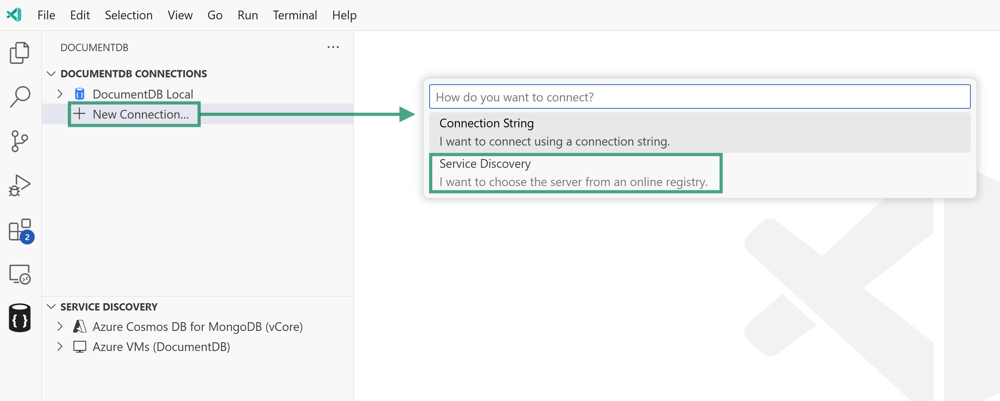

> **User Manual** &mdash; [Back to User Manual](../index#user-manual)

---

# Azure CosmosDB for MongoDB (RU) Service Discovery Plugin

The **Azure CosmosDB for MongoDB (RU)** plugin is available as part of the [Service Discovery](./service-discovery) feature in DocumentDB for VS Code. This plugin helps you find and connect to Azure Cosmos DB accounts provisioned with Request Units (RU) for the MongoDB API by handling authentication, resource discovery, and connection creation from inside the extension.

> **📘 Managing Azure Resources**: This provider shares common Azure management features with other Azure-based providers. See [Managing Azure Discovery (Accounts, Tenants, and Subscriptions)](./managing-azure-discovery) for detailed information about:
>
> - Managing Azure accounts and credentials
> - Filtering by tenants and subscriptions
> - Troubleshooting common issues

## How to Access

You can access this plugin in two ways:

- From the `Service Discovery` panel in the extension sidebar.
- When adding a new connection, select the `Azure CosmosDB for MongoDB (RU)` option.

## How It Works

When you use the Azure CosmosDB for MongoDB (RU) plugin, the extension performs the following steps:

1. **Authentication:**
   The plugin uses your Azure credentials available in VS Code. If needed, it will prompt you to sign in via the standard Azure sign-in flows. See [Managing Azure Accounts](./managing-azure-discovery#managing-azure-accounts) for details on managing your credentials.

2. **Resource Filtering (Service Discovery Panel):**
   When accessing this plugin from the Service Discovery panel, you can control which resources are displayed by filtering tenants and subscriptions. Click the funnel icon next to the provider name to configure filters. See [Filtering Azure Resources](./managing-azure-discovery#filtering-azure-resources) for more information.

3. **Subscription and Account Discovery:**
   - **From Service Discovery Panel**: The plugin lists subscriptions based on your configured filters, allowing you to browse RU-based Cosmos DB accounts within selected subscriptions.
   - **From Add New Connection Wizard**: All subscriptions from all tenants are shown without pre-filtering. You select one subscription to view its resources.

4. **Account Discovery:**
   The provider queries Azure using the CosmosDB Management Client and filters results by the MongoDB "kind" for RU-based accounts. This ensures the list contains accounts that support the MongoDB API under RU provisioning.

5. **Connection Options:**
   - Expand an account entry to view databases and connection options.
   - Save an account to your `DocumentDB Connections` list using the context menu or the save icon next to its name.
   - When connecting or saving, the extension will extract credentials or connection details from Azure where available. If multiple authentication methods are supported, you will be prompted to choose one.

For an overview of how service discovery works, see the [Service Discovery](./service-discovery) documentation. For details on managing your Azure accounts and subscriptions, refer to the [Managing Azure Subscriptions](./managing-azure-discovery) guide.

## Managing Credentials and Filters

This provider supports the following management features:

- **Manage Credentials**: View and manage Azure accounts used for service discovery. Right-click the provider or click the gear icon.
- **Filter Resources**: Control which tenants and subscriptions are displayed. Click the funnel icon next to the provider name.
- **Refresh**: Reload the resource list after making changes. Click the refresh icon.

For detailed instructions on these features, see [Managing Azure Discovery (Accounts, Tenants, and Subscriptions)](./managing-azure-discovery).

## Feedback and Contributions

If you have suggestions for improving this provider or would like to add support for additional resource types, please [join the discussion board](https://github.com/microsoft/vscode-documentdb/discussions) and share your feedback.

---
