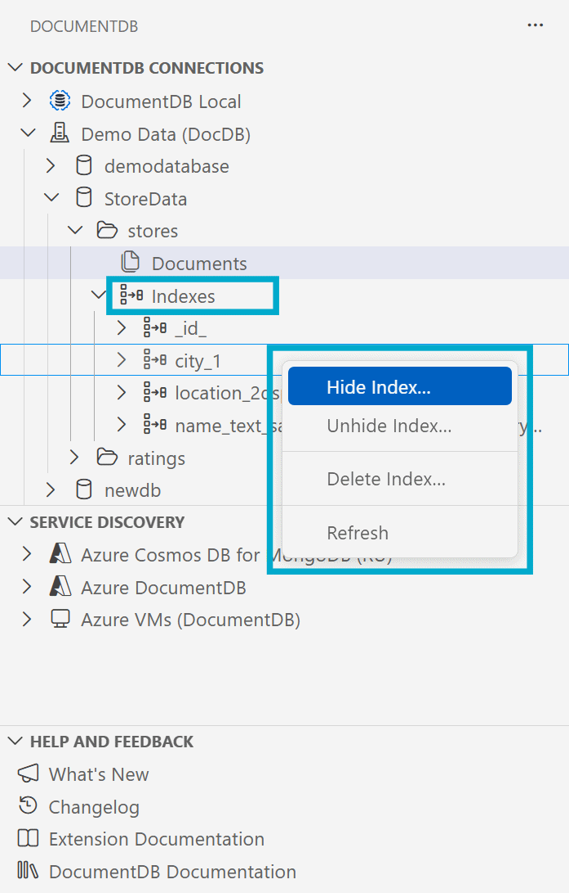

> **Release Notes** — [Back to Release Notes](../index.md#release-notes)

---

# DocumentDB for VS Code Extension v0.6

We are excited to announce the release of **DocumentDB for VS Code Extension v0.6**. This is a landmark update for our DocumentDB and MongoDB GUI, focused on query optimization and developer productivity. It introduces a powerful new **Query Insights with Performance Advisor**, enhances query authoring capabilities, and improves index management for developers working with DocumentDB and MongoDB API databases.

## What's New in v0.6

### ⭐ Query Insights with Performance Advisor

We are introducing a major new feature: **Query Insights with Performance Advisor**. This powerful tool helps you understand and optimize your queries directly within VS Code. When you run a `find` query against your DocumentDB or MongoDB API database, a new **"Query Insights"** tab appears, providing a three-stage analysis of your query's performance.

- **Stage 1: Initial Performance View**
  The first stage provides an immediate, low-cost static analysis of your query. It visualizes the query plan, showing how the database intends to execute your query. This helps you understand performance bottlenecks and the query's processing stages without re-running it.

- **Stage 2: Detailed Execution Analysis**
  For a deeper dive, the second stage runs a detailed execution analysis using `executionStats` to gather authoritative metrics. You'll see precise counts for documents and keys examined, server-side execution time, and a detailed breakdown of each stage in the execution plan. This provides clear insights into how your query actually performed.

  The complex JSON response from the database is translated into an easy-to-comprehend chart, making it simple to visualize the query's execution flow.

  Additionally, a **Query Efficiency Analysis** card provides a quick performance assessment. It highlights key aspects of the query's execution, such as the execution strategy, index usage, and whether an in-memory sort occurred. A performance rating (Good, Fair, or Poor) helps you quickly identify an inefficient or slow query.

- **Stage 3: AI-Powered Recommendations with GitHub Copilot**
  The final stage brings the power of AI to your query optimization workflow. By clicking `Get AI Performance Insights`, the extension sends the query shape and execution statistics to a service powered by **GitHub Copilot**. For more details, please see our [documentation](https://learn.microsoft.com/en-us/azure/documentdb/index-advisor).

  The AI assistant provides:

  > 🕵️‍♂️ **Analysis**
  >
  > A summary of the query's performance.

  > 📈 **Actionable Recommendations**
  >
  > Suggestions for creating, hiding, or unhiding indexes to improve performance, with an option to apply them directly.

  > 🎓 **Detailed Explanations**
  >
  > A breakdown of the execution plan to help you understand how the query was processed.

The **"Query Insights"** feature helps solve performance issues and educates users on query best practices for DocumentDB and MongoDB API databases.

### ⭐ Improved Query Specification

We've enhanced the query authoring experience to support more sophisticated queries. Previously, you could only specify the `filter` for a `find` query. Now, you have full control to include `projection`, `sort`, `skip`, and `limit` parameters directly in the query editor, enabling more complex data retrieval without leaving VS Code.

The `projection` and `sort` fields also support the same rich autocompletion that was previously available for the `filter` field.

### ⭐ Index Management from the Tree View

Managing your indexes is now easier and more intuitive than ever. You can now `drop`, `hide`, and `unhide` indexes directly from the Connections View. Simply expand a database and collection, then expand the "Indexes" node to see all indexes on that collection.

Hovering over an index will show you its details, and the context menu provides the available management operations. This direct workflow helps you maintain your indexes efficiently right from the explorer.

## Key Fixes and Improvements

- **Improved UI element visibility**
  - Fixed an issue where the autocomplete list in the query area could be hidden behind other UI elements.
  - Corrected a problem where tooltips in the table and tree views were sometimes displayed underneath the selection indicator.

## Changelog

See the full changelog entry for this release:
➡️ [CHANGELOG.md#060](https://github.com/microsoft/vscode-documentdb/blob/main/CHANGELOG.md#060)

---

## Patch Release v0.6.1

This patch release introduces feedback optimization and fixes a broken link.

### What's Changed in v0.6.1

#### **Feedback Optimization** ([#392](https://github.com/microsoft/vscode-documentdb/pull/392))

Introduces privacy consent and feedback signal controls for the Query Insights feature, primarily to ensure compliance with organizational data protection requirements and user telemetry settings. It also disables survey functionality and refines the feedback dialog UI.

#### **Privacy Policy Link Update** ([#388](https://github.com/microsoft/vscode-documentdb/pull/388))

Updated the outdated privacy policy link in the README to the current Microsoft privacy statement URL.

### Changelog

See the full changelog entry for this release:
➡️ [CHANGELOG.md#061](https://github.com/microsoft/vscode-documentdb/blob/main/CHANGELOG.md#061)
