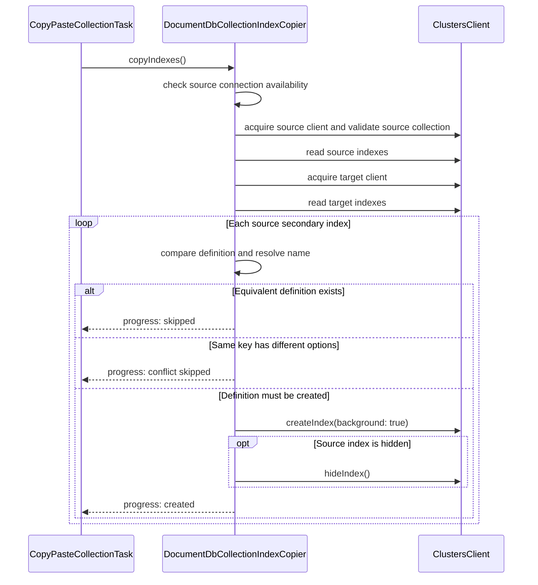

# Index Copy Implementation

This folder contains the DocumentDB API implementation used by collection copy and dedicated
index-only copy/paste.

This README describes the code as it exists. Durable architecture decisions and future boundaries
are recorded in the
[Copy and Paste Collections feature knowledge base](../../../../../docs/ai-and-plans/features/copy-paste-collections/README.md).

## Current shape

`CopyPasteCollectionTask` receives one optional `CollectionIndexCopier`. The provider-neutral
interface exposes source counting and the complete copy operation:

```typescript
interface CollectionIndexCopier {
    getSourceIndexSummary(options?: GetSourceIndexSummaryOptions): Promise<SourceIndexSummary>;
    copyIndexes(options?: CopyIndexesOptions): Promise<IndexCopyResult>;
}
```

`DocumentDbCollectionIndexCopier` implements that boundary for DocumentDB API collections. It owns
the source and target endpoint descriptors, acquires their clients, and keeps database-specific
index definitions private. The task receives neither clients nor index definitions.

`CopyIndexesTask` also uses the shared `CollectionEndpoint` descriptor, without importing the concrete
copier, client, or credential cache. Its injected copier owns execution-time source validation and
connection handling. `DocumentDbCollectionEndpoint` remains an alias for existing DocumentDB callers.

## Responsibilities

`DocumentDbCollectionIndexCopier` owns:

- validating source connection availability and collection existence at copy execution time, before
    acquiring the target client;
- reading the collection's index catalog through `ClustersClient`;
- including the built-in `_id` index in the source catalog summary count;
- excluding the built-in `_id` index from copying and copy progress;
- preserving key order and supported index options, including DocumentDB vector options;
- comparing definitions independently of names and mutable visibility;
- ignoring server-generated catalog versions when comparing semantic definitions;
- skipping equivalent target definitions;
- skipping same-key definitions whose semantic options conflict;
- resolving different-key name collisions with deterministic `_copy`, `_copy_2`, and later suffixes;
- creating indexes sequentially with background creation requested;
- applying hidden visibility after creation;
- preserving `IndexVisibilityError` when a created index cannot be restored to hidden state;
- stopping before the next index after cancellation;
- selecting optional source names after the source read while preserving catalog order;
- rejecting duplicate or unresolved requested names before target work;
- denying TTL and unique indexes by default unless a dedicated index-only caller explicitly opts in;
- reporting created, skipped, conflicting, renamed, and cancellation counts.

Index lists are intentionally bounded arrays rather than streams. Creation is sequential so
progress, cancellation, and failures have deterministic ordering.

## Copy flow



The target collection is created by the document writer during task initialization. Index copying
runs after initialization and before document streaming. An index creation failure fails the task;
indexes already created are not rolled back.

For dedicated index-only paste, `CopyIndexesTask` passes one selected name, a selected-name subset,
or the names resolved from the parent scope before confirmation. It explicitly allows TTL and unique definitions,
maps evaluated indexes to determinate progress, and uses the same comparison, naming, creation,
visibility, and cancellation path shown above. Collection paste leaves that option denied.

Unavailable-source and missing-collection failures preserve their localized messages and surface as
`SourceConnectionUnavailableError` and `SourceCollectionNotFoundError`. The index task reports their
names through its generic execution-failure telemetry rather than performing provider checks during
initialization. Cancellation while waiting for source validation stops before target access.

## Counting behavior

The paste wizard asks whether indexes should be copied before constructing a service to count them.
If the user chooses document-only paste, no index API is called. This ordering is a product invariant,
not just an optimization. The displayed count includes every source catalog entry, including `_id`;
the copy operation still processes only secondary indexes.

## Boundary scope

The task-level boundary is implemented by one optional `CollectionIndexCopier`. Its first
implementation is DocumentDB API-specific and owns both endpoints.

See
[decision 0002](../../../../../docs/ai-and-plans/features/copy-paste-collections/decisions.md#0002--use-one-optional-collectionindexcopier-at-the-task-boundary)
for the rationale and
[decision 0003](../../../../../docs/ai-and-plans/features/copy-paste-collections/decisions.md#0003--defer-a-portable-index-model-until-cross-database-index-migration-is-required)
for the explicit cross-database revisit condition.

## Files

- `CollectionIndexCopier.ts` — provider-neutral task contract and shared progress/result types
- `DocumentDbCollectionIndexCopier.ts` — DocumentDB API endpoint ownership, index comparison, and
  creation
- `createIndexCopier.ts` — endpoint-based construction shared by both wizards
- `DocumentDbCollectionIndexCopier.test.ts` — source-only counting, equivalence, options, vector
  indexes, source-name filtering, background creation, hidden indexes, collisions, failures, and
  cancellation

## Related documentation

- [Feature design](../../../../../docs/ai-and-plans/features/copy-paste-collections/design.md)
- [Feature decisions](../../../../../docs/ai-and-plans/features/copy-paste-collections/decisions.md)
- [Data API architecture](../README.md)
- [Task Service architecture](../../README.md)
